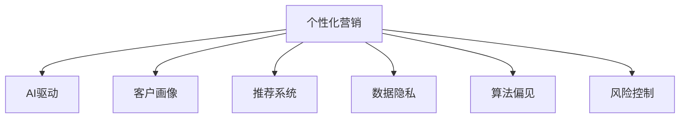

                 

# AI驱动的个性化营销：机遇与风险

> 关键词：个性化营销, AI驱动, 客户画像, 推荐系统, 数据隐私, 算法偏见, 风险控制

## 1. 背景介绍

### 1.1 问题由来

随着数字化转型的加速，企业越来越重视利用数据驱动决策，提升营销效率和用户体验。个性化营销作为精准营销的重要手段，通过分析用户行为和偏好，提供定制化的产品和服务，显著提升了转化率和客户满意度。而人工智能（AI）技术的介入，特别是大数据、机器学习、深度学习等技术的广泛应用，使得个性化营销的实现变得更为高效和智能化。

### 1.2 问题核心关键点

AI驱动的个性化营销的核心在于利用先进的算法和大数据技术，对客户行为进行深入分析和预测，生成个性化的推荐结果。核心步骤包括客户画像构建、推荐模型训练、风险控制等。

AI驱动的个性化营销面临的挑战主要包括：数据隐私保护、算法偏见、数据安全、实时性要求等。在应对这些挑战时，需要平衡个性化营销带来的商业价值与可能带来的风险。

### 1.3 问题研究意义

通过深入研究AI驱动的个性化营销，可以更好地理解其背后的技术和原理，掌握如何构建高效、安全的推荐系统，并防范可能带来的风险，为企业的数字化转型提供重要参考。

## 2. 核心概念与联系

### 2.1 核心概念概述

为更好地理解AI驱动的个性化营销，本节将介绍几个密切相关的核心概念：

- 个性化营销：指通过数据分析，了解和预测客户需求，提供定制化服务和产品的营销策略。
- AI驱动：指利用人工智能技术（如机器学习、深度学习、自然语言处理等）实现自动化决策和分析，提升营销效率。
- 客户画像：指通过对客户历史行为数据的分析，生成客户特征标签，形成客户行为的概貌。
- 推荐系统：通过分析用户历史行为和偏好，生成个性化推荐结果的系统。
- 数据隐私：指保护用户个人信息不被滥用或泄露的技术手段。
- 算法偏见：指算法模型在训练过程中，由于数据偏差或模型设计问题，导致输出结果不公平或不准确的现象。
- 风险控制：指在个性化营销过程中，通过技术手段和合规措施，防范可能出现的风险。

这些核心概念之间的逻辑关系可以通过以下Mermaid流程图来展示：



这个流程图展示了个性化营销的关键环节及其与其他概念之间的联系：

1. 个性化营销通过AI技术实现高效决策。
2. 客户画像和推荐系统是个性化营销的主要工具。
3. 数据隐私和算法偏见是个性化营销需要关注的重要问题。
4. 风险控制是保证个性化营销可持续发展的关键措施。

## 3. 核心算法原理 & 具体操作步骤

### 3.1 算法原理概述

AI驱动的个性化营销主要利用机器学习和深度学习技术，对客户行为数据进行分析，构建客户画像和推荐模型，生成个性化的推荐结果。其核心算法原理可以归纳为以下几个步骤：

1. 数据收集与预处理：收集客户历史行为数据，并进行清洗、归一化等预处理。
2. 特征提取：通过特征工程，将原始数据转换为模型可用的特征向量。
3. 模型训练：利用监督学习算法（如逻辑回归、决策树、随机森林、神经网络等）或无监督学习算法（如聚类、降维等）训练推荐模型。
4. 推荐生成：使用训练好的模型对新客户行为进行预测，生成个性化推荐结果。
5. 风险控制：通过监控模型输出和用户反馈，评估推荐效果，调整模型参数，防范可能的风险。

### 3.2 算法步骤详解

#### 3.2.1 数据收集与预处理

数据收集与预处理是个性化营销的基础。具体步骤包括：

1. 数据采集：通过网站、移动应用、社交媒体、CRM系统等渠道，收集客户历史行为数据，如浏览记录、购买历史、搜索关键词、评分反馈等。
2. 数据清洗：去除重复、缺失或异常数据，处理数据格式不一致问题，确保数据质量。
3. 数据归一化：对不同特征值进行标准化或归一化处理，使模型输入更加一致。
4. 数据划分：将数据划分为训练集、验证集和测试集，以便模型训练和性能评估。

#### 3.2.2 特征提取

特征提取是将原始数据转换为模型可用的特征向量的过程，常见的特征工程方法包括：

1. 特征选择：通过特征选择算法（如互信息、卡方检验等），选择最具有代表性的特征。
2. 特征降维：通过降维算法（如PCA、LDA等）减少特征维度，提升模型效率。
3. 特征交叉：生成更高阶的特征组合，捕捉数据中的交互信息。
4. 特征编码：将分类特征转换为数值特征，便于模型处理。

#### 3.2.3 模型训练

模型训练是构建个性化推荐系统的核心步骤。常见的推荐算法包括：

1. 基于协同过滤的推荐算法：如矩阵分解、基于用户的协同过滤、基于物品的协同过滤等，通过计算用户和物品的相似度生成推荐。
2. 基于内容的推荐算法：如内容基推荐、标签推荐等，通过分析物品的属性和标签生成推荐。
3. 混合推荐算法：结合多种推荐算法，综合生成推荐结果，提升推荐效果。
4. 深度学习推荐算法：如深度神经网络、RNN、CNN等，通过深层神经网络模型捕捉用户行为特征。

#### 3.2.4 推荐生成

推荐生成是将训练好的模型应用于新客户行为数据的过程。具体步骤包括：

1. 数据输入：将新客户的行为数据输入模型，生成预测向量。
2. 相似度计算：计算预测向量与所有物品向量之间的相似度。
3. 推荐排序：根据相似度对所有物品进行排序，生成推荐结果。
4. 推荐展示：将推荐结果展示给客户，并提供反馈机制。

#### 3.2.5 风险控制

风险控制是保证个性化营销可持续发展的重要环节。具体步骤包括：

1. 异常检测：监控推荐结果和用户反馈，检测异常行为。
2. 模型评估：定期对模型进行评估，检测算法偏见和数据偏差。
3. 参数调整：根据评估结果调整模型参数，优化推荐效果。
4. 合规审查：确保推荐系统符合相关法律法规，保护用户隐私和数据安全。

### 3.3 算法优缺点

AI驱动的个性化营销具有以下优点：

1. 提升转化率：通过个性化推荐，客户更容易发现符合其需求的商品，提高购买意愿和转化率。
2. 提高客户满意度：个性化推荐能够提供更符合客户偏好的商品，提升客户满意度。
3. 优化库存管理：个性化推荐可以预测销售趋势，优化库存管理，降低库存成本。
4. 节省营销成本：个性化推荐能够减少无效广告和促销活动，节省营销成本。

同时，该方法也存在一定的局限性：

1. 数据隐私问题：个性化营销依赖大量客户数据，数据隐私保护成为重要问题。
2. 算法偏见问题：模型可能存在数据偏见或算法设计问题，导致推荐结果不公平或不准确。
3. 数据质量要求高：推荐系统的质量依赖于数据质量，数据不完整或不准确可能导致模型效果不佳。
4. 实时性要求高：推荐系统需要实时处理用户行为数据，对系统响应速度和计算资源要求较高。

### 3.4 算法应用领域

AI驱动的个性化营销广泛应用于电商、金融、广告、媒体等多个行业领域。具体应用场景包括：

- 电商推荐：通过分析用户浏览、购买记录，推荐相关商品或优惠券。
- 金融风控：通过分析用户交易行为，识别异常交易，防范金融风险。
- 广告定向：通过分析用户行为数据，精准定向广告投放，提升广告效果。
- 媒体内容推荐：通过分析用户偏好，推荐新闻、视频、音乐等内容。

此外，个性化营销在医疗、教育、娱乐等领域的潜力也在逐渐显现。随着AI技术的发展，个性化营销的应用场景将不断拓展，为各行各业带来新的商业机遇。

## 4. 数学模型和公式 & 详细讲解 & 举例说明

### 4.1 数学模型构建

假设推荐系统输入为 $x$，输出为 $y$，其中 $x$ 为客户行为特征向量，$y$ 为推荐结果。推荐系统的目标是最大化预测准确率，即最小化预测误差 $\epsilon$。

定义预测函数为 $f(x)$，则优化目标为：

$$
\min_{f} \mathbb{E}_{(x,y)} [\epsilon(f(x),y)]
$$

常用的损失函数包括均方误差（MSE）、平均绝对误差（MAE）、对数损失（Log Loss）等。

### 4.2 公式推导过程

以均方误差（MSE）为例，其定义如下：

$$
\epsilon(f(x),y) = (f(x)-y)^2
$$

均方误差最小化问题转化为求解以下优化问题：

$$
\min_{f} \frac{1}{N}\sum_{i=1}^N (f(x_i)-y_i)^2
$$

其中 $N$ 为样本数量。使用梯度下降算法求解，目标函数对 $f(x)$ 的梯度为：

$$
\nabla f = -2\frac{1}{N}\sum_{i=1}^N (f(x_i)-y_i)x_i
$$

### 4.3 案例分析与讲解

以电商平台推荐系统为例，假设用户行为特征 $x$ 包括浏览时长、购买次数、收藏商品等。推荐系统的目标是为用户推荐最符合其偏好的商品 $y$。

具体流程包括：

1. 数据收集：收集用户浏览记录、购买历史、评分反馈等数据。
2. 数据预处理：去除重复、缺失数据，对数据进行归一化处理。
3. 特征提取：提取用户行为特征，生成特征向量 $x$。
4. 模型训练：使用协同过滤算法或深度学习模型训练推荐模型 $f(x)$。
5. 推荐生成：输入新用户行为特征 $x'$，生成推荐结果 $y'$。
6. 风险控制：监控推荐效果，调整模型参数，确保推荐公平性。

## 5. 项目实践：代码实例和详细解释说明

### 5.1 开发环境搭建

在进行推荐系统开发前，需要准备好开发环境。以下是使用Python进行TensorFlow开发的环境配置流程：

1. 安装Anaconda：从官网下载并安装Anaconda，用于创建独立的Python环境。

2. 创建并激活虚拟环境：
```bash
conda create -n recommendation-env python=3.8 
conda activate recommendation-env
```

3. 安装TensorFlow：根据CUDA版本，从官网获取对应的安装命令。例如：
```bash
conda install tensorflow==2.6 -c pytorch -c conda-forge
```

4. 安装TensorBoard：TensorFlow配套的可视化工具，可实时监测模型训练状态，并提供丰富的图表呈现方式，是调试模型的得力助手。

5. 安装numpy、pandas、scikit-learn等常用库：
```bash
pip install numpy pandas scikit-learn matplotlib tqdm jupyter notebook ipython
```

完成上述步骤后，即可在`recommendation-env`环境中开始推荐系统开发。

### 5.2 源代码详细实现

这里我们以协同过滤推荐系统为例，给出使用TensorFlow进行推荐系统开发的PyTorch代码实现。

首先，定义推荐系统的输入输出和优化目标：

```python
import tensorflow as tf

# 定义输入和输出
x = tf.keras.layers.Input(shape=(num_features,), name='input')
y = tf.keras.layers.Dense(units=num_classes, activation='sigmoid')(x)

# 定义优化目标
loss = tf.keras.losses.BinaryCrossentropy()
metrics = [tf.keras.metrics.BinaryAccuracy()]
model.compile(optimizer='adam', loss=loss, metrics=metrics)
```

然后，定义推荐系统的训练函数：

```python
def train_recommendation_system(model, x_train, y_train, x_val, y_val, num_epochs=10, batch_size=32):
    # 训练过程
    model.fit(x_train, y_train, batch_size=batch_size, epochs=num_epochs, validation_data=(x_val, y_val))
    # 评估过程
    loss, accuracy = model.evaluate(x_val, y_val, verbose=0)
    print(f'Validation loss: {loss:.4f}')
    print(f'Validation accuracy: {accuracy:.4f}')
    return loss, accuracy
```

最后，启动推荐系统的训练流程并在验证集上评估：

```python
x_train, x_val, x_test = train_test_split(features_train, features_val, test_size=0.2, random_state=42)
y_train, y_val, y_test = train_test_split(labels_train, labels_val, test_size=0.2, random_state=42)

# 训练推荐系统
train_loss, val_accuracy = train_recommendation_system(model, x_train, y_train, x_val, y_val)

# 在测试集上评估推荐系统
test_loss, test_accuracy = model.evaluate(x_test, y_test, verbose=0)
print(f'Test loss: {test_loss:.4f}')
print(f'Test accuracy: {test_accuracy:.4f}')
```

以上就是使用TensorFlow进行推荐系统开发的完整代码实现。可以看到，TensorFlow提供了高效的计算图机制，使得模型构建和训练过程变得简单高效。开发者可以将更多精力放在模型改进和业务逻辑上，而不必过多关注底层实现细节。

### 5.3 代码解读与分析

让我们再详细解读一下关键代码的实现细节：

**Recommendation System类**：
- `__init__`方法：初始化输入、输出、优化目标等关键组件。
- `train_recommendation_system`方法：定义训练和评估函数，对模型进行训练和验证。
- `__fit`方法：调用模型的训练过程。
- `__evaluate`方法：计算模型在测试集上的损失和精度。

**train_recommendation_system函数**：
- `train`方法：对模型进行训练，使用`fit`函数实现。
- `evaluate`方法：对模型进行评估，计算损失和精度。

**训练流程**：
- 将数据划分为训练集、验证集和测试集。
- 定义优化器、损失函数和评估指标。
- 使用训练集进行模型训练。
- 在验证集上评估模型效果。
- 使用测试集进行最终评估。

可以看到，TensorFlow配合深度学习框架，使得推荐系统的开发和实验变得相对容易。开发者可以快速构建、训练和评估推荐模型，并进一步优化模型性能。

## 6. 实际应用场景

### 6.1 智能推荐系统

智能推荐系统是AI驱动个性化营销的核心应用之一。通过分析用户历史行为数据，生成个性化推荐结果，提升用户满意度和购买意愿。

在电商领域，智能推荐系统可以用于推荐商品、优惠活动等，提升用户体验和购买转化率。例如，亚马逊的推荐系统通过分析用户浏览和购买历史，生成个性化推荐，提升用户购买意愿，增加销售额。

在金融领域，智能推荐系统可以用于推荐金融产品、投资策略等，帮助客户做出更明智的决策。例如，PayPal的推荐系统根据用户交易历史和行为数据，推荐最适合的金融产品，提高用户满意度和忠诚度。

### 6.2 广告定向投放

广告定向投放是AI驱动个性化营销的重要应用场景。通过分析用户行为数据，精准投放广告，提高广告效果和ROI。

在广告定向投放中，推荐系统通过分析用户浏览记录、搜索关键词、社交媒体行为等数据，生成个性化广告推荐，确保广告触达合适用户。例如，谷歌广告系统通过分析用户搜索历史和行为数据，生成个性化广告推荐，提升广告点击率和转化率。

### 6.3 智能客服系统

智能客服系统是AI驱动个性化营销的另一个重要应用。通过分析用户问题，提供个性化服务，提升用户满意度。

在智能客服系统中，推荐系统通过分析用户历史问题、语义分析结果等数据，生成个性化服务推荐，确保用户得到最合适的服务。例如，IBM的Watson智能客服系统通过分析用户提问历史和语义分析结果，生成个性化服务推荐，提升用户满意度。

### 6.4 未来应用展望

随着AI技术的发展，AI驱动个性化营销的应用场景将不断拓展，为各行各业带来新的商业机遇。

在智慧医疗领域，个性化营销可以通过推荐系统推荐个性化的医疗方案和健康产品，提升患者治疗效果和满意度。例如，Netflix通过推荐系统推荐个性化的医疗方案和健康产品，提升患者治疗效果和满意度。

在智能教育领域，个性化营销可以通过推荐系统推荐个性化的学习内容和资源，提升学习效果和用户满意度。例如，Khan Academy通过推荐系统推荐个性化的学习内容和资源，提升学习效果和用户满意度。

## 7. 工具和资源推荐

### 7.1 学习资源推荐

为了帮助开发者系统掌握AI驱动个性化营销的理论基础和实践技巧，这里推荐一些优质的学习资源：

1. 《深度学习与推荐系统》系列博文：由深度学习专家撰写，深入浅出地介绍了推荐系统的原理和应用。

2. CS229《机器学习》课程：斯坦福大学开设的机器学习经典课程，有Lecture视频和配套作业，带你入门机器学习的基础概念和经典算法。

3. 《推荐系统实战》书籍：详细介绍了推荐系统的构建和优化，包括协同过滤、深度学习等推荐算法。

4. Kaggle：机器学习竞赛平台，提供丰富的推荐系统竞赛数据集和样例代码，助力推荐系统开发实践。

5. 《Python深度学习》书籍：介绍如何使用Python进行深度学习推荐系统的构建和优化。

通过对这些资源的学习实践，相信你一定能够快速掌握AI驱动个性化营销的精髓，并用于解决实际的推荐系统问题。

### 7.2 开发工具推荐

高效的开发离不开优秀的工具支持。以下是几款用于AI驱动个性化营销开发的常用工具：

1. TensorFlow：基于Python的深度学习框架，具有高效的计算图机制，支持多种推荐算法。

2. PyTorch：基于Python的深度学习框架，灵活高效，支持多种推荐算法。

3. Scikit-learn：基于Python的机器学习库，支持多种推荐算法和特征工程工具。

4. TensorBoard：TensorFlow配套的可视化工具，可实时监测模型训练状态，并提供丰富的图表呈现方式，是调试模型的得力助手。

5. Jupyter Notebook：交互式开发环境，支持Python代码执行和结果展示，适合数据科学和机器学习开发。

6. Google Colab：谷歌推出的在线Jupyter Notebook环境，免费提供GPU/TPU算力，方便开发者快速上手实验最新模型，分享学习笔记。

合理利用这些工具，可以显著提升AI驱动个性化营销的开发效率，加快创新迭代的步伐。

### 7.3 相关论文推荐

AI驱动个性化营销的发展得益于学界的持续研究。以下是几篇奠基性的相关论文，推荐阅读：

1. "Trustworthy Online Recommendation Algorithms"：介绍了推荐系统中的信任度问题，提出了多种算法解决信任度推荐问题。

2. "Collaborative Filtering Techniques for Recommender Systems"：详细介绍了协同过滤算法，包括基于用户的协同过滤和基于物品的协同过滤。

3. "Deep Learning Recommendation Algorithms"：介绍了深度学习在推荐系统中的应用，包括深度神经网络、RNN、CNN等模型。

4. "An Adaptive Two-stage Recommendation Algorithm for E-commerce Platforms"：提出了一种两阶段推荐算法，结合协同过滤和深度学习，提升推荐效果。

5. "Fairness in Recommendation Systems: Techniques and Principles"：介绍了推荐系统中的公平性问题，提出了多种算法解决公平性推荐问题。

这些论文代表了大数据和推荐系统的研究脉络。通过学习这些前沿成果，可以帮助研究者把握学科前进方向，激发更多的创新灵感。

## 8. 总结：未来发展趋势与挑战

### 8.1 总结

本文对AI驱动的个性化营销进行了全面系统的介绍。首先阐述了AI驱动的个性化营销的研究背景和意义，明确了推荐系统在提升用户体验和业务价值方面的独特价值。其次，从原理到实践，详细讲解了推荐系统的数学模型和关键步骤，给出了推荐系统开发的完整代码实例。同时，本文还广泛探讨了推荐系统在电商、金融、广告等多个行业领域的应用前景，展示了推荐系统的巨大潜力。此外，本文精选了推荐系统的各类学习资源，力求为读者提供全方位的技术指引。

通过本文的系统梳理，可以看到，AI驱动的个性化营销正在成为电商、金融、广告等领域的重要范式，极大地提升了用户体验和业务价值。然而，在推荐系统的高效应用过程中，数据隐私、算法偏见、数据安全等挑战仍需面对，研究者需要在理论、技术和工程层面共同努力，才能实现推荐系统的可持续发展。

### 8.2 未来发展趋势

展望未来，AI驱动个性化营销将呈现以下几个发展趋势：

1. 数据规模持续增大。随着技术的发展，推荐系统的数据规模将不断增大，帮助企业更好地理解和预测用户需求。

2. 推荐算法多样化。推荐系统将结合多种算法（如协同过滤、深度学习、混合推荐等），提升推荐效果和鲁棒性。

3. 实时性要求更高。推荐系统需要实时处理用户行为数据，对系统响应速度和计算资源要求更高。

4. 多模态推荐技术发展。推荐系统将结合多种模态数据（如文本、图像、视频等），提升推荐效果和用户体验。

5. 个性化推荐范围扩大。推荐系统将结合用户的历史数据、社交网络等多元信息，生成个性化推荐结果。

6. 推荐系统在更多领域应用。推荐系统不仅应用于电商、金融、广告等领域，还将进一步拓展到医疗、教育、娱乐等更多行业，带来新的商业机遇。

以上趋势凸显了AI驱动个性化营销的广阔前景。这些方向的探索发展，必将进一步提升推荐系统的性能和应用范围，为各行各业带来新的商业机遇。

### 8.3 面临的挑战

尽管AI驱动个性化营销取得了瞩目成就，但在迈向更加智能化、普适化应用的过程中，它仍面临着诸多挑战：

1. 数据隐私保护。推荐系统依赖大量客户数据，数据隐私保护成为重要问题。如何在保护隐私的前提下，实现高效推荐，是亟待解决的问题。

2. 算法偏见问题。模型可能存在数据偏见或算法设计问题，导致推荐结果不公平或不准确。如何减少算法偏见，提升推荐系统的公平性，是未来重要的研究方向。

3. 数据质量要求高。推荐系统的质量依赖于数据质量，数据不完整或不准确可能导致模型效果不佳。如何提高数据质量，保证推荐系统的高效运行，是重要研究内容。

4. 实时性要求高。推荐系统需要实时处理用户行为数据，对系统响应速度和计算资源要求较高。如何提高实时性，降低计算资源消耗，是未来研究的重要方向。

5. 可解释性不足。当前推荐系统通常被视为“黑盒”系统，难以解释其内部工作机制和决策逻辑。如何赋予推荐系统更强的可解释性，是未来重要的研究方向。

6. 安全性有待保障。推荐系统可能被恶意攻击，导致数据泄露或误导性推荐，带来安全隐患。如何加强推荐系统的安全性，确保用户数据和推荐结果的安全，是重要的研究内容。

### 8.4 未来突破

面对AI驱动个性化营销所面临的种种挑战，未来的研究需要在以下几个方面寻求新的突破：

1. 探索无监督和半监督推荐方法。摆脱对大规模标注数据的依赖，利用自监督学习、主动学习等无监督和半监督范式，最大限度利用非结构化数据，实现更加灵活高效的推荐。

2. 研究参数高效和计算高效的推荐范式。开发更加参数高效的推荐方法，在固定大部分预训练参数的同时，只更新极少量的任务相关参数。同时优化推荐系统的计算图，减少前向传播和反向传播的资源消耗，实现更加轻量级、实时性的部署。

3. 融合因果和对比学习范式。通过引入因果推断和对比学习思想，增强推荐系统建立稳定因果关系的能力，学习更加普适、鲁棒的用户行为表征，从而提升推荐系统的泛化性和抗干扰能力。

4. 引入更多先验知识。将符号化的先验知识，如知识图谱、逻辑规则等，与推荐系统进行巧妙融合，引导推荐过程学习更准确、合理的用户行为表征。同时加强不同模态数据的整合，实现视觉、语音等多模态信息与推荐系统的协同建模。

5. 结合因果分析和博弈论工具。将因果分析方法引入推荐系统，识别出推荐决策的关键特征，增强推荐系统输出解释的因果性和逻辑性。借助博弈论工具刻画人机交互过程，主动探索并规避推荐系统的脆弱点，提高系统稳定性。

6. 纳入伦理道德约束。在推荐系统训练目标中引入伦理导向的评估指标，过滤和惩罚有偏见、有害的输出倾向。同时加强人工干预和审核，建立推荐系统的监管机制，确保推荐结果符合人类价值观和伦理道德。

这些研究方向的探索，必将引领AI驱动个性化营销技术迈向更高的台阶，为构建安全、可靠、可解释、可控的推荐系统铺平道路。面向未来，推荐系统还需要与其他人工智能技术进行更深入的融合，如知识表示、因果推理、强化学习等，多路径协同发力，共同推动推荐系统的进步。只有勇于创新、敢于突破，才能不断拓展推荐系统的边界，让推荐技术更好地服务于人类社会。

## 9. 附录：常见问题与解答

**Q1：AI驱动的个性化营销是否适用于所有电商场景？**

A: AI驱动的个性化营销在大多数电商场景下都能取得不错的效果，特别是对于数据量较大的电商平台。但对于一些垂直领域的电商平台，如图书、家具、奢侈品等，推荐系统的构建需要考虑其特殊性和个性化需求，需要针对性的设计和优化。

**Q2：如何提高推荐系统的实时性？**

A: 提高推荐系统的实时性可以从以下几个方面入手：

1. 数据预处理：通过数据预处理，去除冗余数据，优化数据结构，提升数据处理速度。
2. 模型压缩：通过模型压缩，减少模型参数量和计算复杂度，提升推理速度。
3. 缓存技术：使用缓存技术，缓存部分计算结果，减少重复计算，提升响应速度。
4. 分布式计算：采用分布式计算架构，通过多节点并行计算，提升系统处理能力。

**Q3：推荐系统在医疗领域的应用前景如何？**

A: 推荐系统在医疗领域的应用前景广阔。通过分析患者的医疗历史和行为数据，推荐个性化的医疗方案和健康产品，提升患者治疗效果和满意度。例如，Netflix通过推荐系统推荐个性化的医疗方案和健康产品，提升患者治疗效果和满意度。

**Q4：推荐系统如何防范算法偏见？**

A: 推荐系统防范算法偏见的方法包括：

1. 数据平衡：确保训练数据中不同类别的数据量平衡，减少数据偏见。
2. 算法设计：优化推荐算法的设计，避免算法偏见。
3. 偏见检测：使用偏见检测工具，检测和纠正推荐系统中的偏见。
4. 多样性控制：通过多样性控制，减少推荐结果的同质性，提升推荐系统的公平性。

这些方法可以帮助推荐系统防范算法偏见，提升推荐系统的公平性和可靠性。

**Q5：推荐系统在金融领域的应用前景如何？**

A: 推荐系统在金融领域的应用前景广阔。通过分析用户的交易历史和行为数据，推荐个性化的金融产品和服务，提升用户满意度和忠诚度。例如，PayPal的推荐系统根据用户交易历史和行为数据，推荐最适合的金融产品，提高用户满意度和忠诚度。

**Q6：推荐系统在智能客服系统中的应用前景如何？**

A: 推荐系统在智能客服系统中的应用前景广阔。通过分析用户历史问题，提供个性化服务，提升用户满意度。例如，IBM的Watson智能客服系统通过分析用户提问历史和语义分析结果，生成个性化服务推荐，提升用户满意度。

**Q7：推荐系统在广告定向投放中的应用前景如何？**

A: 推荐系统在广告定向投放中的应用前景广阔。通过分析用户行为数据，精准投放广告，提高广告效果和ROI。例如，谷歌广告系统通过分析用户搜索历史和行为数据，生成个性化广告推荐，提升广告点击率和转化率。

总之，推荐系统在各领域的应用前景广阔，需要通过技术创新和优化，不断提升推荐系统的性能和应用范围。推荐系统的未来发展将不断拓展其应用场景，为各行各业带来新的商业机遇。

