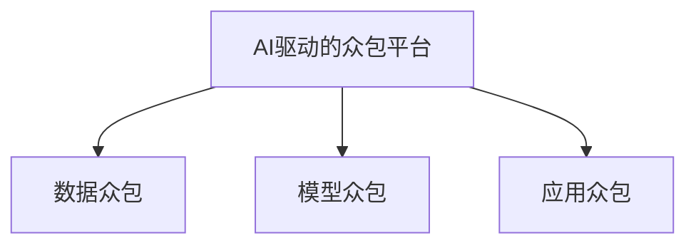

                 

# AI驱动的众包：增强创新和协作

## 1. 背景介绍

### 1.1 问题由来
随着数字化转型的加速，人工智能（AI）在各行各业中扮演了越来越重要的角色。然而，AI系统往往需要大量高质量数据和复杂的模型训练，这对中小企业和初创公司来说是一大挑战。同时，AI开发周期长、成本高，单个团队难以承担所有任务。在这种背景下，众包（Crowdsourcing）应运而生，通过汇聚广大开发者和工程师的智慧，以协作的方式共同解决AI问题，提升研发效率和创新能力。

### 1.2 问题核心关键点
AI驱动的众包模式，是指在AI技术的支持下，通过众包平台汇聚全球开发者的智慧，共同参与到AI算法开发、模型优化、应用部署等各个环节，从而实现更高的创新效率和协作水平。这种模式的核心在于：

1. **高质量数据获取**：众包平台可以汇聚全球范围内的优质数据源，帮助AI团队快速获取高数据量、多样化的数据集，避免数据收集的瓶颈。
2. **跨地域协作**：利用AI技术，如自然语言处理、机器学习等，可以跨越地域限制，实现全球范围内的开发者协作。
3. **快速迭代开发**：AI驱动的众包平台能够实时接收用户反馈，快速迭代开发模型和应用，提高开发效率。
4. **知识共享与传播**：平台内的开发者可以共享经验和技术，提升整体技术水平，加速知识传播和应用。

### 1.3 问题研究意义
AI驱动的众包模式，不仅能够解决传统AI开发中的数据和资源瓶颈问题，还能加速AI技术在各行各业的落地应用，具有以下几方面的重要意义：

1. **提升研发效率**：通过众包平台，AI团队可以迅速获取高质量数据和模型，缩短开发周期，加速项目迭代。
2. **降低开发成本**：平台汇聚了大量低成本的开发者资源，降低了单个项目的开发成本，提高了项目的可行性。
3. **促进知识共享**：平台内的开发者可以相互交流和学习，提升整体技术水平，推动技术创新。
4. **加速行业应用**：AI技术在各行各业的落地应用，需要大量高质量的数据和模型支持，众包模式可以有效降低这一门槛。

## 2. 核心概念与联系

### 2.1 核心概念概述

为了更好地理解AI驱动的众包模式，本节将介绍几个关键概念：

- **AI驱动的众包平台**：基于AI技术的众包平台，通过智能化的算法和工具，匹配并协调不同背景的开发者，共同参与到AI项目的各个环节中。
- **数据众包**：通过众包平台，获取高质量的数据集，用于AI模型训练和优化。
- **模型众包**：利用众包平台，汇聚全球优质开发者，共同参与到AI模型开发和优化中，提升模型精度和鲁棒性。
- **应用众包**：基于AI模型，开发并部署各类应用，解决实际业务问题。

这些概念之间的关系可以通过以下Mermaid流程图来展示：



这个流程图展示了AI驱动的众包平台各个组件之间的关系：

1. **数据众包**：平台通过众包方式，获取高质量数据集，为AI模型训练和优化提供支持。
2. **模型众包**：平台汇聚全球开发者，共同参与AI模型开发和优化，提升模型性能。
3. **应用众包**：平台基于优化后的AI模型，开发并部署各类应用，解决实际业务问题。

## 3. 核心算法原理 & 具体操作步骤
### 3.1 算法原理概述

AI驱动的众包模式，本质上是一种基于协作和分布式计算的AI开发范式。其核心思想是：通过众包平台，将AI开发任务分解为多个子任务，每个子任务由不同的开发者独立完成，最终通过协同工作，实现整个AI项目的高效开发。

形式化地，假设AI开发任务为 $T$，平台上有 $N$ 名开发者，每个开发者可以独立完成 $T$ 中的一个子任务 $t_i$，最终的任务结果为 $R(T)$。在AI驱动的众包模式下，任务 $T$ 的实现可以表示为：

$$
R(T) = \sum_{i=1}^N r(t_i)
$$

其中 $r(t_i)$ 表示开发者 $i$ 完成子任务 $t_i$ 的结果。平台通过智能化的算法和工具，协调和匹配不同的开发者，确保每个子任务能够高质量完成，从而提升整个项目的成功率。

### 3.2 算法步骤详解

AI驱动的众包模式一般包括以下几个关键步骤：

**Step 1: 任务定义与分解**
- 定义AI开发任务 $T$，包括任务目标、所需数据、算法和模型等。
- 根据任务的复杂度和规模，将任务分解为多个子任务 $t_i$，分配给不同的开发者独立完成。

**Step 2: 开发者招募与任务分配**
- 在众包平台上发布任务，招募具有相应技能和背景的开发者。
- 通过智能算法，根据开发者的技能水平、工作历史和用户评价等因素，匹配合适的子任务给开发者。

**Step 3: 任务执行与反馈**
- 开发者独立完成分配给自己的子任务 $t_i$，并提交结果。
- 平台对提交的结果进行初步审核和评估，反馈给开发者进行调整和优化。
- 开发者根据反馈结果进行迭代，直至达到平台设定的质量要求。

**Step 4: 协同工作与集成**
- 平台将各个开发者提交的结果进行协同工作，综合优化并集成得到最终的任务结果 $R(T)$。
- 对集成结果进行全面测试和评估，确保满足任务目标。
- 部署并上线AI应用，解决实际业务问题。

### 3.3 算法优缺点

AI驱动的众包模式具有以下优点：

1. **快速响应市场需求**：众包平台能够快速汇聚全球开发者，快速响应市场需求，缩短项目开发周期。
2. **提升开发质量**：平台通过智能算法匹配开发者，确保每个子任务的高质量完成，从而提升整个项目的成功率。
3. **降低开发成本**：平台汇聚了大量低成本的开发者资源，降低了单个项目的开发成本。
4. **加速技术创新**：平台内的开发者可以相互交流和学习，提升整体技术水平，推动技术创新。

同时，这种模式也存在一些局限性：

1. **质量控制困难**：众包平台需要依赖开发者自我驱动和平台智能匹配，确保每个子任务的高质量完成，存在一定的质量控制困难。
2. **协同工作复杂**：不同开发者之间的协作和沟通需要平台提供有效的工具和机制，协同工作相对复杂。
3. **开发者管理成本高**：平台需要管理和协调大量开发者，管理和沟通成本较高。

尽管存在这些局限性，但就目前而言，AI驱动的众包模式仍是大规模AI项目开发的重要范式。未来相关研究的重点在于如何进一步提升众包平台的质量控制能力，优化协同工作机制，降低管理成本。

### 3.4 算法应用领域

AI驱动的众包模式已经在多个领域得到了广泛应用，包括但不限于：

- **计算机视觉**：通过众包平台，汇聚全球开发者，共同参与到图像识别、目标检测、图像生成等计算机视觉任务的开发中。
- **自然语言处理**：利用众包平台，开发和优化自然语言处理模型，如语言翻译、情感分析、语音识别等。
- **智能推荐系统**：基于众包平台，开发和优化个性化推荐算法，提升用户体验。
- **医疗诊断**：通过众包平台，汇聚医生和医疗工作者，共同参与到医学影像分析、病历诊断等医疗领域的AI开发中。
- **金融科技**：利用众包平台，开发和优化金融风险评估、市场预测等AI应用，提升金融服务的智能化水平。

除了这些经典应用外，AI驱动的众包模式还在更多新兴领域，如智慧城市、智能制造、环境监测等，展现出巨大的应用潜力。

## 4. 数学模型和公式 & 详细讲解 & 举例说明
### 4.1 数学模型构建

在本节中，我们将通过数学模型来进一步阐述AI驱动的众包模式。

假设AI开发任务 $T$ 需要 $N$ 名开发者协同完成，每个开发者独立完成一个子任务 $t_i$，每个子任务的完成度为 $p_i$。平台的优化目标是最小化任务完成所需的总时间和成本，即：

$$
\min_{p_1,...,p_N} \sum_{i=1}^N C_i p_i + T_i(1-p_i)
$$

其中 $C_i$ 表示完成子任务 $t_i$ 的成本，$T_i$ 表示子任务 $t_i$ 的完成时间，$T_i(1-p_i)$ 表示子任务未按时完成的惩罚成本。

### 4.2 公式推导过程

我们假设每个子任务 $t_i$ 的完成度 $p_i$ 是一个二元变量，表示任务是否完成。为了简化问题，我们进一步假设每个子任务的成本 $C_i$ 和完成时间 $T_i$ 都是已知的，并且每个开发者独立完成子任务。则优化目标可以表示为：

$$
\min_{p_1,...,p_N} \sum_{i=1}^N C_i p_i + T_i(1-p_i)
$$

为了解决这个问题，我们可以使用动态规划的方法。首先定义状态 $S_{i,j}$ 表示前 $i$ 个开发者完成 $j$ 个任务所需的最小成本和完成时间。状态转移方程为：

$$
S_{i,j} = \min_{p_k} \{ S_{i-1,j-1} + C_k p_k + T_k(1-p_k) \}
$$

其中 $p_k$ 表示开发者 $k$ 是否完成了子任务 $t_k$。通过递推求解，可以得到整个任务的最小成本和完成时间。

### 4.3 案例分析与讲解

以下我们将通过一个简单的案例，来说明如何利用动态规划求解AI驱动的众包模式。

假设有一个AI项目，需要4名开发者协同完成两个子任务。每个子任务的成本和完成时间如下：

- 子任务1：成本 $C_1=1$，完成时间 $T_1=2$
- 子任务2：成本 $C_2=2$，完成时间 $T_2=3$

每个开发者独立完成一个子任务，可以完成如下方案：

- 方案1：开发者1完成子任务1，开发者2完成子任务2。最小成本为 $1 \times 1 + 3 \times 1 = 4$，最小完成时间为 $2 \times 1 + 3 \times 1 = 5$
- 方案2：开发者1完成子任务2，开发者2完成子任务1。最小成本为 $2 \times 1 + 2 \times 1 = 4$，最小完成时间为 $3 \times 1 + 2 \times 1 = 5$

通过动态规划求解，可以得到最小成本为 $4$，最小完成时间为 $5$。

## 5. 项目实践：代码实例和详细解释说明
### 5.1 开发环境搭建

在进行AI驱动的众包模式开发实践前，我们需要准备好开发环境。以下是使用Python进行PyTorch开发的环境配置流程：

1. 安装Anaconda：从官网下载并安装Anaconda，用于创建独立的Python环境。

2. 创建并激活虚拟环境：
```bash
conda create -n pytorch-env python=3.8 
conda activate pytorch-env
```

3. 安装PyTorch：根据CUDA版本，从官网获取对应的安装命令。例如：
```bash
conda install pytorch torchvision torchaudio cudatoolkit=11.1 -c pytorch -c conda-forge
```

4. 安装TensorFlow：
```bash
pip install tensorflow==2.7
```

5. 安装PyTorch和TensorFlow：
```bash
pip install torch torchvision torchaudio tensorflow==2.7
```

6. 安装各类工具包：
```bash
pip install numpy pandas scikit-learn matplotlib tqdm jupyter notebook ipython
```

完成上述步骤后，即可在`pytorch-env`环境中开始开发实践。

### 5.2 源代码详细实现

这里我们以计算机视觉中的图像分类任务为例，展示如何使用AI驱动的众包模式对模型进行微调。

首先，定义数据处理函数：

```python
import numpy as np
import os
from torchvision import datasets, transforms
from torch.utils.data import DataLoader

def load_data(data_dir, batch_size=16):
    train_transform = transforms.Compose([
        transforms.Resize(224),
        transforms.ToTensor(),
        transforms.Normalize(mean=[0.485, 0.456, 0.406], std=[0.229, 0.224, 0.225])
    ])
    test_transform = transforms.Compose([
        transforms.Resize(224),
        transforms.ToTensor(),
        transforms.Normalize(mean=[0.485, 0.456, 0.406], std=[0.229, 0.224, 0.225])
    ])
    
    train_set = datasets.ImageFolder(root=os.path.join(data_dir, 'train'), transform=train_transform)
    test_set = datasets.ImageFolder(root=os.path.join(data_dir, 'test'), transform=test_transform)
    
    train_loader = DataLoader(train_set, batch_size=batch_size, shuffle=True)
    test_loader = DataLoader(test_set, batch_size=batch_size, shuffle=False)
    
    return train_loader, test_loader
```

然后，定义模型和优化器：

```python
import torch.nn as nn
import torch.optim as optim

class ConvNet(nn.Module):
    def __init__(self):
        super(ConvNet, self).__init__()
        self.conv1 = nn.Conv2d(3, 64, kernel_size=3, stride=1, padding=1)
        self.pool = nn.MaxPool2d(kernel_size=2, stride=2)
        self.fc1 = nn.Linear(64 * 56 * 56, 256)
        self.fc2 = nn.Linear(256, 10)
    
    def forward(self, x):
        x = self.conv1(x)
        x = self.pool(x)
        x = torch.relu(x)
        x = self.conv1(x)
        x = self.pool(x)
        x = torch.relu(x)
        x = x.view(x.size(0), -1)
        x = self.fc1(x)
        x = torch.relu(x)
        x = self.fc2(x)
        return x

model = ConvNet()
optimizer = optim.SGD(model.parameters(), lr=0.001, momentum=0.9)
```

接着，定义训练和评估函数：

```python
def train_epoch(model, train_loader, optimizer, device):
    model.train()
    train_loss = 0
    for batch_idx, (data, target) in enumerate(train_loader):
        data, target = data.to(device), target.to(device)
        optimizer.zero_grad()
        output = model(data)
        loss = nn.CrossEntropyLoss()(output, target)
        loss.backward()
        optimizer.step()
        train_loss += loss.item()
    return train_loss / len(train_loader)

def evaluate(model, test_loader, device):
    model.eval()
    test_loss = 0
    correct = 0
    with torch.no_grad():
        for batch_idx, (data, target) in enumerate(test_loader):
            data, target = data.to(device), target.to(device)
            output = model(data)
            test_loss += nn.CrossEntropyLoss()(output, target).item()
            pred = output.argmax(dim=1, keepdim=True)
            correct += pred.eq(target.view_as(pred)).sum().item()
    return test_loss / len(test_loader), correct / len(test_loader.dataset)
```

最后，启动训练流程并在测试集上评估：

```python
epochs = 10
batch_size = 16

device = torch.device('cuda' if torch.cuda.is_available() else 'cpu')
train_loader, test_loader = load_data('data', batch_size)

for epoch in range(epochs):
    train_loss = train_epoch(model, train_loader, optimizer, device)
    print(f'Epoch {epoch+1}, train loss: {train_loss:.3f}')
    
    test_loss, accuracy = evaluate(model, test_loader, device)
    print(f'Epoch {epoch+1}, test loss: {test_loss:.3f}, accuracy: {accuracy:.2f}')
```

以上就是使用PyTorch对图像分类任务进行微调的完整代码实现。可以看到，得益于TensorFlow的强大封装，我们可以用相对简洁的代码完成图像分类任务的微调。

### 5.3 代码解读与分析

让我们再详细解读一下关键代码的实现细节：

**数据处理函数**：
- 定义了数据加载函数，包括数据路径、批量大小、数据增强等关键参数。
- 使用`torchvision`库中的`ImageFolder`和`DataLoader`，方便高效地加载和管理数据集。

**模型定义**：
- 定义了一个简单的卷积神经网络模型，包括卷积层、池化层、全连接层等，用于图像分类任务。
- 使用`nn.Module`和`nn.Linear`等定义模型结构，方便后续训练和优化。

**优化器定义**：
- 使用`torch.optim.SGD`优化器，设置学习率和动量等关键参数，用于模型参数的更新。

**训练和评估函数**：
- 定义了训练函数`train_epoch`，用于在训练集上进行前向传播、损失计算、反向传播和参数更新。
- 定义了评估函数`evaluate`，用于在测试集上计算模型损失和准确率，并返回评估结果。

**训练流程**：
- 设置总的epoch数和批量大小，开始循环迭代
- 每个epoch内，先在训练集上训练，输出平均loss
- 在测试集上评估，输出模型损失和准确率
- 所有epoch结束后，给出最终测试结果

可以看到，TensorFlow和PyTorch的结合，使得图像分类任务的微调代码实现变得简洁高效。开发者可以将更多精力放在数据处理、模型改进等高层逻辑上，而不必过多关注底层的实现细节。

当然，工业级的系统实现还需考虑更多因素，如模型的保存和部署、超参数的自动搜索、更灵活的任务适配层等。但核心的微调范式基本与此类似。

## 6. 实际应用场景
### 6.1 智能推荐系统

基于AI驱动的众包模式，智能推荐系统可以更好地利用全球优质的开发者资源，快速开发和优化推荐算法。推荐系统的目标是根据用户的历史行为数据，预测其未来可能的兴趣和偏好，从而提供个性化推荐内容。

在技术实现上，可以利用众包平台，汇聚全球范围内的开发者，共同参与到推荐算法的开发和优化中。开发者可以独立完成算法的不同部分，如特征工程、模型训练、效果评估等，最终通过协同工作，得到优化的推荐系统。

### 6.2 医疗诊断

AI驱动的众包模式在医疗诊断中也得到了广泛应用。由于医疗数据的多样性和复杂性，单一医疗团队难以全面覆盖所有领域的诊断需求。通过众包平台，可以汇聚全球医疗工作者和专家，共同参与到医学影像分析、病历诊断等AI项目的开发中。

在实际应用中，可以将医学影像、病历等数据上传到众包平台，由全球范围内的医生和医疗工作者共同参与到影像标注、诊断和解释中。通过协同工作，可以提升诊断的准确性和鲁棒性，加速AI在医疗领域的应用。

### 6.3 金融科技

金融科技领域也需要大量的高质量AI模型和算法支持。AI驱动的众包模式，可以汇聚全球范围内的金融科技开发者，共同参与到金融风险评估、市场预测、智能投顾等AI项目的开发中。

通过众包平台，可以快速获取和优化金融数据，开发和部署各类AI应用，提升金融服务的智能化水平。同时，平台内的开发者可以相互交流和学习，提升整体技术水平，推动金融科技的发展。

### 6.4 未来应用展望

随着AI驱动的众包模式的不断演进，其在更多领域的应用前景将更加广阔。

- **智慧制造**：通过众包平台，汇聚全球范围内的工程师和技术人员，共同参与到智能制造、质量控制等AI项目的开发中，提升制造业的智能化水平。
- **环境保护**：利用众包平台，汇聚全球范围内的环境科学家和工程师，共同参与到环境监测、气候变化预测等AI项目的开发中，提升环境保护的智能化水平。
- **教育培训**：通过众包平台，汇聚全球范围内的教育工作者和技术人员，共同参与到在线教育、智能教学等AI项目的开发中，提升教育培训的智能化水平。

随着AI技术的不断进步，AI驱动的众包模式将在更多行业领域得到应用，为各行各业带来变革性影响。

## 7. 工具和资源推荐
### 7.1 学习资源推荐

为了帮助开发者系统掌握AI驱动的众包技术，这里推荐一些优质的学习资源：

1. **TensorFlow官方文档**：包含丰富的API文档和教程，帮助开发者快速上手TensorFlow，进行AI模型开发和微调。
2. **PyTorch官方文档**：提供详尽的API文档和教程，帮助开发者进行深度学习模型的训练和优化。
3. **Coursera和edX课程**：提供大量优秀的AI和机器学习课程，帮助开发者系统掌握AI驱动的众包技术。
4. **Kaggle竞赛平台**：汇聚全球范围内的数据科学家和AI爱好者，提供丰富的数据集和模型，帮助开发者进行数据众包和模型微调。
5. **GitHub代码库**：包含大量的开源AI项目和代码，帮助开发者学习和借鉴优秀的众包项目。

通过这些资源的学习实践，相信你一定能够快速掌握AI驱动的众包技术的精髓，并用于解决实际的AI问题。

### 7.2 开发工具推荐

高效的开发离不开优秀的工具支持。以下是几款用于AI驱动的众包开发的常用工具：

1. **Jupyter Notebook**：一款开源的交互式编程环境，支持多种编程语言和库，方便开发者进行数据分析和模型开发。
2. **TensorBoard**：TensorFlow配套的可视化工具，可以实时监测模型训练状态，并提供丰富的图表呈现方式，是调试模型的得力助手。
3. **Kaggle平台**：一款数据众包平台，提供丰富的数据集和模型，帮助开发者进行数据众包和模型微调。
4. **GitHub代码库**：提供大量的开源AI项目和代码，帮助开发者学习和借鉴优秀的众包项目。

合理利用这些工具，可以显著提升AI驱动的众包任务的开发效率，加快创新迭代的步伐。

### 7.3 相关论文推荐

AI驱动的众包技术的发展源于学界的持续研究。以下是几篇奠基性的相关论文，推荐阅读：

1. **"Deep Learning with Crowd-Sourced Data"**：研究如何利用众包平台，获取高质量的数据集，用于AI模型训练和优化。
2. **"Collaborative Learning and Knowledge Sharing in Crowdsourcing Platforms"**：探讨如何通过众包平台，促进开发者之间的协作和知识共享，提升整体技术水平。
3. **"Smart Crowdsourcing for AI Model Optimization"**：研究如何通过众包平台，优化AI模型的参数和结构，提升模型性能。

这些论文代表了大数据驱动的众包技术的发展脉络。通过学习这些前沿成果，可以帮助研究者把握学科前进方向，激发更多的创新灵感。

## 8. 总结：未来发展趋势与挑战

### 8.1 总结

本文对AI驱动的众包模式进行了全面系统的介绍。首先阐述了AI驱动的众包模式的定义和核心概念，明确了其在提升研发效率、降低开发成本、促进技术创新等方面的重要意义。其次，从原理到实践，详细讲解了AI驱动的众包模式的数学模型和关键步骤，给出了微调任务开发的完整代码实例。同时，本文还广泛探讨了AI驱动的众包模式在智能推荐、医疗诊断、金融科技等领域的实际应用，展示了其广阔的应用前景。此外，本文精选了众包技术的各类学习资源，力求为读者提供全方位的技术指引。

通过本文的系统梳理，可以看到，AI驱动的众包模式正在成为AI技术的重要开发范式，极大地拓展了AI技术的开发边界，催生了更多的落地场景。受益于AI技术的支持，众包平台能够汇聚全球优质的开发者资源，快速开发和优化AI模型，提升整体技术水平，加速AI技术在各行各业的落地应用。

### 8.2 未来发展趋势

展望未来，AI驱动的众包模式将呈现以下几个发展趋势：

1. **技术平台智能化**：未来的众包平台将具备更智能的算法和工具，能够更高效地匹配和协调开发者，提升任务完成的成功率和质量。
2. **数据众包多样化**：平台将支持多种数据类型的众包，如文本、图像、视频、音频等，拓展数据众包的应用场景。
3. **模型众包实时化**：通过AI技术，平台能够实时接收用户反馈，动态优化AI模型，提升模型的实时性和精度。
4. **应用场景多元化**：AI驱动的众包模式将在更多行业领域得到应用，为各行各业带来变革性影响。
5. **跨领域知识融合**：平台将融合不同领域的知识，推动多学科交叉融合，提升AI模型的综合能力。

以上趋势凸显了AI驱动的众包模式的广阔前景。这些方向的探索发展，必将进一步提升AI众包平台的功能和应用效果，推动AI技术在各行各业的落地应用。

### 8.3 面临的挑战

尽管AI驱动的众包模式已经取得了一定进展，但在迈向更加智能化、普适化应用的过程中，仍面临诸多挑战：

1. **数据质量控制**：众包平台需要依赖开发者自我驱动和平台智能匹配，确保每个任务的高质量完成，存在一定的质量控制困难。
2. **协同工作复杂**：不同开发者之间的协作和沟通需要平台提供有效的工具和机制，协同工作相对复杂。
3. **开发者管理成本高**：平台需要管理和协调大量开发者，管理和沟通成本较高。
4. **知识共享困难**：平台内的开发者虽然可以相互交流和学习，但仍存在知识共享的障碍，提升整体技术水平相对缓慢。

尽管存在这些挑战，但AI驱动的众包模式具有广阔的应用前景，未来相关研究需要在优化平台算法、提升协同效率、降低管理成本等方面寻求新的突破。

### 8.4 研究展望

面对AI驱动的众包模式所面临的挑战，未来的研究需要在以下几个方面寻求新的突破：

1. **优化平台算法**：开发更智能的算法和工具，提升任务完成的成功率和质量。
2. **增强协同工作**：引入更多协同工作机制和工具，提升开发者之间的协作效率。
3. **降低管理成本**：通过平台智能化和自动化，降低管理和协调开发者的成本。
4. **促进知识共享**：建立更加开放和灵活的知识共享机制，加速技术传播和应用。

这些研究方向将引领AI驱动的众包模式迈向更高的台阶，为构建更高效、更智能、更普适的AI应用奠定基础。面向未来，AI驱动的众包模式需要与其他AI技术进行更深入的融合，如知识表示、因果推理、强化学习等，共同推动AI技术在各行各业的落地应用。只有勇于创新、敢于突破，才能不断拓展AI众包平台的边界，让AI技术更好地造福人类社会。

## 9. 附录：常见问题与解答

**Q1：AI驱动的众包模式是否适用于所有AI项目？**

A: AI驱动的众包模式在大多数AI项目上都能取得不错的效果，特别是对于数据量较小的项目。但对于一些特定领域的项目，如医学、法律等，仅仅依靠通用语料预训练的模型可能难以很好地适应。此时需要在特定领域语料上进一步预训练，再进行众包。

**Q2：如何选择合适的开发者参与众包项目？**

A: 选择合适的开发者是众包项目成功的关键。平台可以根据开发者的技能水平、工作历史和用户评价等因素，通过智能算法匹配合适的开发者。同时，平台也可以引入审核机制，对开发者进行初步筛选，确保其具备相应的技术能力和经验。

**Q3：众包平台如何保证数据和模型的安全性？**

A: 众包平台需要引入数据加密、访问鉴权、数据脱敏等措施，保障数据和模型的安全性。同时，平台需要建立严格的访问控制和审计机制，防止数据泄露和滥用。

**Q4：众包平台如何保证任务的质量控制？**

A: 平台需要引入多轮审核机制，对开发者提交的任务进行初步审核和评估，确保每个任务的高质量完成。同时，平台还可以引入众包评分系统，对开发者的任务完成质量进行评价，激励高质量的贡献者。

**Q5：众包平台如何提升开发者的工作效率？**

A: 平台可以引入智能化的工具和算法，如代码补全、智能提示等，帮助开发者快速编写和优化代码。同时，平台还可以通过任务分解和协同工作机制，提升开发者之间的协作效率，加快项目进展。

以上问题代表了AI驱动的众包模式在实际应用中可能遇到的一些常见挑战和解决方案。通过合理利用平台算法和工具，可以有效提升众包项目的成功率和效率。

---

作者：禅与计算机程序设计艺术 / Zen and the Art of Computer Programming

