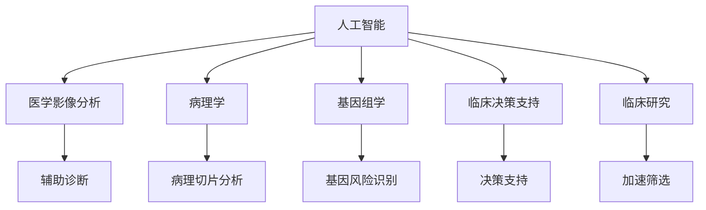

                 

# AI驱动的创新：人类计算在医疗领域的应用

> 关键词：人工智能,医疗,计算,人类计算,创新,医疗影像分析,病理学,诊断,医疗决策,基因组学,临床研究

## 1. 背景介绍

### 1.1 问题由来

医疗领域是人工智能(人工智能)技术应用最为活跃的领域之一。随着计算能力、数据量和算法的不断进步，AI正在重塑医疗行业的面貌，从影像分析到病理学、从基因组学到临床决策，无处不在。AI技术的应用，不仅提升了医疗诊断的精度，还大大缩短了诊断时间，降低了误诊率，帮助医生更好地制定治疗方案。

AI技术的广泛应用，源自于人类计算能力的极限。医疗数据的量级和复杂度，超出了人类可处理的范围。因此，通过AI，特别是深度学习和机器学习，可以高效地分析和处理这些海量数据，提取有价值的信息，为医学研究和临床实践带来深刻变革。

### 1.2 问题核心关键点

AI在医疗领域的应用，主要集中在以下几个关键点：

- 医学影像分析：AI算法可以快速分析医疗影像，如X光、CT、MRI等，自动发现异常，辅助医生诊断。
- 病理学：利用AI分析病理切片，提取细胞形态学特征，提高病理诊断的准确性和一致性。
- 基因组学：AI可以处理和分析基因组数据，识别遗传病风险，为个性化治疗提供依据。
- 临床决策支持：AI结合电子病历和实验室数据，为医生提供精准的诊断和治疗建议。
- 临床研究：AI可以加速药物筛选和临床试验，缩短新药上市时间。

这些应用都依赖于大规模数据的高效处理和深度学习算法的强大能力。通过AI的辅助，人类计算可以更高效、准确地完成医疗任务，推动医学科学的发展和临床实践的进步。

## 2. 核心概念与联系

### 2.1 核心概念概述

为更好地理解AI在医疗领域的应用，本节将介绍几个密切相关的核心概念：

- 人工智能(AI)：使用计算机系统模拟人类智能过程，实现信息处理、学习、推理、决策等。
- 医学影像分析：通过AI技术自动分析医疗影像，辅助医生发现病变区域。
- 病理学：利用AI分析病理切片，提高病理诊断的准确性和一致性。
- 基因组学：AI可以处理和分析基因组数据，识别遗传病风险，为个性化治疗提供依据。
- 临床决策支持：AI结合电子病历和实验室数据，为医生提供精准的诊断和治疗建议。
- 临床研究：AI可以加速药物筛选和临床试验，缩短新药上市时间。

这些核心概念之间的逻辑关系可以通过以下Mermaid流程图来展示：



这个流程图展示了大语言模型的核心概念及其之间的关系：

1. 人工智能通过深度学习等技术，高效处理医学数据，辅助人类进行诊断和治疗。
2. 医学影像分析使用AI算法自动分析影像数据，辅助医生发现病变。
3. 病理学利用AI分析病理切片，提取细胞形态学特征，提高病理诊断的准确性和一致性。
4. 基因组学通过AI处理和分析基因组数据，识别遗传病风险，为个性化治疗提供依据。
5. 临床决策支持结合电子病历和实验室数据，为医生提供精准的诊断和治疗建议。
6. 临床研究利用AI加速药物筛选和临床试验，缩短新药上市时间。

这些概念共同构成了AI在医疗领域的应用框架，使其能够高效地辅助人类计算，提升医疗诊断和治疗的精准性。

## 3. 核心算法原理 & 具体操作步骤
### 3.1 算法原理概述

AI在医疗领域的应用，本质上是一个大规模数据的高效处理和深度学习算法的广泛应用过程。其核心思想是：通过深度学习模型，从海量的医学数据中自动学习出各类特征和模式，辅助人类进行高效计算和决策。

形式化地，假设医学数据集为 $D=\{(x_i,y_i)\}_{i=1}^N, x_i \in \mathcal{X}, y_i \in \mathcal{Y}$，其中 $x_i$ 为输入数据，$y_i$ 为标签。我们希望训练一个深度学习模型 $M$，使得模型能够自动学习出输入数据与标签之间的映射关系，即 $y=f(x)$。

深度学习模型 $M$ 的训练过程，本质上是一个参数优化问题，即最小化经验风险：

$$
\min_{\theta} \frac{1}{N}\sum_{i=1}^N \ell(M(x_i),y_i)
$$

其中 $\ell$ 为损失函数，通常使用交叉熵损失。训练过程通过梯度下降等优化算法，不断调整模型参数 $\theta$，最小化损失函数，使得模型预测输出逼近真实标签。

### 3.2 算法步骤详解

AI在医疗领域的应用，通常包括以下几个关键步骤：

**Step 1: 数据收集与预处理**
- 收集医疗数据，如医学影像、病历、基因组数据等，并进行清洗、去噪、标注等预处理。
- 分划数据集为训练集、验证集和测试集，确保训练集和测试集的分布一致。

**Step 2: 模型选择与训练**
- 选择适合的深度学习模型，如卷积神经网络(CNN)、循环神经网络(RNN)、Transformer等，用于处理不同类型的医学数据。
- 设定合适的超参数，如学习率、批大小、迭代轮数等。
- 使用梯度下降等优化算法，训练模型，最小化损失函数。
- 在验证集上评估模型性能，根据评估结果调整超参数。

**Step 3: 模型评估与验证**
- 在测试集上评估训练好的模型性能，衡量模型在未见过的数据上的泛化能力。
- 根据评估结果，决定是否接受模型，或者返回Step 2进行调整。

**Step 4: 应用与部署**
- 将训练好的模型集成到医疗系统中，进行实际应用。
- 在应用过程中，持续收集新数据，更新模型，提升模型性能。

### 3.3 算法优缺点

AI在医疗领域的应用，具有以下优点：
1. 高效处理大数据。AI可以高效处理海量医学数据，提取有价值的信息，提升诊断和治疗效率。
2. 辅助决策精准性高。AI通过深度学习算法，可以自动学习出复杂的特征和模式，辅助医生进行精准诊断和治疗。
3. 缩短诊断时间。AI可以自动化处理医学影像和病历数据，大大缩短诊断时间，提升服务效率。
4. 减少误诊率。AI能够识别和处理医学数据中的细微变化，降低误诊率，提高医疗质量。
5. 推动医学研究。AI可以加速药物筛选和临床试验，推动医学科学的发展。

同时，该方法也存在一定的局限性：
1. 数据质量要求高。AI模型对数据质量要求高，数据标注和清洗复杂，成本高。
2. 需要大量计算资源。深度学习模型训练和推理需要高性能的计算资源，成本较高。
3. 可解释性不足。AI模型通常难以解释其内部决策过程，医生难以理解和信任。
4. 存在偏差和误差。AI模型可能存在数据偏差和算法误差，导致误诊或漏诊。
5. 伦理和安全问题。AI模型可能面临伦理和安全问题，如数据隐私、算法透明性等。

尽管存在这些局限性，但AI在医疗领域的应用前景广阔，未来还需要不断优化算法和改进技术，以实现更加高效、准确、安全的医疗服务。

### 3.4 算法应用领域

AI在医疗领域的应用，涵盖了从基础医学研究到临床实践的多个领域，具体包括：

- **医学影像分析**：利用深度学习模型对医学影像数据进行分析，如X光、CT、MRI等。自动检测病变区域，辅助医生进行诊断。
- **病理学**：利用深度学习模型对病理切片进行分类和分析，提取细胞形态学特征，提高病理诊断的准确性和一致性。
- **基因组学**：利用深度学习模型处理和分析基因组数据，识别遗传病风险，为个性化治疗提供依据。
- **临床决策支持**：结合电子病历和实验室数据，利用深度学习模型为医生提供精准的诊断和治疗建议。
- **临床研究**：利用深度学习模型加速药物筛选和临床试验，缩短新药上市时间。

此外，AI在医疗领域还有更多创新应用，如智能排班、健康管理、远程医疗等，为医疗服务带来了新的思路和方法。

## 4. 数学模型和公式 & 详细讲解  
### 4.1 数学模型构建

本节将使用数学语言对AI在医疗领域的应用进行更加严格的刻画。

假设医学影像数据集为 $D=\{(x_i,y_i)\}_{i=1}^N, x_i \in \mathcal{X}, y_i \in \{0,1\}$，其中 $x_i$ 为输入影像数据，$y_i$ 为标签，$y_i=1$ 表示存在病变区域。

定义模型 $M$ 在输入 $x$ 上的输出为 $\hat{y}=M(x) \in [0,1]$，表示样本存在病变区域的概率。损失函数为二元交叉熵损失，定义如下：

$$
\ell(M(x),y) = -[y\log M(x) + (1-y)\log(1-M(x))]
$$

经验风险为：

$$
\mathcal{L}(M) = \frac{1}{N}\sum_{i=1}^N \ell(M(x_i),y_i)
$$

训练目标是最小化经验风险，即找到最优参数 $\theta$：

$$
\theta^* = \mathop{\arg\min}_{\theta} \mathcal{L}(M)
$$

在实践中，我们通常使用基于梯度的优化算法（如SGD、Adam等）来近似求解上述最优化问题。设 $\eta$ 为学习率，$\lambda$ 为正则化系数，则参数的更新公式为：

$$
\theta \leftarrow \theta - \eta \nabla_{\theta}\mathcal{L}(\theta) - \eta\lambda\theta
$$

其中 $\nabla_{\theta}\mathcal{L}(\theta)$ 为损失函数对参数 $\theta$ 的梯度，可通过反向传播算法高效计算。

### 4.2 公式推导过程

以下我们以医学影像分类任务为例，推导交叉熵损失函数及其梯度的计算公式。

假设模型 $M$ 在输入 $x$ 上的输出为 $\hat{y}=M(x) \in [0,1]$，表示样本存在病变区域的概率。真实标签 $y \in \{0,1\}$。则二元交叉熵损失函数定义为：

$$
\ell(M(x),y) = -[y\log M(x) + (1-y)\log(1-M(x))]
$$

将其代入经验风险公式，得：

$$
\mathcal{L}(M) = -\frac{1}{N}\sum_{i=1}^N [y_i\log M(x_i)+(1-y_i)\log(1-M(x_i))]
$$

根据链式法则，损失函数对参数 $\theta_k$ 的梯度为：

$$
\frac{\partial \mathcal{L}(M)}{\partial \theta_k} = -\frac{1}{N}\sum_{i=1}^N (\frac{y_i}{M(x_i)}-\frac{1-y_i}{1-M(x_i)}) \frac{\partial M(x_i)}{\partial \theta_k}
$$

其中 $\frac{\partial M(x_i)}{\partial \theta_k}$ 可进一步递归展开，利用自动微分技术完成计算。

在得到损失函数的梯度后，即可带入参数更新公式，完成模型的迭代优化。重复上述过程直至收敛，最终得到适应医学影像分类任务的模型参数 $\theta^*$。

## 5. 项目实践：代码实例和详细解释说明
### 5.1 开发环境搭建

在进行AI医疗应用开发前，我们需要准备好开发环境。以下是使用Python进行TensorFlow开发的环境配置流程：

1. 安装Anaconda：从官网下载并安装Anaconda，用于创建独立的Python环境。

2. 创建并激活虚拟环境：
```bash
conda create -n pytensorflow-env python=3.8 
conda activate pytensorflow-env
```

3. 安装TensorFlow：根据CUDA版本，从官网获取对应的安装命令。例如：
```bash
conda install tensorflow -c pytorch -c conda-forge
```

4. 安装各类工具包：
```bash
pip install numpy pandas scikit-learn matplotlib tqdm jupyter notebook ipython
```

完成上述步骤后，即可在`pytensorflow-env`环境中开始AI医疗应用的开发。

### 5.2 源代码详细实现

下面我们以医学影像分类任务为例，给出使用TensorFlow进行深度学习模型训练的PyTorch代码实现。

首先，定义数据处理函数：

```python
import tensorflow as tf
from tensorflow.keras.preprocessing.image import ImageDataGenerator

def preprocess_data(train_data_dir, test_data_dir, img_height=256, img_width=256):
    train_datagen = ImageDataGenerator(rescale=1./255, shear_range=0.2, zoom_range=0.2, horizontal_flip=True)
    test_datagen = ImageDataGenerator(rescale=1./255)
    
    train_generator = train_datagen.flow_from_directory(
        train_data_dir, 
        target_size=(img_height, img_width), 
        batch_size=32, 
        class_mode='binary', 
        shuffle=True)
    
    test_generator = test_datagen.flow_from_directory(
        test_data_dir, 
        target_size=(img_height, img_width), 
        batch_size=32, 
        class_mode='binary', 
        shuffle=False)
    
    return train_generator, test_generator
```

然后，定义模型和优化器：

```python
from tensorflow.keras.applications import VGG16
from tensorflow.keras.layers import Dense, Flatten, Dropout, Input
from tensorflow.keras.models import Model

# 加载VGG16预训练模型
base_model = VGG16(weights='imagenet', include_top=False, input_tensor=Input(shape=(img_height, img_width, 3)))
x = Flatten()(base_model.output)
x = Dense(256, activation='relu')(x)
x = Dropout(0.5)(x)
predictions = Dense(1, activation='sigmoid')(x)
model = Model(inputs=base_model.input, outputs=predictions)

# 冻结预训练层的权重
for layer in base_model.layers:
    layer.trainable = False

# 编译模型
model.compile(optimizer=tf.keras.optimizers.Adam(learning_rate=0.001), loss='binary_crossentropy', metrics=['accuracy'])

```

接着，定义训练和评估函数：

```python
from tensorflow.keras.callbacks import EarlyStopping

def train_model(model, train_generator, test_generator, epochs=10, batch_size=32, patience=5):
    early_stopping = EarlyStopping(monitor='val_loss', patience=patience, restore_best_weights=True)
    model.fit(
        train_generator,
        steps_per_epoch=len(train_generator),
        validation_data=test_generator,
        validation_steps=len(test_generator),
        epochs=epochs,
        callbacks=[early_stopping])
    
    test_loss, test_acc = model.evaluate(test_generator)
    print(f'Test loss: {test_loss:.4f}, Test accuracy: {test_acc:.4f}')
    
    return model
```

最后，启动训练流程并在测试集上评估：

```python
# 加载数据集
train_data_dir = 'path/to/train_data'
test_data_dir = 'path/to/test_data'
img_height = 256
img_width = 256

# 预处理数据
train_generator, test_generator = preprocess_data(train_data_dir, test_data_dir, img_height, img_width)

# 训练模型
model = train_model(model, train_generator, test_generator, epochs=10, batch_size=32, patience=5)
```

以上就是使用TensorFlow对医学影像分类任务进行深度学习模型训练的完整代码实现。可以看到，借助TensorFlow的Keras API，我们能够快速搭建和训练深度学习模型，并在测试集上评估模型性能。

### 5.3 代码解读与分析

让我们再详细解读一下关键代码的实现细节：

**preprocess_data函数**：
- 定义了数据增强处理和数据生成器，用于对图像进行标准化和归一化。
- 使用ImageDataGenerator生成训练集和测试集的数据批，便于模型的前向传播和反向传播。

**train_model函数**：
- 使用EarlyStopping回调，避免过拟合。
- 模型训练过程，在每个epoch结束后评估模型在验证集上的性能。
- 最后，在测试集上评估模型性能，输出最终结果。

**训练流程**：
- 加载数据集，并进行预处理。
- 定义模型和优化器。
- 在训练集上训练模型，使用EarlyStopping防止过拟合。
- 在测试集上评估模型性能，输出最终结果。

可以看到，TensorFlow的Keras API使得深度学习模型的搭建和训练过程变得非常简洁高效。开发者可以将更多精力放在数据处理、模型改进等高层逻辑上，而不必过多关注底层的实现细节。

当然，工业级的系统实现还需考虑更多因素，如模型的保存和部署、超参数的自动搜索、更灵活的任务适配层等。但核心的深度学习模型训练过程基本与此类似。

## 6. 实际应用场景
### 6.1 医学影像分析

医学影像分析是AI在医疗领域的重要应用之一。AI算法可以快速分析医疗影像，如X光、CT、MRI等，自动检测病变区域，辅助医生进行诊断。

在实践中，可以收集海量的医疗影像数据，标注病变区域，构建标注集。使用深度学习模型（如卷积神经网络）在标注数据上进行训练，使其能够自动学习出病变区域的特征，并在未见过的影像数据上进行分类。微调后的模型能够快速检测出病变区域，大大提升诊断效率和准确性。

### 6.2 病理学

利用AI算法对病理切片进行分类和分析，提取细胞形态学特征，提高病理诊断的准确性和一致性。

病理切片通常包含大量的细胞信息，难以手工标注。AI算法可以通过自动标注病理切片，学习出细胞形态学特征，识别出病变区域。使用深度学习模型（如卷积神经网络）在标注数据上进行训练，使其能够自动学习出细胞形态学特征，并在新的病理切片上进行分类。微调后的模型能够高效处理病理切片，提高病理诊断的准确性和一致性。

### 6.3 基因组学

利用AI算法处理和分析基因组数据，识别遗传病风险，为个性化治疗提供依据。

基因组数据通常包含海量的生物信息，难以手工分析和解读。AI算法可以通过自动分析基因组数据，学习出遗传病风险因子，识别出高风险个体。使用深度学习模型（如循环神经网络）在基因组数据上进行训练，使其能够自动学习出遗传病风险因子，并在新的基因组数据上进行预测。微调后的模型能够高效分析基因组数据，提供个性化治疗方案。

### 6.4 临床决策支持

结合电子病历和实验室数据，利用AI算法为医生提供精准的诊断和治疗建议。

电子病历和实验室数据通常包含丰富的临床信息，难以手工分析。AI算法可以通过自动分析电子病历和实验室数据，学习出疾病特征和治疗方案，为医生提供精准的诊断和治疗建议。使用深度学习模型（如循环神经网络）在电子病历和实验室数据上进行训练，使其能够自动学习出疾病特征和治疗方案，并在新的临床数据上进行预测。微调后的模型能够高效分析临床数据，提供精准的诊断和治疗建议。

### 6.5 临床研究

利用AI算法加速药物筛选和临床试验，缩短新药上市时间。

药物筛选和临床试验通常需要耗费大量时间和资源。AI算法可以通过自动分析药物筛选数据和临床试验数据，学习出药物的疗效和副作用，加速新药的筛选和试验。使用深度学习模型（如卷积神经网络）在药物筛选数据和临床试验数据上进行训练，使其能够自动学习出药物的疗效和副作用，并在新的药物数据上进行预测。微调后的模型能够高效分析药物数据，加速新药上市进程。

## 7. 工具和资源推荐
### 7.1 学习资源推荐

为了帮助开发者系统掌握AI在医疗领域的应用的理论基础和实践技巧，这里推荐一些优质的学习资源：

1. TensorFlow官方文档：详细介绍了TensorFlow的使用方法、API接口和示例代码，适合初学者上手。
2. Keras官方文档：介绍了Keras的高级API和模型构建方法，适合快速搭建深度学习模型。
3. Deep Learning with Python书籍：介绍了深度学习的基本原理和实践技巧，适合入门学习。
4. Machine Learning Yearning书籍：介绍了机器学习工程实践的全面方法，适合有经验的开发者。
5. arXiv上的最新论文：arXiv上的深度学习研究论文，涵盖AI在医疗领域的最新进展和应用。

通过对这些资源的学习实践，相信你一定能够快速掌握AI在医疗领域的应用精髓，并用于解决实际的医疗问题。
### 7.2 开发工具推荐

高效的开发离不开优秀的工具支持。以下是几款用于AI医疗应用开发的常用工具：

1. TensorFlow：由Google主导开发的深度学习框架，生产部署方便，适合大规模工程应用。
2. Keras：基于TensorFlow等框架的高级API，易于搭建和调试深度学习模型。
3. PyTorch：基于Python的开源深度学习框架，灵活动态的计算图，适合快速迭代研究。
4. Jupyter Notebook：免费的Jupyter Notebook环境，支持代码编写和数据可视化，适合研究和开发。
5. TensorBoard：TensorFlow配套的可视化工具，可实时监测模型训练状态，并提供丰富的图表呈现方式。

合理利用这些工具，可以显著提升AI医疗应用开发的效率，加快创新迭代的步伐。

### 7.3 相关论文推荐

AI在医疗领域的应用源于学界的持续研究。以下是几篇奠基性的相关论文，推荐阅读：

1. ImageNet Classification with Deep Convolutional Neural Networks：提出卷积神经网络，广泛应用于医学影像分类。
2. Deep Residual Learning for Image Recognition：提出残差网络，在深度学习模型中广泛应用。
3. Understanding the difficulty of training deep feedforward neural networks：分析深度学习模型的训练过程，提供优化算法。
4. A Systematic Literature Review of Deep Learning Applications in Pathology：总结了深度学习在病理学中的应用，提供实际案例和实践经验。
5. AI in Healthcare: From Imaging to Personalized Medicine：综述了AI在医疗领域的多种应用，涵盖医学影像、病理学、基因组学等多个方向。

这些论文代表了大语言模型微调技术的发展脉络。通过学习这些前沿成果，可以帮助研究者把握学科前进方向，激发更多的创新灵感。

## 8. 总结：未来发展趋势与挑战

### 8.1 总结

本文对AI在医疗领域的应用进行了全面系统的介绍。首先阐述了AI技术在医疗领域的应用背景和意义，明确了AI在医学影像分析、病理学、基因组学、临床决策支持和临床研究等方向的应用价值。其次，从原理到实践，详细讲解了AI在医疗领域的应用方法，给出了AI医疗应用的完整代码实例。同时，本文还广泛探讨了AI在医疗领域的应用场景，展示了AI技术在医疗领域的巨大潜力。

通过本文的系统梳理，可以看到，AI技术在医疗领域的应用正在成为新的趋势，为医学研究和临床实践带来了深刻变革。未来，伴随AI技术的不断演进，AI在医疗领域的应用将更加广泛和深入，推动医疗服务质量的全面提升。

### 8.2 未来发展趋势

展望未来，AI在医疗领域的应用将呈现以下几个发展趋势：

1. 技术水平不断提升。深度学习模型和算法将不断改进，性能将更加高效、准确，能够更好地处理海量医疗数据。
2. 应用场景日益广泛。AI将从医学影像分析、病理学等传统领域，扩展到基因组学、临床决策支持、临床研究等多个方向，推动医学科学的全面发展。
3. 融合其他技术。AI将与其他技术如物联网、大数据、区块链等进行深度融合，提升医疗服务的智能化水平。
4. 注重伦理和安全。AI在医疗领域的应用将更加注重伦理和安全问题，保障数据隐私和算法透明性。
5. 推动健康管理。AI将更多地应用于健康管理、疾病预防等领域，提升公众健康水平。

这些趋势将使AI在医疗领域的应用更加成熟和全面，推动医学科学和医疗服务质量的全面提升。

### 8.3 面临的挑战

尽管AI在医疗领域的应用前景广阔，但在迈向更加智能化、普适化应用的过程中，它仍面临诸多挑战：

1. 数据质量问题。AI模型对数据质量要求高，数据标注和清洗复杂，成本高。
2. 计算资源需求高。深度学习模型训练和推理需要高性能的计算资源，成本较高。
3. 模型透明性不足。AI模型通常难以解释其内部决策过程，医生难以理解和信任。
4. 伦理和安全问题。AI模型可能面临伦理和安全问题，如数据隐私、算法透明性等。
5. 标准化问题。缺乏统一的AI医疗数据标准和模型规范，限制了AI在医疗领域的应用。

尽管存在这些挑战，但AI在医疗领域的应用前景广阔，未来还需要不断优化算法和改进技术，以实现更加高效、准确、安全的医疗服务。

### 8.4 研究展望

面对AI在医疗领域面临的挑战，未来的研究需要在以下几个方面寻求新的突破：

1. 提高数据质量。优化数据标注和清洗流程，提高数据质量，降低标注成本。
2. 降低计算成本。优化模型结构和计算图，减少资源消耗，降低计算成本。
3. 增强模型透明性。开发可解释AI算法，增强模型决策的透明性和可解释性。
4. 保障伦理和安全。建立AI在医疗领域的应用伦理和安全规范，保障数据隐私和算法透明性。
5. 标准化数据和模型。制定统一的AI医疗数据标准和模型规范，推动AI在医疗领域的应用。

这些研究方向的探索，必将引领AI在医疗领域的应用走向更加成熟，为构建安全、可靠、可解释、可控的智能系统铺平道路。面向未来，AI在医疗领域的应用还需要与其他人工智能技术进行更深入的融合，如知识表示、因果推理、强化学习等，多路径协同发力，共同推动自然语言理解和智能交互系统的进步。只有勇于创新、敢于突破，才能不断拓展AI在医疗领域的应用边界，让智能技术更好地造福人类社会。

## 9. 附录：常见问题与解答

**Q1：AI在医疗领域的应用有哪些优点？**

A: AI在医疗领域的应用有以下几个优点：
1. 高效处理大数据。AI可以高效处理海量医学数据，提取有价值的信息，提升诊断和治疗效率。
2. 辅助决策精准性高。AI通过深度学习算法，可以自动学习出复杂的特征和模式，辅助医生进行精准诊断和治疗。
3. 缩短诊断时间。AI可以自动化处理医学影像和病历数据，大大缩短诊断时间，提升服务效率。
4. 减少误诊率。AI能够识别和处理医学数据中的细微变化，降低误诊率，提高医疗质量。
5. 推动医学研究。AI可以加速药物筛选和临床试验，推动医学科学的发展。

**Q2：AI在医疗领域的应用面临哪些挑战？**

A: AI在医疗领域的应用面临以下挑战：
1. 数据质量问题。AI模型对数据质量要求高，数据标注和清洗复杂，成本高。
2. 计算资源需求高。深度学习模型训练和推理需要高性能的计算资源，成本较高。
3. 模型透明性不足。AI模型通常难以解释其内部决策过程，医生难以理解和信任。
4. 伦理和安全问题。AI模型可能面临伦理和安全问题，如数据隐私、算法透明性等。
5. 标准化问题。缺乏统一的AI医疗数据标准和模型规范，限制了AI在医疗领域的应用。

尽管存在这些挑战，但AI在医疗领域的应用前景广阔，未来还需要不断优化算法和改进技术，以实现更加高效、准确、安全的医疗服务。

**Q3：AI在医疗领域的应用有哪些实际案例？**

A: AI在医疗领域的应用有以下几个实际案例：
1. 医学影像分析。利用AI算法快速分析医疗影像，如X光、CT、MRI等，自动检测病变区域，辅助医生进行诊断。
2. 病理学。利用AI算法对病理切片进行分类和分析，提取细胞形态学特征，提高病理诊断的准确性和一致性。
3. 基因组学。利用AI算法处理和分析基因组数据，识别遗传病风险，为个性化治疗提供依据。
4. 临床决策支持。结合电子病历和实验室数据，利用AI算法为医生提供精准的诊断和治疗建议。
5. 临床研究。利用AI算法加速药物筛选和临床试验，缩短新药上市时间。

这些实际案例展示了AI在医疗领域的广泛应用和巨大潜力，为医学研究和临床实践带来了深刻变革。

**Q4：如何优化AI在医疗领域的应用？**

A: 优化AI在医疗领域的应用，需要从以下几个方面入手：
1. 提高数据质量。优化数据标注和清洗流程，提高数据质量，降低标注成本。
2. 降低计算成本。优化模型结构和计算图，减少资源消耗，降低计算成本。
3. 增强模型透明性。开发可解释AI算法，增强模型决策的透明性和可解释性。
4. 保障伦理和安全。建立AI在医疗领域的应用伦理和安全规范，保障数据隐私和算法透明性。
5. 标准化数据和模型。制定统一的AI医疗数据标准和模型规范，推动AI在医疗领域的应用。

这些优化措施将有助于提高AI在医疗领域的应用效果和可接受性，推动AI在医疗领域的广泛应用。

**Q5：AI在医疗领域的应用前景如何？**

A: AI在医疗领域的应用前景广阔，未来还将呈现以下几个趋势：
1. 技术水平不断提升。深度学习模型和算法将不断改进，性能将更加高效、准确，能够更好地处理海量医疗数据。
2. 应用场景日益广泛。AI将从医学影像分析、病理学等传统领域，扩展到基因组学、临床决策支持、临床研究等多个方向，推动医学科学的全面发展。
3. 融合其他技术。AI将与其他技术如物联网、大数据、区块链等进行深度融合，提升医疗服务的智能化水平。
4. 注重伦理和安全。AI在医疗领域的应用将更加注重伦理和安全问题，保障数据隐私和算法透明性。
5. 推动健康管理。AI将更多地应用于健康管理、疾病预防等领域，提升公众健康水平。

这些趋势将使AI在医疗领域的应用更加成熟和全面，推动医学科学和医疗服务质量的全面提升。

---

作者：禅与计算机程序设计艺术 / Zen and the Art of Computer Programming

