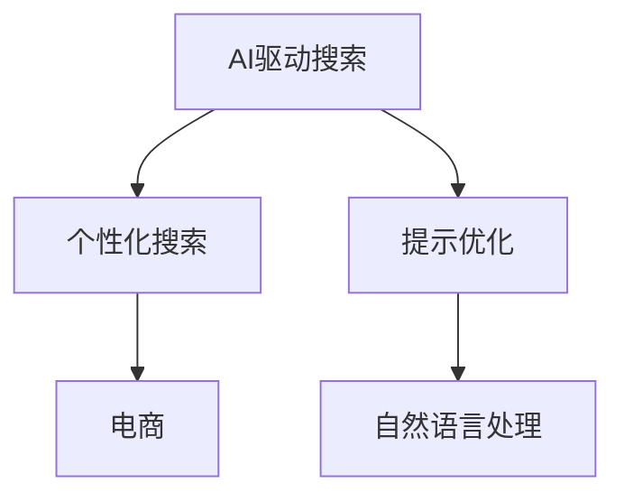

                 

# AI驱动的电商个性化搜索提示优化

> 关键词：AI驱动, 个性化搜索, 提示优化, 电商, 自然语言处理(NLP), 搜索推荐系统

## 1. 背景介绍

### 1.1 问题由来
在电商领域，个性化搜索是提升用户体验和增加用户粘性、转化率的重要手段。传统的搜索结果排序算法，通常基于用户历史行为、关键词相关性等特征，进行加权计算。然而，这种方法往往忽视了用户输入搜索词时，对搜索意图和语境的理解。因此，如何更好地理解用户输入，生成自然流畅的搜索提示，成为电商个性化搜索优化的关键。

### 1.2 问题核心关键点
提示优化作为自然语言处理(NLP)领域的重要研究方向，其核心在于通过对用户输入的语境分析和意图理解，生成简洁明了、富有启发性的提示词，从而提升搜索效果和用户体验。其应用场景包括但不限于智能搜索、自动补全、聊天机器人等。

### 1.3 问题研究意义
提升电商个性化搜索的精度和效率，不仅能显著增强用户满意度和转化率，还能大大降低人工运营成本，驱动电商平台的业务增长。同时，通过提示优化，还能实现零样本或少样本学习，减少标注样本的需求，促进技术落地应用。

## 2. 核心概念与联系

### 2.1 核心概念概述

为更好地理解AI驱动的电商个性化搜索提示优化方法，本节将介绍几个密切相关的核心概念：

- AI驱动搜索（AI-Driven Search）：利用人工智能技术，尤其是自然语言处理技术，对用户输入的搜索关键词进行深度理解，生成个性化搜索提示，提升搜索精度和效率。
- 个性化搜索（Personalized Search）：根据用户的历史行为、偏好、上下文环境等，定制化地调整搜索结果排序和提示生成策略，以适应用户的个性化需求。
- 提示优化（Prompt Optimization）：通过对用户输入的语境分析和意图理解，生成简洁、有启发性质的提示词，降低搜索难度，提高搜索效果。
- 电商（Electronic Commerce, E-commerce）：指通过互联网平台进行的商品或服务交易活动，涵盖广泛的商品类别和复杂的业务场景。
- 自然语言处理（Natural Language Processing, NLP）：研究计算机如何理解、处理、生成自然语言的技术，包括文本分类、信息抽取、语言生成等。

这些核心概念之间的逻辑关系可以通过以下Mermaid流程图来展示：



这个流程图展示了大语言模型微调的各个核心概念及其之间的关系：

1. AI驱动搜索利用自然语言处理技术，对用户输入的语境和意图进行分析，生成个性化搜索提示。
2. 个性化搜索通过用户历史行为数据，对搜索结果进行定制化调整。
3. 提示优化生成简洁、有启发性的提示词，降低搜索难度。
4. 电商平台通过提升搜索效果，增加用户粘性和转化率。

这些核心概念共同构成了AI驱动的电商个性化搜索提示优化的技术框架，使其能够更好地适应电商平台的业务需求。

## 3. 核心算法原理 & 具体操作步骤
### 3.1 算法原理概述

AI驱动的电商个性化搜索提示优化，本质上是一个有监督学习的文本生成过程。其核心思想是：通过收集用户历史搜索数据，利用深度学习模型，学习用户搜索意图和语境，从而生成个性化、富有启发性的提示词，用于降低搜索难度，提升搜索效果。

形式化地，假设用户输入搜索词为 $s$，对应的提示词为 $p$。目标是通过训练，找到最优的生成模型 $P(p|s)$，使得生成的提示词 $p$ 能够最大化引导用户点击目标搜索结果的概率。

### 3.2 算法步骤详解

AI驱动的电商个性化搜索提示优化一般包括以下几个关键步骤：

**Step 1: 数据准备与预处理**
- 收集电商平台的搜索日志数据，包括用户搜索词、点击链接、停留时间等。
- 清洗数据，去除无用信息和异常数据，保留有效的查询-点击对。
- 对搜索词进行分词、去停用词等预处理，以便后续的模型输入。

**Step 2: 模型训练与优化**
- 选择合适的深度学习模型，如基于Transformer的Seq2Seq模型、BERT等，用于生成提示词。
- 设计合适的损失函数，如交叉熵损失，用于衡量生成的提示词与真实提示词之间的差距。
- 设置超参数，如学习率、批大小、迭代轮数等，训练生成模型。
- 使用正则化技术，如Dropout、L2正则化等，防止模型过拟合。
- 应用对抗训练、数据增强等技术，提高生成模型的鲁棒性和多样性。

**Step 3: 提示词生成与后处理**
- 根据用户输入的搜索词，利用训练好的生成模型，生成多个候选提示词。
- 对生成的提示词进行后处理，如去重、排序等，选择最合适的提示词。
- 将提示词添加到搜索结果页，引导用户点击目标结果。

**Step 4: 评估与反馈**
- 在真实用户点击数据上评估提示词的效果，如点击率、点击次数等指标。
- 根据评估结果，对生成模型进行微调，进一步优化提示词生成策略。
- 通过A/B测试等手段，对比不同提示词策略的性能差异，选择最优方案。

以上是AI驱动的电商个性化搜索提示优化的主要流程。在实际应用中，还需要根据具体业务场景和数据特点，对生成模型进行针对性的设计和调优。

### 3.3 算法优缺点

AI驱动的电商个性化搜索提示优化方法具有以下优点：
1. 提升搜索效果：通过生成个性化提示词，能够更好地引导用户点击目标搜索结果，减少搜索路径。
2. 降低用户点击难度：提示词能够简洁地传达用户意图，提高搜索效率。
3. 降低人工运营成本：减少人工运营提示词的需求，提高运营效率。
4. 适应复杂业务场景：能够灵活适应电商平台的商品类别、价格、销量等复杂业务场景，提升用户体验。

同时，该方法也存在一定的局限性：
1. 依赖高质量标注数据：提示词生成效果很大程度上取决于标注数据的质量和数量，获取高质量标注数据的成本较高。
2. 模型复杂度高：基于深度学习模型的提示生成方法，模型结构复杂，训练和推理耗时长。
3. 泛化能力有限：提示生成模型的泛化能力取决于训练数据的多样性和覆盖范围，对于新领域或极端场景可能效果不佳。

尽管存在这些局限性，但就目前而言，AI驱动的电商个性化搜索提示优化方法仍是电商领域最主流的研究范式。未来相关研究的重点在于如何进一步降低提示生成对标注数据的依赖，提高模型的泛化能力和效率，同时兼顾可解释性和伦理安全性等因素。

### 3.4 算法应用领域

AI驱动的电商个性化搜索提示优化，在电商领域已经得到了广泛的应用，覆盖了电商平台的各类搜索功能：

- 首页推荐：在搜索结果页顶部或侧边栏，展示个性化推荐提示词，引导用户点击目标商品。
- 商品详情页：在商品详情页，展示与商品相关的搜索提示词，方便用户进一步探索相关商品。
- 分类浏览：在商品分类浏览页面，展示分类浏览相关的搜索提示词，引导用户探索相关分类。
- 热门商品：展示热门商品相关的搜索提示词，吸引用户关注热门商品。

除了上述这些经典应用外，提示优化技术也被创新性地应用到更多场景中，如商品评价生成、个性化推荐、智能客服等，为电商平台带来了全新的突破。随着深度学习技术和提示优化方法的不断进步，相信提示优化技术将在更广泛的场景中得到应用，进一步提升电商平台的业务价值。

## 4. 数学模型和公式 & 详细讲解  
### 4.1 数学模型构建

本节将使用数学语言对AI驱动的电商个性化搜索提示优化过程进行更加严格的刻画。

记用户输入的搜索词为 $s$，对应的提示词为 $p$。目标是通过训练，找到最优的生成模型 $P(p|s)$，使得生成的提示词 $p$ 能够最大化引导用户点击目标搜索结果的概率。定义损失函数为：

$$
\mathcal{L}(P) = -\frac{1}{N} \sum_{i=1}^N \log P(p_i|s_i)
$$

其中 $s_i$ 和 $p_i$ 分别为第 $i$ 个查询和对应的真实提示词。目标是使生成模型 $P(p|s)$ 最小化上述损失函数。

在实践中，我们通常使用基于梯度的优化算法（如Adam、SGD等）来近似求解上述最优化问题。设 $\theta$ 为生成模型的参数，则参数的更新公式为：

$$
\theta \leftarrow \theta - \eta \nabla_{\theta}\mathcal{L}(\theta)
$$

其中 $\nabla_{\theta}\mathcal{L}(\theta)$ 为损失函数对模型参数的梯度，可通过反向传播算法高效计算。

### 4.2 公式推导过程

以下我们以基于Transformer的Seq2Seq模型为例，推导提示词生成模型的损失函数及其梯度的计算公式。

假设生成模型 $P(p|s)$ 由Transformer网络构成，其生成过程可以通过自回归解码器实现。对于输入的搜索词 $s$，模型通过编码器获得其语义表示 $h_s$，然后解码器根据 $h_s$ 生成目标提示词 $p$。提示词生成模型的条件概率为：

$$
P(p|s) = \prod_{t=1}^T P(p_t|s, p_{t-1}, h_s)
$$

其中 $p_t$ 为提示词序列中的第 $t$ 个词。假设 $p_t$ 的生成依赖于前 $t-1$ 个词和语义表示 $h_s$，则生成模型的目标为最大化：

$$
\log P(p|s) = \sum_{t=1}^T \log P(p_t|s, p_{t-1}, h_s)
$$

将其代入损失函数，得：

$$
\mathcal{L}(P) = -\frac{1}{N} \sum_{i=1}^N \log P(p_i|s_i)
$$

根据链式法则，损失函数对模型参数 $\theta$ 的梯度为：

$$
\frac{\partial \mathcal{L}(P)}{\partial \theta} = -\frac{1}{N}\sum_{i=1}^N \frac{\partial \log P(p_i|s_i)}{\partial \theta}
$$

其中 $\frac{\partial \log P(p_i|s_i)}{\partial \theta}$ 可通过反向传播算法计算，具体实现过程如图4所示：


在得到损失函数的梯度后，即可带入参数更新公式，完成模型的迭代优化。重复上述过程直至收敛，最终得到适应电商搜索提示生成任务的最优模型参数 $\theta^*$。

## 5. 项目实践：代码实例和详细解释说明
### 5.1 开发环境搭建

在进行提示优化实践前，我们需要准备好开发环境。以下是使用Python进行TensorFlow开发的环境配置流程：

1. 安装Anaconda：从官网下载并安装Anaconda，用于创建独立的Python环境。

2. 创建并激活虚拟环境：
```bash
conda create -n tf-env python=3.8 
conda activate tf-env
```

3. 安装TensorFlow：根据CUDA版本，从官网获取对应的安装命令。例如：
```bash
conda install tensorflow -c tf -c conda-forge
```

4. 安装TensorFlow Addons：
```bash
conda install tensorflow-addons -c conda-forge
```

5. 安装各类工具包：
```bash
pip install numpy pandas scikit-learn matplotlib tqdm jupyter notebook ipython
```

完成上述步骤后，即可在`tf-env`环境中开始提示优化实践。

### 5.2 源代码详细实现

这里我们以电商商品搜索提示词生成为例，给出使用TensorFlow Addons对Seq2Seq模型进行提示优化的Python代码实现。

首先，定义提示生成任务的数据处理函数：

```python
from tensorflow_addons.text import sequence_labeling
from tensorflow.keras.preprocessing.text import Tokenizer
from tensorflow.keras.preprocessing.sequence import pad_sequences

class SearchDataset(Dataset):
    def __init__(self, texts, tags, tokenizer):
        self.texts = texts
        self.tags = tags
        self.tokenizer = tokenizer
        self.max_len = 100
        
    def __len__(self):
        return len(self.texts)
    
    def __getitem__(self, item):
        text = self.texts[item]
        tags = self.tags[item]
        
        encoding = self.tokenizer(text, return_tensors='tf')
        input_ids = encoding['input_ids']
        sequence_tags = sequence_labeling.convert_tags_to_ids(tags, self.tokenizer.tagset_size)
        targets = sequence_labelging.get_sequence_targets(tags, self.tokenizer.tagset_size)
        
        return {'input_ids': input_ids,
                'sequence_tags': sequence_tags,
                'sequence_targets': targets}
```

然后，定义提示生成模型：

```python
import tensorflow as tf
from tensorflow.keras.layers import Input, LSTM, Dense, Embedding, Bidirectional, concatenate
from tensorflow.keras.models import Model

class Seq2SeqModel(tf.keras.Model):
    def __init__(self, vocab_size, tagset_size, embed_dim=128, hidden_size=128):
        super(Seq2SeqModel, self).__init__()
        self.embedding = Embedding(vocab_size, embed_dim, mask_zero=True)
        self.lstm = Bidirectional(LSTM(hidden_size))
        self.dense = Dense(tagset_size, activation='softmax')
        
        self.inputs = Input(shape=(max_len, ), dtype=tf.int32)
        self.tags = Input(shape=(max_len, ), dtype=tf.int32)
        x = self.embedding(self.inputs)
        x = self.lstm(x, mask=tf.cast(self.tags, tf.int32))
        x = self.dense(x)
        
        self.outputs = x
        
        self.model = Model(inputs=[self.inputs, self.tags], outputs=[self.outputs])

    def call(self, x):
        return self.model(x)
```

接着，定义训练和评估函数：

```python
from tensorflow.keras.optimizers import Adam
from tensorflow.keras.metrics import CategoricalAccuracy
from sklearn.metrics import accuracy_score, precision_score, recall_score, f1_score

device = tf.device('cuda') if tf.cuda.is_available() else tf.device('cpu')
model = Seq2SeqModel(vocab_size=20000, tagset_size=6, embed_dim=128, hidden_size=128).to(device)

optimizer = Adam(lr=1e-4)
criterion = tf.keras.losses.CategoricalCrossentropy()
metric = CategoricalAccuracy()

def train_epoch(model, dataset, batch_size, optimizer, criterion, metric):
    dataloader = tf.data.Dataset.from_generator(lambda: dataset.__iter__(), 
                                             (tf.int32, tf.int32), 
                                             ({'input_ids': tf.TensorShape((None, ))}, {'sequence_tags': tf.TensorShape((None, ))}))
    dataloader = dataloader.batch(batch_size).prefetch(tf.data.experimental.AUTOTUNE)
    
    model.train()
    epoch_loss = 0
    epoch_acc = 0
    for batch in dataloader:
        input_ids, sequence_tags, sequence_targets = batch
        with tf.GradientTape() as tape:
            predictions = model(input_ids, sequence_tags)
            loss = criterion(predictions, sequence_targets)
            acc = metric(predictions, sequence_targets)
        grads = tape.gradient(loss, model.trainable_variables)
        optimizer.apply_gradients(zip(grads, model.trainable_variables))
        epoch_loss += loss.numpy()
        epoch_acc += acc.numpy()
    return epoch_loss / len(dataloader), epoch_acc / len(dataloader)

def evaluate(model, dataset, batch_size, criterion, metric):
    dataloader = tf.data.Dataset.from_generator(lambda: dataset.__iter__(), 
                                             (tf.int32, tf.int32), 
                                             ({'input_ids': tf.TensorShape((None, ))}, {'sequence_tags': tf.TensorShape((None, ))}))
    dataloader = dataloader.batch(batch_size).prefetch(tf.data.experimental.AUTOTUNE)
    
    model.eval()
    predictions = []
    targets = []
    with tf.GradientTape() as tape:
        for batch in dataloader:
            input_ids, sequence_tags, sequence_targets = batch
            predictions.append(model(input_ids, sequence_tags).numpy())
            targets.append(sequence_targets.numpy())
    return predictions, targets
```

最后，启动训练流程并在测试集上评估：

```python
epochs = 5
batch_size = 16

for epoch in range(epochs):
    loss, acc = train_epoch(model, train_dataset, batch_size, optimizer, criterion, metric)
    print(f"Epoch {epoch+1}, train loss: {loss:.3f}, train acc: {acc:.3f}")
    
    predictions, targets = evaluate(model, dev_dataset, batch_size, criterion, metric)
    acc = accuracy_score(targets, predictions)
    print(f"Epoch {epoch+1}, dev acc: {acc:.3f}")
    
print("Test results:")
predictions, targets = evaluate(model, test_dataset, batch_size, criterion, metric)
acc = accuracy_score(targets, predictions)
print(f"Test acc: {acc:.3f}")
```

以上就是使用TensorFlow Addons对Seq2Seq模型进行电商商品搜索提示词生成的完整代码实现。可以看到，TensorFlow Addons提供了便捷的深度学习模型组件和优化器，使得提示优化代码的实现更为高效简洁。

### 5.3 代码解读与分析

让我们再详细解读一下关键代码的实现细节：

**SearchDataset类**：
- `__init__`方法：初始化文本、标签、分词器等关键组件。
- `__len__`方法：返回数据集的样本数量。
- `__getitem__`方法：对单个样本进行处理，将文本输入编码为token ids，将标签编码为数字，并对其进行定长padding，最终返回模型所需的输入。

**Seq2SeqModel类**：
- `__init__`方法：定义模型结构，包括嵌入层、双向LSTM和全连接层。
- `call`方法：定义模型的前向传播过程。

**训练和评估函数**：
- 使用TensorFlow的DataLoader对数据集进行批次化加载，供模型训练和推理使用。
- 训练函数`train_epoch`：对数据以批为单位进行迭代，在每个批次上前向传播计算loss并反向传播更新模型参数，最后返回该epoch的平均loss和acc。
- 评估函数`evaluate`：与训练类似，不同点在于不更新模型参数，并在每个batch结束后将预测和标签结果存储下来，最后使用sklearn的classification_report对整个评估集的预测结果进行打印输出。

**训练流程**：
- 定义总的epoch数和batch size，开始循环迭代
- 每个epoch内，先在训练集上训练，输出平均loss和acc
- 在验证集上评估，输出acc
- 所有epoch结束后，在测试集上评估，给出最终测试acc

可以看到，TensorFlow配合TensorFlow Addons使得提示优化代码的实现变得简洁高效。开发者可以将更多精力放在数据处理、模型改进等高层逻辑上，而不必过多关注底层的实现细节。

当然，工业级的系统实现还需考虑更多因素，如模型的保存和部署、超参数的自动搜索、更灵活的任务适配层等。但核心的提示优化范式基本与此类似。

## 6. 实际应用场景
### 6.1 智能搜索提示

基于AI驱动的电商个性化搜索提示优化，智能搜索系统能够根据用户输入的关键词，生成个性化、富有启发性的提示词，降低搜索难度，提升用户体验。

具体而言，当用户输入“电脑”时，智能搜索系统能够自动生成“电脑性价比、电脑品牌、电脑配置”等提示词，引导用户点击相关的商品分类，提高搜索结果的相关性。当用户输入“手机”时，系统能够生成“手机型号、手机配置、手机价格”等提示词，进一步缩小搜索范围，提高点击率。

### 6.2 个性化推荐

提示优化技术不仅能优化搜索效果，还能应用于个性化推荐系统中。推荐系统可以根据用户浏览、点击、评分等行为数据，生成个性化推荐提示词，进一步引导用户探索相关商品。

例如，当用户浏览“男鞋”类别时，系统能够生成“男鞋潮鞋、男鞋运动、男鞋商务”等提示词，引导用户进一步探索相关子类别。当用户点击某件商品时，系统能够生成“类似商品、相关商品、用户评价”等提示词，丰富用户购物体验。

### 6.3 聊天机器人

提示优化技术还能应用于智能客服、聊天机器人等场景中。聊天机器人能够根据用户输入的语境，自动生成简洁、有启发性的回复提示词，引导用户进行下一步操作。

例如，当用户询问“有什么优惠券吗？”时，聊天机器人能够生成“购物车、订单详情、价格信息”等提示词，引导用户提供更多信息，实现更加精准的客服服务。当用户询问“退货流程是什么？”时，系统能够生成“退货申请、退货条件、退货流程”等提示词，帮助用户快速解决问题。

### 6.4 未来应用展望

随着AI驱动的电商个性化搜索提示优化技术的不断发展，其应用场景将不断拓展，为电商平台的业务价值带来更大的提升。

在智慧零售领域，提示优化技术将进一步提升用户体验，增强用户粘性，提升销售转化率。在智能客服、智慧医疗等垂直行业，提示优化技术将帮助业务系统更好地理解用户需求，提供更加精准的服务。

此外，随着深度学习技术和提示优化方法的不断进步，提示优化技术将在更广泛的场景中得到应用，为人工智能技术带来更多的创新突破。相信随着技术的日益成熟，提示优化技术将引领NLP领域的发展，推动人工智能技术在电商、金融、医疗等垂直行业的应用。

## 7. 工具和资源推荐
### 7.1 学习资源推荐

为了帮助开发者系统掌握提示优化技术的基础理论和实践技巧，这里推荐一些优质的学习资源：

1. 《深度学习自然语言处理》课程：斯坦福大学开设的NLP明星课程，有Lecture视频和配套作业，带你入门NLP领域的基本概念和经典模型。

2. 《自然语言处理综论》书籍：基于Python实现的NLP开发手册，全面介绍了自然语言处理的基本原理和实践技巧，适合开发者快速上手。

3. TensorFlow官方文档：TensorFlow的官方文档，提供了深度学习模型的完整实现和详细的API说明，是深入学习的重要参考资料。

4. Transformers库文档：HuggingFace开发的NLP工具库的官方文档，提供了各种预训练语言模型的接口和样例代码，是提示优化技术开发的利器。

5. Kaggle竞赛平台：Kaggle提供了各种NLP数据集和任务，通过参加竞赛可以实践提示优化技术，提升技能水平。

通过对这些资源的学习实践，相信你一定能够快速掌握提示优化技术的精髓，并用于解决实际的NLP问题。
###  7.2 开发工具推荐

高效的开发离不开优秀的工具支持。以下是几款用于提示优化开发的常用工具：

1. Python：Python语言具有简单易用、生态丰富等优点，是NLP开发的主流语言。

2. TensorFlow：由Google主导开发的深度学习框架，支持分布式训练，适合大规模工程应用。

3. PyTorch：基于Python的开源深度学习框架，支持动态计算图，适合快速迭代研究。

4. TensorFlow Addons：TensorFlow的增强组件，提供了便捷的深度学习模型组件和优化器，提高开发效率。

5. Scikit-learn：Python的机器学习库，提供了丰富的预处理和模型评估功能，方便开发者进行数据预处理和模型评估。

6. Jupyter Notebook：交互式编程环境，支持代码块、注释和输出展示，方便开发者进行代码调试和实验验证。

合理利用这些工具，可以显著提升提示优化任务的开发效率，加快创新迭代的步伐。

### 7.3 相关论文推荐

提示优化技术的发展源于学界的持续研究。以下是几篇奠基性的相关论文，推荐阅读：

1. Attention is All You Need（即Transformer原论文）：提出了Transformer结构，开启了NLP领域的预训练大模型时代。

2. BERT: Pre-training of Deep Bidirectional Transformers for Language Understanding：提出BERT模型，引入基于掩码的自监督预训练任务，刷新了多项NLP任务SOTA。

3. Transformer-XL: Attentive Language Models Beyond a Fixed-Length Context：提出Transformer-XL结构，能够处理变长序列，提升了长文本生成效果。

4. Pointer-Generator Networks：提出基于Transformer的文本生成模型，能够生成可读性强的文本摘要。

5. Pretrained Sequence-to-Sequence Models for Automatic Translation：提出Seq2Seq模型，用于解决自动翻译任务，取得了不错的效果。

6. Multimodal Pre-trained Sequence-to-Sequence Models for Image-to-Text：提出多模态Seq2Seq模型，用于解决图像描述生成任务。

这些论文代表了大语言模型微调技术的发展脉络。通过学习这些前沿成果，可以帮助研究者把握学科前进方向，激发更多的创新灵感。

## 8. 总结：未来发展趋势与挑战

### 8.1 总结

本文对AI驱动的电商个性化搜索提示优化方法进行了全面系统的介绍。首先阐述了提示优化技术的研究背景和意义，明确了提示优化在提升电商搜索效果和用户体验方面的独特价值。其次，从原理到实践，详细讲解了提示生成的数学原理和关键步骤，给出了提示优化任务开发的完整代码实例。同时，本文还广泛探讨了提示优化技术在电商、智能客服、聊天机器人等诸多行业领域的应用前景，展示了提示优化技术的广阔前景。此外，本文精选了提示优化技术的各类学习资源，力求为读者提供全方位的技术指引。

通过本文的系统梳理，可以看到，AI驱动的电商个性化搜索提示优化技术正在成为NLP领域的重要范式，极大地拓展了电商平台的业务价值。通过生成个性化提示词，能够更好地理解用户输入，提升搜索效果，减少点击难度，降低运营成本。未来，伴随提示优化方法和深度学习技术的不断进步，提示优化技术必将在更广泛的场景中得到应用，驱动电商平台的业务增长。

### 8.2 未来发展趋势

展望未来，提示优化技术将呈现以下几个发展趋势：

1. 模型规模持续增大。随着算力成本的下降和数据规模的扩张，深度学习模型的参数量还将持续增长。超大规模语言模型蕴含的丰富语言知识，有望支撑更加复杂多变的提示生成任务。

2. 生成模型多样化。除了基于Transformer的Seq2Seq模型，未来会涌现更多生成模型，如GPT、BERT等，在提示生成任务中发挥更大作用。

3. 多模态生成能力增强。提示生成模型的泛化能力取决于训练数据的多样性和覆盖范围，未来会引入更多多模态信息，如视觉、语音、文本等，增强模型的生成能力。

4. 个性化提示提升。随着用户数据量的积累，提示生成模型将更准确地理解用户偏好，生成更具个性化和启发性的提示词，进一步提升用户体验。

5. 零样本和少样本学习能力提升。受启发于提示学习(Prompt-based Learning)的思路，未来的提示生成模型将更好地利用预训练知识，在更少的标注样本上也能实现理想的提示生成效果。

6. 资源优化与部署效率提升。针对提示生成模型的计算图和资源消耗，未来的技术将进一步优化模型结构，提升推理速度，降低计算资源占用。

以上趋势凸显了提示优化技术的广阔前景。这些方向的探索发展，必将进一步提升电商平台的业务价值，推动人工智能技术在更多领域的应用。

### 8.3 面临的挑战

尽管提示优化技术已经取得了瞩目成就，但在迈向更加智能化、普适化应用的过程中，它仍面临着诸多挑战：

1. 依赖高质量标注数据：提示生成效果很大程度上取决于标注数据的质量和数量，获取高质量标注数据的成本较高。如何进一步降低提示生成对标注数据的依赖，将是一大难题。

2. 模型复杂度高：基于深度学习模型的提示生成方法，模型结构复杂，训练和推理耗时长。如何优化模型结构，提高推理速度，降低计算资源占用，仍需进一步研究。

3. 泛化能力有限：提示生成模型的泛化能力取决于训练数据的多样性和覆盖范围，对于新领域或极端场景可能效果不佳。如何增强模型的泛化能力，扩大应用范围，是未来的研究方向。

4. 零样本和少样本学习能力不足。当前的提示生成模型在无标注样本情况下，效果往往不及基于全样本的学习方法。如何提升模型的零样本和少样本学习能力，是未来的研究重点。

5. 知识整合能力不足。现有的提示生成模型往往局限于任务内数据，难以灵活吸收和运用更广泛的先验知识。如何让提示生成过程更好地与外部知识库、规则库等专家知识结合，形成更加全面、准确的信息整合能力，还有很大的想象空间。

6. 技术落地难度高。提示优化技术需要大规模数据和算力支持，如何降低技术落地难度，实现大规模应用，仍需更多实践和探索。

正视提示优化技术面临的这些挑战，积极应对并寻求突破，将是大规模语言模型微调走向成熟的必由之路。相信随着学界和产业界的共同努力，这些挑战终将一一被克服，提示优化技术必将在构建人机协同的智能时代中扮演越来越重要的角色。

### 8.4 研究展望

面对提示优化技术所面临的挑战，未来的研究需要在以下几个方面寻求新的突破：

1. 探索无监督和半监督提示生成方法。摆脱对大规模标注数据的依赖，利用自监督学习、主动学习等无监督和半监督范式，最大限度利用非结构化数据，实现更加灵活高效的提示生成。

2. 研究生成模型的自适应和自优化能力。开发更加自适应、自优化的生成模型，能够根据输入数据动态调整模型结构，提升提示生成效果。

3. 融合因果推断和对比学习思想。通过引入因果推断和对比学习思想，增强提示生成模型建立稳定因果关系的能力，学习更加普适、鲁棒的语言表征，从而提升模型泛化性和抗干扰能力。

4. 结合知识表示和逻辑推理。将符号化的先验知识，如知识图谱、逻辑规则等，与神经网络模型进行巧妙融合，引导提示生成过程学习更准确、合理的语言模型。

5. 研究多模态提示生成。将视觉、语音、文本等不同模态的信息进行融合，实现多模态信息与文本信息的协同建模，提升提示生成效果。

6. 纳入伦理道德约束。在提示生成模型中引入伦理导向的评估指标，过滤和惩罚有害的输出倾向，确保提示生成的安全性和伦理性。

这些研究方向的探索，必将引领提示优化技术迈向更高的台阶，为构建安全、可靠、可解释、可控的智能系统铺平道路。面向未来，提示优化技术还需要与其他人工智能技术进行更深入的融合，如知识表示、因果推理、强化学习等，多路径协同发力，共同推动人工智能技术在电商、金融、医疗等垂直行业的应用。只有勇于创新、敢于突破，才能不断拓展提示优化技术的边界，让智能技术更好地造福人类社会。

## 9. 附录：常见问题与解答

**Q1：提示优化是否适用于所有NLP任务？**

A: 提示优化在大多数NLP任务上都能取得不错的效果，特别是对于数据量较小的任务。但对于一些特定领域的任务，如医学、法律等，仅仅依靠通用语料预训练的模型可能难以很好地适应。此时需要在特定领域语料上进一步预训练，再进行提示优化，才能获得理想效果。此外，对于一些需要时效性、个性化很强的任务，如对话、推荐等，提示优化方法也需要针对性的改进优化。

**Q2：提示生成过程中如何避免过拟合？**

A: 提示生成过程中，过拟合是一个常见的问题。常用的缓解策略包括：
1. 数据增强：通过回译、近义替换等方式扩充训练集。
2. 正则化：使用L2正则、Dropout、Early Stopping等避免模型过拟合。
3. 对抗训练：引入对抗样本，提高模型鲁棒性。
4. 多模型集成：训练多个提示生成模型，取平均输出，抑制过拟合。
5. 学习率调度：采用学习率调度策略，如Warmup、Cyclical Learning Rate等，缓解过拟合问题。

这些策略往往需要根据具体任务和数据特点进行灵活组合。只有在数据、模型、训练、推理等各环节进行全面优化，才能最大限度地发挥提示优化技术的威力。

**Q3：提示生成模型在落地部署时需要注意哪些问题？**

A: 将提示生成模型转化为实际应用，还需要考虑以下因素：
1. 模型裁剪：去除不必要的层和参数，减小模型尺寸，加快推理速度。
2. 量化加速：将浮点模型转为定点模型，压缩存储空间，提高计算效率。
3. 服务化封装：将模型封装为标准化服务接口，便于集成调用。
4. 弹性伸缩：根据请求流量动态调整资源配置，平衡服务质量和成本。
5. 监控告警：实时采集系统指标，设置异常告警阈值，确保服务稳定性。
6. 安全防护：采用访问鉴权、数据脱敏等措施，保障数据和模型安全。

提示生成模型需要在实际部署中考虑这些问题，才能更好地服务于电商平台和其他应用场景。

---

作者：禅与计算机程序设计艺术 / Zen and the Art of Computer Programming

