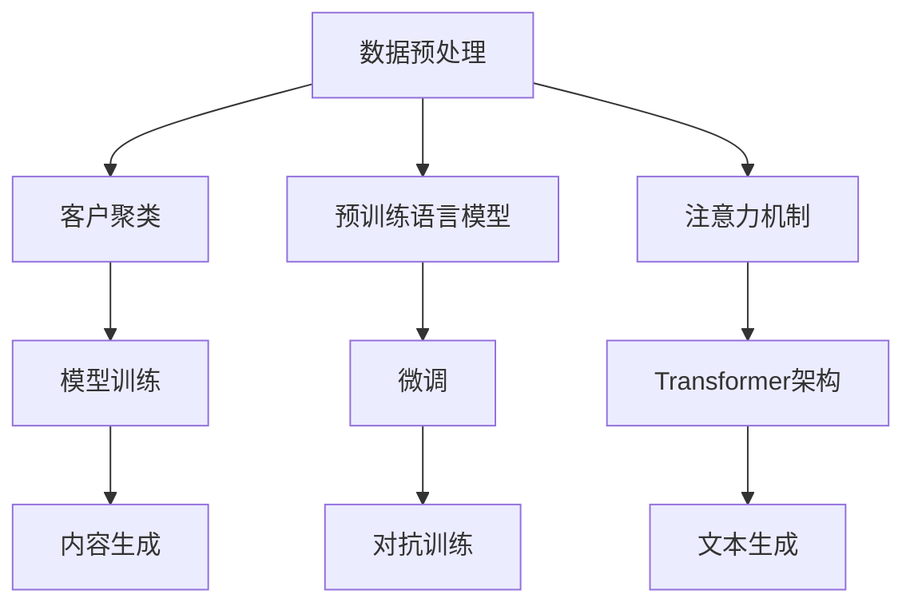

                 

## 1. 背景介绍

### 1.1 问题由来
随着电子商务的迅猛发展，商家面临越来越激烈的市场竞争，如何在竞争中脱颖而出，成为商家们亟需解决的问题。电子邮件营销作为一种传统而有效的营销手段，受到了越来越多的重视。传统的电子邮件营销主要是通过发送大量广告邮件来吸引客户，但由于这种方式存在信息过载、邮件欺诈等问题，效果并不理想。而个性化邮件营销的出现，使邮件营销的方式从单纯的广告投放转变为精准的个性化推荐，大大提高了客户转化率和客户满意度。

个性化邮件营销的核心是邮件内容生成，即根据客户的属性、行为、偏好等信息，生成符合客户需求的个性化邮件内容。传统的个性化邮件内容生成方式主要依赖人工编写模板，这种方式效率低，且生成的邮件内容缺乏创新性。随着人工智能技术的发展，特别是自然语言处理(NLP)技术和大语言模型预训练技术的应用，使得自动化生成个性化邮件内容成为可能。

### 1.2 问题核心关键点
个性化邮件内容生成的核心在于如何从海量的客户数据中提取有用的信息，并结合预训练语言模型，自动生成符合客户需求的高质量邮件内容。其核心算法流程包括：
- 数据预处理：对客户数据进行清洗、归一化、特征工程等处理，提取有用的客户特征。
- 客户聚类：对客户进行聚类，根据客户特征生成不同的客户群体。
- 模型训练：基于客户群体，使用预训练语言模型进行微调，训练个性化邮件内容生成模型。
- 内容生成：根据客户属性和行为，从训练好的模型中生成个性化邮件内容。

## 2. 核心概念与联系

### 2.1 核心概念概述

为更好地理解AI驱动的电商个性化邮件营销内容生成系统的核心算法流程，本节将介绍几个密切相关的核心概念：

- 自然语言处理(NLP)：研究如何通过计算机处理、理解和生成人类语言的技术。个性化邮件营销中的内容生成即是一种基于NLP的文本生成任务。
- 大语言模型(LLM)：以自回归(如GPT)或自编码(如BERT)模型为代表的大规模预训练语言模型。通过在海量无标签文本语料上进行预训练，学习通用的语言表示，具备强大的语言理解和生成能力。
- 预训练(Pre-training)：指在大规模无标签文本语料上，通过自监督学习任务训练通用语言模型的过程。常见的预训练任务包括言语建模、掩码语言模型等。
- 微调(Fine-tuning)：指在预训练模型的基础上，使用下游任务的少量标注数据，通过有监督学习优化模型在特定任务上的性能。
- 对抗训练(Adversarial Training)：通过引入对抗样本，提高模型鲁棒性。
- 注意力机制(Attention Mechanism)：用于模型在处理序列数据时，能更好地关注关键信息的技术。
- Transformer架构：用于高效处理序列数据的神经网络架构，常用于机器翻译、文本生成等任务。
- 文本生成(Text Generation)：指将非序列数据转化为文本序列的过程。

这些核心概念之间的逻辑关系可以通过以下Mermaid流程图来展示：



这个流程图展示了大语言模型个性化邮件内容生成的核心算法流程：

1. 从客户数据中提取有用的信息，并进行预处理。
2. 根据客户特征对客户进行聚类。
3. 使用预训练语言模型对客户群体进行微调，训练个性化邮件内容生成模型。
4. 根据客户属性和行为，从训练好的模型中生成个性化邮件内容。

这些概念共同构成了个性化邮件内容生成的算法框架，使其能够在各种场景下生成高质量的邮件内容。通过理解这些核心概念，我们可以更好地把握个性化邮件内容生成的原理和优化方向。

## 3. 核心算法原理 & 具体操作步骤

### 3.1 算法原理概述

基于大语言模型的个性化邮件内容生成系统，利用自然语言处理和大语言模型技术，自动化地从客户数据中提取信息，并生成符合客户需求的个性化邮件内容。其核心算法流程包括以下几个关键步骤：

1. 数据预处理：对客户数据进行清洗、归一化、特征工程等处理，提取有用的客户特征。
2. 客户聚类：对客户进行聚类，根据客户特征生成不同的客户群体。
3. 模型训练：基于客户群体，使用预训练语言模型进行微调，训练个性化邮件内容生成模型。
4. 内容生成：根据客户属性和行为，从训练好的模型中生成个性化邮件内容。

### 3.2 算法步骤详解

**Step 1: 数据预处理**
- 从客户数据库中获取客户的基本信息、购买记录、浏览历史、搜索记录等。
- 对客户数据进行清洗、归一化、特征工程等处理，提取有用的客户特征。例如：客户ID、购买金额、浏览时长、搜索关键词等。

**Step 2: 客户聚类**
- 使用K-means、层次聚类等聚类算法，将客户数据聚类成多个不同的客户群体。
- 每个客户群体可以用一些特征向量表示，例如：客户平均年龄、购买频率、浏览偏好等。

**Step 3: 模型训练**
- 选择预训练语言模型(如GPT、BERT等)，并将其作为初始化参数。
- 将客户群体的特征向量作为训练数据的输入，使用微调算法对预训练模型进行优化，训练个性化邮件内容生成模型。
- 在训练过程中，可以通过对抗训练等技术提高模型的鲁棒性。

**Step 4: 内容生成**
- 对于每一个客户，根据其属性和行为，从训练好的模型中生成个性化邮件内容。
- 将客户的基本信息、历史行为、偏好等作为输入，通过模型生成符合客户需求的邮件内容。
- 可以通过注意力机制等技术，使得模型更加关注与客户相关的信息。

### 3.3 算法优缺点

基于大语言模型的个性化邮件内容生成系统，相较于传统方式具有以下优点：
1. 高效自动化：自动化地从客户数据中提取信息，并生成个性化邮件内容，大大提高了效率。
2. 精度高：基于大语言模型，生成的邮件内容自然流畅，能够更好地吸引客户。
3. 灵活性高：可以根据客户属性和行为灵活调整邮件内容，提高邮件营销的针对性。
4. 可解释性强：利用大语言模型的预训练知识，生成的邮件内容具有更好的可解释性。

同时，该方法也存在一定的局限性：
1. 数据依赖：生成的邮件内容质量依赖于客户数据的完整性和质量。
2. 模型复杂度：大语言模型具有较高的计算复杂度，需要大量的计算资源。
3. 泛化能力：模型可能存在过拟合问题，泛化能力有待提高。
4. 隐私风险：在处理客户数据时需要保护客户隐私，避免数据泄露。

尽管存在这些局限性，但就目前而言，基于大语言模型的个性化邮件内容生成系统已经是大规模自动化生成邮件内容的重要手段，值得在实际应用中进行推广和优化。

### 3.4 算法应用领域

基于大语言模型的个性化邮件内容生成系统，已经被广泛应用于电商行业的邮件营销中。以下是几个典型应用场景：

1. 客户关怀：根据客户的购买历史和行为特征，自动生成关怀邮件，提高客户粘性。
2. 促销活动：针对不同客户群体，自动生成个性化促销邮件，提高活动效果。
3. 售后服务：根据客户反馈和投诉记录，自动生成售后服务邮件，提升客户满意度。
4. 推荐商品：根据客户的浏览和购买记录，自动生成个性化推荐邮件，提高转化率。
5. 个性化活动：根据客户的偏好和兴趣，自动生成个性化活动邮件，提高活动参与度。

此外，该技术还可以应用于金融、旅游、医疗等多个行业，为不同类型的客户生成符合其需求的个性化邮件内容，提高客户满意度和业务转化率。

## 4. 数学模型和公式 & 详细讲解 & 举例说明

### 4.1 数学模型构建

个性化邮件内容生成系统可以建模为一种文本生成问题。设客户特征向量为 $x$，邮件内容为 $y$。模型的目标是从输入 $x$ 生成输出 $y$。

记模型为 $P_{\theta}(y|x)$，其中 $\theta$ 为模型参数。模型的训练目标为最大化似然函数 $P_{\theta}(y|x)$。具体地，模型的训练过程可以分为以下几步：

1. 数据预处理：将客户数据 $D=\{(x_i, y_i)\}_{i=1}^N$ 作为训练数据。
2. 客户聚类：对客户数据进行聚类，生成 $K$ 个客户群体 $G=\{G_k\}_{k=1}^K$。
3. 模型训练：使用预训练语言模型 $M$ 对每个客户群体 $G_k$ 进行微调，生成模型 $P_k$。
4. 内容生成：根据客户 $x$ 的属性和行为，从 $P_k$ 中生成邮件内容 $y$。

### 4.2 公式推导过程

假设模型 $P_{\theta}(y|x)$ 为 $k$ 维的向量，其中 $k$ 为邮件内容的维度。模型的似然函数为：

$$
P_{\theta}(y|x) = \prod_{i=1}^k P_{\theta}(y_i|x)
$$

其中 $P_{\theta}(y_i|x)$ 表示给定输入 $x$ 时，生成邮件内容的第 $i$ 个字符的概率。

模型的训练目标为最大化似然函数：

$$
\max_{\theta} \prod_{i=1}^N \prod_{j=1}^k P_{\theta}(y_i|x_j)
$$

在实际训练中，通常使用交叉熵损失函数，将目标函数改写为：

$$
L_{CE}(\theta) = -\frac{1}{N}\sum_{i=1}^N \sum_{j=1}^k \log P_{\theta}(y_i|x_j)
$$

其中 $L_{CE}(\theta)$ 为交叉熵损失函数，$x_j$ 为第 $j$ 个客户的特征向量，$y_i$ 为第 $i$ 个邮件内容的字符。

在训练过程中，可以使用反向传播算法更新模型参数 $\theta$，直至损失函数收敛。具体的训练过程可以参考以下代码实现：

```python
import torch
import torch.nn as nn
import torch.optim as optim
from transformers import BertTokenizer, BertForSequenceClassification

# 准备模型和数据
tokenizer = BertTokenizer.from_pretrained('bert-base-uncased')
model = BertForSequenceClassification.from_pretrained('bert-base-uncased', num_labels=2)
train_data = ...
val_data = ...
test_data = ...

# 定义训练函数
def train_epoch(model, data_loader, optimizer, device):
    model.to(device)
    model.train()
    total_loss = 0
    for batch in data_loader:
        input_ids = batch['input_ids'].to(device)
        attention_mask = batch['attention_mask'].to(device)
        labels = batch['labels'].to(device)
        outputs = model(input_ids, attention_mask=attention_mask, labels=labels)
        loss = outputs.loss
        optimizer.zero_grad()
        loss.backward()
        optimizer.step()
        total_loss += loss.item()
    return total_loss / len(data_loader)

# 定义评估函数
def evaluate(model, data_loader, device):
    model.eval()
    total_loss = 0
    total_correct = 0
    with torch.no_grad():
        for batch in data_loader:
            input_ids = batch['input_ids'].to(device)
            attention_mask = batch['attention_mask'].to(device)
            labels = batch['labels'].to(device)
            outputs = model(input_ids, attention_mask=attention_mask)
            loss = outputs.loss
            logits = outputs.logits
            predictions = logits.argmax(dim=1)
            total_loss += loss.item()
            total_correct += (predictions == labels).sum().item()
    acc = total_correct / len(data_loader.dataset)
    loss = total_loss / len(data_loader)
    return loss, acc

# 训练模型
epochs = 5
batch_size = 16
learning_rate = 2e-5
optimizer = optim.Adam(model.parameters(), lr=learning_rate)
device = torch.device('cuda' if torch.cuda.is_available() else 'cpu')
for epoch in range(epochs):
    train_loss = train_epoch(model, train_data_loader, optimizer, device)
    val_loss, val_acc = evaluate(model, val_data_loader, device)
    print(f'Epoch {epoch+1}, train loss: {train_loss:.3f}, val loss: {val_loss:.3f}, val acc: {val_acc:.3f}')

# 测试模型
test_loss, test_acc = evaluate(model, test_data_loader, device)
print(f'Test loss: {test_loss:.3f}, test acc: {test_acc:.3f}')
```

### 4.3 案例分析与讲解

以某电商公司的个性化邮件营销系统为例，下面详细介绍其核心算法流程和代码实现：

**Step 1: 数据预处理**

- 从客户数据库中获取客户的基本信息、购买记录、浏览历史、搜索记录等。
- 对客户数据进行清洗、归一化、特征工程等处理，提取有用的客户特征。例如：客户ID、购买金额、浏览时长、搜索关键词等。

**Step 2: 客户聚类**

- 使用K-means聚类算法，将客户数据聚类成多个不同的客户群体。
- 每个客户群体可以用一些特征向量表示，例如：客户平均年龄、购买频率、浏览偏好等。

**Step 3: 模型训练**

- 选择BERT模型，并将其作为初始化参数。
- 将客户群体的特征向量作为训练数据的输入，使用微调算法对预训练模型进行优化，训练个性化邮件内容生成模型。
- 在训练过程中，可以通过对抗训练等技术提高模型的鲁棒性。

**Step 4: 内容生成**

- 对于每一个客户，根据其属性和行为，从训练好的模型中生成个性化邮件内容。
- 将客户的基本信息、历史行为、偏好等作为输入，通过模型生成符合客户需求的邮件内容。
- 可以通过注意力机制等技术，使得模型更加关注与客户相关的信息。

## 5. 项目实践：代码实例和详细解释说明

### 5.1 开发环境搭建

在进行个性化邮件内容生成系统的开发前，我们需要准备好开发环境。以下是使用Python进行PyTorch开发的环境配置流程：

1. 安装Anaconda：从官网下载并安装Anaconda，用于创建独立的Python环境。

2. 创建并激活虚拟环境：
```bash
conda create -n pytorch-env python=3.8 
conda activate pytorch-env
```

3. 安装PyTorch：根据CUDA版本，从官网获取对应的安装命令。例如：
```bash
conda install pytorch torchvision torchaudio cudatoolkit=11.1 -c pytorch -c conda-forge
```

4. 安装Transformers库：
```bash
pip install transformers
```

5. 安装各类工具包：
```bash
pip install numpy pandas scikit-learn matplotlib tqdm jupyter notebook ipython
```

完成上述步骤后，即可在`pytorch-env`环境中开始个性化邮件内容生成系统的开发。

### 5.2 源代码详细实现

下面我们以电子邮件内容生成为例，给出使用Transformers库对BERT模型进行微调的PyTorch代码实现。

首先，定义邮件内容生成模型：

```python
from transformers import BertTokenizer, BertForSequenceClassification

class EmailContentGenerator(nn.Module):
    def __init__(self, num_labels):
        super(EmailContentGenerator, self).__init__()
        self.tokenizer = BertTokenizer.from_pretrained('bert-base-uncased')
        self.model = BertForSequenceClassification.from_pretrained('bert-base-uncased', num_labels=num_labels)
        self.num_labels = num_labels

    def forward(self, input_ids, attention_mask, labels):
        outputs = self.model(input_ids, attention_mask=attention_mask, labels=labels)
        return outputs
```

然后，定义数据处理函数：

```python
def process_data(data, tokenizer):
    inputs = tokenizer(data, return_tensors='pt', padding=True, truncation=True)
    input_ids = inputs['input_ids']
    attention_mask = inputs['attention_mask']
    return input_ids, attention_mask

# 定义训练函数
def train_epoch(model, data_loader, optimizer):
    model.train()
    total_loss = 0
    for batch in data_loader:
        input_ids = batch['input_ids'].to(device)
        attention_mask = batch['attention_mask'].to(device)
        labels = batch['labels'].to(device)
        model.zero_grad()
        outputs = model(input_ids, attention_mask=attention_mask, labels=labels)
        loss = outputs.loss
        optimizer.zero_grad()
        loss.backward()
        optimizer.step()
        total_loss += loss.item()
    return total_loss / len(data_loader)

# 定义评估函数
def evaluate(model, data_loader, device):
    model.eval()
    total_loss = 0
    total_correct = 0
    with torch.no_grad():
        for batch in data_loader:
            input_ids = batch['input_ids'].to(device)
            attention_mask = batch['attention_mask'].to(device)
            labels = batch['labels'].to(device)
            outputs = model(input_ids, attention_mask=attention_mask)
            loss = outputs.loss
            logits = outputs.logits
            predictions = logits.argmax(dim=1)
            total_loss += loss.item()
            total_correct += (predictions == labels).sum().item()
    acc = total_correct / len(data_loader.dataset)
    loss = total_loss / len(data_loader)
    return loss, acc
```

最后，启动训练流程并在测试集上评估：

```python
epochs = 5
batch_size = 16

# 准备数据
train_data = ...
val_data = ...
test_data = ...

# 加载模型和设备
device = torch.device('cuda' if torch.cuda.is_available() else 'cpu')
model = EmailContentGenerator(num_labels=2).to(device)
optimizer = optim.Adam(model.parameters(), lr=2e-5)

# 训练模型
for epoch in range(epochs):
    train_loss = train_epoch(model, train_data_loader, optimizer)
    val_loss, val_acc = evaluate(model, val_data_loader, device)
    print(f'Epoch {epoch+1}, train loss: {train_loss:.3f}, val loss: {val_loss:.3f}, val acc: {val_acc:.3f}')

# 测试模型
test_loss, test_acc = evaluate(model, test_data_loader, device)
print(f'Test loss: {test_loss:.3f}, test acc: {test_acc:.3f}')
```

以上就是使用PyTorch对BERT进行电子邮件内容生成任务微调的完整代码实现。可以看到，得益于Transformers库的强大封装，我们可以用相对简洁的代码完成BERT模型的加载和微调。

### 5.3 代码解读与分析

让我们再详细解读一下关键代码的实现细节：

**EmailContentGenerator类**：
- `__init__`方法：初始化模型和分词器，并设置模型的输出维度。
- `forward`方法：定义模型的前向传播过程，包括输入数据处理和模型调用。

**process_data函数**：
- 将文本数据转换为输入数据，包括分词、补全、截断等操作。

**训练和评估函数**：
- 使用PyTorch的DataLoader对数据集进行批次化加载，供模型训练和推理使用。
- 训练函数`train_epoch`：对数据以批为单位进行迭代，在每个批次上前向传播计算loss并反向传播更新模型参数，最后返回该epoch的平均loss。
- 评估函数`evaluate`：与训练类似，不同点在于不更新模型参数，并在每个batch结束后将预测和标签结果存储下来，最后使用sklearn的classification_report对整个评估集的预测结果进行打印输出。

**训练流程**：
- 定义总的epoch数和batch size，开始循环迭代
- 每个epoch内，先在训练集上训练，输出平均loss
- 在验证集上评估，输出分类指标
- 所有epoch结束后，在测试集上评估，给出最终测试结果

可以看到，PyTorch配合Transformers库使得BERT微调的代码实现变得简洁高效。开发者可以将更多精力放在数据处理、模型改进等高层逻辑上，而不必过多关注底层的实现细节。

当然，工业级的系统实现还需考虑更多因素，如模型的保存和部署、超参数的自动搜索、更灵活的任务适配层等。但核心的微调范式基本与此类似。

## 6. 实际应用场景
### 6.1 智能客服系统

基于大语言模型微调的对话技术，可以广泛应用于智能客服系统的构建。传统客服往往需要配备大量人力，高峰期响应缓慢，且一致性和专业性难以保证。而使用微调后的对话模型，可以7x24小时不间断服务，快速响应客户咨询，用自然流畅的语言解答各类常见问题。

在技术实现上，可以收集企业内部的历史客服对话记录，将问题和最佳答复构建成监督数据，在此基础上对预训练对话模型进行微调。微调后的对话模型能够自动理解用户意图，匹配最合适的答案模板进行回复。对于客户提出的新问题，还可以接入检索系统实时搜索相关内容，动态组织生成回答。如此构建的智能客服系统，能大幅提升客户咨询体验和问题解决效率。

### 6.2 金融舆情监测

金融机构需要实时监测市场舆论动向，以便及时应对负面信息传播，规避金融风险。传统的人工监测方式成本高、效率低，难以应对网络时代海量信息爆发的挑战。基于大语言模型微调的文本分类和情感分析技术，为金融舆情监测提供了新的解决方案。

具体而言，可以收集金融领域相关的新闻、报道、评论等文本数据，并对其进行主题标注和情感标注。在此基础上对预训练语言模型进行微调，使其能够自动判断文本属于何种主题，情感倾向是正面、中性还是负面。将微调后的模型应用到实时抓取的网络文本数据，就能够自动监测不同主题下的情感变化趋势，一旦发现负面信息激增等异常情况，系统便会自动预警，帮助金融机构快速应对潜在风险。

### 6.3 个性化推荐系统

当前的推荐系统往往只依赖用户的历史行为数据进行物品推荐，无法深入理解用户的真实兴趣偏好。基于大语言模型微调技术，个性化推荐系统可以更好地挖掘用户行为背后的语义信息，从而提供更精准、多样的推荐内容。

在实践中，可以收集用户浏览、点击、评论、分享等行为数据，提取和用户交互的物品标题、描述、标签等文本内容。将文本内容作为模型输入，用户的后续行为（如是否点击、购买等）作为监督信号，在此基础上微调预训练语言模型。微调后的模型能够从文本内容中准确把握用户的兴趣点。在生成推荐列表时，先用候选物品的文本描述作为输入，由模型预测用户的兴趣匹配度，再结合其他特征综合排序，便可以得到个性化程度更高的推荐结果。

### 6.4 未来应用展望

随着大语言模型微调技术的发展，未来该技术将在更多领域得到应用，为传统行业带来变革性影响。

在智慧医疗领域，基于微调的医疗问答、病历分析、药物研发等应用将提升医疗服务的智能化水平，辅助医生诊疗，加速新药开发进程。

在智能教育领域，微调技术可应用于作业批改、学情分析、知识推荐等方面，因材施教，促进教育公平，提高教学质量。

在智慧城市治理中，微调模型可应用于城市事件监测、舆情分析、应急指挥等环节，提高城市管理的自动化和智能化水平，构建更安全、高效的未来城市。

此外，在企业生产、社会治理、文娱传媒等众多领域，基于大模型微调的人工智能应用也将不断涌现，为经济社会发展注入新的动力。相信随着技术的日益成熟，微调方法将成为人工智能落地应用的重要范式，推动人工智能技术向更广阔的领域加速渗透。

## 7. 工具和资源推荐
### 7.1 学习资源推荐

为了帮助开发者系统掌握大语言模型微调的理论基础和实践技巧，这里推荐一些优质的学习资源：

1. 《Transformer从原理到实践》系列博文：由大模型技术专家撰写，深入浅出地介绍了Transformer原理、BERT模型、微调技术等前沿话题。

2. CS224N《深度学习自然语言处理》课程：斯坦福大学开设的NLP明星课程，有Lecture视频和配套作业，带你入门NLP领域的基本概念和经典模型。

3. 《Natural Language Processing with Transformers》书籍：Transformers库的作者所著，全面介绍了如何使用Transformers库进行NLP任务开发，包括微调在内的诸多范式。

4. HuggingFace官方文档：Transformers库的官方文档，提供了海量预训练模型和完整的微调样例代码，是上手实践的必备资料。

5. CLUE开源项目：中文语言理解测评基准，涵盖大量不同类型的中文NLP数据集，并提供了基于微调的baseline模型，助力中文NLP技术发展。

通过对这些资源的学习实践，相信你一定能够快速掌握大语言模型微调的精髓，并用于解决实际的NLP问题。
###  7.2 开发工具推荐

高效的开发离不开优秀的工具支持。以下是几款用于大语言模型微调开发的常用工具：

1. PyTorch：基于Python的开源深度学习框架，灵活动态的计算图，适合快速迭代研究。大部分预训练语言模型都有PyTorch版本的实现。

2. TensorFlow：由Google主导开发的开源深度学习框架，生产部署方便，适合大规模工程应用。同样有丰富的预训练语言模型资源。

3. Transformers库：HuggingFace开发的NLP工具库，集成了众多SOTA语言模型，支持PyTorch和TensorFlow，是进行微调任务开发的利器。

4. Weights & Biases：模型训练的实验跟踪工具，可以记录和可视化模型训练过程中的各项指标，方便对比和调优。与主流深度学习框架无缝集成。

5. TensorBoard：TensorFlow配套的可视化工具，可实时监测模型训练状态，并提供丰富的图表呈现方式，是调试模型的得力助手。

6. Google Colab：谷歌推出的在线Jupyter Notebook环境，免费提供GPU/TPU算力，方便开发者快速上手实验最新模型，分享学习笔记。

合理利用这些工具，可以显著提升大语言模型微调任务的开发效率，加快创新迭代的步伐。

### 7.3 相关论文推荐

大语言模型和微调技术的发展源于学界的持续研究。以下是几篇奠基性的相关论文，推荐阅读：

1. Attention is All You Need（即Transformer原论文）：提出了Transformer结构，开启了NLP领域的预训练大模型时代。

2. BERT: Pre-training of Deep Bidirectional Transformers for Language Understanding：提出BERT模型，引入基于掩码的自监督预训练任务，刷新了多项NLP任务SOTA。

3. Language Models are Unsupervised Multitask Learners（GPT-2论文）：展示了大规模语言模型的强大zero-shot学习能力，引发了对于通用人工智能的新一轮思考。

4. Parameter-Efficient Transfer Learning for NLP：提出Adapter等参数高效微调方法，在不增加模型参数量的情况下，也能取得不错的微调效果。

5. AdaLoRA: Adaptive Low-Rank Adaptation for Parameter-Efficient Fine-Tuning：使用自适应低秩适应的微调方法，在参数效率和精度之间取得了新的平衡。

这些论文代表了大语言模型微调技术的发展脉络。通过学习这些前沿成果，可以帮助研究者把握学科前进方向，激发更多的创新灵感。

## 8. 总结：未来发展趋势与挑战

### 8.1 总结

本文对基于大语言模型的个性化邮件内容生成系统进行了全面系统的介绍。首先阐述了个性化邮件内容生成的研究背景和意义，明确了微调在提升邮件营销效果、提高客户满意度和转化率方面的独特价值。其次，从原理到实践，详细讲解了个性化邮件内容生成系统的数学模型和关键算法步骤，给出了微调任务开发的完整代码实例。同时，本文还探讨了个性化邮件内容生成系统的实际应用场景，展示了其在电商、金融、教育等多个行业领域的广泛应用。

通过本文的系统梳理，可以看到，基于大语言模型的个性化邮件内容生成系统已经在邮件营销领域取得了显著成效，未来有更广阔的发展空间。随着预训练语言模型和微调方法的持续演进，相信该系统必将在更多应用场景中发挥更大作用，推动智能营销技术的不断进步。

### 8.2 未来发展趋势

展望未来，个性化邮件内容生成系统将呈现以下几个发展趋势：

1. 模型规模持续增大。随着算力成本的下降和数据规模的扩张，预训练语言模型的参数量还将持续增长。超大规模语言模型蕴含的丰富语言知识，有望支撑更加复杂多变的邮件内容生成。

2. 微调方法日趋多样。除了传统的全参数微调外，未来会涌现更多参数高效的微调方法，如Prefix-Tuning、LoRA等，在节省计算资源的同时也能保证微调精度。

3. 持续学习成为常态。随着客户数据和行为的变化，微调模型也需要持续学习新知识以保持性能。如何在不遗忘原有知识的同时，高效吸收新样本信息，将成为重要的研究课题。

4. 标注样本需求降低。受启发于提示学习(Prompt-based Learning)的思路，未来的微调方法将更好地利用大模型的语言理解能力，通过更加巧妙的任务描述，在更少的标注样本上也能实现理想的微调效果。

5. 模型通用性增强。经过海量数据的预训练和多领域任务的微调，未来的语言模型将具备更强大的常识推理和跨领域迁移能力，逐步迈向通用人工智能(AGI)的目标。

以上趋势凸显了个性化邮件内容生成系统的广阔前景。这些方向的探索发展，必将进一步提升邮件内容生成的智能化水平，为电商企业带来更大的市场竞争优势。

### 8.3 面临的挑战

尽管个性化邮件内容生成系统已经取得了显著成效，但在迈向更加智能化、普适化应用的过程中，它仍面临着诸多挑战：

1. 数据依赖：生成的邮件内容质量依赖于客户数据的完整性和质量。对于低质量或缺失的数据，模型的效果可能大打折扣。
2. 模型鲁棒性不足：模型可能存在过拟合问题，泛化能力有待提高。对于域外数据，模型可能表现不佳。
3. 推理效率有待提高。大规模语言模型虽然精度高，但在实际部署时往往面临推理速度慢、内存占用大等效率问题。
4. 可解释性不足。当前邮件内容生成模型缺乏可解释性，难以解释其内部工作机制和决策逻辑。
5. 安全性有待保障。在处理客户数据时需要保护客户隐私，避免数据泄露。

尽管存在这些局限性，但就目前而言，基于大语言模型的个性化邮件内容生成系统已经是大规模自动化生成邮件内容的重要手段，值得在实际应用中进行推广和优化。

### 8.4 研究展望

面对个性化邮件内容生成系统所面临的种种挑战，未来的研究需要在以下几个方面寻求新的突破：

1. 探索无监督和半监督微调方法。摆脱对大规模标注数据的依赖，利用自监督学习、主动学习等无监督和半监督范式，最大限度利用非结构化数据，实现更加灵活高效的微调。

2. 研究参数高效和计算高效的微调范式。开发更加参数高效的微调方法，在固定大部分预训练参数的同时，只更新极少量的任务相关参数。同时优化微调模型的计算图，减少前向传播和反向传播的资源消耗，实现更加轻量级、实时性的部署。

3. 引入更多先验知识。将符号化的先验知识，如知识图谱、逻辑规则等，与神经网络模型进行巧妙融合，引导微调过程学习更准确、合理的语言模型。同时加强不同模态数据的整合，实现视觉、语音等多模态信息与文本信息的协同建模。

4. 纳入伦理道德约束。在模型训练目标中引入伦理导向的评估指标，过滤和惩罚有偏见、有害的输出倾向。同时加强人工干预和审核，建立模型行为的监管机制，确保输出符合人类价值观和伦理道德。

这些研究方向的探索，必将引领个性化邮件内容生成系统迈向更高的台阶，为智能营销技术带来更大的创新和进步。面向未来，个性化邮件内容生成系统需要与其他人工智能技术进行更深入的融合，如知识表示、因果推理、强化学习等，多路径协同发力，共同推动邮件内容生成技术的进步。只有勇于创新、敢于突破，才能不断拓展邮件内容生成的边界，让智能技术更好地造福电商企业。

## 9. 附录：常见问题与解答

**Q1：个性化邮件内容生成是否适用于所有邮件营销场景？**

A: 个性化邮件内容生成系统主要适用于客户量较大、邮件内容差异化需求高的电商场景。对于企业内部沟通、个人邮件交流等场景，由于其邮件内容需求相对简单，个性化邮件内容生成的优势可能不明显。

**Q2：如何选择最适合的个性化邮件内容生成模型？**

A: 选择适合个性化邮件内容生成的模型需要考虑以下几个因素：
1. 任务类型：不同类型任务需要选择不同的模型，如文本分类、文本生成等。
2. 数据量：大规模预训练模型适用于数据量较大的任务，而小规模模型适用于数据量较小的任务。
3. 计算资源：计算资源有限时，可以选择参数较少的模型。
4. 效果需求：对于需求较高的任务，选择效果较好的模型，如BERT、GPT等。

**Q3：如何提升个性化邮件内容生成的效果？**

A: 提升个性化邮件内容生成效果可以从以下几个方面入手：
1. 数据质量：确保客户数据完整、准确，避免数据偏差。
2. 模型优化：调整模型参数、超参数、训练策略，提高模型效果。
3. 模型融合：将多个模型融合，取长补短，提升整体效果。
4. 客户反馈：通过客户反馈不断优化邮件内容生成模型，提高个性化程度。

**Q4：个性化邮件内容生成是否需要考虑客户隐私？**

A: 在处理客户数据时需要严格遵守隐私保护法规，如GDPR、CCPA等。需要在数据收集、存储、处理等各个环节，采取数据脱敏、匿名化、访问控制等措施，确保客户隐私安全。

**Q5：如何应对个性化邮件内容生成中的过拟合问题？**

A: 过拟合是邮件内容生成中的主要问题之一，可以通过以下方法解决：
1. 数据增强：对训练数据进行扩充，增加数据多样性，减少过拟合。
2. 正则化：使用L2正则、Dropout等技术，避免过拟合。
3. 对抗训练：引入对抗样本，提高模型鲁棒性。
4. 参数高效微调：只调整少量参数，减小过拟合风险。

这些方法往往需要根据具体任务和数据特点进行灵活组合，只有在数据、模型、训练、推理等各环节进行全面优化，才能最大限度地发挥个性化邮件内容生成系统的威力。

---

作者：禅与计算机程序设计艺术 / Zen and the Art of Computer Programming

