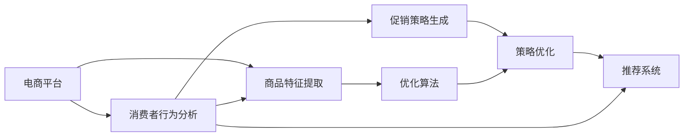

                 

# AI驱动的电商平台个性化促销策略生成

> 关键词：人工智能,电商平台,个性化推荐,促销策略,深度学习,优化算法,模型训练,推荐系统,消费者行为,决策分析

## 1. 背景介绍

### 1.1 问题由来
随着电子商务的迅猛发展，电商平台逐渐成为人们购物的主要渠道。然而，高竞争度的市场环境让电商商家面临着巨大的市场挑战。为了增强用户粘性，电商平台普遍采取了多样化、个性化的促销策略，但这些策略往往依赖于人工经验，难以满足个性化需求，且策略生成耗时长，效果不佳。

为解决以上问题，AI技术特别是深度学习、推荐系统、自然语言处理等技术被广泛引入电商促销策略生成中。本文重点讨论如何利用AI技术，特别是深度学习，自动生成个性化促销策略。通过学习消费者行为、商品特征以及平台历史促销数据，AI能够挖掘消费者偏好，并自动化生成高质量的促销策略。

### 1.2 问题核心关键点
- 电商促销策略生成的核心在于自动化地从海量数据中发现并生成个性化促销方案。
- 关键技术包括消费者行为分析、商品特征提取、促销策略生成、以及优化算法等。
- 主要目标是提高促销策略的个性化程度和效果，同时降低生成成本和优化难度。

## 2. 核心概念与联系

### 2.1 核心概念概述

为更好地理解AI驱动的电商促销策略生成方法，本节将介绍几个关键概念：

- 电商平台：利用互联网提供商品展示、交易、支付等服务的电子商店。
- 促销策略：商家为刺激消费而设计的一系列短期营销活动，如折扣、买一赠一、满减等。
- 个性化推荐：通过分析用户行为数据，为每个用户推荐其最可能感兴趣的商品或服务。
- 深度学习：通过多层次的神经网络模型，自动从数据中学习和提取特征，以实现智能化任务。
- 推荐系统：利用用户行为数据，为用户推荐产品、内容、活动等，提升用户体验和转化率。
- 消费者行为分析：通过分析用户的历史行为数据，理解用户的兴趣、需求和偏好，进而提供个性化服务。
- 优化算法：通过求解最优化问题，最大化促销策略效果，如梯度下降、遗传算法等。

这些核心概念共同构成了电商促销策略生成系统的技术基础，涵盖了从数据处理到模型训练，再到策略生成的全流程。

### 2.2 核心概念原理和架构的 Mermaid 流程图



这个流程图展示了核心概念之间的联系：

1. 电商平台数据包括用户行为、商品信息等，首先进行消费者行为分析和商品特征提取。
2. 然后基于分析结果和商品特征生成初步的促销策略，再通过优化算法优化策略。
3. 最后，策略结果通过推荐系统，个性化推荐给用户。

## 3. 核心算法原理 & 具体操作步骤
### 3.1 算法原理概述

基于深度学习的电商促销策略生成方法，核心思想是：利用消费者行为和商品特征，构建一系列特征表示，输入深度神经网络模型中，输出促销策略的生成方案。具体的算法流程可以分为以下四个步骤：

1. **数据预处理**：将原始数据转换为模型可接受的格式，包括用户行为数据、商品特征、促销历史数据等。
2. **特征表示学习**：利用深度学习模型提取数据中的高层次特征表示，为后续策略生成提供输入。
3. **促销策略生成**：将特征表示输入到生成模型中，输出促销策略方案。
4. **策略优化**：利用优化算法，如遗传算法、梯度下降等，对生成策略进行优化，提升策略效果。

### 3.2 算法步骤详解

#### 3.2.1 数据预处理

数据预处理主要包括数据清洗、标准化和转换等步骤：

1. **数据清洗**：去除缺失、异常、重复等数据，保证数据质量。
2. **数据标准化**：对不同量纲的数据进行归一化处理，以便后续模型训练。
3. **特征转换**：将原始数据转换为模型所需的特征格式，如商品ID、用户ID、行为记录等。

#### 3.2.2 特征表示学习

特征表示学习主要是通过深度神经网络模型提取高层次特征：

1. **嵌入层**：将原始特征转换为低维向量表示，如用户行为嵌入、商品特征嵌入等。
2. **卷积层**：利用卷积神经网络提取局部特征，如商品类别、用户偏好等。
3. **池化层**：将卷积层的输出进行池化，降维压缩，提取全局特征。
4. **全连接层**：将池化层的输出映射为高维特征向量，提供给后续策略生成模型。

#### 3.2.3 促销策略生成

促销策略生成模型通常采用循环神经网络或变分自编码器等生成模型：

1. **循环神经网络**：通过时间序列数据预测生成促销策略，如长短时记忆网络（LSTM）、门控循环单元（GRU）等。
2. **变分自编码器**：生成连续型的促销策略，如生成对抗网络（GAN）、变分自编码器（VAE）等。

#### 3.2.4 策略优化

策略优化通过求解最优化问题，最大化促销策略的效果：

1. **遗传算法**：通过模拟自然选择和基因交叉机制，迭代优化促销策略。
2. **梯度下降**：通过反向传播算法，利用梯度信息更新模型参数，优化策略效果。
3. **强化学习**：利用奖励机制和反馈信息，通过试错方式优化策略生成过程。

### 3.3 算法优缺点

基于深度学习的电商促销策略生成方法具有以下优点：

1. **自动化生成**：无需人工干预，自动生成高质量的促销策略，提高效率。
2. **高度个性化**：利用用户行为和商品特征，生成符合用户偏好的促销方案，提升用户满意度。
3. **动态调整**：实时监测策略效果，通过优化算法动态调整策略，适应市场变化。

同时，该方法也存在一定的局限性：

1. **数据依赖**：策略生成效果依赖于数据质量，数据量不足或数据偏差将影响策略生成。
2. **模型复杂**：深度学习模型训练复杂度高，需要大量计算资源和时间。
3. **策略泛化**：策略生成模型容易过拟合训练数据，泛化到新数据时表现不佳。
4. **优化难度**：优化算法难以直接处理非线性、高维数据，可能需要多轮迭代。

尽管存在这些局限性，基于深度学习的策略生成方法仍是目前最先进的技术手段，广泛应用于各大电商平台的促销活动。

### 3.4 算法应用领域

该算法广泛应用于以下领域：

1. **电商促销策略生成**：自动生成各种促销活动方案，如折扣、满减、买一赠一等。
2. **个性化推荐系统**：利用用户行为和商品特征，生成个性化推荐，提升用户体验。
3. **消费者行为分析**：分析用户购买行为、浏览记录，挖掘用户偏好，提供个性化服务。
4. **市场分析**：预测市场趋势，制定动态营销策略，提升市场竞争力。

## 4. 数学模型和公式 & 详细讲解 & 举例说明

### 4.1 数学模型构建

假设用户行为数据为 $x \in \mathcal{X}$，商品特征为 $y \in \mathcal{Y}$，促销历史数据为 $z \in \mathcal{Z}$，则电商促销策略生成的数学模型可以表示为：

$$
\theta^* = \mathop{\arg\min}_{\theta} \mathcal{L}(\theta, x, y, z)
$$

其中，$\mathcal{L}$ 为损失函数，用于衡量策略效果与真实效果之间的差异。

### 4.2 公式推导过程

以循环神经网络（LSTM）模型为例，进行促销策略生成的详细推导：

1. **输入层**：将用户行为和商品特征转换为向量表示，记为 $x_t$。
2. **嵌入层**：将向量表示转换为低维嵌入向量，记为 $h_t$。
3. **LSTM层**：利用LSTM网络对嵌入向量进行时间序列建模，记为 $h_t^{(l)}$。
4. **全连接层**：将LSTM网络的输出映射为高维特征向量，记为 $f_t$。
5. **生成模型**：利用生成模型（如LSTM、GAN等）输出促销策略 $s_t$。

### 4.3 案例分析与讲解

以一家电商平台为例，详细说明促销策略生成的实现过程：

1. **数据预处理**：从电商平台中收集用户行为数据、商品特征和促销历史数据。对数据进行清洗、标准化和特征转换。
2. **特征表示学习**：利用LSTM模型，将用户行为和商品特征转换为低维嵌入向量。
3. **促销策略生成**：利用LSTM模型，生成促销策略方案，如折扣、买一赠一等。
4. **策略优化**：利用遗传算法，对生成的策略进行优化，提升策略效果。

## 5. 项目实践：代码实例和详细解释说明
### 5.1 开发环境搭建

在进行项目实践前，我们需要准备好开发环境。以下是使用Python进行TensorFlow开发的环境配置流程：

1. 安装Anaconda：从官网下载并安装Anaconda，用于创建独立的Python环境。
2. 创建并激活虚拟环境：
```bash
conda create -n tf-env python=3.8 
conda activate tf-env
```

3. 安装TensorFlow：根据CUDA版本，从官网获取对应的安装命令。例如：
```bash
conda install tensorflow -c tf -c conda-forge
```

4. 安装Keras：
```bash
pip install keras
```

5. 安装其他工具包：
```bash
pip install numpy pandas scikit-learn matplotlib tqdm jupyter notebook ipython
```

完成上述步骤后，即可在`tf-env`环境中开始项目实践。

### 5.2 源代码详细实现

这里我们以循环神经网络（LSTM）生成促销策略为例，给出TensorFlow代码实现。

```python
import tensorflow as tf
from tensorflow.keras.models import Sequential
from tensorflow.keras.layers import LSTM, Dense, Embedding, RepeatVector
from tensorflow.keras.optimizers import Adam
from tensorflow.keras.callbacks import EarlyStopping

# 定义模型
model = Sequential([
    Embedding(input_dim=num_users, output_dim=64, input_length=100),
    LSTM(64, return_sequences=True),
    LSTM(64, return_sequences=False),
    Dense(64, activation='relu'),
    Dense(num_actions, activation='softmax')
])

# 编译模型
model.compile(loss='binary_crossentropy', optimizer=Adam(lr=0.001), metrics=['accuracy'])

# 训练模型
early_stopping = EarlyStopping(monitor='val_loss', patience=5)
model.fit(X_train, y_train, validation_data=(X_val, y_val), epochs=100, callbacks=[early_stopping])
```

在代码中，首先定义了一个LSTM模型，包含嵌入层、LSTM层、全连接层和输出层。然后编译模型，设置损失函数和优化器。在训练模型时，使用EarlyStopping回调函数，避免过拟合。

### 5.3 代码解读与分析

让我们再详细解读一下关键代码的实现细节：

**LSTM模型**：
- 嵌入层：将用户行为和商品特征转换为64维的低维嵌入向量。
- LSTM层：通过两个LSTM层进行时间序列建模，获取高层次的特征表示。
- 全连接层：将LSTM的输出映射为64维特征向量，提供给输出层。
- 输出层：通过softmax激活函数，输出促销策略的概率分布。

**模型编译和训练**：
- 编译模型时，设置损失函数为二分类交叉熵，优化器为Adam，学习率为0.001。
- 训练模型时，设置EarlyStopping回调函数，监控验证集损失，若连续5个epoch没有提升，则停止训练。

**代码运行结果展示**：
在模型训练过程中，可以实时监测训练集和验证集的损失和准确率。如果模型收敛良好，可以看到训练集和验证集的损失逐渐下降，准确率逐渐提升。最终的模型结果可以通过模型.save()方法保存下来，供后续使用。

## 6. 实际应用场景

### 6.1 智能客服系统

智能客服系统是电商平台的重要组成部分，通过自然语言处理（NLP）技术，能够自动解答用户问题，提升用户体验。利用AI驱动的电商促销策略生成技术，可以为智能客服系统提供个性化的促销信息，引导用户进行购买。

具体实现方式如下：

1. **用户意图识别**：利用NLP技术，识别用户的意图和需求。
2. **促销策略生成**：根据用户意图，自动生成相应的促销策略，如折扣、满减等。
3. **策略展示**：通过智能客服系统，向用户展示生成的促销策略。
4. **用户反馈**：收集用户对促销策略的反馈，优化后续策略生成。

### 6.2 个性化推荐系统

个性化推荐系统是电商平台的另一重要功能，通过分析用户行为数据，推荐用户感兴趣的商品。利用AI驱动的促销策略生成技术，可以为个性化推荐系统提供动态的促销信息，增强推荐效果。

具体实现方式如下：

1. **用户行为分析**：利用推荐系统，分析用户的历史行为数据。
2. **促销策略生成**：根据用户偏好，自动生成个性化的促销策略。
3. **推荐结果展示**：将推荐结果和促销信息结合，推荐给用户。
4. **效果评估**：收集用户反馈，评估促销策略的效果，优化后续策略生成。

### 6.3 营销活动管理

营销活动管理是电商平台的重要环节，通过自动化生成促销策略，能够有效提升营销活动的效果。利用AI驱动的促销策略生成技术，可以为营销活动管理提供支持。

具体实现方式如下：

1. **营销活动规划**：根据市场数据和历史活动效果，规划营销活动的目标和预算。
2. **促销策略生成**：自动生成个性化的促销策略，如折扣、满减等。
3. **活动执行**：将生成的策略执行到电商平台中，实施营销活动。
4. **效果评估**：收集活动效果数据，评估策略效果，优化后续活动策划。

### 6.4 未来应用展望

随着AI技术的不断发展，基于深度学习的电商促销策略生成方法将具备更强的个性化和动态调整能力。未来，可以进一步结合生成对抗网络（GAN）等先进技术，生成更加多样化和吸引力的促销策略。同时，通过多模态数据融合，如结合图像、视频等，提高策略生成的多样性和效果。

此外，可以结合自然语言处理（NLP）技术，利用消费者反馈和市场数据，实时调整策略生成模型，进一步提升策略的个性化和实时性。未来，电商平台将能够根据用户行为和市场变化，实时生成个性化的促销策略，提升用户体验和营销效果。

## 7. 工具和资源推荐

### 7.1 学习资源推荐

为帮助开发者掌握AI驱动的电商促销策略生成技术，以下是一些推荐的学习资源：

1. 《深度学习》书籍：Ian Goodfellow所著，全面介绍了深度学习的基本原理和应用。
2. 《TensorFlow实战》书籍：Manning Publications 出版社，详细介绍了TensorFlow框架的使用。
3 《自然语言处理综论》书籍：Daniel Jurafsky 和 James H. Martin 所著，涵盖了NLP技术的基础知识。
4 《Python机器学习》书籍：Sebastian Raschka 所著，介绍了Python在机器学习中的使用。
5 《Keras实战》书籍：François Chollet 所著，详细介绍了Keras框架的使用。

### 7.2 开发工具推荐

高效的开发离不开优秀的工具支持。以下是几款用于项目开发的常用工具：

1. TensorFlow：基于Python的深度学习框架，灵活高效，适合深度学习任务的开发。
2. Keras：TensorFlow的高级API，方便快速搭建深度学习模型。
3. Jupyter Notebook：交互式编程环境，方便代码调试和结果展示。
4. TensorBoard：可视化工具，实时监控模型训练状态，帮助优化模型性能。
5. Weights & Biases：实验跟踪工具，记录和可视化模型训练过程中的各项指标。

### 7.3 相关论文推荐

AI驱动的电商促销策略生成技术的研究源于学界的持续研究。以下是几篇奠基性的相关论文，推荐阅读：

1. LSTM Networks for Sequential Data Processing：Hochreiter 和 Schmidhuber 所著，介绍了LSTM网络的基本原理和应用。
2. Generative Adversarial Nets：Goodfellow 等所著，介绍了生成对抗网络的基本原理和应用。
3 《Deep Reinforcement Learning》书籍：Ian Goodfellow 所著，介绍了深度强化学习的基本原理和应用。
4 《E-commerce Recommendation Systems》论文：Zheng 和 Wang 所著，介绍了电商推荐系统的发展和应用。

## 8. 总结：未来发展趋势与挑战

### 8.1 总结

本文对AI驱动的电商平台个性化促销策略生成方法进行了全面系统的介绍。首先阐述了该方法在电商促销策略生成中的重要性和研究背景，详细讲解了核心概念和算法原理，给出了代码实例和实际应用场景。通过对这些资源的学习实践，相信你一定能够快速掌握该技术的精髓，并用于解决实际的电商问题。

通过本文的系统梳理，可以看到，AI驱动的电商促销策略生成技术正在成为电商促销策略制定的重要工具，显著提升了促销策略的个性化和动态调整能力，增强了电商平台的竞争力和用户粘性。未来，随着深度学习技术的不断进步，该技术将进一步发展和优化，为电商平台的促销策略制定提供更加智能和高效的支持。

### 8.2 未来发展趋势

展望未来，AI驱动的电商促销策略生成技术将呈现以下几个发展趋势：

1. **个性化增强**：结合NLP技术和多模态数据，生成更加个性化和多样化的促销策略。
2. **实时动态调整**：利用在线学习（Online Learning）技术，根据用户反馈和市场变化，实时动态调整促销策略。
3. **多领域应用**：拓展到其他领域，如金融、医疗等，提升不同领域促销策略的效果。
4. **自动化程度提高**：利用强化学习和优化算法，进一步提高促销策略生成的自动化和智能化程度。

### 8.3 面临的挑战

尽管AI驱动的电商促销策略生成技术已经取得了一定的进展，但在落地应用过程中，仍面临一些挑战：

1. **数据质量和多样性**：促销策略生成效果依赖于数据质量，需要多样化和高质量的数据。
2. **计算资源需求高**：深度学习模型训练复杂度高，需要大量计算资源和时间。
3. **策略泛化能力**：生成模型容易过拟合训练数据，泛化到新数据时表现不佳。
4. **用户行为变化**：用户行为和市场变化快速，策略需要频繁更新和调整。

### 8.4 研究展望

未来研究需要在以下几个方面寻求新的突破：

1. **多模态数据融合**：结合图像、视频等多模态数据，提高策略生成的多样性和效果。
2. **实时动态优化**：利用在线学习技术，实时优化促销策略，适应市场变化。
3. **跨领域应用推广**：拓展到更多领域，提升不同领域的促销策略效果。
4. **强化学习和优化算法**：利用强化学习和优化算法，提高促销策略生成的自动化和智能化程度。

## 9. 附录：常见问题与解答

**Q1：AI驱动的电商促销策略生成是否适用于所有电商平台？**

A: AI驱动的电商促销策略生成技术适用于各种电商平台，特别是那些拥有丰富用户行为数据和商品特征的平台。但在数据量不足或数据质量不佳的情况下，效果可能不佳，需要结合其他技术进行补充。

**Q2：如何选择合适的促销策略生成算法？**

A: 选择合适的促销策略生成算法需要考虑以下几个因素：
1. **数据类型**：若数据为时间序列数据，则LSTM等循环神经网络更为适合；若数据为连续型数据，则GAN等生成模型更为适合。
2. **计算资源**：深度学习模型计算资源需求高，需要根据平台计算资源进行选择。
3. **模型效果**：通过实验评估不同算法的效果，选择最优算法。

**Q3：促销策略生成的模型如何评估？**

A: 促销策略生成的模型评估主要包括以下几个指标：
1. **准确率**：衡量生成的促销策略与真实策略的匹配程度。
2. **覆盖率**：衡量生成的促销策略对不同类型用户的覆盖情况。
3. **效果评估**：通过实际推广效果评估促销策略的效果。

**Q4：如何应对促销策略生成的计算资源需求高的问题？**

A: 应对计算资源需求高的问题，可以采用以下策略：
1. **分布式计算**：利用分布式计算框架，如Hadoop、Spark等，提升计算效率。
2. **模型压缩**：通过模型压缩技术，如剪枝、量化等，降低模型参数量，减小计算资源消耗。
3. **增量学习**：利用增量学习技术，实时更新模型，减少训练时间和计算资源消耗。

这些策略可以在一定程度上缓解计算资源需求高的问题，提升AI驱动的电商促销策略生成技术的实用性。

