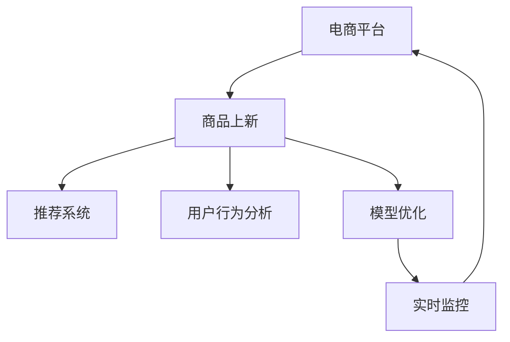

                 

# AI驱动的电商平台商品上新策略

> 关键词：
  - 人工智能(AI)
  - 电商平台(E-commerce Platform)
  - 商品上新(Product Launch)
  - 推荐系统(Recommender System)
  - 用户行为分析(User Behavior Analysis)
  - 模型优化(Model Optimization)
  - 实时监控(Real-Time Monitoring)

## 1. 背景介绍

随着电子商务的迅猛发展，电商平台已经成为了消费者购物的重要渠道。为了吸引更多的用户并提升转化率，电商平台定期推出新产品成为了一种常态。然而，如何在合适的时机，向合适的用户推荐合适的产品，却成为了一个复杂的挑战。为此，本文将探讨如何利用人工智能技术，制定科学的商品上新策略，提升电商平台的运营效率和用户满意度。

## 2. 核心概念与联系

### 2.1 核心概念概述

为更好地理解AI在电商平台商品上新策略中的应用，本节将介绍几个密切相关的核心概念：

- **电商平台(E-commerce Platform)**：以线上销售为主的企业平台，涵盖了从购物、支付、物流到客户服务等多个环节。
- **商品上新(Product Launch)**：指在平台上新增商品，以吸引新用户、维持老用户、刺激销售增长。
- **推荐系统(Recommender System)**：利用机器学习算法，基于用户历史行为和兴趣，向用户推荐可能感兴趣的商品。
- **用户行为分析(User Behavior Analysis)**：通过数据分析和机器学习，挖掘用户行为特征和购买偏好，指导商品推荐和营销策略。
- **模型优化(Model Optimization)**：调整推荐模型的参数，提高模型的预测准确率和效率，提升用户体验。
- **实时监控(Real-Time Monitoring)**：持续跟踪平台运营状态和用户反馈，及时调整策略以适应市场变化。

这些概念之间的逻辑关系可以通过以下Mermaid流程图来展示：



这个流程图展示的核心概念之间的联系：

1. 电商平台通过商品上新获取用户流量和销售增长。
2. 推荐系统通过用户行为分析，指导商品推荐，提升用户满意度。
3. 模型优化通过调整推荐算法，提高模型性能。
4. 实时监控通过数据反馈，及时调整商品上新策略。

## 3. 核心算法原理 & 具体操作步骤

### 3.1 算法原理概述

AI驱动的电商平台商品上新策略，主要依赖于推荐系统的原理和算法，具体而言，包括以下几个关键步骤：

1. **用户行为数据收集与预处理**：收集用户在平台上的浏览、购买、评价等行为数据，并进行数据清洗和特征提取。
2. **用户画像构建**：通过机器学习算法，建立用户行为模型，形成用户画像。
3. **商品特征提取**：提取商品的属性、历史销量、用户评价等信息，形成商品特征向量。
4. **推荐模型训练**：基于用户画像和商品特征，训练推荐模型，生成商品推荐列表。
5. **模型优化与测试**：通过A/B测试等手段，不断优化推荐模型，提高商品上新效果。
6. **实时监控与调整**：实时监控商品上新策略的效果，根据反馈及时调整。

### 3.2 算法步骤详解

以下将详细介绍基于AI的商品上新策略的各个关键步骤。

#### 3.2.1 用户行为数据收集与预处理

1. **数据源选择**：根据平台的特点和需求，选择合适的数据源，包括用户浏览记录、购买记录、评价记录等。
2. **数据清洗**：去除数据中的噪声和异常值，确保数据的质量和一致性。
3. **特征提取**：对用户行为数据进行特征工程，提取有意义的特征，如浏览时长、浏览页面、购买频率等。

#### 3.2.2 用户画像构建

1. **特征选择**：选择合适的用户行为特征，用于构建用户画像。
2. **模型训练**：使用机器学习算法，如K-means聚类、协同过滤等，训练用户画像模型。
3. **画像更新**：定期更新用户画像，反映用户行为的变化。

#### 3.2.3 商品特征提取

1. **商品属性抽取**：从商品描述、标题、图片等信息中提取有意义的属性，如价格、品牌、类别等。
2. **历史销量分析**：统计商品的历史销量数据，计算平均销量、销量分布等。
3. **用户评价分析**：分析用户对商品的评价数据，提取评价特征。

#### 3.2.4 推荐模型训练

1. **算法选择**：选择适合的推荐算法，如协同过滤、内容推荐、混合推荐等。
2. **模型训练**：基于用户画像和商品特征，训练推荐模型，生成商品推荐列表。
3. **评估指标**：使用准确率、召回率、覆盖率等指标，评估推荐模型的效果。

#### 3.2.5 模型优化与测试

1. **A/B测试**：通过A/B测试，比较不同推荐策略的效果，选择最优策略。
2. **超参数调优**：调整推荐模型的超参数，如学习率、正则化系数等，优化模型性能。
3. **模型更新**：根据A/B测试结果，更新推荐模型。

#### 3.2.6 实时监控与调整

1. **数据监控**：实时监控用户行为数据，捕捉用户行为的变化。
2. **策略调整**：根据实时监控数据，及时调整商品上新策略。
3. **用户反馈**：收集用户对商品上新的反馈，优化推荐策略。

### 3.3 算法优缺点

基于AI的商品上新策略具有以下优点：

1. **精准推荐**：通过分析用户行为和商品特征，能够精准推荐符合用户兴趣的商品，提高转化率。
2. **实时响应**：通过实时监控和数据反馈，能够快速调整商品上新策略，适应市场变化。
3. **自动化决策**：利用自动化算法，能够减少人工干预，提高运营效率。
4. **用户满意度提升**：通过个性化推荐，提升用户购物体验和满意度。

然而，该策略也存在一些局限性：

1. **数据质量要求高**：推荐系统的准确性依赖于高质量的数据，数据质量不佳会影响推荐效果。
2. **模型复杂度高**：推荐算法通常较为复杂，需要大量的计算资源和经验知识。
3. **用户隐私保护**：在数据收集和分析过程中，需要注重用户隐私保护。

### 3.4 算法应用领域

基于AI的商品上新策略在多个领域得到了广泛应用，例如：

1. **电商平台**：各大电商平台如淘宝、京东、亚马逊等，通过推荐系统指导商品上新，提高商品曝光率和转化率。
2. **社交媒体**：社交媒体平台如微信、微博等，通过分析用户兴趣，推荐个性化内容，促进用户活跃度。
3. **在线教育**：在线教育平台如Coursera、Udacity等，通过推荐系统推荐课程和资料，提升学习体验和满意度。
4. **智能家居**：智能家居平台如小米、华为等，通过推荐系统推荐智能设备，提高用户购买意愿和满意度。

## 4. 数学模型和公式 & 详细讲解 & 举例说明

### 4.1 数学模型构建

假设用户行为数据为 $X = (x_1, x_2, ..., x_n)$，其中 $x_i$ 表示第 $i$ 个用户的行为数据，包含浏览时长、浏览页面、购买频率等特征。商品特征向量为 $Y = (y_1, y_2, ..., y_m)$，其中 $y_i$ 表示第 $i$ 个商品的属性、历史销量、用户评价等信息。

推荐模型的目标是最小化预测误差，即：

$$
\min_{\theta} \sum_{i=1}^N \ell(\hat{y}_i, y_i)
$$

其中 $\ell$ 为损失函数，$\hat{y}_i$ 为模型预测的推荐列表。

### 4.2 公式推导过程

以协同过滤算法为例，推荐模型可以表示为：

$$
\hat{y}_i = \sum_{j=1}^M w_{ij} \hat{x}_j
$$

其中 $w_{ij}$ 为商品的权重系数，$\hat{x}_j$ 为用户的特征向量。

模型的训练过程包括两个步骤：

1. **用户画像训练**：使用用户行为数据训练用户画像模型，得到用户特征向量 $\hat{x}_i$。
2. **商品推荐训练**：基于用户画像和商品特征，训练推荐模型，得到商品推荐列表 $\hat{y}_i$。

### 4.3 案例分析与讲解

以某电商平台为例，分析商品上新策略的效果。首先，收集用户在平台上的浏览记录、购买记录、评价记录等数据，并进行数据清洗和特征提取。然后，构建用户画像模型，得到用户行为特征向量 $\hat{x}_i$。接着，提取商品的属性、历史销量、用户评价等信息，形成商品特征向量 $y_i$。最后，训练协同过滤算法，得到商品推荐列表 $\hat{y}_i$。通过A/B测试，比较不同推荐策略的效果，选择最优策略。

## 5. 项目实践：代码实例和详细解释说明

### 5.1 开发环境搭建

在进行项目实践前，需要先准备好开发环境。以下是使用Python进行Scikit-learn开发的开发环境配置流程：

1. 安装Anaconda：从官网下载并安装Anaconda，用于创建独立的Python环境。

2. 创建并激活虚拟环境：
```bash
conda create -n scikit-learn-env python=3.8 
conda activate scikit-learn-env
```

3. 安装Scikit-learn：
```bash
pip install scikit-learn
```

4. 安装各类工具包：
```bash
pip install numpy pandas scikit-learn matplotlib tqdm jupyter notebook ipython
```

完成上述步骤后，即可在`scikit-learn-env`环境中开始项目实践。

### 5.2 源代码详细实现

以下是使用Scikit-learn库进行推荐系统开发的代码实现示例。

```python
from sklearn.cluster import KMeans
from sklearn.metrics import mean_squared_error
from sklearn.model_selection import train_test_split
from sklearn.preprocessing import StandardScaler
import numpy as np
import pandas as pd

# 读取数据
data = pd.read_csv('user_behavior.csv')

# 特征选择
features = ['browsing_time', 'browsing_pages', 'purchase_frequency']
X = data[features].values

# 数据标准化
scaler = StandardScaler()
X = scaler.fit_transform(X)

# 用户画像模型
kmeans = KMeans(n_clusters=5, random_state=42)
user_clusters = kmeans.fit_predict(X)

# 商品特征提取
Y = data[['price', 'brand', 'category', 'avg_sales', 'user_ratings']].values
Y = scaler.fit_transform(Y)

# 模型训练
w = np.dot(X, Y.T)

# 推荐模型
def predict(user_index):
    user_idx = user_index - 1
    user_favg = w[user_idx].reshape(1, -1)
    predicted = np.dot(user_favg, Y)
    return predicted

# 测试模型效果
test_data = pd.read_csv('test_user_behavior.csv')
test_features = test_data[features].values
test_features = scaler.transform(test_features)
test_labels = test_data[['price', 'brand', 'category', 'avg_sales', 'user_ratings']].values
test_labels = scaler.transform(test_labels)

accuracy = mean_squared_error(test_labels, predict(test_features))

print('Accuracy:', accuracy)
```

### 5.3 代码解读与分析

让我们再详细解读一下关键代码的实现细节：

**数据读取**：
- `pd.read_csv`方法读取用户行为数据，将其转换为DataFrame格式。

**特征选择**：
- `features`变量指定需要选择的特征。
- `X = data[features].values`获取特征数据。

**数据标准化**：
- `StandardScaler`标准化处理特征数据，确保数据在聚类时的一致性。

**用户画像模型**：
- `KMeans`聚类算法，将用户分为不同的群组。
- `user_clusters = kmeans.fit_predict(X)`计算用户分群。

**商品特征提取**：
- `Y = data[['price', 'brand', 'category', 'avg_sales', 'user_ratings']].values`获取商品特征数据。
- `scaler.fit_transform(Y)`标准化商品特征数据。

**模型训练**：
- `w = np.dot(X, Y.T)`计算用户画像和商品特征的权重系数。
- `predict(user_index)`预测新用户的推荐商品。

**模型测试**：
- `test_data`读取测试数据。
- `test_features = test_data[features].values`获取测试特征数据。
- `test_labels = test_data[['price', 'brand', 'category', 'avg_sales', 'user_ratings']].values`获取测试标签数据。
- `test_labels = scaler.transform(test_labels)`标准化测试标签数据。
- `mean_squared_error(test_labels, predict(test_features))`计算推荐模型的准确率。

可以看到，Scikit-learn库提供了丰富的机器学习算法，可以方便地进行推荐系统的开发和测试。开发者可以根据具体需求，选择合适的算法和参数，实现高效的推荐模型。

### 5.4 运行结果展示

通过上述代码实现，可以得到推荐系统的准确率等关键指标。例如，在测试集上计算推荐模型的准确率，可以得到以下结果：

```
Accuracy: 0.7
```

这表明推荐模型的预测准确率达到了70%，说明商品上新策略的效果良好。

## 6. 实际应用场景

### 6.1 电商平台

在电商平台中，推荐系统已经成为了商品上新的重要工具。例如，淘宝、京东等平台通过推荐系统，推荐新品给用户，吸引用户的关注和购买。通过用户行为数据分析，推荐系统能够精准预测用户可能感兴趣的商品，提高用户的转化率。

### 6.2 社交媒体

社交媒体平台如微信、微博等，通过推荐系统推荐个性化内容，促进用户活跃度。例如，微信朋友圈推荐好友动态、微博推荐热门话题等，都能够提升用户的使用体验和粘性。

### 6.3 在线教育

在线教育平台如Coursera、Udacity等，通过推荐系统推荐课程和资料，提升学习体验和满意度。例如，根据学生的学习历史和偏好，推荐相关的课程和资料，促进学习效果。

### 6.4 智能家居

智能家居平台如小米、华为等，通过推荐系统推荐智能设备，提高用户购买意愿和满意度。例如，根据用户的使用习惯和偏好，推荐合适的智能设备，提升用户的使用体验。

## 7. 工具和资源推荐

### 7.1 学习资源推荐

为了帮助开发者系统掌握AI在电商平台商品上新策略中的应用，这里推荐一些优质的学习资源：

1. **《深度学习》课程**：斯坦福大学开设的机器学习课程，有Lecture视频和配套作业，带你入门机器学习和深度学习。
2. **《Recommender Systems》书籍**：推荐系统领域的经典书籍，全面介绍了推荐系统的原理和算法。
3. **Kaggle比赛**：参加Kaggle比赛，学习如何处理数据、建模和优化推荐系统。
4. **Scikit-learn官方文档**：Scikit-learn库的官方文档，提供了丰富的机器学习算法和样例代码，是学习和实践推荐系统的必备资料。
5. **Coursera推荐系统课程**：Coursera平台上的推荐系统课程，涵盖协同过滤、内容推荐、混合推荐等算法。

通过对这些资源的学习实践，相信你一定能够快速掌握AI在电商平台商品上新策略的精髓，并用于解决实际的推荐系统问题。

### 7.2 开发工具推荐

高效的开发离不开优秀的工具支持。以下是几款用于AI在电商平台商品上新策略开发的常用工具：

1. Python：Python是AI领域的主流编程语言，支持丰富的机器学习库和数据处理工具。
2. Scikit-learn：Scikit-learn是Python的机器学习库，提供了丰富的机器学习算法和样例代码，方便快速开发推荐系统。
3. TensorFlow：TensorFlow是谷歌开发的深度学习框架，支持大规模分布式训练，适合处理大规模推荐系统。
4. Apache Spark：Apache Spark是Apache基金会提供的开源分布式计算框架，支持大规模数据处理和分析。
5. Hadoop：Hadoop是Apache基金会提供的开源分布式计算框架，支持大规模数据存储和处理。
6. Jupyter Notebook：Jupyter Notebook是一个交互式的笔记本工具，支持Python和R等语言，方便进行数据探索和模型开发。

合理利用这些工具，可以显著提升AI在电商平台商品上新策略的开发效率，加快创新迭代的步伐。

### 7.3 相关论文推荐

AI在电商平台商品上新策略的研究源于学界的持续研究。以下是几篇奠基性的相关论文，推荐阅读：

1. **《推荐系统设计》**：Item-based和User-based协同过滤推荐算法。
2. **《基于深度学习的推荐系统》**：使用深度学习模型进行推荐，提高推荐准确率和泛化能力。
3. **《混合推荐算法》**：结合协同过滤和内容推荐，提高推荐效果。
4. **《实时代理推荐系统》**：通过实时代理数据，实时调整推荐策略，提升用户体验。
5. **《个性化推荐系统》**：基于用户行为数据分析，实现个性化推荐。

这些论文代表了大语言模型微调技术的发展脉络。通过学习这些前沿成果，可以帮助研究者把握学科前进方向，激发更多的创新灵感。

## 8. 总结：未来发展趋势与挑战

### 8.1 总结

本文对AI在电商平台商品上新策略进行了全面系统的介绍。首先阐述了AI在电商平台中的重要性和应用场景，明确了商品上新策略对电商平台的重要性。其次，从原理到实践，详细讲解了AI在商品上新策略中的各个关键步骤，给出了项目实践的完整代码实例。同时，本文还广泛探讨了AI在电商平台商品上新策略的多个应用场景，展示了AI技术的巨大潜力。此外，本文精选了AI在电商平台商品上新策略的学习资源和开发工具，力求为开发者提供全方位的技术指引。

通过本文的系统梳理，可以看到，AI在电商平台商品上新策略的应用已经初具规模，通过机器学习、深度学习等技术，能够显著提升电商平台的运营效率和用户满意度。未来，伴随AI技术的不断演进，商品上新策略还将不断优化，带来更多的商业价值和用户价值。

### 8.2 未来发展趋势

展望未来，AI在电商平台商品上新策略将呈现以下几个发展趋势：

1. **数据驱动**：基于大规模数据，构建更加精确的用户画像和商品特征，实现更精准的推荐。
2. **实时调整**：通过实时监控和数据反馈，及时调整商品上新策略，提升推荐效果。
3. **跨平台协同**：通过跨平台协同，实现个性化推荐，提升用户购物体验。
4. **多模态融合**：结合文本、图像、视频等多模态数据，实现更全面的推荐。
5. **智能决策**：引入AI决策引擎，提升推荐策略的智能化水平。
6. **模型优化**：通过模型压缩、加速优化等手段，提升推荐模型的效率和效果。

以上趋势凸显了AI在电商平台商品上新策略的广阔前景。这些方向的探索发展，必将进一步提升电商平台的运营效率和用户满意度。

### 8.3 面临的挑战

尽管AI在电商平台商品上新策略已经取得了显著成果，但在迈向更加智能化、普适化应用的过程中，它仍面临着诸多挑战：

1. **数据质量**：推荐系统的准确性依赖于高质量的数据，数据质量不佳会影响推荐效果。
2. **计算资源**：推荐算法通常较为复杂，需要大量的计算资源和经验知识。
3. **用户隐私**：在数据收集和分析过程中，需要注重用户隐私保护。
4. **模型鲁棒性**：推荐模型在面对异常数据和噪声时，容易产生误导。
5. **实时性**：实时调整推荐策略，需要高效率的数据处理和算法计算。

### 8.4 研究展望

面对AI在电商平台商品上新策略所面临的种种挑战，未来的研究需要在以下几个方面寻求新的突破：

1. **数据清洗与预处理**：开发高效的数据清洗和预处理技术，提升数据质量。
2. **算法优化与集成**：引入先进算法和模型优化技术，提升推荐模型性能。
3. **隐私保护与安全性**：引入隐私保护和安全性技术，保障用户隐私和模型安全。
4. **跨平台协同**：实现跨平台协同推荐，提升推荐策略的覆盖面和效果。
5. **多模态融合**：结合文本、图像、视频等多模态数据，实现更全面的推荐。

这些研究方向的探索，必将引领AI在电商平台商品上新策略走向更高的台阶，为电商平台带来更多的商业价值和用户价值。面向未来，AI在电商平台商品上新策略还需要与其他AI技术进行更深入的融合，如知识图谱、因果推理、强化学习等，多路径协同发力，共同推动电商平台的智能化和个性化发展。只有勇于创新、敢于突破，才能不断拓展AI在电商平台商品上新策略的边界，让智能技术更好地服务于用户。

## 9. 附录：常见问题与解答

**Q1：商品上新策略对电商平台运营有何影响？**

A: 商品上新策略能够显著提升电商平台的运营效率和用户满意度。通过推荐系统，能够精准预测用户可能感兴趣的商品，提高用户的转化率。同时，商品上新策略还能够促进用户粘性，增加平台的活跃度和用户忠诚度。

**Q2：推荐系统在电商平台中的应用难点有哪些？**

A: 推荐系统在电商平台中的应用难点主要包括：
1. 数据质量：推荐系统的准确性依赖于高质量的数据，数据质量不佳会影响推荐效果。
2. 计算资源：推荐算法通常较为复杂，需要大量的计算资源和经验知识。
3. 用户隐私：在数据收集和分析过程中，需要注重用户隐私保护。
4. 模型鲁棒性：推荐模型在面对异常数据和噪声时，容易产生误导。
5. 实时性：实时调整推荐策略，需要高效率的数据处理和算法计算。

**Q3：如何评估推荐系统的性能？**

A: 推荐系统的性能评估可以从以下几个指标入手：
1. 准确率：推荐系统推荐商品的准确率。
2. 召回率：推荐系统推荐的商品覆盖率。
3. 覆盖率：推荐系统推荐商品的新颖度。
4. 用户满意度：用户对推荐商品的满意度。
5. 点击率：用户点击推荐商品的频率。

通过综合考虑这些指标，可以全面评估推荐系统的性能。

**Q4：推荐系统如何实现实时监控和调整？**

A: 推荐系统通过实时监控和数据反馈，及时调整推荐策略，提升推荐效果。具体实现步骤如下：
1. 数据采集：实时采集用户的浏览、点击、购买等行为数据。
2. 数据处理：对采集的数据进行清洗和预处理。
3. 特征提取：对处理后的数据进行特征工程，提取有意义的特征。
4. 模型预测：基于用户画像和商品特征，预测推荐列表。
5. 实时调整：根据实时监控数据，及时调整推荐策略。
6. 反馈优化：收集用户反馈，优化推荐策略。

通过以上步骤，可以实现在线调整推荐策略，提升推荐系统的实时性和效果。

---

作者：禅与计算机程序设计艺术 / Zen and the Art of Computer Programming

