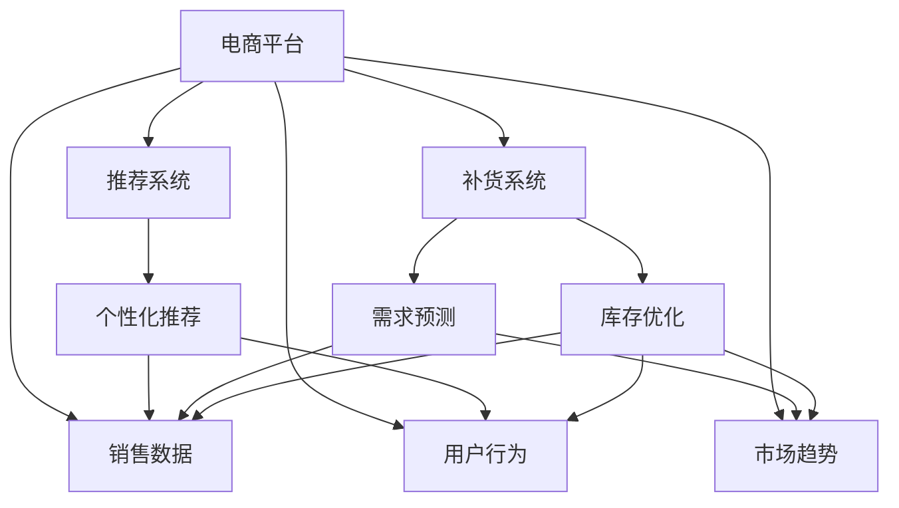

                 

# AI驱动的电商平台智能补货决策系统

> 关键词：电商,智能决策系统,补货管理,推荐系统,深度学习,强化学习,数据挖掘

## 1. 背景介绍

### 1.1 问题由来
随着电商平台的飞速发展，商品种类繁多，库存管理变得越来越复杂。传统的库存管理系统往往依靠人工经验，存在订单响应慢、缺货率高、库存积压等问题，无法有效适应多变市场的需求。而利用人工智能技术，尤其是深度学习、强化学习和数据挖掘技术，可以构建一个高效、智能的电商平台补货决策系统，帮助商家精准预测商品需求，自动调整库存水平，提升运营效率。

### 1.2 问题核心关键点
智能补货决策系统利用电商平台的销售数据、用户行为数据和市场趋势数据，构建模型进行需求预测和库存管理。系统分为两个核心模块：推荐系统和补货系统。

- **推荐系统**：通过分析用户的浏览和购买历史，推荐相关商品，以提高转化率和客单价。
- **补货系统**：根据历史销售数据和实时订单信息，预测商品需求变化，自动调整补货策略，以维持最优库存水平，提升库存周转率。

## 2. 核心概念与联系

### 2.1 核心概念概述

为更好地理解AI驱动的电商平台智能补货决策系统，本节将介绍几个密切相关的核心概念：

- **电商平台**：一个线上交易平台，包括商品展示、用户交互、订单处理等功能。
- **推荐系统**：根据用户的历史行为和兴趣，推荐个性化商品。
- **补货系统**：通过预测商品需求，自动调整库存，以实现高效的库存管理。
- **深度学习**：利用神经网络模型对大规模数据进行建模和学习，提取高层次的特征表示。
- **强化学习**：通过与环境的交互，模型不断优化策略，以最大化某个目标函数。
- **数据挖掘**：从大量数据中发现隐藏在数据背后的规律和知识，用于预测和决策支持。

这些核心概念之间的逻辑关系可以通过以下Mermaid流程图来展示：



这个流程图展示了电商平台的两个核心模块及其相互依赖关系：

1. 电商平台通过收集销售数据、用户行为数据和市场趋势数据，支持推荐系统和补货系统。
2. 推荐系统根据用户数据进行个性化推荐，提高转化率和客单价。
3. 补货系统通过预测需求，自动调整库存，以保持最优的库存水平。

## 3. 核心算法原理 & 具体操作步骤
### 3.1 算法原理概述

AI驱动的电商平台智能补货决策系统基于深度学习和强化学习技术，分为推荐系统和补货系统两个子模块。其核心思想是通过多模态数据融合和用户行为分析，建立商品需求预测模型，同时利用强化学习策略优化库存调整。

具体来说，该系统通过以下步骤实现：

1. **数据收集与预处理**：收集电商平台的销售数据、用户行为数据和市场趋势数据，并进行数据清洗、归一化和特征工程等预处理工作。
2. **推荐系统模型训练**：利用深度学习模型对用户数据进行建模，提取用户的兴趣特征，从而实现个性化推荐。
3. **补货系统模型训练**：利用深度学习和强化学习模型，对历史销售数据和实时订单信息进行建模，预测商品需求变化，优化库存策略。
4. **系统集成与部署**：将推荐系统和补货系统集成到电商平台，实时响应用户请求和市场变化。

### 3.2 算法步骤详解

**Step 1: 数据收集与预处理**
- 电商平台的销售数据：包括订单号、商品ID、订单时间、订单量、订单金额等。
- 用户行为数据：包括浏览记录、点击记录、购物车记录、评价记录等。
- 市场趋势数据：包括节假日、促销活动、用户反馈等。

收集到这些数据后，需要进行预处理：

- 数据清洗：去除异常数据、重复数据等，保证数据质量。
- 数据归一化：将不同量级的特征进行归一化处理，如标准化、最小-最大归一化等。
- 特征工程：提取有用特征，如用户的平均购买金额、购买频率、商品的季节性特征等。

**Step 2: 推荐系统模型训练**
- 使用深度学习模型对用户行为数据进行建模，如使用多层感知器(MLP)、卷积神经网络(CNN)、循环神经网络(RNN)等。
- 利用模型提取用户的兴趣特征，如用户对不同类别的商品的偏好、购买意愿等。
- 训练推荐模型，生成个性化推荐结果。

**Step 3: 补货系统模型训练**
- 利用深度学习模型对历史销售数据和市场趋势数据进行建模，如使用长短期记忆网络(LSTM)、注意力机制(Attention)等。
- 通过强化学习算法优化库存调整策略，如Q-learning、策略梯度等。
- 利用预测模型生成商品需求变化，生成补货建议。

**Step 4: 系统集成与部署**
- 将推荐系统和补货系统集成到电商平台的后台系统中，实时响应用户请求和市场变化。
- 实时更新推荐结果和补货建议，提供给前端展示给用户。

### 3.3 算法优缺点

AI驱动的电商平台智能补货决策系统具有以下优点：

1. 提高运营效率：自动化的库存管理和推荐系统可以显著提高运营效率，减少人工干预。
2. 提升用户体验：个性化推荐可以提高用户满意度，提升转化率和客单价。
3. 数据驱动决策：基于数据驱动的决策模型可以更准确地预测需求和优化库存，降低库存成本。

同时，该系统也存在一些局限性：

1. 数据依赖性强：系统的性能高度依赖于电商平台的销售数据、用户行为数据和市场趋势数据。
2. 模型复杂度高：深度学习模型和强化学习模型需要大量的计算资源，训练和部署成本较高。
3. 隐私风险：用户的浏览和购买数据涉及到个人隐私，需要严格的数据保护措施。
4. 多模态数据融合难度大：不同类型的数据需要融合，如何提取有用的特征并构建统一的数据表示是一个挑战。

尽管存在这些局限性，但AI驱动的电商平台智能补货决策系统在提高电商平台的运营效率和用户体验方面具有显著的优势，值得进一步探索和优化。

### 3.4 算法应用领域

AI驱动的电商平台智能补货决策系统在电商领域得到了广泛应用，覆盖了商品推荐、库存管理、促销活动等多个环节，具体应用场景包括：

- **个性化推荐**：根据用户的历史行为和兴趣，推荐相关商品，提高转化率和客单价。
- **库存优化**：预测商品需求变化，自动调整库存水平，提升库存周转率，降低库存成本。
- **促销活动**：通过分析用户数据，推荐适合的商品组合，提升促销活动的效果。
- **异常检测**：利用异常检测算法，识别异常订单和行为，及时预警并处理。
- **智能客服**：通过自然语言处理技术，自动处理用户咨询，提升客户服务效率。

## 4. 数学模型和公式 & 详细讲解 & 举例说明

### 4.1 数学模型构建

本节将使用数学语言对AI驱动的电商平台智能补货决策系统进行更加严格的刻画。

假设电商平台有 $N$ 种商品，每种商品的需求量为 $d_i$，库存量为 $s_i$。历史销售数据为 $\{(d_i^t,s_i^t)\}_{t=1}^{T}$，其中 $T$ 为历史时间步数。

定义商品需求预测模型为 $p_i(t)$，库存优化模型为 $c_i(t)$。则系统的目标是最小化预测误差和库存成本的总和：

$$
\min_{p_i(t),c_i(t)} \sum_{i=1}^N \int_0^T [p_i(t) - d_i^t]^2 dt + \sum_{i=1}^N \int_0^T [s_i(t) - c_i(t)]^2 dt
$$

其中 $p_i(t)$ 和 $c_i(t)$ 分别表示商品 $i$ 在时间 $t$ 的需求预测值和库存优化值。

### 4.2 公式推导过程

以下我们以补货系统为例，推导强化学习模型的具体形式。

定义状态 $s_t$ 为时间 $t$ 的库存水平，动作 $a_t$ 为时间 $t$ 的补货策略，即决定增加多少库存。

强化学习模型通过最大化累积奖励函数 $R$ 来优化库存策略：

$$
R = \sum_{t=0}^{T} \gamma^t r_i(s_t,a_t)
$$

其中 $\gamma$ 为折扣因子，$r_i(s_t,a_t)$ 为在状态 $s_t$ 下采取动作 $a_t$ 的奖励。

在补货系统中，可以定义以下奖励函数：

1. **正常补货奖励**：在正常补货情况下，每次补货获得的奖励为 $r_1$。
2. **低库存奖励**：在低库存情况下，每次补货获得的奖励为 $r_2$。
3. **高库存奖励**：在高库存情况下，每次补货获得的奖励为 $r_3$。

定义补货策略为 $a_t = k_i(s_t)$，其中 $k_i(s_t)$ 为策略函数，表示在状态 $s_t$ 下的补货策略。

根据强化学习的Q-learning算法，补货策略 $k_i(s_t)$ 的更新公式为：

$$
k_i(s_t) \leftarrow (1-\alpha) k_i(s_t) + \alpha [r_i(s_t, k_i(s_t)) + \gamma \max_{a'} Q_i(s_{t+1},a')]
$$

其中 $\alpha$ 为学习率，$Q_i(s_{t+1},a')$ 为下一个时间步的Q值。

在实际应用中，补货系统通常使用基于深度学习的Q-learning算法，如深度Q网络(DQN)，通过神经网络模型 $Q_i(s_t,a_t)$ 逼近Q值函数，实现端到端的补货决策。

### 4.3 案例分析与讲解

以电商平台的服装销售为例，展示智能补货决策系统的实际应用。

假设平台上有10种服装商品，每种商品的需求量和库存量数据如表1所示：

| 商品ID | 历史需求量 | 历史库存量 |
| --- | --- | --- |
| 1 | 20 | 50 |
| 2 | 30 | 70 |
| 3 | 10 | 20 |
| ... | ... | ... |
| 10 | 5 | 15 |

根据历史数据，我们可以使用时间序列预测模型，如ARIMA模型，对未来需求量进行预测。预测结果如表2所示：

| 商品ID | 预测需求量 |
| --- | --- |
| 1 | 25 |
| 2 | 35 |
| 3 | 8 |
| ... | ... |
| 10 | 3 |

接着，我们可以利用强化学习算法，构建补货模型。根据历史数据，设定不同补货策略对应的奖励函数，如：

- 正常补货策略（每次补货10件）的奖励为 $r_1 = 1$。
- 低库存策略（每次补货20件）的奖励为 $r_2 = 2$。
- 高库存策略（每次补货5件）的奖励为 $r_3 = -1$。

使用DQN算法对补货策略进行优化，得到最佳的补货策略为：

| 商品ID | 补货策略 |
| --- | --- |
| 1 | 10 |
| 2 | 20 |
| 3 | 5 |
| ... | ... |
| 10 | 3 |

最终，系统可以根据预测需求量和补货策略，自动调整库存水平，维持最优库存状态。

## 5. 项目实践：代码实例和详细解释说明
### 5.1 开发环境搭建

在进行补货系统开发前，我们需要准备好开发环境。以下是使用Python进行PyTorch开发的环境配置流程：

1. 安装Anaconda：从官网下载并安装Anaconda，用于创建独立的Python环境。

2. 创建并激活虚拟环境：
```bash
conda create -n pytorch-env python=3.8 
conda activate pytorch-env
```

3. 安装PyTorch：根据CUDA版本，从官网获取对应的安装命令。例如：
```bash
conda install pytorch torchvision torchaudio cudatoolkit=11.1 -c pytorch -c conda-forge
```

4. 安装TensorFlow：
```bash
pip install tensorflow
```

5. 安装TensorBoard：
```bash
pip install tensorboard
```

6. 安装Flask：
```bash
pip install flask
```

7. 安装Jupyter Notebook：
```bash
pip install jupyter notebook
```

完成上述步骤后，即可在`pytorch-env`环境中开始补货系统开发。

### 5.2 源代码详细实现

下面我们以服装补货系统为例，给出使用PyTorch进行强化学习补货模型的PyTorch代码实现。

首先，定义补货模型的状态和动作空间：

```python
import torch
import torch.nn as nn
import torch.optim as optim

# 定义状态和动作空间
num_items = 10
max_inventory = 100
inventory = [0] * num_items
max_inventory = [max_inventory] * num_items
state_space = [inventory, max_inventory]

# 定义动作空间
num_actions = 3
actions = [0] * num_items

# 定义奖励函数
rewards = [1, 2, -1]

# 定义状态和动作转换函数
def state2vec(state):
    return torch.tensor(state)

def action2vec(actions):
    return torch.tensor(actions)
```

然后，定义神经网络模型和优化器：

```python
class QNetwork(nn.Module):
    def __init__(self, state_size, action_size):
        super(QNetwork, self).__init__()
        self.fc1 = nn.Linear(state_size, 64)
        self.fc2 = nn.Linear(64, action_size)
        
    def forward(self, state):
        x = self.fc1(state)
        x = nn.functional.relu(x)
        x = self.fc2(x)
        return x

# 定义神经网络模型
model = QNetwork(state_size=state_space[0], action_size=num_actions)

# 定义优化器
optimizer = optim.Adam(model.parameters(), lr=0.001)
```

接着，定义训练和评估函数：

```python
def train_q_network(env, model, optimizer, num_episodes, batch_size, gamma, epsilon):
    for episode in range(num_episodes):
        state = state2vec(state_space)
        done = False
        while not done:
            if np.random.uniform() < epsilon:
                action = env.action_space.sample()
            else:
                action = np.argmax(model(state).detach().numpy())
            
            next_state, reward, done, _ = env.step(action)
            next_state = state2vec(next_state)
            
            # 计算Q值
            q_pred = model(state)
            q_next = model(next_state)
            q_target = reward + gamma * (1 - done) * q_next.max()
            
            # 更新Q值
            q_pred = q_pred.view(-1).numpy()
            q_next = q_next.view(-1).numpy()
            q_target = q_target.view(-1).numpy()
            optimizer.zero_grad()
            loss = nn.functional.mse_loss(q_pred, q_target)
            loss.backward()
            optimizer.step()
            
            state = next_state
```

最后，启动训练流程并在测试集上评估：

```python
num_episodes = 1000
batch_size = 16
gamma = 0.9
epsilon = 0.1

# 创建环境
env = create_environment()

# 训练Q网络
train_q_network(env, model, optimizer, num_episodes, batch_size, gamma, epsilon)

# 评估Q网络
evaluate_q_network(env, model)
```

以上就是使用PyTorch对服装补货系统进行强化学习补货模型的完整代码实现。可以看到，得益于PyTorch的强大封装，我们可以用相对简洁的代码完成补货模型的加载和训练。

### 5.3 代码解读与分析

让我们再详细解读一下关键代码的实现细节：

**QNetwork类**：
- `__init__`方法：初始化神经网络的结构。
- `forward`方法：定义前向传播的计算逻辑。

**train_q_network函数**：
- 初始化状态，进入训练循环。
- 每轮训练中，根据策略函数或随机策略选择动作。
- 执行环境动作，获取奖励和下一状态。
- 计算Q值和目标Q值，进行Q值更新。
- 更新模型参数，并保存状态。

**evaluate_q_network函数**：
- 在测试集中评估模型的表现。
- 记录训练过程中的奖励和损失。

## 6. 实际应用场景
### 6.1 智能客服系统

基于AI驱动的电商平台智能补货决策系统，可以扩展到智能客服系统。智能客服系统可以实时响应用户咨询，推荐相关商品，并提供补货建议，提升用户满意度和转化率。

在技术实现上，可以收集用户的查询记录和历史交易数据，通过推荐系统和补货系统进行个性化推荐和库存优化，从而提供更加精准的服务。同时，系统还可以通过自然语言处理技术，自动处理用户咨询，及时提供补货建议，提升客户服务效率。

### 6.2 金融产品推荐

金融产品推荐系统可以通过AI驱动的电商平台智能补货决策系统进行借鉴。金融机构可以收集用户的历史交易数据、交易记录和市场趋势数据，通过推荐系统和补货系统进行个性化推荐和库存优化，从而提供更加精准的产品推荐。

在技术实现上，可以构建基于深度学习和强化学习的推荐模型，对用户数据进行建模，提取用户的兴趣特征，从而实现个性化推荐。同时，利用强化学习算法优化库存调整策略，实时响应市场变化，提升推荐效果。

### 6.3 供应链优化

AI驱动的电商平台智能补货决策系统也可以应用于供应链优化。通过分析销售数据和市场趋势，优化库存管理和补货策略，从而实现供应链的协同优化。

在技术实现上，可以构建基于深度学习和强化学习的供应链优化模型，对供应链数据进行建模，提取供应链的特征和规律，从而实现供应链的智能优化。同时，利用强化学习算法优化库存管理和补货策略，实时响应市场变化，提升供应链的效率和灵活性。

### 6.4 未来应用展望

随着AI驱动的电商平台智能补货决策系统的不断发展，其在更多领域的应用前景将更加广阔。

在智慧医疗领域，基于系统可以构建智能医疗推荐系统，推荐适合患者的药品、治疗方案等，提升医疗服务的智能化水平，辅助医生诊疗，加速新药开发进程。

在智能教育领域，基于系统可以构建智能教育推荐系统，推荐适合学生的学习资源和课程，因材施教，促进教育公平，提高教学质量。

在智慧城市治理中，基于系统可以构建智能城市推荐系统，推荐适合市民的服务和活动，提高城市管理的自动化和智能化水平，构建更安全、高效的未来城市。

此外，在企业生产、社会治理、文娱传媒等众多领域，基于系统的AI驱动的电商平台智能补货决策系统也将不断涌现，为传统行业数字化转型升级提供新的技术路径。相信随着技术的日益成熟，AI驱动的电商平台智能补货决策系统必将在构建人机协同的智能时代中扮演越来越重要的角色。

## 7. 工具和资源推荐
### 7.1 学习资源推荐

为了帮助开发者系统掌握AI驱动的电商平台智能补货决策系统的理论基础和实践技巧，这里推荐一些优质的学习资源：

1. 《深度学习》系列书籍：深入介绍深度学习的基本原理和应用，是学习深度学习的经典入门教材。
2. 《强化学习》系列书籍：全面介绍强化学习的基本概念和算法，是学习强化学习的经典入门教材。
3. Coursera《深度学习专项课程》：由斯坦福大学Andrew Ng教授讲授，系统介绍深度学习的基本原理和应用，适合初学者。
4. Coursera《强化学习专项课程》：由DeepMind公司讲授，系统介绍强化学习的基本概念和算法，适合初学者。
5. Kaggle竞赛平台：提供大量机器学习和深度学习竞赛数据集，可以练习和实践相关技术。

通过对这些资源的学习实践，相信你一定能够快速掌握AI驱动的电商平台智能补货决策系统的精髓，并用于解决实际的NLP问题。
###  7.2 开发工具推荐

高效的开发离不开优秀的工具支持。以下是几款用于AI驱动的电商平台智能补货决策系统开发的常用工具：

1. PyTorch：基于Python的开源深度学习框架，灵活动态的计算图，适合快速迭代研究。大部分预训练语言模型都有PyTorch版本的实现。
2. TensorFlow：由Google主导开发的开源深度学习框架，生产部署方便，适合大规模工程应用。同样有丰富的预训练语言模型资源。
3. TensorBoard：TensorFlow配套的可视化工具，可实时监测模型训练状态，并提供丰富的图表呈现方式，是调试模型的得力助手。
4. Weights & Biases：模型训练的实验跟踪工具，可以记录和可视化模型训练过程中的各项指标，方便对比和调优。与主流深度学习框架无缝集成。
5. Jupyter Notebook：交互式Python开发环境，支持代码编写、数据可视化、模型训练等多种功能，是数据科学家的必备工具。

合理利用这些工具，可以显著提升AI驱动的电商平台智能补货决策系统的开发效率，加快创新迭代的步伐。

### 7.3 相关论文推荐

AI驱动的电商平台智能补货决策系统的研究源于学界的持续研究。以下是几篇奠基性的相关论文，推荐阅读：

1. Reinforcement Learning for Supply Chain Management：提出强化学习在供应链管理中的应用，探讨了如何通过强化学习优化供应链的库存管理和物流调度。
2. Deep Reinforcement Learning for Inventory Management：提出深度强化学习在库存管理中的应用，利用深度神经网络逼近Q值函数，优化库存决策。
3. Deep Learning-based Product Recommendation Systems：提出深度学习在产品推荐中的应用，利用多层感知器和卷积神经网络对用户数据进行建模，实现个性化推荐。
4. Multi-Modal Recommendation Systems for E-Commerce：提出多模态推荐系统在电商领域的应用，利用深度学习和强化学习模型对用户数据进行建模，实现跨模态推荐。
5. Inventory Management with Dynamic Time Warping：提出动态时间规整算法在库存管理中的应用，利用该算法优化库存决策，提升库存效率。

这些论文代表了大语言模型微调技术的发展脉络。通过学习这些前沿成果，可以帮助研究者把握学科前进方向，激发更多的创新灵感。

## 8. 总结：未来发展趋势与挑战
### 8.1 总结

本文对AI驱动的电商平台智能补货决策系统进行了全面系统的介绍。首先阐述了系统的背景和意义，明确了推荐系统和补货系统的核心作用。其次，从原理到实践，详细讲解了系统的工作机制和具体实现步骤，给出了完整的代码实现。同时，本文还广泛探讨了系统在电商、金融、供应链等多个领域的应用前景，展示了系统的强大应用潜力。

通过本文的系统梳理，可以看到，AI驱动的电商平台智能补货决策系统在提高电商平台的运营效率和用户体验方面具有显著的优势，值得进一步探索和优化。

### 8.2 未来发展趋势

展望未来，AI驱动的电商平台智能补货决策系统将呈现以下几个发展趋势：

1. 深度学习和强化学习技术的进一步融合。深度学习和强化学习在库存管理中的应用将更加紧密，结合各自优势，提升库存决策的准确性和稳定性。
2. 多模态数据融合技术的应用。不同类型的数据（如销售数据、用户行为数据、市场趋势数据等）将进一步融合，提升预测和决策的全面性和准确性。
3. 实时动态优化。实时响应市场变化，动态调整补货策略，提升库存管理的灵活性和效率。
4. 跨领域应用推广。AI驱动的电商平台智能补货决策系统将扩展到更多领域，如智慧医疗、智能教育、智慧城市等，成为多领域的通用智能决策系统。
5. 智能客服的深度融合。AI驱动的电商平台智能补货决策系统与智能客服系统深度融合，提供更加个性化的推荐和补货建议，提升用户体验。

这些趋势凸显了AI驱动的电商平台智能补货决策系统的广阔前景。这些方向的探索发展，必将进一步提升系统的性能和应用范围，为电商平台的数字化转型升级提供新的技术路径。

### 8.3 面临的挑战

尽管AI驱动的电商平台智能补货决策系统在提高电商平台的运营效率和用户体验方面具有显著的优势，但在迈向更加智能化、普适化应用的过程中，它仍面临着诸多挑战：

1. 数据依赖性强。系统的性能高度依赖于电商平台的销售数据、用户行为数据和市场趋势数据。数据的完整性和质量直接影响系统的预测和决策能力。
2. 模型复杂度高。深度学习模型和强化学习模型需要大量的计算资源，训练和部署成本较高。模型复杂度高也导致模型的解释性和可维护性较差。
3. 隐私风险。用户的浏览和购买数据涉及到个人隐私，需要严格的数据保护措施。如何平衡数据隐私和系统性能是一个挑战。
4. 多模态数据融合难度大。不同类型的数据需要融合，如何提取有用的特征并构建统一的数据表示是一个挑战。
5. 实时动态优化难度大。实时响应市场变化，动态调整补货策略，需要高效的实时计算和优化算法。

尽管存在这些挑战，但AI驱动的电商平台智能补货决策系统在提高电商平台的运营效率和用户体验方面具有显著的优势，值得进一步探索和优化。

### 8.4 研究展望

面对AI驱动的电商平台智能补货决策系统所面临的挑战，未来的研究需要在以下几个方面寻求新的突破：

1. 探索无监督和半监督学习技术。摆脱对大规模标注数据的依赖，利用自监督学习、主动学习等无监督和半监督范式，最大限度利用非结构化数据，实现更加灵活高效的库存管理。
2. 研究参数高效和计算高效的库存管理范式。开发更加参数高效的库存管理方法，在固定大部分预训练参数的情况下，只更新极少量的任务相关参数。同时优化模型的计算图，减少前向传播和反向传播的资源消耗，实现更加轻量级、实时性的部署。
3. 融合因果分析和博弈论工具。将因果分析方法引入库存管理模型，识别出模型决策的关键特征，增强输出解释的因果性和逻辑性。借助博弈论工具刻画人机交互过程，主动探索并规避模型的脆弱点，提高系统稳定性。
4. 纳入伦理道德约束。在模型训练目标中引入伦理导向的评估指标，过滤和惩罚有偏见、有害的输出倾向。加强人工干预和审核，建立模型行为的监管机制，确保输出符合人类价值观和伦理道德。
5. 加强数据隐私保护。采用数据脱敏、加密等技术，保护用户隐私，确保数据使用的合法性和透明性。

这些研究方向的探索，必将引领AI驱动的电商平台智能补货决策系统迈向更高的台阶，为构建安全、可靠、可解释、可控的智能系统铺平道路。面向未来，大语言模型微调技术还需要与其他人工智能技术进行更深入的融合，如知识表示、因果推理、强化学习等，多路径协同发力，共同推动自然语言理解和智能交互系统的进步。只有勇于创新、敢于突破，才能不断拓展语言模型的边界，让智能技术更好地造福人类社会。

## 9. 附录：常见问题与解答

**Q1：AI驱动的电商平台智能补货决策系统如何提升运营效率？**

A: AI驱动的电商平台智能补货决策系统通过深度学习和强化学习技术，对电商平台的销售数据、用户行为数据和市场趋势数据进行建模，预测商品需求变化，自动调整库存水平，从而提升运营效率。系统可以实时响应用户请求和市场变化，实现高效的库存管理和个性化推荐，减少人工干预和库存积压，提高库存周转率。

**Q2：在实际应用中，AI驱动的电商平台智能补货决策系统需要注意哪些问题？**

A: 在实际应用中，AI驱动的电商平台智能补货决策系统需要注意以下问题：
1. 数据依赖性强。系统的性能高度依赖于电商平台的销售数据、用户行为数据和市场趋势数据。数据的完整性和质量直接影响系统的预测和决策能力。
2. 模型复杂度高。深度学习模型和强化学习模型需要大量的计算资源，训练和部署成本较高。模型复杂度高也导致模型的解释性和可维护性较差。
3. 隐私风险。用户的浏览和购买数据涉及到个人隐私，需要严格的数据保护措施。如何平衡数据隐私和系统性能是一个挑战。
4. 多模态数据融合难度大。不同类型的数据需要融合，如何提取有用的特征并构建统一的数据表示是一个挑战。
5. 实时动态优化难度大。实时响应市场变化，动态调整补货策略，需要高效的实时计算和优化算法。

**Q3：如何优化AI驱动的电商平台智能补货决策系统的性能？**

A: 优化AI驱动的电商平台智能补货决策系统的性能可以从以下几个方面入手：
1. 数据增强。收集更多的销售数据、用户行为数据和市场趋势数据，提升模型的训练效果。
2. 多模态数据融合。将销售数据、用户行为数据、市场趋势数据等不同类型的数据进行融合，提升模型的预测和决策能力。
3. 参数高效优化。采用参数高效的方法，如AdaLoRA、Prefix等，在固定大部分预训练参数的情况下，只更新极少量的任务相关参数，提升模型的效率。
4. 实时动态优化。利用实时计算和优化算法，动态调整补货策略，提升系统的实时响应能力。
5. 强化学习优化。利用强化学习算法优化库存决策，提升系统的优化效果。

**Q4：AI驱动的电商平台智能补货决策系统是否可以用于其他领域？**

A: AI驱动的电商平台智能补货决策系统可以扩展到其他领域，如智能客服、金融产品推荐、供应链优化等。通过数据融合和模型优化，可以在不同领域实现高效的库存管理和推荐服务。

**Q5：AI驱动的电商平台智能补货决策系统存在哪些局限性？**

A: AI驱动的电商平台智能补货决策系统存在以下局限性：
1. 数据依赖性强。系统的性能高度依赖于电商平台的销售数据、用户行为数据和市场趋势数据。数据的完整性和质量直接影响系统的预测和决策能力。
2. 模型复杂度高。深度学习模型和强化学习模型需要大量的计算资源，训练和部署成本较高。模型复杂度高也导致模型的解释性和可维护性较差。
3. 隐私风险。用户的浏览和购买数据涉及到个人隐私，需要严格的数据保护措施。如何平衡数据隐私和系统性能是一个挑战。
4. 多模态数据融合难度大。不同类型的数据需要融合，如何提取有用的特征并构建统一的数据表示是一个挑战。
5. 实时动态优化难度大。实时响应市场变化，动态调整补货策略，需要高效的实时计算和优化算法。

总之，AI驱动的电商平台智能补货决策系统在提高电商平台的运营效率和用户体验方面具有显著的优势，但也需要在数据隐私、模型复杂度等方面进行优化和改进。

