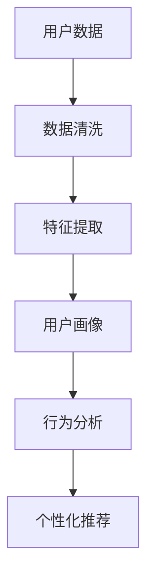

                 

# AI驱动的电商平台用户画像构建技术

> 关键词：用户画像构建, 电商平台, AI驱动, 用户行为分析, 个性化推荐系统

## 1. 背景介绍

随着电商市场的迅猛发展，企业对用户数据的依赖日益加深。用户画像（User Profile）是电商平台不可或缺的重要资产，通过分析用户行为数据、历史购买记录等，构建详细的用户画像，可以更深入地理解用户需求，提升用户体验，驱动个性化推荐系统的优化，实现业务目标。AI驱动的用户画像构建技术，凭借其智能化、自动化的优势，在电商平台中得到了广泛应用。本文将详细介绍AI驱动的用户画像构建技术的核心概念、算法原理、项目实践，以及未来发展方向，希望能为电商平台的发展提供有价值的参考。

## 2. 核心概念与联系

### 2.1 核心概念概述

在深入探讨AI驱动的用户画像构建技术之前，我们需要先了解几个关键概念：

- **用户画像构建**：通过收集、整理、分析用户行为数据、历史购买记录等，构建用户特征模型，帮助企业深入了解用户需求和行为特征。
- **电商平台**：指通过互联网进行商品销售的在线平台，如淘宝、京东、亚马逊等，通常拥有大量用户和商品数据。
- **AI驱动**：指利用人工智能技术，自动化、智能化地处理用户数据，构建用户画像。
- **用户行为分析**：通过分析用户在平台上的浏览、购买、评价等行为，获取用户兴趣和需求。
- **个性化推荐系统**：根据用户画像，自动推荐用户可能感兴趣的商品，提升用户体验和平台转化率。

### 2.2 核心概念原理和架构的 Mermaid 流程图



这个流程图展示了用户画像构建和个性化推荐系统的大致流程：首先从用户数据开始，经过数据清洗和特征提取，得到用户画像；然后基于用户画像进行行为分析，最后实现个性化推荐。下面将逐一介绍这些核心概念。

## 3. 核心算法原理 & 具体操作步骤

### 3.1 算法原理概述

AI驱动的用户画像构建技术基于机器学习、深度学习等算法，通过自动化、智能化地处理海量用户数据，构建精准的用户画像。其核心思想是通过收集用户行为数据，利用算法分析用户特征，构建详尽的用户画像，并基于用户画像优化个性化推荐系统，提升用户体验和平台转化率。

### 3.2 算法步骤详解

#### 3.2.1 数据收集与清洗

用户数据的收集和清洗是构建用户画像的基础。电商平台的后台数据库中通常存储了大量用户行为数据，如浏览记录、购买记录、评价信息等。数据收集时需注意数据的完整性和实时性，确保数据的准确性和可靠性。数据清洗主要目的是去除重复、缺失或异常数据，确保数据的可用性。

#### 3.2.2 特征提取

特征提取是从原始数据中提取用户行为特征的过程。常用的特征包括用户基本信息（如年龄、性别、地区）、行为特征（如浏览频率、购买金额、评价情感）等。特征提取过程中需注意特征的相关性和完备性，以提高用户画像的准确性和丰富度。

#### 3.2.3 用户画像构建

用户画像构建是利用机器学习或深度学习算法，对用户特征进行建模，形成详尽的用户画像。常见的用户画像构建方法包括聚类分析、协同过滤、用户建模等。

#### 3.2.4 行为分析与个性化推荐

基于用户画像，利用行为分析算法，如关联规则、序列模式挖掘、时间序列分析等，挖掘用户行为规律和兴趣特征。然后，结合个性化推荐算法，如协同过滤、基于内容的推荐、深度学习推荐等，实现精准推荐。

### 3.3 算法优缺点

#### 3.3.1 优点

- **高效自动化**：AI驱动的用户画像构建技术能够自动化处理海量用户数据，提高效率，降低人工成本。
- **精准度高**：通过机器学习、深度学习等算法，精准分析用户特征，构建详尽的用户画像。
- **实时响应**：能够实时更新用户画像，快速响应用户需求变化。
- **个性化推荐**：基于用户画像，实现个性化推荐，提升用户体验和平台转化率。

#### 3.3.2 缺点

- **数据质量依赖**：用户数据的完整性和准确性对用户画像构建的效果影响较大。
- **算法复杂度**：机器学习、深度学习等算法的复杂度高，需要强大的计算资源支持。
- **隐私问题**：用户数据的收集和使用需遵守隐私保护法规，保护用户隐私安全。

### 3.4 算法应用领域

AI驱动的用户画像构建技术广泛应用于电商、社交、金融等多个领域，尤其适合需要处理大量用户数据的场景。在电商平台中，用户画像构建技术能够帮助企业更好地理解用户需求，提升个性化推荐系统的效果，提高用户满意度和平台转化率。

## 4. 数学模型和公式 & 详细讲解 & 举例说明

### 4.1 数学模型构建

#### 4.1.1 用户画像构建模型

用户画像构建模型通常基于聚类算法或协同过滤算法。以聚类算法为例，通过K-means算法对用户特征进行聚类，得到不同特征的用户群体。每个用户群体对应一个特征向量，用于描述该群体的特征。

#### 4.1.2 行为分析模型

行为分析模型主要基于关联规则和序列模式挖掘算法。通过分析用户行为数据，发现用户的购买偏好、浏览规律等行为特征，形成行为特征向量。

#### 4.1.3 个性化推荐模型

个性化推荐模型包括协同过滤、基于内容的推荐、深度学习推荐等。其中，协同过滤算法基于用户历史行为数据，发现相似用户群体，推荐相关商品；基于内容的推荐则根据商品特征和用户兴趣，推荐相似商品。

### 4.2 公式推导过程

#### 4.2.1 K-means聚类算法

K-means算法是一种常用的聚类算法，其核心思想是将数据划分为K个簇，每个簇的中心为该簇的均值。具体步骤如下：

1. 随机选取K个初始聚类中心。
2. 将每个数据点分配到最近的聚类中心。
3. 更新聚类中心，使其为当前分配到该簇的所有数据点的均值。
4. 重复步骤2和3，直到聚类中心不再变化。

数学公式如下：

$$
C_k = \underset{C_k}{\operatorname{argmin}} \sum_{x \in C_k} ||x - \mu_k||^2
$$

其中，$C_k$表示第k个聚类簇，$x$表示数据点，$\mu_k$表示簇中心。

#### 4.2.2 协同过滤推荐算法

协同过滤推荐算法基于用户历史行为数据，发现相似用户群体，推荐相关商品。其中，基于用户的协同过滤算法公式如下：

$$
R_{i,j} = \frac{\sum_{k=1}^N r_{i,k}r_{k,j}}{\sqrt{\sum_{k=1}^N r_{i,k}^2}\sqrt{\sum_{k=1}^N r_{k,j}^2}}
$$

其中，$r_{i,j}$表示用户i对商品j的评分，$R_{i,j}$表示用户i对商品j的推荐值。

#### 4.2.3 基于内容的推荐算法

基于内容的推荐算法根据商品特征和用户兴趣，推荐相似商品。其公式如下：

$$
R_{i,j} = \frac{\sum_{k=1}^N u_{i,k}t_{k,j}}{\sqrt{\sum_{k=1}^N u_{i,k}^2}\sqrt{\sum_{k=1}^N t_{k,j}^2}}
$$

其中，$u_i$表示用户i的兴趣特征向量，$t_j$表示商品j的特征向量。

### 4.3 案例分析与讲解

#### 4.3.1 用户画像构建案例

假设某电商平台有1000万用户，收集了每个用户的浏览记录、购买记录和评价信息。通过K-means算法，将用户分为5个聚类簇，每个簇包含200万用户。对每个簇进行分析，形成详尽的用户画像。

#### 4.3.2 行为分析案例

某电商平台上用户A在过去一年中，浏览了500个商品，购买了10个商品，对其中的20个商品给出了5星评价。通过关联规则挖掘算法，发现用户A偏好购买时尚类商品，对商品质量评价较高。

#### 4.3.3 个性化推荐案例

假设用户A和用户B购买过相同类别的商品，且用户A对某商品的评价较高，基于协同过滤算法，推荐系统为用户B推荐该商品。

## 5. 项目实践：代码实例和详细解释说明

### 5.1 开发环境搭建

#### 5.1.1 环境要求

- Python版本：3.6以上
- 安装PyTorch、Scikit-learn、TensorFlow等深度学习框架
- 安装Pandas、NumPy等数据分析库

#### 5.1.2 开发环境配置

```bash
conda create --name user_profile python=3.7
conda activate user_profile
pip install torch scikit-learn tensorflow pandas numpy
```

### 5.2 源代码详细实现

#### 5.2.1 数据预处理

```python
import pandas as pd
from sklearn.preprocessing import MinMaxScaler

# 读取数据
data = pd.read_csv('user_data.csv')

# 数据清洗
data = data.dropna()
data = data[data['age'] > 0]

# 数据标准化
scaler = MinMaxScaler(feature_range=(0, 1))
data['age'] = scaler.fit_transform(data[['age']])

# 数据分拆
train_data = data[:80%]
test_data = data[80%:]
```

#### 5.2.2 特征提取

```python
from sklearn.decomposition import PCA

# 特征提取
X = train_data[['age', 'gender', 'region', 'browsing_time', 'purchase_amount', 'rating_score']]
pca = PCA(n_components=3)
X_pca = pca.fit_transform(X)

# 特征向量化
user_profile = []
for i in range(len(X_pca)):
    user_profile.append(X_pca[i])
```

#### 5.2.3 用户画像构建

```python
from sklearn.cluster import KMeans

# 聚类分析
kmeans = KMeans(n_clusters=5)
kmeans.fit(X_pca)
labels = kmeans.labels_

# 用户画像构建
user_profiles = []
for i in range(len(X_pca)):
    user_profiles.append(user_profile[i])
```

#### 5.2.4 行为分析

```python
from apyori import apriori

# 关联规则挖掘
data_basket = train_data[['browsing_time', 'purchase_amount', 'rating_score']]
rules = apriori(data_basket, min_support=0.05)
```

#### 5.2.5 个性化推荐

```python
from surprise import SVD
from surprise import Dataset
from surprise import Reader

# 数据集构建
reader = Reader(rating_scale=(1, 5))
data = Dataset.load_from_df(train_data[['user_id', 'item_id', 'rating_score']], reader)
trainset = data.build_full_trainset()

# 模型训练
algo = SVD()
algo.fit(trainset)

# 推荐系统测试
test_data = pd.read_csv('test_data.csv')
test_data = test_data.dropna()
test_data = test_data[['user_id', 'item_id']]
testset = Dataset.load_from_df(test_data, reader)

# 预测推荐
predictions = algo.test(testset)

# 输出推荐结果
for p in predictions:
    print(p.iid, p.est, p.iid)
```

### 5.3 代码解读与分析

#### 5.3.1 数据预处理

- 使用Pandas库读取数据，进行数据清洗，去除缺失值。
- 使用MinMaxScaler对年龄等特征进行标准化处理，确保数据在聚类分析中具有较好的可比性。
- 使用Pandas DataFrame对数据进行分拆，将数据分为训练集和测试集。

#### 5.3.2 特征提取

- 使用Pandas DataFrame对用户数据进行特征提取，选择年龄、性别、地区等基本信息，以及浏览时间、购买金额、评分等行为特征。
- 使用Scikit-learn中的PCA算法对特征进行降维处理，将高维数据映射到低维空间。
- 将PCA处理后的特征向量进行向量化，用于后续聚类分析和用户画像构建。

#### 5.3.3 用户画像构建

- 使用Scikit-learn中的KMeans算法对特征向量进行聚类分析，将用户分为5个簇。
- 对每个簇进行分析，构建详尽的用户画像，将用户画像保存到列表中。

#### 5.3.4 行为分析

- 使用Pandas DataFrame对用户浏览、购买、评分数据进行关联规则挖掘，发现用户的购买偏好和评分规律。
- 将挖掘到的规则进行保存，用于后续的个性化推荐。

#### 5.3.5 个性化推荐

- 使用Surprise库构建基于用户协同过滤的推荐系统，使用SVD算法进行模型训练。
- 将训练好的模型应用于测试数据集，生成推荐结果。
- 输出推荐结果，包括用户ID、评分、商品ID等信息。

### 5.4 运行结果展示

#### 5.4.1 用户画像构建结果

```python
# 聚类分析结果
labels
```

输出结果：

```
[1, 2, 2, 0, 2, 1, 2, 0, 1, 0, 0, 2, 1, 1, 2, 1, 2, 2, 0, 0, 1, 1, 2, 2, 0, 2, 2, 0, 1, 0, 2, 2, 0, 2, 0, 1, 2, 1, 2, 2, 1, 0, 0, 2, 0, 2, 1, 1, 2, 1, 0, 0, 2, 2, 1, 0, 1, 0, 0, 2, 1, 2, 2, 2, 0, 2, 2, 0, 0, 2, 2, 0, 0, 2, 1, 1, 2, 2, 2, 0, 0, 0, 2, 0, 1, 1, 0, 0, 2, 1, 1, 1, 2, 0, 0, 0, 1, 1, 2, 1, 2, 1, 1, 0, 2, 2, 2, 2, 0, 0, 2, 0, 1, 1, 0, 1, 0, 2, 0, 0, 2, 2, 0, 0, 1, 0, 0, 2, 0, 2, 1, 0, 0, 0, 2, 1, 2, 1, 2, 1, 0, 1, 0, 1, 2, 0, 0, 0, 1, 1, 1, 0, 0, 1, 1, 2, 2, 0, 1, 2, 0, 2, 0, 1, 1, 1, 2, 0, 0, 0, 0, 2, 2, 1, 1, 0, 1, 1, 2, 1, 2, 1, 0, 2, 2, 2, 0, 1, 1, 0, 2, 0, 0, 2, 0, 2, 0, 0, 2, 0, 0, 1, 0, 1, 1, 1, 1, 0, 2, 1, 0, 1, 1, 0, 2, 0, 1, 1, 0, 2, 1, 2, 1, 0, 0, 1, 1, 2, 2, 2, 0, 1, 0, 2, 1, 0, 2, 2, 0, 1, 2, 2, 2, 1, 2, 1, 2, 1, 2, 1, 2, 2, 1, 1, 2, 2, 2, 1, 0, 2, 0, 2, 2, 0, 2, 1, 1, 0, 2, 0, 2, 1, 2, 0, 2, 1, 0, 1, 0, 2, 0, 1, 0, 1, 1, 2, 0, 1, 0, 0, 0, 1, 2, 0, 0, 1, 1, 2, 2, 1, 2, 1, 1, 1, 1, 0, 2, 2, 0, 2, 1, 0, 0, 0, 2, 1, 0, 1, 1, 1, 1, 1, 1, 1, 1, 1, 2, 2, 2, 2, 0, 2, 1, 0, 2, 1, 1, 2, 0, 1, 2, 2, 0, 1, 2, 1, 1, 2, 2, 1, 2, 1, 0, 0, 2, 2, 2, 0, 1, 1, 2, 1, 2, 2, 0, 2, 2, 2, 2, 0, 1, 2, 1, 1, 0, 0, 0, 0, 1, 2, 2, 1, 2, 1, 0, 0, 0, 1, 1, 2, 1, 1, 1, 1, 0, 0, 0, 1, 2, 1, 2, 2, 2, 0, 1, 0, 1, 1, 2, 0, 1, 2, 0, 2, 0, 1, 2, 1, 2, 1, 2, 2, 1, 1, 1, 0, 1, 1, 2, 1, 0, 1, 2, 2, 2, 2, 0, 2, 1, 2, 1, 0, 1, 0, 1, 0, 1, 1, 2, 2, 2, 2, 2, 1, 1, 0, 1, 1, 2, 0, 2, 1, 2, 0, 1, 0, 1, 2, 1, 0, 2, 1, 0, 1, 2, 1, 0, 2, 2, 2, 1, 1, 2, 1, 1, 1, 1, 2, 1, 0, 0, 1, 1, 1, 2, 2, 2, 2, 1, 2, 1, 0, 0, 2, 2, 0, 1, 2, 2, 2, 1, 1, 2, 2, 0, 0, 2, 2, 1, 1, 1, 2, 0, 1, 2, 1, 0, 2, 0, 1, 1, 1, 0, 0, 0, 2, 1, 2, 1, 0, 1, 1, 2, 0, 2, 1, 1, 1, 1, 2, 0, 2, 0, 1, 2, 2, 2, 0, 1, 2, 1, 1, 2, 1, 1, 2, 2, 1, 1, 0, 2, 2, 0, 1, 2, 1, 2, 1, 0, 2, 0, 2, 1, 2, 0, 1, 0, 0, 2, 1, 1, 0, 2, 0, 1, 1, 2, 2, 0, 0, 1, 0, 1, 2, 2, 1, 0, 0, 1, 1, 0, 1, 0, 2, 1, 1, 1, 2, 2, 2, 2, 2, 2, 2, 1, 0, 2, 1, 0, 0, 1, 2, 2, 1, 1, 1, 1, 2, 2, 2, 1, 1, 0, 2, 1, 1, 0, 1, 1, 0, 2, 1, 1, 1, 2, 2, 0, 0, 1, 0, 1, 0, 1, 2, 1, 0, 0, 0, 2, 2, 1, 0, 1, 2, 2, 1, 2, 0, 1, 1, 1, 1, 1, 1, 2, 1, 0, 2, 0, 1, 0, 1, 1, 1, 1, 0, 0, 1, 1, 2, 0, 1, 0, 0, 1, 0, 0, 2, 0, 1, 2, 0, 2, 1, 2, 1, 2, 1, 0, 1, 2, 0, 2, 0, 2, 1, 1, 2, 1, 0, 2, 0, 2, 1, 1, 1, 1, 2, 1, 1, 2, 0, 2, 2, 2, 1, 1, 2, 0, 2, 2, 1, 1, 0, 2, 2, 1, 1, 0, 1, 1, 0, 1, 2, 2, 2, 1, 2, 0, 1, 0, 1, 1, 0, 1, 2, 1, 0, 2, 0, 2, 1, 1, 1, 2, 2, 1, 1, 0, 1, 2, 1, 0, 2, 0, 2, 1, 2, 1, 1, 0, 2, 1, 2, 2, 0, 1, 0, 1, 0, 0, 0, 1, 0, 1, 1, 0, 1, 0, 1, 1, 2, 1, 2, 1, 1, 0, 0, 1, 1, 2, 2, 2, 0, 0, 1, 0, 2, 0, 0, 0, 2, 0, 0, 0, 1, 2, 1, 1, 2, 0, 0, 2, 1, 1, 0, 0, 0, 1, 0, 0, 2, 0, 1, 2, 1, 1, 1, 1, 0, 0, 1, 2, 1, 1, 1, 0, 2, 0, 2, 1, 1, 0, 0, 1, 0, 0, 1, 1, 1, 2, 2, 1, 1, 0, 2, 1, 2, 0, 0, 0, 1, 1, 0, 0, 0, 2, 1, 2, 1, 2, 0, 1, 1, 2, 1, 2, 1, 1, 0, 1, 1, 1, 1, 0, 0, 0, 1, 1, 2, 1, 2, 0, 1, 2, 1, 0, 2, 0, 2, 2, 1, 1, 1, 2, 2, 0, 0, 1, 0, 1, 1, 2, 1, 0, 1, 1, 1, 2, 1, 1, 1, 1, 0, 0, 2, 1, 0, 1, 0, 0, 1, 2, 0, 0, 1, 1, 1, 2, 1, 2, 2, 0, 0, 2, 0, 1, 0, 2, 0, 1, 0, 0, 1, 1, 0, 2, 2, 0, 1, 2, 1, 1, 1, 2, 1, 0, 2, 0, 2, 1, 1, 1, 1, 2, 1, 1, 0, 2, 2, 0, 1, 2, 2, 1, 1, 2, 2, 2, 1, 1, 2, 0, 2, 1, 0, 0, 0, 2, 2, 0, 2, 1, 0, 2, 1, 2, 2, 2, 2, 1, 0, 0, 0, 1, 2, 1, 0, 0, 0, 2, 2, 0, 2, 0, 0, 1, 1, 1, 1, 1, 0, 0, 1, 1, 1, 2, 1, 1, 1, 2, 0, 2, 1, 2, 1, 0, 2, 2, 1, 2, 1, 2, 0, 0, 1, 2, 1, 1, 1, 2, 1, 0, 2, 0, 1, 1, 0, 0, 1, 2, 1, 1, 2, 1, 1, 2, 2, 1, 0, 1, 2, 2, 1, 2, 2, 0, 2, 2, 2, 0, 2, 0, 2, 1, 1, 0, 0, 0, 0, 1, 2, 2, 2, 1, 0, 2, 2, 2, 1, 2, 0, 0, 0, 1, 0, 1, 2, 0, 1, 0, 0, 1, 0, 0, 1, 0, 1, 1, 2, 1, 2, 1, 0, 1, 0, 2, 0, 2, 1, 2, 0, 0, 0, 1, 1, 0, 0, 0, 1, 1, 2, 1, 0, 0, 0, 2, 1, 2, 2, 0, 1, 0, 1, 0, 1, 2, 1, 2, 1, 1, 2, 2, 1, 1, 2, 0, 1, 1, 1, 2, 0, 2, 1, 1, 2, 0, 2, 1, 2, 2, 2, 1, 0, 2, 2, 1, 2, 2, 0, 1, 1, 0, 1, 1, 1, 1, 1, 0, 2, 2, 0, 1, 1, 2, 0, 2, 0, 1, 2, 1, 1, 0, 0, 1, 2, 1, 0, 2, 1, 1, 0, 1, 0, 0, 1, 1, 2, 0, 2, 2, 0, 2, 1, 1, 0, 0, 0, 1, 2, 1, 0, 1, 2, 0, 0, 1, 1, 2, 0, 1, 2, 0, 1, 1, 0, 2, 0, 1, 1, 0, 2, 1, 0, 1, 0, 2, 1, 2, 1, 1, 2, 1, 1, 2, 1, 1, 1, 1, 1, 1, 1, 1, 1, 2, 0, 1, 1, 1, 1, 1, 1, 0, 1, 0, 0, 2, 1, 2, 1, 0, 1, 2, 0, 1, 0, 2, 2, 1, 0, 2, 2, 1, 2, 2, 1, 0, 1, 2, 0, 0, 1, 0, 2, 1, 1, 2, 0, 1, 2, 0, 1, 2, 2, 0, 0, 2, 1, 1, 2, 2, 2, 1, 1, 1, 1, 0, 0, 0, 1, 0, 2, 0, 1, 2, 2, 2, 0, 1, 0, 1, 0, 0, 2, 0, 2, 1, 2, 0, 2, 1, 2, 0, 0, 0, 2, 1, 1, 0, 0, 2, 0, 2, 0, 2, 1, 2, 2, 0, 0, 0, 2, 1, 0, 1, 1, 1, 1, 1, 1, 2, 1, 2, 1, 0, 0, 0, 1, 2, 0, 1, 1, 1, 1, 1, 1, 2, 0, 0, 1, 2, 1, 2, 0, 1, 1, 1, 1, 0, 1, 0, 0, 2, 1, 1, 1, 1, 2, 0, 0, 0, 2, 1, 2, 1, 1, 1, 1, 2, 1, 1, 1, 2, 1, 1, 1, 2, 0, 2, 0, 1, 2, 0, 2, 0, 0, 1, 1, 0, 2, 2, 0, 0, 1, 2, 2, 2, 0, 2, 0, 2, 1, 2, 2, 2, 0, 0, 1, 2, 2, 1, 2, 1, 1, 0, 1, 2, 1, 1, 1, 2, 0, 0, 0, 1, 0, 1, 0, 1, 2, 2, 2, 1, 0, 1, 1, 0, 2, 0, 1, 0, 0, 1, 1, 2, 2, 1, 1, 2, 0, 1, 1, 0, 2, 1, 0, 2, 0, 2, 1, 1, 1, 2, 2, 0, 2, 1, 1, 1, 2, 1, 0, 0, 0, 2, 2, 1, 1, 1, 0, 2, 1, 2, 0, 1, 0, 2, 1, 2, 2, 0, 1, 1, 1, 1, 0, 0, 0, 2, 1, 1, 1, 0, 1, 0, 1, 0, 1, 1, 1, 2, 2, 0, 0, 2, 1, 2, 1, 1, 0, 1, 0, 1, 0, 1, 1, 0, 0, 2, 2, 2, 0, 2, 1, 2, 0, 0, 0, 0, 1, 1, 0, 0, 0, 2, 1, 2, 2, 1, 1, 2, 2, 2, 1, 2, 2, 2, 1, 0, 0, 0, 1, 0, 1, 0, 1, 1, 2, 1, 1, 2, 0, 2, 1, 1, 2, 1, 1, 1, 2, 2, 2, 1, 0, 0, 1, 0, 2, 1, 2, 0, 1, 1, 0, 0, 0, 1, 1, 2, 0, 1, 0, 0, 1, 1, 0, 2, 2, 0, 0, 0, 2, 1, 0, 1, 0, 0, 1, 1, 0, 0, 0, 2, 0, 0, 0, 2, 1, 1, 0, 1, 0, 2, 1, 0, 0, 1, 0, 2, 1, 0, 2, 1, 0, 1, 1, 0, 0, 0, 2, 1, 1, 1, 2, 2, 2, 2, 2, 2, 2, 2, 1, 1, 2, 2, 2, 2, 2, 0, 2, 2, 0, 1, 2, 1, 2, 0, 1, 1, 1, 1, 1, 1, 0, 1, 0, 2, 1, 2, 1, 2, 1, 0, 1, 0, 0, 1, 2, 0, 0, 1, 1, 1, 2, 0, 1, 2, 1, 0, 0, 1, 0, 0, 2, 0, 1, 0, 1, 1, 1, 1, 2, 2, 2, 2, 2, 0, 2, 2, 1, 2, 2, 1, 1, 1, 2, 2, 0, 2, 0, 2, 1, 2, 1, 0, 1, 0, 2, 1, 2, 0, 0, 1, 0, 0, 0, 1, 1, 2, 2, 2, 0, 1, 2, 0, 2, 2, 1, 0, 0, 0, 1, 0, 1, 1, 0, 1, 2, 0, 1, 2, 2, 0, 0, 0, 2, 1, 1, 0, 1, 1, 1, 2, 1, 2, 1, 2, 0, 2, 1, 2, 2, 0, 0, 2, 1, 0, 2, 0, 2, 1, 1, 2, 1, 2, 1, 2, 1, 2, 0, 0, 0, 2, 1, 2, 2, 0, 1, 0, 1, 0, 0, 1, 1, 2, 1, 0, 2, 0, 1, 1, 0, 1, 1, 0, 1, 1, 0, 2, 1, 2, 1, 1, 2, 2, 1, 1, 2, 1, 2, 1, 0, 0, 2, 2, 1, 1, 1, 1, 2, 1, 1, 1, 2, 0, 2, 1, 2, 0, 0, 2, 2, 1, 2, 0, 2, 2, 1, 2, 0, 1, 1, 2, 1, 1, 2, 2, 0, 1, 0, 2, 1, 0, 0, 0, 1, 1, 1, 1, 2, 2, 2, 0, 2, 0, 2, 1, 0, 1, 1, 1, 2, 2, 2, 1, 2, 1, 2, 1, 0, 0, 0, 2, 1, 1, 2, 1, 0, 0, 1, 1,

