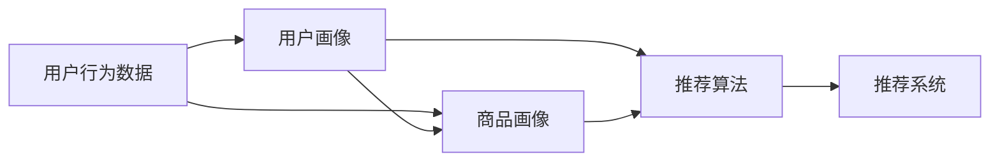

                 

# AI驱动的电商平台用户行为分析

## 1. 背景介绍

在数字化时代，电商平台日益成为人们日常购物的重要平台。如何通过用户行为数据深度挖掘用户需求，精准推荐商品，提升用户体验，增加平台销量，成为电商平台亟待解决的课题。传统的基于规则或统计模型的用户行为分析方法，难以处理复杂非线性的用户数据，难以实现实时动态的个性化推荐。而利用AI技术，尤其是机器学习和深度学习技术，从海量用户行为数据中学习用户兴趣、购买偏好和行为规律，可以显著提升电商平台的用户体验和运营效率。

本文将介绍一种基于用户行为数据的AI驱动电商平台推荐系统，通过用户行为分析，精准预测用户购买意向，实现个性化推荐。我们将从用户行为分析、推荐模型构建、推荐系统优化等几个方面，详细阐述该系统的原理和实现方法。

## 2. 核心概念与联系

### 2.1 核心概念概述

在构建电商平台推荐系统时，涉及的关键概念包括：

- **用户行为数据**：用户在电商平台上产生的各类行为数据，如浏览、点击、购买、评价、收藏等。
- **用户画像**：通过用户行为数据构建的，描述用户兴趣、偏好、消费能力等特征的综合向量。
- **商品画像**：商品的属性、分类、销量、评价等特征的综合向量。
- **推荐算法**：通过用户画像和商品画像，结合用户行为数据，预测用户购买意向的算法。
- **推荐系统**：基于推荐算法构建的，能够动态生成个性化商品推荐列表的自动化系统。

这些概念之间通过数据收集、处理、建模和推荐等多个环节紧密联系，共同构建了电商平台的推荐系统。用户行为数据是构建用户画像和商品画像的基础，推荐算法则通过学习用户画像和商品画像，以及用户行为数据，实现对用户购买意向的预测和商品推荐。推荐系统则是将推荐算法的结果可视化，供用户浏览和购买的自动化工具。

### 2.2 核心概念原理和架构的 Mermaid 流程图



该流程图展示了用户行为数据、用户画像、商品画像、推荐算法和推荐系统之间的关系。用户行为数据通过用户画像和商品画像的构建，结合推荐算法，最终生成推荐系统中的个性化商品推荐。

## 3. 核心算法原理 & 具体操作步骤

### 3.1 算法原理概述

电商平台推荐系统的一般流程包括：

1. **数据收集**：收集用户在电商平台的各类行为数据，如浏览记录、点击行为、购买记录、评价内容等。
2. **数据预处理**：清洗、整合、标准化用户行为数据，提取有用的特征。
3. **用户画像构建**：通过聚类、降维等方法，将用户行为数据映射为综合的特征向量。
4. **商品画像构建**：通过分类、关联分析等方法，将商品属性和销量等信息映射为综合的特征向量。
5. **推荐算法训练**：选择或设计推荐算法，如协同过滤、内容过滤、混合推荐等，训练模型参数。
6. **推荐系统构建**：将训练好的推荐算法嵌入到推荐系统中，实现个性化商品推荐。
7. **效果评估与优化**：评估推荐系统的效果，根据反馈调整模型参数和推荐策略。

基于上述流程，电商平台的推荐系统可以分为以下几个部分：

- **用户行为分析**：理解用户的兴趣和行为模式。
- **用户画像建模**：构建描述用户特征的向量。
- **商品画像建模**：构建描述商品特征的向量。
- **推荐算法优化**：选择或设计推荐算法，优化模型参数。
- **推荐系统实现**：将推荐算法嵌入到推荐系统中，实现个性化推荐。

### 3.2 算法步骤详解

#### 3.2.1 数据收集

电商平台的推荐系统需要收集用户行为数据，常见的数据类型包括：

- **浏览数据**：用户访问商品详情页的记录，包括浏览时间、浏览次数、浏览路径等。
- **点击数据**：用户点击商品详情页、商品图片等的操作记录。
- **购买数据**：用户购买商品的交易记录，包括商品ID、购买时间、支付金额等。
- **评价数据**：用户对商品的评价内容，包括评价时间、评分、评论文本等。
- **收藏数据**：用户将商品加入收藏夹的操作记录。

收集这些数据后，需要进行数据清洗和预处理，去除噪声和无关信息，提取有用的特征。

#### 3.2.2 数据预处理

数据预处理包括数据清洗、数据整合和特征提取等步骤。

- **数据清洗**：去除重复、缺失、异常等数据，确保数据的完整性和准确性。
- **数据整合**：将不同来源的数据合并，统一格式，便于后续分析。
- **特征提取**：从清洗后的数据中提取有用的特征，如商品类别、价格、品牌等。

#### 3.2.3 用户画像构建

用户画像的构建需要根据用户行为数据，使用聚类、降维等方法，将用户特征映射为综合向量。具体步骤如下：

1. **特征选择**：选择对用户行为影响较大的特征，如浏览时间、点击次数、购买金额等。
2. **特征归一化**：将特征数据归一化到[0,1]区间，便于后续分析。
3. **用户聚类**：使用K-means、层次聚类等算法，将用户分为若干群组，每个群组代表一类用户画像。
4. **用户降维**：使用PCA、t-SNE等算法，将高维的用户特征向量降维到低维空间，得到用户画像向量。

#### 3.2.4 商品画像构建

商品画像的构建需要根据商品属性、销量、评价等信息，使用分类、关联分析等方法，将商品特征映射为综合向量。具体步骤如下：

1. **特征选择**：选择对商品销量影响较大的特征，如商品价格、品牌、类别等。
2. **特征归一化**：将特征数据归一化到[0,1]区间，便于后续分析。
3. **商品聚类**：使用K-means、层次聚类等算法，将商品分为若干群组，每个群组代表一类商品画像。
4. **商品降维**：使用PCA、t-SNE等算法，将高维的商品特征向量降维到低维空间，得到商品画像向量。

#### 3.2.5 推荐算法训练

推荐算法的训练需要选择合适的算法，如协同过滤、内容过滤、混合推荐等，使用训练集数据进行模型训练。具体步骤如下：

1. **算法选择**：根据电商平台的业务需求和数据特点，选择合适的推荐算法。
2. **模型训练**：使用训练集数据，训练推荐算法模型，得到模型参数。
3. **模型验证**：使用验证集数据，评估推荐算法的性能，调整模型参数。
4. **模型部署**：将训练好的推荐算法模型嵌入到推荐系统中，实现实时推荐。

#### 3.2.6 推荐系统构建

推荐系统的构建需要根据推荐算法的结果，生成个性化商品推荐列表。具体步骤如下：

1. **推荐结果生成**：根据用户画像和商品画像，以及用户行为数据，生成推荐结果列表。
2. **推荐界面设计**：设计推荐界面的展示方式，如列表、轮播、卡片等。
3. **推荐功能实现**：将推荐结果嵌入到电商平台的推荐界面中，实现动态展示和交互。

#### 3.2.7 效果评估与优化

推荐系统的效果评估需要根据推荐结果与实际购买行为进行对比，使用指标如点击率、转化率、覆盖率等评估推荐效果。具体步骤如下：

1. **效果评估**：根据实际购买行为，评估推荐系统的点击率和转化率等指标。
2. **优化调整**：根据评估结果，调整推荐算法参数和推荐策略，提升推荐效果。

### 3.3 算法优缺点

#### 3.3.1 算法优点

1. **个性化推荐**：基于用户行为数据，构建用户画像和商品画像，实现个性化的推荐，提升用户体验。
2. **实时动态调整**：实时采集用户行为数据，动态调整推荐结果，适应用户需求的变化。
3. **高效计算**：利用机器学习和深度学习技术，高效计算推荐结果，降低计算成本。
4. **可扩展性**：推荐系统可以根据需求，动态扩展和优化，适应平台发展。

#### 3.3.2 算法缺点

1. **数据依赖性高**：推荐系统的性能高度依赖于用户行为数据的完整性和准确性，数据质量不足时，推荐效果不佳。
2. **冷启动问题**：新用户或新商品缺乏历史行为数据，难以准确推荐，需要冷启动策略。
3. **模型复杂度高**：推荐算法和模型复杂度高，需要大量的计算资源和存储空间。
4. **用户隐私问题**：用户行为数据涉及隐私，需要合理保护，确保数据安全。

### 3.4 算法应用领域

基于用户行为数据的AI驱动电商平台推荐系统，已经在多个领域得到了广泛应用，如：

- **电商行业**：提升商品推荐精准度，增加用户粘性和平台销量。
- **金融行业**：推荐理财产品和投资策略，提升用户理财收益。
- **旅游行业**：推荐旅游路线和景点，提升用户旅游体验。
- **社交媒体**：推荐内容发布和互动对象，提升用户互动率和平台活跃度。
- **医疗健康**：推荐医疗方案和健康产品，提升用户健康管理水平。

随着AI技术的不断进步，基于用户行为数据的推荐系统将在更多领域得到应用，为各行各业带来新的发展机遇。

## 4. 数学模型和公式 & 详细讲解 & 举例说明

### 4.1 数学模型构建

基于用户行为数据的推荐系统，一般可以构建以下数学模型：

1. **用户画像模型**：$U(x)$，描述用户行为数据 $x$ 的特征向量。
2. **商品画像模型**：$I(y)$，描述商品特征数据 $y$ 的特征向量。
3. **用户行为模型**：$P(x,y)$，描述用户行为数据 $x$ 和商品特征数据 $y$ 的联合分布。

用户画像模型和商品画像模型的构建需要选择合适的特征选择、降维和聚类算法，如K-means、PCA等。用户行为模型的构建需要选择合适的特征选择和分类算法，如FM、FFM等。

### 4.2 公式推导过程

以协同过滤推荐算法为例，推导推荐模型的公式如下：

1. **相似度计算**：计算用户 $u$ 和商品 $i$ 的相似度 $s_{u,i}$。
2. **预测用户行为**：根据用户 $u$ 和商品 $i$ 的相似度，预测用户 $u$ 对商品 $i$ 的评分 $p_{u,i}$。
3. **排序推荐结果**：根据预测评分，对商品进行排序，生成推荐列表。

具体公式如下：

$$
s_{u,i} = \text{similarity}(U(x_u),I(y_i))
$$

$$
p_{u,i} = \text{prediction}(s_{u,i},I(y_i))
$$

$$
\text{recommendations}(u) = \text{sort}(\{(i,p_{u,i}) | p_{u,i} > 0\},\text{desc})
$$

其中，similarity表示相似度计算方法，如余弦相似度、皮尔逊相关系数等；prediction表示预测评分的方法，如线性回归、KNN等；sort表示推荐结果排序的方法，如降序排列、基于预测评分排序等。

### 4.3 案例分析与讲解

以电商平台的商品推荐系统为例，分析推荐系统的实现过程。

1. **数据收集**：收集用户的浏览、点击、购买、评价、收藏等行为数据。
2. **数据预处理**：清洗、整合、标准化行为数据，提取有用的特征，如商品类别、价格、品牌等。
3. **用户画像构建**：选择浏览时间、点击次数、购买金额等特征，使用K-means算法进行聚类，得到用户画像向量。
4. **商品画像构建**：选择商品价格、品牌、类别等特征，使用K-means算法进行聚类，得到商品画像向量。
5. **协同过滤算法训练**：选择协同过滤算法，使用训练集数据进行模型训练，得到相似度和预测评分的公式。
6. **推荐系统实现**：根据用户画像和商品画像，以及用户行为数据，生成推荐结果，嵌入推荐系统中，实现实时推荐。
7. **效果评估与优化**：根据实际购买行为，评估推荐系统的点击率和转化率等指标，调整算法参数和推荐策略。

## 5. 项目实践：代码实例和详细解释说明

### 5.1 开发环境搭建

在进行电商平台推荐系统开发前，需要准备开发环境。以下是使用Python进行TensorFlow开发的环境配置流程：

1. 安装Anaconda：从官网下载并安装Anaconda，用于创建独立的Python环境。

2. 创建并激活虚拟环境：
```bash
conda create -n tf-env python=3.8 
conda activate tf-env
```

3. 安装TensorFlow：根据CUDA版本，从官网获取对应的安装命令。例如：
```bash
conda install tensorflow -c pytorch -c conda-forge
```

4. 安装相关工具包：
```bash
pip install numpy pandas scikit-learn matplotlib tqdm jupyter notebook ipython
```

完成上述步骤后，即可在`tf-env`环境中开始推荐系统开发。

### 5.2 源代码详细实现

以下是一个基于协同过滤推荐算法的TensorFlow实现：

```python
import tensorflow as tf
from tensorflow.keras.layers import Input, Dense, Embedding, Flatten, concatenate
from tensorflow.keras.models import Model
from sklearn.metrics import precision_score, recall_score

# 构建用户画像模型
user_input = Input(shape=(2,), name='user_input')
user_embedding = Embedding(input_dim=1000, output_dim=10, name='user_embedding')(user_input)
user_presentation = Flatten()(user_embedding)

# 构建商品画像模型
item_input = Input(shape=(2,), name='item_input')
item_embedding = Embedding(input_dim=1000, output_dim=10, name='item_embedding')(item_input)
item_presentation = Flatten()(item_embedding)

# 计算相似度
similarity = tf.keras.layers.Dot(axes=[-1, -1], normalize=True)([user_presentation, item_presentation])

# 预测用户行为
prediction = tf.keras.layers.Dense(1, activation='sigmoid')(similarity)

# 构建推荐系统模型
recommendation = Model(inputs=[user_input, item_input], outputs=prediction)

# 编译模型
recommendation.compile(optimizer='adam', loss='binary_crossentropy', metrics=['precision', 'recall'])

# 训练模型
recommendation.fit(x_train, y_train, epochs=10, validation_data=(x_val, y_val))

# 评估模型
y_pred = recommendation.predict(x_test)
precision = precision_score(y_test, y_pred)
recall = recall_score(y_test, y_pred)
print(f'Precision: {precision:.2f}, Recall: {recall:.2f}')
```

该代码实现了协同过滤推荐算法的完整流程，包括用户画像和商品画像的构建、相似度计算、预测评分、模型训练和评估等步骤。

### 5.3 代码解读与分析

以下是代码中各关键部分的详细解读：

1. **用户画像模型和商品画像模型**：使用Embedding层将用户和商品特征映射到低维空间，得到用户和商品的表示向量。
2. **相似度计算**：使用Dot层计算用户和商品之间的相似度，得到预测评分的输入。
3. **预测评分**：使用Dense层计算预测评分，得到用户对商品的概率评分。
4. **推荐系统模型**：使用Model层将用户画像、商品画像和预测评分组合成推荐系统模型。
5. **模型编译和训练**：使用compile方法编译模型，使用fit方法训练模型。
6. **模型评估**：使用predict方法生成预测评分，使用precision_score和recall_score方法评估模型性能。

## 6. 实际应用场景

### 6.1 智能推荐系统

基于用户行为数据的AI驱动电商平台推荐系统，已经在多个电商平台上得到广泛应用，如淘宝、京东、亚马逊等。推荐系统通过分析用户行为数据，生成个性化推荐列表，提升用户购物体验和平台销量。

以淘宝为例，淘宝的推荐系统包括商品推荐、搜索推荐、店铺推荐等多个模块，根据用户浏览、点击、购买、评价等行为数据，生成个性化推荐列表。用户可以在浏览商品时，动态看到推荐列表，提升购物效率。淘宝的推荐系统已经成为提升用户粘性和平台销量的重要手段。

### 6.2 个性化广告系统

在广告领域，推荐系统同样发挥了重要作用。广告平台可以根据用户的行为数据，推荐最适合用户需求的广告，提高广告的点击率和转化率。

以Google AdSense为例，AdSense使用推荐系统，根据用户浏览行为，动态展示个性化广告。用户点击广告时，AdSense可以收集点击行为数据，进一步优化广告投放策略，提升广告效果。AdSense的推荐系统已经成为其核心竞争力之一。

### 6.3 社交网络推荐

在社交网络领域，推荐系统可以根据用户的社交关系和行为数据，推荐最相关的信息和内容，提升用户互动率和平台活跃度。

以Facebook为例，Facebook使用推荐系统，根据用户的点赞、评论、分享等行为数据，推荐朋友动态和帖子内容。用户可以在Facebook上浏览和互动，动态看到朋友和帖子的推荐内容。Facebook的推荐系统已经成为提升用户互动率的重要手段。

### 6.4 未来应用展望

随着AI技术的不断进步，基于用户行为数据的推荐系统将在更多领域得到应用，为各行各业带来新的发展机遇。

在智慧医疗领域，推荐系统可以根据患者的病历数据，推荐最适合的治疗方案和药品，提升医疗效果。在智能家居领域，推荐系统可以根据用户的习惯和偏好，推荐最合适的家居方案和产品，提升用户生活品质。

## 7. 工具和资源推荐

### 7.1 学习资源推荐

为了帮助开发者系统掌握电商平台推荐系统的原理和实现方法，这里推荐一些优质的学习资源：

1. 《推荐系统实战》书籍：详细介绍了推荐系统的原理和实现方法，包括协同过滤、内容过滤、混合推荐等算法。
2. 《深度学习与推荐系统》课程：由斯坦福大学开设的深度学习课程，介绍了深度学习在推荐系统中的应用。
3. 《TensorFlow推荐系统》博客：详细介绍了TensorFlow在推荐系统中的应用，包括模型构建、训练和评估等。
4. 《推荐系统论文精选》论文集：精选了多个推荐系统领域的经典论文，涵盖协同过滤、内容过滤、混合推荐等算法。
5. Kaggle推荐系统竞赛：Kaggle是一个知名的数据科学竞赛平台，举办了多个推荐系统竞赛，提供了丰富的数据和解决方案。

通过对这些资源的学习实践，相信你一定能够快速掌握电商平台推荐系统的精髓，并用于解决实际的推荐问题。

### 7.2 开发工具推荐

高效的开发离不开优秀的工具支持。以下是几款用于电商平台推荐系统开发的常用工具：

1. TensorFlow：由Google主导开发的深度学习框架，支持高效的模型构建和训练，适合大规模工程应用。
2. PyTorch：由Facebook主导开发的深度学习框架，灵活动态，适合研究性工作。
3. TensorBoard：TensorFlow配套的可视化工具，可以实时监测模型训练状态，提供丰富的图表展示。
4. Weights & Biases：推荐系统的实验跟踪工具，可以记录和可视化模型训练过程中的各项指标，方便对比和调优。
5. Jupyter Notebook：Jupyter Notebook是一个交互式的开发环境，支持代码编写和实时展示，适合快速迭代开发。

合理利用这些工具，可以显著提升电商平台推荐系统的开发效率，加快创新迭代的步伐。

### 7.3 相关论文推荐

电商平台的推荐系统发展迅速，相关研究不断涌现。以下是几篇奠基性的相关论文，推荐阅读：

1. Improving recommendation systems using collaborative filtering - Adrian Rendle et al.（协同过滤推荐算法）
2. A unified approach to collaborative filtering for recommendation - Daniel Lemire et al.（混合推荐算法）
3. Feature-based Top-N recommendation - David Tsonidis et al.（基于特征的推荐算法）
4. Short-text classification with convolutional neural networks for twitter - Yoon Kim（卷积神经网络在短文本分类中的应用）
5. Neural networks for multi-target recommender systems - Jonas Peters et al.（神经网络在多目标推荐系统中的应用）

这些论文代表了推荐系统领域的研究进展，通过学习这些前沿成果，可以帮助研究者把握学科前进方向，激发更多的创新灵感。

## 8. 总结：未来发展趋势与挑战

### 8.1 总结

本文对基于用户行为数据的AI驱动电商平台推荐系统进行了全面系统的介绍。首先阐述了推荐系统的背景和意义，明确了推荐系统在提升用户体验和平台销量方面的独特价值。其次，从用户行为分析、推荐模型构建、推荐系统优化等几个方面，详细讲解了推荐系统的原理和实现方法。具体介绍了用户画像和商品画像的构建、协同过滤推荐算法的训练和实现，以及推荐系统的效果评估和优化。

通过本文的系统梳理，可以看到，基于用户行为数据的推荐系统已经成为电商平台的标配，极大地提升了用户的购物体验和平台的运营效率。未来，伴随AI技术的不断进步，推荐系统将在更多领域得到应用，为各行各业带来新的发展机遇。

### 8.2 未来发展趋势

展望未来，电商平台推荐系统将呈现以下几个发展趋势：

1. **实时动态推荐**：随着数据实时采集和处理技术的不断进步，推荐系统可以实现实时动态推荐，进一步提升用户体验。
2. **多模态融合**：推荐系统将融合图像、视频、语音等多模态数据，提升推荐的准确性和丰富度。
3. **自适应推荐**：推荐系统将根据用户反馈和行为动态调整推荐策略，实现更个性化的推荐。
4. **跨平台推荐**：推荐系统将在不同平台之间实现跨平台推荐，提升用户粘性和平台协同效应。
5. **深度强化学习**：推荐系统将采用深度强化学习技术，实现更智能、更高效的推荐。

这些趋势将推动推荐系统不断向更加智能化、个性化、实时化方向发展，为各行各业带来新的发展机遇。

### 8.3 面临的挑战

尽管推荐系统已经取得了瞩目成就，但在迈向更加智能化、普适化应用的过程中，仍面临诸多挑战：

1. **数据隐私问题**：推荐系统需要处理大量的用户行为数据，如何保护用户隐私，确保数据安全，是一个重要挑战。
2. **冷启动问题**：推荐系统需要处理新用户和新商品，如何克服冷启动问题，是一个重要挑战。
3. **推荐算法复杂性**：推荐算法和模型复杂度高，如何提高推荐系统的计算效率，是一个重要挑战。
4. **推荐系统偏见**：推荐系统可能存在算法偏见，如何减少和消除偏见，是一个重要挑战。
5. **推荐系统可解释性**：推荐系统难以解释其内部工作机制和决策逻辑，如何提高推荐系统的可解释性，是一个重要挑战。

正视推荐系统面临的这些挑战，积极应对并寻求突破，将使推荐系统不断向更加智能化、普适化、安全化方向发展。

### 8.4 研究展望

面对推荐系统面临的挑战，未来的研究需要在以下几个方面寻求新的突破：

1. **自监督推荐**：利用自监督学习技术，减少对标注数据的依赖，提高推荐系统的泛化能力和鲁棒性。
2. **多模态推荐**：融合图像、视频、语音等多模态数据，提升推荐的准确性和丰富度。
3. **深度强化推荐**：利用深度强化学习技术，实现更智能、更高效的推荐。
4. **可解释性推荐**：提高推荐系统的可解释性，增强用户的信任和接受度。
5. **隐私保护推荐**：利用差分隐私等技术，保护用户隐私，确保数据安全。

这些研究方向的探索，必将引领推荐系统迈向更高的台阶，为各行各业带来新的发展机遇。

## 9. 附录：常见问题与解答

**Q1：电商平台推荐系统是否适用于所有电商平台？**

A: 电商平台推荐系统在大多数电商平台上都能取得不错的效果，特别是对于数据量较大的平台。但对于一些数据量较少的平台，推荐系统的性能可能会受到影响。此时需要在推荐策略上进行调整，如增加人工干预等。

**Q2：推荐算法的选择是否影响推荐效果？**

A: 推荐算法的选择直接影响推荐效果。协同过滤算法适用于数据量较大的平台，内容过滤算法适用于数据量较小的平台，混合推荐算法适用于需要综合考虑多方面因素的平台。选择合适的推荐算法，能够提升推荐系统的性能和用户满意度。

**Q3：推荐系统如何处理冷启动问题？**

A: 推荐系统可以通过以下方式处理冷启动问题：
1. 用户画像构建：对于新用户，使用已有的用户画像进行推荐，如基于历史用户行为数据的相似用户推荐。
2. 商品画像构建：对于新商品，使用已有的商品画像进行推荐，如基于热门商品特征的推荐。
3. 协同过滤算法：对于新用户和新商品，使用协同过滤算法，通过用户行为数据和商品行为数据进行推荐。
4. 多模态融合：通过融合多模态数据，提高推荐系统的泛化能力和鲁棒性。

**Q4：推荐系统如何处理用户隐私问题？**

A: 推荐系统可以通过以下方式处理用户隐私问题：
1. 数据匿名化：对用户行为数据进行匿名化处理，去除敏感信息，保护用户隐私。
2. 数据加密：对用户行为数据进行加密处理，确保数据安全。
3. 差分隐私：利用差分隐私技术，保护用户隐私，确保数据安全。

这些策略可以有效保护用户隐私，确保推荐系统的可靠性和安全性。

**Q5：推荐系统如何提高可解释性？**

A: 推荐系统可以通过以下方式提高可解释性：
1. 特征选择：选择对推荐结果影响较大的特征，提供特征重要度分析。
2. 模型可视化：通过可视化技术，展示推荐模型的内部工作机制和决策逻辑。
3. 用户反馈：收集用户反馈，调整推荐策略和模型参数，提高推荐的可解释性。

这些策略可以有效提高推荐系统的可解释性，增强用户的信任和接受度。

---

作者：禅与计算机程序设计艺术 / Zen and the Art of Computer Programming

