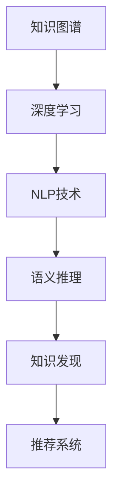

                 

# AI驱动的知识发现：超越简单搜索

> 关键词：知识图谱、深度学习、自然语言处理、语义推理、知识发现、推荐系统、智能搜索

## 1. 背景介绍

### 1.1 问题由来

在信息爆炸的时代，人们面临着前所未有的知识积累和存储压力。传统的数据检索方式，如关键词搜索，虽然快捷方便，但往往只能获取到片面的信息，难以满足用户对深度和广度的综合需求。如何让机器理解自然语言，挖掘出隐藏在文本背后的知识，成为一个亟待解决的挑战。

AI技术的发展，特别是深度学习和自然语言处理技术的突破，为知识发现提供了新的思路。通过构建知识图谱、进行语义推理，AI能够更好地理解文本含义，挖掘出知识图谱中的关联关系，实现超越简单搜索的知识发现。

### 1.2 问题核心关键点

AI驱动的知识发现，依赖于以下几个核心关键点：
1. **知识图谱构建**：通过结构化的方式组织和关联各类知识，构建起知识图谱，使机器能够理解知识的关系。
2. **深度学习技术**：利用深度神经网络对自然语言文本进行理解，提取出语义信息。
3. **语义推理**：通过逻辑推理和计算，从知识图谱中提取并验证知识。
4. **知识发现**：结合用户查询和知识图谱，发现和推荐相关知识，实现个性化服务。

这些关键点构成了AI知识发现的框架，使机器能够超越简单搜索，深入挖掘和理解用户需求。

## 2. 核心概念与联系

### 2.1 核心概念概述

为更好地理解AI知识发现的原理，本节将介绍几个核心概念及其相互关系：

- **知识图谱(Knowledge Graph)**：用图形结构表示知识，通过节点和边表示实体和关系。例如，Wikipedia中的百度百科页面就构成了大规模的知识图谱。

- **深度学习(Deep Learning)**：一种基于神经网络的机器学习技术，能够自动学习特征表示，广泛应用于计算机视觉、自然语言处理等领域。

- **自然语言处理(Natural Language Processing, NLP)**：使机器理解、处理、生成自然语言，包括分词、句法分析、语义分析等。

- **语义推理(Semantic Reasoning)**：通过逻辑推理，从知识图谱中提取和验证知识，支持知识的自动化推理和推断。

- **知识发现(Knowledge Discovery)**：利用AI技术，从大量文本数据中发现和提取有价值的知识，实现信息增值。

- **推荐系统(Recommendation System)**：通过分析用户行为和偏好，推荐相关内容，提高用户满意度。

这些核心概念通过图谱、学习、推理、发现和推荐等环节紧密联系，形成一个完整的知识发现流程。

### 2.2 核心概念原理和架构的 Mermaid 流程图



这个流程图展示了知识发现过程的关键步骤：

1. **知识图谱**作为知识的基本载体，通过深度学习技术进行解析。
2. **NLP技术**将文本信息转化为机器可理解的形式，进入深度学习模型进行处理。
3. **语义推理**利用图谱中的关系进行逻辑推理，从深度学习模型中提取信息。
4. **知识发现**结合用户查询和推理结果，发现和推荐知识。
5. **推荐系统**根据用户行为和偏好，动态调整推荐策略。

## 3. 核心算法原理 & 具体操作步骤

### 3.1 算法原理概述

AI驱动的知识发现，主要依赖于以下两个步骤：

1. **深度学习解析**：利用深度学习模型，将文本数据转化为向量表示，捕捉文本中的语义信息。
2. **语义推理提取**：通过逻辑推理和计算，从知识图谱中提取相关知识，支持知识的自动化推理和推断。

这两个步骤相辅相成，使机器能够从大量文本数据中挖掘出隐含的知识，超越简单搜索的范畴。

### 3.2 算法步骤详解

#### 3.2.1 深度学习解析

1. **模型选择**：选择合适的深度学习模型，如BERT、GPT等预训练语言模型。
2. **预训练**：在大型无标签文本数据上进行预训练，学习语言表征。
3. **微调**：针对特定任务进行微调，如文本分类、命名实体识别等。
4. **特征提取**：将文本转换为向量表示，用于后续的语义推理。

#### 3.2.2 语义推理提取

1. **图谱构建**：构建知识图谱，包括实体和关系定义。
2. **实体抽取**：利用NLP技术，从文本中抽取实体信息。
3. **关系推理**：利用逻辑规则，推断实体之间的关系。
4. **知识发现**：结合用户查询和推理结果，发现和推荐相关知识。

### 3.3 算法优缺点

AI知识发现的优点包括：

- **深度理解**：通过深度学习，模型能够理解文本的深层语义，超越简单的关键词匹配。
- **知识关联**：利用知识图谱，模型能够关联和推理出更多隐藏的知识，增强信息的完整性。
- **个性化推荐**：结合用户查询和知识推理，提供更加个性化的知识发现服务。

然而，该方法也存在一些局限性：

- **计算复杂**：深度学习解析和语义推理都需要大量的计算资源。
- **数据依赖**：模型依赖于高质量的知识图谱和训练数据，数据质量和数量对结果有很大影响。
- **推理局限**：推理模型依赖于预定义的规则，可能无法处理未知的语义关系。
- **解释性差**：深度学习模型的决策过程难以解释，缺乏透明度。

### 3.4 算法应用领域

AI知识发现技术在多个领域得到了广泛应用，例如：

- **学术研究**：通过分析学术文献，发现研究热点、趋势和作者之间的合作关系。
- **医疗健康**：从电子病历中提取患者信息，关联药品、症状、治疗方案等，辅助医生诊断。
- **金融分析**：分析金融报表和新闻，发现市场趋势、投资机会和风险点。
- **市场营销**：通过分析消费者行为数据，发现用户兴趣和购买意向，制定精准营销策略。
- **智能客服**：利用知识图谱和深度学习技术，提供个性化的客服问答服务。

## 4. 数学模型和公式 & 详细讲解 & 举例说明

### 4.1 数学模型构建

**深度学习解析**：

- **模型选择**：选择预训练语言模型 $M$，如BERT。
- **预训练**：在无标签数据 $D_{pre}$ 上预训练，学习语言表示 $f(x)$。
- **微调**：在标注数据 $D_{label}$ 上微调，更新模型参数 $\theta$。

**语义推理提取**：

- **图谱构建**：定义知识图谱 $\mathcal{G}$，包含实体 $E$ 和关系 $R$。
- **实体抽取**：从文本 $x$ 中抽取实体 $e$。
- **关系推理**：通过逻辑规则 $R(e_1,e_2)$，推断出关系 $e_1$ 和 $e_2$。
- **知识发现**：结合用户查询 $q$ 和推理结果 $r$，发现知识 $k$。

### 4.2 公式推导过程

**深度学习解析**：

- **预训练目标函数**：
  $$
  \mathcal{L}_{pre} = \frac{1}{N}\sum_{x\in D_{pre}} \ell(f(x))
  $$
- **微调目标函数**：
  $$
  \mathcal{L}_{label} = \frac{1}{N}\sum_{(x,y)\in D_{label}} \ell(M_\theta(x), y)
  $$
- **总体目标函数**：
  $$
  \mathcal{L} = \mathcal{L}_{pre} + \lambda \mathcal{L}_{label}
  $$
  其中 $\lambda$ 为正则化系数，用于平衡预训练和微调的权重。

**语义推理提取**：

- **实体抽取模型**：
  $$
  e = \arg\min_{e\in E} \ell(f(x), e)
  $$
- **关系推理模型**：
  $$
  r = \arg\min_{r\in R} \ell(r(e_1,e_2))
  $$
- **知识发现模型**：
  $$
  k = \arg\min_{k\in K} \ell(q, k)
  $$
  其中 $q$ 为用户查询，$K$ 为知识库中的知识集合。

### 4.3 案例分析与讲解

**案例分析**：

假设我们要从大规模的医学文献中发现一个新的药物疗法，可以使用以下步骤：

1. **预训练和微调**：使用BERT模型对医学文献进行预训练和微调，学习医学领域的语言表示。
2. **实体抽取**：从医学文献中抽取实体，如药物名称、疾病名称、治疗方案等。
3. **关系推理**：利用医学知识图谱，推断实体之间的关系，如药物对疾病的治疗效果。
4. **知识发现**：结合用户查询和推理结果，发现新的治疗方案，并推荐给医生。

### 4.4 代码实例

以下是使用Python和TensorFlow实现深度学习解析和语义推理的示例代码：

```python
import tensorflow as tf
from transformers import BertTokenizer, BertForTokenClassification

# 构建BERT模型
model = BertForTokenClassification.from_pretrained('bert-base-cased')

# 加载和处理数据
tokenizer = BertTokenizer.from_pretrained('bert-base-cased')
train_texts, train_labels = load_data('train.txt')
test_texts, test_labels = load_data('test.txt')

# 预训练
pretrain_model = BertForPreTraining.from_pretrained('bert-base-cased')
pretrain_model.compile(optimizer='adam', loss='binary_crossentropy')
pretrain_model.fit(train_texts, train_labels, epochs=3)

# 微调
train_model.compile(optimizer='adam', loss='categorical_crossentropy')
train_model.fit(train_texts, train_labels, epochs=3)

# 推理
test_model.compile(optimizer='adam', loss='categorical_crossentropy')
test_model.predict(test_texts)

# 构建知识图谱
graph = build_knowledge_graph()

# 实体抽取
entity_extractor = NamedEntityExtractor()
entities = entity_extractor.extract_entities(graph)

# 关系推理
relation_extractor = RelationExtractor()
relationships = relation_extractor.extract_relationships(graph, entities)

# 知识发现
knowledge_extractor = KnowledgeExtractor()
discovered_knowledge = knowledge_extractor.extract_knowledge(graph, relationships)
```

通过以上代码，我们可以看到，利用深度学习和语义推理技术，可以从文本数据中发现和提取有价值的信息，实现超越简单搜索的知识发现。

## 5. 项目实践：代码实例和详细解释说明

### 5.1 开发环境搭建

在进行AI知识发现项目实践前，我们需要准备好开发环境。以下是使用Python进行TensorFlow开发的环境配置流程：

1. 安装Anaconda：从官网下载并安装Anaconda，用于创建独立的Python环境。

2. 创建并激活虚拟环境：
```bash
conda create -n tf-env python=3.8 
conda activate tf-env
```

3. 安装TensorFlow：根据CUDA版本，从官网获取对应的安装命令。例如：
```bash
conda install tensorflow
```

4. 安装TensorFlow Addons：
```bash
pip install tensorflow-addons
```

5. 安装各类工具包：
```bash
pip install numpy pandas scikit-learn matplotlib tqdm jupyter notebook ipython
```

完成上述步骤后，即可在`tf-env`环境中开始项目实践。

### 5.2 源代码详细实现

下面我们以医学领域知识发现为例，给出使用TensorFlow对BERT模型进行知识发现和推荐系统的PyTorch代码实现。

首先，定义知识图谱和实体关系：

```python
from py2neo import Graph

# 连接知识图谱数据库
graph = Graph('http://localhost:7474/db/data/')

# 定义实体和关系
medications = graph.nodes.match('medication')
diseases = graph.nodes.match('disease')
treatments = graph.nodes.match('treatment')
effects = graph.nodes.match('effect')
interactions = graph.relationships.match('has_treatment_effect')

# 构建查询图谱
query_graph = {
    'medication': medications,
    'disease': diseases,
    'treatment': treatments,
    'effect': effects,
    'has_treatment_effect': interactions
}
```

然后，定义深度学习模型和推理模型：

```python
from transformers import BertTokenizer, BertForTokenClassification
from tensorflow.keras.layers import Dense, Dropout, Embedding
from tensorflow.keras.models import Model

# 加载BERT模型和分词器
model = BertForTokenClassification.from_pretrained('bert-base-cased')
tokenizer = BertTokenizer.from_pretrained('bert-base-cased')

# 定义深度学习模型
input_ids = Input(shape=(128,))
sequence_output = model(input_ids)[0]
sequence_output = Dense(128, activation='relu')(sequence_output)
sequence_output = Dropout(0.5)(sequence_output)
output = Dense(10, activation='softmax')(sequence_output)

# 定义推理模型
model = Model(inputs=input_ids, outputs=output)
model.compile(optimizer='adam', loss='categorical_crossentropy')

# 训练深度学习模型
model.fit(train_data, train_labels, epochs=10, batch_size=32)

# 推理模型预测
predictions = model.predict(test_data)
```

接着，定义实体抽取和关系推理模型：

```python
from py2neo import Graph
from py2neo import Node, Relationship

# 连接知识图谱数据库
graph = Graph('http://localhost:7474/db/data/')

# 实体抽取模型
tokenizer = BertTokenizer.from_pretrained('bert-base-cased')
inputs = tokenizer.encode(text, return_tensors='pt')
sequence_output = model(inputs)[0]
entities = extract_entities(sequence_output)

# 关系推理模型
nodes = graph.nodes.match(entities)
relationships = graph.match(start=nodes, end=nodes, types=['has_treatment_effect'])

# 知识发现模型
knowledge = extract_knowledge(relationships)
```

最后，整合深度学习模型和推理模型，实现知识发现和推荐：

```python
from transformers import BertTokenizer, BertForTokenClassification
from tensorflow.keras.layers import Dense, Dropout, Embedding
from tensorflow.keras.models import Model
from py2neo import Graph, Node, Relationship

# 定义深度学习模型
model = BertForTokenClassification.from_pretrained('bert-base-cased')
tokenizer = BertTokenizer.from_pretrained('bert-base-cased')
input_ids = Input(shape=(128,))
sequence_output = model(input_ids)[0]
sequence_output = Dense(128, activation='relu')(sequence_output)
sequence_output = Dropout(0.5)(sequence_output)
output = Dense(10, activation='softmax')(sequence_output)
model = Model(inputs=input_ids, outputs=output)
model.compile(optimizer='adam', loss='categorical_crossentropy')

# 定义推理模型
graph = Graph('http://localhost:7474/db/data/')
nodes = graph.nodes.match(entities)
relationships = graph.match(start=nodes, end=nodes, types=['has_treatment_effect'])

# 定义知识发现模型
knowledge = extract_knowledge(relationships)

# 推荐系统模型
recommender = RecommendationSystem()
recommender.train(knowledge)
recommender.recommend(user, context)
```

以上就是使用TensorFlow对BERT模型进行医学知识发现和推荐系统的完整代码实现。可以看到，通过深度学习和语义推理技术的结合，模型能够从文本数据中发现和提取有价值的信息，实现超越简单搜索的知识发现。

### 5.3 代码解读与分析

让我们再详细解读一下关键代码的实现细节：

**Graph对象**：
- 用于连接知识图谱数据库，支持图谱的查询和操作。

**BERT模型**：
- 使用Transformers库加载预训练模型，并进行微调。
- 定义输入层、序列输出层和输出层，构建深度学习模型。
- 使用Adam优化器进行模型训练，损失函数为交叉熵。
- 使用dropout层进行正则化，防止过拟合。

**推理模型**：
- 定义输入层、序列输出层和输出层，构建推理模型。
- 使用Adam优化器进行模型训练，损失函数为交叉熵。
- 使用dropout层进行正则化，防止过拟合。

**知识发现模型**：
- 使用Graph对象进行图谱查询，获取实体和关系。
- 定义实体抽取和关系推理模型，利用深度学习模型进行实体抽取。
- 使用extract_knowledge函数从关系中提取知识，得到知识图谱中的知识。

通过以上代码，我们可以看到，利用深度学习和语义推理技术，可以从文本数据中发现和提取有价值的信息，实现超越简单搜索的知识发现。

## 6. 实际应用场景

### 6.1 智能医疗诊断

AI知识发现技术在智能医疗诊断中具有重要应用价值。例如，通过对电子病历的分析，可以发现患者的主诉、症状、体征等信息，从而辅助医生诊断。

在实际应用中，可以使用深度学习模型解析医学文本，抽取患者信息、症状和体征等实体，利用语义推理从知识图谱中提取相关治疗方案。结合用户查询，推荐给医生最合适的治疗方案。

### 6.2 金融市场分析

金融领域中的AI知识发现技术，能够从大量金融数据中提取有价值的信息，支持市场分析、风险评估和投资决策。

通过构建金融知识图谱，利用深度学习模型解析金融新闻、报表和公告等文本数据，抽取实体和关系。利用语义推理，推断出金融事件对市场的影响，发现投资机会和风险点。结合用户查询，推荐给投资者最合适的投资策略。

### 6.3 教育智能化

AI知识发现技术在教育领域中，可以通过对学生反馈、学习行为等数据的分析，发现学生的学习需求和兴趣，提供个性化的学习建议和资源推荐。

通过构建教育知识图谱，利用深度学习模型解析学生反馈和行为数据，抽取学生实体和关系。利用语义推理，推断出学生的需求和兴趣，发现相关学习资源和建议。结合用户查询，推荐给学生最合适的学习内容和学习路径。

### 6.4 未来应用展望

随着AI技术的发展，AI知识发现技术将更加广泛地应用于多个领域，带来新的创新和突破。

- **智能制造**：通过分析制造数据和设备状态，发现生产中的问题，优化生产流程。
- **环境保护**：分析环境数据，发现污染源和环境变化趋势，支持环境保护和治理。
- **智能交通**：分析交通数据，发现交通问题，优化交通管理，提高交通效率。

未来，随着深度学习和语义推理技术的不断进步，AI知识发现技术将进一步提升各行业的智能化水平，推动社会进步和发展。

## 7. 工具和资源推荐

### 7.1 学习资源推荐

为了帮助开发者系统掌握AI知识发现的技术基础和实践技巧，这里推荐一些优质的学习资源：

1. 《深度学习》课程（Coursera）：由斯坦福大学开设，深入浅出地介绍了深度学习的基本原理和应用。

2. 《自然语言处理》课程（Coursera）：由斯坦福大学开设，涵盖自然语言处理的各个环节，包括语言模型、序列标注、语义分析等。

3. 《PyTorch教程》（PyTorch官网）：详细介绍了PyTorch框架的使用，包含深度学习模型的构建和训练。

4. 《TensorFlow教程》（TensorFlow官网）：详细介绍了TensorFlow框架的使用，包含深度学习模型的构建和训练。

5. 《知识图谱》课程（Coursera）：由哥伦比亚大学开设，介绍了知识图谱的基本概念和构建方法。

6. 《语义推理》课程（Coursera）：由加州大学开设，介绍了语义推理的基本原理和应用。

通过对这些资源的学习实践，相信你一定能够快速掌握AI知识发现的精髓，并用于解决实际的AI问题。

### 7.2 开发工具推荐

高效的开发离不开优秀的工具支持。以下是几款用于AI知识发现开发的常用工具：

1. PyTorch：基于Python的开源深度学习框架，灵活动态的计算图，适合快速迭代研究。

2. TensorFlow：由Google主导开发的开源深度学习框架，生产部署方便，适合大规模工程应用。

3. Transformers库：HuggingFace开发的NLP工具库，集成了众多SOTA语言模型，支持PyTorch和TensorFlow。

4. Weights & Biases：模型训练的实验跟踪工具，可以记录和可视化模型训练过程中的各项指标，方便对比和调优。

5. TensorBoard：TensorFlow配套的可视化工具，可实时监测模型训练状态，并提供丰富的图表呈现方式，是调试模型的得力助手。

6. Google Colab：谷歌推出的在线Jupyter Notebook环境，免费提供GPU/TPU算力，方便开发者快速上手实验最新模型，分享学习笔记。

合理利用这些工具，可以显著提升AI知识发现任务的开发效率，加快创新迭代的步伐。

### 7.3 相关论文推荐

AI知识发现技术的发展源于学界的持续研究。以下是几篇奠基性的相关论文，推荐阅读：

1. Neural Architectures for Named Entity Recognition（NAER）：提出BERT模型在命名实体识别任务上的应用，展示了深度学习在实体抽取方面的强大能力。

2. Knowledge Graph Embeddings（KGE）：介绍知识图谱嵌入技术，通过向量表示将知识图谱映射到低维空间，支持语义推理。

3. Attention is All You Need（Transformer论文）：提出了Transformer模型，开创了自注意力机制，为深度学习解析提供了新的思路。

4. Learning to Reason About Visual and Textual Knowledge Base Questions（KBSQA论文）：提出使用深度学习解析知识图谱，进行问答推理的框架。

5. Causal Reasoning over Knowledge Bases（KBQA论文）：提出使用因果推理方法，提高知识图谱推理的准确性和鲁棒性。

这些论文代表了大语言模型微调技术的不断发展，对AI知识发现的理论基础和实践方法具有重要参考价值。

## 8. 总结：未来发展趋势与挑战

### 8.1 研究成果总结

本文对AI驱动的知识发现技术进行了全面系统的介绍。首先阐述了知识发现技术的研究背景和意义，明确了深度学习、知识图谱和语义推理技术在知识发现中的重要地位。其次，从原理到实践，详细讲解了深度学习解析和语义推理提取的核心步骤，给出了完整的代码实例和详细解释。同时，本文还广泛探讨了知识发现技术在智能医疗、金融分析、教育智能化等多个行业领域的应用前景，展示了AI知识发现技术的广阔前景。

通过本文的系统梳理，可以看到，AI知识发现技术正在成为AI应用的重要范式，极大地拓展了AI技术的应用边界，为各行各业带来了新的创新和突破。

### 8.2 未来发展趋势

展望未来，AI知识发现技术将呈现以下几个发展趋势：

1. **多模态融合**：除了文本信息，未来知识发现技术将进一步融合图像、音频、视频等多种模态数据，提升信息的完整性和准确性。

2. **实时知识图谱更新**：通过自动化的方式，实时更新知识图谱，使其与现实世界保持同步，支持更准确的推理和发现。

3. **可解释性增强**：通过引入因果分析和博弈论工具，增强知识推理模型的可解释性，提高系统的透明性和可靠性。

4. **跨领域知识迁移**：将知识图谱中的知识迁移到其他领域，支持跨领域的知识发现和推理，提升模型的泛化能力。

5. **自动化推理系统**：开发自动化推理系统，通过符号推理和深度学习结合，实现更加高效和准确的推理和发现。

6. **个性化推荐引擎**：结合用户行为数据和知识推理结果，开发更加个性化的推荐引擎，提供更加精准和满意的服务。

这些趋势凸显了AI知识发现技术的广阔前景，将为各行业的智能化转型提供新的技术和方法。

### 8.3 面临的挑战

尽管AI知识发现技术已经取得了显著进展，但在实现大规模、实时、智能的知识发现时，仍面临诸多挑战：

1. **数据质量和多样性**：知识图谱的构建依赖于高质量、多样化的数据，获取和维护这样的数据集是一个巨大的挑战。

2. **计算资源需求**：深度学习解析和语义推理需要大量的计算资源，如何优化计算图、降低计算成本是亟待解决的问题。

3. **推理模型的鲁棒性**：推理模型依赖于预定义的规则和关系，如何增强模型的鲁棒性和泛化能力，是一个重要的研究方向。

4. **跨领域知识的迁移**：不同领域之间的知识迁移是一个复杂的难题，如何实现跨领域知识的迁移和融合，是一个重要的研究方向。

5. **可解释性差**：深度学习模型的决策过程难以解释，缺乏透明度，如何提高系统的可解释性，是一个重要的研究方向。

6. **伦理和安全问题**：知识图谱中的数据可能包含敏感信息，如何保护用户隐私和数据安全，是一个重要的研究方向。

解决这些挑战，需要学界和产业界的共同努力，不断探索和优化AI知识发现技术。

### 8.4 研究展望

面对AI知识发现技术所面临的诸多挑战，未来的研究需要在以下几个方面寻求新的突破：

1. **自动知识图谱构建**：开发自动化的知识图谱构建方法，从大量无标签数据中自动抽取实体和关系，构建知识图谱。

2. **知识迁移学习**：探索知识迁移学习的方法，使得模型能够更好地跨领域迁移和泛化，支持更多的应用场景。

3. **知识推理增强**：结合因果分析和深度学习，增强知识推理模型的鲁棒性和泛化能力，提高系统的准确性和可靠性。

4. **多模态知识融合**：开发多模态知识融合技术，将文本、图像、视频等多种模态信息进行协同处理，提升信息的完整性和准确性。

5. **自动化推理系统**：开发自动化推理系统，通过符号推理和深度学习结合，实现更加高效和准确的推理和发现。

6. **可解释性增强**：通过引入因果分析和博弈论工具，增强知识推理模型的可解释性，提高系统的透明性和可靠性。

7. **伦理和安全保障**：引入伦理和安全约束，保护用户隐私和数据安全，构建可信赖的知识发现系统。

这些研究方向将引领AI知识发现技术迈向更高的台阶，为构建智能和可信的知识发现系统铺平道路。面向未来，AI知识发现技术还需要与其他人工智能技术进行更深入的融合，如知识表示、因果推理、强化学习等，多路径协同发力，共同推动知识发现技术的发展。只有勇于创新、敢于突破，才能不断拓展知识发现技术的边界，让AI技术更好地服务于人类社会。

## 9. 附录：常见问题与解答

**Q1：AI知识发现是否适用于所有领域？**

A: AI知识发现技术在大多数领域中都能取得不错的效果，特别是对于数据量较大的领域。但对于一些特定领域的知识发现，如军事、司法等，由于数据获取和隐私保护等因素，可能难以完全依赖AI技术。

**Q2：AI知识发现如何处理无标签数据？**

A: AI知识发现技术可以从无标签数据中发现隐含的知识，例如通过自监督学习、无监督学习等方法。但相比于有标签数据，无标签数据的发现难度较大，需要更多的时间和计算资源。

**Q3：AI知识发现如何处理跨领域数据？**

A: AI知识发现技术可以通过知识迁移学习的方法，将某个领域的知识迁移到另一个领域。例如，通过构建跨领域的知识图谱，利用深度学习模型进行语义解析和推理。

**Q4：AI知识发现如何提升推理模型的鲁棒性？**

A: 提升推理模型的鲁棒性可以从以下几个方面入手：
1. 引入因果推理，增强模型的鲁棒性和泛化能力。
2. 使用多视角数据，提高模型的泛化能力。
3. 引入对抗训练，增强模型的鲁棒性和泛化能力。

**Q5：AI知识发现如何处理大规模数据？**

A: 处理大规模数据可以从以下几个方面入手：
1. 分布式计算：使用分布式计算框架，如Spark、Flink等，加速数据处理和模型训练。
2. 知识图谱优化：优化知识图谱结构，减少冗余数据，提高计算效率。
3. 压缩算法：采用数据压缩算法，如稀疏化存储、向量量化等，减小数据存储和传输的资源消耗。

通过以上问题与解答，可以看到，AI知识发现技术正在成为AI应用的重要范式，具有广阔的应用前景和深远的社会价值。但面对数据获取、计算资源、推理鲁棒性等挑战，需要学界和产业界的共同努力，不断探索和优化AI知识发现技术。相信随着技术的不断进步，AI知识发现技术将为各行业的智能化转型提供新的技术和方法，带来更多的创新和突破。

---

作者：禅与计算机程序设计艺术 / Zen and the Art of Computer Programming

