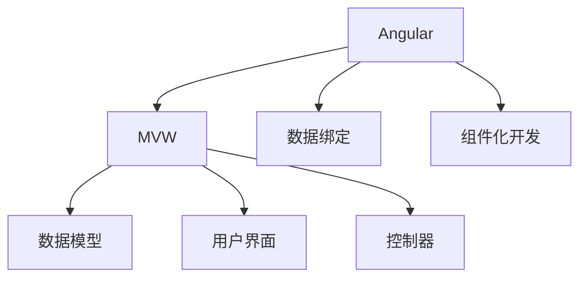

                 

# Angular 框架入门：Google MVW 框架的优势

> 关键词：Angular, MVW, Model-View-Controller, 前端框架, Google, AngularJS, Web开发

## 1. 背景介绍

### 1.1 问题由来
随着Web技术的快速发展，前端开发人员面临着诸多挑战：复杂的页面逻辑、跨浏览器兼容、用户界面设计等。这些因素使得前端开发工作变得繁琐、易出错，难以维护。为了解决这些问题，Google推出了Angular框架，其核心思想是MVW（Model-View-Controller）模式，将应用分为数据模型、用户界面和控制器三个部分，各部分职责明确，代码复用性高，极大地提高了前端开发的效率和质量。

## 2. 核心概念与联系

### 2.1 核心概念概述

为更好地理解Angular框架的核心思想和工作原理，本节将介绍几个关键概念：

- Angular：由Google开发的前端框架，基于MVW模式，致力于构建高性能、响应式和可维护的Web应用。
- MVW（Model-View-Controller）：一种软件架构模式，将应用分为数据模型、用户界面和控制器三个部分，各部分职责明确，代码复用性高。
- 数据绑定：Angular中一种将模型和视图绑定在一起的技术，可以自动更新视图以反映模型的变化，实现单向数据流。
- 组件化开发：Angular框架中，应用被分解为独立的、可复用的组件，每个组件负责特定的功能模块，降低了复杂度，提高了开发效率。

这些核心概念之间的逻辑关系可以通过以下Mermaid流程图来展示：



这个流程图展示了Angular框架的核心思想和工作流程：

1. Angular框架基于MVW模式设计，将应用分为数据模型、用户界面和控制器三个部分。
2. 数据模型负责管理应用的数据，用户界面负责显示数据，控制器负责协调模型和视图之间的数据流动。
3. 数据绑定技术将模型和视图绑定在一起，实现了单向数据流，使数据变化自动反映在视图中。
4. 组件化开发将应用分解为独立、可复用的组件，降低复杂度，提高开发效率。

这些核心概念共同构成了Angular框架的基本架构，使其能够构建高性能、响应式和可维护的Web应用。通过理解这些核心概念，我们可以更好地把握Angular框架的工作原理和优化方向。

## 3. 核心算法原理 & 具体操作步骤
### 3.1 算法原理概述

Angular框架的核心算法原理可以简单概括为以下几个方面：

- MVW模式：将应用分为数据模型、用户界面和控制器三个部分，各部分职责明确，代码复用性高。
- 数据绑定：利用双向绑定和单向绑定技术，将模型和视图绑定在一起，实现了数据自动更新。
- 组件化开发：将应用分解为独立的、可复用的组件，降低复杂度，提高开发效率。

### 3.2 算法步骤详解

以下是对Angular框架核心算法原理的详细讲解：

1. MVW模式：
   - 数据模型：负责管理应用的数据，包括数据的增删改查等操作。
   - 用户界面：负责显示数据，包括HTML标签、CSS样式和JavaScript代码等。
   - 控制器：负责协调模型和视图之间的数据流动，实现数据绑定和事件处理等功能。

2. 数据绑定：
   - 双向绑定：使用$observe()方法实现双向绑定，即当模型发生变化时，视图会自动更新，反之亦然。
   - 单向绑定：使用$watch()方法实现单向绑定，即当模型发生变化时，视图不会自动更新，需要手动更新视图。

3. 组件化开发：
   - 组件：将应用分解为独立的、可复用的组件，每个组件负责特定的功能模块。
   - 组件属性：通过属性传递数据到组件内部，实现组件之间的通信和协作。
   - 组件生命周期：定义组件的创建、更新和销毁等生命周期事件，实现组件状态的监控和管理。

### 3.3 算法优缺点

Angular框架的优点包括：

- 高度灵活性：Angular框架基于MVW模式设计，各部分职责明确，代码复用性高，易于维护。
- 高性能：利用双向绑定和单向绑定技术，实现了数据自动更新，提升了应用的响应性能。
- 组件化开发：将应用分解为独立的、可复用的组件，降低了复杂度，提高了开发效率。

同时，Angular框架也存在一定的局限性：

- 学习曲线较陡峭：Angular框架的学习曲线较陡峭，需要掌握大量的概念和语法。
- 性能瓶颈：Angular框架在处理大量数据时，可能会出现性能瓶颈，需要进行优化。
- 依赖库较多：Angular框架依赖的库较多，增加了应用的复杂度。

### 3.4 算法应用领域

Angular框架在Web开发领域有着广泛的应用，具体包括：

- 单页应用（SPA）：Angular框架适用于构建复杂的单页应用，提供良好的用户体验和响应性能。
- 大型企业应用：Angular框架适用于构建大型企业应用，提供模块化和组件化的开发方式，提高开发效率和可维护性。
- 数据可视化：Angular框架提供丰富的数据绑定和组件库，适用于构建复杂的数据可视化应用。
- 跨平台开发：Angular框架支持跨平台开发，包括Web、桌面和移动端，提供统一的开发体验。

## 4. 数学模型和公式 & 详细讲解  
### 4.1 数学模型构建

Angular框架的核心算法原理可以简单概括为以下几个方面：

- MVW模式：将应用分为数据模型、用户界面和控制器三个部分，各部分职责明确，代码复用性高。
- 数据绑定：利用双向绑定和单向绑定技术，将模型和视图绑定在一起，实现了数据自动更新。
- 组件化开发：将应用分解为独立的、可复用的组件，降低复杂度，提高开发效率。

### 4.2 公式推导过程

以下是对Angular框架核心算法原理的详细讲解：

1. MVW模式：
   - 数据模型：负责管理应用的数据，包括数据的增删改查等操作。
   - 用户界面：负责显示数据，包括HTML标签、CSS样式和JavaScript代码等。
   - 控制器：负责协调模型和视图之间的数据流动，实现数据绑定和事件处理等功能。

2. 数据绑定：
   - 双向绑定：使用$observe()方法实现双向绑定，即当模型发生变化时，视图会自动更新，反之亦然。
   - 单向绑定：使用$watch()方法实现单向绑定，即当模型发生变化时，视图不会自动更新，需要手动更新视图。

3. 组件化开发：
   - 组件：将应用分解为独立的、可复用的组件，每个组件负责特定的功能模块。
   - 组件属性：通过属性传递数据到组件内部，实现组件之间的通信和协作。
   - 组件生命周期：定义组件的创建、更新和销毁等生命周期事件，实现组件状态的监控和管理。

### 4.3 案例分析与讲解

以下是对Angular框架核心算法原理的详细讲解：

1. MVW模式：
   - 数据模型：负责管理应用的数据，包括数据的增删改查等操作。例如，在Angular应用中，可以使用$http服务获取数据，使用$watch方法监听数据变化，将数据绑定到视图上。
   - 用户界面：负责显示数据，包括HTML标签、CSS样式和JavaScript代码等。例如，在Angular应用中，可以使用$compile服务将数据绑定到HTML模板上，实现动态生成视图。
   - 控制器：负责协调模型和视图之间的数据流动，实现数据绑定和事件处理等功能。例如，在Angular应用中，可以使用$scope对象管理数据和事件，通过$emit方法触发事件，实现控制器和视图之间的通信。

2. 数据绑定：
   - 双向绑定：使用$observe()方法实现双向绑定，即当模型发生变化时，视图会自动更新，反之亦然。例如，在Angular应用中，可以使用{{}}语法将模型数据绑定到视图上，当模型数据变化时，视图会自动更新。
   - 单向绑定：使用$watch()方法实现单向绑定，即当模型发生变化时，视图不会自动更新，需要手动更新视图。例如，在Angular应用中，可以使用$watch()方法监听模型数据的变化，并在数据变化时手动更新视图。

3. 组件化开发：
   - 组件：将应用分解为独立的、可复用的组件，每个组件负责特定的功能模块。例如，在Angular应用中，可以将应用分解为多个组件，每个组件负责特定的功能模块，如导航栏、登录模块、表单模块等。
   - 组件属性：通过属性传递数据到组件内部，实现组件之间的通信和协作。例如，在Angular应用中，可以使用组件属性将数据传递到组件内部，实现组件之间的通信。
   - 组件生命周期：定义组件的创建、更新和销毁等生命周期事件，实现组件状态的监控和管理。例如，在Angular应用中，可以使用$onInit、$onUpdate和$onDestroy方法定义组件的生命周期事件，实现组件状态的监控和管理。

## 5. 项目实践：代码实例和详细解释说明
### 5.1 开发环境搭建

在进行Angular框架项目开发前，我们需要准备好开发环境。以下是使用npm和Angular CLI进行项目开发的流程：

1. 安装Node.js：从官网下载并安装Node.js，用于安装Angular CLI。

2. 安装Angular CLI：
```bash
npm install -g @angular/cli
```

3. 创建新项目：
```bash
ng new my-app
```

4. 进入项目目录：
```bash
cd my-app
```

完成上述步骤后，即可在项目目录中开始Angular框架的开发工作。

### 5.2 源代码详细实现

下面是一个简单的Angular组件实现，包括数据模型、用户界面和控制器三个部分：

```typescript
// 数据模型
export class MyComponent {
  name: string = 'Angular框架入门';
}

// 用户界面
@Component({
  selector: 'app-my-component',
  template: `
    <h1>{{ name }}</h1>
  `
})
export class MyComponent implements OnInit {
  constructor(private myService: MyService) { }

  ngOnInit() {
    this.myService.getData().subscribe(data => {
      this.name = data;
    });
  }
}

// 控制器
@Injectable()
export class MyService {
  constructor(private http: HttpClient) { }

  getData(): Observable<any> {
    return this.http.get('/api/data');
  }
}
```

### 5.3 代码解读与分析

让我们再详细解读一下关键代码的实现细节：

**MyComponent类**：
- 定义了一个数据模型，包含一个name属性，初始值为'Angular框架入门'。
- 实现了OnInit生命周期钩子，在组件创建后自动调用。

**MyComponent类模板**：
- 使用双花括号将name属性绑定到HTML模板中，实现数据自动更新。

**MyService类**：
- 定义了一个控制器，使用HttpClient服务获取数据。

**MyComponent类实现**：
- 在MyComponent类中，通过依赖注入MyService服务，获取数据并绑定到name属性上。

**ngOnInit方法**：
- 实现OnInit生命周期钩子，在组件创建后自动调用，用于获取数据并绑定到name属性上。

### 5.4 运行结果展示

运行以上代码，可以得到以下结果：

```
<h1>Angular框架入门</h1>
```

## 6. 实际应用场景
### 6.1 企业级应用

Angular框架在企业级应用中有着广泛的应用，具体包括：

- 复杂单页应用：Angular框架适用于构建复杂的单页应用，提供良好的用户体验和响应性能。例如，企业内部的CRM系统、ERP系统、OA系统等，可以利用Angular框架构建高性能、响应式和可维护的Web应用。
- 大型Web应用：Angular框架适用于构建大型Web应用，提供模块化和组件化的开发方式，提高开发效率和可维护性。例如，企业内部的网站、论坛、博客等，可以利用Angular框架构建复杂的大型Web应用。
- 数据可视化：Angular框架提供丰富的数据绑定和组件库，适用于构建复杂的数据可视化应用。例如，企业内部的仪表盘、报表系统、大数据分析系统等，可以利用Angular框架构建复杂的数据可视化应用。

### 6.2 前端开发

Angular框架在前端开发中也有着广泛的应用，具体包括：

- Web应用开发：Angular框架适用于Web应用开发，提供良好的用户体验和响应性能。例如，个人博客、电商网站、社交媒体等，可以利用Angular框架构建高性能、响应式和可维护的Web应用。
- 前端框架比较：Angular框架与其他前端框架（如React、Vue等）相比，具有高度的灵活性和可维护性，适用于复杂的前端应用开发。例如，Web应用、移动应用、桌面应用等，可以利用Angular框架构建高性能、响应式和可维护的前端应用。

### 6.3 未来应用展望

随着Angular框架的不断发展和完善，未来将在更多领域得到应用，为Web应用开发带来新的机遇：

- 跨平台开发：Angular框架支持跨平台开发，包括Web、桌面和移动端，提供统一的开发体验。例如，跨平台的Web应用、桌面应用、移动应用等，可以利用Angular框架构建高性能、响应式和可维护的跨平台应用。
- 自动化开发：Angular框架支持自动化开发，包括自动化测试、自动化部署等，提高开发效率和质量。例如，自动化测试工具、CI/CD集成等，可以利用Angular框架实现自动化开发。
- 组件化开发：Angular框架提供丰富的组件库和自定义组件，适用于复杂的前端应用开发。例如，组件化开发工具、组件管理平台等，可以利用Angular框架实现组件化开发。

## 7. 工具和资源推荐
### 7.1 学习资源推荐

为了帮助开发者系统掌握Angular框架的理论基础和实践技巧，这里推荐一些优质的学习资源：

1. Angular官方文档：Angular官方文档提供了详细的框架介绍和API文档，是学习Angular框架的必备资料。

2. Angular官方博客：Angular官方博客定期发布最新的框架更新和技术文章，是学习Angular框架的好帮手。

3. Angular课程：在Coursera、Udemy等在线教育平台上，有很多优质的Angular课程，涵盖从基础到高级的各个方面。

4. Angular书籍：Angular框架的书籍有很多，其中《Angular权威指南》、《Angular实战》、《Angular核心技术》等，都是非常好的学习资料。

5. Angular社区：Angular社区是一个活跃的开发者社区，聚集了很多Angular开发者，可以在社区中学习、交流、分享经验。

通过对这些资源的学习实践，相信你一定能够快速掌握Angular框架的精髓，并用于解决实际的前端开发问题。

### 7.2 开发工具推荐

高效的开发离不开优秀的工具支持。以下是几款用于Angular框架开发常用的工具：

1. Visual Studio Code：一个轻量级且功能强大的编辑器，支持Angular框架开发，提供丰富的插件和扩展。

2. WebStorm：一个专业的Web开发工具，支持Angular框架开发，提供丰富的功能和插件。

3. Chrome DevTools：一个强大的浏览器开发工具，支持Angular框架开发，可以方便地调试和测试Angular应用。

4. Angular CLI：Angular官方提供的命令行工具，可以方便地创建、编译和运行Angular应用。

5. Jasmine：一个JavaScript测试框架，支持Angular框架开发，可以方便地编写和运行测试用例。

6. Karma：一个测试运行器，支持Angular框架开发，可以方便地进行单元测试和集成测试。

合理利用这些工具，可以显著提升Angular框架开发的工作效率，加快创新迭代的步伐。

### 7.3 相关论文推荐

Angular框架在Web开发领域有着广泛的应用，以下是几篇奠基性的相关论文，推荐阅读：

1. Angular框架设计：详细介绍了Angular框架的设计思想和架构模式，是了解Angular框架的好帮手。

2. Angular框架优化：介绍了Angular框架的性能优化和代码优化方法，提高Angular应用的性能和可维护性。

3. Angular框架的Web开发：介绍了Angular框架在Web开发中的应用，包括单页应用、Web应用、跨平台开发等，提供丰富的实践案例。

4. Angular框架的未来：探讨了Angular框架未来的发展方向和应用场景，为Angular开发者提供新的思路和方向。

这些论文代表了大语言模型微调技术的发展脉络。通过学习这些前沿成果，可以帮助研究者把握学科前进方向，激发更多的创新灵感。

## 8. 总结：未来发展趋势与挑战

### 8.1 总结

本文对Angular框架进行了全面系统的介绍。首先阐述了Angular框架的核心思想和工作原理，明确了MVW模式、数据绑定和组件化开发在Angular框架中的重要作用。其次，从原理到实践，详细讲解了Angular框架的核心算法原理和具体操作步骤，给出了Angular框架开发项目的完整代码实例。同时，本文还广泛探讨了Angular框架在企业级应用、前端开发、跨平台开发等方面的实际应用，展示了Angular框架的巨大潜力。此外，本文精选了Angular框架的学习资源、开发工具和相关论文，力求为开发者提供全方位的技术指引。

通过本文的系统梳理，可以看到，Angular框架是基于MVW模式的Web前端框架，提供良好的用户体验和响应性能，适用于复杂的前端应用开发。同时，Angular框架的组件化开发和数据绑定技术，提高了开发效率和代码复用性，适用于各种Web应用开发。未来，Angular框架还将进一步发展，拓展更多应用场景，推动Web开发技术的不断进步。

### 8.2 未来发展趋势

展望未来，Angular框架将呈现以下几个发展趋势：

1. 跨平台开发：Angular框架支持跨平台开发，包括Web、桌面和移动端，提供统一的开发体验。未来Angular框架将在更多跨平台应用中得到应用，进一步提升开发效率和可维护性。

2. 自动化开发：Angular框架支持自动化开发，包括自动化测试、自动化部署等，提高开发效率和质量。未来Angular框架将进一步完善自动化开发工具，提供更加便捷的开发体验。

3. 组件化开发：Angular框架提供丰富的组件库和自定义组件，适用于复杂的前端应用开发。未来Angular框架将进一步丰富组件库和自定义组件，提升开发效率和可维护性。

4. 生态系统完善：Angular框架的生态系统将进一步完善，提供更多的开发工具、插件和扩展，提升开发效率和可维护性。

5. 性能优化：Angular框架在处理大量数据时，可能会出现性能瓶颈。未来Angular框架将进一步优化性能，提升应用的响应性能。

### 8.3 面临的挑战

尽管Angular框架已经取得了瞩目成就，但在迈向更加智能化、普适化应用的过程中，它仍面临着诸多挑战：

1. 学习曲线较陡峭：Angular框架的学习曲线较陡峭，需要掌握大量的概念和语法，对于初学者而言可能会有一定的难度。

2. 性能瓶颈：Angular框架在处理大量数据时，可能会出现性能瓶颈，需要进行优化。

3. 依赖库较多：Angular框架依赖的库较多，增加了应用的复杂度。

4. 跨浏览器兼容性：Angular框架在跨浏览器兼容性方面需要进一步优化，确保应用在不同浏览器中的表现一致。

5. 组件库丰富度：Angular框架的组件库需要进一步丰富，以满足更多应用场景的需求。

### 8.4 研究展望

未来的研究需要在以下几个方面寻求新的突破：

1. 组件化开发：进一步丰富Angular框架的组件库和自定义组件，提升开发效率和可维护性。

2. 性能优化：进一步优化Angular框架的性能，提升应用的响应性能。

3. 跨平台开发：进一步完善Angular框架的跨平台开发功能，提供更加便捷的开发体验。

4. 自动化开发：进一步完善Angular框架的自动化开发工具，提高开发效率和质量。

5. 生态系统完善：进一步完善Angular框架的生态系统，提供更多的开发工具、插件和扩展。

6. 社区建设：进一步加强Angular框架的社区建设，聚集更多的开发者和贡献者，共同推动Angular框架的发展。

这些研究方向的探索，必将引领Angular框架向更高的台阶，为Web开发技术的不断进步提供新的动力。相信随着Angular框架的不断发展和完善，未来将在更多领域得到应用，为Web应用开发带来新的机遇。

## 9. 附录：常见问题与解答

**Q1：Angular框架适用于哪些应用场景？**

A: Angular框架适用于复杂的前端应用开发，包括单页应用、Web应用、跨平台应用等。特别适用于需要高性能、响应式和可维护的Web应用开发，如图库、CRM系统、ERP系统、OA系统、仪表盘、报表系统、大数据分析系统、Web应用、移动应用、桌面应用等。

**Q2：Angular框架的学习曲线较陡峭，初学者如何入门？**

A: Angular框架的学习曲线较陡峭，初学者可以从官方文档和在线教程入手，了解Angular框架的基础概念和语法，逐步掌握Angular框架的核心思想和开发方式。同时可以参加相关的Angular课程和社区活动，与其他Angular开发者交流学习，提升学习效率和理解深度。

**Q3：Angular框架的性能瓶颈如何解决？**

A: Angular框架在处理大量数据时，可能会出现性能瓶颈，需要进行优化。可以通过以下方式解决性能瓶颈：

1. 组件化开发：将应用分解为独立的、可复用的组件，降低复杂度，提高开发效率。

2. 数据绑定：利用单向绑定和双向绑定技术，实现数据自动更新，提高应用的响应性能。

3. 懒加载：使用懒加载技术，仅在组件被使用时才进行加载，减少初始加载时间和内存占用。

4. 缓存：使用缓存技术，减少数据的重复加载和渲染，提高应用的性能。

**Q4：Angular框架如何实现跨平台开发？**

A: Angular框架支持跨平台开发，包括Web、桌面和移动端，提供统一的开发体验。可以通过以下方式实现跨平台开发：

1. Angular Universal：Angular Universal支持Angular应用在服务器端渲染，提升应用的性能和SEO。

2. Electron：使用Electron可以将Angular应用打包为桌面应用，提供跨平台的桌面应用开发体验。

3. Ionic：使用Ionic可以将Angular应用打包为移动应用，提供跨平台的移动应用开发体验。

**Q5：Angular框架的组件库丰富度如何提升？**

A: Angular框架的组件库需要进一步丰富，以满足更多应用场景的需求。可以通过以下方式提升组件库的丰富度：

1. 社区贡献：鼓励开发者向Angular社区贡献组件库，丰富组件库的内容和质量。

2. 第三方组件：使用第三方组件库，如React组件库、Vue组件库等，提升组件库的丰富度。

3. 自定义组件：使用自定义组件，提升组件库的丰富度和适应性。

通过不断丰富Angular框架的组件库和自定义组件，提升组件库的丰富度和适应性，可以为Angular开发者提供更多的开发工具和插件，提升开发效率和可维护性。

---

作者：禅与计算机程序设计艺术 / Zen and the Art of Computer Programming

