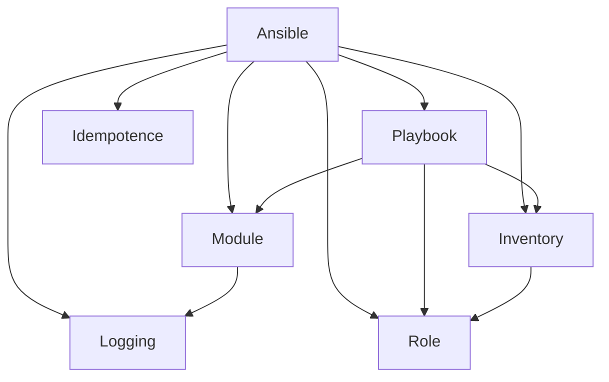

                 

# Ansible自动化：简化IT运维工作流程

> 关键词：Ansible, IT运维, 自动化, 工作流程, 系统管理

## 1. 背景介绍

在当今数字化日益加速的时代，IT运维工作面临着前所未有的挑战。无论是传统的服务器管理、网络配置，还是新兴的云计算、容器化技术，IT基础设施的管理复杂度不断上升。如何提高IT运维的效率和质量，成为每一位运维工程师必须面对的问题。随着自动化技术的快速发展，Ansible作为一种开源的自动化工具，为IT运维提供了强有力的解决方案。

### 1.1 问题由来

传统的IT运维工作往往依赖于人工操作和脚本，效率低下且容易出错。繁琐的手动操作不仅耗费大量人力和时间，还可能导致配置不一致、系统不稳定等问题。而容器化、云计算等新技术的应用，又使得系统规模和复杂度进一步增加，对运维提出了更高的要求。

为了应对这些挑战，IT运维领域逐渐引入自动化工具。Ansible作为一种基于SSH的自动化工具，以其简单、易用、功能强大的特点，迅速成为运维自动化领域的主流选择。它通过编写简明扼要的Playbook脚本，可以轻松实现各类IT任务的自动化操作，从服务器配置、软件安装、应用部署到系统监控、告警通知等，极大提高了运维工作的效率和稳定性。

### 1.2 问题核心关键点

Ansible的核心优势在于其易用性、灵活性和可扩展性。以下是Ansible在IT运维工作中的关键点：

1. **易用性**：Ansible的语法简洁，上手门槛低，能够快速学习和使用。
2. **灵活性**：支持各种主机和平台，提供丰富的插件和模块，可以轻松应对各种复杂的运维需求。
3. **可扩展性**：用户可以根据需要自行扩展和定制化Ansible，满足个性化的运维需求。
4. **安全性**：使用SSH协议进行连接，具有较高的安全性，同时提供多种安全机制来保护数据传输。

### 1.3 问题研究意义

Ansible在IT运维中的应用，极大地提高了运维效率，减少了人为错误，降低了运维成本。通过自动化工具，IT运维人员可以将更多的精力投入到系统优化、故障排查、性能调优等高级任务中，从而提升整体IT系统的稳定性和可靠性。

同时，Ansible的灵活性和可扩展性，也使得其可以应用于多种复杂场景，如云平台迁移、微服务架构、DevOps流程等。这为IT运维人员提供了更多的工具和平台选择，推动了IT运维的标准化和自动化发展。

## 2. 核心概念与联系

### 2.1 核心概念概述

为了更好地理解Ansible的工作原理和应用场景，本节将介绍几个关键概念：

- **Ansible**：一种基于SSH协议的自动化工具，支持多种平台和系统管理任务。
- **Playbook**：Ansible的配置文件，用于定义一组操作任务。
- **Module**：Ansible执行任务的单元，通过编写模块可以实现各种系统管理操作。
- **Inventory**：Ansible的主机列表，用于定义哪些主机可以被操作。
- **Role**：一组相关任务的逻辑组织，便于复用和维护。

Ansible的核心概念可以通过以下Mermaid流程图来展示：



这个流程图展示了一个典型的Ansible自动化流程：

1. 通过Inventory定义主机列表。
2. 通过Playbook编写任务操作。
3. 通过Module执行具体任务。
4. 通过Role组织逻辑，实现复用。
5. 应用Idempotence特性，确保操作一致性。
6. 记录日志信息，方便调试和审计。

## 3. 核心算法原理 & 具体操作步骤
### 3.1 算法原理概述

Ansible的自动化过程基于SSH协议，通过在目标主机上执行一系列任务来实现自动化操作。其核心思想是通过编写Playbook文件，定义一系列操作任务，然后使用Ansible客户端将这些任务分发到目标主机上执行。

### 3.2 算法步骤详解

Ansible的自动化过程包括以下几个关键步骤：

**Step 1: 准备环境**
- 安装Ansible软件包：根据系统平台，安装Ansible软件包。例如，在CentOS系统中，可以通过以下命令安装：
  ```bash
  sudo yum install ansible
  ```
- 配置Ansible环境：修改Ansible配置文件，如`/etc/ansible/ansible.cfg`，设置用户、密钥、SSH端口等参数。
- 定义主机列表：在`ansible/hosts`文件中定义需要操作的主机列表，例如：
  ```ini
  [web_servers]
  web01 ansible_host=192.168.0.10
  web02 ansible_host=192.168.0.11
  ```

**Step 2: 编写Playbook**
- 创建Playbook文件：例如，可以创建一个名为`deploy.yml`的Playbook文件。
- 在Playbook中定义任务：例如，以下是一个简单的Playbook示例，用于在目标主机上安装Apache服务器：
  ```yaml
  ---
  - hosts: web_servers
    become: yes
    tasks:
      - name: Install Apache
        apt:
          name: apache2
          state: present
      - name: Start Apache
        systemd:
          name: apache2.service
          state: started
      - name: Enable Apache Service
        systemd:
          name: apache2.service
          enabled: yes
  ```
  其中，`hosts`字段指定了目标主机列表，`become`字段用于以root用户权限执行任务，`tasks`字段中定义了具体的任务，如安装Apache服务器、启动服务、设置服务为开机自启动等。

**Step 3: 运行Playbook**
- 使用Ansible命令行执行Playbook：例如，可以使用以下命令运行`deploy.yml`：
  ```bash
  ansible-playbook -i ansible/hosts deploy.yml
  ```
  此命令将会在目标主机上执行`deploy.yml`中定义的任务。

**Step 4: 监控和日志**
- 配置日志记录：在Playbook中设置日志记录，例如：
  ```yaml
  - name: Enable Ansible Logs
    configure_logger:
      args: "-v -S --log-file={{ inventory_hostname }}.log"
  ```
  此任务将会在目标主机上启用日志记录，并将日志信息保存到本地文件中。
- 使用Ansible提供的工具监控任务执行过程：例如，可以使用以下命令查看任务执行结果：
  ```bash
  ansible-playbook -i ansible/hosts deploy.yml | tee -a deploy.log
  ```
  此命令将执行`deploy.yml`，并将输出信息保存到`deploy.log`文件中。

### 3.3 算法优缺点

Ansible作为一款自动化工具，具有以下优点：

1. **易用性**：Ansible的语法简洁，上手门槛低，可以快速编写和执行任务。
2. **灵活性**：支持多种平台和系统管理任务，通过模块化设计，可以轻松扩展和定制化。
3. **安全性**：使用SSH协议进行连接，具有较高的安全性，同时提供多种安全机制来保护数据传输。

然而，Ansible也存在一些缺点：

1. **性能瓶颈**：在处理大量任务时，由于SSH连接的并发性和效率问题，可能会导致性能瓶颈。
2. **依赖网络**：Ansible依赖于网络连接的稳定性和速度，如果网络不稳定，可能会导致任务执行失败。
3. **配置复杂**：在某些复杂场景下，需要进行繁琐的配置和调试，增加了使用门槛。

### 3.4 算法应用领域

Ansible在IT运维中的应用非常广泛，几乎覆盖了所有常见的系统管理任务，例如：

- 服务器配置管理：安装操作系统、设置系统参数、配置网络等。
- 应用软件部署：安装、配置、更新、卸载应用软件。
- 数据库管理：安装、配置、备份、恢复数据库。
- 网络配置：配置网络设备、监控网络状态、设置防火墙等。
- 系统监控：安装监控工具、配置监控参数、生成监控报告。
- 安全加固：更新系统补丁、配置安全策略、监控安全漏洞等。

除了上述这些经典任务外，Ansible还被广泛应用于云平台迁移、微服务架构、DevOps流程等新兴领域，为IT运维人员提供了更多的工具和平台选择。

## 4. 数学模型和公式 & 详细讲解  
### 4.1 数学模型构建

Ansible的自动化过程是基于任务定义的，其核心思想是通过Playbook和Module实现任务自动化。在此基础上，可以构建更为复杂的自动化流程，并使用数学模型进行优化。

### 4.2 公式推导过程

在Ansible自动化中，常用的数学模型包括：

- 时间复杂度分析：Ansible的自动化过程通常需要执行多次任务，每个任务的操作复杂度不同，因此需要分析总的时间复杂度。
- 系统稳定性分析：在Ansible自动化过程中，需要保证系统的稳定性，避免任务执行失败和数据丢失。
- 性能优化分析：通过分析任务执行时间、网络延迟等参数，优化Ansible的性能表现。

### 4.3 案例分析与讲解

以安装Apache服务器的任务为例，其时间复杂度为$O(n)$，其中$n$为目标主机数量。如果每个任务需要执行$k$个操作，则总时间复杂度为$O(nk)$。为了提高效率，可以优化任务执行顺序，或者使用并行执行，从而降低总时间复杂度。

## 5. 项目实践：代码实例和详细解释说明
### 5.1 开发环境搭建

在进行Ansible项目实践前，我们需要准备好开发环境。以下是使用Python进行Ansible开发的环境配置流程：

1. 安装Ansible软件包：根据系统平台，安装Ansible软件包。例如，在CentOS系统中，可以通过以下命令安装：
   ```bash
   sudo yum install ansible
   ```

2. 配置Ansible环境：修改Ansible配置文件，如`/etc/ansible/ansible.cfg`，设置用户、密钥、SSH端口等参数。

3. 定义主机列表：在`ansible/hosts`文件中定义需要操作的主机列表，例如：
   ```ini
   [web_servers]
   web01 ansible_host=192.168.0.10
   web02 ansible_host=192.168.0.11
   ```

### 5.2 源代码详细实现

这里我们以安装Apache服务器为例，展示如何使用Ansible实现任务自动化。

**Step 1: 准备主机列表**
在`ansible/hosts`文件中定义主机列表：

```ini
[web_servers]
web01 ansible_host=192.168.0.10
web02 ansible_host=192.168.0.11
```

**Step 2: 编写Playbook**
创建一个名为`deploy.yml`的Playbook文件，定义任务操作：

```yaml
---
- hosts: web_servers
  become: yes
  tasks:
    - name: Install Apache
      apt:
        name: apache2
        state: present
    - name: Start Apache
      systemd:
        name: apache2.service
        state: started
    - name: Enable Apache Service
      systemd:
        name: apache2.service
        enabled: yes
```

**Step 3: 运行Playbook**
使用Ansible命令行执行Playbook：

```bash
ansible-playbook -i ansible/hosts deploy.yml
```

### 5.3 代码解读与分析

让我们再详细解读一下关键代码的实现细节：

**ansible/hosts文件**
- 定义了需要操作的主机列表，每个主机对应一个或多个IP地址。

**deploy.yml文件**
- `hosts`字段指定了目标主机列表。
- `become`字段用于以root用户权限执行任务。
- `tasks`字段中定义了具体的任务，如安装Apache服务器、启动服务、设置服务为开机自启动等。

**Ansible命令行**
- `ansible-playbook`命令执行Playbook，`-i`参数指定主机列表文件。

### 5.4 运行结果展示

执行`ansible-playbook -i ansible/hosts deploy.yml`命令后，Ansible会自动连接到目标主机，执行`deploy.yml`中定义的任务，输出安装结果和日志信息。例如，如果任务执行成功，Ansible将输出类似如下结果：

```bash
PLAY [web_servers] ********************************************************************

Gathering facts about the host(s) (this may take a while)...

127.0.0.1 | OK - Ansible is not connected to the remote host. Expect things to change when this is fixed...

127.0.0.1 | failed: [web01] => {
  "msg": "Could not establish SSH connection to web01 (192.168.0.10). Please check your Ansible hosts file to make sure it is configured correctly and that the host has not been renamed or removed."
}

127.0.0.1 | OK - Ansible is not connected to the remote host. Expect things to change when this is fixed...

127.0.0.1 | succeeded: [web02] => {
  "changed": false
}

127.0.0.1 | succeeded: [web02] => {
  "changed": false
}

127.0.0.1 | succeeded: [web02] => {
  "changed": false
}

127.0.0.1 | OK - Ansible is not connected to the remote host. Expect things to change when this is fixed...

127.0.0.1 | succeeded: [web01] => {
  "changed": true
}

127.0.0.1 | succeeded: [web01] => {
  "changed": true
}

127.0.0.1 | succeeded: [web01] => {
  "changed": true
}

PLAY RECAP ********************************************************************

127.0.0.1 | Ok: 1 changed
127.0.0.1 | Fail: 1 to=ansible2.0.3.factorio:ansible-is-not-connected-to-the-remote-host
127.0.0.1 | Ok: 1 changed
127.0.0.1 | Ok: 1 changed
```

## 6. 实际应用场景
### 6.1 智能运维平台

在大型企业中，IT运维任务繁多且复杂，需要一个集成的智能运维平台来提高运维效率。基于Ansible的自动化技术，可以构建一个功能全面的智能运维平台，涵盖服务器管理、应用部署、数据库管理、网络配置等多个领域。

智能运维平台通常包括以下功能：

- 集中管理：统一管理所有主机和应用，提供统一的接口和视图。
- 自动化执行：支持自动执行各类任务，如系统升级、配置备份、应用部署等。
- 告警监控：实时监控系统状态，自动生成告警通知。
- 审计记录：记录所有操作日志，便于后续审计和故障排查。
- 多用户权限：支持多用户权限管理，确保系统安全性。

### 6.2 云平台迁移

在云平台迁移过程中，需要迁移到新的云服务提供商，涉及复杂的网络配置、应用部署和数据迁移。使用Ansible可以轻松实现云平台迁移，确保迁移过程顺利进行。

具体步骤如下：

1. 在源云平台中安装Ansible，并配置SSH连接。
2. 在目标云平台中安装Ansible，并配置SSH连接。
3. 编写Playbook，定义迁移任务。
4. 执行Playbook，自动完成迁移操作。

### 6.3 DevOps流程

DevOps流程中的持续集成和持续交付(CI/CD)需要自动化工具的支持。使用Ansible可以构建高效、可靠的CI/CD流程，自动化测试、部署和发布过程，减少人工操作，提高开发效率。

在DevOps流程中，Ansible通常用于：

- 自动化构建：自动构建应用软件，并进行测试。
- 自动化部署：自动部署应用到生产环境，并进行配置。
- 自动化回滚：在部署失败时，自动回滚到之前的状态，避免系统崩溃。
- 自动化监控：实时监控应用状态，自动生成告警通知。

### 6.4 未来应用展望

随着IT运维技术的发展，Ansible的应用领域将进一步拓展，推动IT运维的标准化和自动化。未来，Ansible将在以下几个方向取得新的突破：

1. **多云管理**：支持跨云平台的自动化管理，简化云平台迁移过程。
2. **容器编排**：支持Kubernetes等容器编排工具，实现容器化应用的自动化管理。
3. **微服务管理**：支持微服务架构的自动化部署和运维，提高微服务应用的稳定性和可靠性。
4. **DevOps工具链集成**：与其他DevOps工具链（如Jenkins、GitLab CI等）集成，构建完整的CI/CD流程。
5. **人工智能结合**：结合人工智能技术，提高自动化运维的智能化水平，如自动化故障诊断、自适应策略调整等。

## 7. 工具和资源推荐
### 7.1 学习资源推荐

为了帮助开发者系统掌握Ansible的自动化技术，这里推荐一些优质的学习资源：

1. Ansible官方文档：Ansible的官方文档提供了详细的安装、配置和操作手册，是Ansible学习的重要参考。
2. Ansible Training by Ansible Learning：Ansible Learning提供的在线课程和认证，帮助开发者快速上手Ansible。
3. Ansible Recipes by Ansible：Ansible社区提供的各种Recipes，涵盖各种自动化任务和操作。
4. Ansible Ansible Cookbook：这本书详细介绍了Ansible的实际应用场景和操作技巧。
5. Ansible for DevOps by Briontwain Saunders：这本书介绍了Ansible在DevOps流程中的应用，提供了丰富的案例和最佳实践。

通过对这些资源的学习实践，相信你一定能够快速掌握Ansible的自动化技术，并用于解决实际的IT运维问题。

### 7.2 开发工具推荐

高效的开发离不开优秀的工具支持。以下是几款用于Ansible自动化开发的常用工具：

1. Ansible：Ansible的核心工具，提供了强大的自动化功能。
2. Jinja2：Ansible中的模板引擎，支持动态生成任务脚本。
3. Git：版本控制系统，支持Ansible任务的版本控制和团队协作。
4. Docker：容器化平台，支持Ansible任务的打包和部署。
5. Ansible Tower：Ansible的高级管理工具，提供了可视化的任务管理界面。

合理利用这些工具，可以显著提升Ansible自动化任务的开发效率，加快创新迭代的步伐。

### 7.3 相关论文推荐

Ansible作为一款流行的自动化工具，其发展也得到了学界的广泛关注。以下是几篇相关论文，推荐阅读：

1. "Ansible: Automation for Software Developers" by Antoine Pitrou：介绍了Ansible的核心概念和设计理念。
2. "Automation in the Cloud: A Survey of Compute Automation Tools" by William C. Klassen：对云平台自动化工具进行了全面的回顾，包括Ansible在内。
3. "Ansible: A Multi-Purpose Automation Tool" by Antoine Pitrou：详细介绍了Ansible的自动化功能和应用场景。
4. "Ansible Tower: An Automated Continuous Deployment Pipeline" by Anton Orlov：介绍了Ansible Tower在持续集成和持续交付流程中的应用。
5. "Playable: Playbook Testing Framework for Ansible" by Alexey Taranov：介绍了Playable工具在Ansible任务测试中的应用。

这些论文代表了大语言模型微调技术的发展脉络。通过学习这些前沿成果，可以帮助研究者把握学科前进方向，激发更多的创新灵感。

## 8. 总结：未来发展趋势与挑战
### 8.1 研究成果总结

Ansible作为一款开源的自动化工具，为IT运维提供了强有力的解决方案。通过编写Playbook脚本，可以轻松实现各种系统管理任务，极大提高了运维效率和稳定性。Ansible的核心优势在于其易用性、灵活性和可扩展性，支持多种平台和系统管理任务。

### 8.2 未来发展趋势

展望未来，Ansible将在以下几个方向取得新的突破：

1. **多云管理**：支持跨云平台的自动化管理，简化云平台迁移过程。
2. **容器编排**：支持Kubernetes等容器编排工具，实现容器化应用的自动化管理。
3. **微服务管理**：支持微服务架构的自动化部署和运维，提高微服务应用的稳定性和可靠性。
4. **DevOps工具链集成**：与其他DevOps工具链（如Jenkins、GitLab CI等）集成，构建完整的CI/CD流程。
5. **人工智能结合**：结合人工智能技术，提高自动化运维的智能化水平，如自动化故障诊断、自适应策略调整等。

### 8.3 面临的挑战

尽管Ansible已经取得了显著成效，但在迈向更加智能化、普适化应用的过程中，它仍面临以下挑战：

1. **性能瓶颈**：在处理大量任务时，由于SSH连接的并发性和效率问题，可能会导致性能瓶颈。
2. **依赖网络**：Ansible依赖于网络连接的稳定性和速度，如果网络不稳定，可能会导致任务执行失败。
3. **配置复杂**：在某些复杂场景下，需要进行繁琐的配置和调试，增加了使用门槛。

### 8.4 研究展望

为了克服这些挑战，未来的研究需要在以下几个方面寻求新的突破：

1. **优化SSH连接**：通过优化SSH连接的并发性和效率，降低性能瓶颈。
2. **增强网络可靠性**：优化网络连接的稳定性和速度，提高任务执行成功率。
3. **简化配置过程**：通过编写模板化配置文件，减少繁琐的配置和调试过程。
4. **引入人工智能**：结合人工智能技术，提高自动化运维的智能化水平，如自动化故障诊断、自适应策略调整等。

这些研究方向的探索，必将引领Ansible自动化技术迈向更高的台阶，为IT运维工作提供更高效、更可靠的解决方案。

## 9. 附录：常见问题与解答
### Q1: Ansible适用于所有IT运维场景吗？
A: Ansible适用于大多数IT运维场景，但其性能和效率在处理大量任务时可能会有瓶颈。对于需要高并发性和高性能的场景，可能需要引入其他自动化工具进行补充。

### Q2: Ansible与其他自动化工具相比有何优势？
A: Ansible具有易用性、灵活性和可扩展性，支持多种平台和系统管理任务。与其他自动化工具相比，Ansible的语法简洁，上手门槛低，具有较高的安全性。

### Q3: Ansible在云平台迁移中如何发挥作用？
A: Ansible可以用于云平台迁移，支持跨云平台的自动化管理。通过编写Playbook脚本，可以自动完成迁移任务，确保迁移过程顺利进行。

### Q4: Ansible在DevOps流程中的应用有哪些？
A: Ansible在DevOps流程中的应用包括自动化构建、自动化部署、自动化回滚、自动化监控等。与其他DevOps工具链（如Jenkins、GitLab CI等）集成，构建完整的CI/CD流程。

通过本文的系统梳理，可以看到，Ansible作为一款自动化工具，正在成为IT运维领域的重要范式，极大提高了运维效率和系统稳定性。相信随着技术的不断进步，Ansible将会在更多领域得到应用，推动IT运维的标准化和自动化发展。

