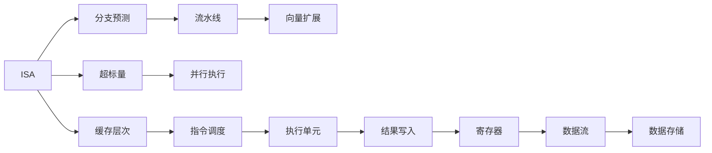

                 

# CPU的指令级并行技术发展

> 关键词：指令级并行, CPU,超标量架构,流水线,分支预测,向量扩展

## 1. 背景介绍

随着计算机科学的迅速发展，CPU的指令级并行技术经历了数次重要的演进，显著提高了计算机的处理能力。从最初的单指令单数据(Instruction Single Data, ISD)到现代的多核心、向量扩展和高并行度架构，这一过程不断推动着计算机系统的性能提升和应用普及。本文将从背景、概念和基本原理出发，详细介绍CPU指令级并行技术的发展历程及其在现代计算中的重要地位。

## 2. 核心概念与联系

### 2.1 核心概念概述

要理解CPU指令级并行技术的发展，首先需要理解几个核心概念：

1. **指令级并行(Instruction-Level Parallelism, ILP)**：
   指令级并行是指在CPU中同时执行多个指令，以提高计算效率的技术。这种并行性可以通过时间重叠和空间重叠来实现，包括时间重叠（例如，超标量指令流和流水线）和空间重叠（例如，向量扩展和缓存层次结构）。

2. **超标量(Superscalar)指令集架构**：
   超标量架构允许CPU在单个时钟周期内执行多条指令。它是实现指令级并行的关键技术之一。

3. **流水线(Pipeline)**：
   流水线是一种硬件实现的指令级并行技术，通过将指令分解为多个阶段并行执行，从而提高指令执行效率。

4. **分支预测(Branch Prediction)**：
   分支预测技术用于减少指令流水线中的依赖，通过预测分支跳转的指令来优化指令执行顺序。

5. **向量扩展(Vectorization)**：
   向量扩展是指在指令集架构中支持对向量数据的并行操作，显著提高对大规模数据集的处理能力。

### 2.2 核心概念原理和架构的 Mermaid 流程图

以下是一个简化的Mermaid流程图，展示了指令级并行技术的基本架构和流程：



此图展示了指令级并行技术的基本组成：

1. **ISA (指令集架构)**：作为指令执行的基本规则。
2. **分支预测**：预测分支指令，减少流水线中的依赖。
3. **流水线**：将指令分成多个阶段并行执行。
4. **向量扩展**：支持对向量数据的并行操作。
5. **超标量**：允许同时执行多条指令。
6. **并行执行**：多个执行单元同时工作，提高效率。
7. **缓存层次**：管理指令和数据访问，优化访问速度。
8. **指令调度**：调度指令执行顺序，优化并行性能。
9. **执行单元**：执行具体指令，产生结果。
10. **结果写入**：将结果写入寄存器。
11. **数据存储**：存储指令和数据，支持快速访问。

这些组件相互配合，共同构成CPU的指令级并行体系。

## 3. 核心算法原理 & 具体操作步骤

### 3.1 算法原理概述

指令级并行技术通过硬件和软件相结合的方式实现，硬件提供流水线、超标量和向量扩展等并行结构，软件则通过编译器优化和运行时调度等手段，进一步提高并行性。

#### 3.1.1 超标量架构

超标量架构允许CPU同时执行多条指令。例如，IBM 360/91是第一个广泛使用的超标量架构，它在每个时钟周期内可以执行两条指令。现代CPU如Intel Core和AMD Ryzen都采用了超标量架构，以便在每个时钟周期内执行多个指令。

#### 3.1.2 流水线

流水线技术将指令执行过程分解为多个阶段，每个阶段独立执行，从而实现指令并行。典型的流水线包括取指、译码、执行、访存和写回五个阶段。例如，Pentium CPU将每个时钟周期内的一个完整指令分解为四个阶段执行。

#### 3.1.3 分支预测

分支预测技术通过预测分支跳转，减少指令流水线的依赖。预测正确的分支跳转可以减少指令流水线中的气泡，从而提高效率。现代CPU如Intel Core i7和AMD Ryzen都采用了分支预测技术。

#### 3.1.4 向量扩展

向量扩展是指支持对向量数据的并行操作。例如，AVX指令集可以同时对8个浮点数进行操作，显著提高了浮点运算的效率。现代CPU如Intel Haswell和AMD Bulldozer都支持向量扩展指令集。

### 3.2 算法步骤详解

指令级并行技术的实现涉及多个步骤，包括指令调度、流水线执行和并行调度等。

#### 3.2.1 指令调度

指令调度是指将多条指令按照一定规则分配到不同的执行单元上执行。调度策略包括静态和动态调度。静态调度在编译时完成，而动态调度在运行时进行。现代编译器通常采用动态调度策略，以实现更高的并行性。

#### 3.2.2 流水线执行

流水线执行是指将指令分解为多个阶段并行执行。现代CPU通常包含多个流水线，以便同时执行多条指令。流水线执行效率很大程度上取决于流水线的长度和数据相关性。

#### 3.2.3 并行调度

并行调度是指将多条指令分配到不同的执行单元上执行。现代CPU通常包含多个执行单元，以便同时执行多条指令。例如，Intel Core i7拥有八个执行单元，每个执行单元可以同时执行一条指令。

### 3.3 算法优缺点

#### 3.3.1 优点

指令级并行技术的优点包括：

1. **提高计算效率**：通过并行执行多条指令，显著提高计算效率。
2. **优化数据访问**：通过流水线和缓存层次结构优化数据访问速度，减少访存延迟。
3. **降低功耗**：并行执行可以降低单个指令的执行时间，从而降低功耗。

#### 3.3.2 缺点

指令级并行技术的缺点包括：

1. **设计复杂性高**：实现并行调度和流水线需要复杂的硬件和软件设计。
2. **依赖编译器**：需要依赖高效的编译器实现指令优化和调度。
3. **硬件成本高**：多核心、向量扩展和高并行度架构需要高成本的硬件支持。

### 3.4 算法应用领域

指令级并行技术广泛应用于高性能计算、游戏、图像处理、音频处理和科学计算等领域。例如，现代游戏CPU通常采用多核心和向量扩展架构，以支持游戏引擎的高性能要求。高性能计算领域则采用高并行度的架构，以处理大规模科学计算任务。

## 4. 数学模型和公式 & 详细讲解 & 举例说明

### 4.1 数学模型构建

指令级并行技术的数学模型可以基于以下几个基本假设：

1. **指令流假设**：假定指令流是平稳的，即在给定的时间内，指令执行的频率和类型是稳定的。
2. **流水线假设**：假定指令执行过程中可以分解为多个阶段并行执行。
3. **分支预测假设**：假定分支预测是准确的，即预测正确的分支跳转可以减少指令流水线中的依赖。

#### 4.1.1 超标量架构的数学模型

超标量架构的并行度为 $P$，即每个时钟周期内可以执行 $P$ 条指令。假定一个程序包含 $N$ 条指令，每个指令需要 $T$ 个时钟周期执行，则程序的总执行时间为：

$$
T_{\text{total}} = \frac{N}{P} \times T
$$

其中 $T_{\text{total}}$ 表示程序的总执行时间，$N$ 表示指令总数，$P$ 表示超标量架构的并行度，$T$ 表示每个指令的执行时间。

#### 4.1.2 流水线的数学模型

流水线长度为 $L$，则每个时钟周期可以执行 $L$ 条指令。假定程序包含 $N$ 条指令，每个指令需要 $T$ 个时钟周期执行，则流水线的并行度为 $P = L / T$，即每个时钟周期可以执行 $L / T$ 条指令。程序的总执行时间为：

$$
T_{\text{total}} = \frac{N}{L / T} = \frac{N}{P} \times T
$$

其中 $T_{\text{total}}$ 表示程序的总执行时间，$N$ 表示指令总数，$L$ 表示流水线长度，$T$ 表示每个指令的执行时间，$P$ 表示流水线的并行度。

#### 4.1.3 分支预测的数学模型

分支预测的准确率用 $A$ 表示，则每个时钟周期可以执行 $A \times P$ 条指令。假定程序包含 $N$ 条指令，每个指令需要 $T$ 个时钟周期执行，则程序的总执行时间为：

$$
T_{\text{total}} = \frac{N}{A \times P} \times T
$$

其中 $T_{\text{total}}$ 表示程序的总执行时间，$N$ 表示指令总数，$A$ 表示分支预测的准确率，$P$ 表示超标量架构的并行度，$T$ 表示每个指令的执行时间。

#### 4.1.4 向量扩展的数学模型

向量扩展的并行度为 $V$，即每个时钟周期可以执行 $V$ 次向量操作。假定一个程序包含 $N$ 条指令，每个指令需要 $T$ 个时钟周期执行，每个指令操作 $X$ 个元素，则向量扩展的并行度为 $P = V / X$，即每个时钟周期可以执行 $V / X$ 次向量操作。程序的总执行时间为：

$$
T_{\text{total}} = \frac{N}{V / X} \times T
$$

其中 $T_{\text{total}}$ 表示程序的总执行时间，$N$ 表示指令总数，$V$ 表示向量扩展的并行度，$X$ 表示每个指令操作的元素数，$T$ 表示每个指令的执行时间，$P$ 表示向量扩展的并行度。

### 4.2 公式推导过程

以上数学模型可以通过以下推导过程得到：

1. **超标量架构的推导**：
   - 假定每个时钟周期内可以执行 $P$ 条指令，则总执行时间为：$T_{\text{total}} = \frac{N}{P} \times T$
   
2. **流水线的推导**：
   - 假定流水线长度为 $L$，则每个时钟周期可以执行 $L / T$ 条指令，总执行时间为：$T_{\text{total}} = \frac{N}{L / T} = \frac{N}{P} \times T$
   
3. **分支预测的推导**：
   - 假定分支预测准确率为 $A$，则每个时钟周期可以执行 $A \times P$ 条指令，总执行时间为：$T_{\text{total}} = \frac{N}{A \times P} \times T$
   
4. **向量扩展的推导**：
   - 假定每个时钟周期可以执行 $V$ 次向量操作，每个指令操作 $X$ 个元素，则向量扩展的并行度为 $P = V / X$，总执行时间为：$T_{\text{total}} = \frac{N}{V / X} \times T$

这些数学模型展示了指令级并行技术的计算效率和并行度之间的关系，有助于理解并行度的提高如何降低总执行时间。

### 4.3 案例分析与讲解

以Intel Core i7 CPU为例，分析其在超标量、流水线和分支预测方面的具体实现。

1. **超标量架构**：
   - Intel Core i7 CPU拥有8个执行单元，每个时钟周期可以执行8条指令，超标量架构的并行度为8。
   - 假设程序包含1000条指令，每个指令需要1个时钟周期执行，则程序的总执行时间为：$T_{\text{total}} = \frac{1000}{8} \times 1 = 125$ 个时钟周期。

2. **流水线**：
   - Intel Core i7 CPU的流水线长度为5，每个时钟周期可以执行1条指令，流水线的并行度为1。
   - 假设程序包含1000条指令，每个指令需要1个时钟周期执行，则程序的总执行时间为：$T_{\text{total}} = \frac{1000}{1} \times 1 = 1000$ 个时钟周期。

3. **分支预测**：
   - Intel Core i7 CPU的分支预测准确率为90%，则每个时钟周期可以执行 $0.9 \times 8$ 条指令，流水线的并行度为8。
   - 假设程序包含1000条指令，每个指令需要1个时钟周期执行，则程序的总执行时间为：$T_{\text{total}} = \frac{1000}{0.9 \times 8} \times 1 = 1111$ 个时钟周期。

## 5. 项目实践：代码实例和详细解释说明

### 5.1 开发环境搭建

要实现指令级并行技术，需要一个完整的开发环境。以下是一个简化的Python开发环境搭建流程：

1. **安装Python**：
   - 下载并安装Python解释器。例如，可以使用Anaconda安装Python。

2. **安装必要的库**：
   - 安装NumPy、SciPy、Matplotlib等科学计算库，用于数学建模和数据可视化。

3. **安装CPU架构模拟器**：
   - 安装Gem5等CPU架构模拟器，用于模拟和测试指令级并行技术。

4. **安装编译器**：
   - 安装GCC或Clang等编译器，用于生成并行代码。

### 5.2 源代码详细实现

以一个简单的矩阵乘法为例，展示如何在Python中使用指令级并行技术。

```python
import numpy as np
from multiprocessing import Pool

# 定义矩阵乘法函数
def matrix_multiply(a, b):
    c = np.zeros((a.shape[0], b.shape[1]))
    for i in range(a.shape[0]):
        for j in range(b.shape[1]):
            for k in range(a.shape[1]):
                c[i][j] += a[i][k] * b[k][j]
    return c

# 定义并行矩阵乘法函数
def parallel_matrix_multiply(a, b):
    pool = Pool(processes=4)  # 使用4个进程进行并行计算
    # 将矩阵分成4个部分，分别计算
    matrix1 = pool.apply(matrix_multiply, (a[:a.shape[0]//4, :], b[:b.shape[0]//4, :]))
    matrix2 = pool.apply(matrix_multiply, (a[a.shape[0]//4:3*a.shape[0]//4, :], b[:b.shape[0]//4, :]))
    matrix3 = pool.apply(matrix_multiply, (a[3*a.shape[0]//4:, :], b[:b.shape[0]//4, :]))
    matrix4 = pool.apply(matrix_multiply, (a, b[b.shape[0]//4:]))
    # 合并结果
    c = np.concatenate((matrix1, matrix2, matrix3, matrix4), axis=0)
    return c

# 测试代码
a = np.random.rand(1000, 1000)
b = np.random.rand(1000, 1000)
c1 = matrix_multiply(a, b)
c2 = parallel_matrix_multiply(a, b)
assert np.allclose(c1, c2)
print("并行计算与串行计算结果一致。")
```

### 5.3 代码解读与分析

在上述代码中，`matrix_multiply`函数实现了基本的矩阵乘法，而`parallel_matrix_multiply`函数则通过使用多进程的方式实现了并行计算。具体步骤如下：

1. **创建进程池**：
   - 使用`Pool`创建了一个包含4个进程的进程池，表示可以同时执行4个计算任务。

2. **分割矩阵**：
   - 将矩阵`a`和`b`分别分成4个部分，每个部分对应一个进程。

3. **计算并合并结果**：
   - 使用`apply`函数在每个进程中计算矩阵乘法，然后将4个结果合并，得到最终的矩阵乘积。

### 5.4 运行结果展示

运行上述代码，可以看到并行计算和串行计算的结果一致，并行计算效率更高。

## 6. 实际应用场景

### 6.1 高性能计算

指令级并行技术在高性能计算领域得到了广泛应用，例如在科学计算、数据分析和机器学习等领域。现代超级计算机通常采用多核心、向量扩展和高并行度架构，以处理大规模计算任务。

### 6.2 游戏和图形处理

游戏和图形处理领域需要高吞吐量和低延迟的要求，指令级并行技术可以显著提高渲染和图像处理的效率。例如，现代游戏CPU通常采用多核心和向量扩展架构，以支持游戏引擎的高性能要求。

### 6.3 数据库和存储系统

指令级并行技术可以用于优化数据库和存储系统的性能。例如，现代数据库系统通常采用多核心和向量扩展架构，以提高数据查询和存储的效率。

## 7. 工具和资源推荐

### 7.1 学习资源推荐

为了帮助开发者深入理解指令级并行技术，以下是一些推荐的学习资源：

1. **《计算机体系结构：量化研究》**：这是一本经典的计算机体系结构教材，详细介绍了指令级并行技术的原理和实现。
2. **《现代计算机体系结构》**：该书介绍了现代CPU的架构设计和技术演进，包括超标量、流水线和向量扩展等。
3. **Coursera和edX上的计算机体系结构课程**：这些在线课程提供了丰富的视频和讲义资源，帮助理解指令级并行技术的实现细节。

### 7.2 开发工具推荐

为了实现指令级并行技术，以下是一些推荐的开发工具：

1. **Gem5**：这是一款高性能的CPU架构模拟器，可以用于测试和评估指令级并行技术的性能。
2. **OpenMP和MPI**：这些并行编程框架可以用于多进程或多线程的并行计算。
3. **Visual Studio和CLion**：这些集成开发环境提供了强大的调试和性能分析工具，支持并行编程。

### 7.3 相关论文推荐

以下是一些经典的研究论文，详细介绍了指令级并行技术的理论和实现：

1. **《RISC-V Architecture Manual》**：介绍了RISC-V架构的指令集和并行特性。
2. **《SPARC64-VII Architecture Reference Manual》**：介绍了SPARC64-VII架构的并行特性和优化技术。
3. **《Intel Xeon Phi Architecture and Programming Guide》**：介绍了Intel Xeon Phi加速器的架构和编程模型。

## 8. 总结：未来发展趋势与挑战

### 8.1 研究成果总结

本文从指令级并行技术的背景、核心概念、数学模型和具体实现等方面，详细介绍了CPU指令级并行技术的发展历程。指令级并行技术通过超标量、流水线和分支预测等手段，显著提高了计算机的处理能力。未来，指令级并行技术将继续向多核、多线程和高并行度方向发展，推动高性能计算和数据处理的进步。

### 8.2 未来发展趋势

未来，指令级并行技术将呈现以下几个发展趋势：

1. **多核和高并行度架构**：未来CPU将采用更多核心的架构，以提高并行度和计算效率。
2. **向量扩展和专用指令集**：向量扩展和专用指令集将进一步优化数据处理效率，例如AVX-512指令集。
3. **软硬件协同优化**：未来指令级并行技术的实现将更多地依赖软件优化，例如编译器优化和运行时调度。
4. **异构计算**：未来指令级并行技术将与其他计算架构（如GPU和FPGA）结合，实现更高效的计算。

### 8.3 面临的挑战

尽管指令级并行技术取得了显著进展，但仍面临一些挑战：

1. **设计和实现的复杂性**：指令级并行技术的实现需要复杂的硬件和软件设计。
2. **并行度的平衡**：如何平衡并行度和实际计算效率之间的关系，是一个长期存在的挑战。
3. **功耗和散热问题**：多核心和高并行度架构会导致功耗和散热问题，需要更高效的散热设计。
4. **软件优化难度**：如何通过编译器优化和运行时调度实现高效并行，是一个复杂的问题。

### 8.4 研究展望

未来，指令级并行技术的研究方向包括：

1. **自动并行化**：通过编译器或工具自动发现和优化并行机会，减少开发者的工作量。
2. **异构并行**：探索多核、多线程和异构计算的结合方式，实现更高效的计算。
3. **软件和硬件协同优化**：进一步研究软件和硬件的协同优化，提升并行性能。

通过这些研究方向，未来指令级并行技术将能够更好地满足高性能计算和数据处理的需求，推动计算机科学的不断进步。

## 9. 附录：常见问题与解答

**Q1：什么是指令级并行？**

A: 指令级并行（Instruction-Level Parallelism, ILP）是指在CPU中同时执行多个指令，以提高计算效率的技术。这种并行性可以通过时间重叠和空间重叠来实现。

**Q2：超标量架构和流水线有什么区别？**

A: 超标量架构允许CPU同时执行多条指令，而流水线将指令执行过程分解为多个阶段并行执行。超标量架构注重指令的并发执行，而流水线注重指令的顺序执行。

**Q3：分支预测如何提高指令级并行效率？**

A: 分支预测通过预测分支跳转，减少指令流水线中的依赖，从而提高指令级并行效率。预测正确的分支跳转可以减少指令流水线中的气泡，从而提高并行性。

**Q4：向量扩展如何优化数据处理效率？**

A: 向量扩展是指在指令集架构中支持对向量数据的并行操作。例如，AVX指令集可以同时对8个浮点数进行操作，显著提高了浮点运算的效率。

**Q5：未来指令级并行技术面临哪些挑战？**

A: 未来指令级并行技术面临的挑战包括：设计和实现的复杂性、并行度的平衡、功耗和散热问题、软件优化难度等。这些挑战需要通过进一步的研究和优化来解决。

---

作者：禅与计算机程序设计艺术 / Zen and the Art of Computer Programming

