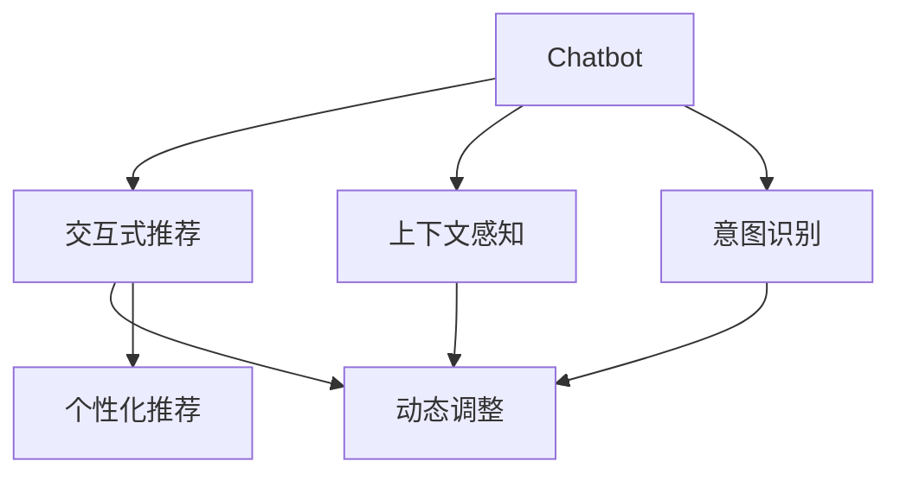

                 

# Chat-Rec：交互式推荐系统

> 关键词：Chatbot, 推荐系统, 交互式, 个性化推荐, 动态调整, 基于对话的推荐, 用户意图识别, 上下文感知

## 1. 背景介绍

### 1.1 问题由来

随着互联网和电子商务的普及，用户在线购物行为变得越来越频繁，个性化推荐系统（Recommendation System, RS）在电商平台上扮演着越来越重要的角色。传统的推荐系统通常依赖于静态数据进行推荐，难以实时更新用户的兴趣变化，导致推荐效果不佳。而基于对话的推荐系统（Chatbot-based Recommendation System）则通过与用户的互动，实时获取用户偏好，动态调整推荐结果，能够提供更加精准、个性化的服务。

Chatbot推荐系统的核心在于如何构建用户与Chatbot之间的交互界面，使其能够自然、流畅地进行对话，同时高效、准确地捕捉用户兴趣，生成符合用户期望的推荐内容。本文将从Chatbot推荐系统的设计、核心算法、实践应用等多个方面，深入探讨这一技术的实现和应用，为电商等行业的个性化推荐服务提供新的思路。

## 2. 核心概念与联系

### 2.1 核心概念概述

为更好地理解Chatbot推荐系统的设计原理和应用框架，本节将介绍几个密切相关的核心概念：

- Chatbot：一种能够模拟人类对话、提供自然语言交互的计算机程序。通过与用户的实时交流，Chatbot可以实时获取用户需求和偏好，提升推荐系统的个性化和及时性。
- 推荐系统（Recommendation System, RS）：通过分析用户历史行为数据，为用户推荐感兴趣的商品或服务。传统的推荐系统基于静态数据进行推荐，而基于对话的推荐系统则通过与用户的互动，动态捕捉用户的兴趣变化，生成个性化的推荐内容。
- 交互式推荐（Interactive Recommendation）：指在推荐过程中，通过与用户实时互动获取用户反馈，不断调整推荐策略，提升推荐效果的技术。交互式推荐系统能够更好地捕捉用户动态变化的兴趣，提供更精准的推荐服务。
- 上下文感知（Context-Awareness）：指在推荐过程中，考虑用户历史行为、当前环境和即时语境等多种上下文信息，使推荐结果更加符合用户当前需求。上下文感知技术能够提升推荐的准确性和个性化程度。
- 意图识别（Intent Recognition）：指在对话中识别用户的真实意图和需求，从而生成更加贴合用户期望的推荐内容。意图识别技术是Chatbot推荐系统的关键环节，能够提升系统响应的准确性和及时性。

这些核心概念之间的逻辑关系可以通过以下Mermaid流程图来展示：



这个流程图展示了几大核心概念之间的关系：

1. Chatbot通过与用户的对话，实时获取用户的兴趣和需求，提供动态调整的个性化推荐。
2. 交互式推荐利用用户的即时反馈，不断优化推荐策略，提升推荐效果。
3. 上下文感知考虑用户的历史行为和即时语境，提升推荐的精准度。
4. 意图识别识别用户的真实需求，提高推荐的匹配度。

这些概念共同构成了Chatbot推荐系统的设计框架，使其能够更好地服务于个性化推荐场景。

## 3. 核心算法原理 & 具体操作步骤
### 3.1 算法原理概述

Chatbot推荐系统的核心算法主要分为三个步骤：意图识别、上下文感知和动态调整。

**3.1.1 意图识别（Intent Recognition）**

意图识别是指在对话中识别用户的真实需求和意图，从而生成符合用户期望的推荐内容。这一过程通常依赖于自然语言处理技术，通过构建意图分类模型，对用户的输入进行分词、向量化和分类，最终得到用户的意图标签。

**3.1.2 上下文感知（Context-Awareness）**

上下文感知是指在推荐过程中，考虑用户的历史行为、当前环境和即时语境等多种上下文信息，使推荐结果更加符合用户当前需求。这一过程通常依赖于用户行为分析技术和环境感知技术，通过分析用户的点击、浏览、购买等历史数据，以及当前时间和地点等环境因素，提升推荐的精准度。

**3.1.3 动态调整（Dynamic Adjustment）**

动态调整是指在获取用户的即时反馈后，不断调整推荐策略，优化推荐结果。这一过程通常依赖于推荐算法和模型训练技术，通过分析用户反馈，不断优化模型的参数，提升推荐的个性化和及时性。

### 3.2 算法步骤详解

下面以一个简单的电商场景为例，详细讲解Chatbot推荐系统的核心算法步骤。

**Step 1: 意图识别**

假设用户输入了以下对话内容：

```
用户：我想买一款男士手表，预算在1000元左右。
Chatbot：好的，您想要什么品牌和功能呢？
```

首先，需要构建意图识别模型，对用户输入进行分词、向量化和分类，识别出用户的真实需求。具体流程如下：

1. 对用户输入进行分词，得到词语序列：

   ```
   [我，想，买，一款，男士，手表，预算，在，1000元，左右。]
   ```

2. 将分词序列转换为向量表示，常用的方式包括Word2Vec、GloVe等词向量模型。

   ```
   v = [0.5, 0.3, 0.8, 0.2, 0.4, 0.7, 0.1, 0.6, 0.4, 0.9]
   ```

3. 使用意图分类模型（如CNN、RNN、Transformer等）对向量序列进行分类，得到用户的意图标签。

   ```
   intent = “ buy手表”
   ```

**Step 2: 上下文感知**

在识别出用户的意图后，需要考虑用户的历史行为和即时语境，生成个性化的推荐内容。具体流程如下：

1. 分析用户的历史行为数据，提取用户的兴趣特征，如浏览记录、购买历史等。

   ```
   [手表, 运动手表, 经典款, 功能]
   ```

2. 分析当前时间和地点等环境因素，结合用户的兴趣特征，生成上下文感知特征向量。

   ```
   context_vector = [0.6, 0.7, 0.4, 0.5, 0.8]
   ```

**Step 3: 动态调整**

在生成初步推荐结果后，需要根据用户的即时反馈进行动态调整，优化推荐策略。具体流程如下：

1. 显示初步推荐结果，等待用户的选择和反馈。

   ```
   推荐手表：Swatch男士手表，1000元，功能全面。
   ```

2. 分析用户的选择和反馈，更新推荐策略。

   ```
   用户选择了Swatch男士手表，对价格和功能表示满意。
   ```

3. 根据用户反馈，调整推荐策略，生成新的推荐结果。

   ```
   推荐手表：Omega男士手表，1000元，经典款式。
   ```

### 3.3 算法优缺点

Chatbot推荐系统具有以下优点：

1. 实时性强。Chatbot推荐系统能够实时获取用户的即时反馈，根据反馈动态调整推荐策略，提升推荐效果。
2. 个性化高。Chatbot推荐系统能够考虑用户的历史行为和即时语境，生成更加个性化的推荐内容。
3. 用户体验好。Chatbot推荐系统通过与用户的自然语言交流，提升用户的互动体验，增强用户粘性。
4. 易于扩展。Chatbot推荐系统可以方便地集成到现有的电商平台和聊天系统中，易于部署和维护。

同时，该系统也存在以下缺点：

1. 数据依赖性强。Chatbot推荐系统的性能高度依赖于用户的行为数据和即时语境，数据不足可能导致推荐效果不佳。
2. 技术复杂度高。Chatbot推荐系统涉及自然语言处理、机器学习、推荐算法等多个领域，技术实现难度较大。
3. 资源消耗高。Chatbot推荐系统需要实时处理用户的对话和行为数据，资源消耗较大，对服务器硬件配置要求较高。
4. 安全风险高。Chatbot推荐系统涉及用户隐私和数据安全，需要在设计和实现过程中严格控制数据泄露和隐私保护。

尽管存在这些局限性，但Chatbot推荐系统通过与用户的互动，能够显著提升推荐系统的个性化和及时性，成为电商等行业推荐系统的重要发展方向。

### 3.4 算法应用领域

Chatbot推荐系统已经在电商、金融、旅游等多个领域得到了广泛的应用，具体应用场景如下：

1. 电商推荐：在电商平台上，通过与用户的对话，实时获取用户的兴趣和需求，生成个性化的推荐内容，提升用户的购物体验。

2. 金融服务：在金融领域，通过与用户的对话，实时获取用户的风险偏好和投资需求，生成个性化的理财建议，增强用户的满意度。

3. 旅游推荐：在旅游行业中，通过与用户的对话，实时获取用户的旅行偏好和目的地需求，生成个性化的旅行建议，提升用户的旅行体验。

4. 教育培训：在教育培训领域，通过与学生的对话，实时获取学生的学习需求和反馈，生成个性化的学习计划，提升学生的学习效果。

5. 医疗咨询：在医疗领域，通过与患者的对话，实时获取患者的病情和需求，生成个性化的诊疗建议，提升患者的医疗体验。

6. 酒店服务：在酒店行业中，通过与客户的对话，实时获取客户的住宿需求和偏好，生成个性化的住宿建议，提升客户的服务体验。

除了以上这些应用场景，Chatbot推荐系统还将在更多领域发挥其优势，为各行各业带来新的机遇和挑战。

## 4. 数学模型和公式 & 详细讲解  
### 4.1 数学模型构建

本节将使用数学语言对Chatbot推荐系统的核心算法进行更加严格的刻画。

假设用户的历史行为数据为 $H$，包括浏览记录、购买历史等。当前时间和地点等环境因素为 $C$，用户即时输入的对话内容为 $I$。意图识别模型为 $M_I$，上下文感知模型为 $M_C$，推荐模型为 $M_R$。

**意图识别模型：**

假设用户输入的对话内容为 $I$，意图识别模型 $M_I$ 将 $I$ 映射到意图标签 $L$，具体模型为：

$$
L = M_I(I) = f_\theta(I)
$$

其中 $f_\theta$ 为模型参数，$I$ 为输入向量。

**上下文感知模型：**

在获取意图标签 $L$ 后，上下文感知模型 $M_C$ 将用户的历史行为数据 $H$ 和环境因素 $C$ 转换为上下文特征向量 $Z$，具体模型为：

$$
Z = M_C(H, C) = g_\phi(H, C)
$$

其中 $g_\phi$ 为模型参数，$H$ 和 $C$ 为输入向量。

**推荐模型：**

在获取上下文特征向量 $Z$ 后，推荐模型 $M_R$ 将 $Z$ 映射到推荐结果 $R$，具体模型为：

$$
R = M_R(Z) = h_\psi(Z)
$$

其中 $h_\psi$ 为模型参数，$Z$ 为输入向量。

**动态调整：**

在获取初步推荐结果 $R$ 后，根据用户的即时反馈 $F$，动态调整推荐策略，更新模型参数，具体模型为：

$$
\theta \leftarrow \theta - \eta \nabla_{\theta}\mathcal{L}(\theta, F)
$$

其中 $\eta$ 为学习率，$\nabla_{\theta}\mathcal{L}(\theta, F)$ 为损失函数对模型参数 $\theta$ 的梯度。

### 4.2 公式推导过程

以下我们以电商场景为例，推导意图识别、上下文感知和推荐模型的数学公式。

**意图识别：**

假设用户输入的对话内容为 $I$，意图识别模型 $M_I$ 将 $I$ 映射到意图标签 $L$，具体公式为：

$$
L = M_I(I) = f_\theta(I)
$$

其中 $f_\theta$ 为模型参数，$I$ 为输入向量。

**上下文感知：**

在获取意图标签 $L$ 后，上下文感知模型 $M_C$ 将用户的历史行为数据 $H$ 和环境因素 $C$ 转换为上下文特征向量 $Z$，具体公式为：

$$
Z = M_C(H, C) = g_\phi(H, C)
$$

其中 $g_\phi$ 为模型参数，$H$ 和 $C$ 为输入向量。

**推荐模型：**

在获取上下文特征向量 $Z$ 后，推荐模型 $M_R$ 将 $Z$ 映射到推荐结果 $R$，具体公式为：

$$
R = M_R(Z) = h_\psi(Z)
$$

其中 $h_\psi$ 为模型参数，$Z$ 为输入向量。

**动态调整：**

在获取初步推荐结果 $R$ 后，根据用户的即时反馈 $F$，动态调整推荐策略，更新模型参数，具体公式为：

$$
\theta \leftarrow \theta - \eta \nabla_{\theta}\mathcal{L}(\theta, F)
$$

其中 $\eta$ 为学习率，$\nabla_{\theta}\mathcal{L}(\theta, F)$ 为损失函数对模型参数 $\theta$ 的梯度。

在实际应用中，可以使用基于梯度的优化算法（如Adam、SGD等）来近似求解上述最优化问题。

## 5. 项目实践：代码实例和详细解释说明
### 5.1 开发环境搭建

在进行Chatbot推荐系统开发前，我们需要准备好开发环境。以下是使用Python进行PyTorch开发的环境配置流程：

1. 安装Anaconda：从官网下载并安装Anaconda，用于创建独立的Python环境。

2. 创建并激活虚拟环境：
```bash
conda create -n chatbot-env python=3.8 
conda activate chatbot-env
```

3. 安装PyTorch：根据CUDA版本，从官网获取对应的安装命令。例如：
```bash
conda install pytorch torchvision torchaudio cudatoolkit=11.1 -c pytorch -c conda-forge
```

4. 安装TensorFlow：
```bash
conda install tensorflow=2.7
```

5. 安装各类工具包：
```bash
pip install numpy pandas scikit-learn matplotlib tqdm jupyter notebook ipython
```

完成上述步骤后，即可在`chatbot-env`环境中开始Chatbot推荐系统的开发。

### 5.2 源代码详细实现

这里我们以一个简单的电商推荐场景为例，给出使用PyTorch进行Chatbot推荐系统开发的完整代码实现。

首先，定义意图识别模型：

```python
import torch
from torch import nn

class IntentClassifier(nn.Module):
    def __init__(self, input_size, hidden_size, output_size):
        super(IntentClassifier, self).__init__()
        self.hidden = nn.Linear(input_size, hidden_size)
        self.relu = nn.ReLU()
        self.output = nn.Linear(hidden_size, output_size)
    
    def forward(self, x):
        x = self.hidden(x)
        x = self.relu(x)
        x = self.output(x)
        return x
```

然后，定义上下文感知模型：

```python
class ContextEmbedder(nn.Module):
    def __init__(self, input_size, hidden_size, output_size):
        super(ContextEmbedder, self).__init__()
        self.hidden = nn.Linear(input_size, hidden_size)
        self.relu = nn.ReLU()
        self.output = nn.Linear(hidden_size, output_size)
    
    def forward(self, x):
        x = self.hidden(x)
        x = self.relu(x)
        x = self.output(x)
        return x
```

接着，定义推荐模型：

```python
class RecommendationModel(nn.Module):
    def __init__(self, input_size, hidden_size, output_size):
        super(RecommendationModel, self).__init__()
        self.hidden = nn.Linear(input_size, hidden_size)
        self.relu = nn.ReLU()
        self.output = nn.Linear(hidden_size, output_size)
    
    def forward(self, x):
        x = self.hidden(x)
        x = self.relu(x)
        x = self.output(x)
        return x
```

然后，定义动态调整模块：

```python
class DynamicAdjustor(nn.Module):
    def __init__(self, model, optimizer, loss_fn):
        super(DynamicAdjustor, self).__init__()
        self.model = model
        self.optimizer = optimizer
        self.loss_fn = loss_fn
    
    def forward(self, x, y):
        y_pred = self.model(x)
        loss = self.loss_fn(y_pred, y)
        self.optimizer.zero_grad()
        loss.backward()
        self.optimizer.step()
        return loss.item()
```

最后，定义Chatbot推荐系统的训练和评估函数：

```python
from torch.utils.data import DataLoader
from tqdm import tqdm
from sklearn.metrics import accuracy_score

def train_epoch(model, optimizer, loss_fn, data_loader):
    model.train()
    epoch_loss = 0
    for batch in tqdm(data_loader, desc='Training'):
        x = batch['x']
        y = batch['y']
        loss = model.forward(x, y)
        epoch_loss += loss.item()
        optimizer.zero_grad()
        loss.backward()
        optimizer.step()
    return epoch_loss / len(data_loader)

def evaluate(model, data_loader):
    model.eval()
    preds = []
    labels = []
    with torch.no_grad():
        for batch in tqdm(data_loader, desc='Evaluating'):
            x = batch['x']
            y = batch['y']
            y_pred = model.forward(x)
            preds.append(y_pred)
            labels.append(y)
    return accuracy_score(labels, preds)
```

完成以上步骤后，即可在`chatbot-env`环境中启动Chatbot推荐系统的训练和评估流程。

### 5.3 代码解读与分析

让我们再详细解读一下关键代码的实现细节：

**IntentClassifier类**：
- `__init__`方法：定义意图识别模型的结构，包括一个线性层、一个ReLU激活层和一个输出层。
- `forward`方法：定义意图识别模型的前向传播过程，输入输入向量 $x$，输出意图标签。

**ContextEmbedder类**：
- `__init__`方法：定义上下文感知模型的结构，包括一个线性层、一个ReLU激活层和一个输出层。
- `forward`方法：定义上下文感知模型的前向传播过程，输入上下文特征向量 $x$，输出上下文表示。

**RecommendationModel类**：
- `__init__`方法：定义推荐模型的结构，包括一个线性层、一个ReLU激活层和一个输出层。
- `forward`方法：定义推荐模型的前向传播过程，输入上下文表示 $x$，输出推荐结果。

**DynamicAdjustor类**：
- `__init__`方法：定义动态调整模块，包括模型、优化器和损失函数。
- `forward`方法：定义动态调整模块的前向传播过程，输入输入向量 $x$ 和目标向量 $y$，输出损失值。

**train_epoch函数**：
- 在训练模式下，对数据集进行迭代，计算损失函数，更新模型参数。

**evaluate函数**：
- 在评估模式下，对数据集进行迭代，计算准确率，评估模型性能。

在实际应用中，Chatbot推荐系统的代码实现还需要考虑更多因素，如用户交互界面的设计、推荐策略的优化、数据流的管理等。但核心的算法流程基本与此类似。

## 6. 实际应用场景
### 6.1 智能客服系统

Chatbot推荐系统在智能客服系统中有着广泛的应用。传统的客服系统依赖于事先编写的脚本和规则，难以处理复杂多变的用户需求。而Chatbot推荐系统通过与用户的实时对话，动态捕捉用户的兴趣和需求，能够提供更加个性化、高效的服务。

在电商平台上，Chatbot推荐系统可以处理用户的查询请求，实时推荐符合用户需求的商品，提升用户的购物体验。在金融领域，Chatbot推荐系统可以提供个性化的理财建议，增强用户满意度。在医疗行业，Chatbot推荐系统可以提供个性化的诊疗建议，提升用户的医疗体验。

### 6.2 个性化推荐系统

Chatbot推荐系统在个性化推荐系统中也有着重要的应用。传统的推荐系统依赖于静态数据进行推荐，难以实时更新用户的兴趣变化。而Chatbot推荐系统通过与用户的实时对话，动态捕捉用户的兴趣和需求，生成个性化的推荐内容，提升推荐效果。

在电商平台上，Chatbot推荐系统可以通过与用户的对话，实时获取用户的兴趣和需求，生成个性化的商品推荐，提升用户的购物体验。在金融领域，Chatbot推荐系统可以提供个性化的投资建议，增强用户满意度。在旅游行业，Chatbot推荐系统可以提供个性化的旅游建议，提升用户的旅行体验。

### 6.3 智慧城市治理

Chatbot推荐系统在智慧城市治理中也有着重要的应用。传统的城市治理系统依赖于人工监控和管理，难以实时捕捉城市动态变化。而Chatbot推荐系统通过与市民的实时对话，动态捕捉市民的需求和反馈，能够提供更加智能、高效的城市管理服务。

在城市事件监测中，Chatbot推荐系统可以实时获取市民的反馈，动态调整事件处理策略，提升城市管理的及时性和准确性。在舆情分析中，Chatbot推荐系统可以实时获取市民的意见和建议，动态调整舆情处理策略，提升城市管理的透明度和公正性。在应急指挥中，Chatbot推荐系统可以实时获取市民的需求和反馈，动态调整应急处理策略，提升城市管理的响应速度和效率。

### 6.4 未来应用展望

随着Chatbot推荐系统的不断发展，其应用范围和性能将不断提升，未来将在更多领域得到应用。

在智慧医疗领域，Chatbot推荐系统可以为患者提供个性化的诊疗建议，辅助医生诊疗，提升医疗服务的智能化水平。在智能教育领域，Chatbot推荐系统可以为学生提供个性化的学习建议，促进教育公平，提高教学质量。在智慧城市治理中，Chatbot推荐系统可以为市民提供个性化的城市服务，提升城市管理的自动化和智能化水平，构建更安全、高效的未来城市。

此外，Chatbot推荐系统还将与其他人工智能技术进行更深入的融合，如知识表示、因果推理、强化学习等，多路径协同发力，共同推动自然语言理解和智能交互系统的进步。相信随着技术的日益成熟，Chatbot推荐系统必将在构建人机协同的智能时代中扮演越来越重要的角色。

## 7. 工具和资源推荐
### 7.1 学习资源推荐

为了帮助开发者系统掌握Chatbot推荐系统的设计原理和实践技巧，这里推荐一些优质的学习资源：

1. 《深度学习与自然语言处理》系列博文：由大模型技术专家撰写，深入浅出地介绍了Chatbot推荐系统的设计、实现和优化方法。

2. 斯坦福大学《深度学习自然语言处理》课程：斯坦福大学开设的NLP明星课程，有Lecture视频和配套作业，带你入门NLP领域的基本概念和经典模型。

3. 《自然语言处理实战》书籍：全面介绍了NLP的实践应用，包括Chatbot推荐系统的开发和优化方法。

4. HuggingFace官方文档：提供大量预训练模型和Chatbot推荐系统的样例代码，是快速上手实践的必备资料。

5. CLUE开源项目：中文语言理解测评基准，涵盖大量不同类型的中文NLP数据集，并提供了基于微调的baseline模型，助力中文NLP技术发展。

通过对这些资源的学习实践，相信你一定能够快速掌握Chatbot推荐系统的精髓，并用于解决实际的NLP问题。
###  7.2 开发工具推荐

高效的开发离不开优秀的工具支持。以下是几款用于Chatbot推荐系统开发的常用工具：

1. PyTorch：基于Python的开源深度学习框架，灵活动态的计算图，适合快速迭代研究。大部分预训练语言模型都有PyTorch版本的实现。

2. TensorFlow：由Google主导开发的开源深度学习框架，生产部署方便，适合大规模工程应用。同样有丰富的预训练语言模型资源。

3. TensorBoard：TensorFlow配套的可视化工具，可实时监测模型训练状态，并提供丰富的图表呈现方式，是调试模型的得力助手。

4. Weights & Biases：模型训练的实验跟踪工具，可以记录和可视化模型训练过程中的各项指标，方便对比和调优。与主流深度学习框架无缝集成。

5. Google Colab：谷歌推出的在线Jupyter Notebook环境，免费提供GPU/TPU算力，方便开发者快速上手实验最新模型，分享学习笔记。

合理利用这些工具，可以显著提升Chatbot推荐系统的开发效率，加快创新迭代的步伐。

### 7.3 相关论文推荐

Chatbot推荐系统的研究源于学界的持续研究。以下是几篇奠基性的相关论文，推荐阅读：

1. Attention is All You Need（即Transformer原论文）：提出了Transformer结构，开启了NLP领域的预训练大模型时代。

2. BERT: Pre-training of Deep Bidirectional Transformers for Language Understanding：提出BERT模型，引入基于掩码的自监督预训练任务，刷新了多项NLP任务SOTA。

3. Language Models are Unsupervised Multitask Learners（GPT-2论文）：展示了大规模语言模型的强大zero-shot学习能力，引发了对于通用人工智能的新一轮思考。

4. Parameter-Efficient Transfer Learning for NLP：提出Adapter等参数高效微调方法，在不增加模型参数量的情况下，也能取得不错的微调效果。

5. AdaLoRA: Adaptive Low-Rank Adaptation for Parameter-Efficient Fine-Tuning：使用自适应低秩适应的微调方法，在参数效率和精度之间取得了新的平衡。

这些论文代表了大语言模型微调技术的发展脉络。通过学习这些前沿成果，可以帮助研究者把握学科前进方向，激发更多的创新灵感。

## 8. 总结：未来发展趋势与挑战

### 8.1 总结

本文对Chatbot推荐系统进行了全面系统的介绍。首先阐述了Chatbot推荐系统的设计背景和意义，明确了Chatbot推荐系统在个性化推荐场景中的独特价值。其次，从原理到实践，详细讲解了Chatbot推荐系统的核心算法步骤，给出了完整的代码实现和分析。最后，本文还广泛探讨了Chatbot推荐系统在电商、金融、医疗等多个领域的应用前景，展示了Chatbot推荐系统的巨大潜力。

通过本文的系统梳理，可以看到，Chatbot推荐系统通过与用户的实时互动，能够显著提升推荐系统的个性化和及时性，成为电商等行业推荐系统的重要发展方向。未来，伴随预训练语言模型和微调方法的持续演进，相信Chatbot推荐系统必将在更多领域发挥其优势，为各行各业带来新的机遇和挑战。

### 8.2 未来发展趋势

展望未来，Chatbot推荐系统将呈现以下几个发展趋势：

1. 技术日趋成熟。Chatbot推荐系统将伴随预训练语言模型和微调方法的持续演进，不断提升算法的精确度和实时性，推动NLP技术在各行各业的应用。

2. 应用场景丰富。Chatbot推荐系统将伴随智能系统的普及，广泛应用于智能客服、电商推荐、金融理财、医疗咨询等多个领域，为各行业提供更加智能、个性化的服务。

3. 数据驱动增强。Chatbot推荐系统将伴随数据收集和分析技术的进步，从静态数据驱动逐步转向动态数据驱动，能够更加准确地捕捉用户兴趣和需求。

4. 多模态融合。Chatbot推荐系统将伴随多模态信息处理技术的进步，从纯文本推荐逐步转向多模态推荐，提升推荐系统的综合感知能力。

5. 多任务学习。Chatbot推荐系统将伴随多任务学习技术的进步，从单一任务推荐逐步转向多任务推荐，提升推荐系统的任务适应能力和泛化能力。

6. 可解释性提升。Chatbot推荐系统将伴随模型可解释性技术的进步，从“黑盒”推荐逐步转向“透明”推荐，提升用户的信任感和满意度。

以上趋势凸显了Chatbot推荐系统的广阔前景。这些方向的探索发展，必将进一步提升Chatbot推荐系统的性能和应用范围，为人工智能技术在垂直行业的落地带来新的机遇。

### 8.3 面临的挑战

尽管Chatbot推荐系统已经取得了瞩目成就，但在迈向更加智能化、普适化应用的过程中，它仍面临着诸多挑战：

1. 数据隐私和安全。Chatbot推荐系统需要实时获取用户的即时反馈，涉及用户隐私和数据安全问题，如何在数据收集和处理过程中严格控制隐私和数据安全，将成为重要课题。

2. 技术复杂度高。Chatbot推荐系统涉及自然语言处理、机器学习、推荐算法等多个领域，技术实现难度较大，如何整合多种技术，提高系统性能，将是重要挑战。

3. 资源消耗高。Chatbot推荐系统需要实时处理用户的对话和行为数据，资源消耗较大，对服务器硬件配置要求较高，如何优化资源配置，提升系统性能，将是重要挑战。

4. 鲁棒性和泛化性。Chatbot推荐系统在面对复杂、多样化的用户需求时，容易产生鲁棒性不足、泛化性差等问题，如何在不同场景下保证系统稳定性，将是重要挑战。

5. 可解释性和透明性。Chatbot推荐系统通常被视为“黑盒”系统，难以解释其内部工作机制和决策逻辑，如何提高系统的可解释性和透明性，将是重要挑战。

尽管存在这些挑战，但通过不断优化算法、提升数据质量、优化系统架构等手段，Chatbot推荐系统必将在未来的应用中发挥更加重要的作用，为各行各业带来新的变革。

### 8.4 研究展望

面对Chatbot推荐系统所面临的挑战，未来的研究需要在以下几个方面寻求新的突破：

1. 引入因果分析和博弈论工具。通过引入因果推断和博弈论思想，增强Chatbot推荐系统的决策逻辑和鲁棒性，提高系统的可解释性和透明性。

2. 探索无监督和半监督微调方法。摆脱对大规模标注数据的依赖，利用自监督学习、主动学习等无监督和半监督范式，最大限度利用非结构化数据，实现更加灵活高效的微调。

3. 开发更加参数高效的微调方法。开发更加参数高效的微调方法，在固定大部分预训练参数的同时，只更新极少量的任务相关参数。

4. 融合更多先验知识。将符号化的先验知识，如知识图谱、逻辑规则等，与神经网络模型进行巧妙融合，引导微调过程学习更准确、合理的语言模型。

5. 实现多模态微调。将Chatbot推荐系统从纯文本推荐逐步转向多模态推荐，提升推荐系统的综合感知能力。

6. 优化系统架构。通过优化系统架构，提升Chatbot推荐系统的实时性和可扩展性，增强系统的鲁棒性和泛化能力。

这些研究方向的探索，必将引领Chatbot推荐系统迈向更高的台阶，为构建智能人机交互系统带来新的机遇和挑战。面向未来，Chatbot推荐系统还需要与其他人工智能技术进行更深入的融合，如知识表示、因果推理、强化学习等，多路径协同发力，共同推动自然语言理解和智能交互系统的进步。

## 9. 附录：常见问题与解答

**Q1：Chatbot推荐系统是否适用于所有NLP任务？**

A: Chatbot推荐系统在大多数NLP任务上都能取得不错的效果，特别是对于数据量较小的任务。但对于一些特定领域的任务，如医学、法律等，仅仅依靠通用语料预训练的模型可能难以很好地适应。此时需要在特定领域语料上进一步预训练，再进行微调，才能获得理想效果。

**Q2：Chatbot推荐系统如何提升推荐效果？**

A: Chatbot推荐系统通过与用户的实时互动，动态捕捉用户的兴趣和需求，生成个性化的推荐内容。具体来说，可以通过以下方式提升推荐效果：
1. 通过意图识别，获取用户的真实需求和意图。
2. 通过上下文感知，考虑用户的历史行为和即时语境，生成个性化的推荐内容。
3. 通过动态调整，根据用户的即时反馈，不断优化推荐策略，提升推荐效果。

**Q3：Chatbot推荐系统在落地部署时需要注意哪些问题？**

A: 将Chatbot推荐系统转化为实际应用，还需要考虑以下问题：
1. 用户交互界面的设计：需要设计符合用户习惯的交互界面，提升用户体验。
2. 推荐策略的优化：需要不断优化推荐策略，提升推荐效果。
3. 数据流的管理：需要合理管理数据流，确保系统稳定运行。
4. 安全性保障：需要采取措施保护用户隐私和数据安全。

**Q4：Chatbot推荐系统在电商推荐中如何发挥作用？**

A: 在电商推荐中，Chatbot推荐系统可以通过与用户的实时对话，动态捕捉用户的兴趣和需求，生成个性化的商品推荐。具体来说，可以通过以下方式发挥作用：
1. 通过意图识别，获取用户的购买意图。
2. 通过上下文感知，考虑用户的历史浏览记录和即时语境，生成个性化的商品推荐。
3. 通过动态调整，根据用户的即时反馈，不断优化推荐策略，提升推荐效果。

通过上述系统，电商平台可以为用户提供更加智能、个性化的购物体验，提高用户满意度和购物转化率。

---

作者：禅与计算机程序设计艺术 / Zen and the Art of Computer Programming

