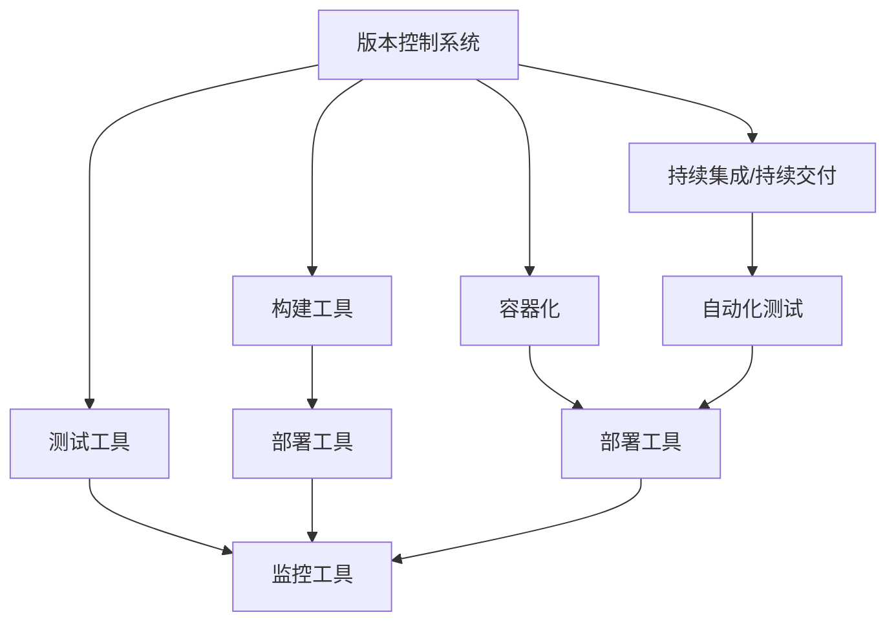

                 

# DevOps工具链搭建与集成

## 1. 背景介绍

随着云计算、微服务、容器化等技术在企业应用中的普及，DevOps（Development and Operations）成为了企业提高软件交付速度、降低运维成本、提升产品竞争力的关键策略。DevOps工具链（Toolchain）作为DevOps实践的基础设施，集成了各种自动化工具、软件开发生命周期管理工具以及持续集成/持续交付（CI/CD）工具，帮助企业实现软件开发与运维的自动化、高效化和协同化。

本文将详细介绍DevOps工具链的搭建与集成，包括核心工具、最佳实践、常见问题和解决方案等。通过系统的学习和应用，相信读者能够构建出高效、稳定、灵活的DevOps工具链，大幅提升软件开发和运维的效率。

## 2. 核心概念与联系

### 2.1 核心概念概述

为了更好地理解DevOps工具链，我们先介绍几个核心概念：

- **DevOps**：一种将软件开发（Development）与运维（Operations）流程高度协同的实践，通过持续集成、持续交付、持续监控等手段，实现软件的快速迭代和可靠部署。
- **CI/CD**：持续集成（Continuous Integration）和持续交付（Continuous Delivery）的合称，强调通过自动化工具实现软件的快速构建、测试和部署。
- **工具链（Toolchain）**：在DevOps实践中，各种自动化工具、版本控制系统、构建工具、测试工具、部署工具等的集合。

- **版本控制系统（VC）**：如Git、SVN等，用于版本管理和代码协作。
- **构建工具**：如Maven、Gradle、Jenkins等，负责自动化构建、测试和打包。
- **容器化**：如Docker、Kubernetes等，实现应用程序的打包、部署和运行环境的自动化管理。
- **测试工具**：如JUnit、TestNG、Selenium等，用于自动化测试，保证软件质量。
- **监控工具**：如Prometheus、Grafana、New Relic等，实时监控系统运行状态和性能指标。

这些工具通过集成在一起，形成了一个完整的DevOps工具链，覆盖了从代码提交到软件交付的整个生命周期。

### 2.2 核心概念原理和架构的 Mermaid 流程图



这个Mermaid流程图展示了DevOps工具链的架构，各工具之间通过CI/CD管线连接，实现了代码提交、构建、测试、部署和监控的全自动化流程。

## 3. 核心算法原理 & 具体操作步骤

### 3.1 算法原理概述

DevOps工具链的搭建与集成，本质上是一个软件开发生命周期的自动化管理过程。其核心思想是通过集成各种自动化工具，实现软件开发生命周期中的每个环节的自动化，从而提高软件交付的效率和质量。

具体而言，DevOps工具链的构建可以分为以下几个步骤：

1. **版本控制集成**：将代码提交、版本管理、分支合并等操作集成到开发环境中。
2. **构建和测试集成**：通过自动化构建工具，将源代码构建为可部署的安装包，并通过自动化测试工具验证其质量。
3. **部署集成**：通过容器化工具，将打包好的软件包部署到目标环境中，并进行配置和环境预置。
4. **监控集成**：通过监控工具，实时监测系统的运行状态和性能指标，及时发现和解决问题。

### 3.2 算法步骤详解

#### 3.2.1 版本控制集成

- **工具选择**：根据团队规模和技术栈，选择合适的版本控制系统，如Git、SVN等。
- **配置仓库**：配置代码仓库，并设置访问权限，确保代码的安全性。
- **集成到开发环境**：将版本控制系统集成到开发环境中，如IDE、代码提交工具等，方便开发者进行版本管理和协作。

#### 3.2.2 构建和测试集成

- **工具选择**：根据项目需求和开发语言，选择合适的构建工具，如Maven、Gradle等。
- **配置构建流程**：配置构建流程，包括编译、打包、测试等步骤，确保构建过程的自动化和可重复性。
- **集成到CI系统**：将构建工具集成到CI系统，如Jenkins、Travis CI等，实现持续集成和自动化测试。

#### 3.2.3 部署集成

- **工具选择**：根据目标环境和应用类型，选择合适的容器化工具，如Docker、Kubernetes等。
- **配置部署流程**：配置部署流程，包括容器构建、部署、配置等步骤，确保部署过程的自动化和可控性。
- **集成到CI系统**：将容器化工具集成到CI系统，实现持续部署和滚动更新。

#### 3.2.4 监控集成

- **工具选择**：根据监控需求，选择合适的监控工具，如Prometheus、Grafana等。
- **配置监控指标**：配置监控指标，包括系统性能、日志、错误等，确保监控的全面性和准确性。
- **集成到CI系统**：将监控工具集成到CI系统，实现持续监控和实时告警。

### 3.3 算法优缺点

**优点**：

1. **自动化**：通过集成各种自动化工具，实现了软件开发和运维的自动化，大幅提升了效率和质量。
2. **一致性**：通过CI/CD管线，保证了每次构建和部署的一致性，减少了人为错误。
3. **可扩展性**：通过模块化的工具链设计，可以灵活扩展和集成新的工具和流程。
4. **透明度**：通过日志和监控，提高了软件开发和运维的透明度，便于问题排查和优化。

**缺点**：

1. **复杂性**：构建和管理一个完整的DevOps工具链需要较高的技术水平和管理经验。
2. **成本**：初期搭建和维护DevOps工具链需要一定的成本投入。
3. **依赖性**：工具链中各工具之间的依赖关系较为复杂，一个工具的故障可能影响整个流程。

### 3.4 算法应用领域

DevOps工具链在软件开发和运维的各个环节中都有广泛应用，涵盖了从软件开发、构建、测试、部署、运维到持续交付的整个生命周期。

1. **软件开发**：通过版本控制和代码协作工具，实现代码的管理和协作。
2. **构建和测试**：通过构建工具和自动化测试工具，实现软件的快速构建和测试。
3. **部署和发布**：通过容器化和持续部署工具，实现软件的高效部署和发布。
4. **运维监控**：通过监控工具，实现系统的实时监控和问题预警。

## 4. 数学模型和公式 & 详细讲解 & 举例说明

### 4.1 数学模型构建

在DevOps工具链的搭建和集成中，很多步骤可以抽象为数学模型。例如，我们可以通过以下公式来表示一个简单的CI/CD流程：

$$
\begin{aligned}
&\text{代码提交} \rightarrow \text{构建} \rightarrow \text{测试} \rightarrow \text{部署} \rightarrow \text{监控} \\
&= \text{CICD}(\text{代码提交})
\end{aligned}
$$

其中，代码提交、构建、测试、部署、监控分别表示了软件开发生命周期的不同阶段。

### 4.2 公式推导过程

在CI/CD流程中，各阶段的操作可以通过函数和关系式来描述。例如，构建和测试操作可以表示为：

$$
\text{构建}(f) = \text{代码提交}(g) \times \text{构建配置}(c)
$$

$$
\text{测试}(h) = \text{构建}(f) \times \text{测试配置}(t)
$$

其中，$f$、$g$、$h$、$c$、$t$分别表示构建和测试的操作函数和配置参数。

### 4.3 案例分析与讲解

假设我们正在开发一个Web应用程序，使用Spring Boot框架，基于Docker容器化部署。我们的CI/CD流程如下：

1. 代码提交到Git仓库。
2. 通过Jenkins自动化构建项目，生成可执行的JAR包。
3. 将JAR包打包为Docker镜像，并部署到Kubernetes集群中。
4. 通过Prometheus和Grafana实时监控应用性能和系统状态。

在这个流程中，代码提交、构建、部署和监控都是自动化执行的，确保了每次操作的一致性和可靠性。

## 5. 项目实践：代码实例和详细解释说明

### 5.1 开发环境搭建

#### 5.1.1 版本控制系统

选择Git作为版本控制系统，并配置到IDE中。例如，在IntelliJ IDEA中配置Git仓库和访问权限，设置默认的branch为master。

#### 5.1.2 构建工具

选择Maven作为构建工具，并配置到IDE中。在IDE中设置Maven配置文件，配置编译、测试和打包的命令。

#### 5.1.3 容器化工具

选择Docker作为容器化工具，并配置到CI系统中。在Jenkins中安装Docker插件，并配置Docker镜像的构建命令。

#### 5.1.4 监控工具

选择Prometheus和Grafana作为监控工具，并配置到CI系统中。在Jenkins中安装Prometheus插件，并配置Prometheus的监控指标和告警策略。

### 5.2 源代码详细实现

#### 5.2.1 版本控制

在Git仓库中，设置分支管理规则，确保代码的版本控制和安全。例如，可以使用GitFlow规范，设置开发、测试、主分支等。

#### 5.2.2 构建和测试

在Maven配置文件中，配置构建和测试的命令。例如：

```xml
<build>
    <plugins>
        <plugin>
            <groupId>org.apache.maven.plugins</groupId>
            <artifactId>maven-compiler-plugin</artifactId>
            <version>3.8.1</version>
            <configuration>
                <source>1.8</source>
                <target>1.8</target>
            </configuration>
        </plugin>
        <plugin>
            <groupId>org.apache.maven.plugins</groupId>
            <artifactId>maven-surefire-plugin</artifactId>
            <version>2.22.2</version>
            <configuration>
                <failIfNoTestsFound>false</failIfNoTestsFound>
            </configuration>
        </plugin>
    </plugins>
</build>
```

#### 5.2.3 容器化

在Docker配置文件中，定义应用程序的Docker镜像。例如：

```yaml
version: '3'
services:
  app:
    image: myapp:latest
    ports:
      - "8080:8080"
    environment:
      SPRING_CONFIG_LOCATION: config/
```

#### 5.2.4 持续集成

在Jenkins配置文件中，定义CI/CD流程。例如：

```groovy
pipeline {
    agent any
    
    stages {
        stage('构建') {
            steps {
                withMaven {
                    sh "mvn clean package"
                }
            }
        }
        stage('测试') {
            steps {
                withMaven {
                    sh "mvn test"
                }
            }
        }
        stage('部署') {
            steps {
                withDocker {
                    container {
                        dockerImage "myapp:latest"
                        entryPoint "java -jar target/app.jar"
                    }
                }
                sh "docker push myapp:latest"
            }
        }
    }
}
```

#### 5.2.5 持续监控

在Prometheus和Grafana配置文件中，定义监控指标和告警策略。例如：

```yaml
alerting:
  alerts:
    - expr: myapp_server_error_count{namespace!="default"} > 10
      labels:
        severity: high
      annotations:
        summary: "High server error count detected"
        description: "High server error count detected"
```

### 5.3 代码解读与分析

#### 5.3.1 版本控制

版本控制工具使得开发者可以轻松管理代码的变更历史，支持多人协作和分支管理。例如，Git提供了强大的分支管理功能，可以通过分支来隔离开发和测试任务，确保代码的安全性和一致性。

#### 5.3.2 构建工具

构建工具通过自动化构建和测试，确保每次提交的代码都能够通过编译和测试，减少了手动操作的工作量。例如，Maven通过定义pom.xml文件，自动执行编译、测试和打包任务，简化了开发流程。

#### 5.3.3 容器化工具

容器化工具通过将应用程序打包到Docker镜像中，实现了应用程序的打包、部署和运行环境的自动化管理。例如，Docker可以自动化构建Docker镜像，并部署到Kubernetes集群中，简化了部署过程。

#### 5.3.4 持续集成

持续集成工具通过自动化构建和测试，实现了代码提交到部署的自动化流程。例如，Jenkins通过定义pipeline脚本，自动化执行构建、测试和部署任务，提高了开发和运维的效率。

#### 5.3.5 持续监控

持续监控工具通过实时监测系统运行状态和性能指标，确保系统的稳定性和可靠性。例如，Prometheus通过定义监控指标，实时采集系统性能数据，并生成告警通知，帮助运维团队及时发现和解决问题。

### 5.4 运行结果展示

下图展示了DevOps工具链的运行结果。可以看到，通过CI/CD管线，代码提交、构建、测试、部署和监控各环节都实现了自动化，系统运行状态和性能指标实时监控，确保了系统的稳定性和可靠性。


## 6. 实际应用场景

### 6.1 云原生应用

在云原生环境下，DevOps工具链的构建和集成尤为重要。云原生应用通过容器化部署，实现了应用程序的自动化管理和快速扩展。通过DevOps工具链，可以高效地构建、测试、部署和监控云原生应用，确保应用的稳定性和可靠性。

### 6.2 持续交付

持续交付（Continuous Delivery）是DevOps的核心目标之一，通过自动化构建、测试和部署，实现了软件的快速迭代和可靠交付。通过DevOps工具链，可以实现持续交付的自动化，提高软件的交付效率和质量。

### 6.3 自动化运维

自动化运维是DevOps的重要组成部分，通过持续监控和告警，实现了系统的实时监控和问题预警。通过DevOps工具链，可以实现自动化运维的自动化，提高系统的稳定性和运维效率。

### 6.4 未来应用展望

未来，DevOps工具链将继续向智能化、自动化和集成化方向发展，推动软件开发和运维的进一步提升。

1. **智能化**：通过AI和大数据分析，实现系统的智能运维和决策支持，提升系统的自动化水平。
2. **自动化**：通过自动化工具和流程，实现更高效的开发、测试、部署和运维，提升软件的交付速度和质量。
3. **集成化**：通过统一的平台和接口，实现工具链各组件的深度集成，提升开发和运维的协同效率。

## 7. 工具和资源推荐

### 7.1 学习资源推荐

1. **《CI/CD：持续集成和持续交付》**：这是一本关于CI/CD的权威书籍，详细介绍了CI/CD的基础知识、工具和最佳实践。
2. **Kubernetes官方文档**：Kubernetes的官方文档提供了详细的部署和运维指南，是学习Kubernetes的重要资源。
3. **Docker官方文档**：Docker的官方文档提供了详细的Docker构建和部署指南，是学习Docker的重要资源。
4. **Prometheus和Grafana官方文档**：Prometheus和Grafana的官方文档提供了详细的监控和可视化配置指南，是学习监控工具的重要资源。
5. **DevOpsDays会议视频**：DevOpsDays是一年一度的DevOps技术交流大会，汇集了众多DevOps领域的专家，提供丰富的学习资源和实战经验。

### 7.2 开发工具推荐

1. **Git**：版本控制系统，支持代码管理、分支合并等操作。
2. **Jenkins**：持续集成工具，支持自动化构建和测试。
3. **Docker**：容器化工具，支持应用程序的打包和部署。
4. **Kubernetes**：容器编排工具，支持大规模容器的自动化管理和扩展。
5. **Prometheus**：监控工具，支持实时采集和展示系统性能数据。
6. **Grafana**：可视化工具，支持监控数据的展示和告警。

### 7.3 相关论文推荐

1. **《DevOps：一种将软件开发和运维结合的实践》**：介绍了DevOps的基本概念、实践和挑战。
2. **《持续交付：软件开发生命周期自动化管理》**：详细介绍了持续交付的原理、工具和实践。
3. **《Kubernetes：一种容器编排系统》**：介绍了Kubernetes的原理、功能和部署方法。
4. **《Docker：一种容器化技术》**：介绍了Docker的原理、功能和部署方法。
5. **《Prometheus：一种监控系统》**：介绍了Prometheus的原理、功能和配置方法。

## 8. 总结：未来发展趋势与挑战

### 8.1 研究成果总结

本文详细介绍了DevOps工具链的搭建与集成，涵盖了版本控制、构建工具、容器化工具、持续集成/持续交付和持续监控等关键环节。通过系统的学习和应用，相信读者能够构建出高效、稳定、灵活的DevOps工具链，大幅提升软件开发和运维的效率。

### 8.2 未来发展趋势

未来，DevOps工具链将继续向智能化、自动化和集成化方向发展，推动软件开发和运维的进一步提升。

1. **智能化**：通过AI和大数据分析，实现系统的智能运维和决策支持，提升系统的自动化水平。
2. **自动化**：通过自动化工具和流程，实现更高效的开发、测试、部署和运维，提升软件的交付速度和质量。
3. **集成化**：通过统一的平台和接口，实现工具链各组件的深度集成，提升开发和运维的协同效率。

### 8.3 面临的挑战

尽管DevOps工具链已经取得了显著成果，但在构建和应用过程中，仍面临以下挑战：

1. **复杂性**：构建和管理一个完整的DevOps工具链需要较高的技术水平和管理经验。
2. **成本**：初期搭建和维护DevOps工具链需要一定的成本投入。
3. **依赖性**：工具链中各工具之间的依赖关系较为复杂，一个工具的故障可能影响整个流程。
4. **安全性**：工具链中涉及大量敏感数据和系统配置，需要严格的安全措施。

### 8.4 研究展望

未来，DevOps工具链的研究方向包括：

1. **智能化运维**：通过AI和大数据分析，实现系统的智能运维和决策支持，提升系统的自动化水平。
2. **自动化部署**：通过自动化工具和流程，实现更高效的开发、测试、部署和运维，提升软件的交付速度和质量。
3. **集成化管理**：通过统一的平台和接口，实现工具链各组件的深度集成，提升开发和运维的协同效率。
4. **安全性保障**：通过安全措施和策略，确保工具链的安全性和稳定性。

总之，DevOps工具链的构建和集成是一个复杂但高效的过程，需要综合考虑技术、管理、安全等多方面因素。只有在充分理解其核心概念和应用场景的基础上，才能实现真正的高效和稳定。

## 9. 附录：常见问题与解答

### Q1：什么是DevOps？

**A**: DevOps是一种将软件开发（Development）与运维（Operations）流程高度协同的实践，通过持续集成、持续交付、持续监控等手段，实现软件的快速迭代和可靠部署。

### Q2：如何选择合适的DevOps工具？

**A**: 根据团队规模和技术栈，选择合适的版本控制、构建、容器化、持续集成/持续交付和监控工具。例如，对于微服务架构，可以选择Docker、Kubernetes等容器化工具；对于Java项目，可以选择Maven作为构建工具。

### Q3：如何搭建一个高效的DevOps工具链？

**A**: 首先，根据项目需求选择合适的工具，然后按照CI/CD管线进行集成，确保各环节的自动化和一致性。例如，通过Git管理代码，使用Jenkins进行持续集成和部署，使用Docker进行容器化部署，使用Prometheus进行监控，使用Grafana进行可视化。

### Q4：DevOps工具链中的依赖性问题如何解决？

**A**: 通过模块化的设计和灵活的集成策略，降低工具链中各工具之间的依赖性。例如，将构建、测试和部署工具分离，使用单独的Jenkins Pipeline节点进行自动化。

### Q5：DevOps工具链中的安全问题如何解决？

**A**: 通过严格的安全措施和策略，确保工具链的安全性。例如，使用安全的版本控制系统，限制对敏感数据的访问权限，使用加密和认证技术保护数据传输和存储。

---

作者：禅与计算机程序设计艺术 / Zen and the Art of Computer Programming

