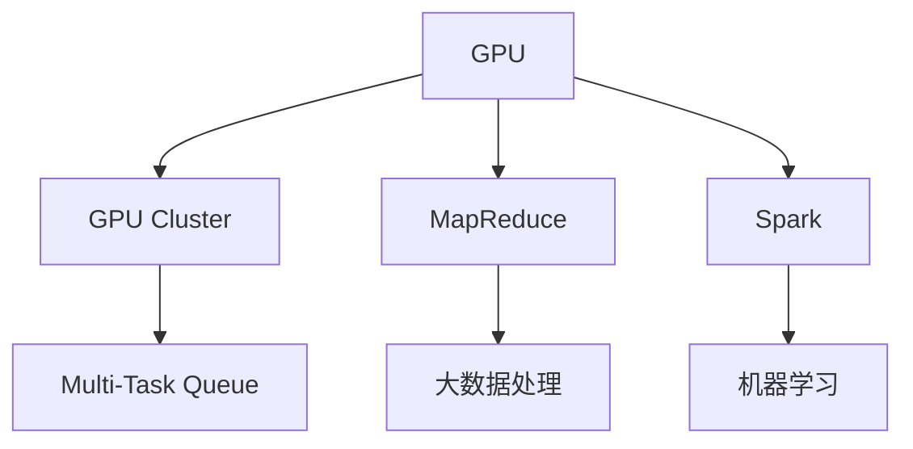

                 

## 1. 背景介绍

### 1.1 问题由来

近年来，随着数据量的爆炸式增长和计算任务的日益复杂，单机无法满足大规模数据处理的需求。传统的分布式计算框架如MapReduce和Spark，虽然可以处理大规模数据，但在并行度和灵活性方面仍有不足。因此，如何构建一个高效、易扩展、易管理的分布式计算环境，成为了一个热点话题。

### 1.2 问题核心关键点

在分布式计算中，如何利用GPU集群加速计算任务，提升系统效率和吞吐量，是一个核心问题。GPU集群（GPU Cluster）是一种由多台计算节点组成，每台节点内有一或多个GPU处理器，通过网络互联实现协同计算的集群系统。分布式计算（Distributed Computing）则是指将一个大规模计算任务分解为多个小任务，由分布在不同计算节点上的多个进程或线程并行处理，以提高计算效率。

GPU集群和分布式计算的结合，可以充分发挥GPU的并行计算能力，提高计算密集型任务的性能。但同时，分布式环境下的协同计算和任务调度，也需要特别注意。本文将对GPU集群和分布式计算的关键技术和应用场景进行详细探讨。

## 2. 核心概念与联系

### 2.1 核心概念概述

为更好地理解GPU集群和分布式计算的原理和架构，本节将介绍几个关键概念：

- **GPU（Graphics Processing Unit）**：一种专门用于加速图形处理和科学计算的硬件设备，拥有高度并行计算能力，广泛应用于深度学习、机器学习等领域。

- **GPU集群（GPU Cluster）**：由多台计算机组成，每台计算机包含至少一个GPU，通过网络互联实现协同计算的集群系统。

- **分布式计算（Distributed Computing）**：将一个计算任务分解成多个子任务，由分布在不同计算节点上的多个进程或线程并行处理，以提高计算效率的计算范式。

- **MapReduce**：一种分布式计算模型，由Google开发，广泛应用于大数据处理和分析领域。

- **Spark**：一种快速、易用的分布式计算框架，支持多种编程语言和数据类型，广泛应用于大数据处理、机器学习等领域。

- **多任务队列（Multi-Task Queue）**：一种基于先进先出（FIFO）原则，按照任务优先级和资源需求分配计算资源的队列管理机制。

这些核心概念之间的逻辑关系可以通过以下Mermaid流程图来展示：



这个流程图展示了大规模数据处理过程中GPU集群和分布式计算的关键组件及其相互关系：

1. GPU作为计算单元，通过集群实现并行计算。
2. MapReduce和Spark作为分布式计算框架，实现任务分解与并行处理。
3. 多任务队列负责任务调度和资源分配，保证计算效率和公平性。

## 3. 核心算法原理 & 具体操作步骤

### 3.1 算法原理概述

GPU集群和分布式计算的核心算法原理主要涉及以下几个方面：

- **数据并行（Data Parallelism）**：将一个大的数据集划分为多个子数据集，每个子数据集在一个GPU上进行计算，最后将所有结果合并。
- **模型并行（Model Parallelism）**：将一个复杂的计算模型分解为多个子模型，每个子模型在一台GPU上并行计算，最后将所有结果合并。
- **任务并行（Task Parallelism）**：将一个计算任务分解为多个子任务，每个子任务在一台GPU上并行计算，最后将所有结果合并。

这些并行计算范式可以大幅提升GPU集群和分布式计算系统的效率和吞吐量，但同时也会带来复杂度增加和通信开销。因此，在具体实现中，需要根据任务特点和计算资源进行优化选择。

### 3.2 算法步骤详解

GPU集群和分布式计算的基本操作流程包括：

1. **数据分发（Data Distribution）**：将大规模数据集划分到多个GPU上进行并行计算。
2. **任务调度（Task Scheduling）**：根据任务特点和计算资源，动态调整任务分配和调度策略。
3. **结果聚合（Result Aggregation）**：将分布在多个GPU上的计算结果合并，输出最终结果。

具体步骤如下：

- **数据划分**：根据数据规模和计算资源，将数据集划分为多个子集，并行处理。
- **任务分发**：将任务分配给GPU集群中的各个节点，并行计算。
- **结果收集**：将各节点的计算结果汇总，输出最终结果。

### 3.3 算法优缺点

GPU集群和分布式计算的优势在于：

- **高效并行**：利用GPU的并行计算能力，大幅提升计算效率。
- **易扩展性**：通过增加计算节点，可以轻松扩展系统处理能力。
- **灵活性**：支持多种计算模型和数据类型，适应不同的应用场景。

但其缺点也显而易见：

- **通信开销**：分布式环境下的数据传输和通信开销较大，影响计算效率。
- **管理复杂性**：分布式系统的管理、调度和故障恢复等，需要复杂的管理机制。
- **资源竞争**：多个任务同时竞争有限的计算资源，可能导致资源争用和效率下降。

### 3.4 算法应用领域

GPU集群和分布式计算已经在诸多领域得到广泛应用，如：

- **深度学习**：用于加速神经网络模型训练和推理，提高计算效率。
- **大数据处理**：支持大规模数据集的处理和分析，如MapReduce和Spark框架的广泛应用。
- **科学计算**：用于加速物理模拟、天气预测等计算密集型任务。
- **分布式机器学习**：支持多台机器协同训练，提高模型精度和效率。
- **高性能计算**：支持大规模数值模拟和复杂计算任务，如金融模型模拟、气象预测等。

## 4. 数学模型和公式 & 详细讲解 & 举例说明

### 4.1 数学模型构建

在分布式计算中，通常使用MapReduce模型进行任务分解和计算。MapReduce模型由两个主要部分组成：Map函数和Reduce函数。

**Map函数**：将输入数据集划分为多个子集，并对每个子集执行计算操作。

**Reduce函数**：将Map函数输出合并，并执行进一步的聚合计算操作。

数学模型可以表示为：

$$
\text{MapReduce} = \{ Map_{i}(x_i) \rightarrow Reduce_i(\{ Map_{i}(x_i) \}_{i \in \{1,2,\dots,N\}}) \}_{i \in \{1,2,\dots,N\}}
$$

其中 $x_i$ 为输入数据，$Map_{i}(x_i)$ 为第 $i$ 个子集在Map函数上的计算结果，$Reduce_i(\{ Map_{i}(x_i) \}_{i \in \{1,2,\dots,N\}})$ 为第 $i$ 个子集在Reduce函数上的计算结果。

### 4.2 公式推导过程

假设输入数据集 $D$ 包含 $N$ 个子集，每个子集大小为 $s$，则总计算量为 $N \times s$。Map函数在每个子集上进行计算，并产生 $N$ 个中间结果。Reduce函数将所有中间结果合并，产生一个最终结果。

假设Map函数和Reduce函数的时间复杂度分别为 $O(s)$ 和 $O(Ns)$，则总计算时间为 $N \times s + Ns = O(Ns)$。

由于GPU集群可以并行处理每个子集，因此可以将 $O(Ns)$ 进一步优化为 $O(s + Ns)$，即 $O(N)$。

### 4.3 案例分析与讲解

以图像处理为例，假设需要对一张包含 $1024 \times 1024$ 像素的图像进行并行处理。可以将图像分为 $1024 \times 1024 \div 4 \times 4 = 256$ 个 $256 \times 256$ 的子图像，每个子图像可以在一个GPU上独立处理。

假设Map函数时间为 $O(256 \times 256) = O(65536)$，Reduce函数时间为 $O(256)$，则总计算时间为 $65536 + 256 = O(65536)$。如果每个GPU并行处理一个子图像，则总计算时间为 $O(256)$。

因此，通过GPU集群和分布式计算，可以大幅提升图像处理的计算效率。

## 5. 项目实践：代码实例和详细解释说明

### 5.1 开发环境搭建

在进行GPU集群和分布式计算的实践前，我们需要准备好开发环境。以下是使用Python进行PyTorch开发的环境配置流程：

1. 安装Anaconda：从官网下载并安装Anaconda，用于创建独立的Python环境。

2. 创建并激活虚拟环境：
```bash
conda create -n pytorch-env python=3.8 
conda activate pytorch-env
```

3. 安装PyTorch：根据CUDA版本，从官网获取对应的安装命令。例如：
```bash
conda install pytorch torchvision torchaudio cudatoolkit=11.1 -c pytorch -c conda-forge
```

4. 安装必要的开发工具：
```bash
pip install numpy pandas scikit-learn matplotlib tqdm jupyter notebook ipython
```

完成上述步骤后，即可在`pytorch-env`环境中开始GPU集群和分布式计算的实践。

### 5.2 源代码详细实现

下面我们以图像处理为例，给出使用PyTorch和DistributedDataParallel（DDP）实现分布式计算的Python代码实现。

首先，定义数据处理函数：

```python
import torch
from torch.utils.data import DataLoader
from torchvision import datasets, transforms

def train_loader(batch_size, num_workers):
    train_dataset = datasets.CIFAR10(root='./data', train=True, download=True,
                                    transform=transforms.Compose([
                                        transforms.Resize((256, 256)),
                                        transforms.ToTensor(),
                                        transforms.Normalize((0.5, 0.5, 0.5), (0.5, 0.5, 0.5))
                                    ]))
    train_loader = DataLoader(train_dataset, batch_size=batch_size, num_workers=num_workers, shuffle=True)
    return train_loader
```

然后，定义模型和优化器：

```python
import torch.nn as nn
import torch.nn.functional as F
import torch.distributed as dist

class Net(nn.Module):
    def __init__(self):
        super(Net, self).__init__()
        self.conv1 = nn.Conv2d(3, 64, 3, 1, 1)
        self.conv2 = nn.Conv2d(64, 128, 3, 1, 1)
        self.fc1 = nn.Linear(128 * 4 * 4, 512)
        self.fc2 = nn.Linear(512, 10)
        
    def forward(self, x):
        x = F.relu(self.conv1(x))
        x = F.max_pool2d(x, 2, 2)
        x = F.relu(self.conv2(x))
        x = F.max_pool2d(x, 2, 2)
        x = x.view(-1, 128 * 4 * 4)
        x = F.relu(self.fc1(x))
        x = self.fc2(x)
        return F.log_softmax(x, dim=1)

device = torch.device('cuda' if torch.cuda.is_available() else 'cpu')
model = Net().to(device)
```

接着，定义训练和评估函数：

```python
from torch import distributed as dist

def train_epoch(model, train_loader, optimizer):
    model.train()
    for data, target in train_loader:
        data, target = data.to(device), target.to(device)
        optimizer.zero_grad()
        output = model(data)
        loss = F.nll_loss(output, target)
        loss.backward()
        optimizer.step()
        dist.barrier()

def evaluate(model, test_loader):
    model.eval()
    correct = 0
    total = 0
    with torch.no_grad():
        for data, target in test_loader:
            data, target = data.to(device), target.to(device)
            output = model(data)
            _, predicted = torch.max(output, 1)
            total += target.size(0)
            correct += (predicted == target).sum().item()
    return correct / total

def main():
    dist.init_process_group('gloo', rank=0, world_size=2)

    train_loader = train_loader(batch_size=64, num_workers=4)
    test_loader = train_loader(batch_size=64, num_workers=4)
    model = Net().to(device)
    optimizer = torch.optim.Adam(model.parameters(), lr=0.001)

    for epoch in range(10):
        train_epoch(model, train_loader, optimizer)
        acc = evaluate(model, test_loader)
        print(f'Epoch {epoch+1}, test acc: {acc:.2f}')

    dist.destroy_process_group()
```

最后，启动训练流程并在测试集上评估：

```python
if __name__ == '__main__':
    main()
```

以上就是使用PyTorch和DistributedDataParallel（DDP）实现分布式计算的完整代码实现。可以看到，通过简单的代码改动，将模型封装在DistributedDataParallel中，即可在多个GPU上进行分布式计算。

### 5.3 代码解读与分析

让我们再详细解读一下关键代码的实现细节：

**train_loader函数**：
- `datasets.CIFAR10`：加载CIFAR-10数据集，并进行预处理，包括缩放、归一化等操作。
- `DataLoader`：将处理后的数据集封装为DataLoader对象，并设置批次大小和并行加载工作数。

**Net类**：
- 定义了卷积神经网络（CNN）模型结构，包括卷积层、池化层、全连接层等。
- `.to(device)`：将模型迁移到GPU设备。

**train_epoch函数**：
- 在每个epoch内，遍历训练数据集，将数据迁移到GPU设备。
- 调用前向传播和反向传播函数，更新模型参数。
- 使用`dist.barrier()`进行分布式计算的同步。

**evaluate函数**：
- 在每个epoch内，遍历测试数据集，计算模型在测试集上的准确率。

**main函数**：
- `dist.init_process_group`：初始化分布式计算环境，创建多个进程。
- `dist.destroy_process_group`：结束分布式计算环境，释放资源。

可以看到，通过使用PyTorch的DistributedDataParallel，可以轻松实现分布式计算，大大提升计算效率。同时，代码的实现也非常简洁，开发者可以专注于模型和算法的设计，而不需要过多关注并行计算的细节。

## 6. 实际应用场景

### 6.1 大数据处理

在大数据处理场景中，GPU集群和分布式计算可以处理大规模数据集，并进行高效的数据预处理、特征工程和模型训练。例如，在自然语言处理（NLP）领域，可以使用MapReduce和Spark框架处理大规模文本数据，进行分词、去重、清洗等预处理操作，并在GPU集群上进行深度学习模型的训练和推理。

### 6.2 深度学习模型训练

在深度学习模型训练场景中，GPU集群和分布式计算可以显著提升模型训练速度和效率。例如，在图像识别、语音识别等计算机视觉和语音识别任务中，可以使用GPU集群进行大规模数据集的处理和模型训练，提升模型的精度和泛化能力。

### 6.3 科学计算

在科学计算场景中，GPU集群和分布式计算可以处理复杂的数值计算任务，如天气预测、金融模拟等。通过分布式计算，可以在较短的时间内完成大规模数值模拟，为科研和生产决策提供有力支持。

### 6.4 未来应用展望

随着GPU集群和分布式计算技术的不断发展，未来将有更多领域受益于这些技术，如智能制造、智慧城市、智能交通等。通过分布式计算，可以实现实时数据处理和智能决策，提升系统的效率和可靠性。同时，随着量子计算和分布式AI技术的进一步发展，GPU集群和分布式计算也将迎来新的突破，为人类认知智能的进化提供新的可能性。

## 7. 工具和资源推荐

### 7.1 学习资源推荐

为了帮助开发者系统掌握GPU集群和分布式计算的理论基础和实践技巧，这里推荐一些优质的学习资源：

1. **PyTorch官方文档**：PyTorch的官方文档，提供了丰富的分布式计算示例和教程，适合初学者和高级开发者。

2. **TensorFlow分布式计算教程**：TensorFlow的官方文档，提供了分布式计算和GPU集群管理方面的详细教程。

3. **Hadoop官方文档**：Hadoop的官方文档，提供了大规模数据处理和分布式计算的详细介绍，适合对大规模数据处理感兴趣的学习者。

4. **Spark官方文档**：Spark的官方文档，提供了分布式计算和机器学习方面的详细教程，适合对大数据处理感兴趣的学习者。

5. **《深入分布式计算》书籍**：介绍分布式计算和GPU集群管理的经典书籍，适合深入学习分布式计算技术的读者。

通过这些资源的学习实践，相信你一定能够快速掌握GPU集群和分布式计算的精髓，并用于解决实际的计算任务。

### 7.2 开发工具推荐

高效的开发离不开优秀的工具支持。以下是几款用于GPU集群和分布式计算开发的常用工具：

1. **PyTorch**：基于Python的开源深度学习框架，灵活动态的计算图，适合快速迭代研究。

2. **TensorFlow**：由Google主导开发的开源深度学习框架，生产部署方便，适合大规模工程应用。

3. **Hadoop**：一个开源的分布式计算框架，用于大规模数据处理和存储。

4. **Spark**：一个快速、易用的分布式计算框架，支持多种编程语言和数据类型，广泛应用于大数据处理和机器学习等领域。

5. **Kubernetes**：一个开源的容器编排平台，用于管理和扩展分布式计算集群。

合理利用这些工具，可以显著提升GPU集群和分布式计算任务的开发效率，加快创新迭代的步伐。

### 7.3 相关论文推荐

GPU集群和分布式计算的发展源于学界的持续研究。以下是几篇奠基性的相关论文，推荐阅读：

1. **MapReduce: Simplified Data Processing on Large Clusters**：Google开发的MapReduce框架，广泛应用于大数据处理领域。

2. **Spark: Cluster Computing with Fault Tolerance**：Apache开发的Spark框架，支持多种编程语言和数据类型，广泛应用于大数据处理和机器学习等领域。

3. **Distributed TensorFlow**：Google开发的TensorFlow分布式计算框架，支持在多个GPU和多个计算机上并行计算。

4. **TensorFlow Distributed Training**：TensorFlow的分布式训练文档，提供了丰富的分布式计算和GPU集群管理的细节。

5. **Distributed Computing with GPU Accelerators**：介绍如何在分布式计算环境中使用GPU加速的综述性论文。

这些论文代表了大规模数据处理和分布式计算的发展脉络。通过学习这些前沿成果，可以帮助研究者把握学科前进方向，激发更多的创新灵感。

## 8. 总结：未来发展趋势与挑战

### 8.1 总结

本文对GPU集群和分布式计算的关键技术和应用场景进行了全面系统的介绍。首先阐述了GPU集群和分布式计算的研究背景和意义，明确了这些技术在处理大规模数据和计算密集型任务中的重要价值。其次，从原理到实践，详细讲解了分布式计算的数学模型和关键步骤，给出了分布式计算任务开发的完整代码实例。同时，本文还广泛探讨了分布式计算在多个领域的应用前景，展示了分布式计算技术的巨大潜力。

通过本文的系统梳理，可以看到，GPU集群和分布式计算技术正在成为计算密集型任务的重要支撑，极大地提升了数据处理和计算效率。未来，伴随硬件计算能力的提升和算法优化，分布式计算技术必将进一步拓展其应用边界，为各行各业带来革命性变革。

### 8.2 未来发展趋势

展望未来，GPU集群和分布式计算技术将呈现以下几个发展趋势：

1. **计算效率提升**：随着硬件计算能力的提升和优化算法的研究，分布式计算的效率和吞吐量将进一步提升，满足更复杂的计算需求。

2. **易用性和灵活性增强**：分布式计算框架将更加易用和灵活，支持更多的编程语言和数据类型，满足不同应用场景的需求。

3. **智能化管理**：分布式计算系统将引入更多智能化管理机制，如自动负载均衡、动态资源调度等，提升系统的可靠性和稳定性。

4. **跨平台支持**：分布式计算框架将支持更多的计算平台和设备，如云计算、边缘计算等，适应不同环境下的计算需求。

5. **集成化协同**：分布式计算将与其他技术进行更深层次的集成，如人工智能、大数据、区块链等，形成更全面、高效的计算环境。

以上趋势凸显了GPU集群和分布式计算技术的广阔前景。这些方向的探索发展，必将进一步提升计算密集型任务的效率和可靠性，为各行各业带来新的机遇和挑战。

### 8.3 面临的挑战

尽管GPU集群和分布式计算技术已经取得了瞩目成就，但在迈向更加智能化、普适化应用的过程中，它仍面临着诸多挑战：

1. **管理复杂性**：分布式系统需要复杂的管理和调度和故障恢复机制，增加了系统的复杂性。

2. **通信开销**：分布式环境下的数据传输和通信开销较大，影响计算效率。

3. **资源竞争**：多个任务同时竞争有限的计算资源，可能导致资源争用和效率下降。

4. **安全性和隐私**：分布式系统中的数据传输和存储需要严格的安全性和隐私保护措施，防止数据泄露和滥用。

5. **系统容错和可靠性**：分布式系统的可靠性和容错性需要进一步提升，防止单点故障影响整个系统。

6. **计算资源成本**：大规模分布式计算需要投入大量的计算资源，增加了系统的成本和复杂性。

正视分布式计算面临的这些挑战，积极应对并寻求突破，将是大规模计算系统迈向成熟的必由之路。相信随着学界和产业界的共同努力，这些挑战终将一一被克服，分布式计算技术必将引领计算密集型任务的进步。

### 8.4 研究展望

面对GPU集群和分布式计算所面临的种种挑战，未来的研究需要在以下几个方面寻求新的突破：

1. **自动化管理**：引入更多自动化管理机制，如自动负载均衡、动态资源调度等，提升系统的可靠性和稳定性。

2. **优化通信开销**：优化数据传输和通信机制，减少通信开销，提升系统效率。

3. **分布式协同学习**：结合分布式计算和人工智能技术，实现多台机器协同学习，提升模型的精度和泛化能力。

4. **跨平台集成**：支持更多的计算平台和设备，如云计算、边缘计算等，适应不同环境下的计算需求。

5. **安全性和隐私保护**：引入更严格的安全性和隐私保护措施，防止数据泄露和滥用。

6. **容错和可靠性**：提升系统的可靠性和容错性，防止单点故障影响整个系统。

这些研究方向将引领GPU集群和分布式计算技术迈向更高的台阶，为构建高效、可靠、安全的计算系统提供有力支持。面向未来，分布式计算技术还需要与其他技术进行更深入的融合，如人工智能、大数据、区块链等，多路径协同发力，共同推动计算密集型任务的进步。

## 9. 附录：常见问题与解答

**Q1：分布式计算中的数据传输和通信开销如何优化？**

A: 数据传输和通信开销是分布式计算中的主要瓶颈。常见的优化方法包括：

1. 数据压缩：对传输数据进行压缩，减少传输量和带宽占用。
2. 数据本地化：将数据存储在计算节点本地，减少跨节点传输。
3. 异步通信：使用异步通信机制，减少通信阻塞。
4. 带宽优化：使用高效的通信协议，如环状通信、树形通信等，优化带宽使用。
5. 分布式缓存：使用分布式缓存机制，减少数据复制和重复计算。

通过这些优化方法，可以显著降低数据传输和通信开销，提升分布式计算的效率。

**Q2：如何选择合适的分布式计算框架？**

A: 选择合适的分布式计算框架需要考虑以下几个因素：

1. 任务特点：根据任务的计算密集度和数据规模，选择合适的计算框架。例如，对于大数据处理任务，可以选择Hadoop、Spark等框架；对于深度学习任务，可以选择TensorFlow、PyTorch等框架。
2. 技术栈：根据开发团队的技术栈，选择合适的计算框架。例如，Python开发团队可以选择PyTorch、TensorFlow等框架，C++开发团队可以选择Spark、Hadoop等框架。
3. 易用性：根据开发团队的技术水平和经验，选择易用性较高的计算框架。例如，初学者可以选择PyTorch、TensorFlow等框架，有经验的开发者可以选择Spark、Hadoop等框架。
4. 社区支持：根据框架的社区支持和文档资料，选择有广泛社区支持和丰富文档资料的计算框架。例如，TensorFlow、PyTorch等框架有丰富的社区支持和文档资料，适合新手学习。

通过综合考虑这些因素，可以选择最适合自身需求和条件的分布式计算框架。

**Q3：分布式计算中的资源竞争和调度如何处理？**

A: 分布式计算中的资源竞争和调度可以通过以下几个方法处理：

1. 资源预留：为重要任务预留计算资源，避免资源争用。
2. 优先级调度：根据任务的优先级和资源需求，动态调整任务调度策略。
3. 资源隔离：使用容器化技术，将任务隔离在不同的计算节点上，避免资源争用。
4. 弹性伸缩：根据任务负载动态调整计算资源，提升系统的灵活性和可扩展性。
5. 故障恢复：引入自动故障恢复机制，保证系统的可靠性和稳定性。

通过这些方法，可以合理处理资源竞争和调度问题，提升分布式计算系统的效率和可靠性。

**Q4：分布式计算中的安全性和隐私保护如何实现？**

A: 分布式计算中的安全性和隐私保护可以通过以下几个方法实现：

1. 数据加密：对传输和存储的数据进行加密，防止数据泄露。
2. 访问控制：使用访问控制机制，限制对敏感数据的访问权限。
3. 数据匿名化：对敏感数据进行匿名化处理，防止数据滥用。
4. 多节点复制：使用多节点复制机制，防止单点故障导致的数据丢失。
5. 审计和监控：使用审计和监控机制，实时监控系统安全性和隐私保护状况。

通过这些方法，可以保障分布式计算系统的安全性和隐私保护，防止数据泄露和滥用。

**Q5：分布式计算中的故障恢复和可靠性如何提升？**

A: 分布式计算中的故障恢复和可靠性可以通过以下几个方法提升：

1. 数据备份：使用数据备份机制，防止数据丢失。
2. 自动重启：使用自动重启机制，快速恢复故障节点。
3. 冗余设计：使用冗余设计，增加系统的可靠性和容错性。
4. 监控告警：使用监控告警机制，及时发现和处理故障。
5. 负载均衡：使用负载均衡机制，避免单点故障影响整个系统。

通过这些方法，可以提升分布式计算系统的可靠性和容错性，确保系统稳定运行。

总之，分布式计算技术正在快速发展，为处理大规模数据和计算密集型任务提供了新的解决方案。但同时，系统管理和优化仍然面临诸多挑战。唯有不断优化算法和框架，引入智能化管理机制，才能更好地应对未来计算任务的需求。面向未来，分布式计算技术必将在各行各业发挥重要作用，引领计算密集型任务的进步。

---

作者：禅与计算机程序设计艺术 / Zen and the Art of Computer Programming

