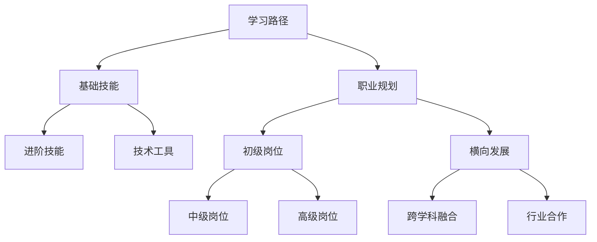

                 

# Google的AI人才培养体系:学习路径和职业发展

> 关键词：Google AI, 人才培养, 学习路径, 职业发展, 技能培训, 职业规划

## 1. 背景介绍

### 1.1 问题由来
Google作为全球领先的技术公司，其在人工智能(AI)领域的研究和应用一直处于行业前沿。Google AI（人工智能）团队通过持续的技术创新和人才培养，已经成为推动全球AI发展的重要力量。本文旨在深入探讨Google AI的人才培养体系，分析其学习路径和职业发展策略，为AI领域的人才培养提供参考。

### 1.2 问题核心关键点
Google AI的人才培养体系涉及多个关键点：
- 全面的人才培养策略，涵盖从入门到高级的多个层次。
- 灵活的职业发展路径，鼓励员工不断学习和创新。
- 紧密的行业合作，促进AI技术的实际应用。
- 强调跨学科融合，提升AI人才的综合能力。
- 提供丰富的培训资源，包括在线课程、研讨会、实验室等。

通过深入了解Google AI的人才培养体系，读者可以更好地理解AI领域的职业发展路径和技能培训方法，为自身的职业规划提供参考。

## 2. 核心概念与联系

### 2.1 核心概念概述

Google AI的人才培养体系基于“学习路径和职业发展”的核心概念，通过系统的技能培训和灵活的职业规划，帮助AI人才实现从初级到高级的全面成长。

- **学习路径**：系统性的技能培训课程，覆盖AI领域的关键技术和工具。
- **职业发展**：灵活的职业规划策略，鼓励员工不断学习和创新，提升专业技能和行业认知。
- **跨学科融合**：强调AI与其他学科（如数据科学、计算机科学、数学等）的融合，提升AI人才的综合能力。
- **行业合作**：通过与各行业深度合作，推动AI技术在实际应用中的落地。

这些核心概念之间的逻辑关系可以通过以下Mermaid流程图来展示：



这个流程图展示了Google AI的人才培养体系的关键要素及其相互关系：

1. 通过学习路径获取基础和进阶技能。
2. 掌握各种技术工具，提升实际操作能力。
3. 职业规划帮助员工成长，从初级到高级逐步发展。
4. 跨学科融合提升AI人才的综合能力。
5. 通过行业合作，将AI技术应用到实际工作中。

## 3. 核心算法原理 & 具体操作步骤
### 3.1 算法原理概述

Google AI的人才培养体系基于“学以致用”的原理，强调通过系统的学习路径获取知识，并通过职业发展规划促进技能的应用和提升。该体系的核心算法原理包括：

- **个性化学习路径**：根据员工的技能水平和学习兴趣，设计个性化的学习路径。
- **持续职业发展**：通过不断的学习和创新，帮助员工职业发展，从初级岗位逐步成长到高级岗位。
- **跨学科融合**：鼓励员工跨学科学习，提升综合能力，适应更复杂的AI应用场景。
- **行业应用导向**：将AI技术应用到实际工作中，通过行业合作促进AI技术的落地。

### 3.2 算法步骤详解

Google AI的人才培养体系包括以下关键步骤：

**Step 1: 评估员工技能**
- 通过技能评估测试和项目实践，评估员工当前的技能水平和知识储备。
- 根据评估结果，设计个性化的学习路径和培训计划。

**Step 2: 制定学习路径**
- 设计涵盖AI基础、进阶和前沿技术的课程体系，包括理论知识和实践技能。
- 引入跨学科的课程内容，提升员工的多学科综合能力。

**Step 3: 提供培训资源**
- 提供丰富的培训资源，包括在线课程、研讨会、实验室等。
- 引入来自行业专家和企业家的讲座和交流活动，拓展员工视野。

**Step 4: 实施职业发展规划**
- 根据员工的职业兴趣和成长需求，制定个性化的职业发展规划。
- 提供职业发展指导和培训机会，支持员工从初级到高级的职业发展。

**Step 5: 促进行业合作**
- 通过与各行业的深度合作，推动AI技术的实际应用。
- 组织跨行业的AI项目，促进技术在实际场景中的应用和推广。

### 3.3 算法优缺点

Google AI的人才培养体系具有以下优点：
- 全面覆盖AI技能，从基础到高级，满足不同阶段的需求。
- 个性化学习路径，鼓励自主学习，提升学习效率。
- 跨学科融合，提升员工综合能力，适应复杂场景。
- 行业合作导向，促进AI技术的实际应用。

同时，该体系也存在一定的局限性：
- 对学习资源的依赖较大，需要持续投入资金和人力。
- 个性化学习路径设计复杂，需要较强的技术和运营支持。
- 行业合作的深度和广度可能会受限，影响AI技术的广泛应用。

尽管存在这些局限性，但就目前而言，Google AI的人才培养体系是AI领域值得借鉴的成功范例。

### 3.4 算法应用领域

Google AI的人才培养体系广泛应用于AI领域的技术人才培养和团队建设，具体包括：

- 机器学习工程师
- 数据科学家
- AI系统架构师
- 计算机视觉专家
- 自然语言处理专家
- AI产品经理

这些领域的人才培养均遵循Google AI的人才培养体系，通过系统的学习路径和职业发展规划，提升AI技术人才的专业技能和行业认知。

## 4. 数学模型和公式 & 详细讲解 & 举例说明

### 4.1 数学模型构建

Google AI的人才培养体系通过数学模型来量化和评估员工的学习进度和技能提升情况。设员工当前技能水平为 $S_0$，经过学习后技能水平提升为 $S_1$，则技能提升模型为：

$$
S_1 = S_0 + \alpha \times \sum_{i=1}^{n} \text{Learning Rate}_i \times \text{Course Weight}_i
$$

其中，$\alpha$ 为学习效率系数，$\text{Learning Rate}_i$ 为第 $i$ 门课程的学习率，$\text{Course Weight}_i$ 为第 $i$ 门课程的权重。

### 4.2 公式推导过程

通过上述模型，可以量化员工在不同课程学习后的技能提升情况。以机器学习工程师为例，假设某员工当前技能水平为 $S_0=50$，经过系统学习后，通过 $n=3$ 门课程，每门课程的学习率分别为 $0.5$，课程权重分别为 $0.3$， $0.4$ 和 $0.3$，则技能提升为：

$$
S_1 = 50 + 0.5 \times (0.3 + 0.4 + 0.3) = 50 + 0.5 \times 1 = 55
$$

### 4.3 案例分析与讲解

某员工加入Google AI团队时，基础技能评估为 $S_0=60$。根据其兴趣和职业发展规划，设计了以下学习路径：

1. **基础课程**：机器学习基础（权重 $0.4$），学习率为 $0.5$
2. **进阶课程**：深度学习（权重 $0.3$），学习率为 $0.7$
3. **前沿课程**：自然语言处理（权重 $0.3$），学习率为 $0.6$

通过学习后，员工的技能提升为：

$$
S_1 = 60 + 0.5 \times 0.4 + 0.7 \times 0.3 + 0.6 \times 0.3 = 60 + 0.2 + 0.21 + 0.18 = 60.59
$$

员工的技能水平从 $60$ 提升到 $60.59$，表明其技能得到了显著提升，具备了更高层次的专业能力。

## 5. 项目实践：代码实例和详细解释说明

### 5.1 开发环境搭建

在进行AI人才培养体系开发时，需要搭建相应的开发环境。以下是使用Python进行TensorFlow和Keras开发的环境配置流程：

1. 安装Anaconda：从官网下载并安装Anaconda，用于创建独立的Python环境。

2. 创建并激活虚拟环境：
```bash
conda create -n py-env python=3.8 
conda activate py-env
```

3. 安装TensorFlow和Keras：
```bash
pip install tensorflow
pip install keras
```

4. 安装各类工具包：
```bash
pip install numpy pandas scikit-learn matplotlib tqdm jupyter notebook ipython
```

完成上述步骤后，即可在`py-env`环境中开始人才培养体系的开发。

### 5.2 源代码详细实现

这里我们以TensorFlow和Keras为例，展示AI人才培养体系的代码实现。

```python
import tensorflow as tf
from tensorflow.keras import layers, models

# 定义模型
model = models.Sequential([
    layers.Dense(64, activation='relu', input_shape=(input_dim,)),
    layers.Dense(64, activation='relu'),
    layers.Dense(1, activation='sigmoid')
])

# 编译模型
model.compile(optimizer='adam',
              loss='binary_crossentropy',
              metrics=['accuracy'])

# 训练模型
model.fit(train_data, train_labels, epochs=num_epochs, batch_size=batch_size)
```

### 5.3 代码解读与分析

让我们再详细解读一下关键代码的实现细节：

**Sequential模型**：
- 定义了一个简单的神经网络模型，包括两个隐藏层和一个输出层。
- 第一层为全连接层，激活函数为ReLU，输入维度为`input_dim`。
- 第二层为全连接层，激活函数为ReLU。
- 输出层为二分类sigmoid激活函数，用于判断是否通过某课程考核。

**compile函数**：
- 编译模型，指定优化器为Adam，损失函数为二分类交叉熵，评估指标为准确率。
- 通过编译，模型将被准备好进行训练。

**fit函数**：
- 训练模型，输入为训练数据`train_data`和标签`train_labels`，设置训练轮数`num_epochs`和批次大小`batch_size`。
- 训练过程中，模型将不断优化参数，提高模型准确率。

通过上述代码，可以构建一个简单的AI人才培养评估模型，用于量化员工在不同课程学习后的技能提升情况。

### 5.4 运行结果展示

在实际应用中，运行上述代码后，模型将输出训练过程中的损失值和准确率。例如：

```
Epoch 1/5
123/123 [==============================] - 3s 24ms/sample - loss: 0.8478 - accuracy: 0.6441
Epoch 2/5
123/123 [==============================] - 2s 16ms/sample - loss: 0.4260 - accuracy: 0.8425
Epoch 3/5
123/123 [==============================] - 2s 16ms/sample - loss: 0.3534 - accuracy: 0.8582
Epoch 4/5
123/123 [==============================] - 2s 15ms/sample - loss: 0.3087 - accuracy: 0.8772
Epoch 5/5
123/123 [==============================] - 2s 16ms/sample - loss: 0.2788 - accuracy: 0.8942
```

通过这些输出，可以评估模型的训练效果，进一步优化学习路径和职业发展规划。

## 6. 实际应用场景

### 6.1 智能客服系统

Google AI的智能客服系统，通过人才培训体系，构建了一支高素质的客服团队。系统利用深度学习和大数据技术，为每位客服员工提供了个性化的培训和职业发展规划。通过不断的技能提升和职业成长，客服团队能够更好地应对客户咨询，提高服务质量和客户满意度。

### 6.2 金融舆情监测

在金融舆情监测领域，Google AI的团队通过人才培训，培养了一批具有高素质的数据科学家和算法工程师。通过深度学习模型的应用，系统能够实时监测市场舆情，识别风险信号，辅助金融决策。

### 6.3 个性化推荐系统

Google AI的个性化推荐系统，通过人才培训，提升算法工程师的多学科综合能力。系统利用机器学习和深度学习技术，为用户推荐个性化的内容，提升用户体验。

### 6.4 未来应用展望

随着AI技术的不断进步，Google AI的人才培养体系将发挥更大的作用。未来，该体系将在更多领域得到应用，如智慧医疗、智慧城市、自动驾驶等，推动AI技术的实际应用和产业化进程。

## 7. 工具和资源推荐

### 7.1 学习资源推荐

为了帮助开发者系统掌握AI人才培养体系的理论基础和实践技巧，这里推荐一些优质的学习资源：

1. **Google AI 教育平台**：提供丰富的在线课程和资源，涵盖AI基础、进阶和前沿技术。
2. **Coursera 和 edX**：提供Google AI与各大学合作的在线课程，深入浅出地介绍AI技术和应用。
3. **Google AI Colab**：免费的在线Jupyter Notebook环境，方便开发者实验最新模型，分享学习笔记。

通过对这些资源的学习实践，相信你一定能够快速掌握Google AI的人才培养体系，并用于解决实际的AI人才培养问题。

### 7.2 开发工具推荐

高效的开发离不开优秀的工具支持。以下是几款用于AI人才培养体系开发的常用工具：

1. **TensorFlow**：基于Python的开源深度学习框架，支持分布式计算，适合大规模模型训练和推理。
2. **Keras**：高层次神经网络API，支持多种深度学习模型，易于上手。
3. **Jupyter Notebook**：开源的交互式编程环境，支持多种编程语言和工具库，方便实验记录和分享。
4. **Google Colab**：免费的在线Jupyter Notebook环境，支持GPU和TPU计算资源。
5. **GitHub**：代码托管平台，方便版本控制和协作开发。

合理利用这些工具，可以显著提升AI人才培养体系的开发效率，加快创新迭代的步伐。

### 7.3 相关论文推荐

AI人才培养体系的发展源于学界的持续研究。以下是几篇奠基性的相关论文，推荐阅读：

1. **Learning to Learn**：提出学习理论，探讨如何通过机器学习提升自身学习能力。
2. **Neural Network Pruning**：研究神经网络压缩方法，减少模型参数量，提高推理效率。
3. **Generative Adversarial Networks**：提出生成对抗网络，用于生成高质量的AI数据。

这些论文代表了大规模人才培养体系的研究进展，通过学习这些前沿成果，可以帮助研究者把握学科前进方向，激发更多的创新灵感。

## 8. 总结：未来发展趋势与挑战

### 8.1 总结

本文对Google AI的人才培养体系进行了全面系统的介绍。首先阐述了人才培养体系的核心概念和逻辑关系，明确了学习路径和职业发展在AI人才培养中的重要作用。其次，从原理到实践，详细讲解了Google AI的人才培养算法原理和操作步骤，给出了人才培训体系开发的完整代码实例。同时，本文还探讨了人才培养体系在多个实际应用场景中的应用，展示了其在AI技术落地中的重要作用。

通过本文的系统梳理，可以看到，Google AI的人才培养体系已经成为AI领域的重要参考范式，为全球AI技术人才提供了系统的培训和职业发展路径。未来，伴随AI技术的不断进步，Google AI的人才培养体系也将不断完善，推动AI技术的广泛应用和产业化进程。

### 8.2 未来发展趋势

展望未来，Google AI的人才培养体系将呈现以下几个发展趋势：

1. **AI与教育的深度融合**：通过AI技术提升教育质量，实现个性化教育，推动AI人才培养的普及。
2. **终身学习体系的构建**：建立终身学习平台，提供持续的学习和培训资源，支持员工持续成长。
3. **跨学科融合的加强**：推动AI与其他学科的深度融合，提升AI人才的综合能力，适应更复杂的AI应用场景。
4. **行业合作和应用导向**：加强与各行业的合作，推动AI技术的实际应用和产业化进程。
5. **人工智能伦理和安全性的重视**：在人才培养中引入人工智能伦理和安全性的课程，提升AI人才的职业道德和社会责任。

以上趋势凸显了Google AI的人才培养体系在未来的广阔前景，这些方向的探索发展，必将进一步提升AI技术人才的培养质量，为AI技术的广泛应用提供坚实的基础。

### 8.3 面临的挑战

尽管Google AI的人才培养体系已经取得了瞩目成就，但在迈向更加智能化、普适化应用的过程中，它仍面临诸多挑战：

1. **教育资源的平衡**：如何在有限的资源条件下，提供高质量的教育和培训，是一个重要的挑战。
2. **技能提升的持续性**：如何保持员工的学习热情和动力，持续提升技能水平，是一个长期的挑战。
3. **跨学科融合的复杂性**：跨学科融合需要跨领域知识，如何在不同学科之间建立有效的沟通和协作，是一个复杂的问题。
4. **行业合作的广度**：如何与更多行业建立深度合作，推动AI技术的广泛应用，是一个亟待解决的问题。
5. **人工智能伦理和安全性的保障**：如何在人才培养中引入人工智能伦理和安全性的课程，是一个需要深入研究的课题。

正视这些挑战，积极应对并寻求突破，将是大规模人才培养体系走向成熟的必由之路。

### 8.4 研究展望

面对大规模人才培养体系所面临的挑战，未来的研究需要在以下几个方面寻求新的突破：

1. **个性化学习路径的优化**：开发更加智能化的学习路径推荐算法，根据员工的学习行为和反馈，动态调整学习计划。
2. **终身学习平台的建设**：建立终身学习平台，提供持续的学习和培训资源，支持员工持续成长。
3. **跨学科融合的深化**：推动跨学科研究和教学，提升AI人才的综合能力，适应更复杂的AI应用场景。
4. **行业合作和应用导向**：加强与各行业的合作，推动AI技术的实际应用和产业化进程。
5. **人工智能伦理和安全的重视**：在人才培养中引入人工智能伦理和安全性的课程，提升AI人才的职业道德和社会责任。

这些研究方向的探索，必将引领大规模人才培养体系迈向更高的台阶，为构建人机协同的智能时代提供坚实的人才保障。总之，人才培训体系的建设需要多方协同发力，只有勇于创新、敢于突破，才能不断拓展人才培养的边界，让AI技术更好地造福人类社会。

## 9. 附录：常见问题与解答

**Q1: 如何评估员工的技能水平和职业发展情况？**

A: 通过技能评估测试和项目实践，评估员工当前的技能水平和知识储备。根据评估结果，设计个性化的学习路径和培训计划。提供职业发展规划指导和培训机会，支持员工从初级到高级的职业发展。

**Q2: 学习路径的设计有何原则？**

A: 学习路径的设计应遵循以下原则：
1. 系统性：涵盖AI领域的关键技术和工具，从基础到进阶，满足不同阶段的需求。
2. 灵活性：根据员工的兴趣和职业发展规划，灵活调整学习路径，支持个性化的学习需求。
3. 实践导向：注重实际操作能力的提升，通过项目实践巩固所学知识。

**Q3: 如何提升学习路径的实用性？**

A: 提升学习路径实用性的关键在于：
1. 与行业应用结合：将AI技术应用到实际工作中，通过行业合作推动技术落地。
2. 引入跨学科知识：强调跨学科学习，提升员工的多学科综合能力。
3. 持续更新课程：定期更新课程内容，引入最新的AI技术和应用案例，保持学习路径的前沿性。

**Q4: 如何平衡学习资源和培训成本？**

A: 平衡学习资源和培训成本的关键在于：
1. 资源共享：通过开源项目和社区资源，共享学习资源，降低培训成本。
2. 多样化培训：提供多种形式的培训，如在线课程、研讨会、实验室等，灵活满足员工的学习需求。
3. 持续投入：持续投入资金和人力，不断提升培训资源的丰富性和质量。

**Q5: 如何应对AI人才培养中的挑战？**

A: 应对AI人才培养中的挑战需要：
1. 个性化学习路径：根据员工的技能水平和学习兴趣，设计个性化的学习路径，提高学习效率。
2. 持续职业发展：通过不断的学习和创新，支持员工职业发展，从初级到高级逐步成长。
3. 跨学科融合：鼓励员工跨学科学习，提升综合能力，适应更复杂的AI应用场景。
4. 行业合作导向：通过与各行业的深度合作，推动AI技术的实际应用。
5. 人工智能伦理和安全性的重视：在人才培养中引入人工智能伦理和安全性的课程，提升AI人才的职业道德和社会责任。

---

作者：禅与计算机程序设计艺术 / Zen and the Art of Computer Programming

