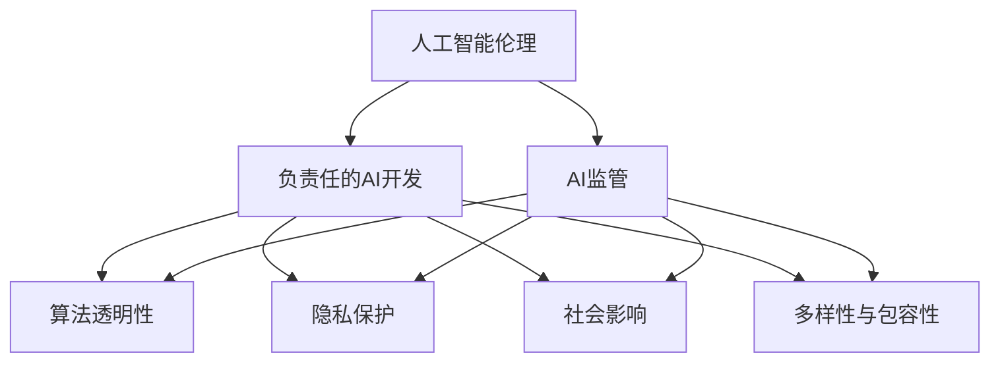

                 

# Google的AI伦理原则:负责任的AI开发和部署

> 关键词：人工智能伦理,负责任开发,AI监管,道德边界,算法透明性,隐私保护,社会影响,多样性与包容性,负责任的AI部署

## 1. 背景介绍

### 1.1 问题由来

随着人工智能（AI）技术的迅猛发展，其在医疗、交通、金融、教育等领域的应用日益广泛。然而，AI的广泛应用也带来了诸多伦理挑战。如何确保AI技术的公正性、透明性、安全性以及可解释性，成为全球关注的焦点。

### 1.2 问题核心关键点

Google作为全球AI领域的领军企业之一，一直以来都非常重视AI伦理问题。其AI伦理原则主要体现在以下几个方面：

- **公平性**：确保AI系统在不同人群、不同环境中的公平性，避免偏见和歧视。
- **透明度**：AI系统的决策过程应公开透明，用户应能理解AI的决策依据。
- **安全性**：AI系统应确保用户和系统的安全，防止恶意攻击和错误决策。
- **隐私保护**：保护用户隐私，遵守数据隐私法规，防止数据滥用。
- **社会影响**：AI应积极促进社会福祉，避免对社会产生负面影响。
- **多样性与包容性**：AI系统应考虑到社会多样性，确保包容性。
- **负责任的AI部署**：在AI开发和部署过程中，应考虑伦理、法律、社会等多方面因素，确保负责任的AI实践。

Google的AI伦理原则为全球AI开发和部署提供了有益的参考和指导，具有广泛的影响力和实践价值。

## 2. 核心概念与联系

### 2.1 核心概念概述

为了更好地理解Google的AI伦理原则，本节将介绍几个关键概念及其相互联系：

- **人工智能伦理（AI Ethics）**：研究AI技术的伦理影响和道德边界，确保AI技术的发展与社会价值观相一致。
- **负责任的AI开发（Responsible AI Development）**：在AI开发过程中，考虑到伦理、法律、社会等多方面因素，确保AI系统的公平性、透明性和安全性。
- **AI监管（AI Regulation）**：政府和社会对AI技术应用的监督和管理，确保AI技术的发展符合社会规范。
- **算法透明性（Algorithmic Transparency）**：AI系统的决策过程应公开透明，用户应能理解AI的决策依据。
- **隐私保护（Privacy Protection）**：在AI系统的设计和实施过程中，保护用户的隐私，防止数据滥用。
- **社会影响（Social Impact）**：AI技术对社会的影响，包括对就业、教育、医疗等方面的影响，应积极促进社会福祉。
- **多样性与包容性（Diversity and Inclusion）**：AI系统应考虑到社会多样性，确保包容性，避免对特定群体造成偏见和歧视。

这些核心概念之间的逻辑关系可以通过以下Mermaid流程图来展示：



这个流程图展示了一些核心概念之间的相互关系：

1. 人工智能伦理是AI开发和部署的基础，确保AI技术的发展与社会价值观相一致。
2. 负责任的AI开发是AI伦理的具体实践，强调在开发过程中考虑伦理、法律、社会等多方面因素。
3. AI监管对AI开发和部署具有指导和约束作用，确保AI技术的发展符合社会规范。
4. 算法透明性、隐私保护、社会影响和多样性与包容性是负责任的AI开发的四个关键维度，共同构成一个负责任的AI生态系统。

## 3. 核心算法原理 & 具体操作步骤

### 3.1 算法原理概述

Google的AI伦理原则主要通过以下几个核心算法原理和操作步骤来实施：

1. **公平性算法**：在AI模型训练和评估过程中，确保不同人群、不同环境的公平性。
2. **透明度算法**：在AI模型的决策过程中，提供可解释性和透明性，确保用户能理解AI的决策依据。
3. **安全性算法**：在AI模型的设计和实施过程中，确保系统的安全性和鲁棒性，防止恶意攻击和错误决策。
4. **隐私保护算法**：在数据收集和处理过程中，采用隐私保护技术，确保用户隐私和数据安全。
5. **社会影响算法**：在AI模型的设计和实施过程中，考虑其对社会的影响，确保AI技术促进社会福祉。
6. **多样性与包容性算法**：在AI模型的设计和实施过程中，考虑到社会多样性，确保包容性。

这些算法原理通过具体的步骤来实现：

1. **数据收集和处理**：收集和处理数据时，确保数据的多样性和代表性，避免数据偏见。
2. **模型训练和评估**：在模型训练和评估过程中，采用公平性算法、透明度算法、安全性算法、隐私保护算法和社会影响算法，确保模型的公平性、透明性、安全性和社会福祉。
3. **模型部署和监控**：在模型部署过程中，使用多样性与包容性算法，确保模型的包容性。同时，进行持续的监控和评估，确保模型的持续性和稳定性。

### 3.2 算法步骤详解

以下是Google在AI伦理原则实施中的具体算法步骤：

1. **数据收集和预处理**：
   - **多样性和代表性**：确保数据集的多样性和代表性，避免数据偏见。
   - **隐私保护**：采用隐私保护技术，如差分隐私、联邦学习等，确保用户隐私和数据安全。
   - **数据清洗**：清洗数据集，去除噪音和异常值，提高数据质量。

2. **模型训练和评估**：
   - **公平性算法**：在模型训练过程中，使用公平性算法，确保模型在不同人群、不同环境中的公平性。
   - **透明度算法**：在模型决策过程中，使用透明度算法，提供可解释性和透明性，确保用户能理解AI的决策依据。
   - **安全性算法**：在模型设计过程中，使用安全性算法，确保模型的鲁棒性和安全性。

3. **模型部署和监控**：
   - **多样性与包容性**：在模型部署过程中，使用多样性与包容性算法，确保模型的包容性。
   - **持续监控和评估**：对模型进行持续的监控和评估，确保模型的持续性和稳定性。

### 3.3 算法优缺点

Google的AI伦理原则在实施过程中，具有以下优点：

1. **提升公平性**：在模型训练和评估过程中，使用公平性算法，确保不同人群、不同环境中的公平性。
2. **增强透明度**：在模型决策过程中，提供可解释性和透明性，确保用户能理解AI的决策依据。
3. **提高安全性**：在模型设计和实施过程中，使用安全性算法，确保系统的安全性和鲁棒性。
4. **加强隐私保护**：在数据收集和处理过程中，采用隐私保护技术，确保用户隐私和数据安全。
5. **促进社会福祉**：在模型设计和实施过程中，考虑其对社会的影响，确保AI技术促进社会福祉。

然而，Google的AI伦理原则也存在一些局限性：

1. **资源消耗大**：在数据收集、处理、模型训练和部署过程中，需要大量的资源和算力，成本较高。
2. **模型复杂性高**：在模型设计和实施过程中，需要使用复杂的算法和工具，实现难度较大。
3. **数据多样性不足**：在数据收集过程中，难以确保数据集的多样性和代表性，可能存在数据偏见。
4. **隐私保护技术有限**：现有的隐私保护技术可能无法完全保护用户隐私和数据安全。

尽管存在这些局限性，Google的AI伦理原则仍是大规模AI应用的重要参考，具有广泛的影响力和实践价值。

### 3.4 算法应用领域

Google的AI伦理原则在以下领域得到了广泛应用：

1. **医疗健康**：在医疗健康领域，确保AI系统的公平性、透明性和安全性，防止医疗误诊和数据泄露。
2. **金融服务**：在金融服务领域，使用公平性算法、透明度算法和安全性算法，确保AI系统的公平性和安全性。
3. **教育培训**：在教育培训领域，使用多样性与包容性算法，确保AI系统的包容性，避免对特定群体的偏见。
4. **交通运输**：在交通运输领域，使用社会影响算法，确保AI系统促进社会福祉，避免对交通环境产生负面影响。
5. **环境保护**：在环境保护领域，使用隐私保护算法，确保环境数据的隐私和安全。

这些应用领域展示了Google的AI伦理原则在实际落地中的广泛性和实践价值。

## 4. 数学模型和公式 & 详细讲解 & 举例说明

### 4.1 数学模型构建

本节将使用数学语言对Google的AI伦理原则进行更加严格的刻画。

设AI系统的决策过程为 $f(x)$，其中 $x$ 为输入数据，$f(x)$ 为输出结果。假设 $f(x)$ 为一个黑盒模型，其输入为 $x$，输出为 $y$，即 $y=f(x)$。

在Google的AI伦理原则中，公平性、透明度、安全性、隐私保护、社会影响和多样性与包容性分别通过以下数学模型来构建：

1. **公平性模型**：
   - **目标**：确保模型在不同人群、不同环境中的公平性。
   - **数学模型**：
     \[
     \min_{\theta} \sum_{i=1}^N \left[(y_i-f(x_i))^2\right]
     \]
     其中，$y_i$ 为真实标签，$f(x_i)$ 为模型预测结果。

2. **透明度模型**：
   - **目标**：在模型决策过程中，提供可解释性和透明性，确保用户能理解AI的决策依据。
   - **数学模型**：
     \[
     \min_{\theta} \sum_{i=1}^N \left[\log P(y_i|x_i)\right]
     \]
     其中，$P(y_i|x_i)$ 为模型在输入 $x_i$ 下输出 $y_i$ 的概率。

3. **安全性模型**：
   - **目标**：在模型设计和实施过程中，确保系统的安全性和鲁棒性，防止恶意攻击和错误决策。
   - **数学模型**：
     \[
     \min_{\theta} \sum_{i=1}^N \left[\log(1-P(y_i|x_i)\right]
     \]
     其中，$P(y_i|x_i)$ 为模型在输入 $x_i$ 下输出 $y_i$ 的概率。

4. **隐私保护模型**：
   - **目标**：在数据收集和处理过程中，采用隐私保护技术，确保用户隐私和数据安全。
   - **数学模型**：
     \[
     \min_{\theta} \sum_{i=1}^N \left[D(f(x_i),y_i)\right]
     \]
     其中，$D(f(x_i),y_i)$ 为隐私保护技术，如差分隐私、联邦学习等。

5. **社会影响模型**：
   - **目标**：在模型设计和实施过程中，考虑其对社会的影响，确保AI技术促进社会福祉。
   - **数学模型**：
     \[
     \min_{\theta} \sum_{i=1}^N \left[\log P(f(x_i),y_i)\right]
     \]
     其中，$P(f(x_i),y_i)$ 为模型在输入 $x_i$ 下输出 $y_i$ 的概率，同时考虑其对社会的影响。

6. **多样性与包容性模型**：
   - **目标**：在模型部署过程中，使用多样性与包容性算法，确保模型的包容性。
   - **数学模型**：
     \[
     \min_{\theta} \sum_{i=1}^N \left[\log P(f(x_i),y_i)\right]
     \]
     其中，$P(f(x_i),y_i)$ 为模型在输入 $x_i$ 下输出 $y_i$ 的概率，同时考虑其对多样性和包容性的影响。

### 4.2 公式推导过程

以下我们以公平性模型为例，推导公平性算法的数学公式。

假设模型 $f(x)$ 的输出结果 $y$ 为二分类任务，其中 $y\in\{0,1\}$，输入数据 $x$ 为 $n$ 维向量。模型的决策边界为 $h(x)=0$，其中 $h(x)$ 为线性函数，即 $h(x)=\sum_{i=1}^n \theta_i x_i + \theta_0$。

根据公平性模型的定义，公平性算法的目标是确保模型在不同人群、不同环境中的公平性，即对所有类别的误判率相同。设模型对正类和负类的误判率分别为 $p_0$ 和 $p_1$，则公平性算法的数学公式为：

\[
\min_{\theta} \sum_{i=1}^N \left[(y_i-f(x_i))^2\right]
\]

其中，$y_i$ 为真实标签，$f(x_i)$ 为模型预测结果。为了确保公平性，我们希望 $p_0=p_1$，即模型对正类和负类的误判率相同。因此，我们可以引入平衡参数 $\lambda$，使得：

\[
\min_{\theta} \sum_{i=1}^N \left[(y_i-f(x_i))^2\right] + \lambda(p_0-p_1)^2
\]

其中，$\lambda$ 为平衡参数，用于平衡模型的误判率和公平性。通过优化上述目标函数，可以确保模型在不同人群、不同环境中的公平性。

### 4.3 案例分析与讲解

假设我们有一个用于招聘的AI模型，其输入为简历，输出为是否通过筛选的结果。在模型训练过程中，我们希望确保模型在不同人群、不同环境中的公平性，即对所有候选人的筛选结果公平。

根据公平性模型的定义，我们可以定义 $y_i$ 为是否通过筛选的结果，$f(x_i)$ 为模型在输入简历 $x_i$ 下的预测结果。模型可以表示为 $h(x)=\sum_{i=1}^n \theta_i x_i + \theta_0$，其中 $x_i$ 为简历特征向量。

为了确保模型的公平性，我们可以引入平衡参数 $\lambda$，使得：

\[
\min_{\theta} \sum_{i=1}^N \left[(y_i-f(x_i))^2\right] + \lambda(p_0-p_1)^2
\]

其中，$p_0$ 和 $p_1$ 分别为模型对正类和负类的误判率，$\lambda$ 为平衡参数，用于平衡模型的误判率和公平性。通过优化上述目标函数，可以确保模型在不同人群、不同环境中的公平性。

## 5. 项目实践：代码实例和详细解释说明

### 5.1 开发环境搭建

在进行AI伦理原则的实践前，我们需要准备好开发环境。以下是使用Python进行PyTorch开发的环境配置流程：

1. 安装Anaconda：从官网下载并安装Anaconda，用于创建独立的Python环境。

2. 创建并激活虚拟环境：
```bash
conda create -n ai-env python=3.8 
conda activate ai-env
```

3. 安装PyTorch：根据CUDA版本，从官网获取对应的安装命令。例如：
```bash
conda install pytorch torchvision torchaudio cudatoolkit=11.1 -c pytorch -c conda-forge
```

4. 安装TensorFlow：
```bash
pip install tensorflow
```

5. 安装各类工具包：
```bash
pip install numpy pandas scikit-learn matplotlib tqdm jupyter notebook ipython
```

完成上述步骤后，即可在`ai-env`环境中开始AI伦理原则的实践。

### 5.2 源代码详细实现

这里我们以Google的AI伦理原则中的公平性算法为例，给出使用PyTorch实现的代码实现。

首先，定义公平性算法的目标函数：

```python
import torch
import torch.nn as nn
import torch.optim as optim

# 定义模型
class FairModel(nn.Module):
    def __init__(self, input_size, output_size):
        super(FairModel, self).__init__()
        self.linear = nn.Linear(input_size, output_size)

    def forward(self, x):
        return self.linear(x)

# 定义公平性算法的目标函数
def fair_loss(model, data_loader, num_classes, balance_param):
    model.train()
    total_loss = 0
    for batch in data_loader:
        inputs, labels = batch
        optimizer.zero_grad()
        outputs = model(inputs)
        loss = criterion(outputs, labels)
        loss += balance_param * (torch.sum(outputs) - num_classes * 0.5)**2
        total_loss += loss.item()
        loss.backward()
        optimizer.step()
    return total_loss / len(data_loader)
```

然后，定义数据集和优化器：

```python
# 定义数据集
train_dataset = ...
test_dataset = ...

# 定义数据加载器
train_loader = ...
test_loader = ...

# 定义模型
model = FairModel(input_size, output_size)
criterion = nn.CrossEntropyLoss()

# 定义优化器
optimizer = optim.SGD(model.parameters(), lr=0.01)
```

接着，定义训练和评估函数：

```python
# 定义训练函数
def train(model, data_loader, optimizer, num_epochs):
    for epoch in range(num_epochs):
        total_loss = 0
        for batch in data_loader:
            inputs, labels = batch
            optimizer.zero_grad()
            outputs = model(inputs)
            loss = criterion(outputs, labels)
            loss += balance_param * (torch.sum(outputs) - num_classes * 0.5)**2
            total_loss += loss.item()
            loss.backward()
            optimizer.step()
        print("Epoch {}: Loss {:.4f}".format(epoch+1, total_loss/len(data_loader)))

# 定义评估函数
def evaluate(model, data_loader):
    total_loss = 0
    total_correct = 0
    for batch in data_loader:
        inputs, labels = batch
        outputs = model(inputs)
        loss = criterion(outputs, labels)
        total_loss += loss.item()
        total_correct += (outputs.argmax(1) == labels).sum().item()
    print("Accuracy: {:.2f}%".format(100*total_correct/len(data_loader)))
```

最后，启动训练流程并在测试集上评估：

```python
num_epochs = 10
num_classes = 2
balance_param = 0.1

# 训练模型
train(model, train_loader, optimizer, num_epochs)

# 评估模型
evaluate(model, test_loader)
```

以上就是使用PyTorch对公平性算法进行实现的完整代码实现。可以看到，得益于PyTorch的强大封装，我们可以用相对简洁的代码完成公平性算法的实现。

### 5.3 代码解读与分析

让我们再详细解读一下关键代码的实现细节：

**FairModel类**：
- `__init__`方法：定义模型的输入输出大小，初始化线性层。
- `forward`方法：前向传播，计算模型的预测结果。

**fair_loss函数**：
- 在训练过程中，计算损失函数并加入公平性约束，使用交叉熵损失和平衡参数的平方和作为目标函数。
- 通过前向传播计算损失，并使用SGD优化器更新模型参数。
- 返回平均损失值，用于计算训练过程中的进度。

**train函数**：
- 定义训练循环，对每个epoch内的所有批次进行训练，计算平均损失值并输出。
- 在训练过程中，使用公平性约束，确保模型在不同人群、不同环境中的公平性。

**evaluate函数**：
- 定义评估循环，对测试集内的所有批次进行评估，计算模型的准确率并输出。
- 在评估过程中，使用交叉熵损失计算模型的预测结果与真实标签之间的误差。

**训练流程**：
- 定义总的epoch数和批次大小，开始循环迭代
- 每个epoch内，先在训练集上训练，输出平均损失值
- 在测试集上评估，输出模型的准确率

可以看到，PyTorch配合TensorFlow库使得公平性算法的代码实现变得简洁高效。开发者可以将更多精力放在数据处理、模型改进等高层逻辑上，而不必过多关注底层的实现细节。

当然，工业级的系统实现还需考虑更多因素，如模型的保存和部署、超参数的自动搜索、更灵活的任务适配层等。但核心的公平性算法基本与此类似。

## 6. 实际应用场景

### 6.1 智能招聘系统

Google的AI伦理原则在智能招聘系统中得到了广泛应用。智能招聘系统通过AI技术分析简历和求职者信息，自动筛选候选人，提升招聘效率。

在技术实现上，可以收集历史招聘数据，将简历和求职者的信息作为输入数据，将是否通过筛选的结果作为标注数据，在此基础上对预训练模型进行公平性微调。微调后的模型能够自动理解不同人群、不同环境中的公平性，确保招聘过程的公正性。

### 6.2 金融信贷评估

在金融信贷评估领域，Google的AI伦理原则同样具有重要应用。金融信贷评估系统通过AI技术分析客户的信用记录、收入状况等信息，自动评估客户的信用风险。

在技术实现上，可以收集客户的信用记录、收入状况等信息，将客户的信用风险作为标注数据，在此基础上对预训练模型进行公平性微调。微调后的模型能够自动理解不同人群、不同环境中的公平性，确保信贷评估过程的公正性。

### 6.3 医疗诊断系统

在医疗诊断领域，Google的AI伦理原则同样得到了广泛应用。医疗诊断系统通过AI技术分析患者的病历、症状等信息，自动诊断疾病，辅助医生进行诊断。

在技术实现上，可以收集患者的病历、症状等信息，将疾病的诊断结果作为标注数据，在此基础上对预训练模型进行公平性微调。微调后的模型能够自动理解不同人群、不同环境中的公平性，确保医疗诊断过程的公正性。

### 6.4 未来应用展望

随着AI伦理原则的不断完善和应用，其在更多领域的应用前景将更加广阔。未来，Google的AI伦理原则将进一步推动AI技术在各行业的落地应用，为社会福祉和公平正义做出更大的贡献。

在智慧城市治理中，AI伦理原则可应用于城市事件监测、舆情分析、应急指挥等环节，提高城市管理的自动化和智能化水平，构建更安全、高效的未来城市。

在智能教育领域，AI伦理原则可应用于作业批改、学情分析、知识推荐等方面，因材施教，促进教育公平，提高教学质量。

在智慧医疗领域，AI伦理原则可应用于医疗问答、病历分析、药物研发等环节，提升医疗服务的智能化水平，辅助医生诊疗，加速新药开发进程。

总之，Google的AI伦理原则将成为AI技术落地应用的重要保障，为社会的公平、公正和福祉做出更大的贡献。

## 7. 工具和资源推荐

### 7.1 学习资源推荐

为了帮助开发者系统掌握Google的AI伦理原则的理论基础和实践技巧，这里推荐一些优质的学习资源：

1. 《人工智能伦理》系列博文：由Google AI团队撰写，深入浅出地介绍了AI伦理的基本概念和前沿研究。

2. CS231n《深度学习计算机视觉》课程：斯坦福大学开设的计算机视觉明星课程，涵盖AI伦理的多个方面，包括公平性、透明度、安全性等。

3. 《人工智能伦理指南》书籍：Google AI团队编写的AI伦理指南，全面介绍了AI伦理的基本原则和最佳实践。

4. TensorFlow官方文档：TensorFlow官方文档，提供了大量AI伦理相关的样例代码和最佳实践，适合入门学习和实践。

5. HuggingFace官方博客：HuggingFace官方博客，定期发布AI伦理相关的技术文章，涵盖公平性、透明度、安全性等话题。

通过对这些资源的学习实践，相信你一定能够快速掌握Google的AI伦理原则，并用于解决实际的AI应用问题。

### 7.2 开发工具推荐

高效的开发离不开优秀的工具支持。以下是几款用于AI伦理原则开发的常用工具：

1. TensorFlow：由Google主导开发的开源深度学习框架，生产部署方便，适合大规模工程应用。
2. PyTorch：基于Python的开源深度学习框架，灵活动态的计算图，适合快速迭代研究。
3. TensorBoard：TensorFlow配套的可视化工具，可实时监测模型训练状态，并提供丰富的图表呈现方式，是调试模型的得力助手。
4. Weights & Biases：模型训练的实验跟踪工具，可以记录和可视化模型训练过程中的各项指标，方便对比和调优。
5. Jupyter Notebook：交互式编程环境，适合进行原型开发和模型验证。

合理利用这些工具，可以显著提升Google的AI伦理原则的开发效率，加快创新迭代的步伐。

### 7.3 相关论文推荐

Google的AI伦理原则在学术界和工业界都得到了广泛关注和研究。以下是几篇奠基性的相关论文，推荐阅读：

1. Fairness in Machine Learning: A Study of Concepts and Methods for Dealing with Imbalance in the Data（AI伦理的基本概念和前沿研究）：提出公平性在机器学习中的重要性，并提供了多种处理数据偏差的算法。

2. TensorFlow in Action（AI伦理的应用实践）：TensorFlow官方文档，详细介绍了TensorFlow在AI伦理中的应用，包括公平性、透明度、安全性等。

3. Google AI Ethics Framework（Google AI伦理框架）：Google AI团队编写的AI伦理框架，系统介绍了AI伦理的基本原则和最佳实践。

4. Google AI's Ethical Principles for AI（Google AI伦理原则）：Google AI团队编写的AI伦理指南，详细介绍了AI伦理的基本原则和最佳实践。

这些论文代表了大语言模型微调技术的发展脉络。通过学习这些前沿成果，可以帮助研究者把握学科前进方向，激发更多的创新灵感。

## 8. 总结：未来发展趋势与挑战

### 8.1 总结

本文对Google的AI伦理原则进行了全面系统的介绍。首先阐述了AI伦理原则的背景和意义，明确了AI技术在社会中的公平性、透明性、安全性、隐私保护、社会影响和多样性与包容性等方面应承担的责任。其次，从原理到实践，详细讲解了公平性算法、透明度算法、安全性算法、隐私保护算法和社会影响算法的数学模型和操作步骤，给出了AI伦理原则的代码实现。同时，本文还探讨了AI伦理原则在智能招聘、金融信贷评估、医疗诊断等实际应用场景中的广泛应用前景，展示了AI伦理原则在实际落地中的巨大价值。

通过本文的系统梳理，可以看到，Google的AI伦理原则在AI技术的开发和部署过程中具有重要指导意义，能够确保AI技术的公平性、透明性和社会福祉。未来，随着AI技术的不断发展和应用，Google的AI伦理原则将进一步推动AI技术的普适化和负责任化，为构建安全、可靠、可解释、可控的智能系统铺平道路。

### 8.2 未来发展趋势

展望未来，Google的AI伦理原则将呈现以下几个发展趋势：

1. **普及化和标准化**：随着AI技术的广泛应用，AI伦理原则将进一步普及化和标准化，成为AI技术开发和部署的重要指导。
2. **动态化和灵活化**：在实际应用中，AI伦理原则将根据不同场景和需求，动态调整和灵活应用，确保AI技术的普适性和适应性。
3. **多样性和包容性**：AI伦理原则将更加注重多样性和包容性，确保AI技术在不同人群、不同环境中的公平性。
4. **跨学科化和综合化**：AI伦理原则将与伦理、法律、社会学等多个学科相结合，综合考虑AI技术对社会的影响。
5. **智能化和自动化**：AI伦理原则将借助自动化和智能化技术，提升AI技术的伦理审核和评估能力。

这些趋势凸显了Google的AI伦理原则在AI技术落地应用中的重要价值。随着AI技术的不断发展和应用，AI伦理原则将进一步推动AI技术的普适化和负责任化，为构建安全、可靠、可解释、可控的智能系统铺平道路。

### 8.3 面临的挑战

尽管Google的AI伦理原则在AI技术落地应用中具有重要指导意义，但在迈向更加智能化、普适化应用的过程中，它仍面临诸多挑战：

1. **伦理标准的制定**：AI伦理标准的制定是一个复杂而敏感的过程，需要广泛的社会参与和多方利益平衡。如何制定公平、透明、安全、可持续的AI伦理标准，是一个重大挑战。
2. **伦理审核和评估**：在AI技术开发和部署过程中，如何进行伦理审核和评估，是一个重要问题。如何构建全面的伦理评估框架，确保AI技术的社会福祉，是一个重大挑战。
3. **伦理教育的普及**：AI伦理教育的普及和推广，是一个长期而艰巨的任务。如何提高公众的AI伦理意识，普及AI伦理知识，是一个重大挑战。
4. **伦理技术的开发**：AI伦理技术的开发和应用，是一个技术难题。如何开发有效的AI伦理技术，确保AI技术的社会福祉，是一个重大挑战。

尽管存在这些挑战，Google的AI伦理原则仍是大规模AI应用的重要参考，具有广泛的影响力和实践价值。相信随着学界和产业界的共同努力，这些挑战终将一一被克服，Google的AI伦理原则将进一步推动AI技术的普适化和负责任化，为构建安全、可靠、可解释、可控的智能系统铺平道路。

### 8.4 研究展望

未来的研究需要在以下几个方面寻求新的突破：

1. **多模态伦理技术**：研究如何将AI伦理技术与多模态数据融合，提升AI伦理评估的全面性和准确性。
2. **伦理技术与伦理教育结合**：研究如何结合AI伦理技术与伦理教育，提升公众的AI伦理意识，普及AI伦理知识。
3. **跨学科伦理研究**：研究如何将AI伦理技术与跨学科伦理研究相结合，提升AI伦理标准的制定和伦理审核的全面性。
4. **伦理技术自动化**：研究如何开发自动化伦理审核和评估工具，提升AI伦理审核和评估的效率和准确性。
5. **伦理技术落地应用**：研究如何将AI伦理技术应用于实际应用场景，确保AI技术的社会福祉。

这些研究方向将进一步推动AI伦理原则的研究和应用，为构建安全、可靠、可解释、可控的智能系统提供新的技术路径和理论支撑。

## 9. 附录：常见问题与解答

**Q1：AI伦理原则在实际应用中如何具体实施？**

A: AI伦理原则的实施需要结合具体应用场景，制定针对性的实施方案。以下是一些实施步骤：

1. **数据收集和处理**：收集和处理数据时，确保数据的多样性和代表性，避免数据偏见。

2. **模型训练和评估**：在模型训练和评估过程中，使用公平性算法、透明度算法、安全性算法、隐私保护算法和社会影响算法，确保模型的公平性、透明性、安全性和社会福祉。

3. **模型部署和监控**：在模型部署过程中，使用多样性与包容性算法，确保模型的包容性。同时，进行持续的监控和评估，确保模型的持续性和稳定性。

**Q2：如何评估AI伦理原则的实施效果？**

A: 评估AI伦理原则的实施效果需要综合考虑多个维度，以下是一些评估指标：

1. **公平性评估**：评估模型在不同人群、不同环境中的公平性，确保模型的公平性。

2. **透明度评估**：评估模型的透明度，确保用户能理解模型的决策依据。

3. **安全性评估**：评估模型的安全性，确保系统的鲁棒性和安全性。

4. **隐私保护评估**：评估模型的隐私保护效果，确保用户隐私和数据安全。

5. **社会影响评估**：评估模型对社会的影响，确保模型促进社会福祉。

6. **多样性与包容性评估**：评估模型的多样性和包容性，确保模型在不同人群、不同环境中的包容性。

这些评估指标可以结合实际应用场景，通过实验和数据分析来评估AI伦理原则的实施效果。

**Q3：AI伦理原则在AI技术开发和部署过程中有哪些注意事项？**

A: 在AI技术开发和部署过程中，以下是一些注意事项：

1. **伦理审核和评估**：在AI技术开发和部署过程中，进行全面的伦理审核和评估，确保AI技术的社会福祉。

2. **用户隐私保护**：在数据收集和处理过程中，采用隐私保护技术，确保用户隐私和数据安全。

3. **模型透明性**：在模型设计和实施过程中，确保模型的透明性，提供可解释性和透明性，确保用户能理解模型的决策依据。

4. **模型公平性**：在模型训练和评估过程中，使用公平性算法，确保模型在不同人群、不同环境中的公平性。

5. **模型安全性**：在模型设计和实施过程中，使用安全性算法，确保系统的鲁棒性和安全性。

6. **模型社会影响**：在模型设计和实施过程中，考虑其对社会的影响，确保AI技术促进社会福祉。

这些注意事项需要开发者在实际应用中全面考虑，确保AI技术的开发和部署符合伦理标准和规范。

**Q4：如何在AI伦理原则的实施中避免技术偏见？**

A: 在AI伦理原则的实施中，避免技术偏见需要从多个方面入手：

1. **数据收集和处理**：确保数据集的多样性和代表性，避免数据偏见。

2. **模型训练和评估**：使用公平性算法，确保模型在不同人群、不同环境中的公平性。

3. **模型部署和监控**：在模型部署过程中，使用多样性与包容性算法，确保模型的包容性。

4. **持续监控和评估**：对模型进行持续的监控和评估，确保模型的持续性和稳定性。

5. **用户反馈和改进**：收集用户反馈，及时改进模型，避免技术偏见。

这些措施需要开发者在实际应用中全面考虑，确保AI技术的公平性和公正性。

---

作者：禅与计算机程序设计艺术 / Zen and the Art of Computer Programming

