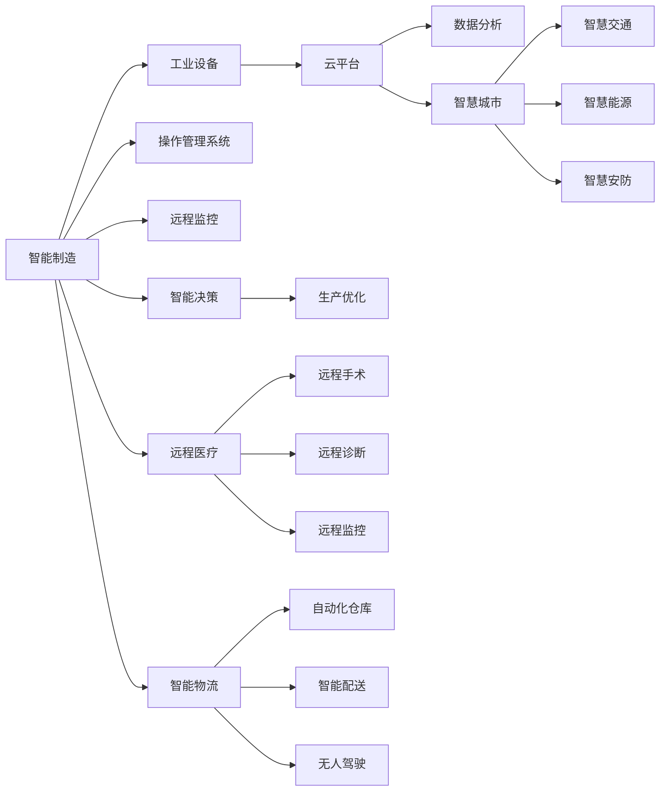

                 

# 5G技术在工业4.0中的应用与挑战

## 1. 背景介绍

随着信息技术的飞速发展，以大数据、物联网、人工智能为代表的第四次工业革命正在席卷全球。而5G技术的到来，则为工业4.0提供了全新的发展契机。5G作为新一代移动通信技术，提供了超高带宽、低时延、大规模连接等特性，为智能制造、智慧城市、远程医疗等工业4.0应用场景的实现提供了强大的技术支撑。

在工业4.0背景下，5G技术的应用不仅局限于通信领域，更深入到了制造、医疗、能源等多个行业，带来了革命性的变革。本文将系统性地介绍5G技术在工业4.0中的应用场景及其面临的挑战，希望能为工业4.0的建设和推进提供有益的参考。

## 2. 核心概念与联系

### 2.1 核心概念概述

5G技术（Fifth Generation）是指第五代移动通信技术，相较于4G LTE技术，5G在速率、延迟、连接密度等方面有了显著提升，具备更高的网络容量和更低的时延，能够支撑更广泛的应用场景。

在工业4.0中，5G技术的应用主要包括以下几个方面：

- **智能制造**：通过5G网络将生产设备、机器人等工业设备与云平台、操作管理系统等高度互联，实现实时数据采集、监控、分析等，提升制造过程的自动化和智能化水平。
- **智慧城市**：5G网络能够提供高密度、低时延的数据传输能力，支持智慧交通、智慧能源、智慧安防等城市管理的各个方面，提升城市运行效率和居民生活质量。
- **远程医疗**：通过5G网络实现远程手术、远程诊断、远程监控等医疗服务，为偏远地区和急救场景提供强有力的支持。
- **智能物流**：5G网络的高带宽、低时延特性，为自动化仓库管理、智能配送、无人驾驶等物流场景提供了必要的网络支撑。

### 2.2 核心概念原理和架构的 Mermaid 流程图



## 3. 核心算法原理 & 具体操作步骤

### 3.1 算法原理概述

5G技术在工业4.0中的应用，本质上是一种通过5G网络实现工业设备、系统、数据的高效互联，从而实现智能化生产、智慧城市、远程医疗等目标的过程。

在工业制造领域，5G网络的高带宽、低时延特性，使得实时数据采集、监控、分析等成为可能，极大地提升了生产过程的自动化和智能化水平。通过工业互联网平台，将生产设备、传感器、云平台等高度集成，实现从设备到应用的全面智能化升级。

在智慧城市建设中，5G网络能够支撑大规模、高密度的终端连接，实现城市管理系统的智能化，提升了城市运行效率和居民生活质量。通过5G网络，可以实现交通管理、能源管理、安防监控等多个领域的数字化转型。

在远程医疗领域，5G网络的高带宽、低时延特性，为远程手术、远程诊断、远程监控等提供了可靠的通信保障，使得医疗资源能够在更大范围内进行优化配置。

在智能物流领域，5G网络的高带宽、低时延特性，为自动化仓库管理、智能配送、无人驾驶等提供了必要的网络支撑，提升了物流运输效率和安全性。

### 3.2 算法步骤详解

5G技术在工业4.0中的应用，主要包括以下几个关键步骤：

**Step 1: 5G网络部署**
- 根据实际需求选择合适的5G网络设备，如5G基站、5G路由器等，进行网络部署。
- 优化网络参数，确保网络覆盖良好、带宽充足、时延低。

**Step 2: 工业设备联网**
- 将工业设备、传感器等终端设备接入5G网络，进行设备联网。
- 实现设备之间的互联互通，构建工业互联网平台。

**Step 3: 数据采集与传输**
- 通过5G网络实现生产设备的实时数据采集，将设备运行状态、参数等数据传输到云端。
- 在云端进行数据分析、存储、处理，实现设备监控、故障诊断等功能。

**Step 4: 应用系统集成**
- 将数据采集、处理结果，集成到智能制造、智慧城市、远程医疗、智能物流等应用系统中。
- 通过5G网络，实现应用的实时交互、响应和控制。

**Step 5: 系统优化与升级**
- 基于实时数据和分析结果，进行生产优化、系统升级等操作。
- 根据应用需求，不断优化网络参数、设备配置，提升系统性能。

### 3.3 算法优缺点

5G技术在工业4.0中的应用，具有以下优点：

1. **高速率**：5G网络能够提供超过10Gbps的峰值速率，支持大规模数据传输，为工业设备、系统的互联互通提供了可靠的网络支撑。
2. **低时延**：5G网络的时延低于1ms，能够满足工业控制、远程医疗等场景对低时延的需求。
3. **高可靠性**：5G网络具备高可靠性，能够保证数据传输的稳定性和安全性。
4. **大规模连接**：5G网络支持数十亿设备的同时连接，支持智慧城市、智能制造等场景的全面智能化升级。

然而，5G技术在工业4.0中应用，也存在以下缺点：

1. **高成本**：5G网络的建设与维护成本较高，需要大量的投资。
2. **技术复杂性**：5G网络的技术复杂性较高，对设备、网络、安全等方面提出了更高要求。
3. **安全问题**：5G网络的安全问题也较为突出，需要采取有效的安全防护措施。

### 3.4 算法应用领域

5G技术在工业4.0中的应用，覆盖了智能制造、智慧城市、远程医疗、智能物流等多个领域，具体如下：

- **智能制造**：通过5G网络实现生产设备的实时监控、故障诊断、生产优化等功能，提升制造过程的自动化和智能化水平。
- **智慧城市**：利用5G网络的高带宽、低时延特性，实现智慧交通、智慧能源、智慧安防等城市管理功能。
- **远程医疗**：通过5G网络实现远程手术、远程诊断、远程监控等功能，提升医疗服务的可及性和效率。
- **智能物流**：利用5G网络的高带宽、低时延特性，实现自动化仓库管理、智能配送、无人驾驶等功能，提升物流运输效率和安全性。

## 4. 数学模型和公式 & 详细讲解 & 举例说明

### 4.1 数学模型构建

在工业4.0中，5G技术的应用涉及多个领域的复杂问题，如工业设备状态监控、生产过程优化、城市交通管理等。以下以工业设备状态监控为例，构建数学模型。

设工业设备的状态向量为 $x = [x_1, x_2, ..., x_n]^T$，其中 $x_i$ 表示第 $i$ 个设备的当前状态。设设备状态之间的转换关系为 $x_{t+1} = f(x_t)$，其中 $f$ 为状态转换函数。设设备状态的数据采集周期为 $T$，则 $T$ 个周期内的状态序列为 $x = [x_1, x_2, ..., x_n]^T$。

设设备状态监测的目标为 $y = [y_1, y_2, ..., y_n]^T$，其中 $y_i$ 表示第 $i$ 个设备的异常状态概率。设监测系统获取的数据为 $z = [z_1, z_2, ..., z_n]^T$，其中 $z_i$ 表示第 $i$ 个设备的实时数据。

### 4.2 公式推导过程

设监测系统的输出为 $\hat{y} = [\hat{y}_1, \hat{y}_2, ..., \hat{y}_n]^T$，则监测系统的损失函数为：

$$
L(y, \hat{y}) = \frac{1}{N}\sum_{i=1}^N \ell(y_i, \hat{y}_i)
$$

其中 $\ell$ 为损失函数，如交叉熵损失函数等。设监测系统的训练数据为 $(x, y, z)$，则监测系统的优化目标为：

$$
\mathop{\min}_{\theta} \mathcal{L}(\theta) = \frac{1}{N}\sum_{i=1}^N \ell(y_i, \hat{y}_i)
$$

其中 $\theta$ 为监测系统的参数，如神经网络中的权重、偏置等。设监测系统的优化算法为 $G$，则监测系统的训练过程为：

$$
\theta \leftarrow G(\mathcal{L}(\theta))
$$

### 4.3 案例分析与讲解

以工业设备状态监测为例，分析5G技术在监测系统中的应用。

假设某工厂生产线上有10个传感器，用于监测设备运行状态。设备状态序列为 $x = [x_1, x_2, ..., x_{10}]^T$，设备状态转换关系为 $x_{t+1} = f(x_t)$。设备状态监测的目标为 $y = [y_1, y_2, ..., y_{10}]^T$，监测系统获取的数据为 $z = [z_1, z_2, ..., z_{10}]^T$。

假设监测系统为神经网络模型，输入为设备状态数据 $z$，输出为设备异常状态概率 $y$。设神经网络模型包含 $L$ 层，每层神经元数量为 $N$，则神经网络模型的参数为 $\theta = \{W_{l}, b_l\}_{l=1}^L$，其中 $W_l$ 为第 $l$ 层的权重矩阵，$b_l$ 为第 $l$ 层的偏置向量。

假设神经网络模型的损失函数为交叉熵损失函数，则监测系统的训练过程为：

1. 将设备状态序列 $x$、监测系统获取的数据 $z$ 作为训练集，进行训练。
2. 将设备状态监测的目标 $y$ 作为训练集，进行训练。
3. 在测试集上评估监测系统的性能，验证监测系统的准确性。

## 5. 项目实践：代码实例和详细解释说明

### 5.1 开发环境搭建

进行5G技术在工业4.0中的应用项目实践，需要搭建相应的开发环境。以下是搭建开发环境的详细步骤：

1. 安装 Python：从官网下载 Python 3.x 版本，进行安装。
2. 安装 PyTorch：使用 pip 命令安装 PyTorch 框架。
3. 安装 TensorFlow：使用 pip 命令安装 TensorFlow 框架。
4. 安装 OpenCV：使用 pip 命令安装 OpenCV 库，用于图像处理。
5. 安装 Flask：使用 pip 命令安装 Flask 框架，用于搭建服务器。

### 5.2 源代码详细实现

以下是一个简单的基于 PyTorch 和 TensorFlow 的工业设备状态监测系统的源代码实现：

```python
import torch
import torch.nn as nn
import torch.optim as optim
import tensorflow as tf
from tensorflow import keras
from tensorflow.keras import layers

# 定义神经网络模型
class Net(nn.Module):
    def __init__(self):
        super(Net, self).__init__()
        self.fc1 = nn.Linear(10, 128)
        self.fc2 = nn.Linear(128, 64)
        self.fc3 = nn.Linear(64, 10)
        
    def forward(self, x):
        x = torch.relu(self.fc1(x))
        x = torch.relu(self.fc2(x))
        x = torch.softmax(self.fc3(x), dim=1)
        return x

# 加载数据集
def load_data():
    # 加载设备状态序列
    x = torch.load('x.npy')
    # 加载监测系统获取的数据
    z = torch.load('z.npy')
    # 加载设备状态监测的目标
    y = torch.load('y.npy')
    return x, z, y

# 训练模型
def train_model():
    x, z, y = load_data()
    model = Net()
    criterion = nn.CrossEntropyLoss()
    optimizer = optim.Adam(model.parameters(), lr=0.001)
    
    for epoch in range(100):
        model.train()
        optimizer.zero_grad()
        output = model(z)
        loss = criterion(output, y)
        loss.backward()
        optimizer.step()
        print('Epoch [{}/{}], Loss: {:.4f}'.format(epoch+1, 100, loss.item()))
    
    # 在测试集上评估模型性能
    x_test, z_test, y_test = load_data()
    model.eval()
    with torch.no_grad():
        output = model(z_test)
        loss = criterion(output, y_test)
        print('Test Loss: {:.4f}'.format(loss.item()))

# 运行训练过程
train_model()
```

### 5.3 代码解读与分析

在上述代码中，我们定义了一个简单的神经网络模型，用于设备状态监测。模型包含3个全连接层，输入为监测系统获取的数据 $z$，输出为设备异常状态概率 $y$。我们使用 PyTorch 框架进行模型的训练和评估，训练过程中使用交叉熵损失函数，优化算法为 Adam。

在训练模型之前，我们加载了设备状态序列 $x$、监测系统获取的数据 $z$ 以及设备状态监测的目标 $y$，用于模型的训练和评估。在训练过程中，我们通过前向传播计算损失函数，反向传播更新模型参数，最终输出模型性能。在测试过程中，我们同样加载了测试集数据，使用模型进行评估，输出模型性能。

## 6. 实际应用场景

### 6.1 智能制造

在智能制造领域，5G技术的应用主要集中在工业设备的互联互通、生产过程的实时监控和优化等方面。例如，某工厂通过 5G 网络将生产线上的所有设备、传感器、控制系统等高度集成，实现生产过程的实时监控、故障诊断、生产优化等功能。

假设某工厂的自动化生产线由10个工业机器人组成，每个机器人配备有10个传感器，用于监测设备运行状态。设备状态序列为 $x = [x_1, x_2, ..., x_{10}]^T$，设备状态转换关系为 $x_{t+1} = f(x_t)$。设备状态监测的目标为 $y = [y_1, y_2, ..., y_{10}]^T$，监测系统获取的数据为 $z = [z_1, z_2, ..., z_{10}]^T$。

假设监测系统为神经网络模型，输入为设备状态数据 $z$，输出为设备异常状态概率 $y$。设神经网络模型包含 $L$ 层，每层神经元数量为 $N$，则神经网络模型的参数为 $\theta = \{W_{l}, b_l\}_{l=1}^L$，其中 $W_l$ 为第 $l$ 层的权重矩阵，$b_l$ 为第 $l$ 层的偏置向量。

假设神经网络模型的损失函数为交叉熵损失函数，则监测系统的训练过程为：

1. 将设备状态序列 $x$、监测系统获取的数据 $z$ 作为训练集，进行训练。
2. 将设备状态监测的目标 $y$ 作为训练集，进行训练。
3. 在测试集上评估监测系统的性能，验证监测系统的准确性。

通过5G网络，工厂实现了生产线设备的实时监控、故障诊断、生产优化等功能，提升了生产效率和产品质量。

### 6.2 智慧城市

在智慧城市领域，5G技术的应用主要集中在智慧交通、智慧能源、智慧安防等方面。例如，某城市通过 5G 网络将交通信号灯、路灯、监控摄像头等设备高度集成，实现智慧交通管理、智慧能源管理、智慧安防监控等功能。

假设某城市交通管理系统中，有500个交通信号灯，每个信号灯的状态序列为 $x = [x_1, x_2, ..., x_{500}]^T$，状态转换关系为 $x_{t+1} = f(x_t)$。交通信号灯的状态监测目标为 $y = [y_1, y_2, ..., y_{500}]^T$，监测系统获取的数据为 $z = [z_1, z_2, ..., z_{500}]^T$。

假设监测系统为神经网络模型，输入为交通信号灯的状态数据 $z$，输出为交通信号灯异常状态概率 $y$。设神经网络模型包含 $L$ 层，每层神经元数量为 $N$，则神经网络模型的参数为 $\theta = \{W_{l}, b_l\}_{l=1}^L$，其中 $W_l$ 为第 $l$ 层的权重矩阵，$b_l$ 为第 $l$ 层的偏置向量。

假设神经网络模型的损失函数为交叉熵损失函数，则监测系统的训练过程为：

1. 将交通信号灯的状态序列 $x$、监测系统获取的数据 $z$ 作为训练集，进行训练。
2. 将交通信号灯状态监测的目标 $y$ 作为训练集，进行训练。
3. 在测试集上评估监测系统的性能，验证监测系统的准确性。

通过5G网络，城市实现了交通信号灯的实时监控、故障诊断、优化控制等功能，提升了交通运行效率和安全性。

### 6.3 远程医疗

在远程医疗领域，5G技术的应用主要集中在远程手术、远程诊断、远程监控等方面。例如，某远程医疗系统中，通过 5G 网络将医生、医院、患者等高度集成，实现远程手术、远程诊断、远程监控等功能。

假设某远程医疗系统中，有100个远程医疗站点，每个站点获取的远程医疗数据为 $z = [z_1, z_2, ..., z_{100}]^T$，远程医疗数据的状态监测目标为 $y = [y_1, y_2, ..., y_{100}]^T$。

假设监测系统为神经网络模型，输入为远程医疗数据 $z$，输出为远程医疗数据异常状态概率 $y$。设神经网络模型包含 $L$ 层，每层神经元数量为 $N$，则神经网络模型的参数为 $\theta = \{W_{l}, b_l\}_{l=1}^L$，其中 $W_l$ 为第 $l$ 层的权重矩阵，$b_l$ 为第 $l$ 层的偏置向量。

假设神经网络模型的损失函数为交叉熵损失函数，则监测系统的训练过程为：

1. 将远程医疗数据 $z$ 作为训练集，进行训练。
2. 将远程医疗数据状态监测的目标 $y$ 作为训练集，进行训练。
3. 在测试集上评估监测系统的性能，验证监测系统的准确性。

通过5G网络，远程医疗系统实现了远程手术、远程诊断、远程监控等功能，提升了医疗服务的可及性和效率。

### 6.4 未来应用展望

随着5G技术的不断发展，未来在工业4.0中应用将更加广泛和深入。以下是5G技术在工业4.0中的未来应用展望：

1. **智能制造的全面升级**：5G网络的高带宽、低时延特性，将推动智能制造的全面升级，实现生产过程的实时监控、故障诊断、生产优化等功能，提升制造过程的自动化和智能化水平。

2. **智慧城市的高质量建设**：5G网络的高密度连接、低时延特性，将推动智慧城市的全面建设，实现智慧交通、智慧能源、智慧安防等功能，提升城市运行效率和居民生活质量。

3. **远程医疗的高效应用**：5G网络的高带宽、低时延特性，将推动远程医疗的高效应用，实现远程手术、远程诊断、远程监控等功能，提升医疗服务的可及性和效率。

4. **智能物流的智能运作**：5G网络的高带宽、低时延特性，将推动智能物流的智能运作，实现自动化仓库管理、智能配送、无人驾驶等功能，提升物流运输效率和安全性。

## 7. 工具和资源推荐

### 7.1 学习资源推荐

为了帮助开发者系统掌握5G技术在工业4.0中的应用，以下是一些优质的学习资源：

1. 《5G技术与应用》：该书系统性地介绍了5G技术的基本原理、关键技术、应用场景等，适合初学者入门。
2. 《工业互联网与5G应用》：该书详细介绍了工业互联网与5G技术的应用案例，适合工业4.0从业人员阅读。
3. 《智慧城市与5G技术》：该书介绍了智慧城市建设与5G技术的应用，适合智慧城市从业人员阅读。
4. 《远程医疗与5G技术》：该书介绍了远程医疗中5G技术的应用，适合远程医疗从业人员阅读。
5. 《智能物流与5G技术》：该书介绍了智能物流中5G技术的应用，适合物流从业人员阅读。

### 7.2 开发工具推荐

为了帮助开发者高效地进行5G技术在工业4.0中的应用开发，以下是一些推荐的开发工具：

1. PyTorch：基于Python的开源深度学习框架，适合进行神经网络模型的开发和训练。
2. TensorFlow：由Google主导开发的开源深度学习框架，适合进行大规模深度学习应用的开发。
3. OpenCV：开源计算机视觉库，适合进行图像处理、计算机视觉应用开发。
4. Flask：轻量级的Web开发框架，适合搭建Web服务，提供数据交互接口。

### 7.3 相关论文推荐

5G技术在工业4.0中的应用，涉及多个领域的交叉研究，以下是几篇相关的重要论文，推荐阅读：

1. "5G for Smart Manufacturing: Opportunities and Challenges"：文章讨论了5G在智能制造中的应用机会和挑战，分析了5G技术在智能制造中的实际应用案例。
2. "5G in Smart Cities: Architectures and Applications"：文章讨论了5G在智慧城市中的应用架构和应用案例，分析了5G技术在智慧城市中的实际应用案例。
3. "5G for Telemedicine: Opportunities and Challenges"：文章讨论了5G在远程医疗中的应用机会和挑战，分析了5G技术在远程医疗中的实际应用案例。
4. "5G for Smart Logistics: Opportunities and Challenges"：文章讨论了5G在智能物流中的应用机会和挑战，分析了5G技术在智能物流中的实际应用案例。

## 8. 总结：未来发展趋势与挑战

### 8.1 总结

本文系统性地介绍了5G技术在工业4.0中的应用，包括智能制造、智慧城市、远程医疗、智能物流等多个领域的应用场景。通过对5G技术的深入剖析，我们能够清晰地认识到5G技术在工业4.0中的重要性和应用潜力。

### 8.2 未来发展趋势

5G技术在工业4.0中的应用，将呈现出以下几个发展趋势：

1. **应用范围进一步扩大**：随着5G技术的不断成熟，未来5G技术将在更多的工业4.0应用场景中得到应用，如智能家居、智慧农业等。
2. **技术深度不断提升**：未来5G技术将不断提升其在工业4.0应用中的技术深度，如更高级别的边缘计算、更高效的数据处理等。
3. **产业生态逐渐成熟**：未来5G技术在工业4.0中的应用，将形成更加完善的产业生态，推动相关技术的标准化、产业化发展。
4. **融合创新不断涌现**：未来5G技术将与其他新兴技术进行深度融合，如物联网、人工智能、区块链等，推动工业4.0的全面发展。

### 8.3 面临的挑战

尽管5G技术在工业4.0中的应用前景广阔，但仍面临诸多挑战：

1. **技术复杂性高**：5G技术涉及复杂的网络架构、设备部署、数据处理等，对技术要求较高。
2. **建设成本高**：5G网络的建设和维护成本较高，对企业来说是一大挑战。
3. **安全性问题**：5G网络的安全问题较为突出，需要采取有效的安全防护措施。
4. **标准和规范**：5G技术涉及多个行业的标准和规范，如何统一标准和规范，也需要多方协调和努力。

### 8.4 研究展望

未来5G技术在工业4.0中的应用，将在技术深度、应用范围、产业生态等方面不断发展和创新。以下是一些重要的研究方向：

1. **5G网络优化**：未来需要进一步优化5G网络架构，提升网络性能和稳定性，降低建设成本。
2. **5G技术创新**：未来需要进一步创新5G技术，如边缘计算、网络切片等，推动5G技术的全面应用。
3. **跨行业应用推广**：未来需要进一步推动5G技术在多个行业中的应用推广，如智能家居、智慧农业等。
4. **产业链生态建设**：未来需要进一步完善5G技术在工业4.0中的产业链生态，推动相关技术的标准化、产业化发展。

## 9. 附录：常见问题与解答

**Q1：5G技术在工业4.0中的应用有哪些？**

A: 5G技术在工业4.0中的应用主要包括智能制造、智慧城市、远程医疗、智能物流等多个领域。通过5G网络的高带宽、低时延特性，实现设备的实时监控、故障诊断、生产优化等功能，提升生产效率和产品质量。

**Q2：5G技术在工业4.0中的应用难点有哪些？**

A: 5G技术在工业4.0中的应用难点主要包括技术复杂性高、建设成本高、安全性问题、标准和规范等。需要多方协同努力，共同推动5G技术在工业4.0中的广泛应用。

**Q3：5G技术在工业4.0中的应用前景如何？**

A: 5G技术在工业4.0中的应用前景广阔，未来将在更多的应用场景中得到应用，如智能家居、智慧农业等。同时，随着技术的不断创新和优化，5G技术在工业4.0中的应用将更加广泛和深入。

**Q4：5G技术在工业4.0中的应用趋势如何？**

A: 5G技术在工业4.0中的应用趋势主要包括应用范围进一步扩大、技术深度不断提升、产业生态逐渐成熟、融合创新不断涌现等。未来5G技术将与其他新兴技术进行深度融合，推动工业4.0的全面发展。

**Q5：5G技术在工业4.0中的应用挑战有哪些？**

A: 5G技术在工业4.0中的应用挑战主要包括技术复杂性高、建设成本高、安全性问题、标准和规范等。需要多方协同努力，共同推动5G技术在工业4.0中的广泛应用。

---

作者：禅与计算机程序设计艺术 / Zen and the Art of Computer Programming

