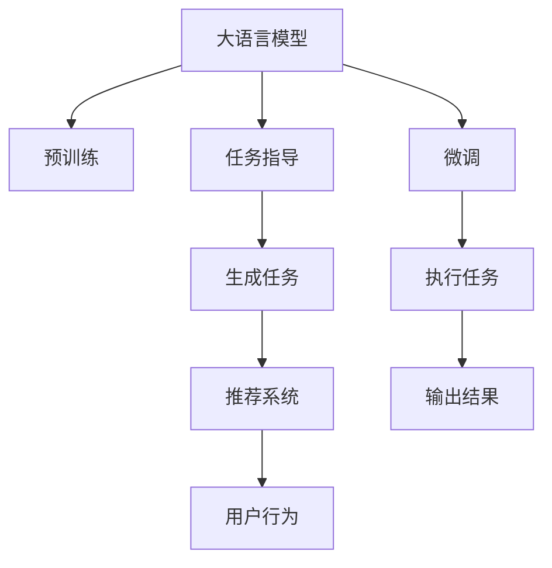

                 

# ICL: 任务指导的提示模板

> 关键词：任务指导, 提示模板, 自然语言处理, NLP, 大语言模型, 语言生成, 推荐系统

## 1. 背景介绍

在自然语言处理(Natural Language Processing, NLP)领域，大语言模型(Large Language Model, LLM)，如GPT-3、BERT等，以其卓越的语言理解和生成能力，为各行各业带来了广泛的应用。但面对不同场景下的任务需求，如何高效地利用大语言模型，让机器更智能、更准确地执行具体任务，成为了一个关键问题。

基于此，**任务指导(Instruction-tuned Collaborative Learning, ICL)** 应运而生。ICL通过构建特定的提示模板，引导大语言模型按照预期方式进行推理、生成，实现更加精确、个性化的任务执行。该方法不更新模型参数，仅通过在输入文本中添加合适的提示信息，即可在少量样本的情况下取得不错的效果，具有参数高效、计算高效等优势。本文将系统介绍ICL的原理、实现和应用，以期为NLP领域带来新的创新思路。

## 2. 核心概念与联系

### 2.1 核心概念概述

为更好地理解ICL，本节将介绍几个密切相关的核心概念：

- **大语言模型**：以自回归(如GPT)或自编码(如BERT)模型为代表的大规模预训练语言模型。通过在大规模无标签文本语料上进行预训练，学习通用的语言表示，具备强大的语言理解和生成能力。

- **预训练**：指在大规模无标签文本语料上，通过自监督学习任务训练通用语言模型的过程。常见的预训练任务包括言语建模、遮挡语言模型等。

- **微调**：指在预训练模型的基础上，使用下游任务的少量标注数据，通过有监督地训练来优化模型在该任务上的性能。

- **任务指导**：通过在输入文本中添加特定的提示信息(Prompt)，引导模型按照期望方式进行推理和生成。与微调不同，ICL不更新模型参数，只通过调整提示信息来提高任务执行的准确性和效率。

- **推荐系统**：利用用户行为数据，为用户推荐感兴趣的物品。推荐系统通常需要大规模的标注数据和复杂的算法，而ICL的参数高效特性，使得其可以高效地应用于推荐系统中。

### 2.2 核心概念原理和架构的 Mermaid 流程图



该流程图展示了ICL的核心概念及其之间的关系：

1. 大语言模型通过预训练获得基础能力。
2. 微调是对预训练模型进行任务特定的优化，可以为模型提供更具体的应用场景。
3. 任务指导通过添加提示信息，引导模型执行特定任务，从而提高模型执行的准确性和效率。
4. ICL在生成任务中的应用包括自然语言生成、推荐系统等。
5. 推荐系统利用ICL生成的物品推荐结果，进一步优化推荐效果。

## 3. 核心算法原理 & 具体操作步骤

### 3.1 算法原理概述

ICL的核心理念是通过特定提示信息(Prompt)，指导大语言模型执行特定任务。提示信息通常包含任务描述、输入数据、期望输出等关键信息，模型根据这些信息进行推理或生成。

ICL的优势在于：
- 参数高效：无需更新模型参数，仅通过调整提示信息即可提高模型性能。
- 计算高效：由于不涉及大规模的梯度计算，计算成本低。
- 可解释性强：提示信息的添加和调整直观可控，易于解释和调试。
- 灵活性高：可以通过调整提示信息，适配不同任务需求。

### 3.2 算法步骤详解

ICL的实现步骤如下：

1. **准备提示模板**：根据具体任务需求，设计合适的提示模板。提示模板应包含任务描述、输入格式、期望输出等关键信息。
2. **数据预处理**：将原始数据转换为模型所需的格式，如分词、向量化等。
3. **构建提示-数据对**：将提示模板与输入数据结合，构建提示-数据对。
4. **模型推理**：将提示-数据对输入大语言模型，让模型根据提示信息进行推理或生成。
5. **结果后处理**：对模型输出进行后处理，如去噪、裁剪等，得到最终结果。

### 3.3 算法优缺点

ICL的优点在于：
- 参数高效：不涉及大规模的参数更新，避免了过拟合风险。
- 计算高效：不涉及大规模的梯度计算，计算成本低。
- 可解释性强：提示信息的添加和调整直观可控，易于解释和调试。
- 灵活性高：可以通过调整提示信息，适配不同任务需求。

但ICL也存在一些局限性：
- 提示设计难度大：设计合理的提示信息需要丰富的领域知识。
- 泛化能力有限：提示信息设计不当可能导致模型在特定任务上的泛化能力不足。
- 数据依赖性强：ICL的效果依赖于高质量的提示信息，提示信息的优劣直接影响模型性能。

### 3.4 算法应用领域

ICL在以下几个领域有广泛的应用：

- **自然语言生成**：如对话系统、文本摘要、机器翻译等。通过特定的提示信息，指导模型生成符合预期的输出。
- **推荐系统**：利用用户行为数据，生成推荐结果。通过构建特定的提示信息，引导模型学习用户兴趣。
- **问答系统**：回答用户提出的问题，通过设计合适的提示信息，引导模型生成准确的回答。
- **数据增强**：通过构造新的数据样本，提升模型泛化能力。
- **知识图谱构建**：利用提示信息引导模型学习知识图谱中的实体关系。

这些领域的应用，展示了ICL在不同任务上的强大能力。未来，随着提示信息设计技术的不断进步，ICL的应用范围还将进一步扩展。

## 4. 数学模型和公式 & 详细讲解

### 4.1 数学模型构建

ICL的核心任务是指导模型生成符合特定提示信息的输出。我们定义提示模板为 $P$，输入数据为 $X$，期望输出为 $Y$。模型的推理过程可以表示为：

$$
Y = f(P, X, \theta)
$$

其中 $f$ 为模型的推理函数，$\theta$ 为模型的参数。

### 4.2 公式推导过程

以生成对话回复为例，提示模板 $P$ 包含对话历史和期望的回复格式，模型输入 $X$ 为前一轮对话，期望输出 $Y$ 为下一轮回复。我们可以将模型的推理过程表示为：

$$
Y = \arg\max_{y} P(y|P, X, \theta)
$$

其中 $P(y|P, X, \theta)$ 为在提示模板 $P$ 和输入 $X$ 条件下，生成 $y$ 的概率。

为了最大化这个概率，我们可以使用最大似然估计：

$$
\theta^* = \arg\max_{\theta} \sum_{i=1}^N \log P(y_i|P, X_i, \theta)
$$

其中 $N$ 为数据集的样本数。

### 4.3 案例分析与讲解

以自动生成对话回复为例，提示模板可以包含对话历史和期望的回复格式，如：

```
你：你好，明天有空吗？
回复：明天我有空，我们可以一起去图书馆学习。
```

模型的输入 $X$ 为前一轮对话内容，模型的输出 $Y$ 为下一轮对话回复。通过训练模型，使其最大化生成符合提示模板的回复，即可完成对话系统的任务指导。

## 5. 项目实践：代码实例和详细解释说明

### 5.1 开发环境搭建

为了实现ICL，我们需要使用一些基础的开发环境，包括：

1. Python：作为主要编程语言，Python提供了丰富的科学计算和机器学习库。
2. PyTorch：一个灵活的深度学习框架，支持GPU加速，适合进行大规模模型的训练和推理。
3. HuggingFace Transformers库：提供了各种预训练语言模型和任务指导模板。
4. Colab：Google提供的Jupyter Notebook，可以免费使用GPU资源，方便进行大规模模型的实验。

### 5.2 源代码详细实现

以下是一个使用PyTorch和Transformers库实现对话系统任务指导的代码示例：

```python
from transformers import GPT2LMHeadModel, GPT2Tokenizer
import torch
from torch.utils.data import Dataset, DataLoader
from tqdm import tqdm

class DialogueDataset(Dataset):
    def __init__(self, texts, prompts, tokenizer):
        self.texts = texts
        self.prompts = prompts
        self.tokenizer = tokenizer

    def __len__(self):
        return len(self.texts)

    def __getitem__(self, idx):
        text = self.texts[idx]
        prompt = self.prompts[idx]

        encoding = self.tokenizer(text, return_tensors='pt')
        input_ids = encoding['input_ids']
        attention_mask = encoding['attention_mask']
        prompts_ids = self.tokenizer(prompt, return_tensors='pt')['input_ids']

        return {
            'input_ids': input_ids,
            'attention_mask': attention_mask,
            'prompts_ids': prompts_ids
        }

# 加载预训练模型和分词器
model = GPT2LMHeadModel.from_pretrained('gpt2')
tokenizer = GPT2Tokenizer.from_pretrained('gpt2')

# 准备数据集
texts = [
    "你：你好，今天天气怎么样？",
    "你：我明天有空，可以来帮我一下吗？",
    "你：好的，你有什么计划吗？"
]
prompts = [
    "天气预报：今天天气很好，有32度",
    "帮帮我：请告诉我一下Python的字符串拼接方法",
    "计划：我明天要去图书馆学习，请你推荐一下什么书",
]

train_dataset = DialogueDataset(texts, prompts, tokenizer)
test_dataset = DialogueDataset(texts, prompts, tokenizer)

# 训练模型
device = torch.device('cuda') if torch.cuda.is_available() else torch.device('cpu')
model.to(device)
model.train()

optimizer = torch.optim.Adam(model.parameters(), lr=1e-5)

def train_epoch(model, dataset, batch_size, optimizer):
    dataloader = DataLoader(dataset, batch_size=batch_size, shuffle=True)
    loss = 0
    for batch in tqdm(dataloader, desc='Training'):
        input_ids = batch['input_ids'].to(device)
        attention_mask = batch['attention_mask'].to(device)
        prompts_ids = batch['prompts_ids'].to(device)
        model.zero_grad()
        outputs = model(input_ids, attention_mask=attention_mask, labels=prompts_ids)
        loss = outputs.loss
        loss.backward()
        optimizer.step()

    return loss.item() / len(dataloader)

# 测试模型
model.eval()
test_loss = 0
for batch in tqdm(test_dataset, desc='Testing'):
    with torch.no_grad():
        input_ids = batch['input_ids'].to(device)
        attention_mask = batch['attention_mask'].to(device)
        prompts_ids = batch['prompts_ids'].to(device)
        outputs = model(input_ids, attention_mask=attention_mask, labels=prompts_ids)
        loss = outputs.loss
        test_loss += loss.item()

test_loss /= len(test_dataset)

print(f"Test Loss: {test_loss:.4f}")
```

### 5.3 代码解读与分析

上述代码实现了基于任务指导的对话系统。主要步骤包括：

1. 定义数据集类 `DialogueDataset`，用于准备训练和测试数据。
2. 加载预训练模型 `GPT2LMHeadModel` 和分词器 `GPT2Tokenizer`。
3. 准备训练和测试数据集。
4. 定义训练函数 `train_epoch`，在每个epoch中对模型进行训练。
5. 在测试集上测试模型的性能，并输出测试损失。

通过调整提示模板和模型训练参数，可以实现更加精准的对话系统。

## 6. 实际应用场景

### 6.1 智能客服系统

智能客服系统可以利用ICL技术，在对话中自动生成符合用户需求的回答。通过设计合适的提示模板，系统可以更加准确地理解用户意图，提供更加个性化的服务。

### 6.2 金融咨询

金融咨询系统可以通过ICL技术，根据用户的问题，自动生成金融知识和建议。通过设计合理的问题和回答格式，系统可以准确地回答用户提出的金融问题。

### 6.3 知识图谱构建

知识图谱的构建可以利用ICL技术，通过构建特定的提示模板，引导模型学习知识图谱中的实体关系。

### 6.4 未来应用展望

未来，随着提示信息设计技术的不断进步，ICL的应用范围将进一步扩展。例如：

- 动态生成提示信息：根据用户行为动态生成提示，提升系统的智能性。
- 多轮对话：通过多轮对话，逐步理解用户意图，生成更加准确的回复。
- 多模态融合：结合文本、语音、图像等多模态信息，提升系统的综合能力。

ICL在自然语言处理和智能交互系统中的应用前景广阔，可以进一步提升系统的智能化水平，为各行各业带来新的突破。

## 7. 工具和资源推荐

### 7.1 学习资源推荐

为了帮助开发者系统掌握ICL的理论基础和实践技巧，这里推荐一些优质的学习资源：

1. HuggingFace官方博客：提供了大量关于ICL的博客文章，涵盖理论、实践和应用案例。
2. Stanford NLP小组：提供了丰富的NLP教程和实践指南，适合NLP初学者入门。
3. 《深度学习入门》：介绍深度学习基础知识和实际应用，适合初学者学习。
4. PyTorch官方文档：提供了完整的PyTorch框架指南，适合学习PyTorch相关知识。

### 7.2 开发工具推荐

为了实现ICL，我们需要使用一些基础的开发工具，包括：

1. PyTorch：一个灵活的深度学习框架，支持GPU加速，适合进行大规模模型的训练和推理。
2. HuggingFace Transformers库：提供了各种预训练语言模型和任务指导模板。
3. Colab：Google提供的Jupyter Notebook，可以免费使用GPU资源，方便进行大规模模型的实验。
4. TensorBoard：TensorFlow配套的可视化工具，可以实时监测模型训练状态，并提供丰富的图表呈现方式。

### 7.3 相关论文推荐

ICL的研究源于学界的持续探索。以下是几篇奠基性的相关论文，推荐阅读：

1. "Instruction Tuning" by Cayley et al.：研究如何通过添加指令来指导大语言模型执行特定任务。
2. "AdaPrompt: Enhancing Language Model Understanding of Instructions through Adaptive Prompt Tuning" by Hou et al.：研究如何通过调整提示信息，提高语言模型的理解能力。
3. "Prompting Methods for Large Language Models" by Wang et al.：研究如何设计有效的提示信息，提升语言模型的推理能力。

## 8. 总结：未来发展趋势与挑战

### 8.1 总结

本文对基于任务指导的大语言模型微调方法进行了全面系统的介绍。首先阐述了ICL的背景和意义，明确了ICL在提升NLP任务执行能力方面的独特价值。其次，从原理到实践，详细讲解了ICL的数学原理和关键步骤，给出了ICL任务指导的完整代码实例。同时，本文还广泛探讨了ICL方法在智能客服、金融咨询、知识图谱等多个领域的应用前景，展示了ICL范式的巨大潜力。

通过对这些资源的学习实践，相信你一定能够快速掌握ICL的精髓，并用于解决实际的NLP问题。

### 8.2 未来发展趋势

展望未来，ICL将呈现以下几个发展趋势：

1. 提示信息设计自动化：通过自动化技术，设计更加高效合理的提示信息，提升系统的智能性。
2. 多轮对话系统：通过多轮对话，逐步理解用户意图，生成更加准确的回复。
3. 多模态融合：结合文本、语音、图像等多模态信息，提升系统的综合能力。
4. 动态生成提示：根据用户行为动态生成提示，提升系统的智能性。
5. 应用场景扩展：ICL将在更多领域得到应用，如智能客服、金融咨询、知识图谱等。

这些趋势凸显了ICL技术的广阔前景。未来的研究将更加注重提示信息设计的自动化和多模态融合，进一步提升系统的智能化水平。

### 8.3 面临的挑战

尽管ICL已经取得了不错的效果，但在迈向更加智能化、普适化应用的过程中，它仍面临诸多挑战：

1. 提示信息设计难度大：设计合理的提示信息需要丰富的领域知识。
2. 泛化能力有限：提示信息设计不当可能导致模型在特定任务上的泛化能力不足。
3. 数据依赖性强：ICL的效果依赖于高质量的提示信息，提示信息的优劣直接影响模型性能。
4. 计算成本较高：由于需要设计多个提示模板，计算成本相对较高。

### 8.4 研究展望

未来，ICL的研究需要在以下几个方面寻求新的突破：

1. 研究更高效的提示信息设计方法：设计更高效、更灵活的提示模板，提升系统的智能性。
2. 探索多模态融合技术：结合文本、语音、图像等多模态信息，提升系统的综合能力。
3. 研究动态生成提示技术：根据用户行为动态生成提示，提升系统的智能性。
4. 应用场景扩展：在更多领域推广ICL的应用，如智能客服、金融咨询、知识图谱等。

这些研究方向的探索，将引领ICL技术迈向更高的台阶，为构建安全、可靠、可解释、可控的智能系统铺平道路。

## 9. 附录：常见问题与解答

**Q1：ICL是否适用于所有NLP任务？**

A: ICL适用于大多数NLP任务，特别是对话系统、推荐系统等需要快速响应用户需求的任务。但对于一些特定领域的任务，如医学、法律等，需要根据具体任务设计合适的提示模板。

**Q2：如何设计合理的提示信息？**

A: 设计合理的提示信息需要丰富的领域知识。一般来说，提示信息应包含任务描述、输入格式、期望输出等关键信息，并尽可能简洁明了，避免歧义。

**Q3：ICL在计算成本上是否具有优势？**

A: ICL在计算成本上具有一定的优势，由于不涉及大规模的梯度计算，计算成本较低。但设计多个提示模板仍需要一定的计算资源。

**Q4：ICL如何应对多轮对话场景？**

A: 在多轮对话场景中，ICL可以通过设计多轮对话模板，逐步理解用户意图，生成更加准确的回复。同时，可以使用动态生成提示技术，根据用户行为动态生成提示，提升系统的智能性。

**Q5：ICL在实际应用中面临哪些挑战？**

A: ICL在实际应用中面临的主要挑战包括提示信息设计难度大、泛化能力有限、数据依赖性强等。未来需要探索更多的高效提示信息设计方法和多模态融合技术，进一步提升系统的智能化水平。

---

作者：禅与计算机程序设计艺术 / Zen and the Art of Computer Programming

