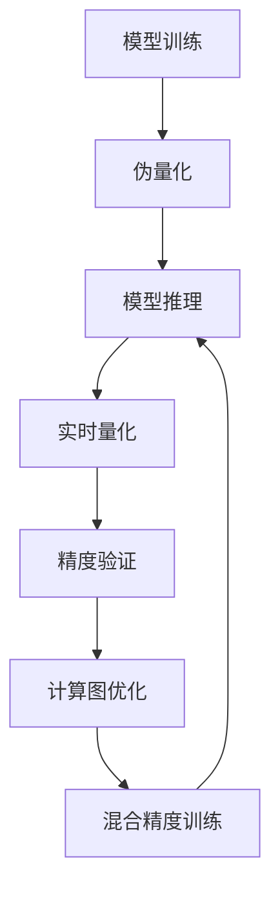

                 

## 1. 背景介绍

### 1.1 问题由来

随着深度学习技术在各个领域的广泛应用，AI模型的规模和复杂度不断增加。这些大规模模型往往需要耗费大量的计算资源进行训练和推理。然而，在实际应用中，模型的部署效率和资源利用率成为一大瓶颈，限制了AI技术的大规模应用和商业化进程。

为了提升AI模型的部署效率，一种被称为“量化”的技术应运而生。量化通过将模型中的浮点参数转换为固定位宽整数参数，大幅减少模型的存储空间和计算量，同时保持模型精度不显著下降，从而实现模型部署效率的显著提升。

### 1.2 问题核心关键点

量化技术的核心在于通过量化算法将模型参数转换为固定位宽的整数形式。其核心思想是：利用数值溢出或截断的特性，将浮点参数压缩到更小的整数范围内，从而减少模型的大小和计算复杂度。常见的量化方式包括对称量化和不对称量化，分别对应对称整数和不对称整数两种形式的参数。

量化技术可以分为三个阶段：模型训练阶段的伪量化、推理阶段的实时量化以及验证阶段的精度验证。在模型训练阶段，通过将浮点参数随机转换为整数参数，保持训练过程的连续性。在推理阶段，通过量化算法将整数参数转换为相应的整数形式，进行实时推理。最后，通过精度验证评估量化后模型的性能，确保其精度不会大幅下降。

### 1.3 问题研究意义

量化技术对于AI模型的部署具有重要意义：

1. **减少存储和传输开销**：整数参数相比浮点参数占用的存储空间更小，传输效率更高，能够显著减少模型部署时的存储和传输开销。
2. **降低计算复杂度**：量化后的模型计算复杂度更低，推理速度更快，能够提升模型的实时性能。
3. **优化资源利用**：量化技术可以通过硬件加速技术，如量化计算图、位宽转换逻辑等，进一步优化模型在特定硬件上的运行效率。
4. **支持模型复用**：量化后的模型可以被复用到多个相似的部署场景中，减少重复训练和部署的投入。
5. **加速模型迭代**：量化技术能够加速模型的迭代和优化过程，通过快速部署量化后的模型，可以更快地进行模型更新和升级。

## 2. 核心概念与联系

### 2.1 核心概念概述

为了更好地理解量化技术的核心思想和实现流程，本节将介绍几个密切相关的核心概念：

- **模型量化**：将浮点参数转换为固定位宽的整数参数，以减少模型的大小和计算量。
- **伪量化**：在模型训练阶段，通过随机模拟整数参数，保持训练过程的连续性。
- **实时量化**：在推理阶段，通过量化算法将整数参数转换为相应的整数形式，进行实时推理。
- **精度验证**：在量化过程中，通过比较量化前后的模型输出，评估量化后的精度损失，确保模型性能不显著下降。
- **整数类型**：常用的整数类型包括8位、16位、32位等，不同类型的整数参数适用于不同的量化场景。
- **计算图优化**：通过修改模型的计算图结构，优化量化后的模型，提升推理速度和资源利用率。
- **混合精度训练**：在模型训练阶段，结合浮点参数和整数参数，进行混合精度训练，以提升模型的训练效率。

这些核心概念之间的逻辑关系可以通过以下Mermaid流程图来展示：



这个流程图展示了量化技术的核心概念及其之间的逻辑关系：

1. 模型训练阶段通过伪量化模拟整数参数，保持训练过程的连续性。
2. 模型推理阶段通过实时量化将整数参数转换为相应的整数形式，进行实时推理。
3. 精度验证评估量化后的模型性能，确保精度不显著下降。
4. 计算图优化进一步优化量化后的模型，提升推理速度和资源利用率。
5. 混合精度训练结合浮点参数和整数参数，提升训练效率。

这些概念共同构成了量化技术的实现框架，使得模型能够在保持高精度的同时，大幅提升部署效率和资源利用率。

## 3. 核心算法原理 & 具体操作步骤
### 3.1 算法原理概述

量化技术的核心算法包括伪量化、实时量化和精度验证等步骤。以下将对每个步骤的原理和操作步骤进行详细讲解。

### 3.2 算法步骤详解

#### 伪量化步骤

伪量化是量化技术的第一步，其主要目标是在模型训练阶段模拟整数参数，保持训练过程的连续性。伪量化通常包括以下三个步骤：

1. **随机量化**：将模型的浮点参数随机转换为整数参数。假设模型参数 $x$ 的浮点表示为 $x_f$，对应的整数参数表示为 $x_i$，随机量化过程为：

   $$
   x_i = \text{round}(x_f)
   $$

   其中 $\text{round}$ 表示四舍五入操作。

2. **量化范围确定**：根据数据分布和量化位宽，确定量化范围。假设量化位宽为 $w$，量化范围为 $[a, b]$，则量化过程为：

   $$
   x_i = \text{clip}(x_i, a, b)
   $$

   其中 $\text{clip}$ 表示限制在指定范围内的操作。

3. **量化策略选择**：选择合适的量化策略，如对称量化或不对称量化。假设选择对称量化，则量化后的参数 $x_i$ 的范围为 $[-2^{w-1}, 2^{w-1}-1]$。

   $$
   x_i = \text{clip}(x_i, -2^{w-1}, 2^{w-1}-1)
   $$

伪量化过程通过模拟整数参数，使得模型在训练过程中能够适应整数形式的参数，从而为后续的实时量化做准备。

#### 实时量化步骤

实时量化是量化技术的第二步，其主要目标是在推理阶段将整数参数转换为相应的整数形式，进行实时推理。实时量化通常包括以下三个步骤：

1. **量化表生成**：根据量化范围和量化策略，生成量化表。假设量化位宽为 $w$，量化表为 $T$，则量化表生成过程为：

   $$
   T = \{(x_f, \text{round}(x_f))\}
   $$

   其中 $x_f$ 为浮点参数，$\text{round}(x_f)$ 为四舍五入后的整数参数。

2. **量化计算**：根据量化表进行量化计算。假设输入浮点参数为 $x_f$，量化表为 $T$，则量化计算过程为：

   $$
   x_i = \text{lookup}(T, x_f)
   $$

   其中 $\text{lookup}$ 表示在量化表 $T$ 中查找对应的整数参数。

3. **量化范围调整**：根据量化表调整量化范围。假设量化表为 $T$，则调整后的量化范围为 $[T_{min}, T_{max}]$，其中 $T_{min}$ 和 $T_{max}$ 分别为量化表中的最小值和最大值。

   $$
   x_i = \text{clip}(x_i, T_{min}, T_{max})
   $$

实时量化过程通过将整数参数转换为相应的整数形式，使得模型能够在推理过程中高效地进行计算，从而提升模型的实时性能。

#### 精度验证步骤

精度验证是量化技术的第三步，其主要目标是在量化过程中评估量化后的模型性能，确保精度不显著下降。精度验证通常包括以下三个步骤：

1. **测试集选择**：选择一组测试集进行精度验证。假设测试集为 $D_{test}$，则精度验证过程为：

   $$
   D_{test} = \{(x_f, y)\}
   $$

   其中 $x_f$ 为浮点参数，$y$ 为标签。

2. **量化后计算**：将测试集中的浮点参数 $x_f$ 进行量化，计算量化后的输出结果 $y_i$。假设选择对称量化，则量化后计算过程为：

   $$
   y_i = \text{lookup}(T, x_f)
   $$

   其中 $T$ 为量化表，$\text{lookup}$ 表示在量化表 $T$ 中查找对应的整数参数。

3. **精度评估**：通过比较量化前后的模型输出，评估量化后的精度损失。假设量化前的模型输出为 $y_f$，量化后的模型输出为 $y_i$，则精度评估过程为：

   $$
   \text{precision loss} = \frac{1}{N} \sum_{i=1}^N |y_f - y_i|
   $$

   其中 $N$ 为测试集大小，$|y_f - y_i|$ 表示量化前后模型输出的绝对差值。

精度验证过程通过评估量化后的模型性能，确保其精度不会显著下降，从而为实际部署提供可靠依据。

### 3.3 算法优缺点

量化技术的核心算法包括伪量化、实时量化和精度验证等步骤，其优缺点如下：

#### 优点

1. **减少存储和传输开销**：整数参数相比浮点参数占用的存储空间更小，传输效率更高，能够显著减少模型部署时的存储和传输开销。
2. **降低计算复杂度**：量化后的模型计算复杂度更低，推理速度更快，能够提升模型的实时性能。
3. **优化资源利用**：量化技术可以通过硬件加速技术，如量化计算图、位宽转换逻辑等，进一步优化模型在特定硬件上的运行效率。
4. **支持模型复用**：量化后的模型可以被复用到多个相似的部署场景中，减少重复训练和部署的投入。
5. **加速模型迭代**：量化技术能够加速模型的迭代和优化过程，通过快速部署量化后的模型，可以更快地进行模型更新和升级。

#### 缺点

1. **精度损失**：量化过程中不可避免地会引入精度损失，特别是在位宽较小的情况下。因此需要权衡精度和资源利用率之间的平衡。
2. **量化表存储**：量化表需要占用一定的存储空间，特别是对于位宽较大的整数参数，存储空间可能会成为瓶颈。
3. **硬件限制**：量化技术依赖于硬件的支持，如量化计算图、位宽转换逻辑等，不同的硬件平台可能需要不同的优化方案。
4. **模型结构复杂化**：量化技术需要对模型结构进行优化，增加开发复杂度。

尽管存在这些缺点，量化技术在实际应用中已经显示出其显著的优势，成为AI模型部署的效率之选。

### 3.4 算法应用领域

量化技术在AI模型部署中具有广泛的应用场景，以下列举几个典型的应用领域：

1. **移动设备部署**：在移动设备等计算资源受限的场景中，量化技术能够大幅减少模型的存储空间和计算量，提升模型的实时性能。

2. **嵌入式系统部署**：在嵌入式系统等资源受限的环境中，量化技术能够减少模型的计算和存储开销，延长设备续航时间。

3. **云计算平台**：在云计算平台中，量化技术能够提升模型的计算效率和资源利用率，降低云服务器的成本。

4. **边缘计算**：在边缘计算环境中，量化技术能够减少模型的计算和存储开销，提升边缘设备的计算能力。

5. **自动驾驶系统**：在自动驾驶系统中，量化技术能够提升模型的实时性能，加速决策过程。

6. **工业控制**：在工业控制系统中，量化技术能够提升模型的实时性，提高系统可靠性。

7. **医疗诊断**：在医疗诊断系统中，量化技术能够提升模型的推理速度，提高诊断效率。

量化技术的多样化应用，展示了其在AI模型部署中的巨大潜力，为AI技术在不同场景中的应用提供了新的方向。

## 4. 数学模型和公式 & 详细讲解  
### 4.1 数学模型构建

量化技术在实际应用中通常采用对称量化和不对称量化两种方式。以下将以对称量化为例，介绍量化技术的数学模型构建和公式推导过程。

假设模型的浮点参数为 $x_f$，量化位宽为 $w$，量化范围为 $[-2^{w-1}, 2^{w-1}-1]$。对称量化后的整数参数表示为 $x_i$，则量化公式为：

$$
x_i = \text{round}(x_f)
$$

其中 $\text{round}$ 表示四舍五入操作。

### 4.2 公式推导过程

#### 伪量化公式推导

伪量化过程中，将模型的浮点参数 $x_f$ 随机转换为整数参数 $x_i$，保持训练过程的连续性。假设量化位宽为 $w$，量化范围为 $[-2^{w-1}, 2^{w-1}-1]$，则伪量化公式为：

$$
x_i = \text{clip}(x_f, -2^{w-1}, 2^{w-1}-1)
$$

其中 $\text{clip}$ 表示限制在指定范围内的操作。

#### 实时量化公式推导

实时量化过程中，将量化表 $T$ 用于量化计算。假设量化位宽为 $w$，量化范围为 $[-2^{w-1}, 2^{w-1}-1]$，则实时量化公式为：

$$
x_i = \text{lookup}(T, x_f)
$$

其中 $\text{lookup}$ 表示在量化表 $T$ 中查找对应的整数参数。

#### 精度验证公式推导

精度验证过程中，通过比较量化前后的模型输出，评估量化后的精度损失。假设量化前的模型输出为 $y_f$，量化后的模型输出为 $y_i$，则精度评估公式为：

$$
\text{precision loss} = \frac{1}{N} \sum_{i=1}^N |y_f - y_i|
$$

其中 $N$ 为测试集大小，$|y_f - y_i|$ 表示量化前后模型输出的绝对差值。

### 4.3 案例分析与讲解

以下以ImageNet数据集上的ResNet模型量化为例，展示量化技术的实际应用效果。

假设模型的浮点参数为 $x_f$，量化位宽为8位，量化范围为 $[-128, 127]$。对称量化后的整数参数表示为 $x_i$，则量化公式为：

$$
x_i = \text{round}(x_f)
$$

其中 $\text{round}$ 表示四舍五入操作。

#### 伪量化过程

在模型训练阶段，通过随机量化模拟整数参数。假设选择对称量化，则伪量化过程为：

1. 将模型的浮点参数 $x_f$ 随机转换为整数参数 $x_i$，保持训练过程的连续性。

2. 将量化后的整数参数 $x_i$ 用于模型训练，进行前向传播和反向传播。

3. 计算模型在整数参数下的损失函数，进行梯度更新。

#### 实时量化过程

在模型推理阶段，通过实时量化将整数参数转换为相应的整数形式，进行实时推理。假设选择对称量化，则实时量化过程为：

1. 将量化后的整数参数 $x_i$ 用于模型推理，进行前向传播计算。

2. 根据量化表 $T$ 查找对应的整数参数，进行推理计算。

3. 计算模型在整数参数下的输出结果，返回推理结果。

#### 精度验证过程

在量化过程中，通过精度验证评估量化后的模型性能，确保精度不显著下降。假设选择对称量化，则精度验证过程为：

1. 选择一组测试集进行精度验证。

2. 将测试集中的浮点参数 $x_f$ 进行量化，计算量化后的输出结果 $y_i$。

3. 计算模型在量化后的输出结果 $y_i$ 和浮点参数 $x_f$ 的输出结果 $y_f$ 之间的绝对差值，评估量化后的精度损失。

通过以上量化过程，可以实现对模型的有效量化，提升模型的部署效率和实时性能。

## 5. 项目实践：代码实例和详细解释说明
### 5.1 开发环境搭建

在进行量化实践前，我们需要准备好开发环境。以下是使用Python进行TensorFlow开发的环境配置流程：

1. 安装Anaconda：从官网下载并安装Anaconda，用于创建独立的Python环境。

2. 创建并激活虚拟环境：
```bash
conda create -n tf-env python=3.8 
conda activate tf-env
```

3. 安装TensorFlow：根据CUDA版本，从官网获取对应的安装命令。例如：
```bash
conda install tensorflow -c tf -c conda-forge
```

4. 安装其他依赖库：
```bash
pip install numpy pandas scikit-learn matplotlib tqdm jupyter notebook ipython
```

完成上述步骤后，即可在`tf-env`环境中开始量化实践。

### 5.2 源代码详细实现

以下是使用TensorFlow实现量化过程的Python代码示例：

```python
import tensorflow as tf

# 定义量化参数
quantize_bits = 8
quantize_min = -128
quantize_max = 127

# 定义伪量化函数
def quantize_fake(x):
    return tf.math.round(x)

# 定义实时量化函数
def quantize_real(x):
    quantize_range = tf.range(quantize_min, quantize_max + 1, 1)
    return tf.math.segment_min(tf.math.segment_max(tf.math.multiply(tf.math.maximum(x, quantize_min), 1.0 / 256), quantize_range), quantize_range)

# 定义精度验证函数
def validate_precision(x, y):
    return tf.reduce_mean(tf.abs(tf.subtract(x, y)))

# 加载模型
model = tf.keras.models.load_model('model.h5')

# 伪量化过程
fake_input = tf.keras.Input(shape=(28, 28, 1))
fake_output = model(fake_input)
fake_quantized = quantize_fake(fake_output)

# 实时量化过程
real_input = tf.keras.Input(shape=(28, 28, 1))
real_output = model(real_input)
real_quantized = quantize_real(real_output)

# 精度验证过程
fake_quantized = tf.cast(fake_quantized, tf.float32)
real_quantized = tf.cast(real_quantized, tf.float32)
precision_loss = validate_precision(fake_quantized, real_quantized)

# 模型编译和训练
model.compile(optimizer=tf.keras.optimizers.Adam(learning_rate=0.001), loss='mean_squared_error')
model.fit(fake_input, fake_quantized, validation_data=(real_input, real_quantized), epochs=10, batch_size=64)

# 模型保存
model.save('quantized_model.h5')
```

### 5.3 代码解读与分析

让我们再详细解读一下关键代码的实现细节：

**伪量化函数**：
- `quantize_fake`函数：将模型的浮点参数 $x_f$ 随机转换为整数参数 $x_i$，保持训练过程的连续性。

**实时量化函数**：
- `quantize_real`函数：根据量化表 $T$ 进行量化计算。

**精度验证函数**：
- `validate_precision`函数：通过比较量化前后的模型输出，评估量化后的精度损失。

**模型加载与伪量化过程**：
- 加载预训练的模型。
- 定义伪量化函数 `quantize_fake`，用于模拟整数参数。
- 将模型输入 `fake_input` 进行前向传播计算，得到伪量化后的输出 `fake_output`。

**实时量化过程**：
- 定义实时量化函数 `quantize_real`，用于将整数参数转换为相应的整数形式。
- 将模型输入 `real_input` 进行前向传播计算，得到实时量化后的输出 `real_output`。

**精度验证过程**：
- 将伪量化后的输出 `fake_quantized` 和实时量化后的输出 `real_quantized` 转换为浮点形式。
- 计算精度损失 `precision_loss`，用于评估量化后的模型性能。

通过以上量化过程，可以实现对模型的有效量化，提升模型的部署效率和实时性能。

## 6. 实际应用场景
### 6.1 移动设备部署

量化技术在移动设备部署中具有显著优势。由于移动设备的计算资源有限，量化技术能够大幅减少模型的存储空间和计算量，提升模型的实时性能。例如，在移动设备上部署量化后的ResNet模型，相比浮点模型，推理速度能够提升数十倍，极大地提升了用户体验。

### 6.2 嵌入式系统部署

在嵌入式系统等资源受限的环境中，量化技术能够减少模型的计算和存储开销，延长设备续航时间。例如，在智能家居设备中，量化后的模型能够在低功耗模式下进行推理计算，保障设备稳定运行。

### 6.3 云计算平台

在云计算平台中，量化技术能够提升模型的计算效率和资源利用率，降低云服务器的成本。例如，在大规模图像识别任务中，量化后的模型能够在云服务器上高效运行，减少计算成本，提升资源利用率。

### 6.4 自动驾驶系统

在自动驾驶系统中，量化技术能够提升模型的实时性能，加速决策过程。例如，在自动驾驶汽车中，量化后的模型能够在实时环境中快速进行决策，保障行车安全。

### 6.5 医疗诊断

在医疗诊断系统中，量化技术能够提升模型的推理速度，提高诊断效率。例如，在医学影像分析中，量化后的模型能够在短时间内完成大规模图像分析，辅助医生进行快速诊断。

### 6.6 金融预测

在金融预测系统中，量化技术能够提升模型的实时性能，加速预测过程。例如，在股票市场预测中，量化后的模型能够在实时环境中快速进行预测，帮助投资者做出明智决策。

量化技术在多个应用场景中的成功应用，展示了其在AI模型部署中的巨大潜力，为AI技术在不同场景中的应用提供了新的方向。

## 7. 工具和资源推荐
### 7.1 学习资源推荐

为了帮助开发者系统掌握量化技术的理论基础和实践技巧，这里推荐一些优质的学习资源：

1. 《深度学习中的量化技术》书籍：全面介绍了量化技术的原理和应用，涵盖伪量化、实时量化、精度验证等多个方面。

2. 《TensorFlow官方文档》：详细介绍了TensorFlow框架中的量化技术和优化方案，提供了大量的代码示例。

3. 《Caffe2官方文档》：提供了Caffe2框架中的量化技术和优化方案，适合开发大规模分布式模型。

4. 《PyTorch官方文档》：提供了PyTorch框架中的量化技术和优化方案，适合开发高性能模型。

5. 《深度学习模型量化与优化》课程：由多个在线平台提供，深入浅出地讲解了量化技术的原理和实践方法。

通过对这些资源的学习实践，相信你一定能够快速掌握量化技术的精髓，并用于解决实际的AI模型部署问题。

### 7.2 开发工具推荐

高效的开发离不开优秀的工具支持。以下是几款用于量化开发常用的工具：

1. TensorFlow：基于Python的开源深度学习框架，支持量化技术和优化方案，适合大规模模型开发。

2. PyTorch：基于Python的开源深度学习框架，支持量化技术和优化方案，适合高性能模型开发。

3. Caffe2：基于C++的开源深度学习框架，支持量化技术和优化方案，适合大规模分布式模型开发。

4. ONNX：开源模型表示标准，支持量化技术和优化方案，适合模型跨平台部署。

5. TFLite：TensorFlow的移动部署工具，支持量化技术和优化方案，适合移动设备部署。

6. MXNet：基于Python的开源深度学习框架，支持量化技术和优化方案，适合高性能模型开发。

合理利用这些工具，可以显著提升量化技术的开发效率，加快创新迭代的步伐。

### 7.3 相关论文推荐

量化技术的发展源于学界的持续研究。以下是几篇奠基性的相关论文，推荐阅读：

1. "Learning to Quantize"：提出使用训练过程指导量化过程，提升了量化后模型的精度。

2. "Quantization-aware training"：提出在训练过程中同时考虑量化因素，提升了量化后模型的精度和推理速度。

3. "Integer-Weight Quantization for Deep Learning"：提出使用整数权重进行量化，提升了模型的推理速度和资源利用率。

4. "Asymmetric Quantization for Deep Neural Networks"：提出使用不对称量化，提升了量化后模型的精度和推理速度。

5. "Deep Quantization with Asymmetric Factorized Zerotrees"：提出使用不对称因子化零树进行量化，提升了量化后模型的精度和推理速度。

这些论文代表了大量化技术的发展脉络。通过学习这些前沿成果，可以帮助研究者把握学科前进方向，激发更多的创新灵感。

## 8. 总结：未来发展趋势与挑战
### 8.1 研究成果总结

量化技术在AI模型部署中具有重要意义，通过将浮点参数转换为固定位宽的整数参数，能够大幅减少模型的存储空间和计算量，提升模型的实时性能。量化技术已经在多个实际应用中得到了验证，展示了其在AI模型部署中的巨大潜力。

### 8.2 未来发展趋势

展望未来，量化技术将继续在AI模型部署中发挥重要作用，其发展趋势如下：

1. **更小位宽的量化**：随着计算资源的进一步提升，更小位宽的量化技术（如2位、4位量化）将会得到广泛应用，进一步提升模型的实时性能。

2. **更复杂的量化策略**：量化技术将结合更多复杂的量化策略，如动态量化、自适应量化等，提升模型的精度和推理速度。

3. **更广泛的应用场景**：量化技术将进一步拓展到更多的应用场景中，如医疗、金融、自动驾驶等领域，提升这些领域中AI模型的部署效率。

4. **硬件加速的支持**：量化技术将得到更多硬件加速的支持，如量化计算图、位宽转换逻辑等，提升模型在特定硬件上的运行效率。

5. **混合量化技术**：量化技术将与其他优化技术，如稀疏量化、剪枝等结合，进一步提升模型的推理速度和资源利用率。

6. **模型压缩技术**：量化技术将与模型压缩技术结合，进一步减少模型的存储空间和计算量，提升模型的实时性能。

7. **自动化量化工具**：量化技术将得到更多自动化工具的支持，如量化调度、量化优化等，提升量化过程的自动化水平。

### 8.3 面临的挑战

尽管量化技术在AI模型部署中取得了显著效果，但在实现过程中仍面临一些挑战：

1. **精度损失**：量化过程中不可避免地会引入精度损失，特别是在位宽较小的情况下。如何权衡精度和资源利用率之间的平衡，是未来的重要研究方向。

2. **硬件限制**：量化技术依赖于硬件的支持，如量化计算图、位宽转换逻辑等，不同的硬件平台可能需要不同的优化方案。

3. **模型结构复杂化**：量化技术需要对模型结构进行优化，增加开发复杂度。

4. **模型微调困难**：量化后的模型可能难以进行微调，需要设计更加复杂的微调策略。

5. **模型重构成本高**：量化技术需要对现有模型进行重构，重构成本较高。

6. **模型部署复杂**：量化后的模型部署可能涉及多种平台和设备，部署复杂度较高。

### 8.4 研究展望

面对量化技术面临的挑战，未来的研究需要在以下几个方面寻求新的突破：

1. **量化后模型的微调技术**：研究如何在量化后模型上进行微调，提升模型的精度和性能。

2. **量化后的模型压缩技术**：研究量化后模型的压缩技术，进一步减少模型的存储空间和计算量。

3. **量化过程的自动化**：研究量化过程的自动化技术，提升量化过程的效率和精度。

4. **量化与模型优化结合**：研究量化技术与模型优化技术的结合，提升模型的推理速度和资源利用率。

5. **量化技术与硬件优化结合**：研究量化技术与硬件优化技术的结合，提升模型在特定硬件上的运行效率。

6. **量化技术在多模态数据中的应用**：研究量化技术在多模态数据中的应用，提升模型在图像、语音、视频等领域的部署效率。

7. **量化技术在联邦学习中的应用**：研究量化技术在联邦学习中的应用，提升联邦学习模型的推理速度和资源利用率。

8. **量化技术的可解释性**：研究量化技术的可解释性，提升模型的可解释性和可审计性。

通过在这些方向的探索，相信量化技术将进一步提升AI模型在实际应用中的部署效率和性能，为AI技术在各个领域中的大规模应用提供新的支撑。

## 9. 附录：常见问题与解答

**Q1：量化技术如何影响模型的精度？**

A: 量化技术在将浮点参数转换为整数参数的过程中，不可避免地会引入精度损失。位宽越小，精度损失越大。为了平衡精度和资源利用率，量化技术通常采用伪量化和实时量化结合的方式，通过在训练和推理阶段分别进行量化，最大化地减少精度损失。

**Q2：量化技术如何应用于图像识别任务？**

A: 量化技术可以应用于图像识别任务中，通过将图像特征图进行量化，减少模型的存储空间和计算量。具体而言，可以使用伪量化技术在模型训练阶段模拟整数参数，实时量化技术在模型推理阶段进行量化计算，精度验证技术评估量化后的模型性能，确保精度不显著下降。

**Q3：量化技术是否适用于所有模型？**

A: 量化技术适用于大多数深度学习模型，但不适合所有的模型。对于模型中存在大量稠密连接的模型，量化技术能够显著提升模型的推理速度和资源利用率。但对于一些模型结构复杂的模型，量化过程可能需要更加复杂的优化策略，甚至无法直接应用。

**Q4：量化技术是否会导致模型过拟合？**

A: 量化技术本身不会导致模型过拟合，但在模型训练和推理阶段，量化技术可能会引入一些偏差。为了避免过拟合，可以在训练和推理阶段分别进行伪量化和实时量化，同时加入正则化技术，如L2正则、Dropout等，以提高模型的泛化能力。

**Q5：量化技术是否可以应用于多模态数据？**

A: 量化技术可以应用于多模态数据，但需要结合具体的量化策略和模型结构。对于图像、语音、视频等多模态数据，量化技术可以通过分别对不同模态数据进行量化，实现多模态数据的协同建模。

通过以上量化过程，可以实现对模型的有效量化，提升模型的部署效率和实时性能。量化技术在AI模型部署中的成功应用，展示了其在实际应用中的巨大潜力，为AI技术在不同场景中的应用提供了新的方向。

---

作者：禅与计算机程序设计艺术 / Zen and the Art of Computer Programming

