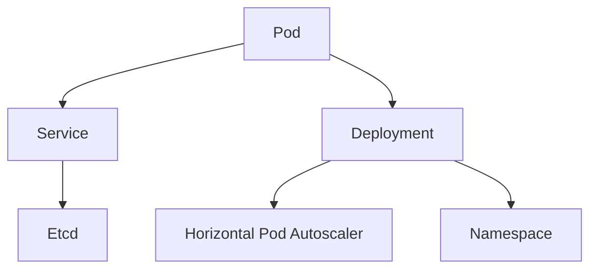

                 

# Kubernetes：容器编排与管理实践

> 关键词：Kubernetes, 容器编排, 微服务架构, 部署管理, 服务发现, 弹性伸缩, 容器化, 开源, DevOps

## 1. 背景介绍

### 1.1 问题由来
随着云计算和微服务架构的兴起，企业应用逐渐从单体应用向分布式微服务演进。微服务架构通过将应用拆分为独立的小服务，能够更灵活地部署、扩展和维护。容器技术则通过提供轻量级的运行环境，进一步提升了微服务的可移植性和可扩展性。然而，随着微服务的数量和复杂度的增加，其管理和部署变得越来越困难。Kubernetes（简称K8s）作为容器编排的领导者，应运而生。

Kubernetes通过提供一套完善的API和控制平面，可以自动调度、扩展、监控和恢复容器化应用，使微服务的部署和运维变得更加高效和可靠。Kubernetes不仅在云原生应用中大放异彩，也被广泛应用于大数据、区块链、物联网等领域的容器化应用。

### 1.2 问题核心关键点
Kubernetes的核心理念是“永不中断的应用”。通过一系列组件和机制，Kubernetes实现了容器应用的自动管理和调度，支持应用的连续部署、弹性伸缩、服务发现和负载均衡等功能。具体而言，Kubernetes主要包括以下几个关键点：

- **自动部署与回滚**：Kubernetes支持持续部署，自动将新的容器镜像部署到集群中。同时，如果新部署失败，Kubernetes可以自动回滚到上一个版本。
- **自愈机制**：Kubernetes会自动修复节点故障，重新调度被中断的容器，保持应用的稳定运行。
- **资源管理**：Kubernetes可以限制容器的资源消耗，避免资源过耗或不足。
- **服务发现与负载均衡**：Kubernetes通过Service对象实现服务发现和负载均衡，使应用可以平稳扩展和弹性伸缩。
- **存储管理**：Kubernetes支持多种存储后端，并提供了持久卷(PV)和持久卷声明(PVC)等机制，支持应用的数据持久化。

这些关键点共同构成了Kubernetes的核心功能和优势，使其成为微服务应用部署和运维的黄金标准。

## 2. 核心概念与联系

### 2.1 核心概念概述

为了更好地理解Kubernetes的编排与管理机制，本节将介绍几个密切相关的核心概念：

- **Pod**：Kubernetes中最小的部署单位，通常包含一个或多个容器，共享网络资源和存储资源。Pod内容器之间可以相互通信，也可以共享同一个IP地址。
- **Service**：用于实现服务发现和负载均衡的机制，通过将Pod暴露为服务，使外部访问变得容易。Service可以与多个Pod建立负载均衡，实现高可用性。
- **Deployment**：用于描述容器应用的期望状态，通过Deploment对象，Kubernetes会自动调整Pod的数量，确保应用达到目标状态。
- **Horizontal Pod Autoscaler**：用于实现应用的弹性伸缩，根据CPU使用率等指标自动调整Pod的数量。
- **Namespace**：用于隔离不同的应用，将集群中的资源进行逻辑隔离。多个Namespace可以看作一个独立的集群。
- **Etcd**：Kubernetes的配置中心，用于存储集群的状态信息和配置数据。

这些核心概念之间的逻辑关系可以通过以下Mermaid流程图来展示：



这个流程图展示了一些关键组件之间的关系：

1. Pod是Kubernetes最基本的部署单位。
2. Service提供服务发现和负载均衡的功能。
3. Deployment定义了应用的期望状态。
4. Horizontal Pod Autoscaler实现弹性伸缩。
5. Namespace用于隔离资源。
6. Etcd存储集群配置和状态信息。

这些组件共同构成了Kubernetes的核心编排与管理机制，使得应用在集群中的运行变得更加高效和稳定。

## 3. 核心算法原理 & 具体操作步骤
### 3.1 算法原理概述

Kubernetes的编排与管理机制主要基于以下几个算法原理：

- **声明式编程模型**：Kubernetes使用声明式编程模型，用户只需描述期望状态，Kubernetes会自动调整，确保达到目标状态。这种模型相比命令式编程更加简洁和易用。
- **自动调度与弹性伸缩**：Kubernetes通过调度器(Scheduler)自动将Pod调度到合适的节点，根据CPU使用率、内存消耗等指标自动调整Pod的数量，实现应用的弹性伸缩。
- **自动回滚与自我修复**：Kubernetes通过Liveness和Readiness Probe机制自动检测容器的健康状态，一旦发现异常，立即重启或替换，确保应用的稳定运行。
- **分布式共识与配置管理**：Kubernetes通过Raft协议实现的分布式共识机制确保集群配置的一致性和可靠性，同时通过Etcd存储集群配置信息。

这些算法原理共同构成了Kubernetes的核心机制，使其能够高效地管理容器化应用，支持应用的自动部署、扩展和恢复。

### 3.2 算法步骤详解

基于Kubernetes的编排与管理机制，以下是其核心算法步骤详解：

1. **配置管理**：在Etcd中存储集群配置和状态信息，用户通过YAML或JSON文件描述应用的状态。
2. **调度与部署**：通过调度器自动将Pod调度到合适的节点，Deployment根据期望状态自动调整Pod数量。
3. **自动监控与回滚**：通过Liveness和Readiness Probe机制自动检测容器健康状态，一旦发现异常立即回滚到上一个版本。
4. **服务发现与负载均衡**：通过Service实现服务发现和负载均衡，使应用可以平稳扩展和弹性伸缩。
5. **存储管理**：支持多种存储后端，提供持久卷(PV)和持久卷声明(PVC)等机制，支持应用的数据持久化。

### 3.3 算法优缺点

Kubernetes的编排与管理机制具有以下优点：

- **自动化**：通过自动调度、监控和回滚机制，减少了人工干预和运维成本。
- **高可用性**：通过自动恢复和自我修复机制，确保应用在节点故障时的稳定运行。
- **高扩展性**：通过水平Pod Autoscaler机制，可以轻松实现应用的弹性伸缩。
- **易用性**：通过声明式编程模型和友好的API，使得应用的部署和运维更加简洁和易用。

同时，Kubernetes也存在以下局限性：

- **复杂性**：Kubernetes的学习曲线较陡峭，尤其是对于初学者和运维人员。
- **资源占用**：Kubernetes需要运行多个守护进程和Etcd服务器，占用较多资源。
- **性能瓶颈**：在集群规模较大时，调度和负载均衡的性能可能成为瓶颈。
- **扩展限制**：某些高级特性如多节点集群、多数据中心部署等需要额外的配置和管理。

尽管存在这些局限性，但就目前而言，Kubernetes仍然是容器编排的事实标准，其强大的自动化和扩展性使得它在众多应用场景中得以广泛应用。

### 3.4 算法应用领域

Kubernetes不仅在云原生应用中大放异彩，还被广泛应用于以下多个领域：

- **大数据**：通过Kubernetes实现大数据组件的容器化和分布式部署，支持Spark、Hadoop、Flink等大数据框架的运行。
- **区块链**：Kubernetes支持多个区块链平台，如Hyperledger Fabric、Ethereum等，提供稳定的容器化运行环境。
- **物联网**：通过Kubernetes实现物联网设备的容器化部署和管理，支持MQTT、CoAP等通信协议。
- **游戏开发**：通过Kubernetes实现游戏的容器化部署和弹性扩展，支持高并发、低延迟的游戏应用。
- **监控与运维**：Kubernetes集成了多种监控和运维工具，如Prometheus、Grafana、ELK Stack等，实现应用的实时监控和故障排查。
- **边缘计算**：通过Kubernetes实现边缘计算设备的容器化部署和管理，支持近场数据处理和本地存储。

这些领域的应用场景展示了Kubernetes的强大灵活性和适应性，使其在众多技术栈和业务场景中得以广泛应用。

## 4. 数学模型和公式 & 详细讲解 & 举例说明
### 4.1 数学模型构建

Kubernetes的编排与管理机制可以通过数学模型来描述。以下是一个简化的Kubernetes编排与管理的数学模型：

1. **节点状态**：集群中有N个节点，每个节点的状态可以用一个二元组 $(n_{cpu}, n_{memory})$ 来表示，其中 $n_{cpu}$ 和 $n_{memory}$ 分别表示节点的CPU和内存资源。
2. **Pod状态**：集群中有M个Pod，每个Pod的状态可以用一个三元组 $(\textit{status}, \textit{resource}, \textit{affinity})$ 来表示，其中 $\textit{status}$ 表示Pod的运行状态，$\textit{resource}$ 表示Pod的资源需求，$\textit{affinity}$ 表示Pod的亲和性需求。
3. **调度器**：通过调度器自动将Pod调度到合适的节点，目标是最大化资源的利用率。

### 4.2 公式推导过程

假设集群中有 $N$ 个节点，每个节点的资源需求可以用一个三元组 $(c_{cpu}, c_{memory})$ 来表示，其中 $c_{cpu}$ 和 $c_{memory}$ 分别表示节点所需的CPU和内存资源。集群中当前有 $M$ 个Pod，每个Pod的资源需求可以用一个三元组 $(o_{cpu}, o_{memory})$ 来表示，其中 $o_{cpu}$ 和 $o_{memory}$ 分别表示Pod所需的CPU和内存资源。

令 $A$ 表示Pod到节点的亲和性矩阵，$C$ 表示节点到Pod的兼容性矩阵，$B$ 表示Pod的资源需求矩阵。则调度器的目标函数可以表示为：

$$
\min \sum_{i=1}^{N} c_{cpu}^i + c_{memory}^i - \sum_{j=1}^{M} o_{cpu}^j + o_{memory}^j
$$

其中，$\sum_{i=1}^{N} c_{cpu}^i + c_{memory}^i$ 表示节点资源需求总和，$\sum_{j=1}^{M} o_{cpu}^j + o_{memory}^j$ 表示Pod资源需求总和。

约束条件为：
$$
\begin{aligned}
& \text{亲和性约束} \\
& A \times C = B \\
& \text{兼容性约束} \\
& C \times A^T = B^T \\
& \text{资源约束} \\
& c_{cpu}^i \geq o_{cpu}^j \quad \forall i,j \\
& c_{memory}^i \geq o_{memory}^j \quad \forall i,j \\
& c_{cpu}^i \geq 0 \quad \forall i \\
& c_{memory}^i \geq 0 \quad \forall i \\
\end{aligned}
$$

其中，$A$ 表示Pod到节点的亲和性矩阵，$C$ 表示节点到Pod的兼容性矩阵，$B$ 表示Pod的资源需求矩阵。

### 4.3 案例分析与讲解

以一个简单的Web应用为例，说明Kubernetes的编排与管理机制。假设我们需要部署一个Web应用，包括三个Pod，每个Pod的资源需求分别为 $(o_{cpu}^1=0.5, o_{memory}^1=512MB)$，$(o_{cpu}^2=0.5, o_{memory}^2=512MB)$，$(o_{cpu}^3=0.5, o_{memory}^3=512MB)$。

集群中有两个节点，每个节点的资源需求分别为 $(c_{cpu}^1=2, c_{memory}^1=4GB)$ 和 $(c_{cpu}^2=2, c_{memory}^2=4GB)$。亲和性矩阵 $A$ 和兼容性矩阵 $C$ 可以表示为：

$$
A = \begin{bmatrix}
1 & 0 & 0 \\
0 & 1 & 0 \\
0 & 0 & 1 \\
\end{bmatrix}, \quad C = \begin{bmatrix}
1 & 0 & 0 \\
0 & 1 & 0 \\
0 & 0 & 1 \\
\end{bmatrix}
$$

根据目标函数和约束条件，调度器会自动将Pod调度到合适的节点上。假设调度器选择了节点1部署Pod1和Pod2，选择了节点2部署Pod3。则目标函数的值为：

$$
c_{cpu}^1 + c_{memory}^1 + c_{cpu}^2 + c_{memory}^2 = 4 + 4 = 8
$$

其中，$c_{cpu}^1 = 1, c_{cpu}^2 = 1$，$c_{memory}^1 = 2, c_{memory}^2 = 2$。

这样，Kubernetes通过调度器自动将Pod调度到合适的节点上，实现了资源的优化利用和应用的稳定运行。

## 5. 项目实践：代码实例和详细解释说明
### 5.1 开发环境搭建

在进行Kubernetes实践前，我们需要准备好开发环境。以下是使用Docker和Kubeadm搭建Kubernetes集群的步骤：

1. 安装Docker：从官网下载并安装Docker，以便在本地运行容器化应用。
2. 安装Kubeadm：从官网下载并安装Kubeadm，用于创建和管理Kubernetes集群。
3. 初始化集群：运行 `kubeadm init` 初始化集群，生成kubeconfig文件和Cluster角色。
4. 部署Kubernetes核心组件：通过kubectl应用部署API应用部署CoreDNS、Kube-proxy、kube-apiserver等核心组件。
5. 部署监控工具：通过kubectl应用部署API应用部署Prometheus、Grafana、ELK Stack等监控工具。

完成上述步骤后，即可在集群中进行Kubernetes应用的部署和管理。

### 5.2 源代码详细实现

以下是使用YAML文件定义Kubernetes Deployment和Service的示例代码：

```yaml
apiVersion: v1
kind: Deployment
metadata:
  name: web-app
spec:
  replicas: 3
  selector:
    matchLabels:
      app: web-app
  template:
    metadata:
      labels:
        app: web-app
    spec:
      containers:
      - name: web-app
        image: my-web-app:latest
        ports:
        - containerPort: 8080
        resources:
          requests:
            cpu: "0.5"
            memory: "512Mi"
---
apiVersion: v1
kind: Service
metadata:
  name: web-app-service
spec:
  selector:
    app: web-app
  ports:
    - protocol: TCP
      port: 80
      targetPort: 8080
  type: LoadBalancer
```

这个YAML文件定义了一个名为 `web-app` 的Deployment，包含3个Pod，每个Pod的资源需求为0.5 CPU和512MB内存。同时定义了一个名为 `web-app-service` 的Service，将Pod暴露为负载均衡服务，使外部访问变得容易。

### 5.3 代码解读与分析

让我们再详细解读一下关键代码的实现细节：

**Deployment类**：
- `apiVersion`：定义API版本，目前为v1。
- `kind`：定义资源类型，目前为Deployment。
- `metadata`：定义资源元数据，如名称、标签等。
- `spec`：定义资源规格，如Pod数量、选择器、模板等。

**Service类**：
- `apiVersion`：定义API版本，目前为v1。
- `kind`：定义资源类型，目前为Service。
- `metadata`：定义资源元数据，如名称、标签等。
- `spec`：定义资源规格，如选择器、端口、类型等。

这个示例代码展示了Kubernetes Deployment和Service的简单实现。通过YAML文件定义的资源规格，Kubernetes会自动调度和管理Pod，提供服务发现和负载均衡功能。

### 5.4 运行结果展示

通过上述代码，我们可以在集群中部署一个Web应用，并观察其运行情况。具体步骤如下：

1. 使用 `kubectl apply -f deployment.yaml` 部署Deployment。
2. 使用 `kubectl apply -f service.yaml` 部署Service。
3. 使用 `kubectl get pods` 查看Pod的运行状态。
4. 使用 `kubectl get service` 查看Service的运行状态。
5. 使用 `kubectl get deployments` 查看Deployment的运行状态。

在本地运行这些命令后，可以通过浏览器访问 `http://<node-ip>:<service-port>`，查看Web应用的运行情况。

## 6. 实际应用场景
### 6.1 智能客服系统

基于Kubernetes的微服务架构，智能客服系统可以轻松实现分布式部署和管理。传统客服系统通常依赖单台机器，一旦机器故障，整个系统将无法正常运行。而通过Kubernetes的自动恢复和自我修复机制，可以确保客服系统在节点故障时的稳定运行。

在实践中，可以收集企业内部的历史客服对话记录，将问题和最佳答复构建成监督数据，在此基础上对预训练模型进行微调。微调后的模型能够自动理解用户意图，匹配最合适的答案模板进行回复。对于客户提出的新问题，还可以接入检索系统实时搜索相关内容，动态组织生成回答。如此构建的智能客服系统，能大幅提升客户咨询体验和问题解决效率。

### 6.2 金融舆情监测

金融机构需要实时监测市场舆论动向，以便及时应对负面信息传播，规避金融风险。传统的人工监测方式成本高、效率低，难以应对网络时代海量信息爆发的挑战。基于Kubernetes的容器化应用，金融舆情监测系统可以更加灵活地部署和管理，支持实时抓取的网络文本数据，自动监测不同主题下的情感变化趋势，一旦发现负面信息激增等异常情况，系统便会自动预警，帮助金融机构快速应对潜在风险。

### 6.3 个性化推荐系统

当前的推荐系统往往只依赖用户的历史行为数据进行物品推荐，无法深入理解用户的真实兴趣偏好。基于Kubernetes的微服务架构，个性化推荐系统可以更好地挖掘用户行为背后的语义信息，从而提供更精准、多样的推荐内容。

在实践中，可以收集用户浏览、点击、评论、分享等行为数据，提取和用户交互的物品标题、描述、标签等文本内容。将文本内容作为模型输入，用户的后续行为（如是否点击、购买等）作为监督信号，在此基础上对预训练语言模型进行微调。微调后的模型能够从文本内容中准确把握用户的兴趣点。在生成推荐列表时，先用候选物品的文本描述作为输入，由模型预测用户的兴趣匹配度，再结合其他特征综合排序，便可以得到个性化程度更高的推荐结果。

### 6.4 未来应用展望

随着Kubernetes的不断发展和演进，其应用场景将更加广泛，为各行各业带来更多的机遇和挑战：

- **工业互联网**：通过Kubernetes实现工业设备的容器化部署和管理，支持实时数据采集和边缘计算。
- **智能制造**：通过Kubernetes实现智能制造设备的容器化部署和管理，支持柔性生产和大数据应用。
- **智慧农业**：通过Kubernetes实现智慧农业设备的容器化部署和管理，支持物联网数据采集和精准农业应用。
- **自动驾驶**：通过Kubernetes实现自动驾驶车辆的容器化部署和管理，支持实时数据处理和决策优化。
- **智慧能源**：通过Kubernetes实现智慧能源设备的容器化部署和管理，支持物联网数据采集和智能调度。
- **智慧城市**：通过Kubernetes实现智慧城市设备的容器化部署和管理，支持实时数据采集和智慧应用。

这些领域的应用场景展示了Kubernetes的强大灵活性和适应性，使其在众多技术栈和业务场景中得以广泛应用。

## 7. 工具和资源推荐
### 7.1 学习资源推荐

为了帮助开发者系统掌握Kubernetes的编排与管理机制，以下是一些优质的学习资源：

1. Kubernetes官方文档：Kubernetes官方文档提供了完整的API和控制平面文档，是学习Kubernetes的最佳资源。
2. Kubernetes实战指南：通过实战案例，详细讲解了Kubernetes的部署、管理、监控和扩展等技巧。
3. Kubernetes权威指南：全面介绍了Kubernetes的设计理念和核心组件，是学习Kubernetes的权威参考书。
4. Kubernetes最佳实践：收集了Kubernetes的实践经验和常见问题，提供了实用的解决方案。
5. Kubernetes视频教程：通过YouTube和Bilibili等平台，可以找到大量的Kubernetes视频教程，帮助快速上手。

通过对这些资源的学习实践，相信你一定能够系统掌握Kubernetes的编排与管理机制，并用于解决实际的运维问题。

### 7.2 开发工具推荐

高效的开发离不开优秀的工具支持。以下是几款用于Kubernetes开发常用的工具：

1. kubectl：Kubernetes命令行工具，支持集群管理和资源操作，是Kubernetes的核心工具。
2. Helm：Kubernetes包管理器，支持应用打包和分发，简化了应用的部署和管理。
3. Minikube：Kubernetes本地开发环境，可以在本地快速搭建Kubernetes集群。
4. kubeflow：基于Kubernetes的机器学习平台，支持深度学习模型的部署和管理。
5. Istio：Kubernetes的微服务网络平台，支持服务的路由、负载均衡和流量控制。
6. Jenkins：开源的持续集成和持续部署工具，支持Kubernetes的自动化部署。

合理利用这些工具，可以显著提升Kubernetes应用的开发效率，加快创新迭代的步伐。

### 7.3 相关论文推荐

Kubernetes的发展离不开学界的持续研究。以下是几篇奠基性的相关论文，推荐阅读：

1. Kubernetes: Container Orchestration in Production：论文详细介绍了Kubernetes的设计理念和核心组件，是Kubernetes的奠基之作。
2. Understanding and Enabling the Cloud Deployment of Large-Scale Distributed Machine Learning Systems in Kubernetes：论文探讨了Kubernetes在分布式机器学习系统中的应用，提出了基于Kubernetes的ML管治平台。
3. Kubernetes in Practice：Kubernetes实战指南，通过大量案例，深入讲解了Kubernetes的部署、管理和监控等技巧。
4. Kubernetes Control Plane Architecture：论文详细介绍了Kubernetes的控制平面架构，包括调度器、控制器和API服务器等组件。
5. Kubernetes in DevOps：论文探讨了Kubernetes在DevOps流程中的应用，提出了基于Kubernetes的CI/CD自动化流程。

这些论文代表了大规模容器编排系统的发展脉络，通过学习这些前沿成果，可以帮助研究者把握学科前进方向，激发更多的创新灵感。

## 8. 总结：未来发展趋势与挑战
### 8.1 总结

本文对Kubernetes的容器编排与管理机制进行了全面系统的介绍。首先阐述了Kubernetes的核心理念和关键点，明确了其在微服务应用部署和运维中的重要作用。其次，从原理到实践，详细讲解了Kubernetes的编排与管理机制，给出了微调任务开发的完整代码实例。同时，本文还广泛探讨了Kubernetes在智能客服、金融舆情、个性化推荐等多个行业领域的应用前景，展示了其强大的灵活性和适应性。此外，本文精选了Kubernetes的学习资源，力求为读者提供全方位的技术指引。

通过本文的系统梳理，可以看到，Kubernetes已经成为微服务应用部署和运维的黄金标准，其强大的自动化和扩展性使得它在众多应用场景中得以广泛应用。未来，伴随Kubernetes的不断发展和演进，其应用场景将更加广泛，为各行各业带来更多的机遇和挑战。

### 8.2 未来发展趋势

展望未来，Kubernetes的发展将呈现以下几个趋势：

1. **多云支持**：Kubernetes将支持更多云平台和云资源，实现跨云应用和资源的管理。
2. **边缘计算**：Kubernetes将支持边缘计算设备，实现本地数据处理和计算。
3. **多节点集群**：Kubernetes将支持多节点集群和分布式架构，实现大规模应用的部署和管理。
4. **多数据中心部署**：Kubernetes将支持多数据中心部署，实现全球化的应用管理。
5. **微服务治理**：Kubernetes将支持更完善的微服务治理机制，实现服务的自动发现、配置管理和负载均衡。
6. **容器化工具链**：Kubernetes将与更多的容器化工具链进行集成，实现更高效的应用部署和管理。
7. **服务网格**：Kubernetes将引入服务网格机制，实现更精细的流量管理和负载均衡。

这些趋势展示了Kubernetes的未来发展方向，使得其在更多领域得到应用，为应用场景带来更多的灵活性和稳定性。

### 8.3 面临的挑战

尽管Kubernetes已经取得了显著的成就，但在迈向更加智能化、普适化应用的过程中，它仍面临诸多挑战：

1. **复杂性**：Kubernetes的学习曲线较陡峭，尤其是对于初学者和运维人员。
2. **资源占用**：Kubernetes需要运行多个守护进程和Etcd服务器，占用较多资源。
3. **性能瓶颈**：在集群规模较大时，调度和负载均衡的性能可能成为瓶颈。
4. **扩展限制**：某些高级特性如多节点集群、多数据中心部署等需要额外的配置和管理。
5. **安全问题**：Kubernetes的安全性需要进一步加强，避免被攻击者利用漏洞。
6. **兼容性问题**：Kubernetes的版本更新和兼容性管理需要更多的运维资源。
7. **社区发展**：Kubernetes社区的持续发展需要更多的贡献者和支持者。

这些挑战需要Kubernetes社区和用户共同努力，不断优化和完善Kubernetes的架构和机制，确保其在更多场景中的稳定运行和高效管理。

### 8.4 研究展望

面对Kubernetes面临的挑战，未来的研究需要在以下几个方面寻求新的突破：

1. **自动化运维**：通过自动化运维工具，减少人工干预，提高运维效率。
2. **多云统一管理**：实现多云平台的统一管理和资源调度，支持跨云应用和资源的管理。
3. **服务网格**：引入服务网格机制，实现更精细的流量管理和负载均衡。
4. **分布式共识**：引入更高效分布式共识机制，提升集群的稳定性和可扩展性。
5. **资源优化**：优化资源调度和管理机制，提升集群的资源利用率。
6. **监控和日志**：引入更完善的监控和日志机制，实现更全面的应用监控和管理。
7. **多数据中心部署**：实现多数据中心部署和数据同步，支持全球化应用管理。

这些研究方向的探索，将引领Kubernetes技术迈向更高的台阶，为构建稳定、可靠、高效、智能的云原生应用铺平道路。面向未来，Kubernetes必将持续发展和演进，成为云原生应用的不二选择。

## 9. 附录：常见问题与解答

**Q1：Kubernetes中的Pod是什么？**

A: Pod是Kubernetes中最小的部署单位，通常包含一个或多个容器，共享网络资源和存储资源。Pod内容器之间可以相互通信，也可以共享同一个IP地址。

**Q2：Kubernetes的调度器是如何工作的？**

A: Kubernetes的调度器会自动将Pod调度到合适的节点上，目标是最大化资源的利用率。调度器会考虑Pod的亲和性、兼容性、资源需求等因素，选择最合适的节点。

**Q3：Kubernetes中的Service是什么？**

A: Service是Kubernetes中用于实现服务发现和负载均衡的机制，通过将Pod暴露为服务，使外部访问变得容易。Service可以与多个Pod建立负载均衡，实现高可用性。

**Q4：Kubernetes的部署方式有哪些？**

A: Kubernetes支持多种部署方式，包括单节点、多节点、命名空间、滚动更新、蓝绿部署等。用户可以根据实际需求选择最合适的部署方式。

**Q5：Kubernetes中如何设置自动伸缩策略？**

A: Kubernetes支持多种自动伸缩策略，包括基于CPU使用率的水平Pod Autoscaler、基于内存使用率的垂直Pod Autoscaler等。用户可以根据应用特点设置合适的自动伸缩策略。

通过以上问题的回答，相信读者能够更全面地理解Kubernetes的编排与管理机制，并应用于实际的微服务部署和管理中。

