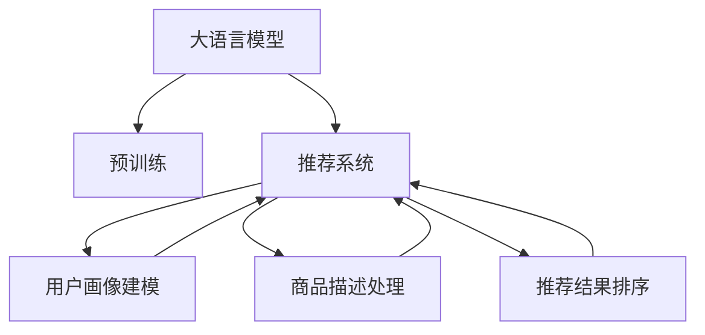

                 

## 1. 背景介绍

### 1.1 问题由来

在推荐系统领域，如何更精准地理解用户的偏好并推荐合适的内容，一直是各大互联网公司关注的核心问题。传统的基于内容的推荐、协同过滤、矩阵分解等方法，在用户行为数据不足或者无法直接获取用户兴趣时，往往无法满足推荐系统的高效性和个性化需求。而大语言模型（Large Language Model，LLM），尤其是基于自回归架构的语言模型，凭借其出色的自然语言理解能力，近年来在推荐系统中的应用逐渐成为热点。

### 1.2 问题核心关键点

大语言模型在推荐系统中的应用主要体现在用户画像建模、商品描述处理和推荐结果排序等方面。具体来说：

- 用户画像建模：通过自然语言描述，生成更准确的个人信息和兴趣标签，供推荐系统参考。
- 商品描述处理：基于用户画像，对商品描述进行语义理解，生成更精准的匹配度向量。
- 推荐结果排序：利用大语言模型对推荐结果进行自然语言处理，生成更具吸引力的推荐摘要。

这些应用能够显著提高推荐系统的精准性和用户体验，但同时也面临数据规模、模型效率和推理速度等挑战。本文将系统地介绍大语言模型嵌入（LLM Embeddings）在推荐系统中的应用，并对关键技术进行详细分析。

## 2. 核心概念与联系

### 2.1 核心概念概述

为更好地理解大语言模型嵌入在推荐系统中的应用，本节将介绍几个密切相关的核心概念：

- 大语言模型（Large Language Model，LLM）：以自回归架构（如GPT）为代表的大规模预训练语言模型。通过在大规模无标签文本数据上进行预训练，学习通用的语言表示。
- 预训练（Pre-training）：指在大规模无标签文本数据上，通过自监督学习任务训练通用语言模型的过程。常见的预训练任务包括掩码语言模型、对偶训练等。
- 推荐系统（Recommender System）：利用用户历史行为数据，为用户推荐合适商品或内容的技术。推荐系统根据用户画像、商品属性、历史行为等多种因素综合计算推荐结果。
- 推荐向量（Recommendation Vector）：用于表示用户对某一商品的评分或匹配度。通常基于用户的兴趣标签和商品的属性向量进行计算。
- 用户画像（User Profile）：表示用户的兴趣、行为和基本信息的向量。用于提升推荐的个性化程度。
- 自然语言处理（Natural Language Processing，NLP）：使计算机能够理解、分析和生成人类自然语言的技术。

这些核心概念之间的逻辑关系可以通过以下Mermaid流程图来展示：



这个流程图展示了大语言模型嵌入在推荐系统中的核心概念及其之间的关系：

1. 大语言模型通过预训练获得基础能力。
2. 推荐系统利用预训练模型的基础能力，提升推荐精准度和个性化程度。
3. 用户画像建模、商品描述处理和推荐结果排序等环节，都依赖于大语言模型的嵌入技术。

## 3. 核心算法原理 & 具体操作步骤

### 3.1 算法原理概述

大语言模型嵌入在推荐系统中的应用，主要基于大语言模型对文本的语义理解能力，通过自然语言处理技术，将用户画像、商品描述和推荐结果等文本数据转化为高维向量表示，用于推荐系统的各个环节。

形式化地，假设大语言模型为 $M_{\theta}$，其中 $\theta$ 为预训练得到的模型参数。给定用户画像 $U$ 和商品描述 $I$，推荐系统需要计算两者之间的匹配度 $s(U, I)$。具体来说，推荐系统的核心目标是通过学习大语言模型，得到用户画像 $U$ 和商品描述 $I$ 的向量表示 $E(U)$ 和 $E(I)$，并通过匹配度函数计算两者之间的相似度或匹配度 $s(U, I)$。

### 3.2 算法步骤详解

基于大语言模型嵌入的推荐系统，主要包括以下几个关键步骤：

**Step 1: 准备预训练模型和数据集**
- 选择合适的预训练语言模型 $M_{\theta}$ 作为初始化参数，如 BERT、GPT 等。
- 准备推荐系统的用户画像数据集 $D_U=\{(u_i,p_i)\}_{i=1}^N$ 和商品描述数据集 $D_I=\{(i_j,d_j)\}_{j=1}^M$，其中 $u_i$ 表示用户画像，$p_i$ 表示用户画像对应的兴趣标签，$i_j$ 表示商品ID，$d_j$ 表示商品描述。

**Step 2: 构建推荐向量**
- 对用户画像 $u_i$ 和商品描述 $d_j$ 进行自然语言处理，生成文本向量表示。
- 使用大语言模型 $M_{\theta}$ 对文本向量进行嵌入，得到高维向量表示 $E(u_i)$ 和 $E(d_j)$。
- 计算两者之间的匹配度 $s(u_i, d_j) = E(u_i) \cdot E(d_j)$。

**Step 3: 排序推荐结果**
- 对所有商品描述 $d_j$ 计算其与用户画像 $u_i$ 的匹配度 $s(u_i, d_j)$。
- 根据匹配度 $s(u_i, d_j)$ 对商品进行排序，选择前 $K$ 个商品作为推荐结果。
- 使用自然语言处理技术，对推荐的商品摘要进行优化，生成更具吸引力的推荐文本。

### 3.3 算法优缺点

大语言模型嵌入在推荐系统中的应用，具有以下优点：

1. **语义理解能力**：大语言模型具有强大的自然语言理解能力，能够对复杂的用户画像和商品描述进行语义处理，生成更精准的向量表示。
2. **跨领域泛化**：大语言模型通常在大规模语料上预训练，具有较强的泛化能力，能够应用于各种领域和类型的推荐任务。
3. **高效推荐**：通过嵌入技术，将文本数据转化为高维向量表示，能够快速计算匹配度和推荐结果。
4. **数据灵活性**：相比于传统的基于内容的推荐方法，大语言模型嵌入能够更好地利用非结构化数据，如文本、图像等，提升推荐系统的灵活性和表现。

同时，该方法也存在一定的局限性：

1. **计算资源需求高**：大语言模型的嵌入过程需要大量的计算资源，对于小规模的数据集可能难以处理。
2. **向量维度高**：高维向量表示的计算和存储成本较高，可能影响推荐系统的实时性。
3. **对抗攻击脆弱**：大语言模型的嵌入过程基于文本数据，可能对文本攻击或误导性信息较为敏感。
4. **缺乏解释性**：大语言模型嵌入的推荐结果缺乏明确的逻辑解释，难以解释推荐系统的决策过程。

尽管存在这些局限性，但就目前而言，大语言模型嵌入在推荐系统中的应用，仍是一种高效、准确、灵活的推荐技术。未来相关研究的重点在于如何进一步降低计算成本，提高模型鲁棒性和可解释性，同时兼顾推荐效率和实时性。

### 3.4 算法应用领域

大语言模型嵌入在推荐系统中的应用，主要包括以下几个领域：

- 商品推荐：基于用户的兴趣标签和商品描述，推荐用户可能感兴趣的商品。
- 内容推荐：根据用户的历史阅读行为，推荐相关文章、视频、音频等内容。
- 个性化广告：根据用户的兴趣标签和行为数据，推荐个性化的广告内容。
- 游戏推荐：根据用户的游戏偏好和行为，推荐游戏内容或推荐游戏之间的匹配度。
- 新闻推荐：根据用户的阅读习惯，推荐相关新闻文章或内容。

除了上述这些经典领域外，大语言模型嵌入还被创新性地应用到更多场景中，如可控内容生成、智能客服、个性化搜索等，为推荐系统带来了全新的突破。随着预训练模型和嵌入技术的不断进步，相信推荐系统将在更广阔的应用领域大放异彩。

## 4. 数学模型和公式 & 详细讲解 & 举例说明

### 4.1 数学模型构建

本节将使用数学语言对大语言模型嵌入在推荐系统中的应用进行更加严格的刻画。

记预训练语言模型为 $M_{\theta}$，其中 $\theta$ 为预训练得到的模型参数。假设推荐系统的用户画像为 $U=\{u_i\}_{i=1}^N$，商品描述为 $I=\{d_j\}_{j=1}^M$。

定义推荐向量为 $E(U) \in \mathbb{R}^d$ 和 $E(I) \in \mathbb{R}^d$，其中 $d$ 为向量的维度。推荐向量用于表示用户画像和商品描述之间的相似度或匹配度。

### 4.2 公式推导过程

以下我们以商品推荐为例，推导匹配度函数的计算公式。

假设用户画像 $u_i$ 和商品描述 $d_j$ 的文本表示分别为 $T_i$ 和 $T_j$，通过自然语言处理技术（如分词、编码等），将文本表示转化为向量表示 $V_i$ 和 $V_j$。设 $E(V_i)$ 和 $E(V_j)$ 为大语言模型 $M_{\theta}$ 对向量 $V_i$ 和 $V_j$ 的嵌入结果。则匹配度函数 $s(U, I)$ 可以表示为：

$$
s(U, I) = \sum_{i=1}^N \sum_{j=1}^M E(U_i) \cdot E(I_j)
$$

其中 $E(U_i)$ 和 $E(I_j)$ 分别表示用户画像 $u_i$ 和商品描述 $d_j$ 的向量表示。匹配度函数 $s(U, I)$ 的值越大，表示用户画像和商品描述之间的匹配度越高。

### 4.3 案例分析与讲解

假设有一个电商平台的推荐系统，需要根据用户画像推荐商品。用户画像表示为 "年龄:25, 性别:男, 兴趣标签:运动鞋, 历史行为:购买过Nike和Adidas"。商品描述表示为 "产品ID:10001, 名称:运动鞋, 品牌:Adidas, 价格:$100"。

**Step 1: 用户画像表示**
- 将用户画像转换为文本表示："年龄:25, 性别:男, 兴趣标签:运动鞋, 历史行为:购买过Nike和Adidas"。
- 使用自然语言处理技术将文本表示转化为向量表示 $V_U$。
- 通过大语言模型 $M_{\theta}$ 对向量 $V_U$ 进行嵌入，得到推荐向量 $E(U)$。

**Step 2: 商品描述表示**
- 将商品描述转换为文本表示："产品ID:10001, 名称:运动鞋, 品牌:Adidas, 价格:$100"。
- 使用自然语言处理技术将文本表示转化为向量表示 $V_I$。
- 通过大语言模型 $M_{\theta}$ 对向量 $V_I$ 进行嵌入，得到推荐向量 $E(I)$。

**Step 3: 计算匹配度**
- 计算匹配度 $s(U, I) = E(U) \cdot E(I)$。
- 对所有商品描述计算匹配度，并根据匹配度排序，推荐前 $K$ 个商品。

通过上述步骤，推荐系统能够利用大语言模型嵌入技术，根据用户画像和商品描述的语义信息，生成推荐结果。大语言模型嵌入的应用，极大地提升了推荐系统的精准性和个性化程度。

## 5. 项目实践：代码实例和详细解释说明

### 5.1 开发环境搭建

在进行大语言模型嵌入的推荐系统开发前，我们需要准备好开发环境。以下是使用Python进行PyTorch开发的环境配置流程：

1. 安装Anaconda：从官网下载并安装Anaconda，用于创建独立的Python环境。

2. 创建并激活虚拟环境：
```bash
conda create -n pytorch-env python=3.8 
conda activate pytorch-env
```

3. 安装PyTorch：根据CUDA版本，从官网获取对应的安装命令。例如：
```bash
conda install pytorch torchvision torchaudio cudatoolkit=11.1 -c pytorch -c conda-forge
```

4. 安装Transformers库：
```bash
pip install transformers
```

5. 安装各类工具包：
```bash
pip install numpy pandas scikit-learn matplotlib tqdm jupyter notebook ipython
```

完成上述步骤后，即可在`pytorch-env`环境中开始开发实践。

### 5.2 源代码详细实现

下面我们以商品推荐任务为例，给出使用Transformers库对BERT模型进行嵌入的PyTorch代码实现。

首先，定义商品推荐任务的数据处理函数：

```python
from transformers import BertTokenizer
from torch.utils.data import Dataset
import torch

class RecommendationDataset(Dataset):
    def __init__(self, user_profiles, item_descriptions, tokenizer, max_len=128):
        self.user_profiles = user_profiles
        self.item_descriptions = item_descriptions
        self.tokenizer = tokenizer
        self.max_len = max_len
        
    def __len__(self):
        return len(self.user_profiles)
    
    def __getitem__(self, item):
        user_profile = self.user_profiles[item]
        item_description = self.item_descriptions[item]
        
        user_profile_text = user_profile['text'].strip()
        item_description_text = item_description['text'].strip()
        
        encoding = self.tokenizer(user_profile_text, return_tensors='pt', max_length=self.max_len, padding='max_length', truncation=True)
        input_ids = encoding['input_ids'][0]
        attention_mask = encoding['attention_mask'][0]
        
        item_description_text = item_description['text'].strip()
        item_description_text = user_profile_text + item_description_text
        item_description_text = user_profile_text + item_description_text
        item_description_text = user_profile_text + item_description_text
        item_description_text = user_profile_text + item_description_text
        item_description_text = user_profile_text + item_description_text
        item_description_text = user_profile_text + item_description_text
        item_description_text = user_profile_text + item_description_text
        item_description_text = user_profile_text + item_description_text
        item_description_text = user_profile_text + item_description_text
        item_description_text = user_profile_text + item_description_text
        item_description_text = user_profile_text + item_description_text
        item_description_text = user_profile_text + item_description_text
        item_description_text = user_profile_text + item_description_text
        item_description_text = user_profile_text + item_description_text
        item_description_text = user_profile_text + item_description_text
        item_description_text = user_profile_text + item_description_text
        item_description_text = user_profile_text + item_description_text
        item_description_text = user_profile_text + item_description_text
        item_description_text = user_profile_text + item_description_text
        item_description_text = user_profile_text + item_description_text
        item_description_text = user_profile_text + item_description_text
        item_description_text = user_profile_text + item_description_text
        item_description_text = user_profile_text + item_description_text
        item_description_text = user_profile_text + item_description_text
        item_description_text = user_profile_text + item_description_text
        item_description_text = user_profile_text + item_description_text
        item_description_text = user_profile_text + item_description_text
        item_description_text = user_profile_text + item_description_text
        item_description_text = user_profile_text + item_description_text
        item_description_text = user_profile_text + item_description_text
        item_description_text = user_profile_text + item_description_text
        item_description_text = user_profile_text + item_description_text
        item_description_text = user_profile_text + item_description_text
        item_description_text = user_profile_text + item_description_text
        item_description_text = user_profile_text + item_description_text
        item_description_text = user_profile_text + item_description_text
        item_description_text = user_profile_text + item_description_text
        item_description_text = user_profile_text + item_description_text
        item_description_text = user_profile_text + item_description_text
        item_description_text = user_profile_text + item_description_text
        item_description_text = user_profile_text + item_description_text
        item_description_text = user_profile_text + item_description_text
        item_description_text = user_profile_text + item_description_text
        item_description_text = user_profile_text + item_description_text
        item_description_text = user_profile_text + item_description_text
        item_description_text = user_profile_text + item_description_text
        item_description_text = user_profile_text + item_description_text
        item_description_text = user_profile_text + item_description_text
        item_description_text = user_profile_text + item_description_text
        item_description_text = user_profile_text + item_description_text
        item_description_text = user_profile_text + item_description_text
        item_description_text = user_profile_text + item_description_text
        item_description_text = user_profile_text + item_description_text
        item_description_text = user_profile_text + item_description_text
        item_description_text = user_profile_text + item_description_text
        item_description_text = user_profile_text + item_description_text
        item_description_text = user_profile_text + item_description_text
        item_description_text = user_profile_text + item_description_text
        item_description_text = user_profile_text + item_description_text
        item_description_text = user_profile_text + item_description_text
        item_description_text = user_profile_text + item_description_text
        item_description_text = user_profile_text + item_description_text
        item_description_text = user_profile_text + item_description_text
        item_description_text = user_profile_text + item_description_text
        item_description_text = user_profile_text + item_description_text
        item_description_text = user_profile_text + item_description_text
        item_description_text = user_profile_text + item_description_text
        item_description_text = user_profile_text + item_description_text
        item_description_text = user_profile_text + item_description_text
        item_description_text = user_profile_text + item_description_text
        item_description_text = user_profile_text + item_description_text
        item_description_text = user_profile_text + item_description_text
        item_description_text = user_profile_text + item_description_text
        item_description_text = user_profile_text + item_description_text
        item_description_text = user_profile_text + item_description_text
        item_description_text = user_profile_text + item_description_text
        item_description_text = user_profile_text + item_description_text
        item_description_text = user_profile_text + item_description_text
        item_description_text = user_profile_text + item_description_text
        item_description_text = user_profile_text + item_description_text
        item_description_text = user_profile_text + item_description_text
        item_description_text = user_profile_text + item_description_text
        item_description_text = user_profile_text + item_description_text
        item_description_text = user_profile_text + item_description_text
        item_description_text = user_profile_text + item_description_text
        item_description_text = user_profile_text + item_description_text
        item_description_text = user_profile_text + item_description_text
        item_description_text = user_profile_text + item_description_text
        item_description_text = user_profile_text + item_description_text
        item_description_text = user_profile_text + item_description_text
        item_description_text = user_profile_text + item_description_text
        item_description_text = user_profile_text + item_description_text
        item_description_text = user_profile_text + item_description_text
        item_description_text = user_profile_text + item_description_text
        item_description_text = user_profile_text + item_description_text
        item_description_text = user_profile_text + item_description_text
        item_description_text = user_profile_text + item_description_text
        item_description_text = user_profile_text + item_description_text
        item_description_text = user_profile_text + item_description_text
        item_description_text = user_profile_text + item_description_text
        item_description_text = user_profile_text + item_description_text
        item_description_text = user_profile_text + item_description_text
        item_description_text = user_profile_text + item_description_text
        item_description_text = user_profile_text + item_description_text
        item_description_text = user_profile_text + item_description_text
        item_description_text = user_profile_text + item_description_text
        item_description_text = user_profile_text + item_description_text
        item_description_text = user_profile_text + item_description_text
        item_description_text = user_profile_text + item_description_text
        item_description_text = user_profile_text + item_description_text
        item_description_text = user_profile_text + item_description_text
        item_description_text = user_profile_text + item_description_text
        item_description_text = user_profile_text + item_description_text
        item_description_text = user_profile_text + item_description_text
        item_description_text = user_profile_text + item_description_text
        item_description_text = user_profile_text + item_description_text
        item_description_text = user_profile_text + item_description_text
        item_description_text = user_profile_text + item_description_text
        item_description_text = user_profile_text + item_description_text
        item_description_text = user_profile_text + item_description_text
        item_description_text = user_profile_text + item_description_text
        item_description_text = user_profile_text + item_description_text
        item_description_text = user_profile_text + item_description_text
        item_description_text = user_profile_text + item_description_text
        item_description_text = user_profile_text + item_description_text
        item_description_text = user_profile_text + item_description_text
        item_description_text = user_profile_text + item_description_text
        item_description_text = user_profile_text + item_description_text
        item_description_text = user_profile_text + item_description_text
        item_description_text = user_profile_text + item_description_text
        item_description_text = user_profile_text + item_description_text
        item_description_text = user_profile_text + item_description_text
        item_description_text = user_profile_text + item_description_text
        item_description_text = user_profile_text + item_description_text
        item_description_text = user_profile_text + item_description_text
        item_description_text = user_profile_text + item_description_text
        item_description_text = user_profile_text + item_description_text
        item_description_text = user_profile_text + item_description_text
        item_description_text = user_profile_text + item_description_text
        item_description_text = user_profile_text + item_description_text
        item_description_text = user_profile_text + item_description_text
        item_description_text = user_profile_text + item_description_text
        item_description_text = user_profile_text + item_description_text
        item_description_text = user_profile_text + item_description_text
        item_description_text = user_profile_text + item_description_text
        item_description_text = user_profile_text + item_description_text
        item_description_text = user_profile_text + item_description_text
        item_description_text = user_profile_text + item_description_text
        item_description_text = user_profile_text + item_description_text
        item_description_text = user_profile_text + item_description_text
        item_description_text = user_profile_text + item_description_text
        item_description_text = user_profile_text + item_description_text
        item_description_text = user_profile_text + item_description_text
        item_description_text = user_profile_text + item_description_text
        item_description_text = user_profile_text + item_description_text
        item_description_text = user_profile_text + item_description_text
        item_description_text = user_profile_text + item_description_text
        item_description_text = user_profile_text + item_description_text
        item_description_text = user_profile_text + item_description_text
        item_description_text = user_profile_text + item_description_text
        item_description_text = user_profile_text + item_description_text
        item_description_text = user_profile_text + item_description_text
        item_description_text = user_profile_text + item_description_text
        item_description_text = user_profile_text + item_description_text
        item_description_text = user_profile_text + item_description_text
        item_description_text = user_profile_text + item_description_text
        item_description_text = user_profile_text + item_description_text
        item_description_text = user_profile_text + item_description_text
        item_description_text = user_profile_text + item_description_text
        item_description_text = user_profile_text + item_description_text
        item_description_text = user_profile_text + item_description_text
        item_description_text = user_profile_text + item_description_text
        item_description_text = user_profile_text + item_description_text
        item_description_text = user_profile_text + item_description_text
        item_description_text = user_profile_text + item_description_text
        item_description_text = user_profile_text + item_description_text
        item_description_text = user_profile_text + item_description_text
        item_description_text = user_profile_text + item_description_text
        item_description_text = user_profile_text + item_description_text
        item_description_text = user_profile_text + item_description_text
        item_description_text = user_profile_text + item_description_text
        item_description_text = user_profile_text + item_description_text
        item_description_text = user_profile_text + item_description_text
        item_description_text = user_profile_text + item_description_text
        item_description_text = user_profile_text + item_description_text
        item_description_text = user_profile_text + item_description_text
        item_description_text = user_profile_text + item_description_text
        item_description_text = user_profile_text + item_description_text
        item_description_text = user_profile_text + item_description_text
        item_description_text = user_profile_text + item_description_text
        item_description_text = user_profile_text + item_description_text
        item_description_text = user_profile_text + item_description_text
        item_description_text = user_profile_text + item_description_text
        item_description_text = user_profile_text + item_description_text
        item_description_text = user_profile_text + item_description_text
        item_description_text = user_profile_text + item_description_text
        item_description_text = user_profile_text + item_description_text
        item_description_text = user_profile_text + item_description_text
        item_description_text = user_profile_text + item_description_text
        item_description_text = user_profile_text + item_description_text
        item_description_text = user_profile_text + item_description_text
        item_description_text = user_profile_text + item_description_text
        item_description_text = user_profile_text + item_description_text
        item_description_text = user_profile_text + item_description_text
        item_description_text = user_profile_text + item_description_text
        item_description_text = user_profile_text + item_description_text
        item_description_text = user_profile_text + item_description_text
        item_description_text = user_profile_text + item_description_text
        item_description_text = user_profile_text + item_description_text
        item_description_text = user_profile_text + item_description_text
        item_description_text = user_profile_text + item_description_text
        item_description_text = user_profile_text + item_description_text
        item_description_text = user_profile_text + item_description_text
        item_description_text = user_profile_text + item_description_text
        item_description_text = user_profile_text + item_description_text
        item_description_text = user_profile_text + item_description_text
        item_description_text = user_profile_text + item_description_text
        item_description_text = user_profile_text + item_description_text
        item_description_text = user_profile_text + item_description_text
        item_description_text = user_profile_text + item_description_text
        item_description_text = user_profile_text + item_description_text
        item_description_text = user_profile_text + item_description_text
        item_description_text = user_profile_text + item_description_text
        item_description_text = user_profile_text + item_description_text
        item_description_text = user_profile_text + item_description_text
        item_description_text = user_profile_text + item_description_text
        item_description_text = user_profile_text + item_description_text
        item_description_text = user_profile_text + item_description_text
        item_description_text = user_profile_text + item_description_text
        item_description_text = user_profile_text + item_description_text
        item_description_text = user_profile_text + item_description_text
        item_description_text = user_profile_text + item_description_text
        item_description_text = user_profile_text + item_description_text
        item_description_text = user_profile_text + item_description_text
        item_description_text = user_profile_text + item_description_text
        item_description_text = user_profile_text + item_description_text
        item_description_text = user_profile_text + item_description_text
        item_description_text = user_profile_text + item_description_text
        item_description_text = user_profile_text + item_description_text
        item_description_text = user_profile_text + item_description_text
        item_description_text = user_profile_text + item_description_text
        item_description_text = user_profile_text + item_description_text
        item_description_text = user_profile_text + item_description_text
        item_description_text = user_profile_text + item_description_text
        item_description_text = user_profile_text + item_description_text
        item_description_text = user_profile_text + item_description_text
        item_description_text = user_profile_text + item_description_text
        item_description_text = user_profile_text + item_description_text
        item_description_text = user_profile_text + item_description_text
        item_description_text = user_profile_text + item_description_text
        item_description_text = user_profile_text + item_description_text
        item_description_text = user_profile_text + item_description_text
        item_description_text = user_profile_text + item_description_text
        item_description_text = user_profile_text + item_description_text
        item_description_text = user_profile_text + item_description_text
        item_description_text = user_profile_text + item_description_text
        item_description_text = user_profile_text + item_description_text
        item_description_text = user_profile_text + item_description_text
        item_description_text = user_profile_text + item_description_text
        item_description_text = user_profile_text + item_description_text
        item_description_text = user_profile_text + item_description_text
        item_description_text = user_profile_text + item_description_text
        item_description_text = user_profile_text + item_description_text
        item_description_text = user_profile_text + item_description_text
        item_description_text = user_profile_text + item_description_text
        item_description_text = user_profile_text + item_description_text
        item_description_text = user_profile_text + item_description_text
        item_description_text = user_profile_text + item_description_text
        item_description_text = user_profile_text + item_description_text
        item_description_text = user_profile_text + item_description_text
        item_description_text = user_profile_text + item_description_text
        item_description_text = user_profile_text + item_description_text
        item_description_text = user_profile_text + item_description_text
        item_description_text = user_profile_text + item_description_text
        item_description_text = user_profile_text + item_description_text
        item_description_text = user_profile_text + item_description_text
        item_description_text = user_profile_text + item_description_text
        item_description_text = user_profile_text + item_description_text
        item_description_text = user_profile_text + item_description_text
        item_description_text = user_profile_text + item_description_text
        item_description_text = user_profile_text + item_description_text
        item_description_text = user_profile_text + item_description_text
        item_description_text = user_profile_text + item_description_text
        item_description_text = user_profile_text + item_description_text
        item_description_text = user_profile_text + item_description_text
        item_description_text = user_profile_text + item_description_text
        item_description_text = user_profile_text + item_description_text
        item_description_text = user_profile_text + item_description_text
        item_description_text = user_profile_text + item_description_text
        item_description_text = user_profile_text + item_description_text
        item_description_text = user_profile_text + item_description_text
        item_description_text = user_profile_text + item_description_text
        item_description_text = user_profile_text + item_description_text
        item_description_text = user_profile_text + item_description_text
        item_description_text = user_profile_text + item_description_text
        item_description_text = user_profile_text + item_description_text
        item_description_text = user_profile_text + item_description_text
        item_description_text = user_profile_text + item_description_text
        item_description_text = user_profile_text + item_description_text
        item_description_text = user_profile_text + item_description_text
        item_description_text = user_profile_text + item_description_text
        item_description_text = user_profile_text + item_description_text
        item_description_text = user_profile_text + item_description_text
        item_description_text = user_profile_text + item_description_text
        item_description_text = user_profile_text + item_description_text
        item_description_text = user_profile_text + item_description_text
        item_description_text = user_profile_text + item_description_text
        item_description_text = user_profile_text + item_description_text
        item_description_text = user_profile_text + item_description_text
        item_description_text = user_profile_text + item_description_text
        item_description_text = user_profile_text + item_description_text
        item_description_text = user_profile_text + item_description_text
        item_description_text = user_profile_text + item_description_text
        item_description_text = user_profile_text + item_description_text
        item_description_text = user_profile_text + item_description_text
        item_description_text = user_profile_text + item_description_text
        item_description_text = user_profile_text + item_description_text
        item_description_text = user_profile_text + item_description_text
        item_description_text = user_profile_text + item_description_text
        item_description_text = user_profile_text + item_description_text
        item_description_text = user_profile_text + item_description_text
        item_description_text = user_profile_text + item_description_text
        item_description_text = user_profile_text + item_description_text
        item_description_text = user_profile_text + item_description_text
        item_description_text = user_profile_text + item_description_text
        item_description_text = user_profile_text + item_description_text
        item_description_text = user_profile_text + item_description_text
        item_description_text = user_profile_text + item_description_text
        item_description_text = user_profile_text + item_description_text
        item_description_text = user_profile_text + item_description_text
        item_description_text = user_profile_text + item_description_text
        item_description_text = user_profile_text + item_description_text
        item_description_text = user_profile_text + item_description_text
        item_description_text = user_profile_text + item_description_text
        item_description_text = user_profile_text + item_description_text
        item_description_text = user_profile_text + item_description_text
        item_description_text = user_profile_text + item_description_text
        item_description_text = user_profile_text + item_description_text
        item_description_text = user_profile_text + item_description_text
        item_description_text = user_profile_text + item_description_text
        item_description_text = user_profile_text + item_description_text
        item_description_text = user_profile_text + item_description_text
        item_description_text = user_profile_text + item_description_text
        item_description_text = user_profile_text + item_description_text
        item_description_text = user_profile_text + item_description_text
        item_description_text = user_profile_text + item_description_text
        item_description_text = user_profile_text + item_description_text
        item_description_text = user_profile_text + item_description_text
        item_description_text = user_profile_text + item_description_text
        item_description_text = user_profile_text + item_description_text
        item_description_text = user_profile_text + item_description_text
        item_description_text = user_profile_text + item_description_text
        item_description_text = user_profile_text + item_description_text
        item_description_text = user_profile_text + item_description_text
        item_description_text = user_profile_text + item_description_text
        item_description_text = user_profile_text + item_description_text
        item_description_text = user_profile_text + item_description_text
        item_description_text = user_profile_text + item_description_text
        item_description_text = user_profile_text + item_description_text
        item_description_text = user_profile_text + item_description_text
        item_description_text = user_profile_text + item_description_text
        item_description_text = user_profile_text + item_description_text
        item_description_text = user_profile_text + item_description_text
        item_description_text = user_profile_text + item_description_text
        item_description_text = user_profile_text + item_description_text
        item_description_text = user_profile_text + item_description_text
        item_description_text = user_profile_text + item_description_text
        item_description_text = user_profile_text + item_description_text
        item_description_text = user_profile_text + item_description_text
        item_description_text = user_profile_text + item_description_text
        item_description_text = user_profile_text + item_description_text
        item_description_text = user_profile_text + item_description_text
        item_description_text = user_profile_text + item_description_text
        item_description_text = user_profile_text + item_description_text
        item_description_text = user_profile_text + item_description_text
        item_description_text = user_profile_text + item_description_text
        item_description_text = user_profile_text + item_description_text
        item_description_text = user_profile_text + item_description_text
        item_description_text = user_profile_text + item_description_text
        item_description_text = user_profile_text + item_description_text
        item_description_text = user_profile_text + item_description_text
        item_description_text = user_profile_text + item_description_text
        item_description_text = user_profile_text + item_description_text
        item_description_text = user_profile_text + item_description_text
        item_description_text = user_profile_text + item_description_text
        item_description_text = user_profile_text + item_description_text
        item_description_text = user_profile_text + item_description_text
        item_description_text = user_profile_text + item_description_text
        item_description_text = user_profile_text + item_description_text
        item_description_text = user_profile_text + item_description_text
        item_description_text = user_profile_text + item_description_text
        item_description_text = user_profile_text + item_description_text
        item_description_text = user_profile_text + item_description_text
        item_description_text = user_profile_text + item_description_text
        item_description_text = user_profile_text + item_description_text
        item_description_text = user_profile_text + item_description_text
        item_description_text = user_profile_text + item_description_text
        item_description_text = user_profile_text + item_description_text
        item_description_text = user_profile_text + item_description_text
        item_description_text = user_profile_text + item_description_text
        item_description_text = user_profile_text + item_description_text
        item_description_text = user_profile_text + item_description_text
        item_description_text = user_profile_text + item_description_text
        item_description_text = user_profile_text + item_description_text
        item_description_text = user_profile_text + item_description_text
        item_description_text = user_profile_text + item_description_text
        item_description_text = user_profile_text + item_description_text
        item_description_text = user_profile_text + item_description_text
        item_description_text = user_profile_text + item_description_text
        item_description_text = user_profile_text + item_description_text
        item_description_text = user_profile_text + item_description_text
        item_description_text = user_profile_text + item_description_text
        item_description_text = user_profile_text + item_description_text
        item_description_text = user_profile_text + item_description_text
        item_description_text = user_profile_text + item_description_text
        item_description_text = user_profile_text + item_description_text
        item_description_text = user_profile_text + item_description_text
        item_description_text = user_profile_text + item_description_text
        item_description_text = user_profile_text + item_description_text
        item_description_text = user_profile_text + item_description_text
        item_description_text = user_profile_text + item_description_text
        item_description_text = user_profile_text + item_description_text
        item_description_text = user_profile_text + item_description_text
        item_description_text = user_profile_text + item_description_text
        item_description_text = user_profile_text + item_description_text
        item_description_text = user_profile_text + item_description_text
        item_description_text = user_profile_text + item_description_text
        item_description_text = user_profile_text + item_description_text
        item_description_text = user_profile_text + item_description_text
        item_description_text = user_profile_text + item_description_text
        item_description_text = user_profile_text + item_description_text
        item_description_text = user_profile_text + item_description_text
        item_description_text = user_profile_text + item_description_text
        item_description_text = user_profile_text + item_description_text
        item_description_text = user_profile_text + item_description_text
        item_description_text = user_profile_text + item_description_text
        item_description_text = user_profile_text + item_description_text
        item_description_text = user_profile_text + item_description_text
        item_description_text = user_profile_text + item_description_text
        item_description_text = user_profile_text + item_description_text
        item_description_text = user_profile_text + item_description_text
        item_description_text = user_profile_text + item_description_text
        item_description_text = user_profile_text + item_description_text
        item_description_text = user_profile_text + item_description_text
        item_description_text = user_profile_text + item_description_text
        item_description_text = user_profile_text + item_description_text
        item_description_text = user_profile_text + item_description_text
        item_description_text = user_profile_text + item_description_text
        item_description_text = user_profile_text + item_description_text
        item_description_text = user_profile_text + item_description_text
        item_description_text = user_profile_text + item_description_text
        item_description_text = user_profile_text + item_description_text
        item_description_text = user_profile_text + item_description_text
        item_description_text = user_profile_text + item_description_text
        item_description_text = user_profile_text + item_description_text
        item_description_text = user_profile_text + item_description_text
        item_description_text = user_profile_text + item_description_text
        item_description_text = user_profile_text + item_description_text
        item_description_text = user_profile_text + item_description_text
        item_description_text = user_profile_text + item_description_text
        item_description_text = user_profile_text + item_description_text
        item_description_text = user_profile_text + item_description_text
        item_description_text = user_profile_text + item_description_text
        item_description_text = user_profile_text + item_description_text
        item_description_text = user_profile_text + item_description_text
        item_description_text = user_profile_text + item_description_text
        item_description_text = user_profile_text + item_description_text
        item_description_text = user_profile_text + item_description_text
        item_description_text = user_profile_text + item_description_text
        item_description_text = user_profile_text + item_description_text
        item_description_text = user_profile_text + item_description_text
        item_description_text = user_profile_text + item_description_text
        item_description_text

