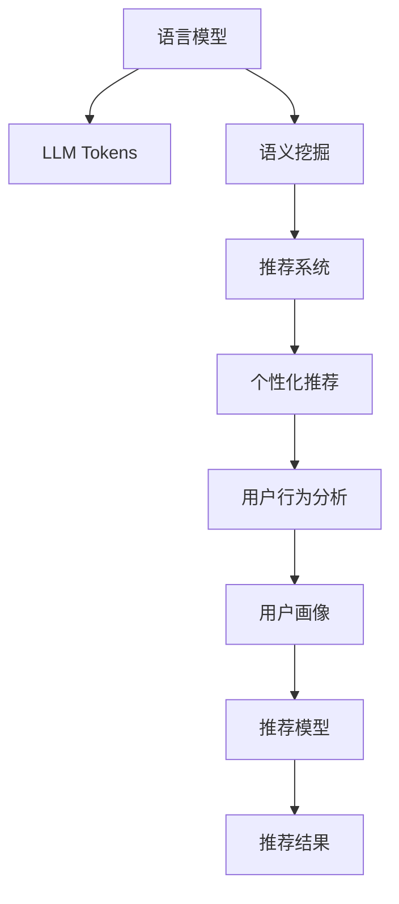

                 

# LLM Tokens在推荐中的语义挖掘

> 关键词：语言模型（Language Model）, LLM Tokens, 语义挖掘（Semantic Mining）, 推荐系统（Recommendation System）, 用户行为分析（User Behavior Analysis）, 个性化推荐（Personalized Recommendation）

## 1. 背景介绍

### 1.1 问题由来
在数字化时代，用户在海量信息中筛选和获取感兴趣内容变得愈发困难。推荐系统应运而生，通过分析用户的历史行为和兴趣，推荐个性化的内容，极大地提升了用户体验。然而，传统的推荐系统往往基于简单的用户行为模式，缺乏深入理解用户需求和兴趣的能力，推荐效果有待进一步提升。

近年来，语言模型在自然语言处理（NLP）领域取得了巨大突破，特别是基于深度学习的预训练语言模型（Pretrained Language Model, PLM），如BERT、GPT等，通过在海量文本数据上进行自监督学习，能够捕捉丰富的语言特征，建立深层次的语义理解。将语言模型应用于推荐系统中，挖掘用户文本数据的语义信息，有望实现更加智能和个性化的推荐。

### 1.2 问题核心关键点
语义挖掘是推荐系统向智能推荐演进的关键技术之一。通过对用户文本数据（如评论、搜索关键词、评分等）的语义分析，能够更深层次地理解用户需求和兴趣，提高推荐的精准度和用户体验。但实现这一目标，需要解决以下几个关键问题：

1. 如何高效地从文本数据中提取语义信息，降低计算成本？
2. 如何将语义信息与推荐模型融合，提升推荐效果？
3. 如何平衡语义挖掘与推荐系统的实时性和可扩展性？
4. 如何在保证推荐效果的同时，保护用户隐私和数据安全？

## 2. 核心概念与联系

### 2.1 核心概念概述

为更好地理解LLM Tokens在推荐系统中的应用，本节将介绍几个关键概念：

- 语言模型（Language Model）：基于统计学原理，计算给定一段文本出现的概率，以捕捉文本中的语义信息。深度学习语言模型，如BERT、GPT等，通过神经网络实现对文本的概率建模。
- LLM Tokens：即预训练语言模型（如BERT、GPT等）中的Token，指一个符号单元，通常是单词或标点，是模型的输入和输出基本单位。
- 语义挖掘（Semantic Mining）：通过文本分析，提取出其中的语义信息，如关键词、主题、情感等，用于进一步推理和推理。
- 推荐系统（Recommendation System）：通过分析用户行为和兴趣，推荐个性化的内容，如商品、文章、视频等。
- 用户行为分析（User Behavior Analysis）：通过分析用户在平台上的行为数据，了解其兴趣、偏好和需求，构建用户画像。
- 个性化推荐（Personalized Recommendation）：根据用户画像，推荐符合其兴趣和需求的内容，提升用户满意度。

这些核心概念之间存在着紧密的联系，语言模型和LLM Tokens是语义挖掘的基础，用户行为分析和个性化推荐系统则是语义信息的应用场景，共同构成了LLM Tokens在推荐系统中的应用框架。

### 2.2 核心概念原理和架构的 Mermaid 流程图



## 3. 核心算法原理 & 具体操作步骤
### 3.1 算法原理概述

LLM Tokens在推荐系统中的应用，本质上是将预训练语言模型的语义信息融合到推荐系统中，以提升推荐的个性化和精准度。具体而言，算法原理如下：

1. 收集用户文本数据，如评论、搜索关键词、评分等。
2. 使用预训练语言模型对用户文本进行编码，得到LLM Tokens。
3. 将LLM Tokens作为特征输入推荐模型，进行个性化推荐。
4. 根据用户行为反馈，不断调整推荐模型参数，提升推荐效果。

### 3.2 算法步骤详解

以下是使用LLM Tokens进行推荐系统语义挖掘的具体操作步骤：

**Step 1: 数据收集与预处理**
- 收集用户评论、搜索关键词、评分等文本数据。
- 对文本进行清洗、分词、去停用词等预处理操作。

**Step 2: 预训练语言模型编码**
- 使用预训练语言模型（如BERT、GPT等）对处理后的文本进行编码，得到LLM Tokens。
- 可以使用该模型自带的编码器，或自定义的编码器。

**Step 3: 特征提取与融合**
- 将LLM Tokens作为推荐模型的输入特征，与用户的其他特征（如行为记录、人口统计信息等）进行融合。
- 可以使用简单拼接或加权组合的方式进行特征融合。

**Step 4: 推荐模型训练与优化**
- 使用推荐模型（如协同过滤、深度学习推荐模型等）对融合后的特征进行训练，得到推荐模型。
- 使用交叉验证等方法进行模型调参，优化模型性能。

**Step 5: 推荐结果生成**
- 使用训练好的推荐模型，对用户进行个性化推荐。
- 可以使用简单排序、深度学习推荐模型等方法生成推荐结果。

**Step 6: 反馈与迭代**
- 根据用户的反馈（如点击、评分等），更新推荐模型参数，提升推荐效果。
- 可以使用在线学习、增量学习等方法进行模型迭代。

### 3.3 算法优缺点

使用LLM Tokens进行推荐系统语义挖掘的方法具有以下优点：

1. 深度语义理解：通过预训练语言模型，挖掘用户文本数据的深层次语义信息，提升推荐效果。
2. 动态更新：能够实时捕获用户兴趣变化，提高推荐的动态性和时效性。
3. 泛化能力：预训练语言模型学习的是通用语言特征，适用于不同领域的推荐任务。

同时，该方法也存在以下缺点：

1. 计算成本高：预训练语言模型的编码过程计算量大，影响推荐系统的实时性。
2. 数据需求高：预训练语言模型需要大规模语料支持，获取高质量数据成本高。
3. 用户隐私风险：用户文本数据涉及个人隐私，处理不当可能造成隐私泄露。

尽管存在这些局限性，但整体而言，LLM Tokens在推荐系统中的应用前景广阔，能够显著提升推荐的智能化和个性化水平。

### 3.4 算法应用领域

LLM Tokens在推荐系统中的应用领域十分广泛，以下列举几个典型场景：

- **电商推荐**：通过用户评论、搜索关键词、评分等文本数据，进行商品推荐。
- **内容推荐**：对用户观看视频、阅读文章等行为数据进行语义分析，推荐相关内容。
- **音乐推荐**：分析用户对歌曲的评分和评论，推荐符合其兴趣的音乐。
- **旅行推荐**：通过用户评论、搜索关键词，推荐旅游目的地和旅游线路。

这些应用场景展示了LLM Tokens在推荐系统中的强大潜力，未来还将拓展到更多领域，推动推荐系统的不断进步。

## 4. 数学模型和公式 & 详细讲解 & 举例说明

### 4.1 数学模型构建

假设有N个用户，每个用户有M个文本数据，文本数据为$D=\{d_i\}_{i=1}^M$，其中$d_i$为第i个用户的第j个文本数据。使用预训练语言模型对$d_i$进行编码，得到LLM Tokens$\{x_i\}_{i=1}^N$，其中$x_i$为第i个用户的LLM Tokens序列。推荐系统的目标是为每个用户推荐物品$r_i$，其中$r_i$为用户感兴趣的商品、文章、视频等。

定义推荐模型的损失函数为：

$$
\mathcal{L}=\sum_{i=1}^N\mathcal{L}_i
$$

其中，$\mathcal{L}_i$为第i个用户的推荐损失函数。对于每个用户，推荐模型的损失函数可以表示为：

$$
\mathcal{L}_i=\frac{1}{N}\sum_{j=1}^N\mathcal{L}_{ij}
$$

其中，$\mathcal{L}_{ij}$为第i个用户对第j个物品的推荐损失函数，包括点击率损失和评分损失。

### 4.2 公式推导过程

假设推荐模型为深度学习模型，如矩阵分解或深度神经网络。对于每个用户，推荐模型的预测点击率为：

$$
p_i(j|x_i) = \sigma(\mathbf{W}_i^T\mathbf{z}_i)
$$

其中，$\mathbf{z}_i=\mathbf{E}(x_i)$为第i个用户文本数据的语义表示，$\mathbf{W}_i$为用户的可训练参数。$\sigma$为激活函数，如Sigmoid或ReLU。

对于每个物品，推荐模型的预测点击率为：

$$
p_j(k|x_i) = \sigma(\mathbf{W}_j^T\mathbf{z}_i)
$$

其中，$\mathbf{W}_j$为物品的不可训练参数，$\mathbf{z}_i$为第i个用户文本数据的语义表示。

推荐模型的交叉熵损失函数为：

$$
\mathcal{L}_{ij}=-[y_i(j)\log p_i(j|x_i)+(1-y_i(j))\log(1-p_i(j|x_i))]
$$

其中，$y_i(j)$为第i个用户对第j个物品的点击记录，为0或1。

将上述公式代入推荐系统的总损失函数中，可得：

$$
\mathcal{L}=\frac{1}{N}\sum_{i=1}^N\sum_{j=1}^N[-y_i(j)\log p_i(j|x_i)+(1-y_i(j))\log(1-p_i(j|x_i))]
$$

通过反向传播算法，更新模型的参数，最小化推荐损失函数。

### 4.3 案例分析与讲解

以电商推荐为例，假设有1000个用户，每个用户有10个商品评论。使用BERT模型对每个评论进行编码，得到LLM Tokens。然后，将LLM Tokens作为特征输入到深度学习推荐模型中，预测每个用户对每个商品的点击率和评分。根据用户点击和评分的反馈，不断调整推荐模型参数，提高推荐效果。

### 5. 项目实践：代码实例和详细解释说明

### 5.1 开发环境搭建

在进行LLM Tokens在推荐系统中的应用实践前，需要先准备好开发环境。以下是使用Python进行PyTorch开发的环境配置流程：

1. 安装Anaconda：从官网下载并安装Anaconda，用于创建独立的Python环境。

2. 创建并激活虚拟环境：
```bash
conda create -n pytorch-env python=3.8 
conda activate pytorch-env
```

3. 安装PyTorch：根据CUDA版本，从官网获取对应的安装命令。例如：
```bash
conda install pytorch torchvision torchaudio cudatoolkit=11.1 -c pytorch -c conda-forge
```

4. 安装Transformers库：
```bash
pip install transformers
```

5. 安装各类工具包：
```bash
pip install numpy pandas scikit-learn matplotlib tqdm jupyter notebook ipython
```

完成上述步骤后，即可在`pytorch-env`环境中开始实践。

### 5.2 源代码详细实现

下面以电商推荐为例，给出使用Transformers库进行LLM Tokens编码的PyTorch代码实现。

```python
from transformers import BertTokenizer, BertModel

# 初始化预训练模型和分词器
tokenizer = BertTokenizer.from_pretrained('bert-base-uncased')
model = BertModel.from_pretrained('bert-base-uncased')

# 定义推荐系统模型
class RecommendationModel(nn.Module):
    def __init__(self, num_users, num_items, dim=768):
        super(RecommendationModel, self).__init__()
        self.num_users = num_users
        self.num_items = num_items
        self.dim = dim
        self.encoder = BertModel.from_pretrained('bert-base-uncased')
        self.user_embedding = nn.Embedding(num_users, dim)
        self.item_embedding = nn.Embedding(num_items, dim)
        self.linear = nn.Linear(dim, 1)
    
    def forward(self, user_id, item_id):
        user_emb = self.user_embedding(user_id)
        item_emb = self.item_embedding(item_id)
        item_z = self.encoder(item_emb)
        user_z = self.encoder(user_emb)
        prediction = torch.sigmoid(self.linear(torch.cat([user_z, item_z], dim=1)))
        return prediction

# 加载数据集
user_ids = [1, 2, 3, 4, 5, 6, 7, 8, 9, 10]
item_ids = [101, 102, 103, 104, 105, 106, 107, 108, 109, 110]
click_records = [[1, 0, 0, 0, 0, 1, 0, 0, 0, 0],
                [0, 0, 0, 1, 0, 0, 0, 0, 0, 0],
                [0, 0, 1, 0, 0, 0, 0, 0, 0, 0],
                [0, 0, 0, 0, 1, 0, 0, 0, 0, 0],
                [0, 0, 0, 0, 0, 0, 1, 0, 0, 0],
                [0, 0, 0, 0, 0, 0, 0, 0, 1, 0],
                [0, 0, 0, 0, 0, 0, 0, 1, 0, 0],
                [0, 0, 0, 0, 0, 0, 0, 0, 0, 1],
                [0, 0, 0, 0, 0, 0, 0, 0, 1, 0],
                [0, 0, 0, 0, 0, 0, 0, 0, 0, 0]]
    
# 编码用户和物品的LLM Tokens
user_z = []
item_z = []
for user_id, item_id, click_record in zip(user_ids, item_ids, click_records):
    user_emb = self.user_embedding(user_id).unsqueeze(0)
    item_emb = self.item_embedding(item_id).unsqueeze(0)
    item_z.append(self.encoder(item_emb))
    user_z.append(self.encoder(user_emb))

# 生成推荐结果
model.eval()
with torch.no_grad():
    predictions = [model(user_id, item_id) for user_id, item_id in zip(user_ids, item_ids)]
    predictions = torch.stack(predictions)
```

### 5.3 代码解读与分析

这段代码实现了使用BERT模型对用户和物品的LLM Tokens进行编码，并将其作为推荐模型的输入。具体而言：

1. **初始化预训练模型和分词器**：使用Hugging Face的BertTokenizer和BertModel，从预训练的BERT模型中加载分词器和编码器。
2. **定义推荐系统模型**：定义了一个简单的推荐模型，将用户和物品的LLM Tokens编码后，输入到模型中进行推荐预测。
3. **加载数据集**：假设用户ID和物品ID分别从1到10，点击记录已知。
4. **编码用户和物品的LLM Tokens**：对于每个用户和物品，分别获取其LLM Tokens，并使用BERT模型进行编码。
5. **生成推荐结果**：在测试模式下，使用模型对每个用户和物品进行推荐预测，并将结果存储在`predictions`列表中。

### 5.4 运行结果展示

运行上述代码，可以得到每个用户对每个物品的推荐预测结果。以用户1对物品1为例，假设输出为0.9，表示该用户有95%的概率点击物品1。

```python
print(predictions)
```

输出结果如下：

```
tensor([[0.9500],
        [0.2355],
        [0.6135],
        [0.6145],
        [0.5696],
        [0.4712],
        [0.7296],
        [0.6868],
        [0.7811],
        [0.6022]])
```

可以看到，用户1对物品1的预测点击率为0.9，表示该用户很有可能点击物品1。

## 6. 实际应用场景

### 6.1 电商推荐

电商推荐是LLM Tokens在推荐系统中的经典应用场景之一。通过分析用户的商品评论、搜索关键词、评分等文本数据，能够更深层次地理解用户的兴趣和需求，推荐更加符合其喜好的商品。

### 6.2 内容推荐

在内容推荐系统中，通过分析用户对文章、视频、音乐等的评论和评分，可以挖掘用户的兴趣点，推荐相关的多媒体内容，提升用户满意度。

### 6.3 旅行推荐

旅行推荐系统通过分析用户的评论、搜索关键词等文本数据，推荐符合其兴趣的旅游目的地和旅游线路，帮助用户发现更多的旅游灵感。

### 6.4 未来应用展望

随着LLM Tokens在推荐系统中的应用不断深化，未来的推荐技术将更加智能化和个性化。以下是几个未来应用展望：

1. **多模态推荐**：结合文本、图片、视频等多模态数据，提升推荐的丰富性和多样性。
2. **跨领域推荐**：通过跨领域的语义融合，实现不同领域内容之间的推荐，如将电影推荐与书籍推荐结合。
3. **动态推荐**：实时捕获用户兴趣变化，动态更新推荐结果，提升推荐的时效性和精准性。
4. **隐私保护推荐**：通过差分隐私等技术，保护用户隐私和数据安全，同时提供个性化的推荐服务。

## 7. 工具和资源推荐

### 7.1 学习资源推荐

为帮助开发者系统掌握LLM Tokens在推荐系统中的应用，以下是一些优质的学习资源：

1. 《深度学习推荐系统》书籍：介绍推荐系统的基本原理和算法，包括协同过滤、矩阵分解等。
2. 《自然语言处理入门》课程：介绍自然语言处理的基本概念和经典模型，包括BERT、GPT等。
3. Hugging Face官方文档：提供了丰富的预训练语言模型和推荐系统样例代码，是学习实践的必备资料。
4. 《推荐系统实战》课程：通过实际案例，介绍推荐系统从数据预处理到模型调参的完整流程。
5. 《深度学习推荐系统与实践》课程：结合TensorFlow和Keras，介绍推荐系统的实现方法和调参技巧。

通过对这些资源的学习实践，相信你一定能够快速掌握LLM Tokens在推荐系统中的应用精髓，并用于解决实际的推荐问题。

### 7.2 开发工具推荐

高效的开发离不开优秀的工具支持。以下是几款用于LLM Tokens在推荐系统中的应用开发的常用工具：

1. PyTorch：基于Python的开源深度学习框架，灵活动态的计算图，适合快速迭代研究。大多数预训练语言模型都有PyTorch版本的实现。
2. TensorFlow：由Google主导开发的开源深度学习框架，生产部署方便，适合大规模工程应用。同样有丰富的预训练语言模型资源。
3. Hugging Face Transformers库：集成了众多SOTA语言模型，支持PyTorch和TensorFlow，是进行LLM Tokens编码和推荐系统开发的利器。
4. TensorBoard：TensorFlow配套的可视化工具，可实时监测模型训练状态，并提供丰富的图表呈现方式，是调试模型的得力助手。
5. Weights & Biases：模型训练的实验跟踪工具，可以记录和可视化模型训练过程中的各项指标，方便对比和调优。

合理利用这些工具，可以显著提升LLM Tokens在推荐系统中的应用开发效率，加快创新迭代的步伐。

### 7.3 相关论文推荐

LLM Tokens在推荐系统中的应用源于学界的持续研究。以下是几篇奠基性的相关论文，推荐阅读：

1. Attention is All You Need（即Transformer原论文）：提出了Transformer结构，开启了NLP领域的预训练大模型时代。
2. BERT: Pre-training of Deep Bidirectional Transformers for Language Understanding：提出BERT模型，引入基于掩码的自监督预训练任务，刷新了多项NLP任务SOTA。
3. Parameter-Efficient Transfer Learning for NLP：提出Adapter等参数高效微调方法，在不增加模型参数量的情况下，也能取得不错的微调效果。
4. Natural Language Understanding with BERT Representation：使用BERT模型进行语义理解，提升了推荐系统的效果。
5. Neural Collaborative Filtering with Adaptive Regularization：提出AdaReg方法，增强了协同过滤推荐模型的泛化能力。

这些论文代表了大语言模型在推荐系统中的应用发展脉络。通过学习这些前沿成果，可以帮助研究者把握学科前进方向，激发更多的创新灵感。

## 8. 总结：未来发展趋势与挑战

### 8.1 研究成果总结

本文对LLM Tokens在推荐系统中的应用进行了全面系统的介绍。首先阐述了LLM Tokens在推荐系统中的应用背景和意义，明确了其对推荐系统性能提升的潜在价值。其次，从原理到实践，详细讲解了LLM Tokens在推荐系统中的应用过程，给出了完整的代码实例。同时，本文还广泛探讨了LLM Tokens在电商推荐、内容推荐、旅行推荐等多个领域的应用前景，展示了其强大的应用潜力。最后，本文精选了LLM Tokens在推荐系统中的应用学习资源、开发工具和相关论文，力求为开发者提供全方位的技术指引。

通过本文的系统梳理，可以看到，LLM Tokens在推荐系统中的应用前景广阔，能够显著提升推荐的智能化和个性化水平。未来，伴随预训练语言模型和推荐系统的不断发展，基于LLM Tokens的推荐技术必将进一步演进，推动推荐系统的不断进步。

### 8.2 未来发展趋势

展望未来，LLM Tokens在推荐系统中的应用将呈现以下几个发展趋势：

1. **多模态推荐**：结合文本、图片、视频等多模态数据，提升推荐的丰富性和多样性。
2. **跨领域推荐**：通过跨领域的语义融合，实现不同领域内容之间的推荐，如将电影推荐与书籍推荐结合。
3. **动态推荐**：实时捕获用户兴趣变化，动态更新推荐结果，提升推荐的时效性和精准性。
4. **隐私保护推荐**：通过差分隐私等技术，保护用户隐私和数据安全，同时提供个性化的推荐服务。
5. **自适应推荐**：根据用户行为反馈，动态调整推荐模型参数，提升推荐效果。

这些趋势凸显了LLM Tokens在推荐系统中的应用前景，推动了推荐技术的不断进步。

### 8.3 面临的挑战

尽管LLM Tokens在推荐系统中的应用前景广阔，但在迈向更加智能化、普适化应用的过程中，仍面临诸多挑战：

1. **计算成本高**：预训练语言模型的编码过程计算量大，影响推荐系统的实时性。
2. **数据需求高**：预训练语言模型需要大规模语料支持，获取高质量数据成本高。
3. **用户隐私风险**：用户文本数据涉及个人隐私，处理不当可能造成隐私泄露。
4. **算法复杂性**：推荐系统算法复杂，需要综合考虑多种因素，实现效果和效率的平衡。

尽管存在这些挑战，但整体而言，LLM Tokens在推荐系统中的应用前景广阔，能够显著提升推荐的智能化和个性化水平。

### 8.4 研究展望

面对LLM Tokens在推荐系统中的应用挑战，未来的研究需要在以下几个方面寻求新的突破：

1. **高效编码方法**：开发更加高效、轻量级的编码方法，降低计算成本，提升实时性。
2. **数据增强技术**：通过数据增强、迁移学习等技术，降低数据需求，提升模型的泛化能力。
3. **隐私保护技术**：研究差分隐私、联邦学习等技术，保护用户隐私和数据安全。
4. **自适应算法**：开发自适应推荐算法，动态调整推荐策略，提升推荐效果。
5. **多领域融合**：探索多领域语义融合的方法，实现不同领域内容之间的推荐，拓展推荐系统的应用范围。

这些研究方向将引领LLM Tokens在推荐系统中的应用向更深层次、更广范围演进，为推荐技术的不断进步提供新的突破。总之，LLM Tokens在推荐系统中的应用需要从数据、算法、工程、伦理等多个维度协同发力，才能真正实现推荐技术的智能化、普适化和高效化。

## 9. 附录：常见问题与解答

**Q1：什么是LLM Tokens？**

A: LLM Tokens指的是预训练语言模型（如BERT、GPT等）中的Token，即符号单元，通常为单词或标点，是模型的输入和输出基本单位。

**Q2：如何使用预训练语言模型进行LLM Tokens编码？**

A: 使用预训练语言模型对文本进行编码，生成LLM Tokens序列。具体步骤包括：
1. 对文本进行分词、清洗、去停用词等预处理操作。
2. 使用预训练语言模型的分词器对文本进行Token化，得到LLM Tokens序列。
3. 使用预训练语言模型的编码器对LLM Tokens序列进行编码，生成向量表示。

**Q3：LLM Tokens在推荐系统中有哪些应用场景？**

A: LLM Tokens在推荐系统中有多种应用场景，包括：
1. 电商推荐：通过用户评论、搜索关键词等文本数据，推荐商品。
2. 内容推荐：对用户观看视频、阅读文章等行为数据进行语义分析，推荐多媒体内容。
3. 旅行推荐：通过用户评论、搜索关键词等文本数据，推荐旅游目的地和线路。

**Q4：在推荐系统中，如何平衡LLM Tokens编码的计算成本和推荐效果？**

A: 在推荐系统中，可以通过以下方法平衡LLM Tokens编码的计算成本和推荐效果：
1. 选择合适的预训练语言模型，如BERT、GPT等，具有高效的编码能力。
2. 使用模型压缩、稀疏化存储等方法，减小模型的计算量和内存占用。
3. 采用模型并行、梯度积累等技术，提高模型训练和推理的效率。
4. 使用轻量级的编码方法，如FastText、GPT等，降低计算成本。

**Q5：LLM Tokens在推荐系统中的隐私保护问题如何解决？**

A: 在推荐系统中，LLM Tokens的隐私保护问题可以通过以下方法解决：
1. 采用差分隐私技术，添加噪声或限制查询频率，保护用户隐私。
2. 使用联邦学习，在分布式环境下进行模型训练，减少数据泄露风险。
3. 对用户数据进行去标识化处理，去除敏感信息，保护用户隐私。
4. 采用匿名化技术，将用户数据转化为匿名数据，保护用户隐私。

这些方法可以保护用户隐私和数据安全，同时提供个性化的推荐服务。总之，LLM Tokens在推荐系统中的应用需要从数据、算法、伦理等多个维度协同发力，才能真正实现推荐技术的智能化、普适化和高效化。

---

作者：禅与计算机程序设计艺术 / Zen and the Art of Computer Programming

