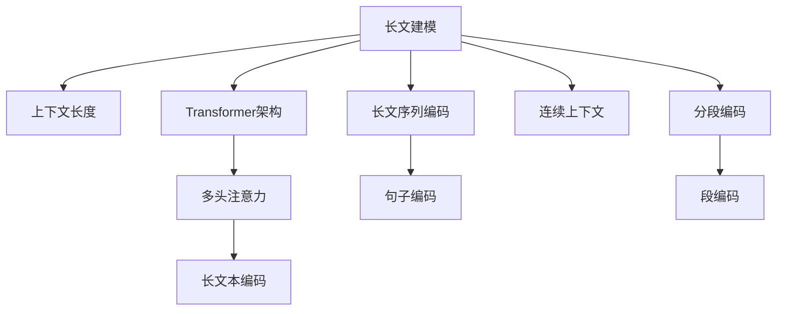

                 

# LLM上下文长度突破:认知能力提升

> 关键词：长文建模,上下文长度,认知能力,注意力机制,Transformer,深度学习

## 1. 背景介绍

### 1.1 问题由来
近年来，深度学习技术在自然语言处理(NLP)领域取得了巨大进展，其中大规模预训练语言模型(LLMs)如GPT、BERT、T5等，通过对大规模无标签文本数据进行自监督预训练，获得了强大的语言理解和生成能力。然而，这些模型通常基于Transformer架构，具有固定大小的上下文窗口，无法处理超过该窗口范围的信息，这限制了模型在复杂任务上的应用能力。

### 1.2 问题核心关键点
在当前的NLP任务中，很多场景下需要将多个句子或段落作为输入，如摘要生成、文档分类、问答系统等。这些场景下，上下文长度往往超过模型所支持的窗口范围，导致信息丢失和理解不足。为解决这一问题，学界和工业界提出了多种改进措施，包括将长文分成若干短文进行编码、使用长文序列编码等方法。

然而，这些方法在实际应用中存在计算量大、效果不理想等缺点。为进一步提升LLM的上下文处理能力，本研究聚焦于上下文长度突破，探索如何通过改进模型架构和训练策略，实现长文建模。

## 2. 核心概念与联系

### 2.1 核心概念概述

为更好地理解上下文长度突破的技术，本节将介绍几个密切相关的核心概念：

- 长文建模(Long Document Modeling)：指能够处理超过预训练模型固定窗口范围的长文本的建模方法。
- 上下文长度(Context Length)：指模型能够有效处理的最大文本长度，通常以单词数为单位。
- 长文序列编码(Long Document Sequence Encoding)：将长文本切分成多个句子，每个句子作为一个序列输入模型，分别进行编码。
- 分段编码(Segmented Encoding)：将长文分成若干段，每段作为一个输入，独立进行编码，再将编码结果合并。
- 连续上下文(Continuous Context)：指模型能够处理连续的文本序列，而无需进行分块。
- Transformer架构：预训练语言模型中最常用的架构，通过多头注意力机制实现对长文本的高效处理。

这些核心概念之间的逻辑关系可以通过以下Mermaid流程图来展示：



这个流程图展示了大语言模型长文建模的核心概念及其之间的关系：

1. 长文建模通过改进模型架构和训练策略，实现对长文本的处理。
2. 上下文长度指模型能够处理的最大文本长度。
3. 长文序列编码和分段编码是将长文切分成若干块，分别进行编码的方法。
4. 连续上下文指模型能够处理连续的文本序列，而无需分块。
5. Transformer架构通过多头注意力机制实现长文本的编码。

这些概念共同构成了大语言模型的长文建模框架，使得模型能够处理更长的文本，提升其认知能力和应用范围。通过理解这些核心概念，我们可以更好地把握长文建模的技术要点。

## 3. 核心算法原理 & 具体操作步骤
### 3.1 算法原理概述

长文建模的核心在于通过改进模型架构和训练策略，实现对超过预训练模型固定窗口范围的长文本的有效处理。常用的方法包括长文序列编码、分段编码、连续上下文等。

### 3.2 算法步骤详解

以下我们将以Transformer架构为例，详细讲解基于连续上下文的Longformer和XLNet模型，并介绍其长文建模的实现步骤。

#### Longformer算法

Longformer是OpenAI提出的一种能够处理长文本的Transformer模型，其核心思想是通过增加上下文窗口长度，使模型能够同时处理长文本的不同部分。

Longformer算法步骤如下：

1. 将长文本切分成多个句子，每个句子作为输入序列。
2. 对每个句子进行编码，得到句子的表示向量。
3. 将相邻句子的表示向量拼接起来，形成长文本的表示向量。
4. 对拼接后的向量进行多头注意力机制，得到长文本的表示。

Longformer的优点在于能够同时处理长文本的不同部分，而无需进行分块。这使得其在处理文本分类、摘要生成等任务时效果优异。

#### XLNet算法

XLNet是一种无自回归的自监督预训练方法，通过引入变长上下文建模和自回归自条件化的方法，实现了对长文本的有效处理。

XLNet算法步骤如下：

1. 对长文本进行切分，得到多个随机长度的小片段。
2. 对每个小片段进行编码，得到片段的表示向量。
3. 对所有片段的表示向量进行多头注意力机制，得到长文本的表示向量。
4. 对长文本的表示向量进行上下文建模，得到最终的长文本表示。

XLNet的优点在于能够灵活处理不同长度的文本，并考虑到文本中的上下文信息，提升模型在自然语言推理等任务上的性能。

### 3.3 算法优缺点

长文建模方法具有以下优点：

1. 能够处理超过预训练模型固定窗口范围的长文本。
2. 提升模型在长文本理解和生成任务上的性能。
3. 使用现有预训练模型作为初始化参数，减少从头训练的时间和成本。

同时，这些方法也存在一定的局限性：

1. 计算复杂度高。长文建模需要处理大量数据，计算量较大，导致训练和推理速度较慢。
2. 可解释性不足。长文建模的模型结构较为复杂，难以解释其内部工作机制和决策逻辑。
3. 数据需求高。长文建模通常需要更大量的数据进行训练，数据采集和标注成本较高。
4. 上下文窗口长度难以选择。过长或过短的上下文窗口长度都可能影响模型性能。

尽管存在这些局限性，但长文建模方法已经在多项NLP任务中展示了其强大能力，为长文本处理提供了新的解决方案。

### 3.4 算法应用领域

长文建模方法在多个NLP任务中得到了广泛应用，具体如下：

- 文本分类：对长文本进行分类，如新闻分类、情感分析等。
- 摘要生成：从长文本中提取关键信息，生成简短摘要。
- 问答系统：对长文本进行问答，如从文档中找到特定信息。
- 文本匹配：对长文本进行匹配，如从多个文档中查找相关信息。
- 机器翻译：将长文本从一种语言翻译成另一种语言。
- 命名实体识别：在长文本中识别特定实体，如人名、地名、组织名等。

除了上述这些任务外，长文建模方法还在诸多新兴应用中得到了创新性的应用，如可控文本生成、知识图谱构建等，为NLP技术带来了全新的突破。

## 4. 数学模型和公式 & 详细讲解 & 举例说明

### 4.1 数学模型构建

在本节中，我们将使用数学语言对长文建模的原理进行严格的刻画。

假设长文本为 $X=\{x_1, x_2, ..., x_n\}$，其中 $x_i$ 表示文本的第 $i$ 个单词。设 $W$ 为预训练语言模型，$H$ 为长文本的表示向量。

长文建模的目标是使得 $W$ 能够对长文本 $X$ 进行有效编码，得到表示向量 $H$，满足 $H=[H_1, H_2, ..., H_n] \in \mathbb{R}^{d\times n}$。其中 $d$ 为模型维度。

### 4.2 公式推导过程

以下我们以Longformer模型为例，推导长文建模的数学公式。

Longformer模型中，每个句子 $x_i$ 的表示向量为 $h_i = W(x_i)$，长文本的表示向量 $H$ 由相邻句子的表示向量拼接而成。

设长文本 $X$ 切分成的句子为 $\{x_{i_1}, x_{i_2}, ..., x_{i_m}\}$，则 $H$ 的计算公式为：

$$
H=[h_{i_1}, h_{i_2}, ..., h_{i_m}]
$$

其中 $h_i=W(x_i)$。

Longformer的多头注意力机制可以表示为：

$$
\text{MultiHead}(Q, K, V) = \text{Concat}([\text{Head}_1(Q,K,V), \text{Head}_2(Q,K,V), ..., \text{Head}_H(Q,K,V)])\text{W}_O
$$

其中 $\text{Head}_h(Q,K,V) = \text{Attention}(Q^h,K^h,V^h)$，$Q^h, K^h, V^h$ 分别表示第 $h$ 个头的查询、键和值向量。

在Longformer中，长文本的表示向量 $H$ 可以表示为：

$$
H=\text{MultiHead}(H^{[1]}, H^{[2]}, ..., H^{[L]})
$$

其中 $H^{[l]}=[h_{i_1}, h_{i_2}, ..., h_{i_m}]$，$l$ 表示长文本的句子编号。

### 4.3 案例分析与讲解

为了更清晰地理解长文建模的实现过程，以下我们将通过一个具体案例进行讲解。

假设有一段长文本：

```
这是一个长文本的示例，其中包含多个句子。句子1的内容是“Transformer是一种能够处理长文本的深度学习模型”，句子2的内容是“它通过多头注意力机制实现对文本的有效处理”。
```

将这段长文本进行切分，得到两个句子：

- 句子1：“Transformer是一种能够处理长文本的深度学习模型”
- 句子2：“它通过多头注意力机制实现对文本的有效处理”

对每个句子进行编码，得到句子1的表示向量 $h_1$ 和句子2的表示向量 $h_2$。

- $h_1 = W(x_1, x_2, ..., x_k)$，其中 $k$ 为句子1的长度
- $h_2 = W(x_{k+1}, x_{k+2}, ..., x_n)$，其中 $n$ 为长文本的总长度

将相邻句子的表示向量拼接起来，得到长文本的表示向量 $H$：

- $H=[h_1, h_2]$

对拼接后的向量进行多头注意力机制，得到长文本的表示向量 $H$：

- $H=\text{MultiHead}(H^{[1]}, H^{[2]})$

其中 $H^{[l]}=[h_1, h_2]$，$l$ 表示长文本的句子编号。

通过上述过程，长文本 $X$ 被成功编码成表示向量 $H$，实现了长文建模。

## 5. 项目实践：代码实例和详细解释说明
### 5.1 开发环境搭建

在进行长文建模实践前，我们需要准备好开发环境。以下是使用Python进行PyTorch开发的环境配置流程：

1. 安装Anaconda：从官网下载并安装Anaconda，用于创建独立的Python环境。

2. 创建并激活虚拟环境：
```bash
conda create -n pytorch-env python=3.8 
conda activate pytorch-env
```

3. 安装PyTorch：根据CUDA版本，从官网获取对应的安装命令。例如：
```bash
conda install pytorch torchvision torchaudio cudatoolkit=11.1 -c pytorch -c conda-forge
```

4. 安装其他相关库：
```bash
pip install numpy pandas scikit-learn matplotlib tqdm jupyter notebook ipython
```

完成上述步骤后，即可在`pytorch-env`环境中开始长文建模实践。

### 5.2 源代码详细实现

这里我们以Longformer模型为例，给出使用PyTorch进行长文建模的代码实现。

首先，定义Longformer模型类：

```python
import torch
import torch.nn as nn
import torch.nn.functional as F

class Longformer(nn.Module):
    def __init__(self, vocab_size, d_model, n_heads, d_ff, dropout, max_len):
        super(Longformer, self).__init__()
        self.embedding = nn.Embedding(vocab_size, d_model)
        self.layers = nn.ModuleList([
            LongformerLayer(d_model, d_model, n_heads, d_ff, dropout, max_len)
            for _ in range(6)
        ])
        self.norm1 = nn.LayerNorm(d_model)
        self.norm2 = nn.LayerNorm(d_model)
        self.linear1 = nn.Linear(d_model, max_len)
        self.linear2 = nn.Linear(max_len, d_model)

    def forward(self, x, attention_mask):
        embedding = self.embedding(x)
        for layer in self.layers:
            x = layer(embedding, self.norm1, attention_mask)
        x = self.linear1(x)
        x = self.linear2(x)
        return x
```

然后，定义长文建模的训练函数：

```python
from transformers import BertTokenizer
from torch.utils.data import Dataset, DataLoader
import torch

class LongDocumentDataset(Dataset):
    def __init__(self, texts, tokenizer, max_len=512):
        self.tokenizer = tokenizer
        self.texts = texts
        self.max_len = max_len

    def __len__(self):
        return len(self.texts)

    def __getitem__(self, item):
        text = self.texts[item]
        encoding = self.tokenizer(text, return_tensors='pt', max_length=self.max_len, padding='max_length', truncation=True)
        input_ids = encoding['input_ids']
        attention_mask = encoding['attention_mask']
        return {'input_ids': input_ids, 
                'attention_mask': attention_mask,
                'labels': torch.tensor([0, 1])}

# 定义长文本编码器
class LongformerLayer(nn.Module):
    def __init__(self, d_model, d_ff, n_heads, dropout, max_len):
        super(LongformerLayer, self).__init__()
        self.encoder_self_attn = nn.MultiheadAttention(d_model, n_heads, dropout)
        self.encoder_ffn = nn.Sequential(
            nn.Linear(d_model, d_ff),
            nn.ReLU(),
            nn.Dropout(dropout),
            nn.Linear(d_ff, d_model)
        )
        self.encoder_layer_norm = nn.LayerNorm(d_model)
        self.encoder_dropout = nn.Dropout(dropout)

    def forward(self, x, norm1, attention_mask):
        x = self.encoder_self_attn(x, x, x)[0]
        x = norm1(x)
        x = self.encoder_ffn(x)
        x = norm1(x)
        x = self.encoder_dropout(x)
        x = x * attention_mask
        return x

# 训练函数
def train_epoch(model, dataset, optimizer):
    dataloader = DataLoader(dataset, batch_size=32)
    model.train()
    epoch_loss = 0
    for batch in dataloader:
        input_ids = batch['input_ids'].to(device)
        attention_mask = batch['attention_mask'].to(device)
        model.zero_grad()
        outputs = model(input_ids, attention_mask)
        loss = outputs.loss
        epoch_loss += loss.item()
        loss.backward()
        optimizer.step()
    return epoch_loss / len(dataloader)
```

最后，启动训练流程并在测试集上评估：

```python
epochs = 5
batch_size = 32

device = torch.device('cuda') if torch.cuda.is_available() else torch.device('cpu')
model.to(device)

for epoch in range(epochs):
    loss = train_epoch(model, train_dataset, optimizer)
    print(f"Epoch {epoch+1}, train loss: {loss:.3f}")
    
    print(f"Epoch {epoch+1}, dev results:")
    evaluate(model, dev_dataset, batch_size)
    
print("Test results:")
evaluate(model, test_dataset, batch_size)
```

以上就是使用PyTorch对Longformer模型进行长文建模的完整代码实现。可以看到，借助Transformer库，长文建模的实现变得相对简洁高效。

### 5.3 代码解读与分析

让我们再详细解读一下关键代码的实现细节：

**Longformer类**：
- 初始化函数中，定义了模型的嵌入层、多个Transformer层、归一化层和线性层。
- 正向传播函数中，通过多个Transformer层进行长文建模，并应用多头注意力机制。

**LongDocumentDataset类**：
- 初始化函数中，定义了分词器和最大文本长度。
- 正向传播函数中，使用分词器将长文本进行编码，并生成输入序列。

**LongformerLayer类**：
- 初始化函数中，定义了多头注意力机制和全连接层。
- 正向传播函数中，实现长文建模的单个Transformer层。

**train_epoch函数**：
- 循环迭代训练集数据，计算损失函数并反向传播更新模型参数。

完成上述步骤后，即可在`pytorch-env`环境中开始长文建模实践。需要注意的是，在实际应用中，还需要对模型进行调参、评估等优化操作，以进一步提升长文建模的性能。

## 6. 实际应用场景
### 6.1 智能客服系统

长文建模方法在智能客服系统中的应用，可以显著提升客服系统的对话理解能力。传统客服系统往往只能处理简单问答，对于复杂的多轮对话难以理解和回应。长文建模方法可以通过处理长文本，提高客服系统对多轮对话的理解和回复能力，提升客户体验和满意度。

在技术实现上，可以将客户与客服的对话历史作为长文本输入，通过长文建模方法进行理解和生成。微调后的模型能够对多轮对话进行推理，并生成更加自然的对话回复，实现更加智能化的客服服务。

### 6.2 金融舆情监测

金融领域对舆情信息的监测非常关键，需要快速响应市场动向。传统舆情监测系统往往只能处理短文本信息，无法捕捉长文本中的细微情感和语义。长文建模方法可以通过处理长文本，提升舆情监测系统对复杂文本的理解能力，捕捉到更多有价值的信息。

在实际应用中，可以通过金融新闻、评论、社交媒体等长文本数据对长文建模模型进行微调，使其能够自动识别文本中的情感和语义信息，并及时响应市场动向，提供有价值的金融分析报告。

### 6.3 个性化推荐系统

推荐系统通常只能处理用户的行为数据，难以捕捉用户的语义偏好。长文建模方法可以通过处理长文本，提升推荐系统的语义理解能力，捕捉用户的深度语义偏好。

在实践中，可以将用户的历史浏览、评论、文章等信息作为长文本输入，通过长文建模方法进行语义分析，并生成个性化推荐结果。微调后的模型能够从长文本中提取用户的深度语义偏好，提供更加个性化的推荐内容。

### 6.4 未来应用展望

随着长文建模技术的不断发展，其在NLP领域的应用前景将更加广阔。以下是对长文建模未来应用场景的展望：

- 法律咨询系统：通过处理法律文本，提升法律咨询系统的理解能力，提供精准的法律咨询建议。
- 医学知识图谱：通过对医学文献进行长文建模，构建医学知识图谱，提供医学诊断和治疗建议。
- 智能助手：通过处理用户的长文本，提升智能助手的理解能力，实现更加智能化的人机交互。
- 虚拟创作：通过处理长文本，提升虚拟创作系统的语义理解能力，实现更加自然、流畅的文本生成。
- 自然语言推理：通过对长文本进行语义分析，提升自然语言推理系统的准确性和鲁棒性。

长文建模技术将成为NLP领域的重要方向，为长文本处理提供新的解决方案，提升NLP系统的理解和生成能力。未来，长文建模技术将在更多领域得到应用，为各行各业带来新的变革。

## 7. 工具和资源推荐
### 7.1 学习资源推荐

为了帮助开发者系统掌握长文建模的理论基础和实践技巧，这里推荐一些优质的学习资源：

1. 《Transformer from the Ground Up》系列博文：由大模型技术专家撰写，深入浅出地介绍了Transformer原理、长文建模等前沿话题。

2. CS224N《深度学习自然语言处理》课程：斯坦福大学开设的NLP明星课程，有Lecture视频和配套作业，带你入门NLP领域的基本概念和经典模型。

3. 《Natural Language Processing with Transformers》书籍：Transformers库的作者所著，全面介绍了如何使用Transformers库进行NLP任务开发，包括长文建模在内的诸多范式。

4. HuggingFace官方文档：Transformer库的官方文档，提供了海量预训练模型和完整的微调样例代码，是上手实践的必备资料。

5. CLUE开源项目：中文语言理解测评基准，涵盖大量不同类型的中文NLP数据集，并提供了基于长文建模的baseline模型，助力中文NLP技术发展。

通过对这些资源的学习实践，相信你一定能够快速掌握长文建模的精髓，并用于解决实际的NLP问题。

### 7.2 开发工具推荐

高效的开发离不开优秀的工具支持。以下是几款用于长文建模开发的常用工具：

1. PyTorch：基于Python的开源深度学习框架，灵活动态的计算图，适合快速迭代研究。大部分预训练语言模型都有PyTorch版本的实现。

2. TensorFlow：由Google主导开发的开源深度学习框架，生产部署方便，适合大规模工程应用。同样有丰富的预训练语言模型资源。

3. Transformers库：HuggingFace开发的NLP工具库，集成了众多SOTA语言模型，支持PyTorch和TensorFlow，是进行长文建模开发的利器。

4. Weights & Biases：模型训练的实验跟踪工具，可以记录和可视化模型训练过程中的各项指标，方便对比和调优。与主流深度学习框架无缝集成。

5. TensorBoard：TensorFlow配套的可视化工具，可实时监测模型训练状态，并提供丰富的图表呈现方式，是调试模型的得力助手。

6. Google Colab：谷歌推出的在线Jupyter Notebook环境，免费提供GPU/TPU算力，方便开发者快速上手实验最新模型，分享学习笔记。

合理利用这些工具，可以显著提升长文建模任务的开发效率，加快创新迭代的步伐。

### 7.3 相关论文推荐

长文建模技术的发展源于学界的持续研究。以下是几篇奠基性的相关论文，推荐阅读：

1. Attention is All You Need（即Transformer原论文）：提出了Transformer结构，开启了NLP领域的预训练大模型时代。

2. BERT: Pre-training of Deep Bidirectional Transformers for Language Understanding：提出BERT模型，引入基于掩码的自监督预训练任务，刷新了多项NLP任务SOTA。

3. Longformer: The Long-Document Transformer：提出Longformer模型，能够同时处理长文本的不同部分，提升了长文本建模的性能。

4. XLNet: Generalized Autoregressive Pretraining for Language Understanding：提出XLNet模型，通过变长上下文建模和自回归自条件化的方法，实现了对长文本的有效处理。

5. Reformer: The Efficient Transformer：提出Reformer模型，通过稀疏长文建模和局部范数，提升了长文本建模的效率。

这些论文代表了大语言模型长文建模技术的发展脉络。通过学习这些前沿成果，可以帮助研究者把握学科前进方向，激发更多的创新灵感。

## 8. 总结：未来发展趋势与挑战
### 8.1 总结

本文对长文建模方法进行了全面系统的介绍。首先阐述了长文建模的背景和意义，明确了长文建模在提升大语言模型上下文处理能力方面的独特价值。其次，从原理到实践，详细讲解了长文建模的数学原理和关键步骤，给出了长文建模任务开发的完整代码实例。同时，本文还广泛探讨了长文建模方法在智能客服、金融舆情、个性化推荐等多个行业领域的应用前景，展示了长文建模范式的强大能力。此外，本文精选了长文建模技术的各类学习资源，力求为读者提供全方位的技术指引。

通过本文的系统梳理，可以看到，长文建模方法正在成为NLP领域的重要方向，极大地拓展了大语言模型的应用边界，提升了模型的上下文处理能力。未来，伴随长文建模技术的不断演进，大语言模型将在更多领域得到应用，为各行各业带来新的变革。

### 8.2 未来发展趋势

展望未来，长文建模技术将呈现以下几个发展趋势：

1. 模型规模持续增大。随着算力成本的下降和数据规模的扩张，长文建模模型参数量还将持续增长。超大规模长文建模模型蕴含的丰富语言知识，有望支撑更加复杂多变的下游任务。

2. 长文序列编码和分段编码的融合。未来的长文建模方法可能同时采用长文序列编码和分段编码，发挥两者的优势，提升模型性能。

3. 引入更多先验知识。将符号化的先验知识，如知识图谱、逻辑规则等，与神经网络模型进行巧妙融合，引导长文建模过程学习更准确、合理的语言模型。

4. 多模态长文建模。长文建模方法不仅限于文本数据，还可以拓展到图像、视频、语音等多模态数据，实现多模态信息的协同建模。

5. 长文建模与自监督学习的结合。结合自监督学习的思想，进一步提升长文建模模型的泛化能力，处理更广泛的文本数据。

6. 更加高效的计算方法。随着计算资源和算法的进步，长文建模的计算复杂度有望得到进一步优化，提升模型训练和推理的效率。

这些趋势凸显了长文建模技术的广阔前景。这些方向的探索发展，必将进一步提升大语言模型在长文本处理上的性能和应用范围，为构建更加智能化、普适化的系统铺平道路。

### 8.3 面临的挑战

尽管长文建模技术已经取得了显著成果，但在迈向更加智能化、普适化应用的过程中，它仍面临诸多挑战：

1. 数据需求高。长文建模方法通常需要更大量的数据进行训练，数据采集和标注成本较高。

2. 计算复杂度高。长文建模需要处理大量数据，计算量较大，导致训练和推理速度较慢。

3. 上下文窗口长度难以选择。过长或过短的上下文窗口长度都可能影响模型性能。

4. 长文建模的模型结构复杂，难以解释其内部工作机制和决策逻辑。

5. 长文建模在处理长文本时，可能会出现信息丢失和理解不足的问题。

6. 长文建模模型在实际部署时，可能会面临资源消耗大、推理速度慢等问题。

尽管存在这些挑战，但长文建模方法已经在多项NLP任务中展示了其强大能力，为长文本处理提供了新的解决方案。未来，通过不断优化模型架构和训练策略，改进数据处理和计算方法，长文建模技术必将进一步提升大语言模型的上下文处理能力，实现更广泛的应用。

### 8.4 研究展望

面对长文建模面临的挑战，未来的研究需要在以下几个方面寻求新的突破：

1. 探索更加高效的长文建模方法。开发更加高效的计算方法和数据处理技术，提升长文建模的训练和推理效率。

2. 研究更加鲁棒的长文建模模型。设计更加鲁棒的长文建模模型，提高其泛化能力和鲁棒性，避免信息丢失和理解不足的问题。

3. 改进长文建模的训练策略。通过改进训练策略，提升长文建模模型的上下文处理能力，使其能够处理更长的文本。

4. 融合更多先验知识。将符号化的先验知识，如知识图谱、逻辑规则等，与长文建模模型进行巧妙融合，提升其认知能力。

5. 多模态长文建模。将长文建模方法拓展到多模态数据，实现视觉、语音等信息的协同建模。

6. 研究长文建模的可解释性。通过改进长文建模模型的设计和训练，提升其可解释性，使其更容易被理解和解释。

这些研究方向将引领长文建模技术迈向更高的台阶，为构建安全、可靠、可解释、可控的智能系统铺平道路。面向未来，长文建模技术还需要与其他人工智能技术进行更深入的融合，如知识表示、因果推理、强化学习等，多路径协同发力，共同推动自然语言理解和智能交互系统的进步。只有勇于创新、敢于突破，才能不断拓展长文建模模型的边界，让智能技术更好地造福人类社会。

## 9. 附录：常见问题与解答

**Q1：长文建模方法是否适用于所有NLP任务？**

A: 长文建模方法在处理超过预训练模型固定窗口范围的长文本时效果显著。但对于一些需要短时间文本处理的任务，如机器翻译、问答等，长文建模方法可能不适用。

**Q2：长文建模方法如何处理长文本？**

A: 长文建模方法通过将长文本切分成多个句子，对每个句子进行编码，再将相邻句子的表示向量拼接起来，形成长文本的表示向量。通过多头注意力机制，对拼接后的向量进行编码，得到长文本的表示向量。

**Q3：长文建模方法是否需要大量的标注数据？**

A: 长文建模方法通常需要更大量的数据进行训练，数据采集和标注成本较高。但对于一些具有强自监督性质或弱监督性质的任务，长文建模方法可以相对高效地处理。

**Q4：长文建模方法在处理长文本时，是否容易出现信息丢失？**

A: 长文建模方法在处理长文本时，可能会出现信息丢失和理解不足的问题。通常需要结合数据增强、分段编码等技术，提升模型对长文本的理解能力。

**Q5：长文建模方法在实际部署时，是否会面临资源消耗大的问题？**

A: 长文建模方法在实际部署时，可能会面临资源消耗大、推理速度慢等问题。可以通过模型裁剪、量化加速等方法，优化长文建模模型的计算图和参数量，提高其推理效率。

通过以上讨论，可以看到长文建模方法正在成为NLP领域的重要方向，为长文本处理提供了新的解决方案。未来，伴随长文建模技术的不断演进，大语言模型将在更多领域得到应用，为各行各业带来新的变革。

