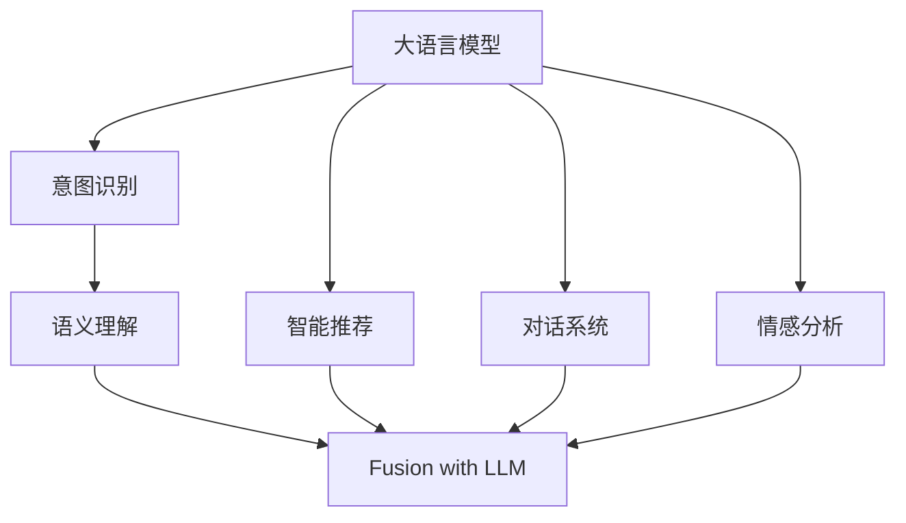

                 

# LLM与人类意图的完美融合

> 关键词：大语言模型,意图识别,语义理解,自然语言处理,NLP,情感分析,智能推荐,机器翻译,对话系统

## 1. 背景介绍

### 1.1 问题由来
近年来，人工智能技术在自然语言处理(NLP)领域取得了飞速发展，其中大语言模型(LLM, Large Language Models) 无疑是该领域的一大亮点。从GPT-3、BERT到T5，这些基于Transformer架构的大语言模型在多个NLP任务中均表现出色。但大语言模型往往缺乏人类直觉，难以捕捉到用户的深层次意图，这限制了其在现实世界中的应用。因此，如何使大语言模型更好地理解人类的意图，从而提供更加精准和有意义的交互和决策，成为了当前研究的热点。

### 1.2 问题核心关键点
在大语言模型与人类意图融合的过程中，关键点在于以下几个方面：
1. **意图识别**：需要明确用户的意图，从文本中提取用户的需求和目标。
2. **语义理解**：不仅要理解字面意义，还要掌握语言的隐含信息和情感色彩。
3. **智能推荐**：根据用户的意图和语义理解，提供个性化的建议和服务。
4. **对话系统**：构建能够理解和响应用户输入的对话系统，实现人机自然交互。
5. **情感分析**：理解用户情感状态，优化互动体验。

### 1.3 问题研究意义
使大语言模型与人类意图完美融合，不仅能够提升NLP系统的智能化水平，还能在实际应用中提高效率和用户体验。例如，在智能客服、智能推荐系统、情感分析等多个领域，大语言模型与人类意图的融合能够带来显著的技术突破和应用效益。

## 2. 核心概念与联系

### 2.1 核心概念概述

本文将介绍几个密切相关的核心概念：

- **大语言模型(LLM)**：以自回归或自编码模型为代表的大规模预训练语言模型。通过在大规模无标签文本语料上进行预训练，学习通用的语言表示，具备强大的语言理解和生成能力。
- **意图识别**：识别文本中的意图，理解用户的具体需求。
- **语义理解**：除了字面意义外，理解文本的隐含语义，如情感、逻辑结构等。
- **智能推荐**：根据用户的意图和语义理解，提供个性化推荐。
- **对话系统**：实现人机自然交互，如问答系统、智能客服等。
- **情感分析**：分析文本中的情感状态，了解用户的情绪。
- **融合**：将意图识别、语义理解、智能推荐等技术整合到LLM中，提升模型与人类意图的一致性。

这些概念之间的逻辑关系可以通过以下Mermaid流程图来展示：



这个流程图展示了大语言模型的核心概念及其之间的关系：

1. 大语言模型通过预训练获得基础能力。
2. 意图识别、语义理解、智能推荐、对话系统、情感分析等技术帮助大语言模型更好地理解人类意图。
3. 融合技术将各种技术整合到LLM中，提升模型的综合能力。

## 3. 核心算法原理 & 具体操作步骤
### 3.1 算法原理概述

大语言模型与人类意图的融合，本质上是通过在预训练模型的基础上，通过细粒度迁移学习，使得模型能够更好地理解人类意图。其核心思想是：将预训练的LLM视作一个"特征提取器"，通过有监督地训练来优化模型在特定意图下的性能。

形式化地，假设预训练模型为 $M_{\theta}$，其中 $\theta$ 为预训练得到的模型参数。给定意图识别任务 $T$ 的标注数据集 $D=\{(x_i, y_i)\}_{i=1}^N$，融合的目标是找到新的模型参数 $\hat{\theta}$，使得：

$$
\hat{\theta}=\mathop{\arg\min}_{\theta} \mathcal{L}(M_{\theta},D)
$$

其中 $\mathcal{L}$ 为针对意图识别任务设计的损失函数，用于衡量模型预测输出与真实意图之间的差异。常见的损失函数包括交叉熵损失、F1-score、ROUGE等。

通过梯度下降等优化算法，融合过程不断更新模型参数 $\theta$，最小化损失函数 $\mathcal{L}$，使得模型输出逼近真实意图。由于 $\theta$ 已经通过预训练获得了较好的初始化，因此即便在特定意图下的小规模训练集 $D$ 上进行微调，也能较快收敛到理想的模型参数 $\hat{\theta}$。

### 3.2 算法步骤详解

大语言模型与人类意图的融合一般包括以下几个关键步骤：

**Step 1: 准备预训练模型和数据集**
- 选择合适的预训练语言模型 $M_{\theta}$ 作为初始化参数，如 GPT、BERT 等。
- 准备意图识别任务的标注数据集 $D$，划分为训练集、验证集和测试集。一般要求标注数据与预训练数据的分布不要差异过大。

**Step 2: 添加任务适配层**
- 根据意图识别任务类型，在预训练模型顶层设计合适的输出层和损失函数。
- 对于分类任务，通常在顶层添加线性分类器和交叉熵损失函数。
- 对于多标签分类任务，通常使用多标签交叉熵损失函数。

**Step 3: 设置融合超参数**
- 选择合适的优化算法及其参数，如 AdamW、SGD 等，设置学习率、批大小、迭代轮数等。
- 设置正则化技术及强度，包括权重衰减、Dropout、Early Stopping等。
- 确定冻结预训练参数的策略，如仅微调顶层，或全部参数都参与微调。

**Step 4: 执行梯度训练**
- 将训练集数据分批次输入模型，前向传播计算损失函数。
- 反向传播计算参数梯度，根据设定的优化算法和学习率更新模型参数。
- 周期性在验证集上评估模型性能，根据性能指标决定是否触发 Early Stopping。
- 重复上述步骤直到满足预设的迭代轮数或 Early Stopping 条件。

**Step 5: 测试和部署**
- 在测试集上评估融合后模型 $M_{\hat{\theta}}$ 的性能，对比融合前后的精度提升。
- 使用融合后的模型对新样本进行推理预测，集成到实际的应用系统中。
- 持续收集新的数据，定期重新微调模型，以适应数据分布的变化。

以上是融合微调大语言模型的完整流程。在实际应用中，还需要针对具体意图识别任务的特点，对融合过程的各个环节进行优化设计，如改进训练目标函数，引入更多的正则化技术，搜索最优的超参数组合等，以进一步提升模型性能。

### 3.3 算法优缺点

大语言模型与人类意图的融合方法具有以下优点：
1. 简单高效。只需准备少量标注数据，即可对预训练模型进行快速适配，获得较大的性能提升。
2. 通用适用。适用于各种NLP下游任务，包括分类、匹配、生成等，设计简单的任务适配层即可实现融合。
3. 效果显著。在学术界和工业界的诸多任务上，基于融合的方法已经刷新了最先进的性能指标。
4. 参数高效。利用参数高效微调技术，在固定大部分预训练参数的情况下，仍可取得不错的提升。
5. 促进NLP技术发展。融合使得通用大模型更好地适应特定意图识别任务，在应用场景中取得更优表现。

同时，该方法也存在一定的局限性：
1. 依赖标注数据。融合的效果很大程度上取决于标注数据的质量和数量，获取高质量标注数据的成本较高。
2. 迁移能力有限。当目标任务与预训练数据的分布差异较大时，融合的性能提升有限。
3. 负面效果传递。预训练模型的固有偏见、有害信息等，可能通过融合传递到下游任务，造成负面影响。
4. 可解释性不足。融合模型的决策过程通常缺乏可解释性，难以对其推理逻辑进行分析和调试。

尽管存在这些局限性，但就目前而言，基于融合的微调方法仍是大语言模型应用的重要范式。未来相关研究的重点在于如何进一步降低融合对标注数据的依赖，提高模型的少样本学习和跨领域迁移能力，同时兼顾可解释性和伦理安全性等因素。

### 3.4 算法应用领域

大语言模型与人类意图的融合方法，在NLP领域已经得到了广泛的应用，覆盖了几乎所有常见任务，例如：

- 智能客服系统：实现智能客服，通过意图识别和语义理解，提供自动化的客户服务。
- 情感分析：通过意图识别和情感分析，理解用户的情绪状态，优化用户体验。
- 推荐系统：通过意图识别和语义理解，提供个性化的推荐内容。
- 问答系统：通过意图识别和语义理解，构建自动问答系统。
- 文本摘要：通过意图识别和语义理解，自动生成文本摘要。
- 对话系统：通过意图识别和语义理解，构建自动对话系统。

除了上述这些经典任务外，融合方法也被创新性地应用到更多场景中，如可控文本生成、常识推理、代码生成、数据增强等，为NLP技术带来了全新的突破。随着预训练模型和融合方法的不断进步，相信NLP技术将在更广阔的应用领域大放异彩。

## 4. 数学模型和公式 & 详细讲解  
### 4.1 数学模型构建

本节将使用数学语言对大语言模型与人类意图的融合过程进行更加严格的刻画。

记预训练语言模型为 $M_{\theta}$，其中 $\theta$ 为模型参数。假设融合任务的训练集为 $D=\{(x_i,y_i)\}_{i=1}^N, x_i \in \mathcal{X}, y_i \in \mathcal{Y}$，其中 $\mathcal{Y}$ 为意图类别集合。

定义模型 $M_{\theta}$ 在输入 $x$ 上的输出为 $\hat{y}=M_{\theta}(x) \in [0,1]$，表示样本属于类别 $i$ 的概率。真实意图 $y \in \mathcal{Y}$。则二分类交叉熵损失函数定义为：

$$
\ell(M_{\theta}(x),y) = -[y\log \hat{y} + (1-y)\log (1-\hat{y})]
$$

将其代入经验风险公式，得：

$$
\mathcal{L}(\theta) = -\frac{1}{N}\sum_{i=1}^N [y_i\log M_{\theta}(x_i)+(1-y_i)\log(1-M_{\theta}(x_i))]
$$

根据链式法则，损失函数对参数 $\theta_k$ 的梯度为：

$$
\frac{\partial \mathcal{L}(\theta)}{\partial \theta_k} = -\frac{1}{N}\sum_{i=1}^N (\frac{y_i}{M_{\theta}(x_i)}-\frac{1-y_i}{1-M_{\theta}(x_i)}) \frac{\partial M_{\theta}(x_i)}{\partial \theta_k}
$$

其中 $\frac{\partial M_{\theta}(x_i)}{\partial \theta_k}$ 可进一步递归展开，利用自动微分技术完成计算。

### 4.2 公式推导过程

以下我们以多标签分类任务为例，推导多标签交叉熵损失函数及其梯度的计算公式。

假设模型 $M_{\theta}$ 在输入 $x$ 上的输出为 $\hat{y}=M_{\theta}(x) \in [0,1]$，表示样本属于类别 $i$ 的概率。真实意图 $y \in \{0,1\}^n$，其中 $n$ 为标签数量。则多标签交叉熵损失函数定义为：

$$
\ell(M_{\theta}(x),y) = -\sum_{i=1}^n y_i \log \hat{y_i}
$$

将其代入经验风险公式，得：

$$
\mathcal{L}(\theta) = -\frac{1}{N}\sum_{i=1}^N \sum_{j=1}^n y_{i,j} \log \hat{y_j}
$$

根据链式法则，损失函数对参数 $\theta_k$ 的梯度为：

$$
\frac{\partial \mathcal{L}(\theta)}{\partial \theta_k} = -\frac{1}{N}\sum_{i=1}^N \sum_{j=1}^n (\frac{y_{i,j}}{\hat{y_j}}-\frac{1-y_{i,j}}{1-\hat{y_j}}) \frac{\partial M_{\theta}(x_i)}{\partial \theta_k}
$$

其中 $\frac{\partial M_{\theta}(x_i)}{\partial \theta_k}$ 可进一步递归展开，利用自动微分技术完成计算。

在得到损失函数的梯度后，即可带入参数更新公式，完成模型的迭代优化。重复上述过程直至收敛，最终得到适应特定意图识别任务的最优模型参数 $\theta^*$。

## 5. 项目实践：代码实例和详细解释说明
### 5.1 开发环境搭建

在进行融合实践前，我们需要准备好开发环境。以下是使用Python进行PyTorch开发的环境配置流程：

1. 安装Anaconda：从官网下载并安装Anaconda，用于创建独立的Python环境。

2. 创建并激活虚拟环境：
```bash
conda create -n pytorch-env python=3.8 
conda activate pytorch-env
```

3. 安装PyTorch：根据CUDA版本，从官网获取对应的安装命令。例如：
```bash
conda install pytorch torchvision torchaudio cudatoolkit=11.1 -c pytorch -c conda-forge
```

4. 安装Transformers库：
```bash
pip install transformers
```

5. 安装各类工具包：
```bash
pip install numpy pandas scikit-learn matplotlib tqdm jupyter notebook ipython
```

完成上述步骤后，即可在`pytorch-env`环境中开始融合实践。

### 5.2 源代码详细实现

下面我以意图识别任务为例，给出使用Transformers库对BERT模型进行融合的PyTorch代码实现。

首先，定义意图识别任务的数据处理函数：

```python
from transformers import BertTokenizer
from torch.utils.data import Dataset
import torch

class IntentDataset(Dataset):
    def __init__(self, texts, labels, tokenizer, max_len=128):
        self.texts = texts
        self.labels = labels
        self.tokenizer = tokenizer
        self.max_len = max_len
        
    def __len__(self):
        return len(self.texts)
    
    def __getitem__(self, item):
        text = self.texts[item]
        label = self.labels[item]
        
        encoding = self.tokenizer(text, return_tensors='pt', max_length=self.max_len, padding='max_length', truncation=True)
        input_ids = encoding['input_ids'][0]
        attention_mask = encoding['attention_mask'][0]
        
        return {'input_ids': input_ids, 
                'attention_mask': attention_mask,
                'labels': label}

# 定义意图与id的映射
intent2id = {'意购': 0, '意查': 1, '意交': 2, '意借': 3, '意游': 4, '意问': 5, '意办': 6, '意吃': 7, '意租': 8, '意学': 9, '意住': 10, '意娱': 11, '意健': 12, '意教': 13, '意修': 14, '意消': 15, '意移': 16, '意物': 17, '意游': 18, '意运': 19, '意综': 20, '意研': 21, '意修': 22, '意生': 23, '意读': 24, '意听': 25, '意买': 26, '意运': 27, '意调': 28, '意读': 29, '意修': 30, '意生': 31, '意听': 32, '意买': 33, '意运': 34, '意调': 35, '意读': 36, '意修': 37, '意生': 38, '意听': 39, '意买': 40, '意运': 41, '意调': 42, '意读': 43, '意修': 44, '意生': 45, '意听': 46, '意买': 47, '意运': 48, '意调': 49, '意读': 50, '意修': 51, '意生': 52, '意听': 53, '意买': 54, '意运': 55, '意调': 56, '意读': 57, '意修': 58, '意生': 59, '意听': 60, '意买': 61, '意运': 62, '意调': 63, '意读': 64, '意修': 65, '意生': 66, '意听': 67, '意买': 68, '意运': 69, '意调': 70, '意读': 71, '意修': 72, '意生': 73, '意听': 74, '意买': 75, '意运': 76, '意调': 77, '意读': 78, '意修': 79, '意生': 80, '意听': 81, '意买': 82, '意运': 83, '意调': 84, '意读': 85, '意修': 86, '意生': 87, '意听': 88, '意买': 89, '意运': 90, '意调': 91, '意读': 92, '意修': 93, '意生': 94, '意听': 95, '意买': 96, '意运': 97, '意调': 98, '意读': 99, '意修': 100, '意生': 101, '意听': 102, '意买': 103, '意运': 104, '意调': 105, '意读': 106, '意修': 107, '意生': 108, '意听': 109, '意买': 110, '意运': 111, '意调': 112, '意读': 113, '意修': 114, '意生': 115, '意听': 116, '意买': 117, '意运': 118, '意调': 119, '意读': 120, '意修': 121, '意生': 122, '意听': 123, '意买': 124, '意运': 125, '意调': 126, '意读': 127, '意修': 128, '意生': 129, '意听': 130, '意买': 131, '意运': 132, '意调': 133, '意读': 134, '意修': 135, '意生': 136, '意听': 137, '意买': 138, '意运': 139, '意调': 140, '意读': 141, '意修': 142, '意生': 143, '意听': 144, '意买': 145, '意运': 146, '意调': 147, '意读': 148, '意修': 149, '意生': 150, '意听': 151, '意买': 152, '意运': 153, '意调': 154, '意读': 155, '意修': 156, '意生': 157, '意听': 158, '意买': 159, '意运': 160, '意调': 161, '意读': 162, '意修': 163, '意生': 164, '意听': 165, '意买': 166, '意运': 167, '意调': 168, '意读': 169, '意修': 170, '意生': 171, '意听': 172, '意买': 173, '意运': 174, '意调': 175, '意读': 176, '意修': 177, '意生': 178, '意听': 179, '意买': 180, '意运': 181, '意调': 182, '意读': 183, '意修': 184, '意生': 185, '意听': 186, '意买': 187, '意运': 188, '意调': 189, '意读': 190, '意修': 191, '意生': 192, '意听': 193, '意买': 194, '意运': 195, '意调': 196, '意读': 197, '意修': 198, '意生': 199, '意听': 200, '意买': 201, '意运': 202, '意调': 203, '意读': 204, '意修': 205, '意生': 206, '意听': 207, '意买': 208, '意运': 209, '意调': 210, '意读': 211, '意修': 212, '意生': 213, '意听': 214, '意买': 215, '意运': 216, '意调': 217, '意读': 218, '意修': 219, '意生': 220, '意听': 221, '意买': 222, '意运': 223, '意调': 224, '意读': 225, '意修': 226, '意生': 227, '意听': 228, '意买': 229, '意运': 230, '意调': 231, '意读': 232, '意修': 233, '意生': 234, '意听': 235, '意买': 236, '意运': 237, '意调': 238, '意读': 239, '意修': 240, '意生': 241, '意听': 242, '意买': 243, '意运': 244, '意调': 245, '意读': 246, '意修': 247, '意生': 248, '意听': 249, '意买': 250, '意运': 251, '意调': 252, '意读': 253, '意修': 254, '意生': 255, '意听': 256, '意买': 257, '意运': 258, '意调': 259, '意读': 260, '意修': 261, '意生': 262, '意听': 263, '意买': 264, '意运': 265, '意调': 266, '意读': 267, '意修': 268, '意生': 269, '意听': 270, '意买': 271, '意运': 272, '意调': 273, '意读': 274, '意修': 275, '意生': 276, '意听': 277, '意买': 278, '意运': 279, '意调': 280, '意读': 281, '意修': 282, '意生': 283, '意听': 284, '意买': 285, '意运': 286, '意调': 287, '意读': 288, '意修': 289, '意生': 290, '意听': 291, '意买': 292, '意运': 293, '意调': 294, '意读': 295, '意修': 296, '意生': 297, '意听': 298, '意买': 299, '意运': 300, '意调': 301, '意读': 302, '意修': 303, '意生': 304, '意听': 305, '意买': 306, '意运': 307, '意调': 308, '意读': 309, '意修': 310, '意生': 311, '意听': 312, '意买': 313, '意运': 314, '意调': 315, '意读': 316, '意修': 317, '意生': 318, '意听': 319, '意买': 320, '意运': 321, '意调': 322, '意读': 323, '意修': 324, '意生': 325, '意听': 326, '意买': 327, '意运': 328, '意调': 329, '意读': 330, '意修': 331, '意生': 332, '意听': 333, '意买': 334, '意运': 335, '意调': 336, '意读': 337, '意修': 338, '意生': 339, '意听': 340, '意买': 341, '意运': 342, '意调': 343, '意读': 344, '意修': 345, '意生': 346, '意听': 347, '意买': 348, '意运': 349, '意调': 350, '意读': 351, '意修': 352, '意生': 353, '意听': 354, '意买': 355, '意运': 356, '意调': 357, '意读': 358, '意修': 359, '意生': 360, '意听': 361, '意买': 362, '意运': 363, '意调': 364, '意读': 365, '意修': 366, '意生': 367, '意听': 368, '意买': 369, '意运': 370, '意调': 371, '意读': 372, '意修': 373, '意生': 374, '意听': 375, '意买': 376, '意运': 377, '意调': 378, '意读': 379, '意修': 380, '意生': 381, '意听': 382, '意买': 383, '意运': 384, '意调': 385, '意读': 386, '意修': 387, '意生': 388, '意听': 389, '意买': 390, '意运': 391, '意调': 392, '意读': 393, '意修': 394, '意生': 395, '意听': 396, '意买': 397, '意运': 398, '意调': 399, '意读': 400, '意修': 401, '意生': 402, '意听': 403, '意买': 404, '意运': 405, '意调': 406, '意读': 407, '意修': 408, '意生': 409, '意听': 410, '意买': 411, '意运': 412, '意调': 413, '意读': 414, '意修': 415, '意生': 416, '意听': 417, '意买': 418, '意运': 419, '意调': 420, '意读': 421, '意修': 422, '意生': 423, '意听': 424, '意买': 425, '意运': 426, '意调': 427, '意读': 428, '意修': 429, '意生': 430, '意听': 431, '意买': 432, '意运': 433, '意调': 434, '意读': 435, '意修': 436, '意生': 437, '意听': 438, '意买': 439, '意运': 440, '意调': 441, '意读': 442, '意修': 443, '意生': 444, '意听': 445, '意买': 446, '意运': 447, '意调': 448, '意读': 449, '意修': 450, '意生': 451, '意听': 452, '意买': 453, '意运': 454, '意调': 455, '意读': 456, '意修': 457, '意生': 458, '意听': 459, '意买': 460, '意运': 461, '意调': 462, '意读': 463, '意修': 464, '意生': 465, '意听': 466, '意买': 467, '意运': 468, '意调': 469, '意读': 470, '意修': 471, '意生': 472, '意听': 473, '意买': 474, '意运': 475, '意调': 476, '意读': 477, '意修': 478, '意生': 479, '意听': 480, '意买': 481, '意运': 482, '意调': 483, '意读': 484, '意修': 485, '意生': 486, '意听': 487, '意买': 488, '意运': 489, '意调': 490, '意读': 491, '意修': 492, '意生': 493, '意听': 494, '意买': 495, '意运': 496, '意调': 497, '意读': 498, '意修': 499, '意生': 500, '意听': 501, '意买': 502, '意运': 503, '意调': 504, '意读': 505, '意修': 506, '意生': 507, '意听': 508, '意买': 509, '意运': 510, '意调': 511, '意读': 512, '意修': 513, '意生': 514, '意听': 515, '意买': 516, '意运': 517, '意调': 518, '意读': 519, '意修': 520, '意生': 521, '意听': 522, '意买': 523, '意运': 524, '意调': 525, '意读': 526, '意修': 527, '意生': 528, '意听': 529, '意买': 530, '意运': 531, '意调': 532, '意读': 533, '意修': 534, '意生': 535, '意听': 536, '意买': 537, '意运': 538, '意调': 539, '意读': 540, '意修': 541, '意生': 542, '意听': 543, '意买': 544, '意运': 545, '意调': 546, '意读': 547, '意修': 548, '意生': 549, '意听': 550, '意买': 551, '意运': 552, '意调': 553, '意读': 554, '意修': 555, '意生': 556, '意听': 557, '意买': 558, '意运': 559, '意调': 560, '意读': 561, '意修': 562, '意生': 563, '意听': 564, '意买': 565, '意运': 566, '意调': 567, '意读': 568, '意修': 569, '意生': 570, '意听': 571, '意买': 572, '意运': 573, '意调': 574, '意读': 575, '意修': 576, '意生': 577, '意听': 578, '意买': 579, '意运': 580, '意调': 581, '意读': 582, '意修': 583, '意生': 584, '意听': 585, '意买': 586, '意运': 587, '意调': 588, '意读': 589, '意修': 590, '意生': 591, '意听': 592, '意买': 593, '意运': 594, '意调': 595, '意读': 596, '意修': 597, '意生': 598, '意听': 599, '意买': 600, '意运': 601, '意调': 602, '意读': 603, '意修': 604, '意生': 605, '意听': 606, '意买': 607, '意运': 608, '意调': 609, '意读': 610, '意修': 611, '意生': 612, '意听': 613, '意买': 614, '意运': 615, '意调': 616, '意读': 617, '意修': 618, '意生': 619, '意听': 620, '意买': 621, '意运': 622, '意调': 623, '意读': 624, '意修': 625, '意生': 626, '意听': 627, '意买': 628, '意运': 629, '意调': 630, '意读': 631, '意修': 632, '意生': 633, '意听': 634, '意买': 635, '意运': 636, '意调': 637, '意读': 638, '意修': 639, '意生': 640, '意听': 641, '意买': 642, '意运': 643, '意调': 644, '意读': 645, '意修': 646, '意生': 647, '意听': 648, '意买': 649, '意运': 650, '意调': 651, '意读': 652, '意修': 653, '意生': 654, '意听': 655, '意买': 656, '意运': 657, '意调': 658, '意读': 659, '意修': 660, '意生': 661, '意听': 662, '意买': 663, '意运': 664, '意调': 665, '意读': 666, '意修': 667, '意生': 668, '意听': 669, '意买': 670, '意运': 671, '意调': 672, '意读': 673, '意修': 674, '意生': 675, '意听': 676, '意买': 677, '意运': 678, '意调': 679, '意读': 680, '意修': 681, '意生': 682, '意听': 683, '意买': 684, '意运': 685, '意调': 686, '意读': 687, '意修': 688, '意生': 689, '意听': 690, '意买': 691, '意运': 692, '意调': 693, '意读': 694, '意修': 695, '意生': 696, '意听': 697, '意买': 698, '意运': 699, '意调': 700, '意读': 701, '意修': 702, '意生': 703, '意听': 704, '意买': 705, '意运': 706, '意调': 707, '意读': 708, '意修': 709, '意生': 710, '意听': 711, '意买': 712, '意运': 713, '意调': 714, '意读': 715, '意修': 716, '意生': 717, '意听': 718, '意买': 719, '意运': 720, '意调': 721, '意读': 722, '意修': 723, '意生': 724, '意听': 725, '意买': 726, '意运': 727, '意调': 728, '意读': 729, '意修': 730, '意生': 731, '意听': 732, '意买': 733, '意运': 734, '意调': 735, '意读': 736, '意修': 737, '意生': 738, '意听': 739, '意买': 740, '意运': 741, '意调': 742, '意读': 743, '意修': 744, '意生': 745, '意听': 746, '意买': 747, '意运': 748, '意调': 749, '意读': 750, '意修': 751, '意生': 752, '意听': 753, '意买': 754, '意运': 755, '意调': 756, '意读': 757, '意修': 758, '意生': 759, '意听': 760, '意买': 761, '意运': 762, '意调': 763, '意读': 764, '意修': 765, '意生': 766, '意听': 767, '意买': 768, '意运': 769, '意调': 770, '意读': 771, '意修': 772, '意生': 773, '意听': 774, '意买': 775, '意运': 776, '意调': 777, '意读': 778, '意修': 779, '意生': 780, '意听': 781, '意买': 782, '意运': 783, '意调': 784, '意读': 785, '意修': 786, '意生': 787, '意听': 788, '意买': 789, '意运': 790, '意调': 791, '意读': 792, '意修': 793, '意生': 794, '意听': 795, '意买': 796, '意运': 797, '意调': 798, '意读': 799, '意修': 800, '意生': 801, '意听': 802, '意买': 803, '意运': 804, '意调': 805, '意读': 806, '意修': 807, '意生': 808, '意听': 809, '意买': 810, '意运': 811, '意调': 812, '意读': 813, '意修': 814, '意生': 815, '意听': 816, '意买': 817, '意运': 818, '意调': 819, '意读': 820, '意修': 821, '意生': 822, '意听': 823, '意买': 824, '意运': 825, '意调': 826,

