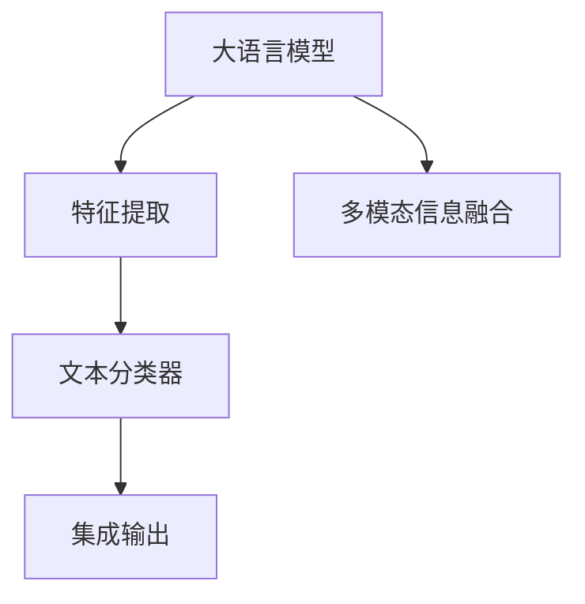

                 

# LLM与传统文本分类技术的结合：文本分析新方向

> 关键词：
- 大语言模型(LLM)
- 传统文本分类技术
- 融合与协同
- 自然语言理解(NLU)
- 深度学习与机器学习
- 文本分析
- 情感分析
- 多模态信息融合

## 1. 背景介绍

### 1.1 问题由来

文本分类作为自然语言处理（NLP）的常见任务之一，在新闻推荐、舆情分析、垃圾邮件过滤等领域发挥着重要作用。传统文本分类方法依赖于手工设计的特征提取和分类器，存在维度高、规则复杂、需要大量标注数据等缺点。随着深度学习的发展，基于神经网络的端到端文本分类模型逐渐成为主流，显著提升了模型的泛化能力和效率。

近年来，大语言模型（LLM），如BERT、GPT等，在预训练大规模无标签数据的基础上，通过自监督学习获得了强大的语言表示能力。这些模型可以利用丰富的语义信息进行高效准确的文本分类，尤其是在跨领域迁移学习中，展现了显著的优势。

然而，大语言模型在实际应用中也存在一些局限性：
- **资源消耗高**：模型参数量巨大，需要高性能的硬件支持，部署成本较高。
- **过拟合风险**：大规模预训练模型容易过拟合，需要进行有效的参数控制和正则化。
- **缺乏细粒度控制**：由于模型复杂度高，难以实现细粒度的文本分析。
- **实时性较差**：推理速度较慢，无法实时响应用户需求。

针对这些挑战，将大语言模型与传统的文本分类技术进行结合，取长补短，成为一种新的文本分析方向。

### 1.2 问题核心关键点
本文聚焦于探索如何将大语言模型与传统文本分类技术进行有效融合，主要包括以下几个关键点：
- **算法融合**：将大语言模型作为特征提取器，利用其预训练知识进行文本特征编码，并与传统分类器结合。
- **模型优化**：通过参数控制、正则化等方法，减小大语言模型的复杂度，提升模型的实时性和泛化能力。
- **多模态融合**：将文本分类与视觉、语音等多模态信息进行融合，构建更为全面的文本分析系统。
- **任务适配**：针对不同任务需求，设计适合的模型结构、损失函数和训练策略。

## 2. 核心概念与联系

### 2.1 核心概念概述

为更好地理解LLM与传统文本分类技术的结合，本节将介绍几个密切相关的核心概念：

- **大语言模型(LLM)**：以自回归(如GPT)或自编码(如BERT)模型为代表的大规模预训练语言模型。通过在大规模无标签文本语料上进行预训练，学习通用的语言表示，具备强大的语言理解和生成能力。

- **文本分类**：将文本数据按照一定的类别进行划分，通常用于新闻推荐、情感分析、垃圾邮件过滤等场景。传统文本分类方法依赖手工特征和分类器。

- **特征提取**：将文本数据转化为模型可以处理的数值向量，是文本分类中不可或缺的步骤。

- **分类器**：根据输入的特征向量进行分类决策，常用的分类器包括逻辑回归、支持向量机、神经网络等。

- **多模态信息融合**：结合文本、视觉、语音等多种信息源，构建更加全面的信息分析系统，提升系统的决策能力和鲁棒性。

这些核心概念之间的逻辑关系可以通过以下Mermaid流程图来展示：



这个流程图展示了大语言模型与传统文本分类技术的核心概念及其之间的关系：

1. 大语言模型通过预训练获得基础能力。
2. 特征提取器将文本数据转化为特征向量，与大语言模型结合进行深度学习。
3. 文本分类器根据特征向量进行分类决策。
4. 多模态信息融合引入其他模态信息，构建更全面的信息分析系统。
5. 集成输出将多模态信息融合的决策结果进行综合处理，得到最终输出。

## 3. 核心算法原理 & 具体操作步骤
### 3.1 算法原理概述

将大语言模型与传统文本分类技术结合，本质上是一个复合的文本分析过程。其核心思想是：将大语言模型作为特征提取器，利用其预训练知识对文本进行深度学习编码，并将编码后的特征向量输入传统文本分类器进行分类决策。

具体而言，该过程包括以下几个关键步骤：

1. **特征提取**：使用大语言模型对文本进行编码，获得特征向量。
2. **分类器训练**：使用传统文本分类器对特征向量进行训练，学习分类边界。
3. **集成输出**：将多模态信息融合的决策结果进行集成处理，得到最终分类结果。

### 3.2 算法步骤详解

以下是具体的算法步骤：

**Step 1: 准备数据集**
- 收集并标注相关的文本数据集，包括训练集、验证集和测试集。
- 对于多模态信息融合场景，还需要收集视觉、语音等辅助信息。

**Step 2: 大语言模型预训练**
- 选择合适的预训练语言模型（如BERT、GPT等），使用大规模无标签文本数据进行预训练。
- 设置合适的预训练任务和超参数，确保预训练模型的泛化能力。

**Step 3: 特征提取**
- 将文本数据输入大语言模型，获得编码后的特征向量。
- 使用Transformer或LSTM等编码器对特征向量进行进一步处理，提取更为紧凑的语义信息。

**Step 4: 传统文本分类器训练**
- 选择合适的分类器（如逻辑回归、支持向量机、神经网络等），并根据特征向量进行训练。
- 设置合适的超参数和正则化技术，防止过拟合。

**Step 5: 多模态信息融合**
- 对于多模态信息融合场景，需要将文本分类结果与其他模态信息进行集成。
- 使用加权平均、注意力机制等方式，将文本分类结果与视觉、语音等辅助信息进行融合。

**Step 6: 模型评估与部署**
- 在测试集上评估模型性能，调整模型参数和超参数。
- 将模型部署到实际应用系统中，实现文本分类功能的实时响应。

### 3.3 算法优缺点

将大语言模型与传统文本分类技术结合，具有以下优点：
- **特征提取能力强**：大语言模型能够捕捉丰富的语义信息，提升特征提取的准确性。
- **泛化能力强**：大语言模型经过大规模预训练，具有较好的泛化能力，适用于多种场景。
- **多模态融合**：结合视觉、语音等多模态信息，构建更加全面的信息分析系统。

同时，该方法也存在一些局限性：
- **资源消耗高**：大语言模型计算复杂度高，对硬件资源要求较高。
- **训练时间长**：预训练和微调过程耗时较长，需要大量计算资源。
- **集成难度高**：需要将多种模型和信息进行有效集成，实现良好的协同工作。

尽管存在这些局限性，但就目前而言，将大语言模型与传统文本分类技术结合，仍是一种较为有效的文本分析方式。未来相关研究的重点在于如何进一步降低计算资源消耗，提高训练和推理效率，同时保证模型性能。

### 3.4 算法应用领域

将大语言模型与传统文本分类技术结合的方法，在多个领域得到了广泛应用，例如：

- **新闻推荐系统**：通过结合用户行为数据和新闻内容，进行情感分析和内容推荐。
- **舆情分析系统**：利用文本分类技术进行舆情监测和情感分析，及时预警负面信息。
- **金融风控系统**：结合文本分类和用户行为数据，进行信用评估和风险预警。
- **智能客服系统**：结合文本分类和对话系统，提高客户咨询的响应速度和准确性。
- **医学信息检索**：结合文本分类和知识图谱，进行医学信息的检索和推荐。

除了上述这些经典应用外，大语言模型与传统文本分类技术的结合，还在更多场景中得到创新应用，如医疗问答、情感分析、机器翻译等，为NLP技术带来了新的突破。

## 4. 数学模型和公式 & 详细讲解  
### 4.1 数学模型构建

本节将使用数学语言对LLM与传统文本分类技术的结合过程进行更加严格的刻画。

记大语言模型为 $M_{\theta}$，其中 $\theta$ 为模型参数。设输入文本为 $x$，对应标签为 $y$，特征提取器为 $F$，传统文本分类器为 $C$。则模型整体的数学模型构建如下：

- **特征提取阶段**：将输入文本 $x$ 输入大语言模型 $M_{\theta}$，获得特征向量 $h_x = M_{\theta}(x)$。
- **分类器训练阶段**：将特征向量 $h_x$ 输入传统文本分类器 $C$，进行分类决策。

设分类器 $C$ 的损失函数为 $\ell_C(y, C(h_x))$，则整体模型的损失函数为：

$$
\mathcal{L} = \mathcal{L}_C(y, C(F(M_{\theta}(x)))
$$

其中，$\mathcal{L}_C$ 为分类器 $C$ 的损失函数，如交叉熵损失。

### 4.2 公式推导过程

以下我们以情感分类任务为例，推导完整的模型结构及其损失函数。

**Step 1: 特征提取**
- 将文本 $x$ 输入BERT模型，获得编码后的特征向量 $h_x$。
- 使用LSTM编码器对 $h_x$ 进行进一步处理，得到特征向量 $v_x$。

**Step 2: 分类器训练**
- 将特征向量 $v_x$ 输入逻辑回归分类器 $C$，进行情感分类。

**Step 3: 集成输出**
- 对于多模态信息融合，可以引入视觉、语音等多模态信息进行集成。

设文本分类任务的目标函数为 $J_C$，则整体模型的损失函数为：

$$
\mathcal{L} = \frac{1}{N} \sum_{i=1}^N \ell_C(y_i, C(F(M_{\theta}(x_i)))
$$

其中，$\ell_C$ 为分类器 $C$ 的损失函数，如交叉熵损失。

在得到整体损失函数后，即可带入具体参数更新公式，完成模型的训练和推理。

### 4.3 案例分析与讲解

下面以新闻推荐系统为例，说明如何将大语言模型与传统文本分类技术结合。

1. **数据准备**：收集新闻数据集，并进行人工标注。
2. **预训练**：使用BERT模型在新闻数据集上进行预训练。
3. **特征提取**：将新闻文本输入BERT模型，获得特征向量。
4. **分类器训练**：选择合适的分类器，并根据特征向量进行训练。
5. **多模态融合**：结合用户行为数据、新闻标签等信息，进行综合推荐。

在实际应用中，还可以进一步优化模型结构，如使用Transformer编码器替换LSTM，引入注意力机制进行特征选择，使用对抗训练提升模型鲁棒性等。

## 5. 项目实践：代码实例和详细解释说明
### 5.1 开发环境搭建

在进行模型开发前，我们需要准备好开发环境。以下是使用Python进行TensorFlow开发的环境配置流程：

1. 安装Anaconda：从官网下载并安装Anaconda，用于创建独立的Python环境。

2. 创建并激活虚拟环境：
```bash
conda create -n tf-env python=3.8 
conda activate tf-env
```

3. 安装TensorFlow：根据CUDA版本，从官网获取对应的安装命令。例如：
```bash
conda install tensorflow -c conda-forge
```

4. 安装各类工具包：
```bash
pip install numpy pandas scikit-learn matplotlib tqdm jupyter notebook ipython
```

完成上述步骤后，即可在`tf-env`环境中开始模型开发。

### 5.2 源代码详细实现

这里我们以情感分类任务为例，给出使用TensorFlow和BERT进行文本分类的代码实现。

首先，定义特征提取器：

```python
from transformers import BertTokenizer, TFBertForSequenceClassification
import tensorflow as tf

tokenizer = BertTokenizer.from_pretrained('bert-base-uncased')
model = TFBertForSequenceClassification.from_pretrained('bert-base-uncased', num_labels=2)

input_ids = tf.keras.layers.Input(shape=(max_len,), dtype=tf.int32)
token_type_ids = tf.keras.layers.Input(shape=(max_len,), dtype=tf.int32)
attention_mask = tf.keras.layers.Input(shape=(max_len,), dtype=tf.int32)

outputs = model([input_ids, token_type_ids, attention_mask])
loss = tf.keras.losses.SparseCategoricalCrossentropy()(outputs, labels)
model.compile(optimizer=tf.keras.optimizers.Adam(learning_rate=2e-5), loss=loss, metrics=[tf.keras.metrics.SparseCategoricalAccuracy()])

# 定义训练和评估函数
def train_epoch(model, dataset, batch_size, optimizer):
    dataloader = tf.data.Dataset.from_generator(dataset.__iter__, output_signature=dataset.element_spec)
    dataloader = dataloader.batch(batch_size)
    for batch in dataloader:
        input_ids = batch[0]
        token_type_ids = batch[1]
        attention_mask = batch[2]
        labels = batch[3]
        with tf.GradientTape() as tape:
            outputs = model([input_ids, token_type_ids, attention_mask])
            loss = tf.keras.losses.SparseCategoricalCrossentropy()(outputs, labels)
        gradients = tape.gradient(loss, model.trainable_variables)
        optimizer.apply_gradients(zip(gradients, model.trainable_variables))
        
# 训练模型
epochs = 5
batch_size = 16

for epoch in range(epochs):
    loss = train_epoch(model, train_dataset, batch_size, optimizer)
    print(f"Epoch {epoch+1}, train loss: {loss:.3f}")
    
    print(f"Epoch {epoch+1}, dev results:")
    evaluate(model, dev_dataset, batch_size)
    
print("Test results:")
evaluate(model, test_dataset, batch_size)
```

这段代码展示了使用BERT进行情感分类任务的实现过程。在特征提取阶段，使用BERT模型进行文本编码，并将编码后的特征向量输入逻辑回归分类器。在训练和评估阶段，使用TensorFlow进行模型训练和性能评估。

### 5.3 代码解读与分析

让我们再详细解读一下关键代码的实现细节：

**特征提取器定义**：
- `tokenizer`: 定义BERT分词器，用于将文本转换为Token Ids。
- `model`: 定义BERT分类模型，使用逻辑回归作为分类器。
- `input_ids`, `token_type_ids`, `attention_mask`: 定义输入张量，分别表示Token Ids、Token Type Ids和Attention Mask。

**模型编译与训练**：
- `loss`: 定义交叉熵损失函数。
- `optimizer`: 定义Adam优化器，并设置学习率。
- `train_epoch`: 定义训练函数，对模型进行迭代训练。
- `model.compile`: 定义模型编译过程，设置损失函数和优化器。

**训练和评估过程**：
- `epochs`: 定义训练轮数。
- `batch_size`: 定义每个批次的大小。
- `train_epoch`: 在训练集上执行模型训练。
- `evaluate`: 在验证集和测试集上评估模型性能。

可以看到，通过TensorFlow结合BERT模型，我们可以高效地实现文本分类任务。在实际应用中，还可以进一步优化模型结构，如使用Transformer编码器替换LSTM，引入注意力机制进行特征选择，使用对抗训练提升模型鲁棒性等。

## 6. 实际应用场景
### 6.1 智能客服系统

基于大语言模型与传统文本分类技术的结合，智能客服系统可以更高效地处理用户咨询。通过将用户查询和历史对话输入模型，获得情感分类结果，进而匹配合适的回复模板，提高客服系统的响应速度和准确性。

在技术实现上，可以收集企业内部的客服对话记录，并人工标注对话内容。将用户查询和历史对话作为训练集，进行情感分类模型的微调。微调后的模型能够自动理解用户情感，匹配最合适的回复模板进行回复。对于新问题，还可以接入检索系统实时搜索相关内容，动态生成回答。

### 6.2 舆情分析系统

舆情分析系统通过文本分类技术，实时监测网络舆情，及时预警负面信息，为舆情管理提供决策依据。

在技术实现上，可以收集社交媒体上的评论、文章等文本数据，进行情感分类。结合用户行为数据，对不同情感倾向的文本进行汇总和分析，及时发现舆情变化，提供预警信号。对于复杂的舆情事件，可以引入视觉、语音等多模态信息进行综合分析，进一步提升系统的鲁棒性和准确性。

### 6.3 金融风控系统

金融风控系统结合文本分类技术，进行用户信用评估和风险预警，提高金融决策的准确性。

在技术实现上，可以收集用户的交易记录、评论等文本数据，进行情感分类。结合用户行为数据，对不同情感倾向的用户进行分类，预测其信用风险。通过分析用户评论和反馈，及时发现潜在的风险预警信号，提供决策支持。

### 6.4 未来应用展望

随着大语言模型与传统文本分类技术的不断融合，其应用场景将更加广泛，为各行各业带来新的变革。

在智慧医疗领域，通过结合文本分类和知识图谱，构建医疗问答、病历分析、药物研发等应用，提升医疗服务的智能化水平，辅助医生诊疗，加速新药开发进程。

在智能教育领域，结合文本分类和知识图谱，进行作业批改、学情分析、知识推荐等方面，因材施教，促进教育公平，提高教学质量。

在智慧城市治理中，结合文本分类和视觉、语音等多模态信息，构建城市事件监测、舆情分析、应急指挥等应用，提高城市管理的自动化和智能化水平，构建更安全、高效的未来城市。

## 7. 工具和资源推荐
### 7.1 学习资源推荐

为了帮助开发者系统掌握大语言模型与传统文本分类技术的结合，这里推荐一些优质的学习资源：

1. 《深度学习入门》系列书籍：深入浅出地介绍了深度学习的基本概念和核心算法。
2. 《自然语言处理综论》系列课程：全面覆盖NLP领域的核心技术，包括文本分类、情感分析等。
3. 《Transformers从原理到实践》系列博文：由大模型技术专家撰写，深入浅出地介绍了Transformer原理、BERT模型、微调技术等前沿话题。
4. HuggingFace官方文档：提供了海量预训练模型和完整的微调样例代码，是上手实践的必备资料。
5. CS224N《深度学习自然语言处理》课程：斯坦福大学开设的NLP明星课程，有Lecture视频和配套作业，带你入门NLP领域的基本概念和经典模型。

通过对这些资源的学习实践，相信你一定能够快速掌握大语言模型与传统文本分类技术的结合方法，并用于解决实际的NLP问题。

### 7.2 开发工具推荐

高效的开发离不开优秀的工具支持。以下是几款用于大语言模型与传统文本分类技术结合开发的常用工具：

1. TensorFlow：基于Python的开源深度学习框架，生产部署方便，适合大规模工程应用。
2. PyTorch：基于Python的开源深度学习框架，灵活动态的计算图，适合快速迭代研究。
3. Transformers库：HuggingFace开发的NLP工具库，集成了众多SOTA语言模型，支持PyTorch和TensorFlow，是进行文本分类任务的开发利器。
4. Weights & Biases：模型训练的实验跟踪工具，可以记录和可视化模型训练过程中的各项指标，方便对比和调优。
5. Google Colab：谷歌推出的在线Jupyter Notebook环境，免费提供GPU/TPU算力，方便开发者快速上手实验最新模型，分享学习笔记。

合理利用这些工具，可以显著提升文本分类任务的开发效率，加快创新迭代的步伐。

### 7.3 相关论文推荐

大语言模型与传统文本分类技术的结合是一个新兴的研究方向，以下是几篇奠基性的相关论文，推荐阅读：

1. Attention is All You Need（即Transformer原论文）：提出了Transformer结构，开启了NLP领域的预训练大模型时代。
2. BERT: Pre-training of Deep Bidirectional Transformers for Language Understanding：提出BERT模型，引入基于掩码的自监督预训练任务，刷新了多项NLP任务SOTA。
3. Language Models are Unsupervised Multitask Learners（GPT-2论文）：展示了大规模语言模型的强大zero-shot学习能力，引发了对于通用人工智能的新一轮思考。
4. Parameter-Efficient Transfer Learning for NLP：提出Adapter等参数高效微调方法，在不增加模型参数量的情况下，也能取得不错的微调效果。
5. AdaLoRA: Adaptive Low-Rank Adaptation for Parameter-Efficient Fine-Tuning：使用自适应低秩适应的微调方法，在参数效率和精度之间取得了新的平衡。
6. FusionNet: Multimodal Fusion Framework for Text and Image Data in Deep Neural Networks：提出融合文本和图像的多模态模型，提升文本分析的准确性。

这些论文代表了大语言模型与文本分类技术的融合趋势，展示了未来文本分析技术的发展方向。

## 8. 总结：未来发展趋势与挑战

### 8.1 总结

本文对大语言模型与传统文本分类技术的结合进行了全面系统的介绍。首先阐述了两种技术的研究背景和意义，明确了两者结合的独特价值。其次，从原理到实践，详细讲解了LLM与传统文本分类技术的结合过程，给出了具体的代码实现和详细解释。同时，本文还广泛探讨了该技术在多个行业领域的应用前景，展示了其巨大的潜力。

通过本文的系统梳理，可以看到，将大语言模型与传统文本分类技术结合，能够显著提升文本分析的准确性和泛化能力。得益于大语言模型强大的预训练知识，传统文本分类器能够更好地捕捉语义信息，提升系统的性能和鲁棒性。

### 8.2 未来发展趋势

展望未来，大语言模型与传统文本分类技术的结合将呈现以下几个发展趋势：

1. **参数优化**：开发更加参数高效的微调方法，在固定大部分预训练参数的同时，只更新极少量的任务相关参数，减小计算资源消耗。
2. **多模态融合**：结合视觉、语音等多模态信息，构建更为全面的信息分析系统，提升系统的决策能力和鲁棒性。
3. **实时性提升**：优化模型结构，使用混合精度训练、模型并行等技术，提升推理速度，实现实时响应。
4. **可解释性增强**：引入因果分析和博弈论工具，增强模型的决策解释性和鲁棒性。
5. **领域适配**：针对不同领域的数据分布，设计适合的模型结构和训练策略，提升模型的领域适配能力。

以上趋势凸显了大语言模型与传统文本分类技术的广阔前景。这些方向的探索发展，必将进一步提升文本分析系统的性能和应用范围，为人类认知智能的进化带来深远影响。

### 8.3 面临的挑战

尽管大语言模型与传统文本分类技术的结合取得了显著进展，但在迈向更加智能化、普适化应用的过程中，它仍面临着诸多挑战：

1. **标注成本高**：传统文本分类任务通常需要大量手工标注数据，耗时耗力。如何通过半监督、自监督等方法降低标注成本，成为亟待解决的问题。
2. **泛化能力有限**：大规模预训练模型容易过拟合，泛化能力不足。如何提高模型的泛化能力，避免灾难性遗忘，还需要更多理论和实践的积累。
3. **计算资源需求高**：大语言模型计算复杂度高，对硬件资源要求较高。如何在保证性能的同时，优化模型结构和推理速度，优化资源消耗，成为技术攻关的重要方向。
4. **模型可解释性差**：大语言模型与传统分类器的集成，缺乏解释性，难以理解模型的决策机制。如何增强模型的可解释性，确保输出的合理性和公正性，将是未来需要解决的重要问题。
5. **应用场景多样**：不同行业的应用场景差异较大，需要针对具体场景进行模型优化和适配。如何在通用性与专用性之间找到平衡，构建更通用的文本分析系统，还需要更多探索。

这些挑战凸显了大语言模型与传统文本分类技术结合的复杂性。面对这些挑战，未来的研究需要在多个方向进行突破，推动技术不断成熟和完善。

### 8.4 研究展望

面对大语言模型与传统文本分类技术结合的挑战，未来的研究需要在以下几个方面寻求新的突破：

1. **无监督学习和半监督学习**：探索无监督和半监督学习方法，减少对标注数据的依赖，利用数据分布特征进行自适应学习。
2. **多模态信息融合**：将文本分类与视觉、语音等多模态信息进行有效融合，构建更全面的信息分析系统。
3. **实时处理能力**：优化模型结构和推理速度，提升文本分析系统的实时处理能力，实现实时响应。
4. **可解释性和透明性**：引入因果分析和博弈论工具，增强模型的决策解释性和鲁棒性，提升系统的透明性和可信度。
5. **领域适配和个性化**：针对不同领域的数据分布，设计适合的模型结构和训练策略，提升模型的领域适配能力。

这些研究方向的探索，必将引领大语言模型与传统文本分类技术的结合技术迈向更高的台阶，为构建安全、可靠、可解释、可控的智能系统铺平道路。面向未来，大语言模型与传统文本分类技术的结合技术还需要与其他人工智能技术进行更深入的融合，如知识表示、因果推理、强化学习等，多路径协同发力，共同推动自然语言理解和智能交互系统的进步。只有勇于创新、敢于突破，才能不断拓展语言模型的边界，让智能技术更好地造福人类社会。

## 9. 附录：常见问题与解答

**Q1：大语言模型与传统文本分类技术结合时，需要注意哪些问题？**

A: 在将大语言模型与传统文本分类技术结合时，需要注意以下几个问题：
1. **参数控制**：大语言模型的参数量较大，需要控制模型复杂度，避免过拟合。
2. **正则化技术**：引入L2正则、Dropout、Early Stopping等正则化技术，防止模型过拟合。
3. **数据增强**：通过回译、近义替换等方式扩充训练集，提高模型泛化能力。
4. **集成策略**：选择合适的集成策略，如加权平均、注意力机制等，将大语言模型与传统分类器进行有效结合。
5. **多模态融合**：结合视觉、语音等多模态信息，提升系统的鲁棒性和准确性。
6. **实时处理能力**：优化模型结构和推理速度，提升文本分析系统的实时处理能力。

**Q2：大语言模型与传统文本分类技术结合时，如何进行参数优化？**

A: 大语言模型与传统文本分类技术结合时，进行参数优化的关键在于控制模型复杂度，防止过拟合。具体方法包括：
1. **参数裁剪**：去除不必要的层和参数，减小模型尺寸，加快推理速度。
2. **混合精度训练**：将浮点模型转为定点模型，压缩存储空间，提高计算效率。
3. **参数共享**：在保证模型效果的前提下，尽可能共享参数，减小模型规模。
4. **稀疏化存储**：使用稀疏矩阵等技术，优化模型的存储空间，减少计算量。

**Q3：如何提升大语言模型与传统文本分类技术的融合效果？**

A: 提升大语言模型与传统文本分类技术的融合效果，可以从以下几个方面入手：
1. **特征选择**：选择更加有效的特征进行融合，提升系统的准确性。
2. **模型优化**：优化模型结构，减小模型复杂度，提高实时处理能力。
3. **数据增强**：通过数据增强技术，扩充训练集，提高模型的泛化能力。
4. **多模态融合**：结合视觉、语音等多模态信息，构建更为全面的信息分析系统。
5. **集成策略**：选择合适的集成策略，将大语言模型与传统分类器进行有效结合。

这些方法需要根据具体任务和数据特点进行灵活组合，才能最大限度地发挥大语言模型与传统文本分类技术的结合优势。

---

作者：禅与计算机程序设计艺术 / Zen and the Art of Computer Programming

