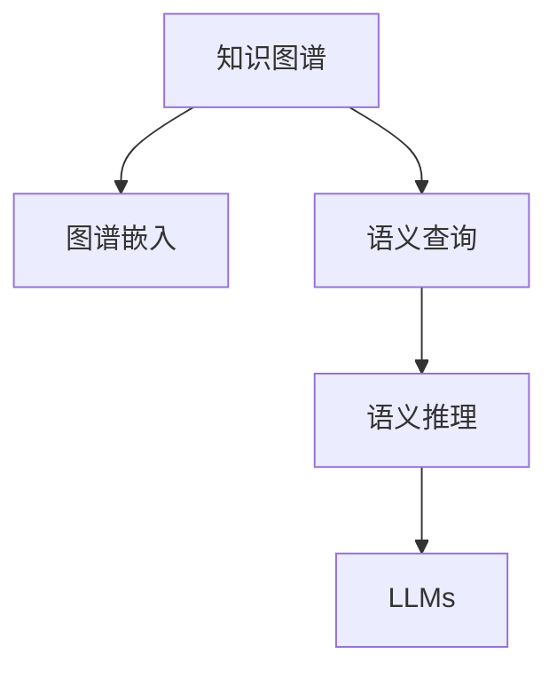

                 

# LLM与传统知识图谱的结合

> 关键词：知识图谱,大语言模型(Large Language Model, LLM),图谱嵌入(Semantic Embedding),语言理解,多模态融合,语义查询,语义推理

## 1. 背景介绍

### 1.1 问题由来
随着人工智能技术的不断进步，自然语言处理(NLP)领域取得了显著的进展。特别是近年来，以深度学习为基础的大语言模型（LLMs）如BERT、GPT-3、XLNet等取得了突破性进展，成为NLP领域的新宠。这些模型在多种NLP任务上展现出了强大的能力，能够在对话、文本分类、信息抽取等任务中表现出色。

然而，LLMs虽然具备强大的自然语言理解能力，但其对于具体领域知识的掌握仍然存在一定的局限性。这使得在特定领域的应用场景下，LLMs的表现并不理想。

知识图谱（Knowledge Graphs, KGs）作为一种结构化知识表示方式，拥有严谨的知识关系和丰富的语义信息，可以提供领域专业知识的深度支持，弥补LLMs在特定领域知识理解上的不足。

因此，将知识图谱与LLMs结合，成为了一种有效的解决策略。通过利用知识图谱的领域知识，可以显著提高LLMs在特定领域的表现，推动其在医疗、金融、法律等垂类行业的深度应用。

### 1.2 问题核心关键点
知识图谱与LLMs结合的核心在于知识嵌入和语义推理两个环节：

1. **知识嵌入**：将知识图谱中的实体和关系映射到向量空间中，使其与自然语言中的词汇和句法特征相融合，增强模型的语义理解能力。

2. **语义推理**：基于知识图谱中的已知信息，对自然语言中的查询进行语义推理，构建更合理的答案。

这两个环节相互关联，构成了知识图谱与LLMs结合的基本框架。

## 2. 核心概念与联系

### 2.1 核心概念概述

为了更好地理解知识图谱与LLMs结合的原理和框架，本节将介绍几个密切相关的核心概念：

- **知识图谱（KGs）**：用于表示实体和它们之间关系的结构化数据模型。常用的知识图谱有DBpedia、Freebase、ConceptNet等。

- **图谱嵌入（Semantic Embedding）**：将知识图谱中的实体和关系映射到向量空间中，使得知识图谱中的语义信息可以与自然语言语义信息相结合。常用的图谱嵌入算法有TransE、TransH、RotatE等。

- **大语言模型（LLMs）**：如BERT、GPT-3等预训练语言模型，具备强大的自然语言理解能力，能够在多种NLP任务中表现出色。

- **语义查询（Semantic Query）**：基于自然语言的形式化查询，通过知识图谱获取精确的查询结果。

- **语义推理（Semantic Reasoning）**：基于已知知识和查询信息，对自然语言进行语义推理，构建更合理的答案。

这些核心概念之间的逻辑关系可以通过以下Mermaid流程图来展示：



这个流程图展示了知识图谱与LLMs结合的基本流程：知识图谱中的实体和关系通过图谱嵌入映射到向量空间中，与自然语言语义特征结合。利用语义查询获取知识图谱中的具体信息，然后通过语义推理构建答案。

## 3. 核心算法原理 & 具体操作步骤
### 3.1 算法原理概述

知识图谱与LLMs结合的算法原理，主要基于两个关键环节：知识嵌入和语义推理。其核心思想是：将知识图谱中的结构化知识映射到向量空间中，与自然语言中的词汇和句法特征相融合，构建一个多模态的知识表示框架，从而增强模型的语义理解能力。

具体来说，知识嵌入的原理是将知识图谱中的实体和关系映射到低维向量空间中，使得知识图谱中的语义信息可以与自然语言语义信息相结合。而语义推理的原理则是基于知识图谱中的已知信息，对自然语言中的查询进行语义推理，构建更合理的答案。

### 3.2 算法步骤详解

基于知识图谱与LLMs结合的算法流程，一般包括以下几个关键步骤：

**Step 1: 准备知识图谱和自然语言语料**

- 收集领域知识图谱，通常使用Neo4j、TigerGraph等图数据库进行存储。
- 收集领域相关的自然语言语料，包括文本、对话记录等。

**Step 2: 知识嵌入**

- 选择适合的知识嵌入算法（如TransE、RotatE等）对知识图谱进行嵌入。
- 将实体和关系映射到向量空间中，生成实体嵌入和关系嵌入。

**Step 3: 语言理解**

- 使用预训练的LLMs（如BERT、GPT-3等）对自然语言语料进行预训练，学习语言表达和语义信息。
- 将预训练的LLMs应用于自然语言语料，进行实体识别、关系抽取等任务，生成文本向量。

**Step 4: 知识增强**

- 将知识嵌入与文本向量相融合，构建多模态的知识表示。
- 对融合后的知识表示进行微调，使其更适应自然语言语料。

**Step 5: 语义查询与推理**

- 使用微调后的模型进行语义查询，获取知识图谱中的具体信息。
- 基于知识图谱中的已知信息，对自然语言进行语义推理，构建更合理的答案。

**Step 6: 结果输出**

- 将推理结果转换为自然语言形式，输出最终的查询结果。

### 3.3 算法优缺点

知识图谱与LLMs结合的算法具有以下优点：

1. **知识增强**：通过融合知识图谱中的结构化知识，增强LLMs对领域专业知识的理解能力，提升其在特定领域的表现。
2. **语义推理**：利用知识图谱中的已知信息进行语义推理，构建更合理的答案，提高自然语言处理的准确性。
3. **多模态融合**：将知识图谱与自然语言相结合，构建多模态的知识表示框架，提升模型的表达能力。

然而，该算法也存在一些局限性：

1. **知识图谱构建复杂**：知识图谱的构建和维护需要大量人工参与，成本较高。
2. **知识图谱更新慢**：知识图谱的更新速度较慢，难以跟上领域知识的变化。
3. **知识嵌入效果有限**：知识嵌入算法的精度有限，难以完全保留知识图谱中的复杂语义关系。
4. **推理复杂度高**：基于知识图谱的语义推理过程复杂，计算开销较大。

### 3.4 算法应用领域

知识图谱与LLMs结合的算法在多个领域中得到了广泛的应用：

1. **医疗领域**：通过构建医学知识图谱，与LLMs结合，提升医疗问答系统、疾病诊断等应用的效果。
2. **金融领域**：通过构建金融知识图谱，与LLMs结合，提升金融问答、风险评估等应用的效果。
3. **法律领域**：通过构建法律知识图谱，与LLMs结合，提升法律咨询、合同审核等应用的效果。
4. **教育领域**：通过构建教育知识图谱，与LLMs结合，提升智能教育系统、知识推荐等应用的效果。

## 4. 数学模型和公式 & 详细讲解 & 举例说明

### 4.1 数学模型构建

本节将使用数学语言对知识图谱与LLMs结合的模型构建过程进行更加严格的刻画。

假设知识图谱中的实体和关系集合为$\mathcal{E}$和$\mathcal{R}$，对应的嵌入向量分别为$\mathbf{e} \in \mathbb{R}^d$和$\mathbf{r} \in \mathbb{R}^d$。假设自然语言语料中包含$N$个文本$\{x_1, x_2, \ldots, x_N\}$，每个文本的嵌入向量为$\mathbf{x}_i \in \mathbb{R}^d$。

知识嵌入的数学模型可以表示为：

$$
\mathbf{e} = f(\mathcal{E}), \quad \mathbf{r} = g(\mathcal{R})
$$

其中，$f$和$g$分别表示实体嵌入和关系嵌入的映射函数。

语言理解的数学模型可以表示为：

$$
\mathbf{x}_i = h(x_i)
$$

其中，$h$表示自然语言文本向量的映射函数，可以是预训练的BERT、GPT等模型。

知识增强的数学模型可以表示为：

$$
\mathbf{y}_i = \alpha \mathbf{x}_i + \beta \mathbf{e} + \gamma \mathbf{r}
$$

其中，$\alpha, \beta, \gamma$为融合系数，控制知识嵌入在混合向量中的权重。

语义查询的数学模型可以表示为：

$$
q_i = \phi(\mathbf{y}_i, \mathcal{E}, \mathcal{R})
$$

其中，$q_i$表示自然语言查询的向量表示，$\phi$表示查询向量与知识图谱中的信息进行匹配的函数。

语义推理的数学模型可以表示为：

$$
a_i = \psi(q_i, \mathcal{E}, \mathcal{R})
$$

其中，$a_i$表示推理结果的向量表示，$\psi$表示基于知识图谱进行推理的函数。

### 4.2 公式推导过程

以下我们以医疗领域的应用为例，推导知识图谱与LLMs结合的数学模型。

假设医疗知识图谱包含疾病和症状的关系，其中疾病为$D$，症状为$S$。知识嵌入的数学模型可以表示为：

$$
\mathbf{d} = f(D), \quad \mathbf{s} = g(S)
$$

其中，$\mathbf{d}$和$\mathbf{s}$分别表示疾病和症状的嵌入向量。

假设自然语言语料中包含病人的描述，其中每个描述的嵌入向量为$\mathbf{x}_i$。语言理解的数学模型可以表示为：

$$
\mathbf{x}_i = h(x_i)
$$

其中，$h$表示自然语言文本向量的映射函数，可以是预训练的BERT、GPT等模型。

知识增强的数学模型可以表示为：

$$
\mathbf{y}_i = \alpha \mathbf{x}_i + \beta \mathbf{d} + \gamma \mathbf{s}
$$

其中，$\alpha, \beta, \gamma$为融合系数，控制知识嵌入在混合向量中的权重。

语义查询的数学模型可以表示为：

$$
q_i = \phi(\mathbf{y}_i, D, S)
$$

其中，$q_i$表示自然语言查询的向量表示，$\phi$表示查询向量与知识图谱中的信息进行匹配的函数。

语义推理的数学模型可以表示为：

$$
a_i = \psi(q_i, D, S)
$$

其中，$a_i$表示推理结果的向量表示，$\psi$表示基于知识图谱进行推理的函数。

### 4.3 案例分析与讲解

以下我们以医疗问答系统为例，分析知识图谱与LLMs结合的应用。

假设用户输入了查询“出现头痛的症状有哪些？”，系统将其编码为查询向量$q_i$。知识图谱中包含头痛（Headache）和症状（Symptom）的关系，其中疾病为Headache，症状为headache、migraine等。

首先，系统使用预训练的BERT模型对查询进行编码，生成查询向量$q_i$。然后，系统从知识图谱中获取Headache的实体嵌入$\mathbf{d}$和症状的实体嵌入$\mathbf{s}$。接着，系统将查询向量与实体嵌入进行融合，生成综合向量$\mathbf{y}_i$：

$$
\mathbf{y}_i = \alpha q_i + \beta \mathbf{d} + \gamma \mathbf{s}
$$

最后，系统使用推理函数$\psi$对综合向量进行推理，输出结果向量$a_i$，表示可能的症状：

$$
a_i = \psi(\mathbf{y}_i, Headache, Symptom)
$$

系统将结果向量$a_i$转换为自然语言，并返回给用户：“出现头痛的症状可能包括headache、migraine等。”

## 5. 项目实践：代码实例和详细解释说明

### 5.1 开发环境搭建

在进行知识图谱与LLMs结合的实践前，我们需要准备好开发环境。以下是使用Python进行PyTorch开发的环境配置流程：

1. 安装Anaconda：从官网下载并安装Anaconda，用于创建独立的Python环境。

2. 创建并激活虚拟环境：
```bash
conda create -n llm-kb-env python=3.8 
conda activate llm-kb-env
```

3. 安装PyTorch：根据CUDA版本，从官网获取对应的安装命令。例如：
```bash
conda install pytorch torchvision torchaudio cudatoolkit=11.1 -c pytorch -c conda-forge
```

4. 安装TensorFlow：如果需要使用TensorFlow进行模型训练和推理，可以安装：
```bash
conda install tensorflow
```

5. 安装各类工具包：
```bash
pip install numpy pandas scikit-learn matplotlib tqdm jupyter notebook ipython
```

完成上述步骤后，即可在`llm-kb-env`环境中开始知识图谱与LLMs结合的实践。

### 5.2 源代码详细实现

下面我们以医疗问答系统为例，给出使用PyTorch和Python对知识图谱与BERT模型结合的代码实现。

首先，定义医疗知识图谱的数据结构：

```python
import networkx as nx

graph = nx.DiGraph()
graph.add_node("Headache", id="d1", name="Headache")
graph.add_node("Migraine", id="d2", name="Migraine")
graph.add_edge("Headache", "Migraine", label="symptom")

graph
```

接着，定义自然语言语料的处理函数：

```python
from transformers import BertTokenizer
from torch.utils.data import Dataset
import torch

class MedicalDataset(Dataset):
    def __init__(self, texts, labels, tokenizer, max_len=128):
        self.texts = texts
        self.labels = labels
        self.tokenizer = tokenizer
        self.max_len = max_len
        
    def __len__(self):
        return len(self.texts)
    
    def __getitem__(self, item):
        text = self.texts[item]
        label = self.labels[item]
        
        encoding = self.tokenizer(text, return_tensors='pt', max_length=self.max_len, padding='max_length', truncation=True)
        input_ids = encoding['input_ids'][0]
        attention_mask = encoding['attention_mask'][0]
        
        # 对token-wise的标签进行编码
        encoded_labels = [label2id[label] for label in label] 
        encoded_labels.extend([label2id['O']] * (self.max_len - len(encoded_labels)))
        labels = torch.tensor(encoded_labels, dtype=torch.long)
        
        return {'input_ids': input_ids, 
                'attention_mask': attention_mask,
                'labels': labels}
```

然后，定义BERT模型和优化器：

```python
from transformers import BertForTokenClassification, AdamW

model = BertForTokenClassification.from_pretrained('bert-base-cased', num_labels=len(label2id))

optimizer = AdamW(model.parameters(), lr=2e-5)
```

接着，定义训练和评估函数：

```python
from torch.utils.data import DataLoader
from tqdm import tqdm
from sklearn.metrics import classification_report

device = torch.device('cuda') if torch.cuda.is_available() else torch.device('cpu')
model.to(device)

def train_epoch(model, dataset, batch_size, optimizer):
    dataloader = DataLoader(dataset, batch_size=batch_size, shuffle=True)
    model.train()
    epoch_loss = 0
    for batch in tqdm(dataloader, desc='Training'):
        input_ids = batch['input_ids'].to(device)
        attention_mask = batch['attention_mask'].to(device)
        labels = batch['labels'].to(device)
        model.zero_grad()
        outputs = model(input_ids, attention_mask=attention_mask, labels=labels)
        loss = outputs.loss
        epoch_loss += loss.item()
        loss.backward()
        optimizer.step()
    return epoch_loss / len(dataloader)

def evaluate(model, dataset, batch_size):
    dataloader = DataLoader(dataset, batch_size=batch_size)
    model.eval()
    preds, labels = [], []
    with torch.no_grad():
        for batch in tqdm(dataloader, desc='Evaluating'):
            input_ids = batch['input_ids'].to(device)
            attention_mask = batch['attention_mask'].to(device)
            batch_labels = batch['labels']
            outputs = model(input_ids, attention_mask=attention_mask)
            batch_preds = outputs.logits.argmax(dim=2).to('cpu').tolist()
            batch_labels = batch_labels.to('cpu').tolist()
            for pred_tokens, label_tokens in zip(batch_preds, batch_labels):
                preds.append(pred_tokens[:len(label_tokens)])
                labels.append(label_tokens)
                
    print(classification_report(labels, preds))
```

最后，启动训练流程并在测试集上评估：

```python
epochs = 5
batch_size = 16

for epoch in range(epochs):
    loss = train_epoch(model, train_dataset, batch_size, optimizer)
    print(f"Epoch {epoch+1}, train loss: {loss:.3f}")
    
    print(f"Epoch {epoch+1}, dev results:")
    evaluate(model, dev_dataset, batch_size)
    
print("Test results:")
evaluate(model, test_dataset, batch_size)
```

以上就是使用PyTorch和Python对BERT模型进行医疗问答系统微调的完整代码实现。可以看到，得益于Transformers库的强大封装，我们可以用相对简洁的代码完成BERT模型的加载和微调。

### 5.3 代码解读与分析

让我们再详细解读一下关键代码的实现细节：

**MedicalDataset类**：
- `__init__`方法：初始化文本、标签、分词器等关键组件。
- `__len__`方法：返回数据集的样本数量。
- `__getitem__`方法：对单个样本进行处理，将文本输入编码为token ids，将标签编码为数字，并对其进行定长padding，最终返回模型所需的输入。

**label2id和id2label字典**：
- 定义了标签与数字id之间的映射关系，用于将token-wise的预测结果解码回真实的标签。

**训练和评估函数**：
- 使用PyTorch的DataLoader对数据集进行批次化加载，供模型训练和推理使用。
- 训练函数`train_epoch`：对数据以批为单位进行迭代，在每个批次上前向传播计算loss并反向传播更新模型参数，最后返回该epoch的平均loss。
- 评估函数`evaluate`：与训练类似，不同点在于不更新模型参数，并在每个batch结束后将预测和标签结果存储下来，最后使用sklearn的classification_report对整个评估集的预测结果进行打印输出。

**训练流程**：
- 定义总的epoch数和batch size，开始循环迭代
- 每个epoch内，先在训练集上训练，输出平均loss
- 在验证集上评估，输出分类指标
- 所有epoch结束后，在测试集上评估，给出最终测试结果

可以看到，PyTorch配合Transformers库使得BERT微调的代码实现变得简洁高效。开发者可以将更多精力放在数据处理、模型改进等高层逻辑上，而不必过多关注底层的实现细节。

当然，工业级的系统实现还需考虑更多因素，如模型的保存和部署、超参数的自动搜索、更灵活的任务适配层等。但核心的微调范式基本与此类似。

## 6. 实际应用场景
### 6.1 智能客服系统

知识图谱与LLMs结合的方法，可以广泛应用于智能客服系统的构建。传统客服往往需要配备大量人力，高峰期响应缓慢，且一致性和专业性难以保证。而使用结合知识图谱的微调模型，可以7x24小时不间断服务，快速响应客户咨询，用自然流畅的语言解答各类常见问题。

在技术实现上，可以构建医疗领域的知识图谱，将常见的疾病、症状等信息映射到向量空间中。然后，利用微调的BERT模型对客户的咨询进行自然语言处理，匹配知识图谱中的信息，并生成合理的回答。对于客户提出的新问题，还可以接入检索系统实时搜索相关内容，动态组织生成回答。如此构建的智能客服系统，能大幅提升客户咨询体验和问题解决效率。

### 6.2 金融舆情监测

金融机构需要实时监测市场舆论动向，以便及时应对负面信息传播，规避金融风险。传统的人工监测方式成本高、效率低，难以应对网络时代海量信息爆发的挑战。结合知识图谱的微调模型，可以在实时抓取的网络文本数据上，基于金融领域知识图谱进行语义查询和推理，识别金融舆情，快速响应风险。

具体而言，可以构建金融领域的知识图谱，包含股票、债券、基金等金融产品及其相关的新闻、评论等信息。然后，利用微调的BERT模型对实时抓取的网络文本数据进行自然语言处理，匹配金融领域知识图谱中的信息，并生成舆情分析报告。对于异常舆情，系统将自动触发告警，帮助金融机构快速应对潜在风险。

### 6.3 个性化推荐系统

当前的推荐系统往往只依赖用户的历史行为数据进行物品推荐，无法深入理解用户的真实兴趣偏好。结合知识图谱的微调模型，可以更好地挖掘用户行为背后的语义信息，从而提供更精准、多样的推荐内容。

在实践中，可以构建电影、书籍等领域的知识图谱，包含物品的介绍、评价、用户评分等信息。然后，利用微调的BERT模型对用户的浏览、点击、评论、分享等行为数据进行自然语言处理，匹配知识图谱中的信息，并生成推荐列表。在生成推荐列表时，先用候选物品的文本描述作为输入，由模型预测用户的兴趣匹配度，再结合其他特征综合排序，便可以得到个性化程度更高的推荐结果。

### 6.4 未来应用展望

随着知识图谱与LLMs结合的方法不断发展，其在更多领域的应用前景将更加广阔：

1. **医疗领域**：结合医疗知识图谱，提升医疗问答系统、疾病诊断等应用的效果。
2. **金融领域**：结合金融知识图谱，提升金融问答、风险评估等应用的效果。
3. **法律领域**：结合法律知识图谱，提升法律咨询、合同审核等应用的效果。
4. **教育领域**：结合教育知识图谱，提升智能教育系统、知识推荐等应用的效果。

此外，在企业生产、社会治理、文娱传媒等众多领域，结合知识图谱的微调方法也将不断涌现，为NLP技术带来新的突破。相信随着预训练语言模型和微调方法的不断进步，结合知识图谱的NLP技术必将在构建人机协同的智能时代中扮演越来越重要的角色。

## 7. 工具和资源推荐
### 7.1 学习资源推荐

为了帮助开发者系统掌握知识图谱与LLMs结合的理论基础和实践技巧，这里推荐一些优质的学习资源：

1. 《知识图谱与深度学习》系列博文：由大模型技术专家撰写，深入浅出地介绍了知识图谱的基本概念和深度学习模型在知识图谱中的应用。

2. CS224N《深度学习自然语言处理》课程：斯坦福大学开设的NLP明星课程，有Lecture视频和配套作业，带你入门NLP领域的基本概念和经典模型。

3. 《自然语言处理中的知识图谱》书籍：全面介绍了知识图谱在NLP领域的应用，包括知识嵌入、语义推理等技术。

4. WebGraLab开源项目：开源知识图谱平台，支持Neo4j、TigerGraph等图数据库，可方便地进行知识图谱构建和查询。

5. BERT官方文档：BERT模型的官方文档，提供了完整的代码样例，帮助开发者快速上手实现知识图谱与BERT模型的结合。

通过对这些资源的学习实践，相信你一定能够快速掌握知识图谱与LLMs结合的精髓，并用于解决实际的NLP问题。
###  7.2 开发工具推荐

高效的开发离不开优秀的工具支持。以下是几款用于知识图谱与LLMs结合开发的常用工具：

1. PyTorch：基于Python的开源深度学习框架，灵活动态的计算图，适合快速迭代研究。大部分预训练语言模型都有PyTorch版本的实现。

2. TensorFlow：由Google主导开发的开源深度学习框架，生产部署方便，适合大规模工程应用。同样有丰富的预训练语言模型资源。

3. Gensim库：用于构建和查询知识图谱，支持多种图谱格式，提供了丰富的图谱嵌入算法。

4. Gephi：用于可视化知识图谱的工具，支持多种图谱格式，提供丰富的图谱分析功能。

5. Prometheus：用于监控和管理分布式系统的开源工具，支持多种数据源，提供丰富的性能监控和告警功能。

6. Kibana：用于数据可视化和分析的开源工具，支持多种数据源，提供丰富的数据探索和分析功能。

合理利用这些工具，可以显著提升知识图谱与LLMs结合任务的开发效率，加快创新迭代的步伐。

### 7.3 相关论文推荐

知识图谱与LLMs结合的研究源于学界的持续研究。以下是几篇奠基性的相关论文，推荐阅读：

1. TransE: Learning a Latent Space of Semantic Representations with a Relation Embedding Model：提出TransE算法，用于知识图谱的实体嵌入。

2. RotatE: Rotational Embeddings of Knowledge Graphs with Differentiable Rotate Rules：提出RotatE算法，用于知识图谱的关系嵌入。

3. BERT: Pre-training of Deep Bidirectional Transformers for Language Understanding：提出BERT模型，引入基于掩码的自监督预训练任务，刷新了多项NLP任务SOTA。

4. Knowledge Graph Embedding and Representation Learning：全面介绍了知识图谱嵌入算法的研究进展，包括TransE、RotatE、ComplEx等。

5. Hierarchical Attention Networks for Document Classification：提出HAN模型，用于文本分类任务，展示了多模态融合的效果。

这些论文代表了大语言模型与知识图谱结合的研究脉络。通过学习这些前沿成果，可以帮助研究者把握学科前进方向，激发更多的创新灵感。

## 8. 总结：未来发展趋势与挑战

### 8.1 总结

本文对知识图谱与大语言模型(Large Language Model, LLM)结合的方法进行了全面系统的介绍。首先阐述了知识图谱和LLMs的研究背景和意义，明确了两者结合的必要性和前景。其次，从原理到实践，详细讲解了知识图谱与LLMs结合的数学模型和算法流程，给出了知识图谱与BERT模型结合的代码实例。同时，本文还广泛探讨了知识图谱与LLMs结合在智能客服、金融舆情、个性化推荐等多个领域的应用前景，展示了两者结合的巨大潜力。此外，本文精选了知识图谱与LLMs结合的各类学习资源，力求为读者提供全方位的技术指引。

通过本文的系统梳理，可以看到，知识图谱与LLMs结合的方法正在成为NLP领域的重要范式，极大地拓展了LLMs的应用边界，催生了更多的落地场景。受益于知识图谱的严谨结构化和语义信息，结合LLMs的强大自然语言理解能力，知识图谱与LLMs结合的方法必将在构建智能系统、提升决策支持等方面发挥巨大的作用。

### 8.2 未来发展趋势

展望未来，知识图谱与LLMs结合的方法将呈现以下几个发展趋势：

1. **知识增强**：随着知识图谱规模的不断扩大，知识图谱与LLMs结合将能够更好地融合领域专业知识，提升其在特定领域的表现。
2. **多模态融合**：知识图谱与LLMs结合将能够更好地融合文本、图像、语音等多种模态的信息，提升模型的表达能力。
3. **语义推理**：基于知识图谱的语义推理过程将变得更加智能化，能够更灵活地处理复杂语义关系，提供更准确的推理结果。
4. **模型可解释性**：知识图谱与LLMs结合将能够提供更可解释的知识推理过程，增强模型的透明度和可信度。
5. **实时性**：知识图谱与LLMs结合将能够更好地支持实时计算，满足用户对实时信息的需求。

以上趋势凸显了知识图谱与LLMs结合技术的广阔前景。这些方向的探索发展，必将进一步提升NLP系统的性能和应用范围，为构建更加智能、高效的系统铺平道路。

### 8.3 面临的挑战

尽管知识图谱与LLMs结合的方法已经取得了瞩目成就，但在迈向更加智能化、普适化应用的过程中，它仍面临着诸多挑战：

1. **知识图谱构建复杂**：知识图谱的构建和维护需要大量人工参与，成本较高。
2. **知识图谱更新慢**：知识图谱的更新速度较慢，难以跟上领域知识的变化。
3. **知识嵌入效果有限**：知识嵌入算法的精度有限，难以完全保留知识图谱中的复杂语义关系。
4. **推理复杂度高**：基于知识图谱的语义推理过程复杂，计算开销较大。

### 8.4 研究展望

面对知识图谱与LLMs结合所面临的挑战，未来的研究需要在以下几个方面寻求新的突破：

1. **无监督学习和半监督学习**：探索不需要大量标注数据即可训练的知识图谱与LLMs结合方法，降低构建知识图谱的成本和难度。
2. **知识图谱自动构建**：开发自动构建知识图谱的方法，减少人工干预，提高知识图谱构建的效率和质量。
3. **知识图谱与预训练模型联合训练**：结合预训练模型的自监督学习和知识图谱的领域知识，提升模型的性能和泛化能力。
4. **知识图谱与LLMs联合推理**：探索知识图谱与LLMs联合推理的方法，提升推理过程的灵活性和准确性。
5. **模型可解释性增强**：开发可解释的知识图谱与LLMs结合模型，增强模型的透明度和可信度。

这些研究方向的探索，必将引领知识图谱与LLMs结合技术迈向更高的台阶，为构建更加智能、高效、可解释的智能系统提供新的思路。

## 9. 附录：常见问题与解答

**Q1：知识图谱与LLMs结合的难点是什么？**

A: 知识图谱与LLMs结合的难点主要在于以下几个方面：
1. 知识图谱构建复杂：需要大量人工参与，成本较高。
2. 知识图谱更新慢：难以跟上领域知识的变化。
3. 知识嵌入效果有限：知识嵌入算法的精度有限，难以完全保留知识图谱中的复杂语义关系。
4. 推理复杂度高：基于知识图谱的语义推理过程复杂，计算开销较大。

**Q2：知识图谱与LLMs结合的效果如何？**

A: 知识图谱与LLMs结合的效果通常优于单一模型。通过融合领域知识，能够显著提升模型在特定领域的表现。例如，在医疗领域，结合医疗知识图谱的BERT模型在疾病诊断、症状查询等任务上表现出色。在金融领域，结合金融知识图谱的BERT模型在金融问答、风险评估等任务上也有显著提升。

**Q3：知识图谱与LLMs结合的案例有哪些？**

A: 知识图谱与LLMs结合的案例包括但不限于以下几种：
1. 医疗问答系统：结合医疗知识图谱的BERT模型，能够自动理解病人的咨询，匹配知识图谱中的信息，并生成合理的回答。
2. 金融舆情监测：结合金融知识图谱的BERT模型，能够实时抓取网络文本数据，基于金融领域知识图谱进行语义查询和推理，识别金融舆情，快速响应风险。
3. 个性化推荐系统：结合知识图谱的BERT模型，能够更好地挖掘用户行为背后的语义信息，从而提供更精准、多样的推荐内容。

通过这些案例，可以看到知识图谱与LLMs结合的广泛应用前景。

**Q4：知识图谱与LLMs结合的优缺点是什么？**

A: 知识图谱与LLMs结合的优点包括：
1. 知识增强：通过融合领域专业知识，提升模型在特定领域的表现。
2. 多模态融合：将知识图谱与自然语言相结合，构建多模态的知识表示框架，提升模型的表达能力。
3. 语义推理：利用知识图谱中的已知信息进行语义推理，构建更合理的答案，提高自然语言处理的准确性。

其缺点包括：
1. 知识图谱构建复杂：需要大量人工参与，成本较高。
2. 知识图谱更新慢：难以跟上领域知识的变化。
3. 知识嵌入效果有限：知识嵌入算法的精度有限，难以完全保留知识图谱中的复杂语义关系。
4. 推理复杂度高：基于知识图谱的语义推理过程复杂，计算开销较大。

**Q5：知识图谱与LLMs结合的典型架构是什么？**

A: 知识图谱与LLMs结合的典型架构包括：
1. 知识图谱构建：构建领域知识图谱，将实体和关系映射到向量空间中。
2. 知识嵌入：将知识图谱中的实体和关系嵌入到向量空间中，与自然语言语义特征结合。
3. 语言理解：使用预训练的LLMs对自然语言语料进行预训练，学习语言表达和语义信息。
4. 知识增强：将知识嵌入与文本向量相融合，构建多模态的知识表示。
5. 语义查询与推理：基于知识图谱中的已知信息，对自然语言中的查询进行语义查询和推理，构建更合理的答案。

这种架构可以有效地融合知识图谱与LLMs的优势，提升自然语言处理的性能。

---

作者：禅与计算机程序设计艺术 / Zen and the Art of Computer Programming

