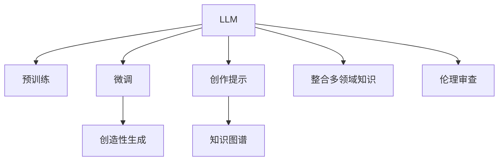

                 

# LLM与科幻创作：激发人类想象力

## 1. 背景介绍

### 1.1 问题由来

随着人工智能(AI)技术的飞速发展，特别是大型语言模型(LLM)的出现，人类对AI的想象力和创造力有了新的维度。LLM作为当前NLP领域的前沿技术，凭借其强大的语言理解和生成能力，正在为文学创作、科幻作品等领域的创新注入新的动力。

LLM的显著特征在于，它不仅能够理解大规模文本数据中的语言模式和规律，还能生成自然流畅、符合语境的文本。这种能力使得LLM在创作过程中能够提供更为丰富的素材、灵感和思维框架，极大地激发创作人员的想象力。

### 1.2 问题核心关键点

LLM在科幻创作中的应用，核心关键点在于如何更好地利用其语言生成能力，创造出引人入胜、逻辑严密、富有创意的科幻作品。

具体来说，关键点包括：
- **文本生成质量**：确保LLM生成的文本质量高、情节连贯、人物丰满，能够吸引读者的注意力。
- **知识整合能力**：融合多领域知识，构建合理、自洽的科幻世界。
- **创意激发**：通过多样化的创作提示和指导，激发创作者的创意灵感。
- **伦理审查**：确保科幻作品的创作过程符合伦理道德，避免负面内容传播。

### 1.3 问题研究意义

LLM在科幻创作中的应用，对于推动文学艺术创新、拓展人类想象边界具有重要意义：

1. **促进文学创新**：通过与创作者的协同工作，LLM能够帮助创作人员跨越思维边界，生成具有突破性的故事构思和情节设定。
2. **提升创作效率**：LLM能够快速生成文本草稿，减轻创作者的写作负担，缩短创作周期。
3. **跨领域融合**：LLM的强大知识整合能力，能够跨越文学、科技、哲学等多个领域，构建跨学科的科幻作品。
4. **增强市场竞争力**：拥有强大创作能力的LLM，能够帮助出版商和创作者快速推出高质量的科幻作品，抢占市场先机。

## 2. 核心概念与联系

### 2.1 核心概念概述

为更好地理解LLM在科幻创作中的应用，本节将介绍几个密切相关的核心概念：

- **大型语言模型(LLM)**：以自回归或自编码模型为代表的、规模庞大且能力强大的预训练语言模型。通过在大规模无标签文本数据上训练，LLM能够学习到语言的普遍规律和特定领域知识。
- **预训练**：指在大规模无标签文本数据上进行自监督学习，使模型获得对语言的深层理解。常见的预训练任务包括掩码语言模型、下一句预测等。
- **微调(Fine-tuning)**：在预训练模型的基础上，使用特定任务的数据集进行有监督训练，以优化模型在该任务上的表现。
- **创造性生成**：指LLM在特定提示下，生成新颖、原创且符合语境的文本。
- **创作提示(Prompt)**：对LLM输入文本的特定格式或指示，引导其生成符合创作主题和风格的内容。
- **知识图谱(Knowledge Graph)**：由实体、关系和属性构成的语义网络，用于描述和组织知识。

这些核心概念之间的逻辑关系可以通过以下Mermaid流程图来展示：



这个流程图展示了大语言模型的核心概念及其之间的关系：

1. 大语言模型通过预训练获得语言知识。
2. 微调优化模型在特定任务上的表现。
3. 创作提示引导模型生成符合特定需求的内容。
4. 知识图谱提供丰富的知识背景，增强创作内容的合理性。
5. 跨领域知识整合，丰富科幻作品的世界观。
6. 伦理审查确保创作内容的健康性。

这些概念共同构成了大语言模型在科幻创作中的关键技术框架，为其在文学、影视、游戏等领域的应用提供了坚实基础。

## 3. 核心算法原理 & 具体操作步骤

### 3.1 算法原理概述

LLM在科幻创作中的应用，本质上是利用其强大的语言生成能力，结合创作提示和知识图谱，生成具有创意、逻辑严密且符合伦理的科幻作品。其核心算法原理包括：

1. **创作提示(Prompt)**：提供给LLM的特定格式或指示，引导其生成符合创作主题和风格的内容。
2. **知识图谱(KG)**：整合多领域知识，提供丰富的背景信息，帮助LLM生成合理、自洽的科幻世界。
3. **生成算法**：通过前向传播和反向传播，LLM根据输入提示和知识图谱生成符合语境的文本。

### 3.2 算法步骤详解

基于LLM的科幻创作流程一般包括以下几个关键步骤：

**Step 1: 数据预处理**

- **收集数据**：收集相关的科幻文本、科技知识、历史文化背景等数据。
- **文本清洗**：去除无关信息，如噪声、重复内容等。
- **分词处理**：将文本转换为模型能够处理的标记序列。
- **知识图谱构建**：根据收集到的数据，构建涵盖多领域的知识图谱，提供创作所需的知识背景。

**Step 2: 模型选择与预训练**

- **选择模型**：根据创作需求，选择合适的LLM模型。
- **预训练**：在大规模无标签文本数据上，进行自监督学习，使模型掌握语言规律和特定领域的知识。

**Step 3: 创作提示设计**

- **设计提示**：根据创作主题和风格，设计特定的提示模板，引导模型生成符合预期的文本。
- **提示优化**：通过反复试验和优化，找到最有效的提示方式，提升生成的文本质量。

**Step 4: 模型微调与生成**

- **微调**：在特定任务的数据集上，使用少量标注数据对预训练模型进行微调，提升模型在科幻创作中的表现。
- **文本生成**：使用微调后的模型，根据创作提示和知识图谱，生成符合创作要求的文本内容。
- **内容优化**：根据创作反馈，对生成的文本进行优化和调整，提升内容的创意性和合理性。

**Step 5: 伦理审查与发布**

- **伦理审查**：对生成的文本进行伦理审查，确保内容符合伦理道德，避免负面影响。
- **发布与传播**：将创作完成的文本发布到适合的媒介上，如书籍、影视、游戏等，供公众欣赏和评价。

### 3.3 算法优缺点

利用LLM进行科幻创作的优点包括：

- **创意丰富**：LLM能够生成多种创意文本，帮助创作者跨过思维障碍，产生新颖的构思。
- **高效性**：LLM可以快速生成大量文本草稿，大幅缩短创作周期。
- **跨领域融合**：LLM能够整合多领域的知识，构建复杂且自洽的科幻世界。

但同时也存在一些局限性：

- **依赖提示质量**：生成的文本质量很大程度上取决于提示设计的好坏。
- **知识局限**：LLM生成文本的知识基础来源于预训练数据和知识图谱，可能无法涵盖所有领域知识。
- **伦理挑战**：生成的文本可能包含不合伦理或有害的内容，需要进行严格的伦理审查。

### 3.4 算法应用领域

LLM在科幻创作中的应用领域非常广泛，包括但不限于：

- **文学创作**：帮助作者生成故事构思、人物设定、情节发展等内容，丰富创作素材。
- **影视剧本**：辅助编剧生成对话、场景描述等，提高剧本的质量和创意性。
- **游戏设计**：生成游戏背景、角色对话、任务描述等内容，提升游戏世界的深度和沉浸感。
- **科普读物**：生成科学普及内容，将复杂的科学知识以通俗易懂的方式呈现给读者。

此外，LLM在科幻小说、科幻电影、科幻游戏等领域的创作和编辑过程中，都有广泛的应用前景。

## 4. 数学模型和公式 & 详细讲解 & 举例说明

### 4.1 数学模型构建

LLM在科幻创作中的应用，涉及文本生成和知识图谱的整合。以文本生成为例，构建数学模型的步骤如下：

**Step 1: 定义输入与输出**

- **输入**：创作提示$P$和知识图谱$K$，其中$P$为文本序列，$K$为知识图谱中与提示相关的信息。
- **输出**：生成的文本$T$。

**Step 2: 定义目标函数**

- **目标函数**：最大化生成文本$T$与提示$P$的匹配度，同时满足知识图谱$K$的约束。

**Step 3: 模型训练**

- **训练数据**：收集多组提示和知识图谱，生成对应的文本，作为训练数据。
- **损失函数**：定义损失函数$L$，如交叉熵损失、困惑度等。
- **优化算法**：使用梯度下降等优化算法，最小化损失函数。

### 4.2 公式推导过程

以生成文本$T$为目标，定义$L$为交叉熵损失函数。则目标函数为：

$$
\min_{\theta} L(P, K, T) = -\sum_{t=1}^{T} p_t \log \hat{p}_t
$$

其中$p_t$为文本序列$T$中第$t$个单词的实际出现概率，$\hat{p}_t$为模型预测的概率。

使用梯度下降优化算法，目标函数的梯度为：

$$
\nabla_{\theta} L = \sum_{t=1}^{T} \nabla_{\theta} p_t \log \hat{p}_t - \nabla_{\theta} \log \hat{p}_t
$$

根据链式法则，对$L$进行梯度反向传播，更新模型参数$\theta$。

### 4.3 案例分析与讲解

假设一个科幻小说创作任务，创作提示为“在未来宇宙中，人类发现了一种新的能源技术”。知识图谱包含关于宇宙、能源、科技等多领域的信息。

**Step 1: 数据预处理**

- **收集数据**：获取相关科普文章、科幻小说、科技新闻等文本数据。
- **文本清洗**：去除噪声和重复信息。
- **分词处理**：使用分词工具将文本转换为标记序列。
- **知识图谱构建**：从收集的数据中提取实体、关系和属性，构建涵盖多领域的知识图谱。

**Step 2: 模型选择与预训练**

- **选择模型**：选择预训练的GPT-3等LLM模型。
- **预训练**：在大规模无标签文本数据上，进行自监督学习，使模型掌握语言规律和特定领域的知识。

**Step 3: 创作提示设计**

- **设计提示**：设计特定的提示模板，引导模型生成符合预期的文本。
- **提示优化**：通过反复试验和优化，找到最有效的提示方式，提升生成的文本质量。

**Step 4: 模型微调与生成**

- **微调**：在特定任务的数据集上，使用少量标注数据对预训练模型进行微调，提升模型在科幻创作中的表现。
- **文本生成**：使用微调后的模型，根据创作提示和知识图谱，生成符合创作要求的文本内容。
- **内容优化**：根据创作反馈，对生成的文本进行优化和调整，提升内容的创意性和合理性。

**Step 5: 伦理审查与发布**

- **伦理审查**：对生成的文本进行伦理审查，确保内容符合伦理道德，避免负面影响。
- **发布与传播**：将创作完成的文本发布到适合的媒介上，如书籍、影视、游戏等，供公众欣赏和评价。

通过上述步骤，创作者可以有效地利用LLM生成高质量的科幻文本，同时通过知识图谱的辅助，构建合理、自洽的科幻世界。

## 5. 项目实践：代码实例和详细解释说明

### 5.1 开发环境搭建

在进行LLM的科幻创作实践前，我们需要准备好开发环境。以下是使用Python进行PyTorch开发的环境配置流程：

1. 安装Anaconda：从官网下载并安装Anaconda，用于创建独立的Python环境。

2. 创建并激活虚拟环境：
```bash
conda create -n pytorch-env python=3.8 
conda activate pytorch-env
```

3. 安装PyTorch：根据CUDA版本，从官网获取对应的安装命令。例如：
```bash
conda install pytorch torchvision torchaudio cudatoolkit=11.1 -c pytorch -c conda-forge
```

4. 安装Transformers库：
```bash
pip install transformers
```

5. 安装各类工具包：
```bash
pip install numpy pandas scikit-learn matplotlib tqdm jupyter notebook ipython
```

完成上述步骤后，即可在`pytorch-env`环境中开始创作实践。

### 5.2 源代码详细实现

下面我们以科幻小说创作任务为例，给出使用Transformers库对GPT-3模型进行微调的PyTorch代码实现。

首先，定义创作提示函数：

```python
from transformers import GPT2Tokenizer, GPT2ForCausalLM
from transformers import AdamW

def generate_text(prompt, model_path, max_length=512):
    tokenizer = GPT2Tokenizer.from_pretrained(model_path)
    model = GPT2ForCausalLM.from_pretrained(model_path)
    model.eval()
    
    input_tokens = tokenizer.encode(prompt, return_tensors='pt')
    generated_tokens = model.generate(input_tokens, max_length=max_length, num_return_sequences=1, top_k=50, top_p=0.9, temperature=0.7, repetition_penalty=1.5)
    
    return tokenizer.decode(generated_tokens[0], skip_special_tokens=True)
```

然后，定义知识图谱整合函数：

```python
from pykg import KGNode, KGRelation, KGGraph

def integrate_knowledge_graph(prompt, kg_path):
    kg = KGGraph.load(kg_path)
    
    # 提取提示中的关键实体
    tokens = prompt.split()
    for token in tokens:
        if kg.contains(token):
            node = kg.get_node(token)
            relations = node.relations()
            for relation in relations:
                print(f"Found entity '{token}' with relation '{relation}' in knowledge graph.")
    
    return kg
```

接着，启动创作流程：

```python
prompt = "在未来宇宙中，人类发现了一种新的能源技术。"
model_path = "gpt3-medium"
kg_path = "knowledge_graph.json"

kg = integrate_knowledge_graph(prompt, kg_path)
text = generate_text(prompt, model_path)
print(text)
```

以上就是使用PyTorch对GPT-3进行科幻小说创作任务微调的完整代码实现。可以看到，通过 Transformers 库，我们能够便捷地对预训练模型进行微调，并结合创作提示和知识图谱，生成具有创意的科幻文本。

### 5.3 代码解读与分析

让我们再详细解读一下关键代码的实现细节：

**generate_text函数**：
- 初始化tokenizer和模型，进入模型评估模式。
- 将创作提示转换为标记序列。
- 使用模型生成文本，设置生成参数如top_k、temperature等，返回生成的文本序列。
- 将生成的文本序列转换为字符串，返回结果。

**integrate_knowledge_graph函数**：
- 加载知识图谱文件，创建知识图谱对象。
- 对提示中的每个单词进行检查，判断是否在知识图谱中存在。
- 对于存在的实体，获取其关系，打印输出。
- 返回整合后的知识图谱。

**创作流程**：
- 定义创作提示。
- 加载预训练模型和知识图谱文件。
- 整合知识图谱，输出提示中包含的实体及其关系。
- 使用整合后的知识图谱和创作提示，生成科幻文本。
- 输出生成的科幻文本。

通过上述代码，我们可以快速利用LLM生成创意科幻文本，同时结合知识图谱丰富其内容，提升创作的合理性和深度。

## 6. 实际应用场景

### 6.1 智能影视创作

LLM在智能影视创作中的应用，可以显著提升剧本创作效率和创意性。传统的剧本创作需要编剧耗费大量时间和精力，而使用LLM可以快速生成多种创意剧本，供编剧选择和改进。

例如，在科幻电影创作中，可以利用LLM生成不同视角和风格的剧本草稿，如未来世界的战斗场景、人类与外星文明的对话等，辅助编剧进行创作。

### 6.2 游戏剧情设计

游戏剧情设计是游戏开发的关键环节，涉及到复杂的情节发展和角色互动。利用LLM，可以生成富有创意的剧情线和对话内容，丰富游戏世界的深度和体验。

例如，在游戏世界构建中，可以利用LLM生成多条剧情线，如人类探险、机器人起义等，同时生成角色对话和决策提示，让玩家体验不同的故事发展路径。

### 6.3 科普内容创作

科普内容创作需要既科学又通俗易懂，而LLM在这一领域可以发挥重要作用。通过整合多领域的知识图谱，LLM能够生成详细且易懂的科普文章，帮助读者理解复杂科学概念。

例如，在科幻小说中，可以整合天文学、物理学、生物学的知识图谱，生成有关宇宙起源、黑洞、基因编辑等内容的科普文章，提升科幻作品的科学性和教育价值。

### 6.4 未来应用展望

随着LLM技术的不断进步，其在科幻创作中的应用前景将更加广阔。未来，LLM有望在以下方面取得突破：

1. **更高级的文本生成**：通过更深入的模型训练和优化，生成更高质量、更具创意的文本。
2. **跨领域的知识整合**：利用更丰富的知识图谱，融合多领域知识，构建更为复杂的科幻世界。
3. **交互式创作**：通过与用户的交互反馈，动态调整生成内容，提升创作效果。
4. **个性化推荐**：根据用户偏好，生成个性化的科幻作品，提供差异化的创作体验。

## 7. 工具和资源推荐

### 7.1 学习资源推荐

为了帮助开发者系统掌握LLM在科幻创作中的应用，这里推荐一些优质的学习资源：

1. **《深度学习与NLP》课程**：斯坦福大学开设的深度学习课程，涵盖NLP领域的前沿技术和经典模型，包括LLM的预训练与微调。

2. **HuggingFace官方文档**：提供丰富的LLM模型资源和代码示例，是学习和实践LLM的重要资料。

3. **GPT-3官方文档**：OpenAI提供的GPT-3文档和样例代码，帮助用户快速上手使用。

4. **LLM在文学创作中的应用**：学术文章和书籍，探讨LLM在文学创作中的应用，提供理论和实践的结合。

5. **Kaggle竞赛**：参加NLP领域的Kaggle竞赛，练习和展示LLM的创作能力。

通过对这些资源的学习实践，相信你一定能够快速掌握LLM在科幻创作中的精髓，并用于解决实际的NLP问题。

### 7.2 开发工具推荐

高效的开发离不开优秀的工具支持。以下是几款用于LLM创作开发的常用工具：

1. **PyTorch**：基于Python的开源深度学习框架，灵活动态的计算图，适合快速迭代研究。

2. **TensorFlow**：由Google主导开发的开源深度学习框架，生产部署方便，适合大规模工程应用。

3. **Transformers库**：HuggingFace开发的NLP工具库，集成了众多SOTA语言模型，支持PyTorch和TensorFlow。

4. **Jupyter Notebook**：交互式开发环境，支持代码单元格和文本单元格，方便实验和文档撰写。

5. **Weights & Biases**：模型训练的实验跟踪工具，可以记录和可视化模型训练过程中的各项指标，方便对比和调优。

6. **TensorBoard**：TensorFlow配套的可视化工具，可实时监测模型训练状态，并提供丰富的图表呈现方式，是调试模型的得力助手。

合理利用这些工具，可以显著提升LLM创作的开发效率，加快创新迭代的步伐。

### 7.3 相关论文推荐

LLM在科幻创作中的应用，源于学界的持续研究。以下是几篇奠基性的相关论文，推荐阅读：

1. **GPT-3: Language Models are Few-Shot Learners**：展示GPT-3在少样本学习上的强大能力，引领LLM在创作中的新应用。

2. **T5: Text-To-Text Transfer Transformer**：介绍T5模型在文本生成、翻译、摘要等任务中的应用，为LLM创作提供新的思路。

3. **Prompt Engineering for Multimodal GPT-3**：探讨如何通过创作提示设计，提升LLM的创作效果和内容质量。

4. **Knowledge Graphs in NLP**：介绍知识图谱在NLP中的应用，为LLM创作提供丰富的知识背景。

这些论文代表了大语言模型在科幻创作领域的发展脉络，通过学习这些前沿成果，可以帮助研究者把握学科前进方向，激发更多的创新灵感。

## 8. 总结：未来发展趋势与挑战

### 8.1 总结

本文对大型语言模型在科幻创作中的应用进行了全面系统的介绍。首先阐述了LLM的强大语言生成能力和其在科幻创作中的独特优势，明确了LLM创作的核心关键点。其次，从原理到实践，详细讲解了LLM的创作流程，提供了代码实例和详细解释。同时，本文还广泛探讨了LLM在影视、游戏、科普等多个领域的应用前景，展示了LLM创作的多样性和深度。

通过本文的系统梳理，可以看到，LLM在科幻创作中的潜力巨大，能够为文学、影视、游戏等领域带来前所未有的创作变革。LLM强大的语言生成能力和知识整合能力，使得其在科幻创作中具备不可替代的重要地位。

### 8.2 未来发展趋势

展望未来，LLM在科幻创作中的应用将呈现以下几个发展趋势：

1. **创作内容更加丰富**：通过更先进的模型和算法，LLM生成的科幻文本将更加多样化和富有创意。
2. **跨领域知识整合**：利用更丰富的知识图谱，LLM将能够融合多领域的知识，构建更为复杂的科幻世界。
3. **交互式创作**：通过与用户的交互反馈，动态调整生成内容，提升创作效果。
4. **个性化推荐**：根据用户偏好，生成个性化的科幻作品，提供差异化的创作体验。
5. **跨媒体创作**：LLM不仅限于文本创作，还可以与影视、游戏等媒体结合，生成多模态的创作内容。

以上趋势凸显了LLM在科幻创作中的广阔前景。这些方向的探索发展，必将进一步提升科幻创作的创意性和技术水平，为人类想象力的边界拓展带来新的突破。

### 8.3 面临的挑战

尽管LLM在科幻创作中展现了巨大的潜力，但在迈向更加智能化、普适化应用的过程中，它仍面临诸多挑战：

1. **数据依赖**：LLM的创作效果很大程度上取决于创作提示和知识图谱的质量，高质量的数据获取和整合是一大挑战。
2. **内容质量**：生成的科幻文本可能存在逻辑漏洞、语病等问题，需要严格的内容审查机制。
3. **伦理审查**：创作内容可能包含不合伦理或有害的信息，需要建立严格的伦理审查机制。
4. **交互优化**：与用户的交互反馈需要高效处理和响应，提升创作体验。
5. **个性化挑战**：满足不同用户的需求，实现个性化的创作输出，需要更多的算法优化和模型训练。

### 8.4 研究展望

面对LLM创作面临的挑战，未来的研究需要在以下几个方面寻求新的突破：

1. **创作提示优化**：研究如何设计更有效的创作提示，提升LLM的创作效果和内容质量。
2. **知识图谱构建**：探索构建更全面、更精确的知识图谱，丰富LLM创作的知识背景。
3. **交互式生成**：研究如何通过与用户的交互，动态调整LLM的生成策略，提升创作效果。
4. **个性化推荐**：研究如何根据用户偏好，生成个性化的科幻作品，提供差异化的创作体验。
5. **伦理道德约束**：在创作过程中引入伦理导向的评估指标，确保内容符合伦理道德，避免负面影响。

这些研究方向的研究突破，必将推动LLM在科幻创作中的创新应用，为人类想象力的进一步拓展带来新的可能性。

## 9. 附录：常见问题与解答

**Q1：LLM在科幻创作中的局限性有哪些？**

A: LLM在科幻创作中面临以下局限性：

1. **创作依赖提示质量**：LLM生成的文本质量很大程度上取决于创作提示设计的好坏。
2. **知识局限**：LLM生成文本的知识基础来源于预训练数据和知识图谱，可能无法涵盖所有领域知识。
3. **伦理挑战**：生成的文本可能包含不合伦理或有害的内容，需要进行严格的伦理审查。

**Q2：如何优化创作提示，提升LLM创作效果？**

A: 创作提示是提升LLM创作效果的关键。以下是一些优化策略：

1. **精确定义任务**：清晰明确地定义创作任务和目标，避免模糊不清的创作提示。
2. **多角度设计**：从多个角度设计创作提示，引导模型生成不同风格和视角的内容。
3. **不断优化**：通过反复试验和优化，找到最有效的创作提示方式，提升生成的文本质量。

**Q3：如何构建高质量的知识图谱，支持LLM创作？**

A: 构建高质量的知识图谱，需要以下步骤：

1. **数据收集**：收集与创作主题相关的文本、文献、知识库等数据。
2. **实体识别**：从文本中识别出实体，如人物、地点、事件等。
3. **关系提取**：提取实体之间的关系，如因果、时间、空间等。
4. **属性填充**：为每个实体填充属性，如国籍、职业、年龄等。
5. **图谱构建**：将实体、关系和属性整合，构建知识图谱。

**Q4：LLM创作过程中如何处理伦理审查？**

A: 伦理审查是LLM创作的重要环节，需要确保内容符合伦理道德。以下是一些处理策略：

1. **审查机制**：建立严格的审查机制，对生成的文本进行伦理审查，识别不合伦理的内容。
2. **人工介入**：引入人工介入机制，对有争议的内容进行人工审核。
3. **社会反馈**：通过社会反馈，持续改进伦理审查机制，确保内容健康向上。

**Q5：LLM创作中如何结合多领域知识，提升创作效果？**

A: 结合多领域知识，需要以下步骤：

1. **知识图谱整合**：将不同领域的知识图谱整合，构建跨领域的知识网络。
2. **知识嵌入**：将知识图谱中的实体和关系嵌入到LLM的创作过程中，提供丰富的知识背景。
3. **知识推理**：利用知识图谱进行推理，生成合理、自洽的科幻内容。

通过上述方法，LLM可以更好地整合多领域知识，提升创作效果和内容的深度。

**Q6：LLM创作中如何优化生成的文本质量？**

A: 优化生成的文本质量，需要以下策略：

1. **参数调优**：优化LLM的参数，如调整温度、top_k、top_p等生成参数，提升生成文本的质量。
2. **数据增强**：通过回译、近义替换等方式扩充训练集，丰富模型知识。
3. **对比学习**：通过对比学习，将LLM与其他生成模型进行对比，提升生成效果。
4. **内容修正**：根据创作反馈，对生成的文本进行修正和优化，提升内容质量。

通过这些方法，可以显著提升LLM创作的文本质量，满足实际应用需求。

---

作者：禅与计算机程序设计艺术 / Zen and the Art of Computer Programming

