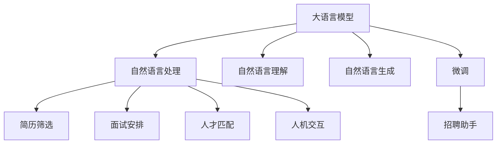

                 

# LLM在人力资源中的应用：AI招聘助手

> 关键词：人工智能招聘,LLM,自然语言处理,NLP,招聘助手,人机交互,大数据,自动化面试,智能推荐

## 1. 背景介绍

### 1.1 问题由来
人力资源管理一直是企业运营的核心环节，招聘作为其中最为关键的环节，直接影响着企业的长远发展。传统招聘流程繁琐复杂，耗时耗力，且容易受到人为因素的干扰，导致招聘效率低下、质量不高。如何利用先进的技术手段，提高招聘的自动化、智能化水平，已成为各大企业迫切需要解决的问题。

近年来，随着人工智能和大数据技术的迅猛发展，自然语言处理(NLP)技术在招聘领域的应用取得了显著进展。其中，基于语言模型(Language Model, LM)的招聘助手，通过收集和分析海量职位信息、简历和面试反馈数据，利用自然语言理解(NLU)和自然语言生成(NLG)能力，在简历筛选、面试安排、人才匹配等方面发挥了重要作用。

### 1.2 问题核心关键点
大语言模型(Large Language Model, LLM)技术，特别是基于Transformer架构的预训练模型，已经在多个NLP任务上取得了突破性进展。LLM通过大规模无标签文本数据的预训练，学习到了丰富的语言知识和语义信息，具备强大的自然语言理解和生成能力。在招聘领域，通过在招聘任务上微调(LM Fine-Tuning)LLM，可以构建高效的招聘助手，提升招聘效率和质量。

LLM在招聘助手中的应用主要体现在以下几个方面：
1. **简历筛选**：利用LLM的自然语言处理能力，自动筛选出符合职位要求的简历。
2. **面试安排**：基于面试反馈数据，生成最合适的面试问题和评价标准，提升面试效果。
3. **人才匹配**：利用LLM生成个性化推荐，帮助企业快速找到合适的人才。
4. **人机交互**：构建人机交互界面，使招聘过程更加智能化、人性化。

### 1.3 问题研究意义
利用LLM构建AI招聘助手，可以大幅提高招聘效率和质量，降低人力资源成本。具体而言：

1. **提升招聘效率**：自动化简历筛选和面试安排，减少了人工操作，缩短了招聘周期。
2. **提高招聘质量**：通过LLM的深度学习和理解能力，匹配最合适的候选人，提高招聘成功率。
3. **降低成本**：减少人工审核和筛选，降低招聘成本，提升企业的综合竞争力。
4. **优化用户体验**：通过智能化的招聘流程和交互方式，提高候选人的满意度，吸引更多优秀人才。
5. **支持决策分析**：利用LLM分析面试反馈和人才数据，辅助人力资源部门进行科学决策。

## 2. 核心概念与联系

### 2.1 核心概念概述

为更好地理解基于LLM的招聘助手，本节将介绍几个关键概念：

- 大语言模型(Large Language Model, LLM)：以Transformer架构为代表的大规模预训练语言模型，如BERT、GPT等。通过在大规模无标签文本语料上进行预训练，学习通用的语言表示，具备强大的语言理解和生成能力。

- 自然语言处理(Natural Language Processing, NLP)：研究计算机如何处理和理解人类自然语言的技术。NLP包括语音识别、文本分类、情感分析、机器翻译等多个子领域。

- 自然语言理解(Natural Language Understanding, NLU)：指计算机理解自然语言的能力，包括词义分析、句法分析、语义分析等。

- 自然语言生成(Natural Language Generation, NLG)：指计算机生成自然语言文本的能力，包括机器翻译、自动摘要、对话生成等。

- 微调(Fine-Tuning)：指在大规模预训练语言模型的基础上，通过有监督学习优化模型，适应特定任务的过程。

- 人机交互(Human-Computer Interaction, HCI)：研究如何让计算机更好地理解和响应用户输入，提升人机交流效率和体验。

这些概念之间的逻辑关系可以通过以下Mermaid流程图来展示：



这个流程图展示了大语言模型在招聘助手中的应用场景：

1. 大语言模型通过自然语言处理，利用自然语言理解能力，自动分析简历和面试数据。
2. 通过自然语言生成能力，生成个性化的推荐和面试问题。
3. 利用微调技术，针对招聘任务进行优化，构建高效的招聘助手。
4. 通过人机交互技术，提升用户体验。

## 3. 核心算法原理 & 具体操作步骤
### 3.1 算法原理概述

基于LLM的招聘助手，本质上是一种利用自然语言处理和理解能力，辅助招聘流程的技术。其核心思想是：将大规模预训练的LLM作为招聘助手的初始模型，通过在招聘任务上进行微调，使其能够自动理解和处理招聘相关的自然语言数据，从而提升招聘效率和质量。

具体来说，招聘助手可以完成以下任务：
1. 简历筛选：自动分析简历文本，匹配符合职位要求的候选人。
2. 面试安排：基于面试反馈数据，生成最合适的面试问题和评价标准。
3. 人才匹配：利用LLM生成个性化推荐，帮助企业快速找到合适的人才。
4. 人机交互：构建交互界面，提升用户体验。

这些任务的实现，主要依赖于以下几个步骤：

- **数据收集**：收集招聘相关的简历、职位描述、面试反馈等文本数据。
- **预训练模型选择**：选择合适的大规模预训练模型，如BERT、GPT等，作为招聘助手的初始模型。
- **微调任务设计**：设计针对招聘任务的微调目标，如简历分类、面试问题生成、人才推荐等。
- **微调过程优化**：通过设定合适的学习率、正则化技术、训练数据等，优化微调过程，提升模型性能。
- **模型部署与应用**：将微调后的模型部署到生产环境中，供招聘人员使用。

### 3.2 算法步骤详解

以下我们详细介绍基于LLM的招聘助手的核心算法步骤：

**Step 1: 数据准备**

- **简历数据收集**：从招聘网站、企业内部数据库等渠道收集简历数据。确保数据格式统一，并去除噪声数据。
- **职位描述提取**：从招聘网站上提取职位描述文本，作为招聘助手的训练数据。
- **面试反馈数据整理**：从面试系统中收集面试反馈数据，包括面试官评分、面试问题、反馈意见等，作为模型训练的数据。

**Step 2: 模型选择与初始化**

- **模型选择**：选择合适的预训练模型，如BERT、GPT等，作为招聘助手的初始模型。
- **模型加载**：使用Hugging Face等库加载预训练模型，并进行必要的参数初始化。

**Step 3: 微调任务定义**

- **简历分类**：定义简历分类任务，将简历自动分类为符合职位要求的简历和不符合要求的简历。
- **面试问题生成**：定义面试问题生成任务，根据职位描述和候选人信息，自动生成面试问题。
- **人才推荐**：定义人才推荐任务，根据候选人的简历和面试反馈数据，生成个性化的推荐结果。

**Step 4: 微调过程优化**

- **超参数设定**：选择合适的优化器、学习率、批大小、正则化技术等超参数。
- **数据预处理**：对文本数据进行分词、截断、填充等预处理操作，确保数据格式一致。
- **模型训练**：在招聘任务上对模型进行微调，确保模型适应特定任务。

**Step 5: 模型部署与应用**

- **模型评估**：在验证集上评估模型性能，确保模型表现良好。
- **模型部署**：将微调后的模型部署到生产环境中，供招聘人员使用。
- **用户交互**：构建交互界面，使用户能够方便地输入简历和职位描述，获取推荐结果和面试问题。

### 3.3 算法优缺点

基于LLM的招聘助手具有以下优点：
1. **提升效率**：自动化简历筛选和面试安排，大大缩短了招聘周期。
2. **提高质量**：利用LLM的自然语言理解能力，匹配最合适的候选人。
3. **降低成本**：减少人工审核和筛选，降低招聘成本。
4. **优化体验**：通过智能化的招聘流程和交互方式，提高候选人的满意度。

但同时也存在以下缺点：
1. **依赖数据质量**：招聘助手的性能依赖于数据质量，需要确保简历和面试数据的准确性和完整性。
2. **模型复杂度高**：大语言模型参数量巨大，对计算资源和存储要求高。
3. **可解释性差**：招聘助手作为"黑盒"模型，其决策过程难以解释和调试。
4. **用户接受度**：招聘助手的自动化和智能化特性，可能会被部分招聘人员抵触。

### 3.4 算法应用领域

基于LLM的招聘助手，已经在多个领域得到了广泛应用，例如：

- **招聘网站**：利用招聘助手自动化简历筛选和面试安排，提升用户体验。
- **企业招聘平台**：为HR提供智能化的招聘工具，降低招聘成本，提升招聘效率。
- **高校就业中心**：为毕业生提供个性化的职业建议和推荐，帮助其顺利就业。
- **猎头公司**：利用招聘助手进行人才匹配和推荐，提升猎头效率和质量。

## 4. 数学模型和公式 & 详细讲解  
### 4.1 数学模型构建

我们以简历分类为例，介绍招聘助手的数学模型构建过程。

记招聘助手模型为 $M_{\theta}:\mathcal{X} \rightarrow \mathcal{Y}$，其中 $\mathcal{X}$ 为简历文本，$\mathcal{Y}$ 为分类标签，$\theta$ 为模型参数。假设招聘助手在简历 $x_i$ 上的分类结果为 $\hat{y}_i=M_{\theta}(x_i) \in \{0,1\}$，表示简历是否符合职位要求。

定义招聘助手在数据样本 $(x_i,y_i)$ 上的损失函数为 $\ell(M_{\theta}(x_i),y_i)$，则在数据集 $D$ 上的经验风险为：

$$
\mathcal{L}(\theta) = \frac{1}{N}\sum_{i=1}^N \ell(M_{\theta}(x_i),y_i)
$$

其中 $\ell$ 为交叉熵损失函数，用于衡量模型预测与真实标签之间的差异。

在得到损失函数后，使用梯度下降等优化算法，最小化经验风险，得到最优参数 $\theta^*$。

### 4.2 公式推导过程

以下我们以二分类任务为例，推导交叉熵损失函数及其梯度的计算公式。

假设招聘助手模型在简历 $x_i$ 上的分类结果为 $\hat{y}_i$，真实标签 $y_i \in \{0,1\}$。则二分类交叉熵损失函数定义为：

$$
\ell(M_{\theta}(x_i),y_i) = -[y_i\log \hat{y}_i + (1-y_i)\log (1-\hat{y}_i)]
$$

将其代入经验风险公式，得：

$$
\mathcal{L}(\theta) = -\frac{1}{N}\sum_{i=1}^N [y_i\log M_{\theta}(x_i)+(1-y_i)\log(1-M_{\theta}(x_i))]
$$

根据链式法则，损失函数对参数 $\theta_k$ 的梯度为：

$$
\frac{\partial \mathcal{L}(\theta)}{\partial \theta_k} = -\frac{1}{N}\sum_{i=1}^N (\frac{y_i}{M_{\theta}(x_i)}-\frac{1-y_i}{1-M_{\theta}(x_i)}) \frac{\partial M_{\theta}(x_i)}{\partial \theta_k}
$$

其中 $\frac{\partial M_{\theta}(x_i)}{\partial \theta_k}$ 可进一步递归展开，利用自动微分技术完成计算。

在得到损失函数的梯度后，即可带入参数更新公式，完成模型的迭代优化。重复上述过程直至收敛，最终得到适应招聘任务的最优模型参数 $\theta^*$。

## 5. 项目实践：代码实例和详细解释说明
### 5.1 开发环境搭建

在进行招聘助手实践前，我们需要准备好开发环境。以下是使用Python进行PyTorch开发的环境配置流程：

1. 安装Anaconda：从官网下载并安装Anaconda，用于创建独立的Python环境。

2. 创建并激活虚拟环境：
```bash
conda create -n pytorch-env python=3.8 
conda activate pytorch-env
```

3. 安装PyTorch：根据CUDA版本，从官网获取对应的安装命令。例如：
```bash
conda install pytorch torchvision torchaudio cudatoolkit=11.1 -c pytorch -c conda-forge
```

4. 安装Transformers库：
```bash
pip install transformers
```

5. 安装各类工具包：
```bash
pip install numpy pandas scikit-learn matplotlib tqdm jupyter notebook ipython
```

完成上述步骤后，即可在`pytorch-env`环境中开始招聘助手的实践。

### 5.2 源代码详细实现

这里我们以简历分类任务为例，给出使用Transformers库对BERT模型进行招聘助手微调的PyTorch代码实现。

首先，定义简历分类任务的数据处理函数：

```python
from transformers import BertTokenizer
from torch.utils.data import Dataset
import torch

class ResumeDataset(Dataset):
    def __init__(self, texts, labels, tokenizer, max_len=128):
        self.texts = texts
        self.labels = labels
        self.tokenizer = tokenizer
        self.max_len = max_len
        
    def __len__(self):
        return len(self.texts)
    
    def __getitem__(self, item):
        text = self.texts[item]
        label = self.labels[item]
        
        encoding = self.tokenizer(text, return_tensors='pt', max_length=self.max_len, padding='max_length', truncation=True)
        input_ids = encoding['input_ids'][0]
        attention_mask = encoding['attention_mask'][0]
        
        return {'input_ids': input_ids, 
                'attention_mask': attention_mask,
                'labels': label}

# 标签与id的映射
label2id = {'accept': 1, 'reject': 0}
id2label = {v: k for k, v in label2id.items()}

# 创建dataset
tokenizer = BertTokenizer.from_pretrained('bert-base-cased')

train_dataset = ResumeDataset(train_texts, train_labels, tokenizer)
dev_dataset = ResumeDataset(dev_texts, dev_labels, tokenizer)
test_dataset = ResumeDataset(test_texts, test_labels, tokenizer)
```

然后，定义模型和优化器：

```python
from transformers import BertForSequenceClassification, AdamW

model = BertForSequenceClassification.from_pretrained('bert-base-cased', num_labels=len(label2id))

optimizer = AdamW(model.parameters(), lr=2e-5)
```

接着，定义训练和评估函数：

```python
from torch.utils.data import DataLoader
from tqdm import tqdm
from sklearn.metrics import classification_report

device = torch.device('cuda') if torch.cuda.is_available() else torch.device('cpu')
model.to(device)

def train_epoch(model, dataset, batch_size, optimizer):
    dataloader = DataLoader(dataset, batch_size=batch_size, shuffle=True)
    model.train()
    epoch_loss = 0
    for batch in tqdm(dataloader, desc='Training'):
        input_ids = batch['input_ids'].to(device)
        attention_mask = batch['attention_mask'].to(device)
        labels = batch['labels'].to(device)
        model.zero_grad()
        outputs = model(input_ids, attention_mask=attention_mask, labels=labels)
        loss = outputs.loss
        epoch_loss += loss.item()
        loss.backward()
        optimizer.step()
    return epoch_loss / len(dataloader)

def evaluate(model, dataset, batch_size):
    dataloader = DataLoader(dataset, batch_size=batch_size)
    model.eval()
    preds, labels = [], []
    with torch.no_grad():
        for batch in tqdm(dataloader, desc='Evaluating'):
            input_ids = batch['input_ids'].to(device)
            attention_mask = batch['attention_mask'].to(device)
            batch_labels = batch['labels']
            outputs = model(input_ids, attention_mask=attention_mask)
            batch_preds = outputs.logits.argmax(dim=1).to('cpu').tolist()
            batch_labels = batch_labels.to('cpu').tolist()
            for pred, label in zip(batch_preds, batch_labels):
                preds.append(pred)
                labels.append(label)
                
    print(classification_report(labels, preds))
```

最后，启动训练流程并在测试集上评估：

```python
epochs = 5
batch_size = 16

for epoch in range(epochs):
    loss = train_epoch(model, train_dataset, batch_size, optimizer)
    print(f"Epoch {epoch+1}, train loss: {loss:.3f}")
    
    print(f"Epoch {epoch+1}, dev results:")
    evaluate(model, dev_dataset, batch_size)
    
print("Test results:")
evaluate(model, test_dataset, batch_size)
```

以上就是使用PyTorch对BERT进行简历分类任务微调的完整代码实现。可以看到，得益于Transformers库的强大封装，我们可以用相对简洁的代码完成BERT模型的加载和微调。

### 5.3 代码解读与分析

让我们再详细解读一下关键代码的实现细节：

**ResumeDataset类**：
- `__init__`方法：初始化简历文本、标签、分词器等关键组件。
- `__len__`方法：返回数据集的样本数量。
- `__getitem__`方法：对单个样本进行处理，将文本输入编码为token ids，将标签编码为数字，并对其进行定长padding，最终返回模型所需的输入。

**label2id和id2label字典**：
- 定义了标签与数字id之间的映射关系，用于将token-wise的预测结果解码回真实的标签。

**训练和评估函数**：
- 使用PyTorch的DataLoader对数据集进行批次化加载，供模型训练和推理使用。
- 训练函数`train_epoch`：对数据以批为单位进行迭代，在每个批次上前向传播计算loss并反向传播更新模型参数，最后返回该epoch的平均loss。
- 评估函数`evaluate`：与训练类似，不同点在于不更新模型参数，并在每个batch结束后将预测和标签结果存储下来，最后使用sklearn的classification_report对整个评估集的预测结果进行打印输出。

**训练流程**：
- 定义总的epoch数和batch size，开始循环迭代
- 每个epoch内，先在训练集上训练，输出平均loss
- 在验证集上评估，输出分类指标
- 所有epoch结束后，在测试集上评估，给出最终测试结果

可以看到，PyTorch配合Transformers库使得BERT微调的代码实现变得简洁高效。开发者可以将更多精力放在数据处理、模型改进等高层逻辑上，而不必过多关注底层的实现细节。

当然，工业级的系统实现还需考虑更多因素，如模型的保存和部署、超参数的自动搜索、更灵活的任务适配层等。但核心的微调范式基本与此类似。

## 6. 实际应用场景
### 6.1 智能简历筛选

基于招聘助手技术，企业可以构建智能简历筛选系统，快速识别符合职位要求的简历。简历筛选作为招聘流程中的重要环节，不仅耗时耗力，而且容易受到招聘人员主观因素的干扰，导致筛选结果的不公平和不准确。

通过招聘助手，企业可以将简历数据自动导入系统，利用自然语言处理能力，自动分析简历文本，匹配符合职位要求的关键词和技能，生成简历评分。招聘人员只需关注高评分简历，大幅提高筛选效率和质量。此外，招聘助手还可以实时更新简历库，确保简历库中的人选始终是最优的。

### 6.2 自动化面试安排

企业利用招聘助手技术，可以构建自动化面试安排系统，提高面试效率和质量。传统面试安排流程繁琐复杂，需要手动安排面试官、面试时间和地点，耗费大量人力资源。通过招聘助手，企业可以自动分析面试官的反馈数据，生成最合适的面试问题和评分标准，并自动安排面试时间和地点。面试官只需关注关键问题，快速完成面试，提高面试效果。

### 6.3 个性化人才推荐

招聘助手技术可以构建个性化人才推荐系统，帮助企业快速找到合适的人才。传统的招聘方式往往依靠招聘人员的直觉和经验，容易忽视候选人的综合素质和潜力。通过招聘助手，企业可以分析简历和面试数据，利用自然语言生成能力，自动生成个性化的推荐结果，帮助招聘人员更好地匹配候选人。同时，招聘助手还可以根据候选人表现，动态调整推荐策略，提高匹配效果。

### 6.4 未来应用展望

随着招聘助手技术的发展，其在招聘领域的应用将不断扩展和深化。未来，招聘助手将具备更强的智能化和自动化能力，进一步提升招聘效率和质量。

1. **智能推荐系统**：招聘助手可以结合大数据分析和预测模型，更准确地预测候选人的表现和潜力，为招聘人员提供更科学的人才推荐。
2. **多模态招聘助手**：结合语音、视频等多模态数据，构建更全面的招聘助手，提升招聘流程的智能化水平。
3. **自动化招聘流程**：利用招聘助手构建全自动化招聘流程，从简历筛选、面试安排、offer发放等环节，实现全流程自动化，大幅提升招聘效率。
4. **持续学习**：招聘助手可以根据新数据不断学习，更新简历库和面试评分标准，保持招聘流程的先进性和公平性。

## 7. 工具和资源推荐
### 7.1 学习资源推荐

为了帮助开发者系统掌握招聘助手技术，这里推荐一些优质的学习资源：

1. 《自然语言处理入门：从NLP到深度学习》系列博文：由NLP专家撰写，详细介绍自然语言处理的基本概念和深度学习在NLP中的应用。

2. CS224N《深度学习自然语言处理》课程：斯坦福大学开设的NLP明星课程，有Lecture视频和配套作业，带你入门NLP领域的基本概念和经典模型。

3. 《深度学习应用于招聘助手》书籍：介绍招聘助手技术在招聘领域的应用，涵盖数据预处理、模型训练、系统部署等多个方面。

4. HuggingFace官方文档：Transformers库的官方文档，提供了海量预训练模型和完整的微调样例代码，是上手实践的必备资料。

5. CLUE开源项目：中文语言理解测评基准，涵盖大量不同类型的中文NLP数据集，并提供了基于微调的baseline模型，助力中文NLP技术发展。

通过对这些资源的学习实践，相信你一定能够快速掌握招聘助手技术的精髓，并用于解决实际的招聘问题。
###  7.2 开发工具推荐

高效的开发离不开优秀的工具支持。以下是几款用于招聘助手开发的常用工具：

1. PyTorch：基于Python的开源深度学习框架，灵活动态的计算图，适合快速迭代研究。大部分预训练语言模型都有PyTorch版本的实现。

2. TensorFlow：由Google主导开发的开源深度学习框架，生产部署方便，适合大规模工程应用。同样有丰富的预训练语言模型资源。

3. Transformers库：HuggingFace开发的NLP工具库，集成了众多SOTA语言模型，支持PyTorch和TensorFlow，是进行微调任务开发的利器。

4. Weights & Biases：模型训练的实验跟踪工具，可以记录和可视化模型训练过程中的各项指标，方便对比和调优。与主流深度学习框架无缝集成。

5. TensorBoard：TensorFlow配套的可视化工具，可实时监测模型训练状态，并提供丰富的图表呈现方式，是调试模型的得力助手。

6. Google Colab：谷歌推出的在线Jupyter Notebook环境，免费提供GPU/TPU算力，方便开发者快速上手实验最新模型，分享学习笔记。

合理利用这些工具，可以显著提升招聘助手的开发效率，加快创新迭代的步伐。

### 7.3 相关论文推荐

招聘助手技术的发展源于学界的持续研究。以下是几篇奠基性的相关论文，推荐阅读：

1. Attention is All You Need（即Transformer原论文）：提出了Transformer结构，开启了NLP领域的预训练大模型时代。

2. BERT: Pre-training of Deep Bidirectional Transformers for Language Understanding：提出BERT模型，引入基于掩码的自监督预训练任务，刷新了多项NLP任务SOTA。

3. Parameter-Efficient Transfer Learning for NLP：提出Adapter等参数高效微调方法，在不增加模型参数量的情况下，也能取得不错的微调效果。

4. Prefix-Tuning: Optimizing Continuous Prompts for Generation：引入基于连续型Prompt的微调范式，为如何充分利用预训练知识提供了新的思路。

5. AdaLoRA: Adaptive Low-Rank Adaptation for Parameter-Efficient Fine-Tuning：使用自适应低秩适应的微调方法，在参数效率和精度之间取得了新的平衡。

这些论文代表了大语言模型微调技术的发展脉络。通过学习这些前沿成果，可以帮助研究者把握学科前进方向，激发更多的创新灵感。

## 8. 总结：未来发展趋势与挑战
### 8.1 总结

本文对基于LLM的招聘助手技术进行了全面系统的介绍。首先阐述了招聘助手技术的研究背景和意义，明确了LLM在招聘领域的应用价值。其次，从原理到实践，详细讲解了招聘助手的数学原理和关键步骤，给出了招聘助手任务开发的完整代码实例。同时，本文还探讨了招聘助手技术在招聘领域的多项应用，展示了其在提升招聘效率和质量方面的巨大潜力。

通过本文的系统梳理，可以看到，基于LLM的招聘助手技术正在成为招聘领域的重要范式，极大地提高了招聘流程的智能化水平，降低了人力资源成本。未来，随着LLM和大数据技术的持续发展，招聘助手技术将在更广泛的招聘场景中得到应用，为企业的招聘过程带来革命性变革。

### 8.2 未来发展趋势

展望未来，招聘助手技术将呈现以下几个发展趋势：

1. **智能化提升**：招聘助手将利用更多先进的NLP技术，如语言模型、深度学习等，提升简历筛选、面试安排和人才匹配的智能化水平。
2. **自动化扩展**：招聘助手将构建全自动化招聘流程，实现从简历筛选到offer发放的自动化，大幅提高招聘效率。
3. **多模态融合**：招聘助手将结合语音、视频等多模态数据，提升招聘流程的智能化水平。
4. **大数据分析**：招聘助手将利用大数据分析技术，更准确地预测候选人的表现和潜力，为招聘人员提供更科学的人才推荐。
5. **持续学习**：招聘助手将不断学习新数据，更新简历库和面试评分标准，保持招聘流程的先进性和公平性。
6. **模型优化**：招聘助手将利用更先进的深度学习模型和优化算法，提升模型的性能和效率。

以上趋势凸显了招聘助手技术的广阔前景。这些方向的探索发展，必将进一步提升招聘助手的智能化水平，推动招聘流程的全面智能化。

### 8.3 面临的挑战

尽管招聘助手技术已经取得了显著成效，但在迈向更加智能化、普适化应用的过程中，它仍面临诸多挑战：

1. **数据质量依赖**：招聘助手的性能依赖于简历和面试数据的准确性和完整性，需要确保数据质量。
2. **模型资源消耗**：招聘助手模型参数量巨大，对计算资源和存储要求高，需要优化资源消耗。
3. **用户接受度**：招聘助手的自动化和智能化特性，可能会被部分招聘人员抵触，需要加强用户教育。
4. **系统稳定性**：招聘助手的自动化和智能化特性，可能会带来系统不稳定性的风险，需要加强系统测试和监控。
5. **法律合规**：招聘助手的自动化流程，需要考虑法律合规和隐私保护，确保招聘过程的公正性和合法性。

### 8.4 研究展望

面对招聘助手技术所面临的种种挑战，未来的研究需要在以下几个方面寻求新的突破：

1. **数据增强技术**：利用数据增强技术，提升简历和面试数据的质量，确保招聘助手的效果。
2. **模型压缩技术**：开发更高效的模型压缩技术，优化招聘助手的计算资源和存储需求。
3. **用户界面优化**：设计更友好的人机交互界面，提升招聘助手的使用体验。
4. **系统稳定性改进**：加强系统稳定性测试和监控，确保招聘助手的稳定运行。
5. **法律合规研究**：研究招聘助手的法律合规问题，确保招聘过程的公正性和合法性。

这些研究方向的探索，必将引领招聘助手技术迈向更高的台阶，为企业的招聘过程带来更大的变革。

## 9. 附录：常见问题与解答

**Q1：招聘助手如何实现简历筛选？**

A: 招聘助手通过自然语言处理能力，自动分析简历文本，匹配符合职位要求的关键词和技能，生成简历评分。招聘人员只需关注高评分简历，大幅提高筛选效率和质量。

**Q2：招聘助手在面试安排中的作用是什么？**

A: 招聘助手通过分析面试官的反馈数据，生成最合适的面试问题和评分标准，自动安排面试时间和地点，提高面试效率和质量。

**Q3：招聘助手如何生成个性化推荐？**

A: 招聘助手利用自然语言生成能力，自动生成个性化的推荐结果，帮助招聘人员更好地匹配候选人。同时，招聘助手还可以根据候选人表现，动态调整推荐策略，提高匹配效果。

**Q4：招聘助手在简历分类中的关键步骤是什么？**

A: 简历分类的关键步骤包括数据收集、模型选择、微调任务定义、超参数设定、数据预处理、模型训练、模型评估和部署应用。每个步骤都对简历分类的效果至关重要。

**Q5：招聘助手技术的局限性有哪些？**

A: 招聘助手技术的局限性包括数据质量依赖、模型资源消耗高、用户接受度低、系统稳定性风险和法律合规问题。解决这些挑战需要多方面的努力和创新。

---

作者：禅与计算机程序设计艺术 / Zen and the Art of Computer Programming

