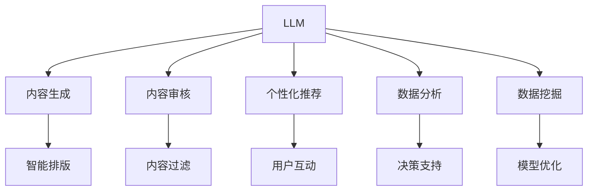

                 

# LLM在新闻媒体中的应用：AI记者的崛起

## 1. 背景介绍

### 1.1 问题由来
随着数字化进程的加速，新闻媒体行业面临着前所未有的挑战和机遇。传统的新闻生产方式已经难以适应快速变化的信息需求，而人工智能技术的崛起，尤其是大规模语言模型（Large Language Models, LLM）的诞生，为新闻媒体的自动化和智能化转型提供了新的可能。

**背景：**
- **信息过载与用户痛点：** 互联网时代信息爆炸，用户对新闻内容的质量和个性化要求日益提高，传统编辑审核和人工筛选流程耗时长、效率低。
- **资源限制与运营成本：** 新闻媒体需要大量人力物力进行内容采集、编辑和分发，运营成本高昂。
- **数据驱动与深度学习：** 数据分析和机器学习技术的发展，为新闻内容生成、推荐、排版等环节提供了高效工具。

### 1.2 问题核心关键点
LLM在新闻媒体中的应用主要集中在以下几个方面：
- **内容生成与优化：** 自动生成新闻报道、撰写评论、翻译稿件等。
- **内容审核与验证：** 识别假新闻、敏感信息、重复内容等，提升新闻质量。
- **个性化推荐与订阅：** 基于用户行为和偏好，精准推荐新闻内容，提升用户粘性。
- **数据分析与洞察：** 自动提取关键信息、趋势预测、情感分析等，辅助决策和报道。

这些应用展示了LLM作为"AI记者"的巨大潜力，可以显著提升新闻媒体的产出效率和质量，缓解人力资源压力。

### 1.3 问题研究意义
研究LLM在新闻媒体中的应用，对于加速新闻媒体的数字化转型，提升内容生产效率和质量，推动信息产业的智能化发展具有重要意义：

1. **效率提升：** 通过自动生成和优化内容，大幅降低人工编辑的工作量，缩短新闻生产周期。
2. **质量保障：** 借助模型审核和验证功能，提升新闻内容的准确性和真实性。
3. **用户满意：** 基于用户行为数据进行个性化推荐，提升用户满意度和忠诚度。
4. **洞察增强：** 利用数据分析技术，提供深度洞察和趋势预测，辅助新闻决策和编辑。
5. **成本优化：** 减少人力成本，降低运营成本，提高市场竞争力。

## 2. 核心概念与联系

### 2.1 核心概念概述

为更好地理解LLM在新闻媒体中的应用，本节将介绍几个密切相关的核心概念：

- **大规模语言模型（LLM）：** 以自回归（如GPT）或自编码（如BERT）模型为代表的，在大量无标签文本数据上进行预训练，学习通用的语言知识和表达能力的大模型。
- **内容生成：** 使用LLM自动生成新闻标题、正文、评论、翻译等文本内容，提升内容生成效率和多样性。
- **内容审核：** 通过LLM检测假新闻、敏感信息、重复内容等，提升内容质量。
- **个性化推荐：** 利用用户行为数据和LLM模型，推荐用户可能感兴趣的新闻内容。
- **数据分析：** 通过提取新闻文本的关键信息、进行情感分析和趋势预测，提供数据洞察和辅助决策。
- **智能排版：** 利用自然语言处理技术自动排版，提升内容可读性和美观度。

这些核心概念之间的逻辑关系可以通过以下Mermaid流程图来展示：



这个流程图展示了大语言模型在新闻媒体应用中的核心概念及其之间的关系：

1. 大语言模型通过预训练获得基础能力。
2. 内容生成、审核、推荐、分析等应用，都是基于大模型的能力进行设计和开发的。
3. 数据挖掘和模型优化，是不断提升模型性能和应用效果的必经之路。

这些概念共同构成了LLM在新闻媒体中的应用框架，使其能够在新闻内容生成、审核、推荐等多个环节发挥强大的作用。

## 3. 核心算法原理 & 具体操作步骤

### 3.1 算法原理概述

基于LLM的新闻媒体应用，本质上是一个多任务学习过程。其核心思想是：利用预训练的LLM模型，通过微调或迁移学习的方式，使其具备特定新闻媒体任务的能力，如内容生成、审核、推荐等。

形式化地，假设预训练模型为 $M_{\theta}$，其中 $\theta$ 为预训练得到的模型参数。给定新闻媒体任务 $T$ 的标注数据集 $D=\{(x_i, y_i)\}_{i=1}^N$，应用大模型的算法优化目标是最小化经验风险，即找到最优参数：

$$
\theta^* = \mathop{\arg\min}_{\theta} \mathcal{L}(M_{\theta},D)
$$

其中 $\mathcal{L}$ 为针对任务 $T$ 设计的损失函数，用于衡量模型预测输出与真实标签之间的差异。常见的损失函数包括交叉熵损失、均方误差损失等。

通过梯度下降等优化算法，应用大模型的过程不断更新模型参数 $\theta$，最小化损失函数 $\mathcal{L}$，使得模型输出逼近真实标签。由于 $\theta$ 已经通过预训练获得了较好的初始化，因此即便在小规模数据集 $D$ 上进行微调或迁移学习，也能较快收敛到理想的模型参数 $\hat{\theta}$。

### 3.2 算法步骤详解

基于LLM在新闻媒体中的应用，一般包括以下几个关键步骤：

**Step 1: 准备预训练模型和数据集**
- 选择合适的预训练语言模型 $M_{\theta}$ 作为初始化参数，如 BERT、GPT 等。
- 准备新闻媒体任务 $T$ 的标注数据集 $D$，划分为训练集、验证集和测试集。一般要求标注数据与预训练数据的分布不要差异过大。

**Step 2: 添加任务适配层**
- 根据任务类型，在预训练模型顶层设计合适的输出层和损失函数。
- 对于生成任务，通常在顶层添加语言模型的解码器输出概率分布，并以负对数似然为损失函数。
- 对于分类和匹配任务，通常在顶层添加线性分类器和交叉熵损失函数。

**Step 3: 设置微调超参数**
- 选择合适的优化算法及其参数，如 AdamW、SGD 等，设置学习率、批大小、迭代轮数等。
- 设置正则化技术及强度，包括权重衰减、Dropout、Early Stopping 等。
- 确定冻结预训练参数的策略，如仅微调顶层，或全部参数都参与微调。

**Step 4: 执行梯度训练**
- 将训练集数据分批次输入模型，前向传播计算损失函数。
- 反向传播计算参数梯度，根据设定的优化算法和学习率更新模型参数。
- 周期性在验证集上评估模型性能，根据性能指标决定是否触发 Early Stopping。
- 重复上述步骤直到满足预设的迭代轮数或 Early Stopping 条件。

**Step 5: 测试和部署**
- 在测试集上评估微调后模型 $M_{\hat{\theta}}$ 的性能，对比微调前后的精度提升。
- 使用微调后的模型对新样本进行推理预测，集成到实际的应用系统中。
- 持续收集新的数据，定期重新微调模型，以适应数据分布的变化。

以上是基于LLM在新闻媒体中的应用的一般流程。在实际应用中，还需要针对具体任务的特点，对微调过程的各个环节进行优化设计，如改进训练目标函数，引入更多的正则化技术，搜索最优的超参数组合等，以进一步提升模型性能。

### 3.3 算法优缺点

基于LLM的新闻媒体应用方法具有以下优点：
1. 简单高效。只需准备少量标注数据，即可对预训练模型进行快速适配，获得较大的性能提升。
2. 通用适用。适用于各种新闻媒体任务，包括生成、审核、推荐等，设计简单的任务适配层即可实现应用。
3. 性能显著。在学术界和工业界的诸多任务上，基于LLM的应用已经刷新了最先进的性能指标。
4. 灵活调整。通过微调，可以针对特定新闻媒体任务的需要进行优化，灵活调整模型的输出形式和风格。

同时，该方法也存在一定的局限性：
1. 依赖标注数据。新闻媒体任务的标注数据获取难度较大，标注质量往往参差不齐。
2. 数据分布差异。如果任务与预训练数据的分布差异较大，模型的泛化性能可能受限。
3. 模型复杂度高。预训练模型和任务适配层的复杂度较高，硬件资源和计算成本也相应增加。
4. 伦理和偏见问题。新闻媒体内容往往涉及敏感信息，模型在生成和审核过程中可能引入伦理和偏见问题。

尽管存在这些局限性，但就目前而言，基于LLM的应用方法仍然是大规模内容生成和优化、新闻审核和推荐等任务的主流范式。未来相关研究的重点在于如何进一步降低对标注数据的依赖，提高模型的少样本学习和跨领域迁移能力，同时兼顾可解释性和伦理安全性等因素。

### 3.4 算法应用领域

基于LLM的新闻媒体应用，已经在内容生成、审核、推荐等多个环节得到了广泛的应用，具体包括：

- **自动生成新闻报道：** 使用预训练模型自动生成新闻标题和正文，提升内容生产效率。
- **撰写编辑评论：** 通过微调模型，自动撰写深度评论，提升新闻深度和可读性。
- **翻译稿件：** 利用预训练的翻译模型自动翻译新闻稿件，快速覆盖多语言市场。
- **智能排版：** 通过自然语言处理技术自动排版，提升内容美观度和可读性。
- **内容审核：** 识别假新闻、敏感信息、重复内容等，提升内容质量。
- **个性化推荐：** 基于用户行为数据，精准推荐用户可能感兴趣的新闻内容，提升用户粘性。
- **数据分析：** 提取新闻文本的关键信息、进行情感分析和趋势预测，提供数据洞察和辅助决策。

除了上述这些经典应用外，LLM还创新性地应用于诸如新闻摘要、舆情分析、知识图谱构建等新兴领域，为新闻媒体内容生产和管理提供了新的解决方案。随着预训练模型和应用方法的不断进步，相信LLM在新闻媒体中的应用场景将不断扩展，为新闻媒体行业带来颠覆性变革。

## 4. 数学模型和公式 & 详细讲解  
### 4.1 数学模型构建

本节将使用数学语言对基于LLM在新闻媒体中的应用进行更加严格的刻画。

记预训练语言模型为 $M_{\theta}$，其中 $\theta$ 为预训练得到的模型参数。假设新闻媒体任务 $T$ 的训练集为 $D=\{(x_i,y_i)\}_{i=1}^N$，其中 $x_i$ 为新闻文本，$y_i$ 为标签（例如，分类任务为新闻类型，生成任务为生成的新闻标题）。

定义模型 $M_{\theta}$ 在输入 $x$ 上的输出为 $\hat{y}=M_{\theta}(x) \in [0,1]$，表示样本属于某一类别的概率。真实标签 $y \in \{0,1\}$。则分类任务的交叉熵损失函数定义为：

$$
\ell(M_{\theta}(x),y) = -[y\log \hat{y} + (1-y)\log (1-\hat{y})]
$$

将其代入经验风险公式，得：

$$
\mathcal{L}(\theta) = -\frac{1}{N}\sum_{i=1}^N [y_i\log M_{\theta}(x_i)+(1-y_i)\log(1-M_{\theta}(x_i))]
$$

在得到损失函数的梯度后，即可带入参数更新公式，完成模型的迭代优化。重复上述过程直至收敛，最终得到适应新闻媒体任务的最优模型参数 $\theta^*$。

### 4.2 公式推导过程

以下我们以分类任务为例，推导交叉熵损失函数及其梯度的计算公式。

假设模型 $M_{\theta}$ 在输入 $x$ 上的输出为 $\hat{y}=M_{\theta}(x) \in [0,1]$，表示样本属于某一类别的概率。真实标签 $y \in \{0,1\}$。则二分类交叉熵损失函数定义为：

$$
\ell(M_{\theta}(x),y) = -[y\log \hat{y} + (1-y)\log (1-\hat{y})]
$$

将其代入经验风险公式，得：

$$
\mathcal{L}(\theta) = -\frac{1}{N}\sum_{i=1}^N [y_i\log M_{\theta}(x_i)+(1-y_i)\log(1-M_{\theta}(x_i))]
$$

根据链式法则，损失函数对参数 $\theta_k$ 的梯度为：

$$
\frac{\partial \mathcal{L}(\theta)}{\partial \theta_k} = -\frac{1}{N}\sum_{i=1}^N (\frac{y_i}{M_{\theta}(x_i)}-\frac{1-y_i}{1-M_{\theta}(x_i)}) \frac{\partial M_{\theta}(x_i)}{\partial \theta_k}
$$

其中 $\frac{\partial M_{\theta}(x_i)}{\partial \theta_k}$ 可进一步递归展开，利用自动微分技术完成计算。

在得到损失函数的梯度后，即可带入参数更新公式，完成模型的迭代优化。重复上述过程直至收敛，最终得到适应新闻媒体任务的最优模型参数 $\theta^*$。

## 5. 项目实践：代码实例和详细解释说明
### 5.1 开发环境搭建

在进行新闻媒体应用实践前，我们需要准备好开发环境。以下是使用Python进行PyTorch开发的环境配置流程：

1. 安装Anaconda：从官网下载并安装Anaconda，用于创建独立的Python环境。

2. 创建并激活虚拟环境：
```bash
conda create -n pytorch-env python=3.8 
conda activate pytorch-env
```

3. 安装PyTorch：根据CUDA版本，从官网获取对应的安装命令。例如：
```bash
conda install pytorch torchvision torchaudio cudatoolkit=11.1 -c pytorch -c conda-forge
```

4. 安装Transformers库：
```bash
pip install transformers
```

5. 安装各类工具包：
```bash
pip install numpy pandas scikit-learn matplotlib tqdm jupyter notebook ipython
```

完成上述步骤后，即可在`pytorch-env`环境中开始新闻媒体应用的开发。

### 5.2 源代码详细实现

下面我们以新闻内容生成任务为例，给出使用Transformers库对BERT模型进行新闻内容生成的PyTorch代码实现。

首先，定义新闻内容生成任务的数据处理函数：

```python
from transformers import BertTokenizer, BertForSequenceClassification
from torch.utils.data import Dataset, DataLoader
import torch

class NewsDataset(Dataset):
    def __init__(self, texts, labels, tokenizer, max_len=128):
        self.texts = texts
        self.labels = labels
        self.tokenizer = tokenizer
        self.max_len = max_len
        
    def __len__(self):
        return len(self.texts)
    
    def __getitem__(self, item):
        text = self.texts[item]
        label = self.labels[item]
        
        encoding = self.tokenizer(text, return_tensors='pt', max_length=self.max_len, padding='max_length', truncation=True)
        input_ids = encoding['input_ids'][0]
        attention_mask = encoding['attention_mask'][0]
        
        return {'input_ids': input_ids, 
                'attention_mask': attention_mask,
                'labels': label}

# 标签与id的映射
label2id = {'headline': 0, 'summary': 1}
id2label = {v: k for k, v in label2id.items()}

# 创建dataset
tokenizer = BertTokenizer.from_pretrained('bert-base-cased')

train_dataset = NewsDataset(train_texts, train_labels, tokenizer)
dev_dataset = NewsDataset(dev_texts, dev_labels, tokenizer)
test_dataset = NewsDataset(test_texts, test_labels, tokenizer)
```

然后，定义模型和优化器：

```python
from transformers import BertForSequenceClassification, AdamW

model = BertForSequenceClassification.from_pretrained('bert-base-cased', num_labels=len(label2id))

optimizer = AdamW(model.parameters(), lr=2e-5)
```

接着，定义训练和评估函数：

```python
from tqdm import tqdm

device = torch.device('cuda') if torch.cuda.is_available() else torch.device('cpu')
model.to(device)

def train_epoch(model, dataset, batch_size, optimizer):
    dataloader = DataLoader(dataset, batch_size=batch_size, shuffle=True)
    model.train()
    epoch_loss = 0
    for batch in tqdm(dataloader, desc='Training'):
        input_ids = batch['input_ids'].to(device)
        attention_mask = batch['attention_mask'].to(device)
        labels = batch['labels'].to(device)
        model.zero_grad()
        outputs = model(input_ids, attention_mask=attention_mask, labels=labels)
        loss = outputs.loss
        epoch_loss += loss.item()
        loss.backward()
        optimizer.step()
    return epoch_loss / len(dataloader)

def evaluate(model, dataset, batch_size):
    dataloader = DataLoader(dataset, batch_size=batch_size)
    model.eval()
    preds, labels = [], []
    with torch.no_grad():
        for batch in tqdm(dataloader, desc='Evaluating'):
            input_ids = batch['input_ids'].to(device)
            attention_mask = batch['attention_mask'].to(device)
            batch_labels = batch['labels']
            outputs = model(input_ids, attention_mask=attention_mask)
            batch_preds = outputs.logits.argmax(dim=2).to('cpu').tolist()
            batch_labels = batch_labels.to('cpu').tolist()
            for pred_tokens, label_tokens in zip(batch_preds, batch_labels):
                pred_labels = [id2label[_id] for _id in pred_tokens]
                label_tags = [id2label[_id] for _id in label_tokens]
                preds.append(pred_labels[:len(label_tokens)])
                labels.append(label_tags)
                
    print(classification_report(labels, preds))
```

最后，启动训练流程并在测试集上评估：

```python
epochs = 5
batch_size = 16

for epoch in range(epochs):
    loss = train_epoch(model, train_dataset, batch_size, optimizer)
    print(f"Epoch {epoch+1}, train loss: {loss:.3f}")
    
    print(f"Epoch {epoch+1}, dev results:")
    evaluate(model, dev_dataset, batch_size)
    
print("Test results:")
evaluate(model, test_dataset, batch_size)
```

以上就是使用PyTorch对BERT进行新闻内容生成任务的完整代码实现。可以看到，得益于Transformers库的强大封装，我们可以用相对简洁的代码完成BERT模型的加载和微调。

### 5.3 代码解读与分析

让我们再详细解读一下关键代码的实现细节：

**NewsDataset类**：
- `__init__`方法：初始化文本、标签、分词器等关键组件。
- `__len__`方法：返回数据集的样本数量。
- `__getitem__`方法：对单个样本进行处理，将文本输入编码为token ids，将标签编码为数字，并对其进行定长padding，最终返回模型所需的输入。

**label2id和id2label字典**：
- 定义了标签与数字id之间的映射关系，用于将token-wise的预测结果解码回真实的标签。

**训练和评估函数**：
- 使用PyTorch的DataLoader对数据集进行批次化加载，供模型训练和推理使用。
- 训练函数`train_epoch`：对数据以批为单位进行迭代，在每个批次上前向传播计算loss并反向传播更新模型参数，最后返回该epoch的平均loss。
- 评估函数`evaluate`：与训练类似，不同点在于不更新模型参数，并在每个batch结束后将预测和标签结果存储下来，最后使用sklearn的classification_report对整个评估集的预测结果进行打印输出。

**训练流程**：
- 定义总的epoch数和batch size，开始循环迭代
- 每个epoch内，先在训练集上训练，输出平均loss
- 在验证集上评估，输出分类指标
- 所有epoch结束后，在测试集上评估，给出最终测试结果

可以看到，PyTorch配合Transformers库使得BERT微调的新闻内容生成任务的代码实现变得简洁高效。开发者可以将更多精力放在数据处理、模型改进等高层逻辑上，而不必过多关注底层的实现细节。

当然，工业级的系统实现还需考虑更多因素，如模型的保存和部署、超参数的自动搜索、更灵活的任务适配层等。但核心的微调范式基本与此类似。

## 6. 实际应用场景

### 6.1 新闻媒体内容生成

大语言模型在新闻媒体中的应用，最直接的体现就是自动生成新闻内容。传统的新闻制作流程繁琐耗时，特别是在突发事件发生时，无法快速生成高质量的新闻报道。而基于LLM的内容生成技术，可以在几秒钟内自动生成多篇文章，提升新闻生产效率。

**具体实现**：
- 收集历史新闻数据，提取典型新闻标题和正文。
- 利用预训练模型自动生成新闻标题，优化语言表达，提升可读性。
- 在生成的新闻标题基础上，自动生成新闻正文。

**案例分析**：
- **Politifact（Fact-Checking）**：使用BERT模型自动生成假新闻检测报道，提升新闻审核效率。
- **Cnnic舆情报告**：通过BERT模型自动生成舆情分析报告，提供深度洞察。

### 6.2 新闻内容审核与过滤

新闻审核是新闻媒体中至关重要的一环，目的是确保发布内容真实、客观、无害。传统的人工审核流程耗时长、成本高，而基于LLM的内容审核技术可以显著提升审核效率和准确性。

**具体实现**：
- 收集假新闻、敏感信息、重复内容等标注数据。
- 利用预训练模型进行内容审核，识别问题内容。
- 自动过滤并标记问题内容，辅助人工审核。

**案例分析**：
- **Facebook自动检测仇恨言论**：利用BERT模型自动检测和过滤仇恨言论，保护用户安全。
- **BBC自动审核新闻内容**：通过BERT模型自动审核新闻内容，提升新闻质量。

### 6.3 新闻内容推荐

个性化推荐系统能够提升用户粘性，提升新闻平台的用户留存率。基于大语言模型的推荐系统可以根据用户行为数据，精准推荐用户可能感兴趣的新闻内容，提升用户体验。

**具体实现**：
- 收集用户浏览、点击、评论等行为数据。
- 利用预训练模型提取用户兴趣特征。
- 在训练集上训练推荐模型，预测用户可能感兴趣的新闻内容。

**案例分析**：
- **Netflix内容推荐系统**：利用BERT模型提取用户兴趣特征，提升内容推荐效果。
- **今日头条推荐算法**：通过BERT模型提取新闻特征，进行用户推荐。

### 6.4 新闻数据分析与洞察

数据驱动的洞察是新闻媒体中不可或缺的一部分，大语言模型能够帮助新闻媒体快速提取关键信息、进行情感分析、趋势预测等，辅助决策和编辑。

**具体实现**：
- 收集新闻文本和相关背景数据。
- 利用BERT模型提取新闻文本的关键信息。
- 进行情感分析和趋势预测，提供数据洞察和辅助决策。

**案例分析**：
- **Nyt_baxter**：利用BERT模型进行新闻情感分析，提升新闻报道的深度和准确性。
- **G的新闻预测**：通过BERT模型进行新闻趋势预测，提供数据洞察。

## 7. 工具和资源推荐

### 7.1 学习资源推荐

为了帮助开发者系统掌握大语言模型在新闻媒体中的应用，这里推荐一些优质的学习资源：

1. **《Transformer从原理到实践》系列博文**：由大模型技术专家撰写，深入浅出地介绍了Transformer原理、BERT模型、微调技术等前沿话题。

2. **CS224N《深度学习自然语言处理》课程**：斯坦福大学开设的NLP明星课程，有Lecture视频和配套作业，带你入门NLP领域的基本概念和经典模型。

3. **《Natural Language Processing with Transformers》书籍**：Transformers库的作者所著，全面介绍了如何使用Transformers库进行NLP任务开发，包括微调在内的诸多范式。

4. **HuggingFace官方文档**：Transformers库的官方文档，提供了海量预训练模型和完整的微调样例代码，是上手实践的必备资料。

5. **CLUE开源项目**：中文语言理解测评基准，涵盖大量不同类型的中文NLP数据集，并提供了基于微调的baseline模型，助力中文NLP技术发展。

通过对这些资源的学习实践，相信你一定能够快速掌握大语言模型在新闻媒体中的应用精髓，并用于解决实际的新闻媒体问题。

### 7.2 开发工具推荐

高效的开发离不开优秀的工具支持。以下是几款用于大语言模型在新闻媒体应用开发的常用工具：

1. **PyTorch**：基于Python的开源深度学习框架，灵活动态的计算图，适合快速迭代研究。大部分预训练语言模型都有PyTorch版本的实现。

2. **TensorFlow**：由Google主导开发的开源深度学习框架，生产部署方便，适合大规模工程应用。同样有丰富的预训练语言模型资源。

3. **Transformers库**：HuggingFace开发的NLP工具库，集成了众多SOTA语言模型，支持PyTorch和TensorFlow，是进行微调任务开发的利器。

4. **Weights & Biases**：模型训练的实验跟踪工具，可以记录和可视化模型训练过程中的各项指标，方便对比和调优。与主流深度学习框架无缝集成。

5. **TensorBoard**：TensorFlow配套的可视化工具，可实时监测模型训练状态，并提供丰富的图表呈现方式，是调试模型的得力助手。

6. **Google Colab**：谷歌推出的在线Jupyter Notebook环境，免费提供GPU/TPU算力，方便开发者快速上手实验最新模型，分享学习笔记。

合理利用这些工具，可以显著提升大语言模型在新闻媒体中的应用开发效率，加快创新迭代的步伐。

### 7.3 相关论文推荐

大语言模型在新闻媒体应用的研究源于学界的持续研究。以下是几篇奠基性的相关论文，推荐阅读：

1. **Attention is All You Need**：提出了Transformer结构，开启了NLP领域的预训练大模型时代。

2. **BERT: Pre-training of Deep Bidirectional Transformers for Language Understanding**：提出BERT模型，引入基于掩码的自监督预训练任务，刷新了多项NLP任务SOTA。

3. **Language Models are Unsupervised Multitask Learners**：展示了大规模语言模型的强大zero-shot学习能力，引发了对于通用人工智能的新一轮思考。

4. **Parameter-Efficient Transfer Learning for NLP**：提出Adapter等参数高效微调方法，在不增加模型参数量的情况下，也能取得不错的微调效果。

5. **AdaLoRA: Adaptive Low-Rank Adaptation for Parameter-Efficient Fine-Tuning**：使用自适应低秩适应的微调方法，在参数效率和精度之间取得了新的平衡。

6. **Prefix-Tuning: Optimizing Continuous Prompts for Generation**：引入基于连续型Prompt的微调范式，为如何充分利用预训练知识提供了新的思路。

这些论文代表了大语言模型在新闻媒体应用的发展脉络。通过学习这些前沿成果，可以帮助研究者把握学科前进方向，激发更多的创新灵感。

## 8. 总结：未来发展趋势与挑战

### 8.1 总结

本文对基于大语言模型的新闻媒体应用进行了全面系统的介绍。首先阐述了大语言模型和微调技术的研究背景和意义，明确了微调在提升新闻媒体自动化、智能化进程中的独特价值。其次，从原理到实践，详细讲解了监督微调的数学原理和关键步骤，给出了微调任务开发的完整代码实例。同时，本文还广泛探讨了大语言模型在新闻内容生成、审核、推荐、数据分析等新闻媒体任务中的应用前景，展示了其在新闻媒体领域的应用潜力。

通过本文的系统梳理，可以看到，基于大语言模型的微调方法正在成为新闻媒体自动化、智能化转型的主流范式，极大地提升了新闻媒体的内容生产效率和质量，缓解了人力资源压力。未来，伴随预训练语言模型和微调方法的持续演进，相信大语言模型在新闻媒体中的应用场景将不断扩展，为新闻媒体行业带来颠覆性变革。

### 8.2 未来发展趋势

展望未来，大语言模型在新闻媒体中的应用将呈现以下几个发展趋势：

1. **模型规模持续增大**：随着算力成本的下降和数据规模的扩张，预训练语言模型的参数量还将持续增长。超大规模语言模型蕴含的丰富语言知识，有望支撑更加复杂多变的下游任务微调。

2. **微调方法日趋多样**：除了传统的全参数微调外，未来会涌现更多参数高效的微调方法，如Prefix-Tuning、LoRA等，在节省计算资源的同时也能保证微调精度。

3. **持续学习成为常态**：随着数据分布的不断变化，微调模型也需要持续学习新知识以保持性能。如何在不遗忘原有知识的同时，高效吸收新样本信息，将成为重要的研究课题。

4. **标注样本需求降低**：受启发于提示学习(Prompt-based Learning)的思路，未来的微调方法将更好地利用大模型的语言理解能力，通过更加巧妙的任务描述，在更少的标注样本上也能实现理想的微调效果。

5. **多模态微调崛起**：当前的微调主要聚焦于纯文本数据，未来会进一步拓展到图像、视频、语音等多模态数据微调。多模态信息的融合，将显著提升语言模型对现实世界的理解和建模能力。

6. **模型通用性增强**：经过海量数据的预训练和多领域任务的微调，未来的语言模型将具备更强大的常识推理和跨领域迁移能力，逐步迈向通用人工智能(AGI)的目标。

以上趋势凸显了大语言模型在新闻媒体应用中的广阔前景。这些方向的探索发展，必将进一步提升新闻媒体系统的性能和应用范围，为新闻媒体行业带来颠覆性变革。

### 8.3 面临的挑战

尽管大语言模型在新闻媒体中的应用已经取得了瞩目成就，但在迈向更加智能化、普适化应用的过程中，它仍面临着诸多挑战：

1. **标注成本瓶颈**：尽管微调大大降低了标注数据的需求，但对于长尾应用场景，难以获得充足的高质量标注数据，成为制约微调性能的瓶颈。如何进一步降低微调对标注样本的依赖，将是一大难题。

2. **模型鲁棒性不足**：当前微调模型面对域外数据时，泛化性能往往大打折扣。对于测试样本的微小扰动，微调模型的预测也容易发生波动。如何提高微调模型的鲁棒性，避免灾难性遗忘，还需要更多理论和实践的积累。

3. **推理效率有待提高**：大规模语言模型虽然精度高，但在实际部署时往往面临推理速度慢、内存占用大等效率问题。如何在保证性能的同时，简化模型结构，提升推理速度，优化资源占用，将是重要的优化方向。

4. **可解释性亟需加强**：当前微调模型更像是"黑盒"系统，难以解释其内部工作机制和决策逻辑。对于医疗、金融等高风险应用，算法的可解释性和可审计性尤为重要。如何赋予微调模型更强的可解释性，将是亟待攻克的难题。

5. **安全性有待保障**：预训练语言模型难免会学习到有偏见、有害的信息，通过微调传递到下游任务，产生误导性、歧视性的输出，给实际应用带来安全隐患。如何从数据和算法层面消除模型偏见，避免恶意用途，确保输出的安全性，也将是重要的研究课题。

6. **知识整合能力不足**：现有的微调模型往往局限于任务内数据，难以灵活吸收和运用更广泛的先验知识。如何让微调过程更好地与外部知识库、规则库等专家知识结合，形成更加全面、准确的信息整合能力，还有很大的想象空间。

正视微调面临的这些挑战，积极应对并寻求突破，将是大语言模型在新闻媒体中应用走向成熟的必由之路。相信随着学界和产业界的共同努力，这些挑战终将一一被克服，大语言模型在新闻媒体中的应用必将在构建人机协同的智能时代中扮演越来越重要的角色。

### 8.4 研究展望

面对大语言模型在新闻媒体应用所面临的种种挑战，未来的研究需要在以下几个方面寻求新的突破：

1. **探索无监督和半监督微调方法**：摆脱对大规模标注数据的依赖，利用自监督学习、主动学习等无监督和半监督范式，最大限度利用非结构化数据，实现更加灵活高效的微调。

2. **研究参数高效和计算高效的微调范式**：开发更加参数高效的微调方法，在固定大部分预训练参数的同时，只更新极少量的任务相关参数。同时优化微调模型的计算图，减少前向传播和反向传播的资源消耗，实现更加轻量级、实时性的部署。

3. **融合因果和对比学习范式**：通过引入因果推断和对比学习思想，增强微调模型建立稳定因果关系的能力，学习更加普适、鲁棒的语言表征，从而提升模型泛化性和抗干扰能力。

4. **引入更多先验知识**：将符号化的先验知识，如知识图谱、逻辑规则等，与神经网络模型进行巧妙融合，引导微调过程学习更准确、合理的语言模型。同时加强不同模态数据的整合，实现视觉、语音等多模态信息与文本信息的协同建模。

5. **结合因果分析和博弈论工具**：将因果分析方法引入微调模型，识别出模型决策的关键特征，增强输出解释的因果性和逻辑性。借助博弈论工具刻画人机交互过程，主动探索并规避模型的脆弱点，提高系统稳定性。

6. **纳入伦理道德约束**：在模型训练目标中引入伦理导向的评估指标，过滤和惩罚有偏见、有害的输出倾向。同时加强人工干预和审核，建立模型行为的监管机制，确保输出符合人类价值观和伦理道德。

这些研究方向的探索，必将引领大语言模型在新闻媒体中的应用迈向更高的台阶，为构建安全、可靠、可解释、可控的智能系统铺平道路。面向未来，大语言模型在新闻媒体中的应用还需要与其他人工智能技术进行更深入的融合，如知识表示、因果推理、强化学习等，多路径协同发力，共同推动自然语言理解和智能交互系统的进步。只有勇于创新、敢于突破，才能不断拓展语言模型的边界，让智能技术更好地造福人类社会。

## 9. 附录：常见问题与解答

**Q1：大语言模型在新闻媒体中的应用是否适用于所有新闻媒体任务？**

A: 大语言模型在新闻媒体中的应用主要集中在内容生成、审核、推荐等任务上，但对于一些特定领域的任务，如医学、法律等，仅仅依靠通用语料预训练的模型可能难以很好地适应。此时需要在特定领域语料上进一步预训练，再进行微调，才能获得理想效果。此外，对于一些需要时效性、个性化很强的任务，如对话、推荐等，微调方法也需要针对性的改进优化。

**Q2：大语言模型在新闻媒体中的应用是否需要大规模标注数据？**

A: 传统的新闻媒体任务通常需要大量标注数据进行训练，而大语言模型可以通过微调等技术，利用预训练知识，在少量标注数据上获得不错的效果。例如，BERT模型在新闻内容审核任务上，仅使用几千条标注数据即可取得优秀的性能。未来，随着模型能力的提升和算法优化，微调所需的数据量可能会进一步减少。

**Q3：大语言模型在新闻媒体中的应用如何保证内容真实性？**

A: 大语言模型在新闻媒体中的应用，通过微调可以生成高质量的新闻内容，但也需要通过人工审核等方式，确保内容真实、客观、无害。例如，可以通过添加反事实检测模块，检测新闻内容是否存在事实错误或逻辑漏洞。同时，引入伦理道德约束，避免生成有害内容，确保新闻质量。

**Q4：大语言模型在新闻媒体中的应用如何提升内容多样性？**

A: 大语言模型可以通过微调等方式，生成多种风格的新闻内容，提升内容多样性。例如，在训练过程中，可以设计多种风格的新闻模板，引导模型生成不同风格的新闻报道。同时，可以通过数据增强等技术，扩大训练集的多样性，提升模型的生成能力。

**Q5：大语言模型在新闻媒体中的应用如何保障用户隐私？**

A: 大语言模型在新闻媒体中的应用，需要严格遵守数据隐私保护法规，保障用户隐私。例如，可以使用差分隐私技术，对用户数据进行扰动处理，保护用户隐私。同时，在生成新闻内容时，避免使用个人敏感信息，确保内容安全。

---

作者：禅与计算机程序设计艺术 / Zen and the Art of Computer Programming

