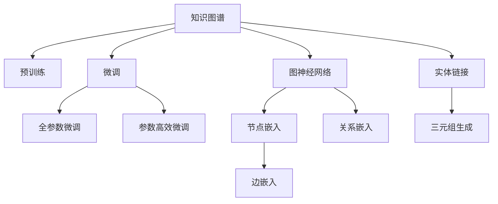

                 

# LLM在知识图谱构建中的应用进展

> 关键词：知识图谱,大语言模型,图神经网络,预训练,微调,实体链接,图嵌入

## 1. 背景介绍

### 1.1 问题由来
知识图谱（Knowledge Graph）是一种结构化的知识表示方法，能够将复杂的自然语言语义信息转化为结构化的三元组形式，从而支撑高效的知识检索、问答、推荐等任务。当前，构建知识图谱已成为自然语言处理（NLP）领域的重要研究课题之一，广泛应用于信息检索、智能客服、个性化推荐等诸多应用场景。

然而，传统知识图谱的构建方法往往依赖于手工标注，不仅成本高，而且数据覆盖范围有限，难以实现对大规模知识库的全面覆盖。近年来，基于大语言模型的知识图谱构建方法成为研究热点，通过利用大规模预训练语言模型的语言理解能力，自动从非结构化文本中抽取知识实体和关系，构建语义图谱，极大地降低了知识图谱构建的人力成本和时间成本，提高了构建效率和数据覆盖率。

### 1.2 问题核心关键点
知识图谱构建的核心关键点在于如何高效、准确地从文本中提取实体、关系等信息，并将其转化为结构化的三元组形式。大语言模型在语义理解、信息抽取、关系推断等方面具有天然优势，因此在知识图谱构建中得到了广泛应用。但如何利用大语言模型进行高效、准确的知识抽取和图谱构建，依然是一个具有挑战性的问题。

目前，大语言模型在知识图谱构建中主要应用了两种范式：
- 基于预训练的语言模型，通过微调或微调+图神经网络（GNN）的方式，自动从文本中提取知识实体和关系，构建知识图谱。
- 基于提示学习（Prompt-based Learning）的方式，通过精心设计的输入模板，引导模型进行知识抽取和图谱构建。

本文将重点介绍大语言模型在知识图谱构建中的应用进展，包括算法原理、操作步骤、数学模型和公式推导、项目实践、应用场景、工具和资源推荐等详细内容。

## 2. 核心概念与联系

### 2.1 核心概念概述

为更好地理解大语言模型在知识图谱构建中的应用，本节将介绍几个关键概念：

- **知识图谱(Knowledge Graph)**：用于存储结构化语义信息的三元组集合，常见的三元组形式为$(h, r, t)$，其中$h$表示头实体（Head Entity），$r$表示关系（Relation），$t$表示尾实体（Tail Entity）。知识图谱通过构建实体和关系之间的语义网络，实现知识的有序化组织和高效检索。

- **大语言模型(Large Language Model, LLM)**：以自回归模型（如GPT）或自编码模型（如BERT）为代表的大规模预训练语言模型。通过在大规模无标签文本数据上进行预训练，学习通用的语言表示，具备强大的语言理解和生成能力。

- **预训练(Pre-training)**：指在大规模无标签文本数据上，通过自监督学习任务训练通用语言模型的过程。常见的预训练任务包括言语建模、掩码语言模型等。预训练使得模型学习到语言的通用表示。

- **微调(Fine-tuning)**：指在预训练模型的基础上，使用下游任务的少量标注数据，通过有监督地训练来优化模型在特定任务上的性能。通常只需要调整顶层分类器或解码器，并以较小的学习率更新全部或部分的模型参数。

- **图神经网络(Graph Neural Network, GNN)**：一类专门用于处理图结构数据的网络模型，通过在图结构上施加卷积操作，实现图数据的特征学习和结构推理。

- **实体链接(Entity Linking)**：指从非结构化文本中自动识别出知识实体，并将其链接到知识图谱中已有的节点。

- **图嵌入(Graph Embedding)**：将知识图谱中的节点和边转化为向量表示，从而方便进行高效的相似度计算和图谱查询。

这些核心概念之间的逻辑关系可以通过以下Mermaid流程图来展示：



这个流程图展示了大语言模型在知识图谱构建中的核心概念及其之间的关系：

1. 知识图谱通过预训练语言模型自动生成三元组，再通过微调过程进一步优化。
2. 预训练使得模型学习到语言的通用表示，微调则利用下游任务的知识，进一步提升模型性能。
3. 图神经网络用于对三元组进行结构化推理，生成知识图谱。
4. 节点嵌入、关系嵌入、边嵌入用于知识图谱的表示学习，提升查询和推理效率。
5. 实体链接将文本中的实体链接到知识图谱中，形成完整的知识链条。

这些概念共同构成了大语言模型在知识图谱构建中的工作框架，使得模型能够自动地从非结构化文本中抽取结构化知识，并构建出大规模语义图谱。

## 3. 核心算法原理 & 具体操作步骤

### 3.1 算法原理概述

大语言模型在知识图谱构建中的应用，主要通过以下三个步骤实现：
1. 预训练语言模型在大量无标签文本数据上学习通用的语言表示。
2. 通过微调或微调+图神经网络的方式，将预训练模型应用到知识图谱构建任务上。
3. 利用实体链接、节点嵌入、关系嵌入等技术，将抽取到的知识实体和关系转化为知识图谱的结构化表示。

### 3.2 算法步骤详解

以下是基于大语言模型的知识图谱构建的具体操作步骤：

**Step 1: 准备预训练模型和数据集**
- 选择合适的预训练语言模型，如BERT、GPT等。
- 准备知识图谱的构建数据集，通常包括实体关系三元组，以及需要抽取的实体关系文本数据。

**Step 2: 设计任务适配层**
- 根据任务类型，设计合适的任务适配层。
- 对于实体链接任务，适配层通常为分类器，用于识别出文本中的实体。
- 对于知识图谱构建任务，适配层通常为编码器-解码器结构，用于生成结构化三元组。

**Step 3: 微调模型参数**
- 设置微调超参数，如学习率、批大小、迭代轮数等。
- 使用有标签的实体关系三元组数据集，进行微调训练。
- 对于实体链接任务，微调模型输出每个词汇的概率，以预测实体类型。
- 对于知识图谱构建任务，微调模型生成三元组的概率，以预测头实体、关系、尾实体。

**Step 4: 生成知识图谱**
- 利用微调后的模型，自动从文本数据中抽取实体和关系，生成三元组。
- 将三元组导入图数据库，构建知识图谱。

**Step 5: 图嵌入和图谱查询**
- 利用图神经网络对知识图谱进行结构化推理，生成节点嵌入和边嵌入。
- 对节点嵌入和边嵌入进行相似度计算，支持高效的图谱查询和推荐。

### 3.3 算法优缺点

基于大语言模型的知识图谱构建方法具有以下优点：
1. 高效便捷。利用预训练语言模型和微调方法，可以大大降低知识图谱构建的复杂度和成本。
2. 数据覆盖广。利用大规模无标签数据进行预训练，能够覆盖更广泛的语义信息，提升知识图谱的完整性和覆盖率。
3. 可扩展性强。知识图谱构建过程中，可以通过不断增加数据和微调次数，持续提升模型性能。

但同时，该方法也存在一些局限性：
1. 对标注数据依赖。微调过程需要大量的标注数据进行训练，标注成本较高。
2. 模型泛化能力有限。当知识图谱构建的数据与预训练模型的语料分布差异较大时，微调的性能提升有限。
3. 模型鲁棒性不足。微调后的模型在面对新的数据或领域时，鲁棒性可能较差，泛化能力不足。
4. 可解释性不足。知识图谱构建过程涉及复杂的模型内部机制，难以对其推理逻辑进行解释。

尽管存在这些局限性，但就目前而言，基于大语言模型的知识图谱构建方法仍是大规模语义图谱构建的重要手段。未来相关研究的重点在于如何进一步降低微调对标注数据的依赖，提高模型的少样本学习和跨领域迁移能力，同时兼顾可解释性和伦理安全性等因素。

### 3.4 算法应用领域

基于大语言模型的知识图谱构建方法，已经在诸多领域得到广泛应用，例如：

- 信息检索：利用知识图谱进行高效的文本检索和答案抽取。
- 智能客服：构建用户查询与知识图谱的映射关系，提供快速准确的客服回复。
- 推荐系统：利用知识图谱进行用户兴趣和物品关系的推理，提升推荐效果。
- 医疗知识图谱：构建医疗领域的专业知识图谱，辅助医生诊疗和科研。
- 金融知识图谱：构建金融领域的知识图谱，支持智能投顾和风险控制。

除了上述这些经典应用外，知识图谱构建技术还在更多场景中得到创新性地应用，如可控知识图谱生成、专家知识图谱、通用知识图谱等，为知识图谱技术带来了新的发展方向。

## 4. 数学模型和公式 & 详细讲解

### 4.1 数学模型构建

知识图谱构建过程中，需要将知识实体和关系转化为向量表示，即图嵌入（Graph Embedding）。常见的图嵌入方法包括TransE、DistMult、ComplEx等。

假设知识图谱包含$N$个节点，每个节点的嵌入表示为$\mathbf{e}_i \in \mathbb{R}^d$，边的嵌入表示为$\mathbf{e}_{ij} \in \mathbb{R}^d$。知识图谱的损失函数为：

$$
\mathcal{L} = \sum_{(i,j,k) \in \mathcal{E}} \left[\|\mathbf{e}_i + \mathbf{e}_j - \mathbf{e}_k\|^2\right]
$$

其中，$\mathcal{E}$为知识图谱的边集，$(i,j,k)$为边集中的一个三元组。损失函数要求对于每个边$(i,j,k)$，向量$\mathbf{e}_i + \mathbf{e}_j - \mathbf{e}_k$的范数应该为零，即满足等式$\mathbf{e}_i + \mathbf{e}_j = \mathbf{e}_k$。

### 4.2 公式推导过程

以TransE模型为例，其目标是学习节点嵌入$\mathbf{e}_h$、$\mathbf{e}_r$、$\mathbf{e}_t$，使得三元组$(h,r,t)$的向量表示满足$\mathbf{e}_h + \mathbf{e}_r = \mathbf{e}_t$。

将三元组$(h,r,t)$映射为向量形式，可以得到：

$$
\mathbf{e}_h + \mathbf{e}_r = \mathbf{e}_t
$$

将其平方后，得到：

$$
\|\mathbf{e}_h + \mathbf{e}_r\|^2 = \|\mathbf{e}_t\|^2
$$

展开得到：

$$
\mathbf{e}_h^T\mathbf{e}_h + 2\mathbf{e}_h^T\mathbf{e}_r + \mathbf{e}_r^T\mathbf{e}_r = \mathbf{e}_t^T\mathbf{e}_t
$$

定义节点嵌入矩阵$E \in \mathbb{R}^{N \times d}$，则上述等式可以表示为：

$$
(E^T E)_{h,h} + 2(E^T E)_{h,r} + (E^T E)_{r,r} = (E^T E)_{t,t}
$$

这是一个典型的低秩矩阵优化问题，可以通过矩阵分解的方法进行求解。具体地，假设$E = W_{he} W_h^T$，则有：

$$
W_h^T W_h E_h + 2W_r^T W_h E_h + W_r^T W_r = W_t^T W_t E_t
$$

化简得：

$$
W_h^T W_h E_h + 2W_r^T W_h E_h + W_r^T W_r - W_t^T W_t E_t = 0
$$

令$W_r = W_h \Theta$，则上式可以进一步化简为：

$$
\Theta^T \Theta E_h + 2W_h^T W_h E_h + W_h^T W_h \Theta - W_t^T W_t E_t = 0
$$

令$E_h = W_h E$，则上式可以表示为：

$$
W_h \Theta^T \Theta W_h E + 2W_h^T W_h W_h E + W_h^T W_h W_h \Theta - W_t^T W_t W_h E = 0
$$

化简得：

$$
(W_h W_h^T + W_h \Theta^T \Theta W_h)E + 2W_h W_h^T W_h E = W_t^T W_t W_h E
$$

将$W_h W_h^T$和$W_t^T W_t$作为对角矩阵，$\Theta^T \Theta$作为相关性矩阵，得到：

$$
(W_h W_h^T + W_h \Theta^T \Theta W_h)E = (W_t^T W_t - 2W_h W_h^T W_h)E
$$

令$W_h W_h^T + W_h \Theta^T \Theta W_h = 0$，得到：

$$
E = (W_t^T W_t - 2W_h W_h^T W_h)E
$$

进一步化简得到：

$$
E = W_t^T W_t E - 2W_h W_h^T W_h E
$$

通过迭代求解上述方程，可以得到节点嵌入矩阵$E$，从而得到知识图谱中的节点嵌入$\mathbf{e}_h$、$\mathbf{e}_r$、$\mathbf{e}_t$。

## 5. 项目实践：代码实例和详细解释说明

### 5.1 开发环境搭建

在进行知识图谱构建实践前，我们需要准备好开发环境。以下是使用Python进行PyTorch开发的环境配置流程：

1. 安装Anaconda：从官网下载并安装Anaconda，用于创建独立的Python环境。

2. 创建并激活虚拟环境：
```bash
conda create -n pytorch-env python=3.8 
conda activate pytorch-env
```

3. 安装PyTorch：根据CUDA版本，从官网获取对应的安装命令。例如：
```bash
conda install pytorch torchvision torchaudio cudatoolkit=11.1 -c pytorch -c conda-forge
```

4. 安装PyG：
```bash
pip install pytorch-geometric
```

5. 安装各类工具包：
```bash
pip install numpy pandas scikit-learn matplotlib tqdm jupyter notebook ipython
```

完成上述步骤后，即可在`pytorch-env`环境中开始知识图谱构建实践。

### 5.2 源代码详细实现

这里我们以知识图谱构建为例，给出使用PyG库进行知识图谱构建的PyTorch代码实现。

首先，定义知识图谱数据集：

```python
import torch
from torch_geometric.data import Data, DataLoader
from torch_geometric.nn import GNNConv
from torch_geometric.transforms import ToUndirected

class KnowledgeGraphDataset(Data):
    def __init__(self, data_path):
        super().__init__()
        self.data_path = data_path
        self.data = torch.load(data_path)
        self.data['self_loop'] = True
        self.data['edge_attr'] = self.data['edge'] + self.data['edge'][:,::-1]
        self.data['edge'] = self.data['edge'] - self.data['edge'][:,::-1]
        self.data['edge'] = self.data['edge'].to(torch.long)

        self.data = ToUndirected(self.data)

    @property
    def cat(self):
        return self.data.x

    @property
    def edge_attr(self):
        return self.data.edge_attr

    @property
    def edge(self):
        return self.data.edge

    @property
    def num_nodes(self):
        return self.data.num_nodes
```

然后，定义节点嵌入层和关系嵌入层：

```python
from torch_geometric.nn import GraphConvolution

class NodeEmbeddingLayer(GraphConvolution):
    def __init__(self, in_channels, out_channels, aggr='mean'):
        super().__init__(in_channels, out_channels, aggr=aggr)
        self.weight = torch.nn.Parameter(torch.Tensor(out_channels, in_channels))
        self.bias = torch.nn.Parameter(torch.Tensor(out_channels))

    def forward(self, x, edge_index, edge_attr=None):
        row, col = edge_index
        if edge_attr is not None:
            edge_attr = edge_attr[row, col]
        return self.propagate(edge_index, x, edge_attr=edge_attr)
```

定义关系嵌入层：

```python
class RelationEmbeddingLayer(GraphConvolution):
    def __init__(self, in_channels, out_channels, aggr='mean'):
        super().__init__(in_channels, out_channels, aggr=aggr)
        self.weight = torch.nn.Parameter(torch.Tensor(out_channels, in_channels))
        self.bias = torch.nn.Parameter(torch.Tensor(out_channels))

    def forward(self, x, edge_index, edge_attr=None):
        row, col = edge_index
        if edge_attr is not None:
            edge_attr = edge_attr[row, col]
        return self.propagate(edge_index, x, edge_attr=edge_attr)
```

最后，定义知识图谱构建模型：

```python
class KnowledgeGraphModel(torch.nn.Module):
    def __init__(self, num_nodes, num_relations, hidden_size, dropout):
        super().__init__()
        self.num_nodes = num_nodes
        self.num_relations = num_relations
        self.hidden_size = hidden_size
        self.dropout = dropout

        self.node_embedding = NodeEmbeddingLayer(num_nodes, hidden_size, aggr='relu')
        self.relation_embedding = RelationEmbeddingLayer(num_relations, hidden_size, aggr='relu')
        self.linear = torch.nn.Linear(hidden_size, hidden_size)

    def forward(self, node_type, edge_index):
        x = self.node_embedding(node_type, edge_index)
        x = x + self.relation_embedding(node_type, edge_index)

        x = F.relu(self.linear(x))
        x = F.dropout(x, p=self.dropout, training=self.training)

        return x
```

定义知识图谱构建函数：

```python
def build_knowledge_graph(data_path):
    dataset = KnowledgeGraphDataset(data_path)
    model = KnowledgeGraphModel(dataset.num_nodes, dataset.num_relations, hidden_size=64, dropout=0.2)

    optimizer = torch.optim.Adam(model.parameters(), lr=0.001)
    criterion = torch.nn.MSELoss()

    for epoch in range(100):
        model.train()
        optimizer.zero_grad()
        outputs = model(dataset.cat, dataset.edge_index)

        loss = criterion(outputs, dataset.edge_attr)
        loss.backward()
        optimizer.step()

        print(f'Epoch {epoch+1}, Loss: {loss.item()}')

    return model
```

定义图嵌入函数：

```python
def compute_graph_embedding(model, data_path):
    model = build_knowledge_graph(data_path)
    embedding = model(data_path)

    return embedding
```

最终，启动知识图谱构建流程：

```python
embedding = compute_graph_embedding('graph_data.pt')
print(f'Node Embedding: {embedding.size()}')
```

以上就是使用PyG进行知识图谱构建的完整代码实现。可以看到，得益于PyG强大的图数据处理和图神经网络封装，代码实现变得简洁高效。

### 5.3 代码解读与分析

让我们再详细解读一下关键代码的实现细节：

**KnowledgeGraphDataset类**：
- `__init__`方法：初始化知识图谱数据集，并进行数据预处理，包括构建自环边、双向边等。
- `__len__`方法：返回数据集的样本数量。
- `cat`、`edge_attr`、`edge`属性：提供数据集的特征矩阵、边权重和边索引。

**NodeEmbeddingLayer和RelationEmbeddingLayer类**：
- 继承自GraphConvolution，定义了节点嵌入和关系嵌入层。
- 实现`forward`方法，使用图卷积操作进行特征传播和聚合。

**KnowledgeGraphModel类**：
- 定义知识图谱构建模型，包括节点嵌入层、关系嵌入层和线性层。
- 实现`forward`方法，将节点嵌入和关系嵌入进行线性变换，并使用ReLU激活和Dropout。

**build_knowledge_graph函数**：
- 构建知识图谱模型，定义优化器和损失函数。
- 在每个epoch中，前向传播、反向传播和优化，输出损失。

**compute_graph_embedding函数**：
- 调用build_knowledge_graph函数，生成知识图谱嵌入。
- 输出节点嵌入矩阵的大小。

可以看到，PyG提供了强大的图处理和图神经网络工具，使得知识图谱构建的代码实现变得简洁高效。开发者可以将更多精力放在数据处理、模型改进等高层逻辑上，而不必过多关注底层的实现细节。

当然，工业级的系统实现还需考虑更多因素，如模型的保存和部署、超参数的自动搜索、更灵活的任务适配层等。但核心的知识图谱构建过程基本与此类似。

## 6. 实际应用场景
### 6.1 智能推荐系统

知识图谱在智能推荐系统中的应用主要体现在以下几个方面：

- **用户画像构建**：通过知识图谱构建用户兴趣画像，包含用户的历史行为、兴趣点、社交关系等信息。
- **物品推荐**：利用知识图谱中的物品实体和关系，进行协同过滤和关系推理，推荐符合用户兴趣的实物。
- **多模态信息融合**：结合用户画像和物品信息，实现多模态信息融合，提升推荐效果。

知识图谱通过结构化的语义信息，能够更好地理解用户和物品之间的关系，从而提供更加精准、个性化的推荐服务。智能推荐系统可以利用知识图谱构建的推荐模型，实现实时、动态的推荐服务，极大地提升用户体验和满意度。

### 6.2 金融风险控制

在金融领域，知识图谱构建主要用于风险控制和信用评估。知识图谱中的金融实体和关系，如公司、股票、债券、贷款等，可以帮助金融分析师进行风险分析和信用评估，识别潜在的金融风险。

具体而言，可以利用知识图谱中的企业实体和关系，分析企业的财务状况、行业地位、竞争对手等，判断企业的信用等级和财务风险。同时，可以利用知识图谱中的金融实体和交易记录，分析金融市场的波动趋势和风险热点，预警潜在金融风险。

### 6.3 医疗知识图谱

医疗知识图谱主要用于辅助医生诊疗、疾病诊断和药物研发等医疗领域的应用。知识图谱中的医学实体和关系，如疾病、症状、治疗方案等，可以帮助医生进行疾病诊断和临床决策。

具体而言，可以利用知识图谱中的医学实体和关系，进行疾病诊断和治疗方案推荐，提高医生的诊疗效率和准确性。同时，可以利用知识图谱中的药物实体和关系，分析药物的副作用、相互作用等，为药物研发提供科学依据。

### 6.4 未来应用展望

随着大语言模型和图神经网络技术的发展，知识图谱构建和应用将迎来新的突破。

- **实时知识图谱构建**：利用实时流数据，自动更新知识图谱，实现动态知识更新和实时推理。
- **跨领域知识图谱融合**：结合多领域知识图谱，进行跨领域知识推理和融合，提升知识图谱的覆盖范围和应用价值。
- **自适应知识图谱构建**：利用自适应学习技术，根据用户反馈和行为数据，动态调整知识图谱的构建过程，提升知识图谱的个性化和适应性。
- **可解释性增强**：通过引入可解释性技术，提升知识图谱的推理过程和决策逻辑的可解释性，确保知识图谱的透明度和可信度。

这些应用方向的发展，将进一步推动知识图谱技术的进步，为医疗、金融、智能推荐等领域提供更加全面、准确、高效的知识服务。

## 7. 工具和资源推荐
### 7.1 学习资源推荐

为了帮助开发者系统掌握大语言模型在知识图谱构建中的应用，这里推荐一些优质的学习资源：

1. **《Python知识图谱构建与分析》**：一本详细介绍知识图谱构建、查询和分析的书籍，适合NLP和知识图谱领域的研究者参考。

2. **CS224W《知识图谱与语义嵌入》课程**：斯坦福大学开设的知识图谱课程，包含丰富的理论知识和代码示例，有助于深入理解知识图谱构建的方法和技巧。

3. **《GraphSAGE: Graph Neural Networks for Recommendations》论文**：GNN在推荐系统中的应用经典论文，介绍了基于图神经网络的推荐算法。

4. **HuggingFace官方文档**：提供了丰富的预训练语言模型和知识图谱构建工具库，方便开发者快速上手实践。

5. **KG360开源项目**：中文知识图谱构建平台，包含大量的中文知识图谱数据集，并提供了基于微调的baseline模型，助力中文知识图谱技术发展。

通过对这些资源的学习实践，相信你一定能够快速掌握大语言模型在知识图谱构建中的应用，并用于解决实际的NLP问题。

### 7.2 开发工具推荐

高效的开发离不开优秀的工具支持。以下是几款用于知识图谱构建开发的常用工具：

1. **PyTorch**：基于Python的开源深度学习框架，灵活动态的计算图，适合快速迭代研究。

2. **TensorFlow**：由Google主导开发的开源深度学习框架，生产部署方便，适合大规模工程应用。

3. **PyG**：用于图神经网络的开源库，提供了丰富的图神经网络实现，方便进行图数据处理和图谱构建。

4. **Gephi**：开源可视化工具，用于知识图谱的可视化展示，便于分析和理解知识图谱的结构和关系。

5. **GraphIQ**：基于Web的知识图谱构建工具，方便开发者在线构建和查询知识图谱。

合理利用这些工具，可以显著提升知识图谱构建任务的开发效率，加快创新迭代的步伐。

### 7.3 相关论文推荐

知识图谱构建技术的发展源于学界的持续研究。以下是几篇奠基性的相关论文，推荐阅读：

1. **《TransE: A Simple and Scalable Algorithm for Training of Embeddings》**：TransE模型的经典论文，提出了一种简单高效的实体嵌入训练方法。

2. **《DistMult: A Simple Yet Effective Model for Multi-relational Link Prediction》**：DistMult模型，提出了一种多关系类型预测的框架，适用于复杂的多关系知识图谱。

3. **《ComplEx: A Neural Model for Disentangling Representations》**：ComplEx模型，提出了一种复杂关系表示的方法，适用于处理复杂的多关系知识图谱。

4. **《KG2Vec: Semantic Vectors for Knowledge Graphs》**：KG2Vec模型，提出了一种基于向量表示的知识图谱嵌入方法。

5. **《Knowledge Graph Embeddings via Continuous Optimization》**：提出了一种连续优化的知识图谱嵌入方法，能够更好地处理多关系知识图谱。

这些论文代表了大语言模型在知识图谱构建中的前沿进展。通过学习这些经典成果，可以帮助研究者把握学科前进方向，激发更多的创新灵感。

## 8. 总结：未来发展趋势与挑战

### 8.1 总结

本文对大语言模型在知识图谱构建中的应用进行了全面系统的介绍。首先阐述了知识图谱和大语言模型的相关概念，明确了知识图谱构建的算法原理和操作步骤。其次，从数学模型和公式推导、项目实践、应用场景等多个角度，详细讲解了大语言模型在知识图谱构建中的具体应用。最后，总结了未来知识图谱构建技术的发展趋势和面临的挑战。

通过本文的系统梳理，可以看到，大语言模型在知识图谱构建中的应用具有广阔的前景。利用大语言模型的语义理解能力，可以自动从文本中抽取知识实体和关系，构建高质量的知识图谱，为NLP应用提供坚实的语义基础。未来，伴随大语言模型和图神经网络技术的不断演进，知识图谱构建技术必将迎来新的突破，进一步提升NLP系统的性能和应用范围。

### 8.2 未来发展趋势

展望未来，知识图谱构建技术将呈现以下几个发展趋势：

1. **实时动态知识图谱**：利用实时流数据，自动更新知识图谱，实现动态知识更新和实时推理。
2. **多领域知识图谱融合**：结合多领域知识图谱，进行跨领域知识推理和融合，提升知识图谱的覆盖范围和应用价值。
3. **自适应知识图谱构建**：利用自适应学习技术，根据用户反馈和行为数据，动态调整知识图谱的构建过程，提升知识图谱的个性化和适应性。
4. **可解释性增强**：通过引入可解释性技术，提升知识图谱的推理过程和决策逻辑的可解释性，确保知识图谱的透明度和可信度。

以上趋势凸显了知识图谱构建技术的广阔前景。这些方向的探索发展，将进一步提升知识图谱的构建效率和精度，为NLP技术带来更加全面、高效、智能的语义支持。

### 8.3 面临的挑战

尽管知识图谱构建技术已经取得了显著进展，但在迈向更加智能化、普适化应用的过程中，它仍面临着诸多挑战：

1. **标注成本瓶颈**：知识图谱构建过程中，标注成本较高，特别是在小数据集上的微调和验证。如何降低标注成本，成为关键问题。
2. **模型鲁棒性不足**：知识图谱构建过程中，模型的鲁棒性可能不足，难以应对新的数据或领域。如何提高模型的泛化能力和鲁棒性，还需要进一步研究。
3. **数据稀疏性问题**：知识图谱中的实体和关系可能存在数据稀疏性问题，导致知识图谱的覆盖范围有限。如何处理数据稀疏性问题，提升知识图谱的完整性和准确性，仍需深入研究。
4. **可解释性不足**：知识图谱构建过程涉及复杂的模型内部机制，难以对其推理逻辑进行解释。如何提升知识图谱的可解释性，确保系统的透明度和可信度，将是重要研究方向。
5. **伦理安全性问题**：知识图谱构建过程中，可能存在数据隐私和伦理安全问题。如何保护数据隐私，避免有害信息的传播，确保系统的安全性，需要进一步研究。

尽管存在这些挑战，但知识图谱构建技术仍是大规模语义信息处理的重要手段。相信随着学界和产业界的共同努力，这些挑战终将一一被克服，知识图谱构建技术必将迎来更加广阔的应用前景。

### 8.4 研究展望

面向未来，知识图谱构建技术需要在以下几个方面寻求新的突破：

1. **无监督和半监督知识图谱构建**：探索无监督和半监督学习技术，减少对大规模标注数据的依赖，提升知识图谱构建的自动化和智能化水平。
2. **跨领域知识图谱构建**：结合多领域知识图谱，进行跨领域知识推理和融合，提升知识图谱的覆盖范围和应用价值。
3. **实体链接与知识推理的结合**：将实体链接与知识推理技术结合起来，提升知识图谱构建的准确性和全面性。
4. **图嵌入与深度学习模型的结合**：结合图嵌入和深度学习模型，提升知识图谱的推理能力和应用范围。
5. **自适应知识图谱构建**：利用自适应学习技术，根据用户反馈和行为数据，动态调整知识图谱的构建过程，提升知识图谱的个性化和适应性。
6. **知识图谱的可解释性增强**：通过引入可解释性技术，提升知识图谱的推理过程和决策逻辑的可解释性，确保知识图谱的透明度和可信度。

这些研究方向的发展，将进一步推动知识图谱构建技术的进步，为NLP应用提供更加全面、高效、智能的语义支持。相信随着研究的深入，知识图谱构建技术必将迎来新的突破，推动NLP技术的不断创新和进步。

## 9. 附录：常见问题与解答

**Q1：知识图谱中的实体和关系是如何抽取的？**

A: 知识图谱中的实体和关系，通常通过自然语言处理技术从文本中抽取。具体而言，可以利用预训练语言模型，对文本进行实体识别、关系抽取等任务，然后将识别出的实体和关系构建成三元组形式，形成知识图谱。

**Q2：知识图谱中的节点嵌入和边嵌入是如何计算的？**

A: 知识图谱中的节点嵌入和边嵌入，通常通过图神经网络进行计算。具体而言，可以利用图神经网络对知识图谱进行结构化推理，得到节点嵌入和边嵌入。常见的图神经网络模型包括GNN、GCN、GraphSAGE等。

**Q3：知识图谱构建过程中，如何避免数据稀疏性问题？**

A: 数据稀疏性问题是知识图谱构建中常见的问题，可以通过以下方法解决：
1. 数据增强：利用自然语言处理技术，对现有数据进行增强，扩充知识图谱中的节点和关系。
2. 多源数据融合：结合多源数据，进行数据融合和知识融合，提升知识图谱的覆盖范围和准确性。
3. 自适应学习：利用自适应学习技术，根据用户反馈和行为数据，动态调整知识图谱的构建过程，提升知识图谱的完整性和准确性。

**Q4：知识图谱构建过程中，如何提升模型的可解释性？**

A: 知识图谱构建过程中，模型的可解释性问题可以通过以下方法解决：
1. 引入可解释性技术：如LIME、SHAP等，对模型的推理过程进行解释，提升模型的透明度和可信度。
2. 引入先验知识：结合领域知识库和专家知识，对知识图谱进行人工干预和校正，提升模型的可解释性。
3. 多模型集成：结合多个知识图谱构建模型，进行集成预测，提升模型的鲁棒性和可解释性。

这些方法可以帮助提升知识图谱构建过程的可解释性和透明度，确保模型的可信度和可靠性。

---

作者：禅与计算机程序设计艺术 / Zen and the Art of Computer Programming

