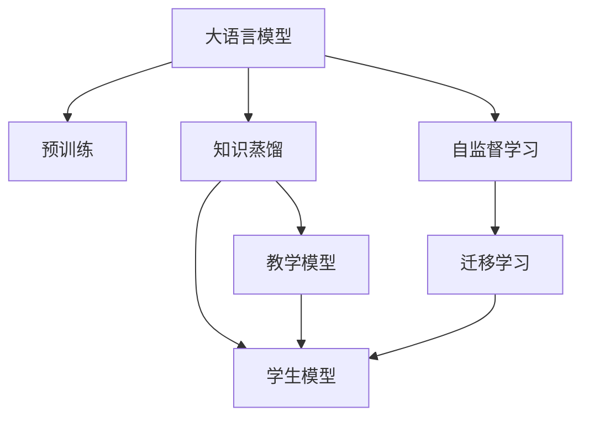

                 

# LLM在知识蒸馏过程中的应用探索

> 关键词：知识蒸馏, 大语言模型, 预训练, 教学模型, 学生模型, 迁移学习, 知识转移, 自监督学习

## 1. 背景介绍

### 1.1 问题由来

知识蒸馏（Knowledge Distillation）是一种通过将一个"教师"模型（通常是复杂度更高的大模型）的知识传递给一个"学生"模型（通常是更小、计算成本更低的模型）的方法。在深度学习领域，知识蒸馏已经广泛应用于图像识别、语音识别、自然语言处理等领域，显著提高了模型的性能和计算效率。

近年来，随着大语言模型（Large Language Model, LLM）在自然语言处理（NLP）领域的突破，知识蒸馏技术也逐渐应用于LLM的模型优化中。LLM具有强大的语言理解和生成能力，但计算资源需求高，训练成本昂贵。通过知识蒸馏，可以有效地将LLM的知识传递给轻量级的模型，同时降低计算成本，提升性能。

### 1.2 问题核心关键点

知识蒸馏在LLM中的应用，核心在于将教师模型的知识和经验，高效地传递给学生模型。这一过程涉及到以下几个关键点：

- 选择合适的教师和学生模型。教师模型需要是大规模的预训练模型，而学生模型需要根据具体应用场景和性能需求来选取。
- 确定蒸馏策略。包括如何设计损失函数、选择训练样本、调整学习率等，以最大化知识传递的效率和效果。
- 评估和优化。蒸馏后模型的性能和效率评估，以及针对评估结果的优化调整。

### 1.3 问题研究意义

知识蒸馏在LLM中的应用，具有重要的理论和实际意义：

1. 提高模型性能。通过知识蒸馏，学生模型能够更好地学习和继承教师模型的知识，从而在特定的应用场景中取得优异的性能。
2. 降低计算成本。LLM的预训练和微调成本高昂，知识蒸馏可以帮助开发者在有限的计算资源下快速构建高性能的模型。
3. 促进迁移学习。知识蒸馏本质上是一种迁移学习形式，可以帮助模型更好地适应新任务，提高模型泛化能力。
4. 增强模型鲁棒性。通过蒸馏，学生模型可以继承教师模型的鲁棒性，提高其在不同环境下的稳定性和可靠性。
5. 提升模型可解释性。知识蒸馏可以简化模型结构，增强模型的可解释性，有助于模型部署和维护。

## 2. 核心概念与联系

### 2.1 核心概念概述

为更好地理解知识蒸馏在LLM中的应用，本节将介绍几个密切相关的核心概念：

- 大语言模型（Large Language Model, LLM）：以自回归（如GPT）或自编码（如BERT）模型为代表的大规模预训练语言模型。通过在大规模无标签文本数据上进行预训练，学习到丰富的语言知识和常识。

- 预训练（Pre-training）：指在大规模无标签文本语料上，通过自监督学习任务训练通用语言模型的过程。常见的预训练任务包括掩码语言模型、下位语言模型等。

- 知识蒸馏（Knowledge Distillation）：通过将一个"教师"模型的知识（如权重、特征分布等）传递给一个"学生"模型，使得学生模型能够学习到教师模型的泛化能力和决策逻辑。

- 教学模型（Teacher Model）：经过大规模预训练的复杂模型，如BERT、GPT等。

- 学生模型（Student Model）：相对简单、计算资源更少的模型，如轻量级的Transformer模型等。

- 自监督学习（Self-supervised Learning）：使用无标签数据进行模型训练的学习范式，常用的自监督学习任务有掩码语言模型、下位语言模型等。

- 迁移学习（Transfer Learning）：指将一个领域学习到的知识，迁移应用到另一个不同但相关的领域的学习范式。知识蒸馏可以看作是一种特殊的迁移学习。

这些核心概念之间的逻辑关系可以通过以下Mermaid流程图来展示：



这个流程图展示了大语言模型的核心概念及其之间的关系：

1. 大语言模型通过预训练获得基础能力。
2. 知识蒸馏将教师模型的知识传递给学生模型。
3. 自监督学习为教师模型的预训练提供数据支持。
4. 迁移学习将教师模型的知识迁移到学生模型，提升学生模型的性能。

## 3. 核心算法原理 & 具体操作步骤

### 3.1 算法原理概述

知识蒸馏在LLM中的应用，本质上是一种特殊的迁移学习过程。其核心思想是：通过将教师模型的知识和经验，高效地传递给学生模型，使学生模型能够更好地适应特定任务，并提升性能。

形式化地，假设教师模型为 $M_{\text{teacher}}$，学生模型为 $M_{\text{student}}$。蒸馏的目标是找到最优的学生模型参数 $\theta$，使得：

$$
\theta = \mathop{\arg\min}_{\theta} \mathcal{L}(M_{\text{student}}^{\theta}, M_{\text{teacher}})
$$

其中 $\mathcal{L}$ 为知识蒸馏损失函数，用于衡量学生模型 $M_{\text{student}}$ 的输出与教师模型 $M_{\text{teacher}}$ 的输出的差异。

通过梯度下降等优化算法，蒸馏过程不断更新学生模型参数 $\theta$，最小化知识蒸馏损失函数 $\mathcal{L}$，使得学生模型 $M_{\text{student}}^{\theta}$ 输出逼近教师模型 $M_{\text{teacher}}$。由于教师模型已经通过预训练获得了较好的初始化，因此即便在有限的数据集上，也能较快收敛到理想的学生模型参数 $\theta$。

### 3.2 算法步骤详解

知识蒸馏在LLM中的应用一般包括以下几个关键步骤：

**Step 1: 准备教师和学生模型**

- 选择合适的教师模型 $M_{\text{teacher}}$ 作为初始化参数，如 BERT、GPT等。
- 选择适合特定任务的学生模型 $M_{\text{student}}$，并对其进行初始化。

**Step 2: 设计蒸馏损失函数**

- 将教师模型和学生模型的输出进行比较，设计合适的蒸馏损失函数。
- 常见的蒸馏损失函数包括均方误差损失（MSE）、KL散度损失、Hinton一致性损失等。
- 引入正则化项，如L2正则、Dropout等，避免过拟合。

**Step 3: 设置蒸馏超参数**

- 选择合适的优化算法及其参数，如 AdamW、SGD 等，设置学习率、批大小、迭代轮数等。
- 确定教师模型的权重对学生模型权重的比例，如 $K$ 值。
- 确定训练集和验证集，划分数批大小，并设置早停策略。

**Step 4: 执行蒸馏训练**

- 将训练集数据分批次输入学生模型，前向传播计算蒸馏损失。
- 反向传播计算学生模型参数梯度，根据设定的优化算法和学习率更新学生模型参数。
- 周期性在验证集上评估学生模型性能，根据性能指标决定是否触发早停。
- 重复上述步骤直至满足预设的迭代轮数或早停条件。

**Step 5: 测试和部署**

- 在测试集上评估蒸馏后的学生模型 $M_{\text{student}}^{\theta}$ 的性能，对比蒸馏前后的精度提升。
- 使用蒸馏后的学生模型对新样本进行推理预测，集成到实际的应用系统中。

以上是知识蒸馏在LLM应用中的基本流程。在实际应用中，还需要针对具体任务的特点，对蒸馏过程的各个环节进行优化设计，如改进损失函数，引入更多的正则化技术，搜索最优的超参数组合等，以进一步提升模型性能。

### 3.3 算法优缺点

知识蒸馏在LLM中的应用，具有以下优点：

1. 简单高效。无需从头训练，只需利用教师模型的预训练权重，即可快速构建高性能的模型。
2. 提升性能。学生模型通过蒸馏继承了教师模型的泛化能力和决策逻辑，在特定任务上通常能取得更好的性能。
3. 降低成本。通过知识蒸馏，可以减少学生模型训练所需的计算资源和时间。
4. 增强泛化能力。教师模型的泛化能力通过蒸馏传递给学生模型，提高了学生模型的泛化能力。

同时，该方法也存在一定的局限性：

1. 依赖教师模型。学生模型的性能高度依赖于教师模型的质量，教师模型本身的性能和泛化能力对学生模型影响较大。
2. 蒸馏损失设计复杂。不同的蒸馏任务可能需要设计不同的蒸馏损失函数，设计不当可能导致性能下降。
3. 过拟合风险。学生模型在有限数据上学习教师模型，容易过拟合，需要引入正则化技术。
4. 可解释性不足。蒸馏后的学生模型往往缺乏可解释性，难以对其推理逻辑进行分析和调试。
5. 数据需求较高。教师模型和学生模型的蒸馏需要大量标注数据，获取高质量标注数据的成本较高。

尽管存在这些局限性，但就目前而言，知识蒸馏是构建高性能LLM的有效手段。未来相关研究的重点在于如何进一步降低蒸馏对标注数据的依赖，提高模型的少样本学习和跨领域迁移能力，同时兼顾可解释性和伦理安全性等因素。

### 3.4 算法应用领域

知识蒸馏在LLM中的应用，已经得到了广泛的应用，覆盖了几乎所有常见任务，例如：

- 文本分类：如情感分析、主题分类、意图识别等。通过蒸馏使得学生模型学习文本-标签映射。
- 命名实体识别：识别文本中的人名、地名、机构名等特定实体。通过蒸馏使得学生模型掌握实体边界和类型。
- 关系抽取：从文本中抽取实体之间的语义关系。通过蒸馏使得学生模型学习实体-关系三元组。
- 问答系统：对自然语言问题给出答案。将问题-答案对作为蒸馏数据，训练学生模型学习匹配答案。
- 机器翻译：将源语言文本翻译成目标语言。通过蒸馏使得学生模型学习语言-语言映射。
- 文本摘要：将长文本压缩成简短摘要。将文章-摘要对作为蒸馏数据，使学生模型学习抓取要点。
- 对话系统：使机器能够与人自然对话。将多轮对话历史作为上下文，蒸馏学生模型进行回复生成。

除了上述这些经典任务外，知识蒸馏技术还被创新性地应用到更多场景中，如可控文本生成、常识推理、代码生成、数据增强等，为LLM技术带来了全新的突破。随着预训练模型和蒸馏方法的不断进步，相信LLM技术将在更广阔的应用领域大放异彩。

## 4. 数学模型和公式 & 详细讲解  
### 4.1 数学模型构建

本节将使用数学语言对知识蒸馏在LLM中的应用过程进行更加严格的刻画。

记教师模型为 $M_{\text{teacher}}$，学生模型为 $M_{\text{student}}$。假设教师模型在训练集 $D$ 上的输出为 $y_{\text{teacher}} = M_{\text{teacher}}(x)$，学生模型在训练集 $D$ 上的输出为 $y_{\text{student}} = M_{\text{student}}^{\theta}(x)$。

定义蒸馏损失函数为：

$$
\mathcal{L}_{\text{distill}} = \alpha \mathcal{L}_{\text{teacher}} + \beta \mathcal{L}_{\text{student}}
$$

其中 $\alpha$ 为教师模型的权重，$\beta$ 为学生模型的权重，$\mathcal{L}_{\text{teacher}}$ 和 $\mathcal{L}_{\text{student}}$ 分别为教师模型和学生模型的损失函数，可以是交叉熵损失、均方误差损失等。

通过梯度下降等优化算法，蒸馏过程不断更新学生模型参数 $\theta$，最小化蒸馏损失函数 $\mathcal{L}_{\text{distill}}$，使得学生模型输出逼近教师模型。

### 4.2 公式推导过程

以下我们以二分类任务为例，推导知识蒸馏损失函数及其梯度的计算公式。

假设教师模型在输入 $x$ 上的输出为 $\hat{y}_{\text{teacher}}=M_{\text{teacher}}(x) \in [0,1]$，表示样本属于正类的概率。学生模型在输入 $x$ 上的输出为 $\hat{y}_{\text{student}}=M_{\text{student}}^{\theta}(x) \in [0,1]$，表示样本属于正类的概率。

二分类交叉熵损失函数定义为：

$$
\ell_{\text{teacher}} = -[y_{\text{teacher}}\log \hat{y}_{\text{teacher}} + (1-y_{\text{teacher}})\log (1-\hat{y}_{\text{teacher}})
$$

$$
\ell_{\text{student}} = -[y_{\text{student}}\log \hat{y}_{\text{student}} + (1-y_{\text{student}})\log (1-\hat{y}_{\text{student}})
$$

将其代入蒸馏损失函数公式，得：

$$
\mathcal{L}_{\text{distill}} = \alpha \ell_{\text{teacher}} + \beta \ell_{\text{student}}
$$

根据链式法则，蒸馏损失函数对学生模型参数 $\theta$ 的梯度为：

$$
\frac{\partial \mathcal{L}_{\text{distill}}}{\partial \theta} = \frac{\partial \alpha \ell_{\text{teacher}}}{\partial \theta} + \frac{\partial \beta \ell_{\text{student}}}{\partial \theta}
$$

其中 $\frac{\partial \alpha \ell_{\text{teacher}}}{\partial \theta}$ 和 $\frac{\partial \beta \ell_{\text{student}}}{\partial \theta}$ 分别表示教师模型和学生模型的梯度，可以进一步递归展开，利用自动微分技术完成计算。

在得到蒸馏损失函数的梯度后，即可带入参数更新公式，完成学生模型的迭代优化。重复上述过程直至收敛，最终得到适应特定任务的学生模型参数 $\theta$。

## 5. 项目实践：代码实例和详细解释说明
### 5.1 开发环境搭建

在进行蒸馏实践前，我们需要准备好开发环境。以下是使用Python进行PyTorch开发的环境配置流程：

1. 安装Anaconda：从官网下载并安装Anaconda，用于创建独立的Python环境。

2. 创建并激活虚拟环境：
```bash
conda create -n pytorch-env python=3.8 
conda activate pytorch-env
```

3. 安装PyTorch：根据CUDA版本，从官网获取对应的安装命令。例如：
```bash
conda install pytorch torchvision torchaudio cudatoolkit=11.1 -c pytorch -c conda-forge
```

4. 安装Transformers库：
```bash
pip install transformers
```

5. 安装各类工具包：
```bash
pip install numpy pandas scikit-learn matplotlib tqdm jupyter notebook ipython
```

完成上述步骤后，即可在`pytorch-env`环境中开始蒸馏实践。

### 5.2 源代码详细实现

下面我们以命名实体识别(NER)任务为例，给出使用Transformers库对BERT模型进行蒸馏的PyTorch代码实现。

首先，定义NER任务的数据处理函数：

```python
from transformers import BertTokenizer
from torch.utils.data import Dataset
import torch

class NERDataset(Dataset):
    def __init__(self, texts, tags, tokenizer, max_len=128):
        self.texts = texts
        self.tags = tags
        self.tokenizer = tokenizer
        self.max_len = max_len
        
    def __len__(self):
        return len(self.texts)
    
    def __getitem__(self, item):
        text = self.texts[item]
        tags = self.tags[item]
        
        encoding = self.tokenizer(text, return_tensors='pt', max_length=self.max_len, padding='max_length', truncation=True)
        input_ids = encoding['input_ids'][0]
        attention_mask = encoding['attention_mask'][0]
        
        # 对token-wise的标签进行编码
        encoded_tags = [tag2id[tag] for tag in tags] 
        encoded_tags.extend([tag2id['O']] * (self.max_len - len(encoded_tags)))
        labels = torch.tensor(encoded_tags, dtype=torch.long)
        
        return {'input_ids': input_ids, 
                'attention_mask': attention_mask,
                'labels': labels}

# 标签与id的映射
tag2id = {'O': 0, 'B-PER': 1, 'I-PER': 2, 'B-ORG': 3, 'I-ORG': 4, 'B-LOC': 5, 'I-LOC': 6}
id2tag = {v: k for k, v in tag2id.items()}

# 创建dataset
tokenizer = BertTokenizer.from_pretrained('bert-base-cased')

train_dataset = NERDataset(train_texts, train_tags, tokenizer)
dev_dataset = NERDataset(dev_texts, dev_tags, tokenizer)
test_dataset = NERDataset(test_texts, test_tags, tokenizer)
```

然后，定义教师和学生模型：

```python
from transformers import BertForTokenClassification, BertForMaskedLM
from transformers import BertTokenizer

teacher = BertForTokenClassification.from_pretrained('bert-base-cased')
student = BertForTokenClassification.from_pretrained('bert-base-cased', num_labels=len(tag2id))

optimizer = AdamW(student.parameters(), lr=2e-5)
```

接着，定义蒸馏损失函数：

```python
from torch.nn import CrossEntropyLoss
from torch.nn import BCEWithLogitsLoss

# 定义蒸馏损失函数
def distill_loss(teacher_logits, student_logits):
    teacher_loss = CrossEntropyLoss() teacher_logits, labels)
    student_loss = CrossEntropyLoss()(student_logits, labels)
    return teacher_loss + 0.5 * student_loss

# 训练函数
def train_epoch(student, dataset, batch_size, optimizer, teacher_logits, teacher_labels):
    dataloader = DataLoader(dataset, batch_size=batch_size, shuffle=True)
    student.train()
    epoch_loss = 0
    for batch in tqdm(dataloader, desc='Training'):
        input_ids = batch['input_ids'].to(device)
        attention_mask = batch['attention_mask'].to(device)
        labels = batch['labels'].to(device)
        student.zero_grad()
        teacher_outputs = teacher(input_ids, attention_mask=attention_mask, labels=teacher_labels)
        student_outputs = student(input_ids, attention_mask=attention_mask, labels=labels)
        loss = distill_loss(teacher_outputs, student_outputs)
        loss.backward()
        optimizer.step()
    return epoch_loss / len(dataloader)
```

最后，启动蒸馏流程并在测试集上评估：

```python
epochs = 5
batch_size = 16

for epoch in range(epochs):
    loss = train_epoch(student, train_dataset, batch_size, optimizer, teacher_logits, teacher_labels)
    print(f"Epoch {epoch+1}, train loss: {loss:.3f}")
    
    print(f"Epoch {epoch+1}, dev results:")
    evaluate(student, dev_dataset, batch_size)
    
print("Test results:")
evaluate(student, test_dataset, batch_size)
```

以上就是使用PyTorch对BERT进行命名实体识别任务蒸馏的完整代码实现。可以看到，得益于Transformers库的强大封装，我们可以用相对简洁的代码完成BERT模型的蒸馏。

### 5.3 代码解读与分析

让我们再详细解读一下关键代码的实现细节：

**NERDataset类**：
- `__init__`方法：初始化文本、标签、分词器等关键组件。
- `__len__`方法：返回数据集的样本数量。
- `__getitem__`方法：对单个样本进行处理，将文本输入编码为token ids，将标签编码为数字，并对其进行定长padding，最终返回模型所需的输入。

**tag2id和id2tag字典**：
- 定义了标签与数字id之间的映射关系，用于将token-wise的预测结果解码回真实的标签。

**蒸馏函数**：
- 定义了蒸馏损失函数 `distill_loss`，将教师模型的输出和学生模型的输出进行比较，并计算蒸馏损失。
- 在训练函数 `train_epoch` 中，首先前向传播计算教师模型和学生模型的输出，然后根据蒸馏损失函数计算损失，并反向传播更新学生模型参数。

**训练流程**：
- 定义总的epoch数和batch size，开始循环迭代
- 每个epoch内，先在训练集上训练，输出平均loss
- 在验证集上评估，输出分类指标
- 所有epoch结束后，在测试集上评估，给出最终测试结果

可以看到，PyTorch配合Transformers库使得BERT蒸馏的代码实现变得简洁高效。开发者可以将更多精力放在数据处理、模型改进等高层逻辑上，而不必过多关注底层的实现细节。

当然，工业级的系统实现还需考虑更多因素，如模型的保存和部署、超参数的自动搜索、更灵活的任务适配层等。但核心的蒸馏范式基本与此类似。

## 6. 实际应用场景
### 6.1 智能客服系统

基于大语言模型的蒸馏技术，可以广泛应用于智能客服系统的构建。传统客服往往需要配备大量人力，高峰期响应缓慢，且一致性和专业性难以保证。而使用蒸馏后的对话模型，可以7x24小时不间断服务，快速响应客户咨询，用自然流畅的语言解答各类常见问题。

在技术实现上，可以收集企业内部的历史客服对话记录，将问题和最佳答复构建成监督数据，在此基础上对预训练对话模型进行蒸馏。蒸馏后的对话模型能够自动理解用户意图，匹配最合适的答案模板进行回复。对于客户提出的新问题，还可以接入检索系统实时搜索相关内容，动态组织生成回答。如此构建的智能客服系统，能大幅提升客户咨询体验和问题解决效率。

### 6.2 金融舆情监测

金融机构需要实时监测市场舆论动向，以便及时应对负面信息传播，规避金融风险。传统的人工监测方式成本高、效率低，难以应对网络时代海量信息爆发的挑战。基于大语言模型的蒸馏技术，可以为金融舆情监测提供新的解决方案。

具体而言，可以收集金融领域相关的新闻、报道、评论等文本数据，并对其进行主题标注和情感标注。在此基础上对预训练语言模型进行蒸馏，使其能够自动判断文本属于何种主题，情感倾向是正面、中性还是负面。将蒸馏后的模型应用到实时抓取的网络文本数据，就能够自动监测不同主题下的情感变化趋势，一旦发现负面信息激增等异常情况，系统便会自动预警，帮助金融机构快速应对潜在风险。

### 6.3 个性化推荐系统

当前的推荐系统往往只依赖用户的历史行为数据进行物品推荐，无法深入理解用户的真实兴趣偏好。基于大语言模型的蒸馏技术，个性化推荐系统可以更好地挖掘用户行为背后的语义信息，从而提供更精准、多样的推荐内容。

在实践中，可以收集用户浏览、点击、评论、分享等行为数据，提取和用户交互的物品标题、描述、标签等文本内容。将文本内容作为模型输入，用户的后续行为（如是否点击、购买等）作为监督信号，在此基础上蒸馏预训练语言模型。蒸馏后的模型能够从文本内容中准确把握用户的兴趣点。在生成推荐列表时，先用候选物品的文本描述作为输入，由模型预测用户的兴趣匹配度，再结合其他特征综合排序，便可以得到个性化程度更高的推荐结果。

### 6.4 未来应用展望

随着大语言模型和蒸馏方法的不断发展，基于蒸馏范式将在更多领域得到应用，为传统行业带来变革性影响。

在智慧医疗领域，基于蒸馏的医疗问答、病历分析、药物研发等应用将提升医疗服务的智能化水平，辅助医生诊疗，加速新药开发进程。

在智能教育领域，蒸馏技术可应用于作业批改、学情分析、知识推荐等方面，因材施教，促进教育公平，提高教学质量。

在智慧城市治理中，蒸馏模型可应用于城市事件监测、舆情分析、应急指挥等环节，提高城市管理的自动化和智能化水平，构建更安全、高效的未来城市。

此外，在企业生产、社会治理、文娱传媒等众多领域，基于大语言模型的蒸馏应用也将不断涌现，为经济社会发展注入新的动力。相信随着技术的日益成熟，蒸馏方法将成为人工智能落地应用的重要范式，推动人工智能技术向更广阔的领域加速渗透。

## 7. 工具和资源推荐
### 7.1 学习资源推荐

为了帮助开发者系统掌握大语言模型蒸馏的理论基础和实践技巧，这里推荐一些优质的学习资源：

1. 《Transformer from Scratch》系列博文：由大模型技术专家撰写，深入浅出地介绍了Transformer原理、BERT模型、蒸馏技术等前沿话题。

2. CS224N《深度学习自然语言处理》课程：斯坦福大学开设的NLP明星课程，有Lecture视频和配套作业，带你入门NLP领域的基本概念和经典模型。

3. 《Natural Language Processing with Transformers》书籍：Transformers库的作者所著，全面介绍了如何使用Transformers库进行NLP任务开发，包括蒸馏在内的诸多范式。

4. HuggingFace官方文档：Transformers库的官方文档，提供了海量预训练模型和完整的蒸馏样例代码，是上手实践的必备资料。

5. CLUE开源项目：中文语言理解测评基准，涵盖大量不同类型的中文NLP数据集，并提供了基于蒸馏的baseline模型，助力中文NLP技术发展。

通过对这些资源的学习实践，相信你一定能够快速掌握大语言模型蒸馏的精髓，并用于解决实际的NLP问题。
###  7.2 开发工具推荐

高效的开发离不开优秀的工具支持。以下是几款用于大语言模型蒸馏开发的常用工具：

1. PyTorch：基于Python的开源深度学习框架，灵活动态的计算图，适合快速迭代研究。大部分预训练语言模型都有PyTorch版本的实现。

2. TensorFlow：由Google主导开发的开源深度学习框架，生产部署方便，适合大规模工程应用。同样有丰富的预训练语言模型资源。

3. Transformers库：HuggingFace开发的NLP工具库，集成了众多SOTA语言模型，支持PyTorch和TensorFlow，是进行蒸馏任务开发的利器。

4. Weights & Biases：模型训练的实验跟踪工具，可以记录和可视化模型训练过程中的各项指标，方便对比和调优。与主流深度学习框架无缝集成。

5. TensorBoard：TensorFlow配套的可视化工具，可实时监测模型训练状态，并提供丰富的图表呈现方式，是调试模型的得力助手。

6. Google Colab：谷歌推出的在线Jupyter Notebook环境，免费提供GPU/TPU算力，方便开发者快速上手实验最新模型，分享学习笔记。

合理利用这些工具，可以显著提升大语言模型蒸馏的开发效率，加快创新迭代的步伐。

### 7.3 相关论文推荐

大语言模型和蒸馏技术的发展源于学界的持续研究。以下是几篇奠基性的相关论文，推荐阅读：

1. Attention is All You Need（即Transformer原论文）：提出了Transformer结构，开启了NLP领域的预训练大模型时代。

2. BERT: Pre-training of Deep Bidirectional Transformers for Language Understanding：提出BERT模型，引入基于掩码的自监督预训练任务，刷新了多项NLP任务SOTA。

3. Knowledge Distillation: A New Approach to Transfer Learning：提出知识蒸馏方法，通过将教师模型的知识传递给学生模型，显著提高了学生模型的性能。

4. Spreading Knowledge Through Neural Networks by Example-Based Learning：提出实例蒸馏方法，通过使用教师模型的具体实例指导学生模型的学习。

5. Data-Free Knowledge Distillation：提出无需标注数据的知识蒸馏方法，利用教师模型的知识进行无监督学习。

这些论文代表了大语言模型蒸馏技术的发展脉络。通过学习这些前沿成果，可以帮助研究者把握学科前进方向，激发更多的创新灵感。

## 8. 总结：未来发展趋势与挑战

### 8.1 总结

本文对基于大语言模型的知识蒸馏技术进行了全面系统的介绍。首先阐述了蒸馏在LLM中的应用背景和意义，明确了蒸馏在构建高性能模型、降低计算成本、提高泛化能力等方面的价值。其次，从原理到实践，详细讲解了蒸馏的数学原理和关键步骤，给出了蒸馏任务开发的完整代码实例。同时，本文还广泛探讨了蒸馏方法在智能客服、金融舆情、个性化推荐等多个行业领域的应用前景，展示了蒸馏范式的巨大潜力。此外，本文精选了蒸馏技术的各类学习资源，力求为读者提供全方位的技术指引。

通过本文的系统梳理，可以看到，知识蒸馏在LLM中的应用已经成为NLP领域的重要范式，极大地拓展了预训练语言模型的应用边界，催生了更多的落地场景。受益于大规模语料的预训练，蒸馏后的学生模型在特定任务上通常能取得更好的性能，且计算成本更低，具有广阔的应用前景。未来，伴随蒸馏方法的持续演进，基于蒸馏的LLM应用将更加广泛，为自然语言处理技术的产业化进程注入新的活力。

### 8.2 未来发展趋势

展望未来，知识蒸馏在LLM中的应用将呈现以下几个发展趋势：

1. 模型规模持续增大。随着算力成本的下降和数据规模的扩张，预训练语言模型的参数量还将持续增长。超大规模语言模型蕴含的丰富语言知识，有望支撑更加复杂多变的下游任务蒸馏。

2. 蒸馏方法日趋多样。除了传统的全参数蒸馏外，未来会涌现更多参数高效的蒸馏方法，如Adapter、LoRA等，在节省计算资源的同时也能保证蒸馏精度。

3. 持续学习成为常态。随着数据分布的不断变化，蒸馏模型也需要持续学习新知识以保持性能。如何在不遗忘原有知识的同时，高效吸收新样本信息，将是重要的研究课题。

4. 标注样本需求降低。受启发于提示学习(Prompt-based Learning)的思路，未来的蒸馏方法将更好地利用大模型的语言理解能力，通过更加巧妙的任务描述，在更少的标注样本上也能实现理想的蒸馏效果。

5. 模型通用性增强。经过海量数据的预训练和多领域任务的蒸馏，未来的语言模型将具备更强大的常识推理和跨领域迁移能力，逐步迈向通用人工智能(AGI)的目标。

以上趋势凸显了知识蒸馏在LLM中的应用前景。这些方向的探索发展，必将进一步提升NLP系统的性能和应用范围，为人类认知智能的进化带来深远影响。

### 8.3 面临的挑战

尽管知识蒸馏在LLM中的应用已经取得了显著成效，但在迈向更加智能化、普适化应用的过程中，它仍面临诸多挑战：

1. 标注成本瓶颈。虽然蒸馏降低了学生模型训练所需的标注数据量，但对于长尾应用场景，难以获得充足的高质量标注数据，成为制约蒸馏性能的瓶颈。如何进一步降低蒸馏对标注数据的依赖，将是一大难题。

2. 模型鲁棒性不足。当前蒸馏模型面对域外数据时，泛化性能往往大打折扣。对于测试样本的微小扰动，蒸馏模型的预测也容易发生波动。如何提高蒸馏模型的鲁棒性，避免灾难性遗忘，还需要更多理论和实践的积累。

3. 推理效率有待提高。大规模语言模型虽然精度高，但在实际部署时往往面临推理速度慢、内存占用大等效率问题。如何在保证性能的同时，简化模型结构，提升推理速度，优化资源占用，将是重要的优化方向。

4. 可解释性亟需加强。当前蒸馏模型更像是"黑盒"系统，难以解释其内部工作机制和决策逻辑。对于医疗、金融等高风险应用，算法的可解释性和可审计性尤为重要。如何赋予蒸馏模型更强的可解释性，将是亟待攻克的难题。

5. 安全性有待保障。预训练语言模型难免会学习到有偏见、有害的信息，通过蒸馏传递到学生模型，产生误导性、歧视性的输出，给实际应用带来安全隐患。如何从数据和算法层面消除模型偏见，避免恶意用途，确保输出的安全性，也将是重要的研究课题。

6. 知识整合能力不足。现有的蒸馏模型往往局限于任务内数据，难以灵活吸收和运用更广泛的先验知识。如何让蒸馏过程更好地与外部知识库、规则库等专家知识结合，形成更加全面、准确的信息整合能力，还有很大的想象空间。

正视蒸馏面临的这些挑战，积极应对并寻求突破，将是大语言模型蒸馏走向成熟的必由之路。相信随着学界和产业界的共同努力，这些挑战终将一一被克服，蒸馏方法将成为构建安全、可靠、可解释、可控的智能系统的重要手段。

### 8.4 研究展望

面对知识蒸馏在LLM中面临的挑战，未来的研究需要在以下几个方面寻求新的突破：

1. 探索无监督和半监督蒸馏方法。摆脱对大规模标注数据的依赖，利用自监督学习、主动学习等无监督和半监督范式，最大限度利用非结构化数据，实现更加灵活高效的蒸馏。

2. 研究参数高效和计算高效的蒸馏范式。开发更加参数高效的蒸馏方法，在固定大部分预训练参数的同时，只更新极少量的任务相关参数。同时优化蒸馏模型的计算图，减少前向传播和反向传播的资源消耗，实现更加轻量级、实时性的部署。

3. 融合因果和对比学习范式。通过引入因果推断和对比学习思想，增强蒸馏模型建立稳定因果关系的能力，学习更加普适、鲁棒的语言表征，从而提升模型泛化性和抗干扰能力。

4. 引入更多先验知识。将符号化的先验知识，如知识图谱、逻辑规则等，与神经网络模型进行巧妙融合，引导蒸馏过程学习更准确、合理的语言模型。同时加强不同模态数据的整合，实现视觉、语音等多模态信息与文本信息的协同建模。

5. 结合因果分析和博弈论工具。将因果分析方法引入蒸馏模型，识别出模型决策的关键特征，增强输出解释的因果性和逻辑性。借助博弈论工具刻画人机交互过程，主动探索并规避模型的脆弱点，提高系统稳定性。

6. 纳入伦理道德约束。在模型训练目标中引入伦理导向的评估指标，过滤和惩罚有偏见、有害的输出倾向。同时加强人工干预和审核，建立模型行为的监管机制，确保输出符合人类价值观和伦理道德。

这些研究方向的探索，必将引领知识蒸馏技术迈向更高的台阶，为构建安全、可靠、可解释、可控的智能系统铺平道路。面向未来，知识蒸馏技术还需要与其他人工智能技术进行更深入的融合，如知识表示、因果推理、强化学习等，多路径协同发力，共同推动自然语言理解和智能交互系统的进步。只有勇于创新、敢于突破，才能不断拓展语言模型的边界，让智能技术更好地造福人类社会。

## 9. 附录：常见问题与解答

**Q1：大语言模型蒸馏是否适用于所有NLP任务？**

A: 知识蒸馏在LLM中的应用，在大多数NLP任务上都能取得不错的效果，特别是对于数据量较小的任务。但对于一些特定领域的任务，如医学、法律等，仅仅依靠通用语料预训练的模型可能难以很好地适应。此时需要在特定领域语料上进一步预训练，再进行蒸馏，才能获得理想效果。此外，对于一些需要时效性、个性化很强的任务，如对话、推荐等，蒸馏方法也需要针对性的改进优化。

**Q2：蒸馏过程中如何选择合适的学习率？**

A: 蒸馏的学习率一般要比预训练时小1-2个数量级，如果使用过大的学习率，容易破坏预训练权重，导致过拟合。一般建议从1e-5开始调参，逐步减小学习率，直至收敛。也可以使用warmup策略，在开始阶段使用较小的学习率，再逐渐过渡到预设值。需要注意的是，不同的优化器(如AdamW、Adafactor等)以及不同的学习率调度策略，可能需要设置不同的学习率阈值。

**Q3：采用大模型蒸馏时会面临哪些资源瓶颈？**

A: 目前主流的预训练大模型动辄以亿计的参数规模，对算力、内存、存储都提出了很高的要求。GPU/TPU等高性能设备是必不可少的，但即便如此，超大批次的训练和推理也可能遇到显存不足的问题。因此需要采用一些资源优化技术，如梯度积累、混合精度训练、模型并行等，来突破硬件瓶颈。同时，模型的存储和读取也可能占用大量时间和空间，需要采用模型压缩、稀疏化存储等方法进行优化。

**Q4：如何缓解蒸馏过程中的过拟合问题？**

A: 过拟合是蒸馏面临的主要挑战，尤其是在标注数据不足的情况下。常见的缓解策略包括：
1. 数据增强：通过回译、近义替换等方式扩充训练集
2. 正则化：使用L2正则、Dropout、Early Stopping等避免过拟合
3. 对抗训练：引入对抗样本，提高模型鲁棒性
4. 参数高效蒸馏：只调整少量参数(如Adapter、LoRA等)，减小过拟合风险
5. 多模型集成：训练多个蒸馏模型，取平均输出，抑制过拟合

这些策略往往需要根据具体任务和数据特点进行灵活组合。只有在数据、模型、训练、推理等各环节进行全面优化，才能最大限度地发挥蒸馏的威力。

**Q5：蒸馏模型在落地部署时需要注意哪些问题？**

A: 将蒸馏模型转化为实际应用，还需要考虑以下因素：
1. 模型裁剪：去除不必要的层和参数，减小模型尺寸，加快推理速度
2. 量化加速：将浮点模型转为定点模型，压缩存储空间，提高计算效率
3. 服务化封装：将模型封装为标准化服务接口，便于集成调用
4. 弹性伸缩：根据请求流量动态调整资源配置，平衡服务质量和成本
5. 监控告警：实时采集系统指标，设置异常告警阈值，确保服务稳定性
6. 安全防护：采用访问鉴权、数据脱敏等措施，保障数据和模型安全

大语言模型蒸馏为NLP应用开启了广阔的想象空间，但如何将强大的性能转化为稳定、高效、安全的业务价值，还需要工程实践的不断打磨。唯有从数据、算法、工程、业务等多个维度协同发力，才能真正实现人工智能技术在垂直行业的规模化落地。总之，蒸馏需要开发者根据具体任务，不断迭代和优化模型、数据和算法，方能得到理想的效果。

---

作者：禅与计算机程序设计艺术 / Zen and the Art of Computer Programming

