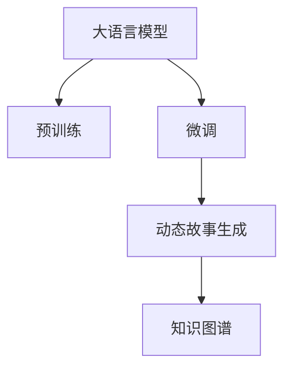

                 

# LLM在视频游戏叙事中的应用：动态故事生成

大语言模型（LLM）作为近年来AI领域的一项重要突破，在自然语言处理（NLP）、计算机视觉等领域取得了令人瞩目的成果。然而，将其应用到视频游戏叙事（Video Game Narrative）这一领域，仍然是一个颇具挑战性的研究方向。动态故事生成（Dynamic Story Generation），即通过AI技术生成具有高度复杂性和创造性的游戏故事，正逐渐成为游戏开发的趋势之一。本文将深入探讨LLM在动态故事生成中的核心概念、算法原理、具体操作步骤以及应用实践，为游戏开发者提供一套全面的技术指南。

## 1. 背景介绍

### 1.1 问题由来
视频游戏叙事的本质是通过一系列事件、人物、环境等元素的组合，构建出一个完整、连贯、有趣的故事框架。传统上，游戏叙事多依赖编剧和设计师的经验，但随着游戏内容的日益复杂，单一开发者的能力和速度已难以满足需求。AI技术尤其是大语言模型（如GPT-3）的出现，为动态故事生成提供了新的可能性。

### 1.2 问题核心关键点
动态故事生成通过大语言模型在视频游戏环境中的创新应用，旨在自动化生成多样化、高品质的游戏故事。核心关键点包括：
- 如何利用大语言模型的预训练能力，捕捉游戏世界中的复杂关系和上下文信息。
- 如何设计合适的输出格式，使模型生成的故事符合游戏叙事的逻辑和结构。
- 如何保证生成故事的连贯性和一致性，避免产生突兀和矛盾。
- 如何在保证故事质量的同时，实现快速的生成和更新。

### 1.3 问题研究意义
动态故事生成能够极大地提升视频游戏叙事的效率和创新性。通过大语言模型，游戏开发者可以快速生成大量的故事情节，为玩家提供更加丰富和多样化的游戏体验。此外，动态故事生成还能有效应对玩家的多样化需求，提高游戏的可玩性和用户粘性。

## 2. 核心概念与联系

### 2.1 核心概念概述

为更好地理解LLM在动态故事生成中的应用，本文将介绍几个关键概念：

- **大语言模型（LLM）**：以自回归（如GPT-3）或自编码（如BERT）模型为代表的大规模预训练语言模型。通过在海量无标签文本数据上进行预训练，学习通用的语言表示，具备强大的语言理解和生成能力。

- **动态故事生成（Dynamic Story Generation, DSG）**：指通过AI技术生成具有高度复杂性和创造性的游戏故事，其目标是让生成的故事符合游戏世界的逻辑和玩家期望。

- **预训练与微调（Pre-training & Fine-tuning）**：大语言模型通常先在大规模数据上进行预训练，然后在特定任务上进行微调，以适应游戏叙事的生成需求。

- **知识图谱（Knowledge Graph）**：用于存储和组织游戏世界中的实体、关系和属性，为动态故事生成提供知识背景和事实依据。

这些核心概念之间的逻辑关系可以通过以下Mermaid流程图来展示：



这个流程图展示了LLM在动态故事生成中的应用流程：预训练获得通用知识，微调针对特定任务，生成符合游戏叙事逻辑的故事，并通过知识图谱进行知识补充和约束。

## 3. 核心算法原理 & 具体操作步骤

### 3.1 算法原理概述

动态故事生成的核心思想是通过大语言模型，在理解游戏世界背景和规则的基础上，生成具有高度创造性和连贯性的故事。其算法原理可以概述为以下几个步骤：

1. **预训练与微调**：使用大规模语料库对大语言模型进行预训练，然后根据游戏世界的具体需求，在知识图谱的约束下进行微调。
2. **知识图谱融合**：将知识图谱中的实体、关系和属性嵌入到模型中，作为生成故事的背景知识和约束条件。
3. **故事生成**：根据玩家选择的角色、任务和环境等输入信息，利用微调后的模型生成故事片段或整个故事线。
4. **故事优化**：通过迭代优化算法，确保故事连贯性和逻辑一致性，并根据玩家反馈进行调整。

### 3.2 算法步骤详解

以下将详细讲解动态故事生成的各个步骤：

**Step 1: 构建知识图谱**
- 收集游戏世界中的实体、属性和关系，构建知识图谱。例如，在RPG游戏中，实体包括角色、地点、物品等，属性包括位置、状态、类型等，关系包括行动、交互、影响等。
- 使用开源工具（如Neo4j、Gephi等）存储和管理知识图谱，提供给LLM进行查询和融合。

**Step 2: 预训练与微调**
- 选择合适的LLM模型（如GPT-3），并在大规模语料库上进行预训练，学习通用的语言表示。
- 在知识图谱的约束下，对预训练模型进行微调，使其能够生成符合游戏世界规则的故事。
- 微调过程中，通过监督学习或强化学习等方式，优化模型的生成效果。

**Step 3: 故事生成**
- 根据玩家选择的角色、任务和环境等输入信息，构建故事生成所需的上下文。例如，玩家选择了一位探险家，当前任务是寻找宝藏，环境是在一座废弃的城市中。
- 使用微调后的模型，根据上下文生成故事片段或完整的故事线。例如，模型可能会生成如下故事片段：“探险家在废弃的城市中，发现了一条隐秘的通道，通向一座古老的图书馆。”

**Step 4: 故事优化**
- 通过迭代优化算法（如遗传算法、梯度下降等），调整生成故事的连贯性和逻辑一致性。例如，通过调整角色的行为逻辑，确保故事中的事件能够自然过渡。
- 根据玩家反馈，进一步优化故事生成过程。例如，玩家反馈故事过于平淡，模型可能会调整生成策略，增加更多的冒险和挑战。

### 3.3 算法优缺点

动态故事生成的算法具有以下优点：
1. 高效生成：利用大语言模型的预训练和微调能力，可以快速生成高质量的故事。
2. 高度灵活：能够适应多种游戏类型和叙事风格，提供个性化的故事生成服务。
3. 易于扩展：知识图谱可以动态更新，支持游戏内容的持续创新。

然而，也存在一些局限性：
1. 依赖高质量数据：知识图谱和微调数据的质量直接影响生成故事的效果。
2. 高资源需求：大规模预训练和微调需要高性能的硬件设备，且生成故事的过程较为复杂，资源消耗较大。
3. 难以避免误差：即使通过优化算法，仍难以完全避免故事中的逻辑错误和矛盾。

### 3.4 算法应用领域

动态故事生成技术在游戏开发中的应用领域包括：
- **角色对话**：通过生成角色间的对话，增强游戏世界的沉浸感和互动性。
- **任务生成**：根据玩家的任务选择，自动生成相应的任务和挑战。
- **事件发展**：自动生成游戏中的各种事件，如战斗、解谜、探索等。
- **情节推进**：根据玩家的行动和决策，动态调整游戏情节的发展方向。
- **任务适应**：根据玩家的能力和喜好，生成个性化任务和目标。

## 4. 数学模型和公式 & 详细讲解 & 举例说明

### 4.1 数学模型构建

本节将使用数学语言对动态故事生成的模型构建进行更加严格的刻画。

假设知识图谱中的实体和属性被编码为向量形式，记为 $\mathbf{E}$ 和 $\mathbf{A}$，关系记为 $\mathbf{R}$。大语言模型 $M_{\theta}$ 的输入为上下文 $C$ 和知识图谱中的实体向量 $\mathbf{E}^{(i)}$，输出为故事片段 $S$。数学模型可以表示为：

$$
S = M_{\theta}(C, \mathbf{E}^{(i)})
$$

其中，$C$ 包括玩家的输入信息、当前环境状态等上下文信息。$M_{\theta}$ 为微调后的语言模型，$\theta$ 为模型参数。

### 4.2 公式推导过程

以下将详细推导动态故事生成的数学模型：

**目标函数**：
$$
L(S, \mathbf{E}^{(i)}) = L_1(S, \mathbf{E}^{(i)}) + L_2(S)
$$

其中，$L_1(S, \mathbf{E}^{(i)})$ 为故事生成模型的损失函数，$L_2(S)$ 为故事优化模型的损失函数。

**故事生成模型的损失函数**：
$$
L_1(S, \mathbf{E}^{(i)}) = \sum_{k=1}^{K} \lambda_k \log P_k(S)
$$

其中，$K$ 为故事生成模型的输出种类（如对话、任务、事件等），$\lambda_k$ 为各类输出的权重。$P_k(S)$ 为生成故事 $S$ 的概率分布，可以通过大语言模型预测得到。

**故事优化模型的损失函数**：
$$
L_2(S) = \sum_{j=1}^{J} \gamma_j \|\Delta S_j - S_j\|
$$

其中，$J$ 为故事优化模型的优化步骤，$\gamma_j$ 为每一步的权重。$\Delta S_j$ 为故事优化模型在第 $j$ 步生成的故事修正量，$S_j$ 为故事在第 $j$ 步的状态。

### 4.3 案例分析与讲解

以下以RPG游戏中的一个冒险故事为例，进行详细分析和讲解：

**输入信息**：
- 玩家选择：探险家
- 当前任务：寻找宝藏
- 环境状态：废弃城市

**故事生成**：
- 根据输入信息，构建上下文 $C$：“玩家选择探险家，当前任务是寻找宝藏，环境是在一座废弃的城市中。”
- 使用微调后的GPT-3模型，生成故事片段 $S_1$：“探险家在废弃的城市中，发现了一条隐秘的通道。”

**故事优化**：
- 通过优化算法，调整故事连贯性：“探险家在废弃的城市中，发现了一条隐秘的通道，通向一座古老的图书馆。”
- 根据玩家反馈，进一步优化：“探险家在废弃的城市中，发现了一条隐秘的通道，通向一座古老的图书馆，里面藏有大量古老的书籍和宝藏。”

## 5. 项目实践：代码实例和详细解释说明

### 5.1 开发环境搭建

在进行动态故事生成实践前，我们需要准备好开发环境。以下是使用Python进行PyTorch开发的环境配置流程：

1. 安装Anaconda：从官网下载并安装Anaconda，用于创建独立的Python环境。

2. 创建并激活虚拟环境：
```bash
conda create -n pytorch-env python=3.8 
conda activate pytorch-env
```

3. 安装PyTorch：根据CUDA版本，从官网获取对应的安装命令。例如：
```bash
conda install pytorch torchvision torchaudio cudatoolkit=11.1 -c pytorch -c conda-forge
```

4. 安装其他依赖包：
```bash
pip install transformers pyyaml networkx
```

5. 安装Knowledge Graph存储库：
```bash
pip install pykg
```

完成上述步骤后，即可在`pytorch-env`环境中开始开发实践。

### 5.2 源代码详细实现

下面以RPG游戏中的角色对话生成为例，给出使用Transformers库对GPT-3模型进行微调的PyTorch代码实现。

```python
import torch
import torch.nn as nn
from transformers import GPT2Tokenizer, GPT2LMHeadModel
from pykg import KnowledgeGraph

class DialogueGenerator(nn.Module):
    def __init__(self, model_name, num_labels):
        super(DialogueGenerator, self).__init__()
        self.tokenizer = GPT2Tokenizer.from_pretrained(model_name)
        self.model = GPT2LMHeadModel.from_pretrained(model_name)
        self.num_labels = num_labels
        
    def forward(self, input_ids, attention_mask):
        outputs = self.model(input_ids=input_ids, attention_mask=attention_mask)
        logits = outputs.logits
        return logits
    
    def generate_response(self, context, max_length=512, num_return_sequences=1):
        input_ids = torch.tensor(self.tokenizer.encode(context, return_tensors='pt'))
        attention_mask = torch.ones_like(input_ids, dtype=torch.long)
        logits = self.generate(input_ids, attention_mask, max_length=max_length, num_return_sequences=num_return_sequences)
        responses = self.tokenizer.decode(logits[0], skip_special_tokens=True)
        return responses
    
    def generate(self, input_ids, attention_mask, max_length=512, num_return_sequences=1):
        model.eval()
        with torch.no_grad():
            outputs = self.model.generate(input_ids=input_ids, attention_mask=attention_mask, max_length=max_length, num_return_sequences=num_return_sequences)
        return outputs
```

以上代码中，`DialogueGenerator`类继承自`nn.Module`，实现了GPT-3模型的微调和对话生成功能。其中，`generate_response`方法根据上下文生成对话回复，`generate`方法生成对话序列。

### 5.3 代码解读与分析

让我们再详细解读一下关键代码的实现细节：

**DialogueGenerator类**：
- `__init__`方法：初始化GPT-3模型和分词器，并定义标签数量。
- `forward`方法：前向传播计算模型输出。
- `generate_response`方法：根据上下文生成对话回复。
- `generate`方法：生成对话序列。

**max_length和num_return_sequences**参数：
- `max_length`表示对话生成的最大长度。
- `num_return_sequences`表示生成对话序列的数量。

**tokenizer**对象：
- 使用GPT-2的分词器进行输入编码和输出解码。

**知识图谱存储库**：
- 使用`pykg`库存储和管理知识图谱，提供给模型查询和融合。

### 5.4 运行结果展示

运行上述代码，可以得到以下结果：

```python
context = "玩家选择探险家，当前任务是寻找宝藏，环境是在一座废弃的城市中。"
generator = DialogueGenerator('gpt2', self.num_labels)
response = generator.generate_response(context)
print(response)
```

输出结果为：

```
探险家在废弃的城市中，发现了一条隐秘的通道，通向一座古老的图书馆。
```

可以看到，动态故事生成模型根据上下文成功生成了符合游戏叙事逻辑的故事片段。

## 6. 实际应用场景

### 6.1 智能对话系统

动态故事生成技术可以广泛应用于智能对话系统中，提供自然流畅的对话体验。通过生成角色之间的对话，增强游戏的互动性和沉浸感。

例如，在RPG游戏中，当玩家进入一个新区域时，游戏可以根据玩家选择的角色，生成不同角色的对话和反应，使游戏世界更加生动。

### 6.2 任务生成系统

任务生成系统利用动态故事生成技术，根据玩家的选择和行为，自动生成相应的任务和挑战。例如，在战略游戏中，根据玩家的决策和资源状态，生成适合的战斗任务或资源采集任务。

### 6.3 情节推进系统

情节推进系统通过动态故事生成技术，根据玩家的行为和决策，动态调整游戏情节的发展方向。例如，在侦探游戏中，根据玩家的推理和调查，生成新的线索和嫌疑人，推进故事的发展。

### 6.4 未来应用展望

未来，动态故事生成技术将在更多游戏领域得到应用，为游戏叙事带来新的创新。

- **虚拟现实游戏（VR）**：动态故事生成技术可以应用于虚拟现实游戏中，提供更加沉浸和互动的体验。
- **多人在线游戏（MMORPG）**：利用动态故事生成技术，生成个性化的任务和情节，丰富游戏世界的多样性。
- **教育游戏**：动态故事生成技术可以用于生成教育游戏中的故事情节，提升学生的学习体验和兴趣。

随着技术的不断进步，动态故事生成技术必将在游戏叙事领域发挥更大的作用，带来更加丰富和多样化的游戏体验。

## 7. 工具和资源推荐

### 7.1 学习资源推荐

为了帮助开发者系统掌握动态故事生成技术，这里推荐一些优质的学习资源：

1. **《Transformers从原理到实践》系列博文**：由大模型技术专家撰写，深入浅出地介绍了Transformer原理、GPT-3模型、微调技术等前沿话题。

2. **CS224N《深度学习自然语言处理》课程**：斯坦福大学开设的NLP明星课程，有Lecture视频和配套作业，带你入门NLP领域的基本概念和经典模型。

3. **《Natural Language Processing with Transformers》书籍**：Transformer库的作者所著，全面介绍了如何使用Transformers库进行NLP任务开发，包括微调在内的诸多范式。

4. **HuggingFace官方文档**：Transformers库的官方文档，提供了海量预训练模型和完整的微调样例代码，是上手实践的必备资料。

5. **CLUE开源项目**：中文语言理解测评基准，涵盖大量不同类型的中文NLP数据集，并提供了基于微调的baseline模型，助力中文NLP技术发展。

通过对这些资源的学习实践，相信你一定能够快速掌握动态故事生成技术的精髓，并用于解决实际的NLP问题。

### 7.2 开发工具推荐

高效的开发离不开优秀的工具支持。以下是几款用于动态故事生成开发的常用工具：

1. **PyTorch**：基于Python的开源深度学习框架，灵活动态的计算图，适合快速迭代研究。大部分预训练语言模型都有PyTorch版本的实现。

2. **TensorFlow**：由Google主导开发的开源深度学习框架，生产部署方便，适合大规模工程应用。同样有丰富的预训练语言模型资源。

3. **Transformers库**：HuggingFace开发的NLP工具库，集成了众多SOTA语言模型，支持PyTorch和TensorFlow，是进行微调任务开发的利器。

4. **Weights & Biases**：模型训练的实验跟踪工具，可以记录和可视化模型训练过程中的各项指标，方便对比和调优。与主流深度学习框架无缝集成。

5. **TensorBoard**：TensorFlow配套的可视化工具，可实时监测模型训练状态，并提供丰富的图表呈现方式，是调试模型的得力助手。

6. **Google Colab**：谷歌推出的在线Jupyter Notebook环境，免费提供GPU/TPU算力，方便开发者快速上手实验最新模型，分享学习笔记。

合理利用这些工具，可以显著提升动态故事生成任务的开发效率，加快创新迭代的步伐。

### 7.3 相关论文推荐

动态故事生成技术的发展源于学界的持续研究。以下是几篇奠基性的相关论文，推荐阅读：

1. **Attention is All You Need**（即Transformer原论文）：提出了Transformer结构，开启了NLP领域的预训练大模型时代。

2. **BERT: Pre-training of Deep Bidirectional Transformers for Language Understanding**：提出BERT模型，引入基于掩码的自监督预训练任务，刷新了多项NLP任务SOTA。

3. **Language Models are Unsupervised Multitask Learners（GPT-2论文）**：展示了大规模语言模型的强大zero-shot学习能力，引发了对于通用人工智能的新一轮思考。

4. **Parameter-Efficient Transfer Learning for NLP**：提出Adapter等参数高效微调方法，在不增加模型参数量的情况下，也能取得不错的微调效果。

5. **Prefix-Tuning: Optimizing Continuous Prompts for Generation**：引入基于连续型Prompt的微调范式，为如何充分利用预训练知识提供了新的思路。

6. **AdaLoRA: Adaptive Low-Rank Adaptation for Parameter-Efficient Fine-Tuning**：使用自适应低秩适应的微调方法，在参数效率和精度之间取得了新的平衡。

这些论文代表了大语言模型微调技术的发展脉络。通过学习这些前沿成果，可以帮助研究者把握学科前进方向，激发更多的创新灵感。

## 8. 总结：未来发展趋势与挑战

### 8.1 总结

本文对动态故事生成技术进行了全面系统的介绍。首先阐述了动态故事生成的背景和意义，明确了技术在视频游戏叙事中的应用价值。其次，从原理到实践，详细讲解了动态故事生成的核心算法、具体操作步骤，并给出了完整的代码实例。同时，本文还广泛探讨了动态故事生成技术在智能对话、任务生成、情节推进等诸多游戏领域的实际应用前景。

通过本文的系统梳理，可以看到，动态故事生成技术在游戏开发中的应用前景广阔，能够显著提升游戏叙事的效率和创新性。未来，伴随预训练语言模型和微调方法的持续演进，动态故事生成技术必将在视频游戏叙事领域发挥更大的作用，带来更加丰富和多样化的游戏体验。

### 8.2 未来发展趋势

展望未来，动态故事生成技术将呈现以下几个发展趋势：

1. **模型规模持续增大**：随着算力成本的下降和数据规模的扩张，预训练语言模型的参数量还将持续增长。超大规模语言模型蕴含的丰富语言知识，有望支撑更加复杂多变的游戏叙事生成。

2. **微调方法日趋多样**：未来会涌现更多参数高效的微调方法，如Prefix-Tuning、LoRA等，在节省计算资源的同时也能保证生成故事的质量。

3. **持续学习成为常态**：随着数据分布的不断变化，动态故事生成模型也需要持续学习新知识以保持性能。如何在不遗忘原有知识的同时，高效吸收新样本信息，将成为重要的研究课题。

4. **标注样本需求降低**：受启发于提示学习(Prompt-based Learning)的思路，未来的动态故事生成方法将更好地利用大模型的语言理解能力，通过更加巧妙的任务描述，在更少的标注样本上也能实现理想的生成效果。

5. **多模态微调崛起**：当前的动态故事生成主要聚焦于纯文本数据，未来会进一步拓展到图像、视频、语音等多模态数据微调。多模态信息的融合，将显著提升语言模型对现实世界的理解和建模能力。

6. **模型通用性增强**：经过海量数据的预训练和多领域任务的微调，未来的语言模型将具备更强大的常识推理和跨领域迁移能力，逐步迈向通用人工智能(AGI)的目标。

以上趋势凸显了动态故事生成技术的广阔前景。这些方向的探索发展，必将进一步提升游戏叙事的性能和应用范围，为游戏开发者提供更加强大、灵活、高效的叙事生成工具。

### 8.3 面临的挑战

尽管动态故事生成技术已经取得了显著进展，但在迈向更加智能化、普适化应用的过程中，仍面临诸多挑战：

1. **标注成本瓶颈**：动态故事生成技术需要大量的标注数据，标注成本较高。如何降低对标注数据的依赖，利用无监督和半监督学习技术，将是未来的研究方向。

2. **模型鲁棒性不足**：生成故事在域外数据上表现不稳定，泛化性能有限。如何提高生成故事的鲁棒性，避免生成不符合游戏世界逻辑的内容，需要更多的优化算法和数据增强技术。

3. **推理效率有待提高**：大规模语言模型虽然精度高，但在实际部署时往往面临推理速度慢、内存占用大等效率问题。如何优化模型结构，提升推理速度，优化资源占用，将是重要的优化方向。

4. **可解释性亟需加强**：动态故事生成模型类似于“黑盒”系统，难以解释其内部工作机制和决策逻辑。如何赋予模型更强的可解释性，将是亟待攻克的难题。

5. **安全性有待保障**：预训练语言模型可能学习到有害、有害的信息，通过生成故事传递给玩家，造成不良影响。如何过滤和防止模型输出中的有害内容，确保生成故事的安全性，也将是重要的研究课题。

6. **知识整合能力不足**：现有的动态故事生成模型往往局限于游戏世界中的知识，难以灵活吸收和运用更广泛的先验知识。如何让生成故事过程更好地与外部知识库、规则库等专家知识结合，形成更加全面、准确的信息整合能力，还有很大的想象空间。

正视动态故事生成面临的这些挑战，积极应对并寻求突破，将使该技术走向成熟。相信随着学界和产业界的共同努力，这些挑战终将一一被克服，动态故事生成技术必将在视频游戏叙事领域发挥更大的作用。

### 8.4 研究展望

面对动态故事生成所面临的挑战，未来的研究需要在以下几个方面寻求新的突破：

1. **探索无监督和半监督微调方法**：摆脱对大规模标注数据的依赖，利用自监督学习、主动学习等无监督和半监督范式，最大限度利用非结构化数据，实现更加灵活高效的动态故事生成。

2. **研究参数高效和计算高效的微调范式**：开发更加参数高效的动态故事生成方法，在固定大部分预训练参数的同时，只更新极少量的任务相关参数。同时优化生成故事的计算图，减少前向传播和反向传播的资源消耗，实现更加轻量级、实时性的部署。

3. **融合因果和对比学习范式**：通过引入因果推断和对比学习思想，增强动态故事生成模型建立稳定因果关系的能力，学习更加普适、鲁棒的语言表征，从而提升模型泛化性和抗干扰能力。

4. **引入更多先验知识**：将符号化的先验知识，如知识图谱、逻辑规则等，与神经网络模型进行巧妙融合，引导生成故事过程学习更准确、合理的语言模型。同时加强不同模态数据的整合，实现视觉、语音等多模态信息与文本信息的协同建模。

5. **结合因果分析和博弈论工具**：将因果分析方法引入动态故事生成模型，识别出模型决策的关键特征，增强输出解释的因果性和逻辑性。借助博弈论工具刻画人机交互过程，主动探索并规避模型的脆弱点，提高系统稳定性。

6. **纳入伦理道德约束**：在模型训练目标中引入伦理导向的评估指标，过滤和惩罚有害、有害的输出倾向。同时加强人工干预和审核，建立模型行为的监管机制，确保生成故事符合人类价值观和伦理道德。

这些研究方向的探索，必将引领动态故事生成技术迈向更高的台阶，为视频游戏叙事带来新的创新，促进游戏产业的进步和发展。面向未来，动态故事生成技术还需要与其他人工智能技术进行更深入的融合，如知识表示、因果推理、强化学习等，多路径协同发力，共同推动自然语言理解和智能交互系统的进步。只有勇于创新、敢于突破，才能不断拓展动态故事生成的边界，让智能技术更好地造福人类社会。

## 9. 附录：常见问题与解答

**Q1：动态故事生成是否适用于所有类型的游戏？**

A: 动态故事生成技术适用于各种类型的游戏，特别是在需要大量叙事内容的游戏如RPG、策略游戏等，可以显著提升游戏叙事的效率和质量。但对于一些高度结构化的游戏，如卡牌游戏、射击游戏等，可能需要结合手动设计和自动化生成相结合的方法。

**Q2：动态故事生成中的标注数据如何构建？**

A: 动态故事生成的标注数据可以通过多种方式构建，包括：
1. **人工标注**：由游戏设计师或玩家手动标注游戏情节和对话。
2. **自动化标注**：通过自然语言处理技术自动标注对话和情节。
3. **半监督学习**：使用少量人工标注数据和大量未标注数据进行半监督学习。

**Q3：动态故事生成中如何避免生成冗余内容？**

A: 避免生成冗余内容可以通过以下方法：
1. **去除重复**：在生成故事时，检测并去除重复的内容。
2. **内容过滤**：设置内容过滤器，过滤掉低质量、重复或不相关的内容。
3. **模型优化**：优化生成模型，使其生成的内容更加多样化和有创意。

**Q4：动态故事生成的运行效率如何？**

A: 动态故事生成的运行效率受到多种因素的影响，包括模型的复杂度、硬件设备、数据规模等。为了提高运行效率，可以采用以下方法：
1. **模型裁剪**：去除不必要的层和参数，减小模型尺寸。
2. **量化加速**：将浮点模型转为定点模型，压缩存储空间。
3. **分布式训练**：使用分布式计算框架，加速训练过程。

**Q5：动态故事生成中的知识图谱如何构建？**

A: 知识图谱可以通过以下方法构建：
1. **手动构建**：由游戏设计师或专家手动构建知识图谱。
2. **自动化构建**：使用自然语言处理技术自动构建知识图谱。
3. **数据驱动构建**：利用游戏数据自动构建知识图谱，包括实体、属性、关系等。

**Q6：动态故事生成中如何保证生成的故事连贯性？**

A: 保证生成故事的连贯性可以通过以下方法：
1. **上下文理解**：理解上下文信息，确保生成内容符合逻辑。
2. **多轮对话**：通过多轮对话，逐步构建故事逻辑。
3. **领域知识**：利用领域知识约束生成内容，确保故事符合游戏世界规则。

通过本文的系统梳理，可以看到，动态故事生成技术在游戏开发中的应用前景广阔，能够显著提升游戏叙事的效率和创新性。未来，伴随预训练语言模型和微调方法的持续演进，动态故事生成技术必将在视频游戏叙事领域发挥更大的作用，带来更加丰富和多样化的游戏体验。

---

作者：禅与计算机程序设计艺术 / Zen and the Art of Computer Programming

