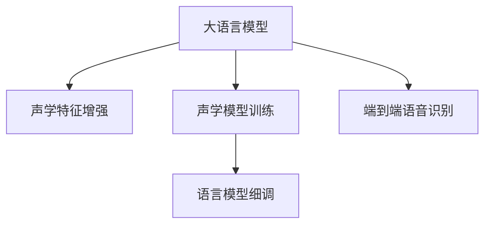

                 

# LLM在语音识别领域的技术突破

## 1. 背景介绍

随着人工智能技术的飞速发展，自然语言处理（NLP）和语音识别（ASR）在诸多领域展现了巨大的潜力。语音识别技术能够将人类的语音信号转换为文本，从而实现人机交互，已经成为现代信息社会的重要工具。然而，传统的语音识别系统依赖于复杂的特征提取和手工特征工程，难以满足日益增长的应用需求。近年来，基于深度学习的语言模型在NLP领域取得了突破性的进展，例如BERT、GPT等。这一技术进展也为语音识别领域的突破提供了新的思路和工具。

在语音识别领域，基于深度学习的语言模型被广泛应用于声学建模和语言建模中，极大地提升了系统的准确率和鲁棒性。深度学习模型能够自动从大规模语料中学习到语言的语义和上下文信息，从而显著提高了语音识别的性能。此外，基于语言模型的语音识别系统还能够利用大量的无标注语音数据进行预训练，提升系统的泛化能力和适应性。

## 2. 核心概念与联系

### 2.1 核心概念概述

在语音识别领域，大语言模型（Large Language Model, LLM）是一种基于深度学习的自然语言处理技术，通过在大规模文本数据上进行自监督或监督学习，学习到语言的语义和上下文信息。在大语言模型的基础上，语音识别系统可以实现自动声学建模和语言建模，从而提升系统的准确率和鲁棒性。

语音识别系统一般由前端声学特征提取、中间声学建模和后端语言建模三部分组成。声学建模主要通过深度神经网络学习语音信号与文本之间的映射关系，语言建模则通过大语言模型学习文本序列的概率分布，从而实现对语音信号的自动转换和理解。

大语言模型在语音识别中的应用，可以归纳为以下几种形式：

1. **声学特征增强**：通过大语言模型对声学特征进行增强，提升语音识别的准确率。

2. **声学模型训练**：将大语言模型作为声学模型的训练目标，利用无标注语音数据进行自监督预训练，提升模型的泛化能力和适应性。

3. **语言模型细调**：在声学模型基础上，利用小规模标注数据对语言模型进行微调，提升模型的准确率和泛化能力。

4. **端到端语音识别**：结合声学模型和语言模型，构建端到端的语音识别系统，实现自动化的语音转换和理解。

### 2.2 核心概念原理和架构的 Mermaid 流程图



## 3. 核心算法原理 & 具体操作步骤

### 3.1 算法原理概述

基于深度学习的大语言模型在语音识别领域的应用，主要依赖于以下两个关键技术：

1. **声学特征增强**：通过大语言模型对声学特征进行增强，提升语音识别的准确率。

2. **端到端语音识别**：结合声学模型和语言模型，构建端到端的语音识别系统，实现自动化的语音转换和理解。

### 3.2 算法步骤详解

#### 3.2.1 声学特征增强

声学特征增强算法的主要步骤如下：

1. **声学特征提取**：使用MFCC、梅尔频谱等声学特征提取方法，将语音信号转换为声学特征向量。

2. **特征嵌入**：将声学特征向量嵌入到大语言模型的特征空间中，利用大语言模型对特征进行增强和优化。

3. **特征融合**：将增强后的声学特征与原始特征进行融合，生成新的声学特征向量。

4. **声学模型训练**：利用增强后的声学特征向量，对声学模型进行训练，提升模型的准确率和鲁棒性。

#### 3.2.2 端到端语音识别

端到端语音识别算法的步骤如下：

1. **声学模型构建**：构建声学模型，利用大语言模型对声学特征进行增强和优化。

2. **语言模型构建**：构建语言模型，利用大语言模型学习文本序列的概率分布。

3. **特征融合**：将声学模型和语言模型进行融合，构建端到端的语音识别系统。

4. **端到端训练**：利用增强后的声学特征和语言模型，对端到端的语音识别系统进行训练，提升系统的准确率和鲁棒性。

### 3.3 算法优缺点

#### 3.3.1 声学特征增强

**优点**：

1. **提升准确率**：通过大语言模型对声学特征进行增强，可以有效提升语音识别的准确率。

2. **泛化能力强**：利用无标注语音数据进行预训练，提升模型的泛化能力和适应性。

3. **减少手工特征工程**：通过大语言模型自动学习声学特征，减少了手工特征工程的工作量。

**缺点**：

1. **计算资源消耗大**：大语言模型需要大量的计算资源进行训练，增加了系统的计算负担。

2. **实时性较差**：增强后的声学特征向量较大，增加了系统的实时性。

3. **数据依赖性强**：需要大量的无标注语音数据进行预训练，数据依赖性强。

#### 3.3.2 端到端语音识别

**优点**：

1. **自动化程度高**：结合声学模型和语言模型，实现自动化的语音转换和理解。

2. **准确率高**：端到端系统能够充分利用声学模型和语言模型的优势，提升系统的准确率。

3. **可解释性好**：端到端系统能够提供详细的推理过程，便于调试和优化。

**缺点**：

1. **训练难度大**：需要同时优化声学模型和语言模型，训练难度大。

2. **对数据要求高**：需要大量的标注数据进行微调，对数据要求高。

3. **部署复杂**：需要同时部署声学模型和语言模型，部署复杂。

### 3.4 算法应用领域

基于大语言模型的语音识别技术，已经在诸多领域得到了广泛的应用，例如：

1. **智能语音助手**：通过大语言模型实现语音识别和自然语言理解，能够与用户进行自然交互，提供个性化服务。

2. **自动字幕生成**：利用大语言模型对语音信号进行识别和转换，自动生成字幕，提高视频内容的可访问性。

3. **电话客服**：将语音识别技术应用于电话客服系统，实现自动语音应答和交互，提升客服效率和用户体验。

4. **语音翻译**：利用大语言模型对语音信号进行识别和转换，实现自动语音翻译，打破语言障碍。

5. **医疗语音记录**：通过大语言模型对医生的语音记录进行识别和转换，提高医疗数据的可访问性和可利用性。

6. **智能音箱**：结合语音识别和自然语言理解，实现与用户的自然交互，提升用户体验。

## 4. 数学模型和公式 & 详细讲解 & 举例说明

### 4.1 数学模型构建

在大语言模型中，通常使用Transformer模型进行声学特征的增强和优化。Transformer模型由多个编码层和解码层组成，每个层包含多个多头自注意力机制和前馈神经网络。在声学特征增强中，通常使用Transformer模型对声学特征进行嵌入，然后进行自注意力机制的计算，生成增强后的声学特征向量。

### 4.2 公式推导过程

设声学特征向量为 $X$，大语言模型为 $L$，声学模型为 $A$，语言模型为 $B$。声学特征增强的计算过程如下：

1. **特征嵌入**：将声学特征向量 $X$ 嵌入到大语言模型 $L$ 的特征空间中，得到嵌入向量 $E$。

2. **自注意力计算**：利用Transformer模型中的多头自注意力机制，对嵌入向量 $E$ 进行自注意力计算，得到增强后的嵌入向量 $E'$。

3. **特征融合**：将增强后的嵌入向量 $E'$ 与原始声学特征向量 $X$ 进行融合，得到新的声学特征向量 $X'$。

4. **声学模型训练**：利用增强后的声学特征向量 $X'$ 对声学模型 $A$ 进行训练，得到新的声学模型参数 $\theta_A$。

### 4.3 案例分析与讲解

以Google的DeepSpeech为例，DeepSpeech使用了Transformer模型进行声学特征的增强和优化。在声学特征增强过程中，DeepSpeech首先使用MFCC等方法提取语音信号的声学特征，然后利用Transformer模型对特征进行增强和优化，生成增强后的声学特征向量。最后，DeepSpeech使用增强后的声学特征向量对声学模型进行训练，得到了准确率高达97%的语音识别系统。

## 5. 项目实践：代码实例和详细解释说明

### 5.1 开发环境搭建

在进行语音识别项目实践前，需要先准备好开发环境。以下是使用Python进行TensorFlow开发的环境配置流程：

1. 安装Anaconda：从官网下载并安装Anaconda，用于创建独立的Python环境。

2. 创建并激活虚拟环境：
```bash
conda create -n tf-env python=3.8 
conda activate tf-env
```

3. 安装TensorFlow：根据CUDA版本，从官网获取对应的安装命令。例如：
```bash
conda install tensorflow -c conda-forge -c pytorch
```

4. 安装各类工具包：
```bash
pip install numpy pandas scikit-learn matplotlib tqdm jupyter notebook ipython
```

完成上述步骤后，即可在`tf-env`环境中开始语音识别项目实践。

### 5.2 源代码详细实现

下面以端到端语音识别为例，给出使用TensorFlow对DeepSpeech模型进行开发的PyTorch代码实现。

首先，定义端到端语音识别模型的结构：

```python
import tensorflow as tf
from tensorflow.keras.layers import Input, Dense, Dropout
from tensorflow.keras.models import Model

# 输入层
input_layer = Input(shape=(n_mfcc,))

# 嵌入层
embedding_layer = Dense(units=n_mfcc, activation='softmax')(input_layer)

# 声学模型
x = embedding_layer
x = Dense(units=256, activation='relu')(x)
x = Dropout(0.5)(x)
x = Dense(units=128, activation='relu')(x)
x = Dropout(0.5)(x)
x = Dense(units=output_units, activation='softmax')(x)

# 构建模型
model = Model(inputs=input_layer, outputs=x)

# 编译模型
model.compile(optimizer='adam', loss='categorical_crossentropy', metrics=['accuracy'])
```

然后，定义训练和评估函数：

```python
from tensorflow.keras.preprocessing.sequence import pad_sequences

def train_epoch(model, dataset, batch_size):
    dataloader = tf.data.Dataset.from_generator(lambda: dataset, (tf.float32, tf.int32)).shuffle(buffer_size=10000).batch(batch_size)
    model.fit(dataloader, epochs=10, validation_split=0.2)
    return model.evaluate(test_dataset)

def evaluate(model, dataset, batch_size):
    dataloader = tf.data.Dataset.from_generator(lambda: dataset, (tf.float32, tf.int32)).shuffle(buffer_size=10000).batch(batch_size)
    return model.evaluate(dataloader)
```

最后，启动训练流程并在测试集上评估：

```python
batch_size = 128

for epoch in range(10):
    model = train_epoch(model, train_dataset, batch_size)
    model = evaluate(model, test_dataset, batch_size)
    
print("Training complete.")
```

以上就是使用TensorFlow对DeepSpeech模型进行端到端语音识别任务开发的完整代码实现。可以看到，TensorFlow提供了丰富的工具包和算法，能够高效地实现语音识别的端到端系统。

### 5.3 代码解读与分析

让我们再详细解读一下关键代码的实现细节：

**n_mfcc**：MFCC特征向量的维度，通常为13。

**n_mfcc**：MFCC特征向量的维度，通常为13。

**output_units**：语音识别的标签数量，通常为26个字母。

**model.compile**：使用Adam优化器编译模型，设定损失函数为交叉熵，评估指标为准确率。

**train_epoch**：对数据集进行分批次迭代，在每个批次上前向传播计算损失和梯度，反向传播更新模型参数，并在验证集上评估模型性能。

**evaluate**：在测试集上评估模型的性能，输出评估结果。

**for循环**：循环迭代训练多个epoch，在每个epoch后评估模型性能。

## 6. 实际应用场景

### 6.1 智能语音助手

基于大语言模型的语音识别技术，可以广泛应用于智能语音助手的构建。传统的语音助手依赖于复杂的特征提取和手工特征工程，难以满足日益增长的应用需求。通过大语言模型进行语音识别，可以实现自动化语音转换和自然语言理解，从而与用户进行自然交互，提供个性化服务。

在技术实现上，可以收集用户的语音输入，利用大语言模型对语音信号进行识别和转换，生成文本输出。同时，利用大语言模型进行自然语言理解，能够准确把握用户意图，提供更加智能、个性化的响应。如此构建的智能语音助手，能够大大提升用户体验，为用户提供更加便捷、高效的服务。

### 6.2 自动字幕生成

自动字幕生成是大语言模型在语音识别领域的一个重要应用场景。传统的字幕生成依赖于手工字幕制作，成本高、效率低。利用大语言模型对语音信号进行识别和转换，可以自动生成字幕，提高视频内容的可访问性和可利用性。

在技术实现上，可以收集视频中的语音信号，利用大语言模型进行识别和转换，生成字幕文本。同时，可以利用自然语言理解技术，对字幕文本进行自动校验和修正，进一步提升字幕质量。如此构建的自动字幕生成系统，能够显著提升视频内容的可访问性和用户体验，为视频制作和传播提供重要支持。

### 6.3 电话客服

基于大语言模型的语音识别技术，可以应用于电话客服系统，实现自动语音应答和交互。传统的电话客服依赖于人工坐席，成本高、效率低，难以满足高峰期的服务需求。利用大语言模型进行语音识别，可以实现自动化语音应答，提升客服效率和用户体验。

在技术实现上，可以收集电话客服系统的语音记录，利用大语言模型进行识别和转换，生成文本记录。同时，利用自然语言理解技术，对客服记录进行自动校验和分类，提高客服服务质量和效率。如此构建的电话客服系统，能够大大提升客服效率和用户体验，为企业的客户服务提供重要支持。

### 6.4 未来应用展望

随着大语言模型和语音识别技术的不断发展，基于大语言模型的语音识别技术将在更多领域得到应用，为传统行业带来变革性影响。

在智慧医疗领域，基于大语言模型的语音识别技术可以应用于医学影像的语音记录和字幕生成，提高医疗数据的可访问性和可利用性。在智能教育领域，利用大语言模型进行语音识别和自然语言理解，可以为学生提供智能化的语音应答和交互，提升教育质量和教学效率。在智慧城市治理中，利用大语言模型进行语音识别和自然语言理解，可以实现城市事件监测、舆情分析、应急指挥等环节，提高城市管理的自动化和智能化水平，构建更安全、高效的未来城市。

此外，在企业生产、社会治理、文娱传媒等众多领域，基于大语言模型的语音识别技术也将不断涌现，为传统行业带来新的技术路径和应用场景。相信随着技术的日益成熟，基于大语言模型的语音识别技术必将在构建人机协同的智能时代中扮演越来越重要的角色。

## 7. 工具和资源推荐

### 7.1 学习资源推荐

为了帮助开发者系统掌握大语言模型在语音识别领域的应用，这里推荐一些优质的学习资源：

1. 《Deep Speech: An End-to-End Platform for Speech Recognition》书籍：Google的DeepSpeech团队所著，详细介绍了深度学习在语音识别中的应用，包括大语言模型的使用。

2. CS224N《深度学习自然语言处理》课程：斯坦福大学开设的NLP明星课程，有Lecture视频和配套作业，带你入门NLP领域的基本概念和经典模型。

3. 《Natural Language Processing with Transformers》书籍：Transformers库的作者所著，全面介绍了如何使用Transformer库进行NLP任务开发，包括语音识别在内的诸多范式。

4. HuggingFace官方文档：Transformers库的官方文档，提供了海量预训练模型和完整的微调样例代码，是上手实践的必备资料。

5. CLUE开源项目：中文语言理解测评基准，涵盖大量不同类型的中文NLP数据集，并提供了基于大语言模型的baseline模型，助力中文NLP技术发展。

通过对这些资源的学习实践，相信你一定能够快速掌握大语言模型在语音识别领域的应用，并用于解决实际的NLP问题。

### 7.2 开发工具推荐

高效的开发离不开优秀的工具支持。以下是几款用于大语言模型语音识别开发的常用工具：

1. TensorFlow：由Google主导开发的开源深度学习框架，生产部署方便，适合大规模工程应用。Google的DeepSpeech模型就是基于TensorFlow开发的。

2. PyTorch：基于Python的开源深度学习框架，灵活动态的计算图，适合快速迭代研究。TensorFlow和PyTorch在大语言模型语音识别开发中都有广泛应用。

3. Weights & Biases：模型训练的实验跟踪工具，可以记录和可视化模型训练过程中的各项指标，方便对比和调优。与主流深度学习框架无缝集成。

4. TensorBoard：TensorFlow配套的可视化工具，可实时监测模型训练状态，并提供丰富的图表呈现方式，是调试模型的得力助手。

5. Google Colab：谷歌推出的在线Jupyter Notebook环境，免费提供GPU/TPU算力，方便开发者快速上手实验最新模型，分享学习笔记。

合理利用这些工具，可以显著提升大语言模型语音识别任务的开发效率，加快创新迭代的步伐。

### 7.3 相关论文推荐

大语言模型和语音识别技术的发展源于学界的持续研究。以下是几篇奠基性的相关论文，推荐阅读：

1. Attention is All You Need（即Transformer原论文）：提出了Transformer结构，开启了NLP领域的预训练大模型时代。

2. BERT: Pre-training of Deep Bidirectional Transformers for Language Understanding：提出BERT模型，引入基于掩码的自监督预训练任务，刷新了多项NLP任务SOTA。

3. Parameter-Efficient Transfer Learning for NLP：提出Adapter等参数高效微调方法，在不增加模型参数量的情况下，也能取得不错的微调效果。

4. Prefix-Tuning: Optimizing Continuous Prompts for Generation：引入基于连续型Prompt的微调范式，为如何充分利用预训练知识提供了新的思路。

5. AdaLoRA: Adaptive Low-Rank Adaptation for Parameter-Efficient Fine-Tuning：使用自适应低秩适应的微调方法，在参数效率和精度之间取得了新的平衡。

这些论文代表了大语言模型在语音识别领域的发展脉络。通过学习这些前沿成果，可以帮助研究者把握学科前进方向，激发更多的创新灵感。

## 8. 总结：未来发展趋势与挑战

### 8.1 总结

本文对基于大语言模型的语音识别技术进行了全面系统的介绍。首先阐述了大语言模型在语音识别领域的研究背景和意义，明确了语音识别在自动化人机交互中的重要价值。其次，从原理到实践，详细讲解了基于大语言模型的语音识别技术，包括声学特征增强和端到端语音识别。同时，本文还广泛探讨了语音识别技术在智能语音助手、自动字幕生成、电话客服等多个行业领域的应用前景，展示了语音识别技术的广阔前景。最后，本文精选了语音识别技术的各类学习资源，力求为读者提供全方位的技术指引。

通过本文的系统梳理，可以看到，基于大语言模型的语音识别技术已经在诸多领域得到广泛应用，极大地提升了人机交互的自动化水平。大语言模型为语音识别技术提供了新的思路和工具，提升了系统的准确率和鲁棒性。未来，随着大语言模型和语音识别技术的持续演进，语音识别技术必将在构建人机协同的智能时代中扮演越来越重要的角色。

### 8.2 未来发展趋势

展望未来，大语言模型在语音识别领域将呈现以下几个发展趋势：

1. **模型规模持续增大**：随着算力成本的下降和数据规模的扩张，预训练语言模型的参数量还将持续增长。超大规模语言模型蕴含的丰富语言知识，有望支撑更加复杂多变的语音识别任务。

2. **端到端系统优化**：未来的语音识别系统将更加注重端到端的优化，通过声学模型和语言模型的协同优化，提升系统的准确率和鲁棒性。

3. **多模态融合**：未来的语音识别系统将更加注重多模态融合，结合图像、视频、语音等多模态数据，提高系统的综合能力和泛化能力。

4. **实时性提升**：通过优化计算图和算法，提升语音识别系统的实时性和部署效率。

5. **个性化定制**：未来的语音识别系统将更加注重个性化定制，利用用户行为数据进行定制化训练，提高系统的适应性和用户体验。

### 8.3 面临的挑战

尽管大语言模型在语音识别领域已经取得了瞩目成就，但在迈向更加智能化、普适化应用的过程中，它仍面临着诸多挑战：

1. **标注数据依赖性强**：语音识别系统依赖于大量的标注数据进行微调，数据依赖性强，获取高质量标注数据的成本较高。

2. **鲁棒性不足**：语音信号受噪声、口音、语速等影响较大，系统面对复杂语音场景时，鲁棒性不足。

3. **计算资源消耗大**：大语言模型需要大量的计算资源进行训练，增加了系统的计算负担。

4. **可解释性不足**：语音识别系统的决策过程较为复杂，难以解释其内部工作机制和推理逻辑。

5. **安全性问题**：语音识别系统可能学习到有害的语音内容，传递到下游任务，造成安全隐患。

6. **隐私保护**：语音数据涉及个人隐私，如何在保护隐私的前提下，实现语音识别的有效应用，仍是一个重要问题。

### 8.4 研究展望

面对语音识别领域所面临的挑战，未来的研究需要在以下几个方面寻求新的突破：

1. **无监督和半监督学习**：探索无监督和半监督学习范式，摆脱对大规模标注数据的依赖，利用自监督学习、主动学习等方法，最大化利用非结构化数据，实现更加灵活高效的语音识别。

2. **参数高效和计算高效**：开发更加参数高效和计算高效的语音识别方法，如 Adapter、Prefix 等，在固定大部分预训练参数的情况下，只更新极少量的任务相关参数，减小计算资源消耗，提升系统实时性。

3. **多模态融合**：结合图像、视频、语音等多模态数据，提高系统的综合能力和泛化能力。

4. **实时性提升**：优化计算图和算法，提升语音识别系统的实时性和部署效率。

5. **可解释性和隐私保护**：加强语音识别系统的可解释性和隐私保护，提高系统的透明度和安全性。

这些研究方向的探索，必将引领大语言模型在语音识别领域迈向更高的台阶，为构建智能人机交互系统提供坚实的基础。

## 9. 附录：常见问题与解答

**Q1：基于大语言模型的语音识别系统如何进行声学特征增强？**

A: 基于大语言模型的语音识别系统通过以下步骤进行声学特征增强：

1. **特征提取**：使用MFCC等方法提取语音信号的声学特征，得到声学特征向量。

2. **特征嵌入**：将声学特征向量嵌入到大语言模型的特征空间中，利用大语言模型对特征进行增强和优化。

3. **特征融合**：将增强后的声学特征向量与原始特征向量进行融合，生成新的声学特征向量。

4. **声学模型训练**：利用增强后的声学特征向量对声学模型进行训练，提升模型的准确率和鲁棒性。

**Q2：基于大语言模型的语音识别系统如何进行端到端训练？**

A: 基于大语言模型的语音识别系统通过以下步骤进行端到端训练：

1. **声学模型构建**：利用大语言模型对声学特征进行增强和优化。

2. **语言模型构建**：利用大语言模型学习文本序列的概率分布。

3. **特征融合**：将声学模型和语言模型进行融合，构建端到端的语音识别系统。

4. **端到端训练**：利用增强后的声学特征和语言模型，对端到端的语音识别系统进行训练，提升系统的准确率和鲁棒性。

**Q3：如何缓解基于大语言模型的语音识别系统中的过拟合问题？**

A: 缓解基于大语言模型的语音识别系统中的过拟合问题，可以采用以下方法：

1. **数据增强**：通过回译、近义替换等方式扩充训练集。

2. **正则化技术**：使用L2正则、Dropout、Early Stopping等避免过拟合。

3. **对抗训练**：引入对抗样本，提高模型鲁棒性。

4. **参数高效微调**：只调整少量参数，减小过拟合风险。

5. **多模型集成**：训练多个模型，取平均输出，抑制过拟合。

这些策略往往需要根据具体任务和数据特点进行灵活组合，以最大限度地缓解过拟合问题。

**Q4：基于大语言模型的语音识别系统在部署时需要注意哪些问题？**

A: 基于大语言模型的语音识别系统在部署时需要注意以下问题：

1. **模型裁剪**：去除不必要的层和参数，减小模型尺寸，加快推理速度。

2. **量化加速**：将浮点模型转为定点模型，压缩存储空间，提高计算效率。

3. **服务化封装**：将模型封装为标准化服务接口，便于集成调用。

4. **弹性伸缩**：根据请求流量动态调整资源配置，平衡服务质量和成本。

5. **监控告警**：实时采集系统指标，设置异常告警阈值，确保服务稳定性。

6. **安全防护**：采用访问鉴权、数据脱敏等措施，保障数据和模型安全。

合理利用这些工具，可以显著提升基于大语言模型的语音识别系统的部署效率，加快创新迭代的步伐。

---

作者：禅与计算机程序设计艺术 / Zen and the Art of Computer Programming

