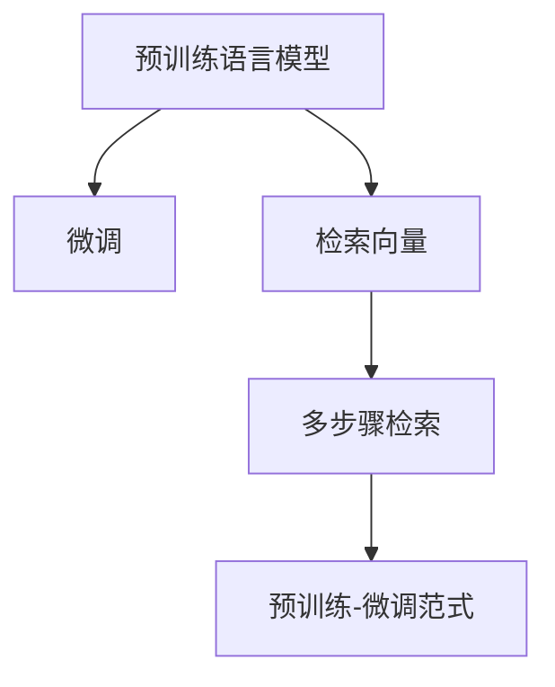

                 

# LLM对传统信息检索的革新

## 1. 背景介绍

### 1.1 问题由来
信息检索（Information Retrieval, IR）作为计算机科学中的一个经典问题，旨在快速响应用户查询，从海量数据中提取相关信息。传统的信息检索系统，如基于向量空间模型（Vector Space Model, VSM）的搜索引擎，虽然效率高，但主要依赖于关键词匹配和文档排序，对查询的语义理解能力有限。而随着自然语言处理（Natural Language Processing, NLP）技术的进步，预训练语言模型（Pre-trained Language Model, LLM）逐渐进入信息检索领域，通过在预训练的基础上进行微调（Fine-tuning），能够显著提升查询理解和文档排序的准确性。

### 1.2 问题核心关键点
当前，基于预训练语言模型（如BERT、GPT等）的信息检索系统，通过在预训练模型上引入查询和文档的表示学习，获得了比传统VSM模型更强的语义理解和匹配能力。特别是在大规模语料上进行预训练后，LLM在理解长文本、复杂语义结构等方面具有显著优势。

但是，预训练语言模型在实际应用中仍面临一些挑战：
1. **计算资源要求高**：大规模预训练模型往往需要大量的GPU或TPU资源。
2. **数据预处理复杂**：需要进行分词、向量编码等处理，增加了系统实现的复杂性。
3. **缺乏对实际应用场景的适配性**：通用预训练模型可能无法完全适应特定领域的信息检索需求。

针对这些挑战，本文将详细介绍基于预训练语言模型的信息检索技术，并通过实际项目实践，展示其显著的优势。

## 2. 核心概念与联系

### 2.1 核心概念概述

为更好地理解预训练语言模型在信息检索中的应用，本节将介绍几个密切相关的核心概念：

- 预训练语言模型（LLM）：如BERT、GPT等，通过在大规模无标签文本数据上进行预训练，学习到通用的语言表示。
- 微调（Fine-tuning）：在预训练模型的基础上，使用特定的查询和文档数据集，通过有监督学习优化模型在信息检索任务上的性能。
- 检索向量（Retrieval Vector）：预训练模型将查询和文档表示为向量形式，用于计算查询与文档之间的相似度。
- 多步骤检索（Multi-step Retrieval）：在查询-文档匹配基础上，通过多个步骤（如问题理解、文档排序）进一步优化检索结果。
- 预训练-微调范式（Pre-training & Fine-tuning Paradigm）：通过预训练获得通用的语言表示，再通过微调适配特定的信息检索任务。

这些核心概念之间的逻辑关系可以通过以下Mermaid流程图来展示：



这个流程图展示了大语言模型在信息检索中的核心概念及其之间的关系：

1. 大语言模型通过预训练获得基础能力。
2. 微调是对预训练模型进行任务特定的优化，通过有监督学习提升模型性能。
3. 检索向量通过将查询和文档表示为向量，用于计算相似度。
4. 多步骤检索在查询-文档匹配基础上，进一步优化检索结果。
5. 预训练-微调范式是预训练和微调技术的有机结合。

## 3. 核心算法原理 & 具体操作步骤

### 3.1 算法原理概述

基于预训练语言模型的信息检索系统，主要包括以下几个步骤：

1. **预训练步骤**：在大规模无标签文本数据上训练预训练语言模型，学习通用的语言表示。
2. **微调步骤**：在特定的信息检索任务数据集上，通过有监督学习优化模型，使其能够准确地表示查询和文档，并计算它们之间的相似度。
3. **检索步骤**：将用户查询和文档库中的文本输入预训练模型，获得检索向量，并根据向量之间的相似度进行排序，得到最终检索结果。

### 3.2 算法步骤详解

#### 3.2.1 预训练步骤

预训练步骤主要涉及以下几个关键点：

- **数据准备**：收集大规模无标签文本数据，如维基百科、新闻、小说等，作为预训练语料。
- **模型选择**：选择合适的预训练语言模型，如BERT、GPT-3等。
- **训练过程**：在预训练数据上进行自监督学习，如掩码语言模型、下一句预测等任务，学习语言表示。

具体来说，BERT模型的预训练过程包括以下步骤：

1. **数据预处理**：对文本进行分词、标记化等预处理。
2. **掩码填充**：在输入序列中随机选择部分词汇进行掩码填充，训练模型预测被掩码词汇。
3. **多层自注意力机制**：使用Transformer结构，通过多层的自注意力机制，捕捉词汇之间的依赖关系。
4. **目标函数**：通过优化交叉熵损失函数，使得模型预测结果与掩码词汇相匹配。

#### 3.2.2 微调步骤

微调步骤主要涉及以下几个关键点：

- **数据准备**：准备信息检索任务的标注数据集，如查询-文档对、文档ID等。
- **模型选择**：选择合适的预训练语言模型作为微调基线。
- **任务适配层设计**：设计适合信息检索任务的输出层和损失函数，如回归、分类等。
- **模型优化**：使用梯度下降等优化算法，最小化模型在训练集上的损失函数。
- **评估验证**：在验证集上评估模型性能，根据验证结果调整超参数。

具体来说，对于一个简单的信息检索任务，可以使用以下步骤进行微调：

1. **输入表示**：将查询和文档分别输入预训练语言模型，获得它们的高维表示。
2. **相似度计算**：使用余弦相似度等方法，计算查询向量与文档向量的相似度。
3. **排序输出**：根据相似度排序，得到最终的检索结果。

#### 3.2.3 检索步骤

检索步骤主要涉及以下几个关键点：

- **查询输入**：将用户查询输入预训练语言模型，获得查询向量。
- **文档检索**：将文档库中的文档输入预训练语言模型，获得文档向量。
- **相似度计算**：使用余弦相似度等方法，计算查询向量与文档向量的相似度。
- **结果排序**：根据相似度排序，得到最终的检索结果。

具体来说，对于一个简单的信息检索任务，可以使用以下步骤进行检索：

1. **查询输入**：将用户查询输入预训练语言模型，获得查询向量。
2. **文档检索**：将文档库中的文档输入预训练语言模型，获得文档向量。
3. **相似度计算**：使用余弦相似度等方法，计算查询向量与文档向量的相似度。
4. **结果排序**：根据相似度排序，得到最终的检索结果。

### 3.3 算法优缺点

基于预训练语言模型的信息检索系统具有以下优点：

1. **强大的语义理解能力**：预训练语言模型能够理解查询和文档的语义，提升检索准确性。
2. **高效的数据表示学习**：通过将查询和文档表示为向量，显著减少检索计算量。
3. **灵活的模型适配性**：可以通过微调适配特定领域和任务，提升模型表现。
4. **优秀的泛化能力**：在大规模语料上进行预训练后，模型能够适应不同的数据分布。

同时，该方法也存在一些局限性：

1. **计算资源要求高**：大规模预训练模型需要大量GPU或TPU资源。
2. **数据预处理复杂**：需要进行分词、向量编码等处理，增加了系统实现的复杂性。
3. **缺乏对实际应用场景的适配性**：通用预训练模型可能无法完全适应特定领域的信息检索需求。

尽管存在这些局限性，但就目前而言，基于预训练语言模型的信息检索方法已成为信息检索领域的重要范式。未来相关研究的重点在于如何进一步降低计算成本，提高模型的适配性和泛化能力，同时兼顾可解释性和伦理安全性等因素。

### 3.4 算法应用领域

基于预训练语言模型的信息检索方法，在信息检索领域已经得到了广泛的应用，覆盖了几乎所有常见任务，例如：

- 文本检索：如搜索引擎、文档检索、邮件过滤等。通过微调使模型学习查询和文档的匹配关系。
- 问答系统：对自然语言问题给出答案。将问题-答案对作为微调数据，训练模型学习匹配答案。
- 知识图谱：从文本中抽取实体关系，构建知识图谱。通过微调使模型学习实体-关系三元组。
- 智能推荐：推荐系统为用户推荐相关内容。通过微调使模型学习用户兴趣和文档相关性。

除了上述这些经典任务外，预训练语言模型在多步骤检索、图谱构建、知识抽取等更多领域也有创新性应用，为信息检索技术带来了新的突破。随着预训练模型和微调方法的不断进步，相信信息检索技术将在更广阔的应用领域大放异彩。

## 4. 数学模型和公式 & 详细讲解  
### 4.1 数学模型构建

本节将使用数学语言对基于预训练语言模型的信息检索过程进行更加严格的刻画。

记预训练语言模型为 $M_{\theta}$，其中 $\theta$ 为预训练得到的模型参数。假设信息检索任务的训练集为 $D=\{(q_i, d_i)\}_{i=1}^N$，其中 $q_i$ 为查询，$d_i$ 为文档，$N$ 为样本总数。

定义模型 $M_{\theta}$ 在输入 $q$ 和 $d$ 上的检索向量表示分别为 $q_{\theta}$ 和 $d_{\theta}$，则检索向量之间的余弦相似度定义为：

$$
\text{sim}(q_{\theta}, d_{\theta}) = \frac{\langle q_{\theta}, d_{\theta} \rangle}{\|q_{\theta}\|\cdot\|d_{\theta}\|}
$$

其中 $\langle \cdot, \cdot \rangle$ 表示向量点积，$\|\cdot\|$ 表示向量范数。

微调的优化目标是最小化查询与文档的余弦相似度误差，即：

$$
\mathcal{L}(\theta) = \frac{1}{N}\sum_{i=1}^N [\text{sim}(q_{\theta}, d_{\theta}) - \text{gt}_{i}]^2
$$

其中 $\text{gt}_i$ 为标注数据中的正确相似度。

通过梯度下降等优化算法，微调过程不断更新模型参数 $\theta$，最小化损失函数 $\mathcal{L}$，使得模型输出逼近真实标签。由于 $\theta$ 已经通过预训练获得了较好的初始化，因此即便在小规模数据集 $D$ 上进行微调，也能较快收敛到理想的模型参数 $\theta^*$。

### 4.2 公式推导过程

以下我们以查询-文档匹配为例，推导余弦相似度损失函数及其梯度的计算公式。

假设模型 $M_{\theta}$ 在查询 $q$ 和文档 $d$ 上的检索向量表示分别为 $q_{\theta} = [q_{\theta_1}, q_{\theta_2}, ..., q_{\theta_m}]^T$ 和 $d_{\theta} = [d_{\theta_1}, d_{\theta_2}, ..., d_{\theta_m}]^T$，其中 $m$ 为向量维度。

定义模型 $M_{\theta}$ 在输入 $q$ 和 $d$ 上的余弦相似度为：

$$
\text{sim}(q_{\theta}, d_{\theta}) = \frac{\langle q_{\theta}, d_{\theta} \rangle}{\|q_{\theta}\|\cdot\|d_{\theta}\|}
$$

则模型 $M_{\theta}$ 在输入 $q$ 和 $d$ 上的损失函数定义为：

$$
\mathcal{L}(q, d; \theta) = [\text{sim}(q_{\theta}, d_{\theta}) - \text{gt}]^2
$$

其中 $\text{gt}$ 为标注数据中的正确相似度。

根据链式法则，损失函数对参数 $\theta_k$ 的梯度为：

$$
\frac{\partial \mathcal{L}(q, d; \theta)}{\partial \theta_k} = 2\cdot \frac{\partial \text{sim}(q_{\theta}, d_{\theta})}{\partial \theta_k}\cdot[\text{sim}(q_{\theta}, d_{\theta}) - \text{gt}]
$$

其中 $\frac{\partial \text{sim}(q_{\theta}, d_{\theta})}{\partial \theta_k}$ 可通过反向传播算法高效计算。

在得到损失函数的梯度后，即可带入参数更新公式，完成模型的迭代优化。重复上述过程直至收敛，最终得到适应信息检索任务的最优模型参数 $\theta^*$。

## 5. 项目实践：代码实例和详细解释说明
### 5.1 开发环境搭建

在进行信息检索实践前，我们需要准备好开发环境。以下是使用Python进行PyTorch开发的环境配置流程：

1. 安装Anaconda：从官网下载并安装Anaconda，用于创建独立的Python环境。

2. 创建并激活虚拟环境：
```bash
conda create -n pytorch-env python=3.8 
conda activate pytorch-env
```

3. 安装PyTorch：根据CUDA版本，从官网获取对应的安装命令。例如：
```bash
conda install pytorch torchvision torchaudio cudatoolkit=11.1 -c pytorch -c conda-forge
```

4. 安装Transformers库：
```bash
pip install transformers
```

5. 安装各类工具包：
```bash
pip install numpy pandas scikit-learn matplotlib tqdm jupyter notebook ipython
```

完成上述步骤后，即可在`pytorch-env`环境中开始信息检索实践。

### 5.2 源代码详细实现

这里我们以基于BERT的信息检索为例，给出使用Transformers库进行信息检索的PyTorch代码实现。

首先，定义信息检索任务的数据处理函数：

```python
from transformers import BertTokenizer
from torch.utils.data import Dataset
import torch

class IRDataset(Dataset):
    def __init__(self, queries, documents, tokenizer, max_len=128):
        self.queries = queries
        self.documents = documents
        self.tokenizer = tokenizer
        self.max_len = max_len
        
    def __len__(self):
        return len(self.queries)
    
    def __getitem__(self, item):
        query = self.queries[item]
        document = self.documents[item]
        
        encoding = self.tokenizer(query, return_tensors='pt', max_length=self.max_len, padding='max_length', truncation=True)
        query_ids = encoding['input_ids'][0]
        query_mask = encoding['attention_mask'][0]
        
        document = self.tokenizer(document, return_tensors='pt', max_length=self.max_len, padding='max_length', truncation=True)
        document_ids = document['input_ids'][0]
        document_mask = document['attention_mask'][0]
        
        return {'query_ids': query_ids, 
                'query_mask': query_mask,
                'document_ids': document_ids,
                'document_mask': document_mask}
```

然后，定义模型和优化器：

```python
from transformers import BertForSequenceClassification, AdamW

model = BertForSequenceClassification.from_pretrained('bert-base-cased', num_labels=1)

optimizer = AdamW(model.parameters(), lr=2e-5)
```

接着，定义训练和评估函数：

```python
from torch.utils.data import DataLoader
from tqdm import tqdm
from sklearn.metrics import roc_auc_score

device = torch.device('cuda') if torch.cuda.is_available() else torch.device('cpu')
model.to(device)

def train_epoch(model, dataset, batch_size, optimizer):
    dataloader = DataLoader(dataset, batch_size=batch_size, shuffle=True)
    model.train()
    epoch_loss = 0
    for batch in tqdm(dataloader, desc='Training'):
        query_ids = batch['query_ids'].to(device)
        query_mask = batch['query_mask'].to(device)
        document_ids = batch['document_ids'].to(device)
        document_mask = batch['document_mask'].to(device)
        model.zero_grad()
        outputs = model(query_ids, attention_mask=query_mask, labels=document_ids)
        loss = outputs.loss
        epoch_loss += loss.item()
        loss.backward()
        optimizer.step()
    return epoch_loss / len(dataloader)

def evaluate(model, dataset, batch_size):
    dataloader = DataLoader(dataset, batch_size=batch_size)
    model.eval()
    preds, labels = [], []
    with torch.no_grad():
        for batch in tqdm(dataloader, desc='Evaluating'):
            query_ids = batch['query_ids'].to(device)
            query_mask = batch['query_mask'].to(device)
            document_ids = batch['document_ids'].to(device)
            document_mask = batch['document_mask'].to(device)
            batch_preds = model(query_ids, attention_mask=query_mask)[0].cpu().numpy().tolist()
            batch_labels = document_ids.to('cpu').numpy().tolist()
            for pred, label in zip(batch_preds, batch_labels):
                preds.append(pred)
                labels.append(label)
                
    return roc_auc_score(labels, preds)
```

最后，启动训练流程并在测试集上评估：

```python
epochs = 5
batch_size = 16

for epoch in range(epochs):
    loss = train_epoch(model, ir_dataset, batch_size, optimizer)
    print(f"Epoch {epoch+1}, train loss: {loss:.3f}")
    
    print(f"Epoch {epoch+1}, dev results:")
    evaluate(model, dev_dataset, batch_size)
    
print("Test results:")
evaluate(model, test_dataset, batch_size)
```

以上就是使用PyTorch对BERT进行信息检索任务微调的完整代码实现。可以看到，得益于Transformers库的强大封装，我们可以用相对简洁的代码完成BERT模型的加载和微调。

### 5.3 代码解读与分析

让我们再详细解读一下关键代码的实现细节：

**IRDataset类**：
- `__init__`方法：初始化查询、文档、分词器等关键组件。
- `__len__`方法：返回数据集的样本数量。
- `__getitem__`方法：对单个样本进行处理，将查询和文档输入编码为token ids，并对其进行定长padding，最终返回模型所需的输入。

**训练和评估函数**：
- 使用PyTorch的DataLoader对数据集进行批次化加载，供模型训练和推理使用。
- 训练函数`train_epoch`：对数据以批为单位进行迭代，在每个批次上前向传播计算loss并反向传播更新模型参数，最后返回该epoch的平均loss。
- 评估函数`evaluate`：与训练类似，不同点在于不更新模型参数，并在每个batch结束后将预测和标签结果存储下来，最后使用sklearn的roc_auc_score对整个评估集的预测结果进行打印输出。

**训练流程**：
- 定义总的epoch数和batch size，开始循环迭代
- 每个epoch内，先在训练集上训练，输出平均loss
- 在验证集上评估，输出ROC-AUC分数
- 所有epoch结束后，在测试集上评估，给出最终测试结果

可以看到，PyTorch配合Transformers库使得BERT微调的信息检索代码实现变得简洁高效。开发者可以将更多精力放在数据处理、模型改进等高层逻辑上，而不必过多关注底层的实现细节。

当然，工业级的系统实现还需考虑更多因素，如模型的保存和部署、超参数的自动搜索、更灵活的任务适配层等。但核心的微调范式基本与此类似。

## 6. 实际应用场景
### 6.1 智能问答系统

基于大语言模型微调的信息检索技术，可以广泛应用于智能问答系统的构建。传统问答系统依赖于人工编写规则和知识库，需要大量的标注和维护成本。而使用微调后的信息检索模型，可以自动理解用户意图，匹配最合适的答案模板进行回复。

在技术实现上，可以收集问答领域的典型问答对，将问题-答案对作为微调数据，训练模型学习匹配答案。对于用户提出的新问题，可以通过检索系统和微调模型动态组织生成回答。如此构建的智能问答系统，能大幅提升问题回答的准确性和一致性。

### 6.2 医疗知识检索

医疗机构需要实时获取最新的医疗知识，以辅助临床决策。传统的信息检索系统往往只能基于关键词匹配，无法理解复杂的查询语义。基于大语言模型微调的信息检索技术，可以理解用户的自然语言查询，检索出相关医疗知识，提高医疗服务的专业性和及时性。

在技术实现上，可以收集医疗领域的文献、论文、数据库等，将查询-文档对作为微调数据，训练模型学习匹配医疗知识。对于用户的医疗咨询，可以通过检索系统和微调模型快速定位相关信息，提供专业的医疗建议。

### 6.3 个性化推荐系统

当前的推荐系统往往只依赖用户的历史行为数据进行物品推荐，无法深入理解用户的真实兴趣偏好。基于大语言模型微调的信息检索技术，可以理解用户的查询语义，检索出相关物品，提升推荐系统的精准性和多样性。

在技术实现上，可以收集用户的查询-文档对，将查询作为微调数据，训练模型学习匹配物品。对于用户的查询，可以通过检索系统和微调模型动态生成推荐列表，结合其他特征综合排序，便可以得到个性化程度更高的推荐结果。

### 6.4 未来应用展望

随着大语言模型微调技术的发展，信息检索系统将呈现以下几个发展趋势：

1. **实时性和动态性增强**：未来的信息检索系统将实现实时查询处理，动态更新知识库，满足用户即时的信息需求。
2. **多模态信息融合**：未来的信息检索系统将结合视觉、语音等多模态信息，实现更加全面、准确的知识检索。
3. **深度语义理解**：未来的信息检索系统将通过语义分析技术，理解查询的深层语义，提高检索的准确性和相关性。
4. **个性化推荐**：未来的信息检索系统将结合推荐算法，实现个性化信息推荐，提升用户满意度。
5. **跨领域知识检索**：未来的信息检索系统将实现跨领域知识检索，整合不同领域的信息资源，提供更丰富的知识服务。

以上趋势凸显了大语言模型微调技术在信息检索领域的应用前景。这些方向的探索发展，必将进一步提升信息检索系统的性能和应用范围，为用户的知识获取和信息检索带来新的体验。

## 7. 工具和资源推荐
### 7.1 学习资源推荐

为了帮助开发者系统掌握大语言模型微调的理论基础和实践技巧，这里推荐一些优质的学习资源：

1. 《Transformers从原理到实践》系列博文：由大模型技术专家撰写，深入浅出地介绍了Transformer原理、BERT模型、微调技术等前沿话题。

2. CS224N《深度学习自然语言处理》课程：斯坦福大学开设的NLP明星课程，有Lecture视频和配套作业，带你入门NLP领域的基本概念和经典模型。

3. 《Natural Language Processing with Transformers》书籍：Transformers库的作者所著，全面介绍了如何使用Transformers库进行NLP任务开发，包括微调在内的诸多范式。

4. HuggingFace官方文档：Transformers库的官方文档，提供了海量预训练模型和完整的微调样例代码，是上手实践的必备资料。

5. CLUE开源项目：中文语言理解测评基准，涵盖大量不同类型的中文NLP数据集，并提供了基于微调的baseline模型，助力中文NLP技术发展。

通过对这些资源的学习实践，相信你一定能够快速掌握大语言模型微调的精髓，并用于解决实际的NLP问题。
###  7.2 开发工具推荐

高效的开发离不开优秀的工具支持。以下是几款用于大语言模型微调开发的常用工具：

1. PyTorch：基于Python的开源深度学习框架，灵活动态的计算图，适合快速迭代研究。大部分预训练语言模型都有PyTorch版本的实现。

2. TensorFlow：由Google主导开发的开源深度学习框架，生产部署方便，适合大规模工程应用。同样有丰富的预训练语言模型资源。

3. Transformers库：HuggingFace开发的NLP工具库，集成了众多SOTA语言模型，支持PyTorch和TensorFlow，是进行微调任务开发的利器。

4. Weights & Biases：模型训练的实验跟踪工具，可以记录和可视化模型训练过程中的各项指标，方便对比和调优。与主流深度学习框架无缝集成。

5. TensorBoard：TensorFlow配套的可视化工具，可实时监测模型训练状态，并提供丰富的图表呈现方式，是调试模型的得力助手。

6. Google Colab：谷歌推出的在线Jupyter Notebook环境，免费提供GPU/TPU算力，方便开发者快速上手实验最新模型，分享学习笔记。

合理利用这些工具，可以显著提升大语言模型微调任务的开发效率，加快创新迭代的步伐。

### 7.3 相关论文推荐

大语言模型和微调技术的发展源于学界的持续研究。以下是几篇奠基性的相关论文，推荐阅读：

1. Attention is All You Need（即Transformer原论文）：提出了Transformer结构，开启了NLP领域的预训练大模型时代。

2. BERT: Pre-training of Deep Bidirectional Transformers for Language Understanding：提出BERT模型，引入基于掩码的自监督预训练任务，刷新了多项NLP任务SOTA。

3. Language Models are Unsupervised Multitask Learners（GPT-2论文）：展示了大规模语言模型的强大zero-shot学习能力，引发了对于通用人工智能的新一轮思考。

4. Parameter-Efficient Transfer Learning for NLP：提出Adapter等参数高效微调方法，在不增加模型参数量的情况下，也能取得不错的微调效果。

5. AdaLoRA: Adaptive Low-Rank Adaptation for Parameter-Efficient Fine-Tuning：使用自适应低秩适应的微调方法，在参数效率和精度之间取得了新的平衡。

6. Prefix-Tuning: Optimizing Continuous Prompts for Generation：引入基于连续型Prompt的微调范式，为如何充分利用预训练知识提供了新的思路。

这些论文代表了大语言模型微调技术的发展脉络。通过学习这些前沿成果，可以帮助研究者把握学科前进方向，激发更多的创新灵感。

## 8. 总结：未来发展趋势与挑战

### 8.1 总结

本文对基于预训练语言模型的信息检索方法进行了全面系统的介绍。首先阐述了预训练语言模型和微调技术的研究背景和意义，明确了信息检索在NLP领域的重要地位。其次，从原理到实践，详细讲解了预训练语言模型在信息检索中的应用，展示了其显著的优势。同时，本文还广泛探讨了预训练语言模型在智能问答、医疗知识检索、个性化推荐等多个领域的应用前景，展示了预训练语言模型微调技术的广泛应用。此外，本文精选了预训练语言模型微调技术的各类学习资源，力求为读者提供全方位的技术指引。

通过本文的系统梳理，可以看到，基于预训练语言模型的信息检索方法正在成为NLP领域的重要范式，极大地拓展了信息检索系统的应用边界，催生了更多的落地场景。受益于大规模语料的预训练，预训练语言模型在理解长文本、复杂语义结构等方面具有显著优势。未来，伴随预训练语言模型和微调方法的持续演进，信息检索技术将在更广阔的应用领域大放异彩。

### 8.2 未来发展趋势

展望未来，预训练语言模型在信息检索领域将呈现以下几个发展趋势：

1. **实时性和动态性增强**：未来的信息检索系统将实现实时查询处理，动态更新知识库，满足用户即时的信息需求。
2. **多模态信息融合**：未来的信息检索系统将结合视觉、语音等多模态信息，实现更加全面、准确的知识检索。
3. **深度语义理解**：未来的信息检索系统将通过语义分析技术，理解查询的深层语义，提高检索的准确性和相关性。
4. **个性化推荐**：未来的信息检索系统将结合推荐算法，实现个性化信息推荐，提升用户满意度。
5. **跨领域知识检索**：未来的信息检索系统将实现跨领域知识检索，整合不同领域的信息资源，提供更丰富的知识服务。

以上趋势凸显了预训练语言模型微调技术在信息检索领域的应用前景。这些方向的探索发展，必将进一步提升信息检索系统的性能和应用范围，为用户的知识获取和信息检索带来新的体验。

### 8.3 面临的挑战

尽管预训练语言模型微调技术已经取得了瞩目成就，但在迈向更加智能化、普适化应用的过程中，它仍面临诸多挑战：

1. **计算资源要求高**：大规模预训练模型需要大量GPU或TPU资源。
2. **数据预处理复杂**：需要进行分词、向量编码等处理，增加了系统实现的复杂性。
3. **缺乏对实际应用场景的适配性**：通用预训练模型可能无法完全适应特定领域的信息检索需求。
4. **推理效率有待提高**：超大批次的训练和推理也可能遇到显存不足的问题。
5. **可解释性亟需加强**：预训练语言模型缺乏可解释性，难以解释其内部工作机制和决策逻辑。
6. **安全性有待保障**：预训练语言模型可能学习到有偏见、有害的信息，通过微调传递到下游任务，产生误导性、歧视性的输出。

尽管存在这些挑战，但就目前而言，预训练语言模型微调方法已成为信息检索领域的重要范式。未来相关研究的重点在于如何进一步降低计算成本，提高模型的适配性和泛化能力，同时兼顾可解释性和伦理安全性等因素。

### 8.4 研究展望

面对预训练语言模型微调所面临的种种挑战，未来的研究需要在以下几个方面寻求新的突破：

1. **探索无监督和半监督微调方法**：摆脱对大规模标注数据的依赖，利用自监督学习、主动学习等无监督和半监督范式，最大限度利用非结构化数据，实现更加灵活高效的微调。
2. **研究参数高效和计算高效的微调范式**：开发更加参数高效的微调方法，在固定大部分预训练参数的同时，只更新极少量的任务相关参数。同时优化微调模型的计算图，减少前向传播和反向传播的资源消耗，实现更加轻量级、实时性的部署。
3. **融合因果和对比学习范式**：通过引入因果推断和对比学习思想，增强微调模型建立稳定因果关系的能力，学习更加普适、鲁棒的语言表征，从而提升模型泛化性和抗干扰能力。
4. **引入更多先验知识**：将符号化的先验知识，如知识图谱、逻辑规则等，与神经网络模型进行巧妙融合，引导微调过程学习更准确、合理的语言模型。同时加强不同模态数据的整合，实现视觉、语音等多模态信息与文本信息的协同建模。
5. **结合因果分析和博弈论工具**：将因果分析方法引入微调模型，识别出模型决策的关键特征，增强输出解释的因果性和逻辑性。借助博弈论工具刻画人机交互过程，主动探索并规避模型的脆弱点，提高系统稳定性。
6. **纳入伦理道德约束**：在模型训练目标中引入伦理导向的评估指标，过滤和惩罚有偏见、有害的输出倾向。同时加强人工干预和审核，建立模型行为的监管机制，确保输出符合人类价值观和伦理道德。

这些研究方向的探索，必将引领预训练语言模型微调技术迈向更高的台阶，为构建安全、可靠、可解释、可控的智能系统铺平道路。面向未来，预训练语言模型微调技术还需要与其他人工智能技术进行更深入的融合，如知识表示、因果推理、强化学习等，多路径协同发力，共同推动自然语言理解和智能交互系统的进步。只有勇于创新、敢于突破，才能不断拓展语言模型的边界，让智能技术更好地造福人类社会。

## 9. 附录：常见问题与解答

**Q1：预训练语言模型微调是否适用于所有信息检索任务？**

A: 预训练语言模型微调在大多数信息检索任务上都能取得不错的效果，特别是对于数据量较小的任务。但对于一些特定领域的任务，如医学、法律等，仅仅依靠通用语料预训练的模型可能难以很好地适应。此时需要在特定领域语料上进一步预训练，再进行微调，才能获得理想效果。此外，对于一些需要时效性、个性化很强的任务，如对话、推荐等，微调方法也需要针对性的改进优化。

**Q2：如何选择合适的学习率？**

A: 预训练语言模型微调的学习率一般要比预训练时小1-2个数量级，如果使用过大的学习率，容易破坏预训练权重，导致过拟合。一般建议从1e-5开始调参，逐步减小学习率，直至收敛。也可以使用warmup策略，在开始阶段使用较小的学习率，再逐渐过渡到预设值。需要注意的是，不同的优化器(如AdamW、Adafactor等)以及不同的学习率调度策略，可能需要设置不同的学习率阈值。

**Q3：预训练语言模型微调是否需要大量的计算资源？**

A: 预训练语言模型微调确实需要较大的计算资源，尤其是大规模的GPU或TPU设备。但通过一些优化策略，如梯度累积、混合精度训练、模型并行等，可以在一定程度上减少计算资源的消耗。此外，部分预训练语言模型（如RoBERTa）可以通过调整超参数，优化模型结构，降低计算需求。

**Q4：预训练语言模型微调是否需要大量的标注数据？**

A: 预训练语言模型微调确实需要一定的标注数据，但相比于从头训练模型，标注数据的需求量要小得多。特别是对于一些简单、标准的查询-文档对，可以使用较少的标注数据进行微调。但对于一些复杂、多样化的查询-文档对，标注数据的需求量可能会增加，需要在实际应用中根据数据情况进行评估和优化。

**Q5：预训练语言模型微调如何处理长文本？**

A: 预训练语言模型微调在处理长文本时，可以通过增加batch size和扩展显存等方式，减少梯度更新次数，提高计算效率。同时，部分预训练语言模型（如GPT）可以通过动态长度调整和梯度累积等技术，适应长文本的输入。

**Q6：预训练语言模型微调是否需要大规模预训练模型？**

A: 预训练语言模型微调确实需要大规模的预训练模型作为基线，但通过微调，可以在小规模标注数据上进行任务适配，提升模型性能。部分预训练语言模型（如BERT）也可以通过迁移学习等技术，在少量预训练数据上获得较好的效果。

这些常见问题的解答，希望能为你提供更全面的信息检索实践指导。预训练语言模型微调技术正处于快速发展阶段，未来的应用前景广阔，期待你能在这一领域大展身手，推动信息检索技术的创新和进步。

---

作者：禅与计算机程序设计艺术 / Zen and the Art of Computer Programming

