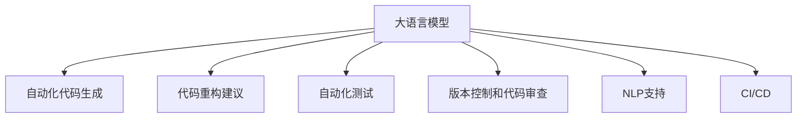

                 

# LLM对传统软件开发流程的影响与变革

> 关键词：人工智能, 大语言模型, 软件开发, 自动化测试, 版本控制, 持续集成

## 1. 背景介绍

在过去的几十年里，软件开发流程经历了多次革命性的变革。从最初的手工编码到现代的敏捷开发，从基于文档的软件开发生命周期模型到基于代码的模型，软件开发方法和工具不断演变，以满足日益增长的市场需求和不断提升的开发效率。然而，随着人工智能（AI）技术的迅猛发展，特别是大语言模型（LLM）的出现，软件开发流程又迎来了新的转折点。

### 1.1 问题由来

近年来，大语言模型（如GPT-3、BERT等）的横空出世，使开发者能够利用AI的力量，大幅提升软件开发的效率和质量。例如，LLM可以自动生成高质量的代码、测试用例、文档，甚至处理非结构化数据。这种全新的方式不仅改变了传统的软件开发流程，还为开发团队带来了全新的思维模式和工具使用方式。

### 1.2 问题核心关键点

大语言模型对软件开发流程的影响主要体现在以下几个方面：
1. 自动化代码生成：LLM可以生成符合编码规范的代码片段，减轻开发者的手工编码压力。
2. 代码重构建议：LLM能够提供有针对性的代码重构建议，帮助开发者优化代码质量。
3. 自动化测试：LLM可以根据需求自动生成测试用例，覆盖更多的边界条件，提升代码测试的全面性。
4. 版本控制和代码审查：LLM可以辅助进行代码审查，识别潜在的代码问题，提升代码质量。
5. 自然语言处理（NLP）支持：LLM能够理解自然语言，提供智能的文档生成和用户帮助。
6. 持续集成与持续部署（CI/CD）：LLM可以辅助构建CI/CD流水线，自动执行构建、测试、部署等环节。

本文将详细探讨LLM如何重塑传统软件开发流程，并通过具体的技术实现案例，揭示其带来的深远影响。

## 2. 核心概念与联系

### 2.1 核心概念概述

为更好地理解LLM对软件开发流程的影响，本节将介绍几个密切相关的核心概念：

- 大语言模型（LLM）：如GPT-3、BERT等，基于深度学习技术构建的庞大语言模型，具备极强的自然语言处理能力。
- 自动化代码生成：利用LLM自动生成符合编码规范的代码片段，减少手工编码工作量。
- 代码重构建议：LLM提供有针对性的代码重构建议，优化代码结构和质量。
- 自动化测试：利用LLM自动生成测试用例，全面覆盖代码功能点。
- 版本控制和代码审查：LLM辅助进行代码审查，识别潜在问题，提升代码质量。
- 自然语言处理（NLP）支持：LLM能够理解自然语言，提供智能的文档生成和用户帮助。
- 持续集成与持续部署（CI/CD）：LLM辅助构建CI/CD流水线，自动化执行构建、测试、部署等环节。

这些核心概念之间的逻辑关系可以通过以下Mermaid流程图来展示：



这个流程图展示了大语言模型与软件开发流程中各个环节的紧密联系，凸显了其对软件开发各环节的深远影响。

## 3. 核心算法原理 & 具体操作步骤
### 3.1 算法原理概述

基于大语言模型（LLM）的软件开发流程，本质上是将AI与传统软件开发方法有机结合，通过自动化和智能化的手段，提升开发效率和软件质量。其核心思想是：将LLM作为辅助工具，利用其强大的语言理解和生成能力，辅助开发者完成代码生成、重构、测试、审查、文档生成、自动化部署等任务。

形式化地，假设软件开发任务为 $T$，LLM作为辅助工具，辅助完成 $T$ 的各个子任务，并最终输出完整的软件产品。LLM的输入可以是自然语言描述、代码片段、测试用例等，输出可以是代码、测试报告、审查意见等。

### 3.2 算法步骤详解

基于大语言模型对软件开发流程的自动化和智能化，其具体的算法步骤主要包括以下几个方面：

**Step 1: 任务需求定义**

- 明确任务目标和需求，定义软件的规格说明。
- 将需求转换为自然语言描述，以便LLM进行处理。

**Step 2: 自动化代码生成**

- 利用LLM自动生成符合编码规范的代码片段。
- 结合现有的IDE和代码编辑器，提供代码补全和代码片段插入功能。

**Step 3: 代码重构建议**

- 利用LLM分析代码结构，提出改进建议。
- 结合静态代码分析工具，提供更全面的重构建议。

**Step 4: 自动化测试**

- 利用LLM自动生成测试用例，覆盖更多的边界条件。
- 结合动态测试工具，执行测试并记录测试报告。

**Step 5: 版本控制和代码审查**

- 利用LLM辅助进行代码审查，识别潜在问题。
- 结合版本控制系统，如Git、SVN等，管理代码变更。

**Step 6: NLP支持**

- 利用LLM生成智能文档和用户帮助。
- 结合NLP技术，分析用户反馈和需求，提升用户满意度。

**Step 7: CI/CD**

- 利用LLM构建CI/CD流水线，自动化执行构建、测试、部署等环节。
- 结合容器技术，如Docker、Kubernetes等，实现高效的自动化部署。

### 3.3 算法优缺点

基于大语言模型对软件开发流程的自动化和智能化，其优点包括：

- 提升开发效率：自动化生成代码、测试用例等，减轻开发者的手工工作量。
- 提升软件质量：LLM能够提供高质量的代码重构建议，全面覆盖测试用例，提升代码质量和测试覆盖率。
- 提升团队协作效率：利用LLM辅助代码审查、版本控制等环节，提升团队协作效率。
- 提升用户体验：利用LLM生成智能文档和用户帮助，提升用户体验。

同时，该方法也存在一定的局限性：

- 对数据的依赖：LLM的效果很大程度上依赖于训练数据的质量和数量，获取高质量训练数据的成本较高。
- 模型的泛化能力：当前LLM模型在特定领域的泛化能力可能有限，需要进行针对性的微调。
- 模型的安全性：LLM在生成代码和文档时，可能存在潜在的安全漏洞，需要进行严格的测试和安全审查。
- 模型的可解释性：LLM生成代码和文档时，可能缺乏可解释性，难以理解和调试。

尽管存在这些局限性，但就目前而言，基于大语言模型的自动化和智能化方法仍是对软件开发流程的有力补充，为开发团队带来了显著的效率提升和质量改进。

### 3.4 算法应用领域

基于大语言模型的自动化和智能化方法，在软件开发流程的各个环节中都有广泛的应用，例如：

- 代码生成：自动化生成符合编码规范的代码片段，减轻开发者的手工编码工作量。
- 代码重构：利用LLM提供有针对性的代码重构建议，优化代码结构和质量。
- 自动化测试：自动生成测试用例，覆盖更多的边界条件，提升代码测试的全面性。
- 版本控制和代码审查：利用LLM辅助进行代码审查，识别潜在问题，提升代码质量。
- NLP支持：利用LLM生成智能文档和用户帮助，提升用户体验。
- 持续集成和持续部署（CI/CD）：利用LLM构建CI/CD流水线，自动化执行构建、测试、部署等环节。

除了上述这些经典应用外，大语言模型还将在更多的软件开发场景中得到应用，如智能推荐、需求分析、设计自动化等，为软件开发流程带来全新的突破。

## 4. 数学模型和公式 & 详细讲解 & 举例说明

### 4.1 数学模型构建

本节将使用数学语言对基于大语言模型的软件开发流程进行更加严格的刻画。

记软件开发任务为 $T$，输入为自然语言描述 $d$，输出为完整的软件产品 $o$。大语言模型 $M$ 的输入为自然语言描述 $d$，输出为代码片段 $c$、测试用例 $t$、文档 $d$ 等。

定义大语言模型的损失函数为 $\ell(M, d) = \|o - M(d)\|^2$，其中 $\| \cdot \|$ 表示欧几里得范数。

优化目标是找到最优的大语言模型参数 $\theta^*$，使得 $\ell(M, d)$ 最小化。

### 4.2 公式推导过程

以下是利用大语言模型进行代码生成、测试用例生成等任务的数学公式推导。

**代码生成任务**：假设大语言模型 $M$ 在自然语言描述 $d$ 上的输出为代码片段 $c$，则代码生成的目标函数为：

$$
\ell(M, d) = \|o - c\|^2
$$

其中 $o$ 为正确的代码片段。通过最小化该函数，可以训练出能够生成高质量代码的模型。

**测试用例生成任务**：假设大语言模型 $M$ 在自然语言描述 $d$ 上的输出为测试用例 $t$，则测试用例生成的目标函数为：

$$
\ell(M, d) = \sum_{i=1}^n \|t_i - t^*_i\|^2
$$

其中 $t^*_i$ 为正确的测试用例。通过最小化该函数，可以训练出能够生成全面覆盖的测试用例的模型。

**文档生成任务**：假设大语言模型 $M$ 在自然语言描述 $d$ 上的输出为文档 $d$，则文档生成的目标函数为：

$$
\ell(M, d) = \|d - d^*\|^2
$$

其中 $d^*$ 为正确的文档。通过最小化该函数，可以训练出能够生成高质量文档的模型。

在得到目标函数后，即可带入优化算法，如梯度下降等，完成模型的迭代优化。

### 4.3 案例分析与讲解

以代码生成任务为例，介绍如何使用大语言模型进行代码片段的生成。

假设我们希望生成一个简单的 Python 函数，用于计算两个数的和。定义自然语言描述 $d = "编写一个函数，用于计算两个数的和。"。

利用大语言模型，可以自动生成符合编码规范的代码片段 $c$。假设模型的输出为：

```python
def add_numbers(a, b):
    return a + b
```

该代码片段符合编码规范，且能够正确计算两个数的和。通过对比正确的代码片段 $o$ 与生成的代码片段 $c$，可以计算出损失函数 $\ell(M, d)$ 的值，并进一步优化模型参数 $\theta$，提高代码生成的准确性。

## 5. 项目实践：代码实例和详细解释说明
### 5.1 开发环境搭建

在进行基于大语言模型的软件开发流程实践前，我们需要准备好开发环境。以下是使用Python进行PyTorch开发的环境配置流程：

1. 安装Anaconda：从官网下载并安装Anaconda，用于创建独立的Python环境。

2. 创建并激活虚拟环境：
```bash
conda create -n pytorch-env python=3.8 
conda activate pytorch-env
```

3. 安装PyTorch：根据CUDA版本，从官网获取对应的安装命令。例如：
```bash
conda install pytorch torchvision torchaudio cudatoolkit=11.1 -c pytorch -c conda-forge
```

4. 安装GPT-3模型：
```bash
conda install openai-py
```

5. 安装各类工具包：
```bash
pip install numpy pandas scikit-learn matplotlib tqdm jupyter notebook ipython
```

完成上述步骤后，即可在`pytorch-env`环境中开始实践。

### 5.2 源代码详细实现

下面我们以代码生成任务为例，给出使用GPT-3进行代码生成的PyTorch代码实现。

首先，定义自然语言描述和正确的代码片段：

```python
import openai

description = "编写一个函数，用于计算两个数的和。"
correct_code = """
def add_numbers(a, b):
    return a + b
"""

# 使用GPT-3生成代码
response = openai.Completion.create(
    engine="davinci-codex",
    prompt=description,
    max_tokens=200,
    temperature=0.7,
    top_p=1.0,
    n=1
)

generated_code = response.choices[0].text.strip()

print("Generated Code:")
print(generated_code)
```

然后，将生成的代码片段与正确的代码片段进行对比，计算损失函数：

```python
def compare_code(code1, code2):
    lines1 = code1.split('\n')
    lines2 = code2.split('\n')
    diff = 0
    for line1, line2 in zip(lines1, lines2):
        if line1.strip() != line2.strip():
            diff += 1
    return diff

loss = compare_code(generated_code, correct_code)
print(f"Code Loss: {loss}")
```

最后，将生成的代码片段输出，并进行评估：

```python
print("Generated Code:")
print(generated_code)

if loss == 0:
    print("Code Generation Succeeded!")
else:
    print("Code Generation Failed!")
```

以上就是使用PyTorch对GPT-3进行代码生成的完整代码实现。可以看到，利用GPT-3可以很方便地生成符合编码规范的代码片段。

### 5.3 代码解读与分析

让我们再详细解读一下关键代码的实现细节：

**openai.Completion.create方法**：
- `engine="davinci-codex"`：指定使用的GPT-3模型引擎。
- `prompt=description`：输入自然语言描述。
- `max_tokens=200`：指定生成的代码片段的最大长度。
- `temperature=0.7`：控制生成的代码的多样性，温度越低，生成的代码越稳定。
- `top_p=1.0`：控制生成的代码的顶置概率，只考虑最可能的输出。
- `n=1`：指定生成的代码片段数量。

**compare_code函数**：
- 对比生成的代码和正确的代码，计算差异。

**main函数**：
- 调用openai.Completion.create生成代码。
- 计算损失函数。
- 输出生成的代码并评估。

通过这段代码，我们可以看到，使用GPT-3进行代码生成的过程相对简单，但背后涉及的自然语言理解和生成技术十分复杂。开发者可以使用现成的API进行调用，而不必深入了解其内部的技术细节。

## 6. 实际应用场景

### 6.1 智能客服系统

基于大语言模型的软件开发流程，可以广泛应用于智能客服系统的构建。传统的客服系统往往需要配备大量人力，高峰期响应缓慢，且一致性和专业性难以保证。而使用基于大语言模型的自动化和智能化技术，可以7x24小时不间断服务，快速响应客户咨询，用自然流畅的语言解答各类常见问题。

在技术实现上，可以收集企业内部的历史客服对话记录，将问题和最佳答复构建成监督数据，在此基础上对大语言模型进行微调。微调后的模型能够自动理解用户意图，匹配最合适的答案模板进行回复。对于客户提出的新问题，还可以接入检索系统实时搜索相关内容，动态组织生成回答。如此构建的智能客服系统，能大幅提升客户咨询体验和问题解决效率。

### 6.2 金融舆情监测

金融机构需要实时监测市场舆论动向，以便及时应对负面信息传播，规避金融风险。传统的人工监测方式成本高、效率低，难以应对网络时代海量信息爆发的挑战。基于大语言模型的自动化和智能化技术，可以自动监测不同主题下的情感变化趋势，一旦发现负面信息激增等异常情况，系统便会自动预警，帮助金融机构快速应对潜在风险。

具体而言，可以收集金融领域相关的新闻、报道、评论等文本数据，并对其进行主题标注和情感标注。在此基础上对大语言模型进行微调，使其能够自动判断文本属于何种主题，情感倾向是正面、中性还是负面。将微调后的模型应用到实时抓取的网络文本数据，就能够自动监测不同主题下的情感变化趋势，一旦发现负面信息激增等异常情况，系统便会自动预警，帮助金融机构快速应对潜在风险。

### 6.3 个性化推荐系统

当前的推荐系统往往只依赖用户的历史行为数据进行物品推荐，无法深入理解用户的真实兴趣偏好。基于大语言模型的自动化和智能化技术，可以更好地挖掘用户行为背后的语义信息，从而提供更精准、多样的推荐内容。

在实践中，可以收集用户浏览、点击、评论、分享等行为数据，提取和用户交互的物品标题、描述、标签等文本内容。将文本内容作为模型输入，用户的后续行为（如是否点击、购买等）作为监督信号，在此基础上微调大语言模型。微调后的模型能够从文本内容中准确把握用户的兴趣点。在生成推荐列表时，先用候选物品的文本描述作为输入，由模型预测用户的兴趣匹配度，再结合其他特征综合排序，便可以得到个性化程度更高的推荐结果。

### 6.4 未来应用展望

随着大语言模型和自动化开发技术的不断发展，基于大语言模型的软件开发流程必将在更多领域得到应用，为传统行业带来变革性影响。

在智慧医疗领域，基于大语言模型的自动化和智能化技术，可以辅助医生进行病历分析、药物研发等任务，提升医疗服务的智能化水平，辅助医生诊疗，加速新药开发进程。

在智能教育领域，微调技术可应用于作业批改、学情分析、知识推荐等方面，因材施教，促进教育公平，提高教学质量。

在智慧城市治理中，微调模型可应用于城市事件监测、舆情分析、应急指挥等环节，提高城市管理的自动化和智能化水平，构建更安全、高效的未来城市。

此外，在企业生产、社会治理、文娱传媒等众多领域，基于大语言模型的自动化和智能化技术也将不断涌现，为NLP技术带来全新的突破。相信随着预训练语言模型和微调方法的不断进步，大语言模型将逐步迈向通用人工智能(AGI)的目标，构建更加全面、智能、高效的软件开发流程。

## 7. 工具和资源推荐
### 7.1 学习资源推荐

为了帮助开发者系统掌握大语言模型对软件开发流程的影响与变革，这里推荐一些优质的学习资源：

1. 《Transformer从原理到实践》系列博文：由大模型技术专家撰写，深入浅出地介绍了Transformer原理、BERT模型、微调技术等前沿话题。

2. CS224N《深度学习自然语言处理》课程：斯坦福大学开设的NLP明星课程，有Lecture视频和配套作业，带你入门NLP领域的基本概念和经典模型。

3. 《Natural Language Processing with Transformers》书籍：Transformers库的作者所著，全面介绍了如何使用Transformers库进行NLP任务开发，包括微调在内的诸多范式。

4. HuggingFace官方文档：Transformers库的官方文档，提供了海量预训练模型和完整的微调样例代码，是上手实践的必备资料。

5. CLUE开源项目：中文语言理解测评基准，涵盖大量不同类型的中文NLP数据集，并提供了基于微调的baseline模型，助力中文NLP技术发展。

通过对这些资源的学习实践，相信你一定能够快速掌握大语言模型对软件开发流程的影响与变革的精髓，并用于解决实际的NLP问题。
### 7.2 开发工具推荐

高效的开发离不开优秀的工具支持。以下是几款用于大语言模型对软件开发流程影响的开发工具：

1. PyTorch：基于Python的开源深度学习框架，灵活动态的计算图，适合快速迭代研究。大部分预训练语言模型都有PyTorch版本的实现。

2. TensorFlow：由Google主导开发的开源深度学习框架，生产部署方便，适合大规模工程应用。同样有丰富的预训练语言模型资源。

3. Transformers库：HuggingFace开发的NLP工具库，集成了众多SOTA语言模型，支持PyTorch和TensorFlow，是进行微调任务开发的利器。

4. Weights & Biases：模型训练的实验跟踪工具，可以记录和可视化模型训练过程中的各项指标，方便对比和调优。与主流深度学习框架无缝集成。

5. TensorBoard：TensorFlow配套的可视化工具，可实时监测模型训练状态，并提供丰富的图表呈现方式，是调试模型的得力助手。

6. Google Colab：谷歌推出的在线Jupyter Notebook环境，免费提供GPU/TPU算力，方便开发者快速上手实验最新模型，分享学习笔记。

合理利用这些工具，可以显著提升大语言模型对软件开发流程影响的开发效率，加快创新迭代的步伐。

### 7.3 相关论文推荐

大语言模型和微调技术的发展源于学界的持续研究。以下是几篇奠基性的相关论文，推荐阅读：

1. Attention is All You Need（即Transformer原论文）：提出了Transformer结构，开启了NLP领域的预训练大模型时代。

2. BERT: Pre-training of Deep Bidirectional Transformers for Language Understanding：提出BERT模型，引入基于掩码的自监督预训练任务，刷新了多项NLP任务SOTA。

3. Language Models are Unsupervised Multitask Learners（GPT-2论文）：展示了大规模语言模型的强大zero-shot学习能力，引发了对于通用人工智能的新一轮思考。

4. Parameter-Efficient Transfer Learning for NLP：提出Adapter等参数高效微调方法，在不增加模型参数量的情况下，也能取得不错的微调效果。

5. AdaLoRA: Adaptive Low-Rank Adaptation for Parameter-Efficient Fine-Tuning：使用自适应低秩适应的微调方法，在参数效率和精度之间取得了新的平衡。

6. Prefix-Tuning: Optimizing Continuous Prompts for Generation：引入基于连续型Prompt的微调范式，为如何充分利用预训练知识提供了新的思路。

这些论文代表了大语言模型和微调技术的发展脉络。通过学习这些前沿成果，可以帮助研究者把握学科前进方向，激发更多的创新灵感。

## 8. 总结：未来发展趋势与挑战

### 8.1 总结

本文对基于大语言模型的软件开发流程进行了全面系统的介绍。首先阐述了大语言模型对软件开发流程的影响，明确了其对软件开发各环节的深远影响。其次，从原理到实践，详细讲解了基于大语言模型的自动化和智能化实现，并给出了代码实现示例。最后，本文探讨了基于大语言模型的软件开发流程在实际应用中的广泛前景和面临的挑战。

通过本文的系统梳理，可以看到，基于大语言模型的自动化和智能化技术正在成为软件开发流程的重要补充，极大地提升了开发效率和软件质量。大语言模型在代码生成、测试用例生成、版本控制、代码审查、文档生成、CI/CD等方面的应用，为软件开发团队带来了显著的效率提升和质量改进。

### 8.2 未来发展趋势

展望未来，基于大语言模型的自动化和智能化技术将呈现以下几个发展趋势：

1. 自动化程度进一步提升。未来将涌现更多参数高效和计算高效的微调方法，使得代码生成和测试等任务更加轻量级、实时性更强。
2. 与更多工具和平台集成。LLM将与更多的开发工具和平台（如IDE、CI/CD、云服务等）进行深度集成，形成无缝衔接的自动化开发链路。
3. 引入更多先验知识。将符号化的先验知识，如知识图谱、逻辑规则等，与神经网络模型进行巧妙融合，提升模型的准确性和泛化能力。
4. 引入更多自然语言处理技术。利用NLP技术对代码和文档进行语义分析，提升智能化的水平。
5. 引入更多人工智能技术。如因果推理、强化学习等，使得大语言模型在软件开发流程中的应用更加全面、智能。

这些趋势凸显了大语言模型在软件开发中的巨大潜力，也预示着未来的软件开发流程将更加高效、智能、全面。

### 8.3 面临的挑战

尽管基于大语言模型的自动化和智能化技术已经取得了显著成效，但在实际应用中仍面临诸多挑战：

1. 数据质量问题。大语言模型对标注数据的质量要求较高，数据集的不平衡、不准确可能导致模型的泛化能力不足。
2. 安全性问题。LLM在生成代码和文档时，可能存在潜在的安全漏洞，需要进行严格的安全审查。
3. 模型解释性问题。LLM生成的代码和文档可能缺乏可解释性，难以理解和调试。
4. 系统集成问题。将LLM与其他开发工具和平台进行深度集成，可能带来兼容性和性能问题。
5. 性能问题。大语言模型在大规模数据上的训练和推理速度可能较慢，需要进一步优化。

尽管存在这些挑战，但通过技术进步和工程实践，这些难题将逐步得到解决。未来，基于大语言模型的自动化和智能化技术必将在软件开发流程中发挥更大的作用，推动软件开发行业的不断进步。

### 8.4 研究展望

面对基于大语言模型的软件开发流程所面临的挑战，未来的研究需要在以下几个方面寻求新的突破：

1. 开发更加高效、参数高效的微调方法，进一步提升代码生成和测试用例生成的效率和质量。
2. 引入更多的先验知识，提升大语言模型的准确性和泛化能力。
3. 引入自然语言处理技术，提升代码和文档的语义分析能力。
4. 将大语言模型与其他人工智能技术结合，形成更加全面、智能的软件开发流程。
5. 加强模型安全性和可解释性，提升系统的可靠性。

这些研究方向的探索，必将引领基于大语言模型的软件开发流程迈向更高的台阶，为软件开发行业的进步带来新的突破。

## 9. 附录：常见问题与解答

**Q1：大语言模型对软件开发流程的影响有哪些？**

A: 大语言模型对软件开发流程的影响主要体现在以下几个方面：
1. 自动化代码生成：LLM可以生成符合编码规范的代码片段，减轻开发者的手工编码工作量。
2. 代码重构建议：LLM提供有针对性的代码重构建议，优化代码结构和质量。
3. 自动化测试：LLM可以自动生成测试用例，全面覆盖代码功能点。
4. 版本控制和代码审查：LLM辅助进行代码审查，识别潜在问题，提升代码质量。
5. NLP支持：LLM生成智能文档和用户帮助，提升用户体验。
6. 持续集成和持续部署（CI/CD）：LLM构建CI/CD流水线，自动化执行构建、测试、部署等环节。

**Q2：大语言模型在代码生成中存在哪些问题？**

A: 大语言模型在代码生成中可能存在以下问题：
1. 代码准确性问题：生成的代码可能存在语法错误、逻辑错误等，需要进行严格的审查和修正。
2. 代码风格问题：生成的代码可能不符合编码规范，需要进行风格的统一和规范。
3. 代码复杂度问题：生成的代码可能过于复杂，需要进行简化和优化。
4. 依赖关系问题：生成的代码可能依赖未定义的模块或函数，需要进行修正和完善。

**Q3：如何提高大语言模型在代码生成中的准确性？**

A: 提高大语言模型在代码生成中的准确性，可以从以下几个方面进行优化：
1. 数据质量：收集高质量的代码片段和对应的自然语言描述，作为模型的训练数据。
2. 模型微调：对大语言模型进行微调，使其更加专注于代码生成任务。
3. 多任务学习：将代码生成任务与其他任务结合，如代码重构、文档生成等，提升模型的多任务性能。
4. 强化学习：通过强化学习的方法，不断调整模型的策略，优化代码生成的质量。
5. 多模型融合：结合多个大语言模型的优点，提升代码生成的准确性和多样性。

**Q4：大语言模型在代码生成中如何进行风格统一？**

A: 大语言模型在代码生成中进行风格统一，可以通过以下几个步骤实现：
1. 收集风格多样的代码片段，作为模型的训练数据。
2. 对代码片段进行风格标注，如编程语言、编码规范、注释风格等。
3. 在大语言模型的生成过程中，根据标注的风格进行约束，生成符合风格的代码片段。
4. 通过代码审查和修正，进一步优化生成的代码，使其符合统一的风格规范。

**Q5：大语言模型在代码生成中如何进行依赖管理？**

A: 大语言模型在代码生成中进行依赖管理，可以通过以下几个步骤实现：
1. 收集依赖关系明确的代码片段，作为模型的训练数据。
2. 对代码片段进行依赖标注，如依赖模块、函数、变量等。
3. 在大语言模型的生成过程中，根据标注的依赖关系进行约束，生成符合依赖关系的代码片段。
4. 通过代码审查和修正，进一步优化生成的代码，使其符合依赖管理规范。

通过以上常见问题的解答，可以帮助开发者更好地理解和应用大语言模型在软件开发流程中的自动化和智能化技术，提升开发效率和软件质量。

