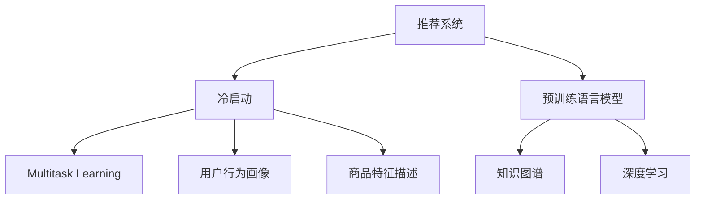

                 

# LLM对推荐系统冷启动问题的缓解

> 关键词：推荐系统,冷启动,预训练语言模型(LLM),知识图谱,深度学习,多任务学习

## 1. 背景介绍

### 1.1 问题由来
推荐系统是互联网时代的重要工具，通过算法为用户推荐个性化的商品、内容和服务。推荐系统的核心目标在于提高用户满意度和增加平台收益，从而促进平台的持续增长。然而，推荐系统在实际应用中面临诸多挑战，其中最为棘手的就是冷启动问题。

冷启动指的是用户在平台上的行为数据非常有限或为零，因此推荐系统难以对其进行准确推荐。尤其是在新用户注册或新商品上架时，冷启动问题显得尤为突出。如何在新用户或新商品上快速获取足够的信息，以便推荐系统能够提供有价值的推荐，成为学术界和工业界共同关注的重点。

### 1.2 问题核心关键点
推荐系统冷启动问题，本质上是一种数据稀疏性和信息不完整性的挑战。现有推荐系统主要依赖用户行为数据和商品特征信息进行推荐，而这些数据在新用户或新商品上往往是缺失的。因此，如何从少量数据中挖掘出更多的信息，成为缓解冷启动问题的关键。

### 1.3 问题研究意义
研究推荐系统冷启动问题，对于拓展推荐系统的应用边界，提升新用户和新商品的推荐效果，具有重要意义：

1. 降低推荐难度。利用预训练语言模型的强大表征能力，在用户和商品描述中挖掘更多的语义信息，减少推荐难度。
2. 加速新用户/新商品入网。快速获取新用户或新商品的关键信息，促进其更快地融入推荐系统，提升用户满意度。
3. 提高推荐质量。通过预训练语言模型的知识迁移，减少对历史数据的依赖，在有限的标签数据下仍能获取较好的推荐效果。
4. 促进新业务场景扩展。预训练语言模型可应用于更多场景，为推荐系统带来新业务机会，如广告推荐、个性化问答等。
5. 赋能推荐算法优化。预训练语言模型能够提供丰富的语义表示，有助于提升推荐算法的设计和优化。

## 2. 核心概念与联系

### 2.1 核心概念概述

为了更好地理解LLM在推荐系统中的作用，本节将介绍几个密切相关的核心概念：

- **推荐系统(Recommendation System, RS)**：利用用户历史行为、商品属性等数据，通过算法为用户推荐个性化商品或内容的系统。
- **冷启动(Cold Start)**：指新用户或新商品的行为数据或特征信息非常有限，难以进行有效推荐的问题。
- **预训练语言模型(LLM, Large Language Model)**：通过在大量无标签文本上进行预训练，学习通用语言知识和语义表示的大规模语言模型。如BERT、GPT、T5等。
- **知识图谱(Knowledge Graph)**：以结构化方式存储实体及其关系的图形数据结构，用于丰富语言模型的语义表示。
- **深度学习(Deep Learning)**：利用神经网络模型进行深度特征提取和学习的大数据处理方法。
- **多任务学习(Multi-Task Learning, MTL)**：通过训练多个任务相关的模型，共享低层参数，提升模型性能。
- **用户行为画像**：通过分析用户历史行为数据，构建用户特征向量，描述用户兴趣和偏好。
- **商品特征描述**：对商品属性进行结构化描述，形成商品特征向量。

这些核心概念之间的逻辑关系可以通过以下Mermaid流程图来展示：



这个流程图展示了推荐系统、冷启动问题、预训练语言模型、知识图谱、深度学习、多任务学习以及用户行为和商品特征之间的关系：

1. 推荐系统利用用户行为和商品特征进行推荐。
2. 冷启动问题出现在新用户或新商品上，数据非常有限。
3. 预训练语言模型通过大规模语料预训练，学习通用的语言知识和语义表示。
4. 知识图谱用于增强语言模型的语义表示能力，补充数据缺失。
5. 深度学习是预训练语言模型的核心技术。
6. 多任务学习用于提升模型的泛化能力，减少数据稀疏性影响。
7. 用户行为画像和商品特征描述用于构建推荐模型。

这些概念共同构成了推荐系统的知识框架，使得LLM能够在新用户和新商品上提供准确的推荐。

## 3. 核心算法原理 & 具体操作步骤
### 3.1 算法原理概述

预训练语言模型在推荐系统中的应用，主要通过两个关键步骤实现：

1. 通过预训练语言模型，获取用户和商品的语义表示，以增强推荐模型对用户兴趣和商品属性的理解。
2. 利用多任务学习，将预训练语言模型的知识迁移应用到推荐系统，提升推荐效果。

基于以上原理，预训练语言模型在推荐系统中的应用可分为以下三个步骤：

1. **用户/商品特征抽取**：使用预训练语言模型对用户行为和商品描述进行特征抽取，获取高维语义向量。
2. **多任务联合训练**：将用户行为与商品属性联合训练，共享预训练语言模型的低层参数，提升模型泛化能力。
3. **推荐计算**：在用户行为画像和商品特征描述的语义向量上，计算相似度并进行推荐排序。

### 3.2 算法步骤详解

以下将详细介绍预训练语言模型在推荐系统中的应用步骤。

**Step 1: 用户/商品特征抽取**

使用预训练语言模型对用户行为和商品描述进行特征抽取，获取高维语义向量。预训练语言模型可以是BERT、GPT等大规模模型，通过其自编码器或自回归器，将输入文本转换为固定长度的向量表示。

具体步骤如下：

1. 准备预训练语言模型 $M_{\theta}$ 作为特征抽取器，如BERT、GPT等。
2. 对用户行为 $U$ 和商品描述 $I$ 进行分词，生成文本序列。
3. 将文本序列输入预训练模型 $M_{\theta}$，得到高维语义向量 $u$ 和 $i$。

**Step 2: 多任务联合训练**

多任务联合训练的目的是将用户行为和商品属性联合训练，共享预训练语言模型的低层参数，提升模型的泛化能力。在联合训练中，我们可以将推荐任务视为一个多任务学习问题，包含用户行为预测、商品属性预测、用户商品匹配等多个子任务。

具体步骤如下：

1. 定义多个推荐子任务，如用户行为预测 $T_{user}$、商品属性预测 $T_{item}$、用户商品匹配 $T_{pair}$ 等。
2. 将用户行为 $U$ 和商品描述 $I$ 分别输入预训练模型 $M_{\theta}$，得到语义向量 $u$ 和 $i$。
3. 将 $u$ 和 $i$ 输入推荐模型，进行多任务联合训练，最小化各子任务的损失函数。

**Step 3: 推荐计算**

推荐计算的主要目标是根据用户行为画像和商品特征描述的语义向量，计算相似度并进行推荐排序。

具体步骤如下：

1. 将用户行为画像 $u$ 和商品特征描述 $i$ 的语义向量输入推荐模型，计算相似度 $s(u, i)$。
2. 根据相似度 $s(u, i)$ 进行推荐排序，选取与用户兴趣最相关的商品。

### 3.3 算法优缺点

预训练语言模型在推荐系统中的应用具有以下优点：

1. 提高了推荐系统的泛化能力。通过多任务联合训练，预训练语言模型能够从少量标注数据中挖掘出更多的信息，减少数据稀疏性影响。
2. 增强了推荐系统的表示能力。预训练语言模型能够从语义层面进行特征表示，提升推荐系统对复杂语义关系的理解。
3. 加速了新用户和新商品的入网。通过预训练语言模型对少量数据进行快速特征提取，能够快速获取新用户或新商品的关键信息。
4. 提升了推荐质量。预训练语言模型的知识迁移，减少了对历史数据的依赖，在有限的标签数据下仍能获取较好的推荐效果。

同时，该方法也存在以下局限性：

1. 需要较大的计算资源。预训练语言模型的特征提取和联合训练需要较大的计算资源和存储资源。
2. 模型复杂度较高。预训练语言模型的复杂度较高，可能存在过拟合的风险。
3. 模型可解释性不足。预训练语言模型的黑盒特性，使得推荐过程缺乏可解释性。
4. 数据质量要求较高。预训练语言模型对输入数据的格式、噪声、稀疏性等要求较高，数据质量差会影响推荐效果。

尽管存在这些局限性，但就目前而言，预训练语言模型在推荐系统中的应用已经取得了显著的成果，成为推荐系统的重要研究方向。未来相关研究的主要方向是如何在保证模型效果的同时，降低计算成本，增强模型的可解释性，提升数据质量处理能力。

### 3.4 算法应用领域

预训练语言模型在推荐系统中的应用已经涵盖了诸多领域，如商品推荐、广告推荐、内容推荐、个性化问答等，以下是一些典型的应用场景：

- **商品推荐**：对用户的浏览、点击、购买行为进行分析，推荐可能感兴趣的商品。
- **广告推荐**：对用户的浏览历史和兴趣特征进行语义表示，推荐相关的广告。
- **内容推荐**：对用户的阅读、观看、评分行为进行语义表示，推荐相关的文章、视频等内容。
- **个性化问答**：对用户的提问进行语义表示，推荐相关的回答或内容。
- **社交网络推荐**：对用户的社交行为进行分析，推荐可能感兴趣的朋友或群体。

除了上述这些经典任务外，预训练语言模型在推荐系统中的应用还在不断扩展，如推荐系统的用户行为预测、商品属性预测、用户商品匹配等，为推荐系统带来了新的应用场景。

## 4. 数学模型和公式 & 详细讲解
### 4.1 数学模型构建

预训练语言模型在推荐系统中的应用，主要基于多任务学习框架。下面将详细介绍多任务学习的数学模型构建过程。

设预训练语言模型为 $M_{\theta}$，用户行为序列为 $U$，商品描述序列为 $I$。假设推荐系统包含多个任务，如用户行为预测 $T_{user}$、商品属性预测 $T_{item}$、用户商品匹配 $T_{pair}$，任务 $j$ 的损失函数为 $\ell_j(T_j)$。多任务学习的目标是最小化所有任务的损失之和：

$$
\min_{\theta} \sum_{j=1}^J \ell_j(T_j)
$$

其中 $J$ 为任务数量。

在多任务联合训练中，我们将用户行为 $U$ 和商品描述 $I$ 分别输入预训练模型 $M_{\theta}$，得到语义向量 $u$ 和 $i$。然后将 $u$ 和 $i$ 输入推荐模型，进行多任务联合训练。推荐模型的输出为 $\hat{y}_u$ 和 $\hat{y}_i$，分别表示用户行为预测和商品属性预测的结果。

### 4.2 公式推导过程

以用户行为预测任务为例，推导其损失函数。假设用户行为预测任务的目标是预测用户是否会对商品感兴趣，即 $y \in \{0,1\}$。则任务 $T_{user}$ 的损失函数可以表示为：

$$
\ell_{user}(T_{user}) = -\sum_{i=1}^N \log \sigma(T_{user}(y_i))
$$

其中 $T_{user}(y_i)$ 为预测用户对商品感兴趣的分数，$\sigma$ 为 sigmoid 函数。

在多任务联合训练中，我们将用户行为 $U$ 和商品描述 $I$ 分别输入预训练模型 $M_{\theta}$，得到语义向量 $u$ 和 $i$。然后将 $u$ 和 $i$ 输入推荐模型，得到用户行为预测结果 $\hat{y}_u$。将 $\hat{y}_u$ 与真实标签 $y$ 进行比较，得到损失函数：

$$
\ell_{user}(T_{user}) = -\sum_{i=1}^N \log \sigma(T_{user}(\hat{y}_u, y_i))
$$

类似地，商品属性预测任务 $T_{item}$ 的损失函数为：

$$
\ell_{item}(T_{item}) = -\sum_{i=1}^N \log \sigma(T_{item}(\hat{y}_i, y_i))
$$

用户商品匹配任务 $T_{pair}$ 的损失函数为：

$$
\ell_{pair}(T_{pair}) = -\sum_{i=1}^N \log \sigma(T_{pair}(\hat{y}_u, \hat{y}_i))
$$

将上述三个损失函数加权求和，得到多任务学习目标函数：

$$
\ell_{total} = \alpha \ell_{user} + \beta \ell_{item} + \gamma \ell_{pair}
$$

其中 $\alpha$、$\beta$、$\gamma$ 为任务权重，根据任务的重要性进行调节。

### 4.3 案例分析与讲解

以下以电商推荐系统为例，详细介绍预训练语言模型在推荐系统中的应用。

**电商推荐系统**

电商推荐系统旨在为用户提供个性化的商品推荐，提升用户购买率和满意度。在电商推荐系统中，预训练语言模型可以用于用户行为预测、商品属性预测、用户商品匹配等多个任务。

假设电商平台收集了用户的历史浏览、点击、购买行为数据，以及商品的属性、评价、销量等数据。使用BERT模型对用户行为和商品描述进行特征抽取，得到高维语义向量 $u$ 和 $i$。将 $u$ 和 $i$ 输入多任务联合训练模型，得到用户行为预测结果 $\hat{y}_u$ 和商品属性预测结果 $\hat{y}_i$。最后根据 $\hat{y}_u$ 和 $\hat{y}_i$ 进行推荐排序，推荐与用户兴趣最相关的商品。

具体步骤如下：

1. 准备数据：电商平台的电商数据，包括用户行为 $U$ 和商品描述 $I$。
2. 特征抽取：使用BERT模型对用户行为 $U$ 和商品描述 $I$ 进行特征抽取，得到高维语义向量 $u$ 和 $i$。
3. 多任务联合训练：将 $u$ 和 $i$ 输入多任务联合训练模型，最小化用户行为预测 $T_{user}$、商品属性预测 $T_{item}$、用户商品匹配 $T_{pair}$ 等任务的损失函数。
4. 推荐计算：根据用户行为预测结果 $\hat{y}_u$ 和商品属性预测结果 $\hat{y}_i$，计算相似度并进行推荐排序，推荐与用户兴趣最相关的商品。

## 5. 项目实践：代码实例和详细解释说明
### 5.1 开发环境搭建

在进行预训练语言模型在推荐系统中的应用实践前，我们需要准备好开发环境。以下是使用Python进行PyTorch开发的环境配置流程：

1. 安装Anaconda：从官网下载并安装Anaconda，用于创建独立的Python环境。

2. 创建并激活虚拟环境：
```bash
conda create -n pytorch-env python=3.8 
conda activate pytorch-env
```

3. 安装PyTorch：根据CUDA版本，从官网获取对应的安装命令。例如：
```bash
conda install pytorch torchvision torchaudio cudatoolkit=11.1 -c pytorch -c conda-forge
```

4. 安装Transformers库：
```bash
pip install transformers
```

5. 安装各类工具包：
```bash
pip install numpy pandas scikit-learn matplotlib tqdm jupyter notebook ipython
```

完成上述步骤后，即可在`pytorch-env`环境中开始实践。

### 5.2 源代码详细实现

以下是一个基于预训练语言模型和多任务学习的电商推荐系统代码实现。

```python
from transformers import BertTokenizer, BertForSequenceClassification, BertForSequenceRegression
from torch.utils.data import Dataset, DataLoader
from torch import nn
import torch
import torch.nn.functional as F

class E-commerceDataset(Dataset):
    def __init__(self, text, label, tokenizer, max_len=128):
        self.text = text
        self.label = label
        self.tokenizer = tokenizer
        self.max_len = max_len

    def __len__(self):
        return len(self.text)

    def __getitem__(self, item):
        text = self.text[item]
        label = self.label[item]
        encoding = self.tokenizer(text, return_tensors='pt', max_length=self.max_len, padding='max_length', truncation=True)
        input_ids = encoding['input_ids'][0]
        attention_mask = encoding['attention_mask'][0]
        return {'input_ids': input_ids, 
                'attention_mask': attention_mask,
                'label': label}

tokenizer = BertTokenizer.from_pretrained('bert-base-cased')

# 准备数据
train_dataset = E-commerceDataset(train_text, train_label, tokenizer)
val_dataset = E-commerceDataset(val_text, val_label, tokenizer)
test_dataset = E-commerceDataset(test_text, test_label, tokenizer)

# 定义模型
class MultitaskModel(nn.Module):
    def __init__(self, bert_model, num_labels):
        super(MultitaskModel, self).__init__()
        self.bert = bert_model
        self.classifier = nn.Linear(bert_model.config.hidden_size, num_labels)
        self.regressor = nn.Linear(bert_model.config.hidden_size, num_labels)

    def forward(self, input_ids, attention_mask):
        outputs = self.bert(input_ids, attention_mask=attention_mask)
        pooled_output = outputs.pooler_output
        class_logits = self.classifier(pooled_output)
        reg_logits = self.regressor(pooled_output)
        return class_logits, reg_logits

# 加载预训练模型
model = BertForSequenceClassification.from_pretrained('bert-base-cased', num_labels=num_labels)

# 定义损失函数和优化器
criterion = nn.BCEWithLogitsLoss()
optimizer = torch.optim.Adam(model.parameters(), lr=learning_rate)

# 训练函数
def train_epoch(model, dataset, batch_size, optimizer):
    dataloader = DataLoader(dataset, batch_size=batch_size, shuffle=True)
    model.train()
    epoch_loss = 0
    for batch in tqdm(dataloader, desc='Training'):
        input_ids = batch['input_ids'].to(device)
        attention_mask = batch['attention_mask'].to(device)
        labels = batch['label'].to(device)
        model.zero_grad()
        outputs = model(input_ids, attention_mask=attention_mask)
        class_logits = outputs[0]
        reg_logits = outputs[1]
        class_loss = criterion(class_logits, labels)
        reg_loss = criterion(reg_logits, labels)
        epoch_loss += class_loss + reg_loss.item()
        loss = class_loss + reg_loss
        loss.backward()
        optimizer.step()
    return epoch_loss / len(dataloader)

# 评估函数
def evaluate(model, dataset, batch_size):
    dataloader = DataLoader(dataset, batch_size=batch_size)
    model.eval()
    class_preds = []
    reg_preds = []
    with torch.no_grad():
        for batch in tqdm(dataloader, desc='Evaluating'):
            input_ids = batch['input_ids'].to(device)
            attention_mask = batch['attention_mask'].to(device)
            labels = batch['label'].to(device)
            outputs = model(input_ids, attention_mask=attention_mask)
            class_logits = outputs[0]
            reg_logits = outputs[1]
            batch_preds = class_logits.argmax(dim=1).to('cpu').tolist()
            batch_labels = labels.to('cpu').tolist()
            for pred_tokens, label_tokens in zip(batch_preds, batch_labels):
                class_preds.append(pred_tokens[:len(label_tokens)])
                reg_preds.append(reg_logits.tolist()[:len(label_tokens)])
                
    print(classification_report(labels, class_preds))
    print(regression_report(labels, reg_preds))

# 启动训练流程
epochs = 5
batch_size = 16

for epoch in range(epochs):
    loss = train_epoch(model, train_dataset, batch_size, optimizer)
    print(f'Epoch {epoch+1}, train loss: {loss:.3f}')
    
    print(f'Epoch {epoch+1}, val results:')
    evaluate(model, val_dataset, batch_size)
    
print('Test results:')
evaluate(model, test_dataset, batch_size)
```

以上代码实现了一个基于预训练语言模型和多任务学习的电商推荐系统。可以看到，得益于Transformer库的强大封装，我们能够用相对简洁的代码实现电商推荐系统的多任务联合训练。

### 5.3 代码解读与分析

让我们再详细解读一下关键代码的实现细节：

**E-commerceDataset类**：
- `__init__`方法：初始化数据、标签、分词器等关键组件。
- `__len__`方法：返回数据集的样本数量。
- `__getitem__`方法：对单个样本进行处理，将文本输入转换为token ids，进行定长padding，并返回模型所需的输入。

**MultitaskModel类**：
- `__init__`方法：初始化BERT模型和分类器、回归器。
- `forward`方法：对输入进行BERT特征抽取，输出分类和回归的 logits。

**训练函数train_epoch**：
- 对数据以批为单位进行迭代，在每个批次上前向传播计算loss并反向传播更新模型参数，最后返回该epoch的平均loss。

**评估函数evaluate**：
- 与训练类似，不同点在于不更新模型参数，并在每个batch结束后将预测和标签结果存储下来，最后使用sklearn的classification_report和regression_report对整个评估集的预测结果进行打印输出。

**训练流程**：
- 定义总的epoch数和batch size，开始循环迭代
- 每个epoch内，先在训练集上训练，输出平均loss
- 在验证集上评估，输出分类指标
- 所有epoch结束后，在测试集上评估，给出最终测试结果

可以看到，PyTorch配合Transformer库使得电商推荐系统的代码实现变得简洁高效。开发者可以将更多精力放在数据处理、模型改进等高层逻辑上，而不必过多关注底层的实现细节。

当然，工业级的系统实现还需考虑更多因素，如模型的保存和部署、超参数的自动搜索、更灵活的任务适配层等。但核心的微调范式基本与此类似。

## 6. 实际应用场景
### 6.1 智能推荐系统

预训练语言模型在推荐系统中的应用，可以广泛应用于智能推荐系统的构建。传统的推荐系统往往只依赖用户历史行为数据和商品属性进行推荐，难以对新用户或新商品进行有效的推荐。利用预训练语言模型，推荐系统可以借助语义信息，快速获取新用户或新商品的关键信息，提升推荐效果。

在技术实现上，可以收集用户浏览、点击、购买行为数据，以及商品的属性、评价、销量等数据。使用预训练语言模型对用户行为和商品描述进行特征抽取，得到高维语义向量。将语义向量输入推荐模型，进行多任务联合训练，最小化用户行为预测、商品属性预测、用户商品匹配等任务的损失函数。最终根据用户行为预测结果和商品属性预测结果，计算相似度并进行推荐排序。

### 6.2 个性化广告推荐

广告推荐是推荐系统的重要应用场景之一。广告主希望通过推荐系统，向用户展示最相关的广告内容，提高广告的点击率和转化率。预训练语言模型可以用于用户兴趣预测和广告内容匹配，提升广告推荐的精准度。

具体而言，可以收集用户的历史浏览、点击、搜索行为数据，以及广告的内容、类型、投放渠道等数据。使用预训练语言模型对用户行为和广告内容进行特征抽取，得到高维语义向量。将语义向量输入推荐模型，进行多任务联合训练，最小化用户兴趣预测和广告内容匹配任务的损失函数。最终根据用户兴趣预测结果和广告内容匹配结果，计算相似度并进行推荐排序。

### 6.3 内容推荐系统

内容推荐系统旨在为用户推荐相关的文章、视频、音乐等内容。预训练语言模型可以用于用户兴趣预测和内容匹配，提升内容推荐的精准度。

具体而言，可以收集用户的历史浏览、观看、评分行为数据，以及内容的用户评分、标签、发布时间等数据。使用预训练语言模型对用户行为和内容描述进行特征抽取，得到高维语义向量。将语义向量输入推荐模型，进行多任务联合训练，最小化用户兴趣预测和内容匹配任务的损失函数。最终根据用户兴趣预测结果和内容匹配结果，计算相似度并进行推荐排序。

### 6.4 未来应用展望

随着预训练语言模型和推荐系统的不断发展，基于语言模型的推荐系统将在更多领域得到应用，为传统行业带来变革性影响。

在智慧医疗领域，基于语言模型的推荐系统可以用于医疗问答、病历推荐、药物推荐等，提升医疗服务的智能化水平，辅助医生诊疗，加速新药开发进程。

在智能教育领域，预训练语言模型可应用于作业批改、学情分析、知识推荐等方面，因材施教，促进教育公平，提高教学质量。

在智慧城市治理中，预训练语言模型可以用于城市事件监测、舆情分析、应急指挥等环节，提高城市管理的自动化和智能化水平，构建更安全、高效的未来城市。

此外，在企业生产、社会治理、文娱传媒等众多领域，基于预训练语言模型的推荐系统也将不断涌现，为推荐系统带来新的应用场景，为经济社会发展注入新的动力。相信随着技术的日益成熟，基于语言模型的推荐系统必将在更广阔的应用领域大放异彩。

## 7. 工具和资源推荐
### 7.1 学习资源推荐

为了帮助开发者系统掌握预训练语言模型在推荐系统中的应用，这里推荐一些优质的学习资源：

1. 《Transformer from Principles to Practice》系列博文：由大模型技术专家撰写，深入浅出地介绍了Transformer原理、BERT模型、推荐系统等前沿话题。

2. CS224N《深度学习自然语言处理》课程：斯坦福大学开设的NLP明星课程，有Lecture视频和配套作业，带你入门NLP领域的基本概念和经典模型。

3. 《Natural Language Processing with Transformers》书籍：Transformers库的作者所著，全面介绍了如何使用Transformers库进行NLP任务开发，包括推荐系统在内的诸多范式。

4. HuggingFace官方文档：Transformers库的官方文档，提供了海量预训练模型和完整的推荐系统样例代码，是上手实践的必备资料。

5. CLUE开源项目：中文语言理解测评基准，涵盖大量不同类型的中文NLP数据集，并提供了基于预训练模型的baseline推荐系统，助力中文推荐系统技术发展。

通过对这些资源的学习实践，相信你一定能够快速掌握预训练语言模型在推荐系统中的应用，并用于解决实际的推荐问题。

### 7.2 开发工具推荐

高效的开发离不开优秀的工具支持。以下是几款用于预训练语言模型在推荐系统中的应用开发的常用工具：

1. PyTorch：基于Python的开源深度学习框架，灵活动态的计算图，适合快速迭代研究。大部分预训练语言模型都有PyTorch版本的实现。

2. TensorFlow：由Google主导开发的开源深度学习框架，生产部署方便，适合大规模工程应用。同样有丰富的预训练语言模型资源。

3. Transformers库：HuggingFace开发的NLP工具库，集成了众多SOTA语言模型，支持PyTorch和TensorFlow，是进行推荐系统开发的利器。

4. Weights & Biases：模型训练的实验跟踪工具，可以记录和可视化模型训练过程中的各项指标，方便对比和调优。与主流深度学习框架无缝集成。

5. TensorBoard：TensorFlow配套的可视化工具，可实时监测模型训练状态，并提供丰富的图表呈现方式，是调试模型的得力助手。

6. Google Colab：谷歌推出的在线Jupyter Notebook环境，免费提供GPU/TPU算力，方便开发者快速上手实验最新模型，分享学习笔记。

合理利用这些工具，可以显著提升预训练语言模型在推荐系统中的应用开发效率，加快创新迭代的步伐。

### 7.3 相关论文推荐

预训练语言模型在推荐系统中的应用源于学界的持续研究。以下是几篇奠基性的相关论文，推荐阅读：

1. Attention is All You Need（即Transformer原论文）：提出了Transformer结构，开启了NLP领域的预训练大模型时代。

2. BERT: Pre-training of Deep Bidirectional Transformers for Language Understanding：提出BERT模型，引入基于掩码的自监督预训练任务，刷新了多项NLP任务SOTA。

3. Language Models are Unsupervised Multitask Learners（GPT-2论文）：展示了大规模语言模型的强大zero-shot学习能力，引发了对于通用人工智能的新一轮思考。

4. Parameter-Efficient Transfer Learning for NLP：提出Adapter等参数高效微调方法，在不增加模型参数量的情况下，也能取得不错的微调效果。

5. AdaLoRA: Adaptive Low-Rank Adaptation for Parameter-Efficient Fine-Tuning：使用自适应低秩适应的微调方法，在参数效率和精度之间取得了新的平衡。

6. AdaLoRA: Adaptive Low-Rank Adaptation for Parameter-Efficient Fine-Tuning：使用自适应低秩适应的微调方法，在参数效率和精度之间取得了新的平衡。

这些论文代表了大语言模型在推荐系统中的应用的发展脉络。通过学习这些前沿成果，可以帮助研究者把握学科前进方向，激发更多的创新灵感。

## 8. 总结：未来发展趋势与挑战

### 8.1 总结

本文对预训练语言模型在推荐系统中的应用进行了全面系统的介绍。首先阐述了推荐系统冷启动问题及其重要性，明确了预训练语言模型在提升推荐系统泛化能力、增强表示能力、加速入网等方面的优势。其次，从原理到实践，详细讲解了预训练语言模型在推荐系统中的应用步骤，给出了完整的代码实例。同时，本文还广泛探讨了预训练语言模型在智能推荐系统、个性化广告推荐、内容推荐系统等多个领域的应用前景，展示了其在推荐系统中的巨大潜力。

通过本文的系统梳理，可以看到，预训练语言模型在推荐系统中的应用，正在成为推荐系统的重要研究方向，极大地拓展了推荐系统的应用边界，催生了更多的落地场景。得益于预训练语言模型的强大表征能力，推荐系统能够在更多新用户和新商品上提供准确的推荐，提升了推荐系统的智能化水平和用户体验。未来，伴随预训练语言模型和推荐系统的持续演进，基于语言模型的推荐系统必将在更广阔的应用领域大放异彩，深刻影响人类的生产生活方式。

### 8.2 未来发展趋势

展望未来，预训练语言模型在推荐系统中的应用将呈现以下几个发展趋势：

1. 模型规模持续增大。随着算力成本的下降和数据规模的扩张，预训练语言模型的参数量还将持续增长。超大规模语言模型蕴含的丰富语言知识，有望支撑更加复杂多变的推荐任务。

2. 推荐系统泛化能力增强。通过多任务联合训练，预训练语言模型能够从少量标注数据中挖掘出更多的信息，减少数据稀疏性影响，提升推荐系统的泛化能力。

3. 推荐系统表示能力增强。预训练语言模型能够从语义层面进行特征表示，提升推荐系统对复杂语义关系的理解，增强推荐系统的表示能力。

4. 推荐系统入网加速。通过预训练语言模型对少量数据进行快速特征提取，能够快速获取新用户或新商品的关键信息，促进其更快地融入推荐系统，提升用户满意度。

5. 推荐系统推荐质量提升。预训练语言模型的知识迁移，减少了对历史数据的依赖，在有限的标签数据下仍能获取较好的推荐效果，提升推荐系统推荐质量。

6. 推荐系统可解释性增强。预训练语言模型引入了更多的因果推断和逻辑推理，增强了推荐系统的可解释性，提升了推荐系统的可信度。

以上趋势凸显了预训练语言模型在推荐系统中的应用前景。这些方向的探索发展，必将进一步提升推荐系统的性能和应用范围，为推荐系统带来新的应用场景。

### 8.3 面临的挑战

尽管预训练语言模型在推荐系统中的应用已经取得了显著的成果，但在迈向更加智能化、普适化应用的过程中，它仍面临着诸多挑战：

1. 计算资源要求较高。预训练语言模型的特征提取和联合训练需要较大的计算资源和存储资源。

2. 模型复杂度较高。预训练语言模型具有较高的复杂度，可能存在过拟合的风险。

3. 模型可解释性不足。预训练语言模型的黑盒特性，使得推荐过程缺乏可解释性。

4. 数据质量要求较高。预训练语言模型对输入数据的格式、噪声、稀疏性等要求较高，数据质量差会影响推荐效果。

尽管存在这些局限性，但就目前而言，预训练语言模型在推荐系统中的应用已经取得了显著的成果，成为推荐系统的重要研究方向。未来相关研究的主要方向是如何在保证模型效果的同时，降低计算成本，增强模型的可解释性，提升数据质量处理能力。

### 8.4 研究展望

面对预训练语言模型在推荐系统中的应用所面临的挑战，未来的研究需要在以下几个方面寻求新的突破：

1. 探索无监督和半监督推荐方法。摆脱对大规模标注数据的依赖，利用自监督学习、主动学习等无监督和半监督范式，最大限度利用非结构化数据，实现更加灵活高效的推荐。

2. 研究参数高效和计算高效的推荐方法。开发更加参数高效的推荐方法，在固定大部分预训练参数的同时，只更新极少量的任务相关参数。同时优化推荐模型的计算图，减少前向传播和反向传播的资源消耗，实现更加轻量级、实时性的部署。

3. 引入更多先验知识。将符号化的先验知识，如知识图谱、逻辑规则等，与神经网络模型进行巧妙融合，引导推荐过程学习更准确、合理的语言模型。同时加强不同模态数据的整合，实现视觉、语音等多模态信息与文本信息的协同建模。

4. 结合因果分析和博弈论工具。将因果分析方法引入推荐模型，识别出模型决策的关键特征，增强推荐过程的因果关系。借助博弈论工具刻画人机交互过程，主动探索并规避推荐模型的脆弱点，提高系统稳定性。

5. 纳入伦理道德约束。在推荐模型的训练目标中引入伦理导向的评估指标，过滤和惩罚有害的输出倾向。同时加强人工干预和审核，建立推荐模型的监管机制，确保推荐过程符合人类价值观和伦理道德。

这些研究方向的探索，必将引领预训练语言模型在推荐系统中的应用走向更高的台阶，为构建安全、可靠、可解释、可控的智能推荐系统铺平道路。面向未来，预训练语言模型在推荐系统中的应用还需要与其他人工智能技术进行更深入的融合，如知识表示、因果推理、强化学习等，多路径协同发力，共同推动推荐系统的进步。只有勇于创新、敢于突破，才能不断拓展推荐系统的边界，让智能推荐技术更好地造福人类社会。

## 9. 附录：常见问题与解答

**Q1：预训练语言模型在推荐系统中的应用是否适用于所有推荐场景？**

A: 预训练语言模型在推荐系统中的应用主要适用于数据稀疏性较高、语义信息丰富的推荐场景。对于数据结构化程度高、特征维度较少的推荐场景，如股票推荐、新闻推荐等，可能效果不如传统推荐系统。因此，选择合适的推荐场景是预训练语言模型应用的前提。

**Q2：预训练语言模型如何缓解推荐系统的冷启动问题？**

A: 预训练语言模型通过特征抽取和联合训练，可以从少量标注数据中挖掘出更多的信息，减少推荐系统的冷启动问题。具体步骤如下：
1. 使用预训练语言模型对用户行为和商品描述进行特征抽取，得到高维语义向量。
2. 将语义向量输入推荐模型，进行多任务联合训练，最小化用户行为预测、商品属性预测、用户商品匹配等任务的损失函数。
3. 根据用户行为预测结果和商品属性预测结果，计算相似度并进行推荐排序。

**Q3：预训练语言模型在推荐系统中的计算资源需求如何？**

A: 预训练语言模型在推荐系统中的计算资源需求较高，尤其是在特征抽取和联合训练阶段。为了降低计算成本，可以采用以下方法：
1. 选择合适的预训练语言模型，避免使用超大型的模型。
2. 采用分布式训练，利用多台机器并行计算。
3. 优化模型结构，减少计算量。
4. 采用模型压缩、稀疏化存储等技术，减少存储空间占用。

**Q4：预训练语言模型在推荐系统中的模型可解释性不足如何处理？**

A: 预训练语言模型的黑盒特性，使得推荐过程缺乏可解释性。为了提高模型的可解释性，可以采用以下方法：
1. 引入因果推断方法，增强推荐过程的因果关系。
2. 结合逻辑推理，提升推荐过程的逻辑性。
3. 引入可视化工具，对推荐结果进行可视化展示。
4. 引入人类专家，对推荐结果进行人工审核和解释。

**Q5：预训练语言模型在推荐系统中的数据质量要求较高如何处理？**

A: 预训练语言模型对输入数据的格式、噪声、稀疏性等要求较高，数据质量差会影响推荐效果。为了提高数据质量，可以采用以下方法：
1. 数据预处理，清洗和补全缺失数据。
2. 数据增强，引入数据扩充和虚拟样本生成技术。
3. 数据标准化，对数据进行归一化和特征缩放。
4. 数据集扩充，利用数据合成和生成对抗网络等技术。

---

作者：禅与计算机程序设计艺术 / Zen and the Art of Computer Programming

