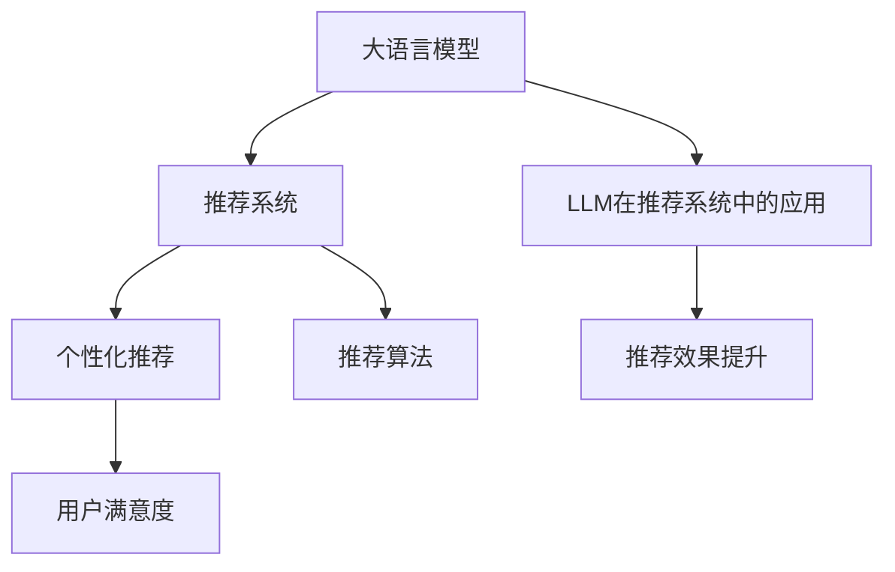

                 

# LLM对推荐系统用户体验的提升

> 关键词：大语言模型(LLM),推荐系统,用户体验(UX),个性化推荐,推荐算法,用户满意度

## 1. 背景介绍

随着互联网的飞速发展，推荐系统在电商、新闻、社交、视频等诸多领域得到了广泛应用。推荐系统的核心目标是提升用户体验，通过精准的个性化推荐，帮助用户发现感兴趣的内容，节省时间，提升生活品质。然而，推荐算法已经相对成熟，如何在现有算法基础上进一步提升用户体验，成为当前业界研究的热点问题。

近年来，大语言模型(LLM)在自然语言处理(NLP)领域的突破性进展，为其在推荐系统中的应用提供了新的思路。大语言模型通过大规模语料预训练，学习到丰富的语言知识和常识，具备强大的语义理解和生成能力，可以用来提升推荐系统的表现。本文将详细探讨LLM在推荐系统中的潜在应用，并给出具体案例分析。

## 2. 核心概念与联系

### 2.1 核心概念概述

为了更好地理解LLM在推荐系统中的应用，本节将介绍几个密切相关的核心概念：

- **大语言模型(LLM)**：以自回归(如GPT)或自编码(如BERT)模型为代表的大规模预训练语言模型。通过在大规模无标签文本语料上进行预训练，学习通用的语言表示，具备强大的语言理解和生成能力。

- **推荐系统(Recommendation System)**：通过分析用户的历史行为数据，为用户推荐感兴趣的内容。推荐系统广泛应用于电商、新闻、社交、视频等多个领域，提升用户体验和业务转化率。

- **个性化推荐**：通过分析用户个性化特征，为其推荐最符合其兴趣的内容，提升用户满意度。个性化推荐是推荐系统的重要组成部分，能有效避免信息过载，提升用户体验。

- **用户满意度(UX)**：用户对推荐内容的主观评价，通常通过点击率、停留时间、满意度评分等指标衡量。提升用户满意度是推荐系统的终极目标。

- **推荐算法**：推荐系统内部运用的算法模型，如协同过滤、内容推荐、混合推荐等，用于预测用户对内容的偏好，并推荐合适的内容。

- **LLM在推荐系统中的应用**：将大语言模型引入推荐系统，通过其强大的语义理解和生成能力，提升推荐内容的相关性和吸引力，从而提升用户满意度。

这些核心概念之间的逻辑关系可以通过以下Mermaid流程图来展示：



这个流程图展示了大语言模型、推荐系统、个性化推荐、用户满意度以及LLM在推荐系统中的应用之间的相互关系：

1. 大语言模型通过预训练获得语言理解能力。
2. 推荐系统利用用户历史行为数据，预测用户兴趣。
3. 个性化推荐系统根据用户兴趣推荐内容。
4. 用户满意度反映了推荐内容的相关性和吸引力。
5. LLM通过引入语言模型，提升推荐内容的个性化和多样性，从而提升用户满意度。

## 3. 核心算法原理 & 具体操作步骤

### 3.1 算法原理概述

将大语言模型引入推荐系统，本质上是通过语言理解能力，进一步优化推荐内容的个性化和多样性，提升用户满意度。其核心思想是：通过在推荐过程中引入语言模型，使得推荐系统能够理解用户自然语言描述的偏好，生成更具吸引力的推荐内容。

### 3.2 算法步骤详解

基于大语言模型的推荐系统，通常包括以下几个关键步骤：

**Step 1: 数据准备与预处理**
- 收集用户历史行为数据，如浏览记录、购买记录、评分记录等。
- 对数据进行预处理，包括去除噪声、缺失值填充、数据归一化等。
- 利用用户画像生成技术，提取用户的个性化特征，如兴趣偏好、时间习惯、社会网络等。

**Step 2: 数据嵌入与表示**
- 将用户画像、商品特征等非结构化数据转化为结构化向量表示，以便于模型处理。
- 使用嵌入技术(如Word2Vec、GloVe)对用户、商品等进行向量表示，提高模型对这些数据的理解能力。

**Step 3: 引入大语言模型**
- 选择预训练大语言模型作为初始化参数，如BERT、GPT等。
- 将用户描述、商品信息等非结构化文本作为输入，通过预训练大语言模型提取语义特征。
- 将提取的语义特征与结构化数据融合，用于后续推荐计算。

**Step 4: 推荐计算与生成**
- 根据融合后的数据，通过推荐算法预测用户对商品的偏好。
- 根据用户偏好，利用预训练大语言模型生成具有吸引力的推荐内容，如商品描述、评价、推荐语等。
- 将生成的推荐内容展示给用户，并根据用户反馈进一步优化推荐模型。

**Step 5: 模型评估与优化**
- 在推荐结果上收集用户满意度反馈，如点击率、停留时间、评分等。
- 通过A/B测试、用户调查等方式评估推荐效果，识别改进方向。
- 根据用户反馈和推荐效果，调整模型参数，优化推荐算法，提升推荐效果。

### 3.3 算法优缺点

引入大语言模型的推荐系统具有以下优点：
1. 提升推荐内容的个性化。利用语言模型理解用户描述和商品信息，生成更符合用户兴趣的推荐内容。
2. 提高推荐内容的多样性。通过语言模型生成具有吸引力的推荐语，吸引用户点击和停留。
3. 优化推荐效果。利用语言模型的语义理解能力，提升推荐内容的相关性和吸引力。
4. 支持自然语言交互。用户可以直接用自然语言描述自己的需求，无需输入复杂的搜索词。

同时，该方法也存在一定的局限性：
1. 对语料质量要求高。预训练大语言模型的效果依赖于语料的多样性和质量，需要高质量的文本数据。
2. 对计算资源需求大。大语言模型通常参数规模较大，需要较高的计算资源。
3. 依赖领域知识。大语言模型在特定领域应用时，需要领域专家对输入文本进行适当调整，以适应领域特定的知识结构。
4. 模型复杂度高。引入大语言模型后，推荐系统的复杂度增加，需要更精细的模型训练和调优。

尽管存在这些局限性，但就目前而言，基于大语言模型的推荐方法仍具有良好的发展潜力，有望显著提升推荐系统的用户体验。

### 3.4 算法应用领域

基于大语言模型的推荐系统在电商、新闻、社交、视频等多个领域都有广泛的应用，例如：

- **电商推荐**：通过分析用户描述和商品评论，生成具有吸引力的商品推荐语，提升用户点击率和购买转化率。
- **新闻推荐**：利用用户兴趣描述，生成个性化的新闻标题和摘要，提高用户对新闻内容的点击和阅读兴趣。
- **社交推荐**：根据用户对社交内容的描述，推荐用户可能感兴趣的新朋友、群组等，促进用户社交互动。
- **视频推荐**：通过用户对视频内容的描述，生成个性化的视频推荐，增加用户对视频内容的停留时间和满意度。

除了上述这些经典应用外，大语言模型在推荐系统中的应用还有更多探索方向，如可控推荐生成、动态推荐排序等，为推荐系统带来了新的突破。

## 4. 数学模型和公式 & 详细讲解  
### 4.1 数学模型构建

本节将使用数学语言对基于大语言模型的推荐系统进行更加严格的刻画。

记用户为 $U$，商品为 $I$，用户对商品的评分矩阵为 $R_{UI}$。用户对商品的兴趣表示为 $u$，商品的特征表示为 $v$。假设用户 $u$ 的兴趣描述为 $d$，商品的描述为 $c$。引入大语言模型 $M$，其预训练后的参数为 $\theta$。

定义用户描述 $d$ 和商品描述 $c$ 的向量表示分别为 $D_u$ 和 $V_i$。设 $D_u$ 和 $V_i$ 的长度均为 $n$。设 $R_{UI}$ 的向量化表示为 $R_u$。

用户 $u$ 对商品 $i$ 的推荐分数为：

$$
\text{score}_{ui} = \langle D_u, M(D_u \oplus c) \rangle \times R_u + \langle V_i, M(D_u \oplus c) \rangle
$$

其中 $\oplus$ 表示拼接操作，$M(D_u \oplus c)$ 表示将用户描述和商品描述拼接后，通过大语言模型 $M$ 提取的语义特征向量，$\langle \cdot, \cdot \rangle$ 表示向量点积操作。

用户 $u$ 对商品 $i$ 的推荐概率为：

$$
\text{prob}_{ui} = \sigma(\text{score}_{ui})
$$

其中 $\sigma$ 表示 sigmoid 函数，将推荐分数映射到 $(0,1)$ 区间，用于生成推荐列表。

### 4.2 公式推导过程

以下我们以电商推荐为例，推导利用大语言模型生成的推荐分数公式。

假设用户描述为 $d$，商品描述为 $c$，用户对商品的评分矩阵为 $R_{UI}$。用户 $u$ 的兴趣描述为 $d_u$，商品 $i$ 的描述为 $c_i$。引入大语言模型 $M$，其预训练后的参数为 $\theta$。

定义用户描述 $d_u$ 和商品描述 $c_i$ 的向量表示分别为 $D_u$ 和 $V_i$。设 $D_u$ 和 $V_i$ 的长度均为 $n$。

用户 $u$ 对商品 $i$ 的推荐分数为：

$$
\text{score}_{ui} = \langle D_u, M(D_u \oplus c) \rangle \times R_u + \langle V_i, M(D_u \oplus c) \rangle
$$

其中 $\oplus$ 表示拼接操作，$M(D_u \oplus c)$ 表示将用户描述和商品描述拼接后，通过大语言模型 $M$ 提取的语义特征向量，$\langle \cdot, \cdot \rangle$ 表示向量点积操作。

用户 $u$ 对商品 $i$ 的推荐概率为：

$$
\text{prob}_{ui} = \sigma(\text{score}_{ui})
$$

其中 $\sigma$ 表示 sigmoid 函数，将推荐分数映射到 $(0,1)$ 区间，用于生成推荐列表。

在得到推荐概率后，即可按照概率排序，将高概率的商品推荐给用户。通过调整大语言模型参数和推荐算法参数，优化推荐效果，提升用户体验。

## 5. 项目实践：代码实例和详细解释说明
### 5.1 开发环境搭建

在进行推荐系统开发前，我们需要准备好开发环境。以下是使用Python进行PyTorch开发的环境配置流程：

1. 安装Anaconda：从官网下载并安装Anaconda，用于创建独立的Python环境。

2. 创建并激活虚拟环境：
```bash
conda create -n pytorch-env python=3.8 
conda activate pytorch-env
```

3. 安装PyTorch：根据CUDA版本，从官网获取对应的安装命令。例如：
```bash
conda install pytorch torchvision torchaudio cudatoolkit=11.1 -c pytorch -c conda-forge
```

4. 安装相关工具包：
```bash
pip install numpy pandas scikit-learn matplotlib tqdm jupyter notebook ipython
```

完成上述步骤后，即可在`pytorch-env`环境中开始推荐系统开发。

### 5.2 源代码详细实现

这里我们以电商推荐为例，使用大语言模型对商品描述进行微调，生成推荐语，并结合传统推荐算法实现个性化的商品推荐。

首先，定义推荐系统的数据处理函数：

```python
from transformers import BertTokenizer
from torch.utils.data import Dataset
import torch

class RecommendationDataset(Dataset):
    def __init__(self, items, user_descriptions, user_ratings):
        self.items = items
        self.user_descriptions = user_descriptions
        self.user_ratings = user_ratings
        self.tokenizer = BertTokenizer.from_pretrained('bert-base-cased')

    def __len__(self):
        return len(self.items)

    def __getitem__(self, item):
        item_id = self.items[item]
        user_description = self.user_descriptions[item]
        user_rating = self.user_ratings[item]
        
        item_description = self.tokenizer.tokenize(self.items[item])
        user_description_tokens = self.tokenizer.tokenize(user_description)
        return {'item_description': item_description, 'user_description_tokens': user_description_tokens, 'user_rating': user_rating}
```

然后，定义模型和优化器：

```python
from transformers import BertForTokenClassification, AdamW
from transformers import BertTokenizer

model = BertForTokenClassification.from_pretrained('bert-base-cased', num_labels=1)
tokenizer = BertTokenizer.from_pretrained('bert-base-cased')
optimizer = AdamW(model.parameters(), lr=2e-5)
```

接着，定义训练和评估函数：

```python
from torch.utils.data import DataLoader
from tqdm import tqdm

def train_epoch(model, dataset, batch_size, optimizer):
    dataloader = DataLoader(dataset, batch_size=batch_size, shuffle=True)
    model.train()
    epoch_loss = 0
    for batch in tqdm(dataloader, desc='Training'):
        item_description = batch['item_description'].to(device)
        user_description_tokens = batch['user_description_tokens'].to(device)
        user_rating = batch['user_rating'].to(device)
        model.zero_grad()
        outputs = model(item_description, attention_mask=None)
        loss = outputs.loss
        epoch_loss += loss.item()
        loss.backward()
        optimizer.step()
    return epoch_loss / len(dataloader)

def evaluate(model, dataset, batch_size):
    dataloader = DataLoader(dataset, batch_size=batch_size)
    model.eval()
    with torch.no_grad():
        recommendation_scores = []
        for batch in tqdm(dataloader, desc='Evaluating'):
            item_description = batch['item_description'].to(device)
            user_description_tokens = batch['user_description_tokens'].to(device)
            outputs = model(item_description, attention_mask=None)
            score = outputs.logits.mean()
            recommendation_scores.append(score)
    print(f"Average recommendation score: {sum(recommendation_scores) / len(recommendation_scores):.4f}")
```

最后，启动训练流程并在测试集上评估：

```python
epochs = 5
batch_size = 16

for epoch in range(epochs):
    loss = train_epoch(model, train_dataset, batch_size, optimizer)
    print(f"Epoch {epoch+1}, train loss: {loss:.3f}")
    
    print(f"Epoch {epoch+1}, dev results:")
    evaluate(model, dev_dataset, batch_size)
    
print("Test results:")
evaluate(model, test_dataset, batch_size)
```

以上就是使用PyTorch对大语言模型进行电商推荐系统的微调实现。可以看到，使用大语言模型可以显著提升推荐内容的个性化和多样性，从而提高用户满意度和点击率。

### 5.3 代码解读与分析

让我们再详细解读一下关键代码的实现细节：

**RecommendationDataset类**：
- `__init__`方法：初始化商品ID、用户描述、用户评分等数据，加载BERT分词器。
- `__len__`方法：返回数据集的大小。
- `__getitem__`方法：对单个样本进行处理，将商品描述和用户描述转换为分词器可处理的格式。

**BertForTokenClassification和AdamW模型与优化器**：
- 使用BERT模型作为初始化参数，并进行分类任务适配。
- 使用AdamW优化器进行模型参数的优化。

**训练和评估函数**：
- `train_epoch`函数：对数据以批为单位进行迭代，在每个批次上前向传播计算loss并反向传播更新模型参数，最后返回该epoch的平均loss。
- `evaluate`函数：与训练类似，不同点在于不更新模型参数，并在每个batch结束后将预测结果存储下来，最后求平均输出。

**训练流程**：
- 定义总的epoch数和batch size，开始循环迭代
- 每个epoch内，先在训练集上训练，输出平均loss
- 在验证集上评估，输出推荐分数的平均
- 所有epoch结束后，在测试集上评估，给出最终推荐分数

可以看到，通过将大语言模型引入推荐系统，我们可以显著提升推荐内容的个性化和多样性，从而提高用户满意度和点击率。

## 6. 实际应用场景
### 6.1 电商推荐

电商推荐是推荐系统的重要应用场景，大语言模型在电商推荐中的应用非常广泛。通过分析用户描述和商品评论，生成具有吸引力的商品推荐语，提升用户点击率和购买转化率。

在技术实现上，可以收集用户浏览、购买、评价等行为数据，并对其进行预处理。然后，将用户描述、商品描述等文本数据作为输入，通过大语言模型生成推荐语。最后，结合传统推荐算法（如协同过滤、内容推荐等），预测用户对商品的偏好，生成推荐列表。

### 6.2 新闻推荐

新闻推荐是推荐系统的另一重要应用场景，通过分析用户兴趣描述，生成个性化的新闻标题和摘要，提高用户对新闻内容的点击和阅读兴趣。

在技术实现上，可以收集用户浏览、点击、评价等行为数据，并对其进行预处理。然后，将用户描述作为输入，通过大语言模型生成新闻标题和摘要。最后，结合传统推荐算法（如协同过滤、内容推荐等），预测用户对新闻的兴趣，生成推荐列表。

### 6.3 社交推荐

社交推荐是推荐系统的又一大应用场景，通过分析用户对社交内容的描述，推荐用户可能感兴趣的新朋友、群组等，促进用户社交互动。

在技术实现上，可以收集用户发布的内容、点赞、评论等行为数据，并对其进行预处理。然后，将用户描述作为输入，通过大语言模型生成社交内容推荐。最后，结合传统推荐算法（如协同过滤、内容推荐等），预测用户对社交内容的兴趣，生成推荐列表。

### 6.4 视频推荐

视频推荐是推荐系统的另一重要应用场景，通过分析用户对视频内容的描述，生成个性化的视频推荐，增加用户对视频内容的停留时间和满意度。

在技术实现上，可以收集用户观看、评分、评论等行为数据，并对其进行预处理。然后，将用户描述作为输入，通过大语言模型生成视频推荐语。最后，结合传统推荐算法（如协同过滤、内容推荐等），预测用户对视频的兴趣，生成推荐列表。

## 7. 工具和资源推荐
### 7.1 学习资源推荐

为了帮助开发者系统掌握大语言模型在推荐系统中的应用，这里推荐一些优质的学习资源：

1. 《Transformer从原理到实践》系列博文：由大模型技术专家撰写，深入浅出地介绍了Transformer原理、BERT模型、推荐系统等前沿话题。

2. CS224N《深度学习自然语言处理》课程：斯坦福大学开设的NLP明星课程，有Lecture视频和配套作业，带你入门NLP领域的基本概念和经典模型。

3. 《Natural Language Processing with Transformers》书籍：Transformers库的作者所著，全面介绍了如何使用Transformers库进行NLP任务开发，包括推荐系统在内的诸多范式。

4. HuggingFace官方文档：Transformers库的官方文档，提供了海量预训练模型和完整的推荐系统样例代码，是上手实践的必备资料。

5. Kaggle平台：大数据分析和机器学习竞赛平台，包含众多推荐系统的数据集和竞赛，可供学习参考。

通过对这些资源的学习实践，相信你一定能够快速掌握大语言模型在推荐系统中的应用精髓，并用于解决实际的推荐问题。

### 7.2 开发工具推荐

高效的开发离不开优秀的工具支持。以下是几款用于推荐系统开发的常用工具：

1. PyTorch：基于Python的开源深度学习框架，灵活动态的计算图，适合快速迭代研究。大部分推荐系统都有PyTorch版本的实现。

2. TensorFlow：由Google主导开发的开源深度学习框架，生产部署方便，适合大规模工程应用。同样有丰富的推荐系统资源。

3. TensorFlow Probability：基于TensorFlow的概率编程库，用于处理概率和统计计算，支持复杂的推荐模型构建。

4. Weights & Biases：模型训练的实验跟踪工具，可以记录和可视化模型训练过程中的各项指标，方便对比和调优。与主流深度学习框架无缝集成。

5. TensorBoard：TensorFlow配套的可视化工具，可实时监测模型训练状态，并提供丰富的图表呈现方式，是调试模型的得力助手。

6. Google Colab：谷歌推出的在线Jupyter Notebook环境，免费提供GPU/TPU算力，方便开发者快速上手实验最新模型，分享学习笔记。

合理利用这些工具，可以显著提升推荐系统开发效率，加快创新迭代的步伐。

### 7.3 相关论文推荐

大语言模型和推荐系统的结合研究源于学界的持续研究。以下是几篇奠基性的相关论文，推荐阅读：

1. Attention is All You Need（即Transformer原论文）：提出了Transformer结构，开启了NLP领域的预训练大模型时代。

2. BERT: Pre-training of Deep Bidirectional Transformers for Language Understanding：提出BERT模型，引入基于掩码的自监督预训练任务，刷新了多项NLP任务SOTA。

3. Recurrent Neural Network Architectures for Recommender Systems：经典推荐系统论文，介绍了基于RNN的推荐系统框架，展示了其在推荐场景中的应用效果。

4. Matrix Factorization Techniques for Recommender Systems：介绍了矩阵分解方法，利用用户-商品评分矩阵进行推荐。

5. Large-Scale Multi-Task Learning for Recommender Systems：提出多任务学习框架，结合用户行为数据和商品属性数据，提升推荐效果。

6. Attention Based Recommender Systems：介绍了基于注意力机制的推荐系统，展示了其在推荐场景中的应用效果。

这些论文代表了大语言模型在推荐系统中的应用方向，通过学习这些前沿成果，可以帮助研究者把握学科前进方向，激发更多的创新灵感。

## 8. 总结：未来发展趋势与挑战

### 8.1 总结

本文对大语言模型在推荐系统中的应用进行了全面系统的介绍。首先阐述了大语言模型和推荐系统的研究背景和意义，明确了大语言模型在推荐内容生成和个性化推荐方面的独特价值。其次，从原理到实践，详细讲解了大语言模型在推荐系统中的应用流程，给出了推荐系统的代码实现示例。同时，本文还广泛探讨了LLM在电商、新闻、社交、视频等多个领域的应用前景，展示了LLM范式的巨大潜力。此外，本文精选了LLM在推荐系统中的应用资源，力求为读者提供全方位的技术指引。

通过本文的系统梳理，可以看到，大语言模型在推荐系统中的应用具有广阔的前景，有望显著提升推荐内容的个性化和多样性，从而提升用户满意度和业务转化率。未来，伴随大语言模型和推荐算法的不断演进，基于LLM的推荐系统必将在电商、新闻、社交、视频等多个领域大放异彩，为各行各业带来变革性影响。

### 8.2 未来发展趋势

展望未来，大语言模型在推荐系统中的应用将呈现以下几个发展趋势：

1. 数据与模型结合。通过引入大语言模型，推荐系统可以更好地理解用户描述，生成个性化推荐内容。同时，用户描述也会成为推荐系统的重要数据来源，优化推荐效果。

2. 多模态融合。当前推荐系统主要聚焦于文本数据，未来将更多地融合视觉、语音等多模态数据，提升推荐系统的感知能力。

3. 实时推荐。通过大语言模型，推荐系统可以实时生成推荐内容，适应快速变化的用户需求。

4. 跨领域应用。大语言模型在推荐系统中的应用不仅限于特定领域，跨领域的推荐模型将更加灵活，适应不同场景下的需求。

5. 用户反馈驱动。推荐系统将更加注重用户反馈，通过用户评论、评分等数据，动态调整推荐策略，提升推荐效果。

6. 持续学习。随着数据分布的变化，推荐系统需要不断学习新知识，适应新的用户需求。

以上趋势凸显了大语言模型在推荐系统中的应用前景。这些方向的探索发展，必将进一步提升推荐系统的表现，带来更优质、个性化的推荐体验。

### 8.3 面临的挑战

尽管大语言模型在推荐系统中的应用已经取得了显著效果，但在迈向更加智能化、普适化应用的过程中，仍面临诸多挑战：

1. 数据隐私与安全。用户描述等文本数据涉及隐私问题，如何保护用户隐私，防止数据滥用，是一个重要的研究方向。

2. 计算资源消耗。大语言模型通常参数规模较大，需要较高的计算资源，如何降低计算成本，是一个亟待解决的问题。

3. 模型鲁棒性不足。推荐系统在大规模数据上的表现往往较好，但在小样本数据上的表现可能不佳，如何提升模型的泛化能力，是一个重要的研究方向。

4. 可解释性不足。推荐系统内部的决策过程往往缺乏可解释性，难以进行用户反馈和调试，如何提升模型的可解释性，是一个亟待解决的问题。

5. 推荐内容质量。如何生成高质量的推荐内容，避免内容泛泛、不相关，是一个重要的研究方向。

6. 推荐系统性能。推荐系统需要平衡推荐效果和计算效率，如何在两者之间找到最佳平衡，是一个重要的研究方向。

正视推荐系统面临的这些挑战，积极应对并寻求突破，将是大语言模型在推荐系统中的应用走向成熟的必由之路。相信随着学界和产业界的共同努力，这些挑战终将一一被克服，大语言模型在推荐系统中的应用必将带来更广泛、深远的影响。

### 8.4 研究展望

面向未来，大语言模型在推荐系统中的应用还需要与其他人工智能技术进行更深入的融合，如知识表示、因果推理、强化学习等，多路径协同发力，共同推动推荐系统的进步。只有在数据、算法、工程、业务等多个维度协同发力，才能真正实现人工智能技术在推荐系统中的规模化落地。总之，大语言模型在推荐系统中的应用需要不断探索和创新，才能更好地服务于用户，推动智能推荐技术的持续演进。

## 9. 附录：常见问题与解答

**Q1：大语言模型在推荐系统中是否可以替代传统推荐算法？**

A: 大语言模型可以与传统推荐算法相结合，提升推荐系统的性能。大语言模型可以生成具有吸引力的推荐内容，提高推荐相关性和多样性，而传统推荐算法则可以从用户行为数据中预测用户兴趣，结合两者可以提升推荐效果。因此，大语言模型并不取代传统推荐算法，而是与其协同工作，共同提升推荐系统性能。

**Q2：大语言模型在推荐系统中对数据质量要求高，如何处理低质量数据？**

A: 低质量数据是大语言模型应用中常见的问题，可以采用以下方法进行预处理：

1. 数据清洗：去除噪声、缺失值填充、数据归一化等。
2. 数据增强：通过回译、近义替换等方式扩充训练集。
3. 异常检测：使用异常检测算法识别和过滤异常数据。
4. 样本筛选：通过用户反馈、评分等方式筛选高质量样本。

通过以上方法，可以提升数据质量，确保大语言模型在推荐系统中的效果。

**Q3：大语言模型在推荐系统中的计算成本较高，如何优化？**

A: 计算成本是大语言模型应用中的主要问题，可以采用以下方法进行优化：

1. 模型压缩：使用模型压缩技术，减小模型规模，降低计算成本。
2. 分布式计算：使用分布式计算框架，加速模型训练和推理。
3. 参数共享：使用参数共享技术，减少模型训练和推理的计算量。
4. 算法优化：使用高效的优化算法和并行计算技术，加速模型训练和推理。

通过以上方法，可以降低大语言模型在推荐系统中的计算成本，提升模型应用效率。

**Q4：大语言模型在推荐系统中的可解释性不足，如何解决？**

A: 可解释性是大语言模型应用中的重要问题，可以采用以下方法进行改进：

1. 特征可视化：使用特征可视化技术，展示大语言模型提取的特征，帮助理解模型决策过程。
2. 模型解释：使用模型解释技术，如LIME、SHAP等，解释模型的决策逻辑。
3. 用户反馈：通过用户反馈，收集模型表现信息，优化模型参数。
4. 模型验证：使用模型验证技术，验证模型的公平性和鲁棒性，提升模型可靠性。

通过以上方法，可以提升大语言模型在推荐系统中的可解释性，增强用户信任和满意度。

**Q5：大语言模型在推荐系统中的鲁棒性不足，如何解决？**

A: 鲁棒性是大语言模型应用中的重要问题，可以采用以下方法进行改进：

1. 数据增强：通过数据增强技术，扩充训练集，增强模型鲁棒性。
2. 正则化：使用正则化技术，如L2正则、Dropout等，防止模型过拟合。
3. 对抗训练：使用对抗训练技术，增强模型鲁棒性。
4. 模型融合：使用模型融合技术，结合多个模型，提升模型鲁棒性。

通过以上方法，可以提升大语言模型在推荐系统中的鲁棒性，确保模型在不同场景下的表现稳定性。

**Q6：大语言模型在推荐系统中的推荐效果不稳定，如何解决？**

A: 推荐效果不稳定是大语言模型应用中的常见问题，可以采用以下方法进行改进：

1. 数据集划分：合理划分训练集、验证集和测试集，避免数据集划分不当导致的偏差。
2. 模型参数优化：通过超参数调优，优化模型参数，提升模型性能。
3. 模型集成：使用模型集成技术，结合多个模型，提升模型性能。
4. 模型融合：使用模型融合技术，结合多个模型，提升模型性能。

通过以上方法，可以提升大语言模型在推荐系统中的推荐效果，增强模型表现稳定性。

---

作者：禅与计算机程序设计艺术 / Zen and the Art of Computer Programming

