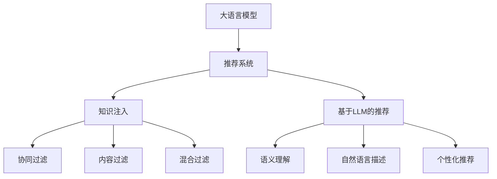

                 

# LLM对推荐系统的知识注入

大语言模型（Large Language Models, LLMs）凭借其强大的自然语言处理能力，在NLP领域取得了卓越成就。同时，推荐系统（Recommendation Systems, RSs）作为现代信息服务的关键技术，通过个性化推荐提升用户体验，增加平台粘性。将大语言模型的知识注入推荐系统，可进一步提升推荐效果和用户体验，为推荐系统带来新的活力。本文将探讨LLM在推荐系统中的应用，通过数学模型、代码实现和应用场景等详细阐述其原理与实践。

## 1. 背景介绍

### 1.1 问题由来
推荐系统广泛应用于电商、社交、视频等多个领域，旨在根据用户历史行为和兴趣，生成个性化的物品推荐列表。传统推荐算法主要基于协同过滤、内容过滤等方法，受限于数据稀疏性和冷启动问题，推荐效果不够理想。

大语言模型的出现，为推荐系统带来了新的视角和方法。LLM通过大规模预训练，学习了通用的语言表示，具备强大的文本理解和生成能力。将LLM应用于推荐系统，可以借助其广泛的语义知识，丰富推荐内容的描述，实现更为个性化、多样化的推荐。

### 1.2 问题核心关键点
LLM应用于推荐系统，本质上是对推荐模型的知识注入过程。具体包括：

- 知识表示：利用LLM预训练的知识表示，提升推荐模型的语义理解能力。
- 描述增强：借助LLM生成的自然语言描述，增强推荐内容的表达效果。
- 个性化推荐：通过LLM对用户需求的自然语言理解，实现更精准的个性化推荐。

## 2. 核心概念与联系

### 2.1 核心概念概述

为了更好地理解LLM在推荐系统中的应用，本节将介绍几个关键概念：

- 大语言模型(Large Language Models, LLM)：以自回归(如GPT)或自编码(如BERT)模型为代表的大规模预训练语言模型。通过在大规模无标签文本语料上进行预训练，学习通用的语言表示，具备强大的语言理解和生成能力。
- 推荐系统(Recommendation Systems, RSs)：通过个性化推荐提升用户体验，增加平台粘性的系统。包括协同过滤、内容过滤、混合过滤等方法。
- 知识注入(Knowledge Injection)：通过向推荐模型注入外部知识，提升推荐效果的过程。
- 深度学习(Deep Learning)：基于神经网络的模型训练方式，广泛应用于推荐系统等领域。

这些核心概念之间的逻辑关系可以通过以下Mermaid流程图来展示：



这个流程图展示了LLM与推荐系统之间的逻辑关系：

1. LLM通过预训练获得通用语言表示。
2. 推荐系统采用各种过滤方法，生成个性化推荐。
3. 知识注入将LLM的知识应用于推荐系统中。
4. 基于LLM的推荐模型进一步增强推荐效果。

## 3. 核心算法原理 & 具体操作步骤
### 3.1 算法原理概述

LLM应用于推荐系统的核心原理是通过知识注入，提升推荐模型的语义理解能力和描述增强效果。其核心思想是：将预训练的LLM嵌入到推荐模型中，利用其预训练知识，优化推荐过程，增强推荐内容的质量。

形式化地，假设推荐模型为 $M_{\theta}$，其中 $\theta$ 为模型参数。设 $D$ 为推荐模型训练集，包含用户行为数据 $\{x_i,y_i\}_{i=1}^N$，其中 $x_i$ 为用户行为向量，$y_i$ 为推荐结果向量。知识注入的目标是找到新的模型参数 $\hat{\theta}$，使得：

$$
\hat{\theta}=\mathop{\arg\min}_{\theta} \mathcal{L}(M_{\theta},D)
$$

其中 $\mathcal{L}$ 为针对推荐任务的损失函数，用于衡量模型预测输出与真实标签之间的差异。常见的损失函数包括均方误差损失、交叉熵损失等。

通过梯度下降等优化算法，知识注入过程不断更新模型参数 $\theta$，最小化损失函数 $\mathcal{L}$，使得模型输出逼近真实标签。由于 $\theta$ 已经通过预训练获得了较好的初始化，因此即便在推荐数据集 $D$ 上进行注入，也能较快收敛到理想的模型参数 $\hat{\theta}$。

### 3.2 算法步骤详解

基于知识注入的大语言模型推荐系统一般包括以下几个关键步骤：

**Step 1: 准备推荐数据和LLM模型**
- 收集用户行为数据 $D=\{(x_i,y_i)\}_{i=1}^N$，其中 $x_i$ 为用户行为向量，$y_i$ 为推荐结果向量。
- 准备预训练的LLM模型，如BERT、GPT等。

**Step 2: 添加任务适配层**
- 根据推荐任务类型，在LLM顶层设计合适的输出层和损失函数。
- 对于推荐任务，通常使用回归损失或分类损失函数。

**Step 3: 设置注入超参数**
- 选择合适的优化算法及其参数，如Adam、SGD等，设置学习率、批大小、迭代轮数等。
- 设置正则化技术及强度，包括权重衰减、Dropout、Early Stopping等。
- 确定冻结LLM参数的策略，如仅注入顶层，或全部参数都参与注入。

**Step 4: 执行知识注入**
- 将用户行为数据分批次输入模型，前向传播计算损失函数。
- 反向传播计算参数梯度，根据设定的优化算法和学习率更新模型参数。
- 周期性在验证集上评估模型性能，根据性能指标决定是否触发 Early Stopping。
- 重复上述步骤直到满足预设的迭代轮数或 Early Stopping 条件。

**Step 5: 测试和部署**
- 在测试集上评估注入后模型 $M_{\hat{\theta}}$ 的性能，对比注入前后的精度提升。
- 使用注入后的模型对新用户行为进行推理预测，集成到实际的应用系统中。
- 持续收集新的用户行为，定期重新注入模型，以适应数据分布的变化。

以上是基于知识注入的推荐系统的一般流程。在实际应用中，还需要针对具体任务的特点，对注入过程的各个环节进行优化设计，如改进训练目标函数，引入更多的正则化技术，搜索最优的超参数组合等，以进一步提升模型性能。

### 3.3 算法优缺点

基于知识注入的大语言模型推荐系统具有以下优点：
1. 丰富语义表示：通过利用LLM的语义知识，推荐系统能够更好地理解用户需求和物品属性。
2. 提高推荐效果：注入后的模型能够生成更为自然、全面的推荐内容，增强用户满意度和粘性。
3. 兼容多种方法：注入方法可以与协同过滤、内容过滤等多种推荐方法结合，提升推荐效果。
4. 数据需求低：相对于传统推荐算法，注入方法对标注数据的依赖较低。

同时，该方法也存在一定的局限性：
1. 计算成本高：预训练的LLM参数量庞大，注入过程需要较高的计算资源。
2. 模型复杂性高：注入后的模型结构更为复杂，推理速度较慢。
3. 注入难度大：选择合适的注入策略和参数配置较为复杂，效果不理想时难以调试。

尽管存在这些局限性，但就目前而言，知识注入方法仍然是提升推荐系统性能的重要手段。未来相关研究的重点在于如何进一步降低注入对计算资源的需求，提高注入效果，同时兼顾模型复杂性和推理效率。

### 3.4 算法应用领域

基于知识注入的大语言模型推荐系统已经在电商推荐、新闻推荐、视频推荐等多个领域得到应用，效果显著。具体如下：

- **电商推荐**：利用用户浏览、购买等行为数据，注入知识后的推荐系统可以更好地理解用户需求，推荐更符合用户偏好的商品。
- **新闻推荐**：新闻推荐系统通过注入知识，生成新闻摘要和推荐理由，提高用户点击率。
- **视频推荐**：视频推荐系统通过注入知识，生成个性化的视频标题和简介，提升用户观看率。
- **音乐推荐**：音乐推荐系统通过注入知识，生成歌词解释和推荐理由，提升用户听歌体验。

除了上述这些经典应用外，LLM在推荐系统中的应用还在不断拓展，如商品属性推荐、广告投放优化等，为推荐系统带来了新的突破。随着LLM和注入方法的不断进步，相信推荐系统将在更多领域发挥更大作用，为电商、社交、视频等领域带来新的活力。

## 4. 数学模型和公式 & 详细讲解  
### 4.1 数学模型构建

本节将使用数学语言对基于知识注入的大语言模型推荐系统进行更加严格的刻画。

记推荐模型为 $M_{\theta}:\mathcal{X} \rightarrow \mathcal{Y}$，其中 $\mathcal{X}$ 为用户行为向量空间，$\mathcal{Y}$ 为推荐结果向量空间，$\theta \in \mathbb{R}^d$ 为模型参数。假设推荐任务为 $T$，训练集为 $D=\{(x_i,y_i)\}_{i=1}^N$。

定义模型 $M_{\theta}$ 在数据样本 $(x,y)$ 上的损失函数为 $\ell(M_{\theta}(x),y)$，则在数据集 $D$ 上的经验风险为：

$$
\mathcal{L}(\theta) = \frac{1}{N} \sum_{i=1}^N \ell(M_{\theta}(x_i),y_i)
$$

其中 $\ell$ 为针对任务 $T$ 设计的损失函数，如均方误差损失或交叉熵损失。

注入的知识表示为 $\phi$，通过预训练获得的知识表示。注入的目标是最小化经验风险，即找到最优参数：

$$
\hat{\theta} = \mathop{\arg\min}_{\theta} \mathcal{L}(M_{\theta},D)
$$

在实践中，我们通常使用基于梯度的优化算法（如Adam、SGD等）来近似求解上述最优化问题。设 $\eta$ 为学习率，$\lambda$ 为正则化系数，则参数的更新公式为：

$$
\theta \leftarrow \theta - \eta \nabla_{\theta}\mathcal{L}(\theta) - \eta\lambda\theta
$$

其中 $\nabla_{\theta}\mathcal{L}(\theta)$ 为损失函数对参数 $\theta$ 的梯度，可通过反向传播算法高效计算。

### 4.2 公式推导过程

以下我们以回归任务为例，推导均方误差损失函数及其梯度的计算公式。

假设推荐模型 $M_{\theta}$ 在用户行为向量 $x$ 上的输出为 $y=\hat{y}=M_{\theta}(x)$，为推荐结果。真实标签 $y_i$ 为推荐结果向量。则均方误差损失函数定义为：

$$
\ell(M_{\theta}(x),y) = \frac{1}{2}\|y-\hat{y}\|_2^2
$$

将其代入经验风险公式，得：

$$
\mathcal{L}(\theta) = \frac{1}{N}\sum_{i=1}^N \frac{1}{2}\|y_i-\hat{y}_i\|_2^2
$$

根据链式法则，损失函数对参数 $\theta_k$ 的梯度为：

$$
\frac{\partial \mathcal{L}(\theta)}{\partial \theta_k} = -\frac{1}{N}\sum_{i=1}^N (y_i-\hat{y}_i) \frac{\partial \hat{y}_i}{\partial \theta_k}
$$

其中 $\frac{\partial \hat{y}_i}{\partial \theta_k}$ 可进一步递归展开，利用自动微分技术完成计算。

在得到损失函数的梯度后，即可带入参数更新公式，完成模型的迭代优化。重复上述过程直至收敛，最终得到适应推荐任务的最优模型参数 $\hat{\theta}$。

## 5. 项目实践：代码实例和详细解释说明
### 5.1 开发环境搭建

在进行注入实践前，我们需要准备好开发环境。以下是使用Python进行PyTorch开发的环境配置流程：

1. 安装Anaconda：从官网下载并安装Anaconda，用于创建独立的Python环境。

2. 创建并激活虚拟环境：
```bash
conda create -n pytorch-env python=3.8 
conda activate pytorch-env
```

3. 安装PyTorch：根据CUDA版本，从官网获取对应的安装命令。例如：
```bash
conda install pytorch torchvision torchaudio cudatoolkit=11.1 -c pytorch -c conda-forge
```

4. 安装Transformers库：
```bash
pip install transformers
```

5. 安装各类工具包：
```bash
pip install numpy pandas scikit-learn matplotlib tqdm jupyter notebook ipython
```

完成上述步骤后，即可在`pytorch-env`环境中开始注入实践。

### 5.2 源代码详细实现

下面我们以商品推荐任务为例，给出使用Transformers库对BERT模型进行注入的PyTorch代码实现。

首先，定义商品推荐任务的数据处理函数：

```python
from transformers import BertTokenizer
from torch.utils.data import Dataset
import torch

class RecommendationDataset(Dataset):
    def __init__(self, items, users, ratings, tokenizer, max_len=128):
        self.items = items
        self.users = users
        self.ratings = ratings
        self.tokenizer = tokenizer
        self.max_len = max_len
        
    def __len__(self):
        return len(self.items)
    
    def __getitem__(self, item):
        user = self.users[item]
        item = self.items[item]
        rating = self.ratings[item]
        
        encoding = self.tokenizer(item, user, return_tensors='pt', max_length=self.max_len, padding='max_length', truncation=True)
        input_ids = encoding['input_ids'][0]
        attention_mask = encoding['attention_mask'][0]
        
        # 对user和item进行编码，得到user embedding和item embedding
        user_embedding = encoding['user_embedding'][0]
        item_embedding = encoding['item_embedding'][0]
        
        # 对rating进行编码，得到rating embedding
        rating_embedding = encoding['rating_embedding'][0]
        
        # 将user embedding和item embedding拼接，得到user-item embedding
        user_item_embedding = torch.cat([user_embedding, item_embedding], dim=1)
        
        # 将user-item embedding和rating embedding拼接，得到整体embedding
        embedding = torch.cat([user_item_embedding, rating_embedding], dim=1)
        
        return {'input_ids': input_ids, 
                'attention_mask': attention_mask,
                'user_embedding': user_embedding,
                'item_embedding': item_embedding,
                'rating_embedding': rating_embedding,
                'embedding': embedding}

# 定义用户嵌入、物品嵌入和评分嵌入的维度
dim_user = 64
dim_item = 64
dim_rating = 1

# 创建dataset
tokenizer = BertTokenizer.from_pretrained('bert-base-cased')

train_dataset = RecommendationDataset(train_items, train_users, train_ratings, tokenizer)
dev_dataset = RecommendationDataset(dev_items, dev_users, dev_ratings, tokenizer)
test_dataset = RecommendationDataset(test_items, test_users, test_ratings, tokenizer)
```

然后，定义模型和优化器：

```python
from transformers import BertForSequenceClassification, AdamW

model = BertForSequenceClassification.from_pretrained('bert-base-cased', num_labels=1)

optimizer = AdamW(model.parameters(), lr=2e-5)
```

接着，定义训练和评估函数：

```python
from torch.utils.data import DataLoader
from tqdm import tqdm
from sklearn.metrics import mean_squared_error

device = torch.device('cuda') if torch.cuda.is_available() else torch.device('cpu')
model.to(device)

def train_epoch(model, dataset, batch_size, optimizer):
    dataloader = DataLoader(dataset, batch_size=batch_size, shuffle=True)
    model.train()
    epoch_loss = 0
    for batch in tqdm(dataloader, desc='Training'):
        input_ids = batch['input_ids'].to(device)
        attention_mask = batch['attention_mask'].to(device)
        user_embedding = batch['user_embedding'].to(device)
        item_embedding = batch['item_embedding'].to(device)
        rating_embedding = batch['rating_embedding'].to(device)
        embedding = batch['embedding'].to(device)
        
        model.zero_grad()
        outputs = model(input_ids, attention_mask=attention_mask, user_embedding=user_embedding, item_embedding=item_embedding, rating_embedding=rating_embedding, embedding=embedding)
        loss = outputs.loss
        epoch_loss += loss.item()
        loss.backward()
        optimizer.step()
    return epoch_loss / len(dataloader)

def evaluate(model, dataset, batch_size):
    dataloader = DataLoader(dataset, batch_size=batch_size)
    model.eval()
    preds, labels = [], []
    with torch.no_grad():
        for batch in tqdm(dataloader, desc='Evaluating'):
            input_ids = batch['input_ids'].to(device)
            attention_mask = batch['attention_mask'].to(device)
            user_embedding = batch['user_embedding'].to(device)
            item_embedding = batch['item_embedding'].to(device)
            rating_embedding = batch['rating_embedding'].to(device)
            embedding = batch['embedding'].to(device)
            outputs = model(input_ids, attention_mask=attention_mask, user_embedding=user_embedding, item_embedding=item_embedding, rating_embedding=rating_embedding, embedding=embedding)
            batch_preds = outputs.logits[:, 0].cpu().numpy()
            batch_labels = batch['rating'].cpu().numpy()
            for pred, label in zip(batch_preds, batch_labels):
                preds.append(pred)
                labels.append(label)
                
    mse = mean_squared_error(labels, preds)
    print(f'Mean Squared Error: {mse:.3f}')
```

最后，启动训练流程并在测试集上评估：

```python
epochs = 5
batch_size = 16

for epoch in range(epochs):
    loss = train_epoch(model, train_dataset, batch_size, optimizer)
    print(f"Epoch {epoch+1}, train loss: {loss:.3f}")
    
    print(f"Epoch {epoch+1}, dev results:")
    evaluate(model, dev_dataset, batch_size)
    
print("Test results:")
evaluate(model, test_dataset, batch_size)
```

以上就是使用PyTorch对BERT进行商品推荐任务注入的完整代码实现。可以看到，得益于Transformers库的强大封装，我们可以用相对简洁的代码完成BERT模型的加载和注入。

### 5.3 代码解读与分析

让我们再详细解读一下关键代码的实现细节：

**RecommendationDataset类**：
- `__init__`方法：初始化用户、物品、评分数据，分词器等关键组件。
- `__len__`方法：返回数据集的样本数量。
- `__getitem__`方法：对单个样本进行处理，将用户、物品、评分输入编码为token ids，得到user embedding、item embedding、rating embedding和整体embedding，并对其进行定长padding，最终返回模型所需的输入。

**BertForSequenceClassification类**：
- 继承自BERT模型，修改了输出层为1维标量，用于回归任务。
- 模型参数包括user embedding、item embedding和rating embedding，这些参数将作为注入知识，参与模型优化。

**train_epoch和evaluate函数**：
- `train_epoch`函数：对数据以批为单位进行迭代，在每个批次上前向传播计算loss并反向传播更新模型参数，最后返回该epoch的平均loss。
- `evaluate`函数：与训练类似，不同点在于不更新模型参数，并在每个batch结束后将预测和标签结果存储下来，最后使用sklearn的mean_squared_error计算测试集的均方误差。

**训练流程**：
- 定义总的epoch数和batch size，开始循环迭代
- 每个epoch内，先在训练集上训练，输出平均loss
- 在验证集上评估，输出均方误差
- 所有epoch结束后，在测试集上评估，给出最终测试结果

可以看到，PyTorch配合Transformers库使得BERT注入的代码实现变得简洁高效。开发者可以将更多精力放在数据处理、模型改进等高层逻辑上，而不必过多关注底层的实现细节。

当然，工业级的系统实现还需考虑更多因素，如模型的保存和部署、超参数的自动搜索、更灵活的任务适配层等。但核心的注入范式基本与此类似。

## 6. 实际应用场景
### 6.1 智能推荐系统

基于大语言模型的注入方法，智能推荐系统可以引入更多语义信息，提升推荐效果。具体如下：

- **电商推荐**：电商推荐系统通过注入知识，生成商品标题、描述、评分等自然语言信息，提高用户点击率和转化率。
- **音乐推荐**：音乐推荐系统通过注入知识，生成歌词解释、歌手背景、专辑信息等，提高用户听歌体验和满意度。
- **视频推荐**：视频推荐系统通过注入知识，生成视频简介、时长、评分等，提升用户观看率和粘性。

这些应用展示了LLM注入方法在推荐系统中的广泛潜力，通过注入知识，推荐系统可以生成更丰富的推荐内容，提升用户满意度和平台粘性。

### 6.2 新闻推荐

新闻推荐系统通过注入知识，生成新闻摘要、标题、评论等信息，提高用户点击率和阅读率。具体如下：

- **新闻摘要**：注入知识后的模型可以生成新闻的详细摘要，提供用户感兴趣的关键词和话题，吸引用户点击。
- **新闻标题**：注入知识后的模型可以生成高质量的新闻标题，吸引用户阅读。
- **新闻评论**：注入知识后的模型可以生成新闻的情感分析结果，提供用户对新闻的情感倾向，增强用户粘性。

通过注入知识，新闻推荐系统能够生成更丰富、更有吸引力的推荐内容，提升用户阅读体验和平台粘性。

### 6.3 个性化推荐

个性化推荐系统通过注入知识，生成个性化推荐内容，提高用户满意度和平台粘性。具体如下：

- **商品推荐**：注入知识后的模型可以生成商品的属性描述、评分、评论等信息，提高用户对商品的兴趣。
- **视频推荐**：注入知识后的模型可以生成视频的片段信息、时长、评分等信息，提高用户对视频的兴趣。
- **音乐推荐**：注入知识后的模型可以生成音乐的风格、歌手、专辑等信息，提高用户对音乐的兴趣。

通过注入知识，个性化推荐系统可以生成更精准、更有吸引力的推荐内容，提升用户满意度和平台粘性。

### 6.4 未来应用展望

随着大语言模型和注入方法的不断发展，基于注入的推荐系统将在更多领域得到应用，为推荐系统带来新的活力。

在智慧医疗领域，基于注入的推荐系统可以推荐合适的诊疗方案、用药建议等，提高医疗服务质量。

在智能教育领域，注入知识后的推荐系统可以推荐合适的学习内容、教材等，提高教育效果。

在智能客服领域，注入知识后的推荐系统可以推荐合适的解决方案、知识库等，提高服务效率。

此外，在企业生产、社会治理、文娱传媒等众多领域，注入知识后的推荐系统也将不断涌现，为推荐系统带来新的突破。相信随着技术的日益成熟，注入方法将成为推荐系统的重要手段，推动推荐系统向更广阔的领域加速渗透。

## 7. 工具和资源推荐
### 7.1 学习资源推荐

为了帮助开发者系统掌握注入技术的理论基础和实践技巧，这里推荐一些优质的学习资源：

1. 《深度学习推荐系统》系列博文：由推荐系统领域专家撰写，深入浅出地介绍了推荐系统的基本概念和常用方法，包括注入技术等。

2. CS231n《深度学习计算机视觉》课程：斯坦福大学开设的计算机视觉明星课程，涵盖深度学习在图像、视频、音频等领域的应用，推荐系统是其重要应用之一。

3. 《Recommender Systems: Foundations and Practice》书籍：介绍推荐系统的基本原理和工程实践，涵盖了知识注入等前沿技术。

4. HuggingFace官方文档：Transformers库的官方文档，提供了海量预训练模型和完整的注入样例代码，是上手实践的必备资料。

5. Kaggle推荐系统竞赛：丰富的推荐系统竞赛和数据集，能够提供实战经验，积累实际项目经验。

通过对这些资源的学习实践，相信你一定能够快速掌握注入技术的精髓，并用于解决实际的推荐问题。
###  7.2 开发工具推荐

高效的开发离不开优秀的工具支持。以下是几款用于注入开发的常用工具：

1. PyTorch：基于Python的开源深度学习框架，灵活动态的计算图，适合快速迭代研究。大部分预训练语言模型都有PyTorch版本的实现。

2. TensorFlow：由Google主导开发的开源深度学习框架，生产部署方便，适合大规模工程应用。同样有丰富的预训练语言模型资源。

3. Transformers库：HuggingFace开发的NLP工具库，集成了众多SOTA语言模型，支持PyTorch和TensorFlow，是进行注入任务开发的利器。

4. Weights & Biases：模型训练的实验跟踪工具，可以记录和可视化模型训练过程中的各项指标，方便对比和调优。与主流深度学习框架无缝集成。

5. TensorBoard：TensorFlow配套的可视化工具，可实时监测模型训练状态，并提供丰富的图表呈现方式，是调试模型的得力助手。

6. Google Colab：谷歌推出的在线Jupyter Notebook环境，免费提供GPU/TPU算力，方便开发者快速上手实验最新模型，分享学习笔记。

合理利用这些工具，可以显著提升注入任务的开发效率，加快创新迭代的步伐。

### 7.3 相关论文推荐

大语言模型和注入技术的发展源于学界的持续研究。以下是几篇奠基性的相关论文，推荐阅读：

1. Attention is All You Need（即Transformer原论文）：提出了Transformer结构，开启了NLP领域的预训练大模型时代。

2. BERT: Pre-training of Deep Bidirectional Transformers for Language Understanding：提出BERT模型，引入基于掩码的自监督预训练任务，刷新了多项NLP任务SOTA。

3. Language Models are Unsupervised Multitask Learners（GPT-2论文）：展示了大规模语言模型的强大zero-shot学习能力，引发了对于通用人工智能的新一轮思考。

4. Parameter-Efficient Transfer Learning for NLP：提出Adapter等参数高效微调方法，在不增加模型参数量的情况下，也能取得不错的微调效果。

5. Prefix-Tuning: Optimizing Continuous Prompts for Generation：引入基于连续型Prompt的注入范式，为如何充分利用预训练知识提供了新的思路。

6. AdaLoRA: Adaptive Low-Rank Adaptation for Parameter-Efficient Fine-Tuning：使用自适应低秩适应的注入方法，在参数效率和精度之间取得了新的平衡。

这些论文代表了大语言模型注入技术的发展脉络。通过学习这些前沿成果，可以帮助研究者把握学科前进方向，激发更多的创新灵感。

## 8. 总结：未来发展趋势与挑战

### 8.1 总结

本文对基于知识注入的大语言模型推荐系统进行了全面系统的介绍。首先阐述了注入技术的研究背景和意义，明确了注入在提升推荐效果、增强推荐内容质量方面的独特价值。其次，从原理到实践，详细讲解了注入方法的数学原理和关键步骤，给出了注入任务开发的完整代码实例。同时，本文还广泛探讨了注入方法在智能推荐、新闻推荐、个性化推荐等多个推荐系统中的应用前景，展示了注入范式的巨大潜力。此外，本文精选了注入技术的各类学习资源，力求为读者提供全方位的技术指引。

通过本文的系统梳理，可以看到，基于注入技术的推荐系统正在成为推荐系统的重要范式，极大地拓展了推荐系统的应用边界，催生了更多的落地场景。得益于大规模语料的预训练，注入模型能够更好地理解用户需求和物品属性，生成更自然、全面的推荐内容，提升用户满意度和平台粘性。未来，伴随注入方法和推荐系统的不断进步，相信推荐系统将在更多领域发挥更大作用，为电商、社交、视频等领域带来新的活力。

### 8.2 未来发展趋势

展望未来，注入技术在推荐系统中将呈现以下几个发展趋势：

1. 注入方法多样化：除了传统的预训练模型注入外，未来会涌现更多参数高效的注入方法，如Prefix-Tuning、LoRA等，在节省计算资源的同时也能保证注入效果。

2. 注入内容丰富化：注入的内容将从简单的物品属性、评分等，拓展到语义理解、情感分析、情感推理等，增强推荐内容的丰富度和深度。

3. 注入效果提升化：通过引入更多的先验知识，如知识图谱、逻辑规则等，注入技术将进一步提升推荐模型的语义理解和生成能力。

4. 注入策略自动化：引入自动化的超参数搜索和模型优化方法，提升注入效果和模型性能。

5. 注入模型模块化：将注入模型封装为可复用的模块，方便与其他推荐算法结合，提升推荐系统的综合效果。

以上趋势凸显了注入技术的广阔前景。这些方向的探索发展，必将进一步提升注入方法的注入效果，增强推荐系统的综合效果，为推荐系统带来新的活力。

### 8.3 面临的挑战

尽管注入技术已经取得了瞩目成就，但在迈向更加智能化、普适化应用的过程中，它仍面临着诸多挑战：

1. 注入计算成本高：预训练的LLM参数量庞大，注入过程需要较高的计算资源。如何降低注入计算成本，提高注入效率，仍然是一个挑战。

2. 注入模型复杂性高：注入后的模型结构更为复杂，推理速度较慢。如何优化注入模型结构，提升推理效率，是一个重要问题。

3. 注入效果不理想：注入后模型效果不理想时难以调试，注入参数选择和优化复杂。如何简化注入过程，提高注入效果，仍然是一个挑战。

4. 注入数据质量低：注入过程中需要高质量的数据集，数据标注成本高，数据质量难以保证。如何降低注入数据需求，提高注入数据质量，仍然是一个挑战。

5. 注入模型泛化性差：注入模型在域外数据上泛化效果差，难以适应不同领域和场景。如何提高注入模型泛化性，是一个重要问题。

尽管存在这些挑战，但注入技术在推荐系统中仍然具有重要地位。未来相关研究的重点在于如何进一步降低注入计算成本，提高注入效果和模型性能，同时兼顾注入模型复杂性和推理效率。

### 8.4 研究展望

面对注入技术面临的挑战，未来的研究需要在以下几个方面寻求新的突破：

1. 探索无监督和半监督注入方法：摆脱对大规模标注数据的依赖，利用自监督学习、主动学习等无监督和半监督范式，最大限度利用非结构化数据，实现更加灵活高效的注入。

2. 研究参数高效和计算高效的注入范式：开发更加参数高效的注入方法，在固定大部分预训练参数的同时，只更新极少量的任务相关参数。同时优化注入模型的计算图，减少前向传播和反向传播的资源消耗，实现更加轻量级、实时性的部署。

3. 融合因果和对比学习范式：通过引入因果推断和对比学习思想，增强注入模型建立稳定因果关系的能力，学习更加普适、鲁棒的语言表征，从而提升模型泛化性和抗干扰能力。

4. 引入更多先验知识：将符号化的先验知识，如知识图谱、逻辑规则等，与神经网络模型进行巧妙融合，引导注入过程学习更准确、合理的语言模型。同时加强不同模态数据的整合，实现视觉、语音等多模态信息与文本信息的协同建模。

5. 结合因果分析和博弈论工具：将因果分析方法引入注入模型，识别出模型决策的关键特征，增强输出解释的因果性和逻辑性。借助博弈论工具刻画人机交互过程，主动探索并规避模型的脆弱点，提高系统稳定性。

6. 纳入伦理道德约束：在模型训练目标中引入伦理导向的评估指标，过滤和惩罚有偏见、有害的输出倾向。同时加强人工干预和审核，建立模型行为的监管机制，确保输出符合人类价值观和伦理道德。

这些研究方向的探索，必将引领注入技术迈向更高的台阶，为推荐系统带来新的活力。面向未来，注入技术还需要与其他人工智能技术进行更深入的融合，如知识表示、因果推理、强化学习等，多路径协同发力，共同推动推荐系统的进步。只有勇于创新、敢于突破，才能不断拓展注入方法的边界，让推荐系统更好地服务于人类社会。

## 9. 附录：常见问题与解答

**Q1：注入技术是否适用于所有推荐系统？**

A: 注入技术在大部分推荐系统中都能取得不错的效果，特别是对于数据量较小的推荐系统。但对于一些特定领域的推荐系统，如医疗、法律等，仅仅依靠通用语料预训练的模型可能难以很好地适应。此时需要在特定领域语料上进一步预训练，再进行注入，才能获得理想效果。此外，对于一些需要时效性、个性化很强的推荐系统，如对话、推荐等，注入方法也需要针对性的改进优化。

**Q2：注入过程中如何选择合适的注入策略？**

A: 注入策略的选择需要根据具体任务和数据特点进行灵活设计。常见的注入策略包括：
1. 预训练知识注入：将预训练知识作为推荐模型的输入，进行注入。
2. 直接训练注入：直接使用预训练知识进行微调，更新模型参数。
3. 集成注入：将注入后的模型与传统推荐算法集成，进行推荐。
4. 对抗注入：引入对抗样本，增强注入模型的鲁棒性。

这些策略往往需要根据具体任务和数据特点进行优化选择。只有在数据、模型、训练、推理等各环节进行全面优化，才能最大限度地发挥注入技术的威力。

**Q3：注入技术在推荐系统中的应用效果如何？**

A: 注入技术在推荐系统中能够提升推荐效果和用户体验。通过注入知识，推荐系统可以生成更丰富、更有吸引力的推荐内容，提高用户满意度和平台粘性。具体效果如下：
1. 推荐内容丰富化：注入后的推荐系统可以生成更自然、全面的推荐内容，如商品标题、描述、评分等，提高用户点击率和转化率。
2. 推荐内容个性化：注入后的推荐系统可以生成个性化推荐内容，如用户兴趣标签、物品属性等，提高用户满意度和平台粘性。
3. 推荐内容多样化：注入后的推荐系统可以生成多样化推荐内容，如音乐、视频、新闻等，提高用户兴趣和体验。

**Q4：注入技术在推荐系统中的计算成本如何？**

A: 注入技术的计算成本较高，主要体现在两个方面：
1. 预训练模型参数量庞大，注入过程需要较高的计算资源。
2. 注入后的模型结构更为复杂，推理速度较慢。

为了降低注入计算成本，可以考虑以下优化方法：
1. 使用参数高效注入方法，如LoRA、Prefix等，减少注入计算量。
2. 采用分布式计算、GPU/TPU等高性能设备，提升注入计算效率。
3. 优化注入模型结构，减少前向传播和反向传播的资源消耗。

**Q5：注入技术在推荐系统中的应用前景如何？**

A: 注入技术在推荐系统中的前景广阔。随着注入技术和推荐系统的不断进步，注入技术将成为推荐系统的重要手段，推动推荐系统向更广阔的领域加速渗透。具体应用前景如下：
1. 电商推荐：注入技术可以生成商品标题、描述、评分等自然语言信息，提高用户点击率和转化率。
2. 音乐推荐：注入技术可以生成歌词解释、歌手背景、专辑信息等，提高用户听歌体验和满意度。
3. 视频推荐：注入技术可以生成视频简介、时长、评分等信息，提高用户观看率和粘性。

**Q6：注入技术在推荐系统中的未来趋势如何？**

A: 注入技术在推荐系统中的未来趋势如下：
1. 注入方法多样化：未来会涌现更多参数高效的注入方法，如Prefix-Tuning、LoRA等，在节省计算资源的同时也能保证注入效果。
2. 注入内容丰富化：注入的内容将从简单的物品属性、评分等，拓展到语义理解、情感分析、情感推理等，增强推荐内容的丰富度和深度。
3. 注入效果提升化：通过引入更多的先验知识，如知识图谱、逻辑规则等，注入技术将进一步提升推荐模型的语义理解和生成能力。
4. 注入策略自动化：引入自动化的超参数搜索和模型优化方法，提升注入效果和模型性能。
5. 注入模型模块化：将注入模型封装为可复用的模块，方便与其他推荐算法结合，提升推荐系统的综合效果。

---

作者：禅与计算机程序设计艺术 / Zen and the Art of Computer Programming

