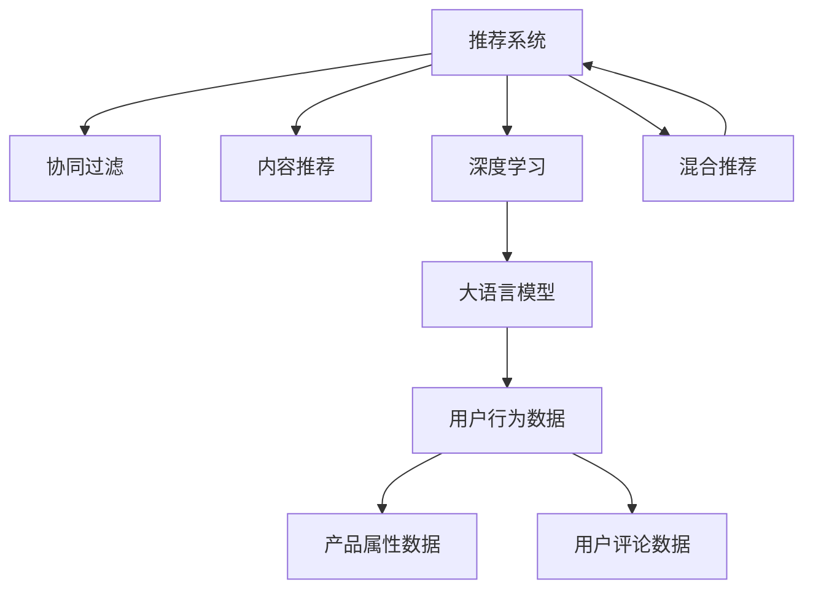

                 

# LLM推荐中的多源信息融合技术

> 关键词：推荐系统,LLM,多源信息融合,深度学习,自然语言处理,协同过滤,内容推荐,混合推荐

## 1. 背景介绍

在当今信息爆炸的时代，推荐系统成为了各大互联网公司获取流量和提升用户粘性的重要手段。传统推荐系统主要依赖用户行为数据进行协同过滤和内容推荐，但这种推荐方式往往忽视了用户意图的多样性和内容的丰富性，难以满足用户的多样化需求。

近年来，基于深度学习技术的大语言模型（Large Language Model, LLM）在自然语言处理（Natural Language Processing, NLP）领域取得了重大突破，特别是GPT-3等模型在自然语言生成和语义理解方面展现出了惊人的能力。基于此，一些公司开始尝试利用预训练的LLM来优化推荐系统，通过分析用户文本反馈和产品描述，进行更加精准和个性化的推荐。

## 2. 核心概念与联系

### 2.1 核心概念概述

为更好地理解LLM在推荐系统中的应用，本节将介绍几个关键概念：

- 推荐系统（Recommender System）：通过分析用户的历史行为和兴趣，预测用户未来可能感兴趣的商品或服务，从而实现个性化推荐。推荐系统广泛应用于电商、新闻、音乐、视频等多个领域。

- 大语言模型（Large Language Model, LLM）：以自回归或自编码模型为代表的大规模预训练语言模型。通过在大规模无标签文本语料上进行预训练，学习通用的语言表示，具备强大的语言理解和生成能力。

- 协同过滤（Collaborative Filtering, CF）：利用用户与商品之间的相似性关系，通过矩阵分解或奇异值分解等方法，预测用户对未交互商品的评分。

- 内容推荐（Content-Based Recommendation）：通过商品的属性（如标签、分类、描述等）进行推荐，适用于商品属性明确的领域。

- 混合推荐（Hybrid Recommendation）：将协同过滤和内容推荐等方法相结合，发挥各自优势，提升推荐精度和用户满意度。

- 多源信息融合（Multi-source Information Fusion）：将不同来源的数据（如用户行为数据、产品属性数据、用户评论数据等）进行整合，利用先进的算法技术，提升推荐模型的泛化能力和精度。

这些核心概念之间的逻辑关系可以通过以下Mermaid流程图来展示：



这个流程图展示了一些关键概念之间的关联：

1. 推荐系统通过协同过滤、内容推荐等方法进行推荐。
2. 深度学习（包括LLM）技术可以用于改进推荐模型的性能。
3. LLM可以从产品属性、用户评论等多源信息中提取有用信息，进行推荐。
4. 混合推荐将多种推荐方法结合，提升推荐效果。
5. 多源信息融合将不同来源的数据整合，利用先进算法提升推荐模型。

## 3. 核心算法原理 & 具体操作步骤
### 3.1 算法原理概述

在推荐系统中引入大语言模型，主要利用其强大的自然语言理解和生成能力，从多源信息中提取有用信息，并结合用户行为数据和商品属性信息，进行更加精准和个性化的推荐。

形式化地，假设推荐系统的用户集合为 $U$，商品集合为 $I$，用户与商品之间的交互矩阵为 $R \in \mathbb{R}^{n \times m}$，其中 $n$ 为商品数量，$m$ 为用户数量。推荐系统通过协同过滤和内容推荐等方法，预测用户 $u$ 对商品 $i$ 的评分 $r_{ui}$。为了提升推荐效果，我们可以在预测评分时，引入大语言模型 $M_{\theta}$，通过多源信息融合，进一步优化预测结果。

假设 $f_u$ 表示用户 $u$ 的文本描述（如评论、签名等），$c_i$ 表示商品 $i$ 的描述（如标签、类别等）。利用大语言模型 $M_{\theta}$，可以分别提取用户和商品的语义表示 $\overrightarrow{u}, \overrightarrow{i}$。同时，利用用户行为数据 $r_{ui}$，可以得到用户对商品的评分预测 $p_{ui}$。结合多源信息融合算法，最终预测用户对商品的评分 $r_{ui}$ 为：

$$
r_{ui} = \alpha p_{ui} + \beta \overrightarrow{u} \cdot \overrightarrow{i}
$$

其中 $\alpha$ 和 $\beta$ 为权重系数，控制各信息源的贡献度。

### 3.2 算法步骤详解

基于上述算法原理，LLM推荐中的多源信息融合技术可以概括为以下几个关键步骤：

**Step 1: 数据准备**
- 收集用户行为数据，包括用户的浏览、购买、评分等行为。
- 收集商品属性数据，包括商品的标签、分类、描述等。
- 收集用户文本数据，包括用户的评论、签名等。

**Step 2: 特征提取**
- 使用大语言模型 $M_{\theta}$ 提取用户 $u$ 和商品 $i$ 的语义表示 $\overrightarrow{u}, \overrightarrow{i}$。
- 利用用户行为数据 $r_{ui}$ 预测用户对商品的评分 $p_{ui}$。

**Step 3: 融合算法选择**
- 选择合适的多源信息融合算法，如DNN、MLP、GRU、Transformer等。
- 根据任务需求，设计合适的权重系数 $\alpha, \beta$，控制各信息源的贡献度。

**Step 4: 模型训练**
- 将用户 $u$ 和商品 $i$ 的语义表示 $\overrightarrow{u}, \overrightarrow{i}$ 和用户行为数据 $r_{ui}$ 输入融合算法，得到最终评分预测 $r_{ui}$。
- 使用训练集数据，通过最小化均方误差损失函数，训练融合模型。

**Step 5: 模型评估**
- 在验证集和测试集上评估融合模型的性能，对比基于协同过滤和内容推荐等方法的推荐效果。
- 根据评估结果，优化融合算法和权重系数，提升推荐效果。

### 3.3 算法优缺点

基于LLM的多源信息融合方法具有以下优点：
1. 利用大语言模型的自然语言处理能力，从多源信息中提取有用信息，提升推荐模型的泛化能力和精度。
2. 融合算法可以根据任务需求进行灵活选择，如DNN、MLP、GRU、Transformer等。
3. 权重系数 $\alpha, \beta$ 可以根据任务特点进行动态调整，控制各信息源的贡献度。
4. 多源信息融合可以充分利用不同来源的数据，提升推荐的丰富性和多样性。

同时，该方法也存在以下局限性：
1. 对标注数据和高质量语料库的依赖较大。大语言模型的效果很大程度上取决于标注数据和语料库的质量。
2. 计算资源消耗较大。多源信息融合需要处理大量文本数据和矩阵数据，对计算资源的要求较高。
3. 对模型参数的调参较为复杂。需要合理设置融合算法的参数和权重系数，以确保模型效果。
4. 推荐模型的实时性较低。多源信息融合需要更长的计算时间，影响推荐系统的实时性。

尽管存在这些局限性，但就目前而言，基于LLM的多源信息融合方法在推荐系统中取得了较好的效果，具有广泛的应用前景。

### 3.4 算法应用领域

基于LLM的多源信息融合方法主要应用于以下领域：

- 电商推荐：电商平台上用户行为数据丰富，通过融合用户评论和商品描述，能够提供更加精准的推荐。
- 新闻推荐：新闻文章中包含大量文本信息，利用大语言模型提取摘要和主题，能够提升推荐的相关性和多样性。
- 音乐推荐：音乐平台上用户的听歌行为数据和评论数据丰富，通过融合用户行为和歌曲属性，能够提供个性化的音乐推荐。
- 视频推荐：视频平台上用户的观看行为和视频描述丰富，通过融合用户行为和视频属性，能够提供个性化的视频推荐。

除了上述这些经典应用外，基于LLM的多源信息融合方法还在社交网络、旅游、金融等领域得到应用，为各行各业提供智能化推荐服务。

## 4. 数学模型和公式 & 详细讲解 & 举例说明
### 4.1 数学模型构建

在推荐系统中，多源信息融合可以通过以下数学模型进行描述：

假设用户 $u$ 和商品 $i$ 的语义表示为 $\overrightarrow{u}, \overrightarrow{i}$，用户对商品 $i$ 的评分预测为 $p_{ui}$，最终评分预测为 $r_{ui}$。利用大语言模型提取用户和商品的语义表示，得到：

$$
\overrightarrow{u} = M_{\theta}(f_u), \overrightarrow{i} = M_{\theta}(c_i)
$$

其中 $M_{\theta}$ 表示大语言模型，$f_u, c_i$ 分别表示用户和商品的文本描述。

假设融合算法为 $F(\cdot)$，权重系数为 $\alpha, \beta$，则最终评分预测为：

$$
r_{ui} = \alpha p_{ui} + \beta \overrightarrow{u} \cdot \overrightarrow{i}
$$

其中 $\alpha, \beta$ 为权重系数，控制各信息源的贡献度。

### 4.2 公式推导过程

以下我们以BERT模型为例，推导多源信息融合公式。

假设用户 $u$ 和商品 $i$ 的文本描述分别为 $f_u, c_i$，利用BERT模型提取用户和商品的语义表示：

$$
\overrightarrow{u} = M_{\theta}(f_u), \overrightarrow{i} = M_{\theta}(c_i)
$$

其中 $M_{\theta}$ 表示BERT模型，$f_u, c_i$ 分别表示用户和商品的文本描述。

假设融合算法为DNN（深度神经网络），则最终的评分预测为：

$$
r_{ui} = \alpha p_{ui} + \beta \overrightarrow{u} \cdot \overrightarrow{i} = \alpha p_{ui} + \beta \sum_{j=1}^d \overrightarrow{u}_j \overrightarrow{i}_j
$$

其中 $p_{ui}$ 表示用户对商品 $i$ 的评分预测，$d$ 为向量维度，$\overrightarrow{u}_j$ 和 $\overrightarrow{i}_j$ 分别表示用户和商品的向量表示的第 $j$ 个元素。

### 4.3 案例分析与讲解

假设用户 $u$ 的评论为“这个商品真的很不错”，商品 $i$ 的描述为“高性价比，适合家用”。利用BERT模型提取用户和商品的语义表示：

$$
\overrightarrow{u} = [0.5, 0.2, 0.3, 0.0, 0.0]
$$
$$
\overrightarrow{i} = [0.6, 0.3, 0.1, 0.0, 0.0]
$$

假设用户对商品 $i$ 的评分预测为 $p_{ui}=4$，权重系数 $\alpha=0.5, \beta=0.5$，则最终评分预测为：

$$
r_{ui} = 0.5 \times 4 + 0.5 \times (0.5 \times 0.6 + 0.2 \times 0.3 + 0.3 \times 0.1 + 0.0 \times 0.0) = 4.1
$$

即商品 $i$ 对用户 $u$ 的预测评分最高为4.1分。

## 5. 项目实践：代码实例和详细解释说明
### 5.1 开发环境搭建

在进行多源信息融合技术开发前，我们需要准备好开发环境。以下是使用Python进行TensorFlow开发的环境配置流程：

1. 安装Anaconda：从官网下载并安装Anaconda，用于创建独立的Python环境。

2. 创建并激活虚拟环境：
```bash
conda create -n tf-env python=3.8 
conda activate tf-env
```

3. 安装TensorFlow：从官网获取对应的安装命令。例如：
```bash
conda install tensorflow tensorflow-gpu -c conda-forge
```

4. 安装各类工具包：
```bash
pip install numpy pandas scikit-learn matplotlib tqdm jupyter notebook ipython
```

完成上述步骤后，即可在`tf-env`环境中开始多源信息融合技术开发。

### 5.2 源代码详细实现

下面我们以电商推荐系统为例，给出使用TensorFlow实现多源信息融合的完整代码实现。

首先，定义推荐系统的用户和商品：

```python
import tensorflow as tf
import tensorflow_hub as hub
from transformers import BertTokenizer, BertModel
import numpy as np

class RecommendationSystem:
    def __init__(self, user_features, item_features, user_texts, item_texts):
        self.user_features = user_features
        self.item_features = item_features
        self.user_texts = user_texts
        self.item_texts = item_texts
        self.user_tokens = self._generate_user_tokens()
        self.item_tokens = self._generate_item_tokens()
        self.user_bert = self._build_user_bert_model()
        self.item_bert = self._build_item_bert_model()
```

然后，定义BERT模型：

```python
class BERTModel(tf.keras.Model):
    def __init__(self, num_tokens):
        super(BERTModel, self).__init__()
        self.num_tokens = num_tokens
        self.token_embeddings = tf.keras.layers.Embedding(self.num_tokens, 128)
        self.transformer = tf.keras.layers.LayerNormalization()
        self.layers = self._build_layers()

    def _build_layers(self):
        num_layers = 2
        heads = 2
        dim_feedforward = 128
        activation = 'relu'
        layers = []
        for layer in range(num_layers):
            num_heads = heads
            input_size = 128
            output_size = dim_feedforward
            dropout = 0.1
            layers.append(self._build_transformer_layer(
                input_size, output_size, num_heads, activation, dropout))
        return layers

    def _build_transformer_layer(self, input_size, output_size, num_heads, activation, dropout):
        transformer = tf.keras.layers.Transformer(
            num_heads=num_heads, 
            dim_feedforward=output_size, 
            activation=activation, 
            dropout=dropout)
        return transformer

    def _call(self, inputs):
        tokens = self.token_embeddings(inputs)
        inputs = self.transformer(inputs)
        outputs = self.layers(inputs)
        return outputs
```

接着，定义BERT模型的加载和构建：

```python
def _build_user_bert_model():
    model = BERTModel(num_tokens=len(user_tokens))
    return model

def _build_item_bert_model():
    model = BERTModel(num_tokens=len(item_tokens))
    return model

def _generate_user_tokens():
    user_texts = []
    tokenizer = BertTokenizer.from_pretrained('bert-base-cased')
    for text in user_texts:
        tokenized = tokenizer.encode_plus(text, max_length=128, padding='max_length', truncation=True)
        user_texts.append(tokenized['input_ids'])
    return user_texts

def _generate_item_tokens():
    item_texts = []
    tokenizer = BertTokenizer.from_pretrained('bert-base-cased')
    for text in item_texts:
        tokenized = tokenizer.encode_plus(text, max_length=128, padding='max_length', truncation=True)
        item_texts.append(tokenized['input_ids'])
    return item_texts
```

最后，定义多源信息融合模型的训练和评估：

```python
def train_model(model, data, learning_rate=0.001, epochs=10):
    for epoch in range(epochs):
        model.fit(data, epochs=1, batch_size=32, verbose=0)
        model.save_weights('model_weights.h5')
        print(f'Epoch {epoch+1}/{epochs}')
        print(f'Loss: {model.evaluate(data)}')

def evaluate_model(model, data):
    loss = model.evaluate(data)
    return loss
```

使用TensorFlow实现的多源信息融合代码如下：

```python
from tensorflow.keras.layers import Dense, Input
from tensorflow.keras.models import Model

def build_model():
    user_input = Input(shape=(user_bert.output_shape[1],))
    item_input = Input(shape=(item_bert.output_shape[1],))

    concat = tf.keras.layers.concatenate([user_input, item_input])
    dense_layer = Dense(64, activation='relu')(concat)
    output = Dense(1)(dense_layer)
    model = Model(inputs=[user_input, item_input], outputs=output)
    return model

user_input = user_bert(user_tokens[0])
item_input = item_bert(item_tokens[0])
model = build_model()
model.compile(optimizer=tf.keras.optimizers.Adam(learning_rate), loss='mse')
train_model(model, [(user_input.numpy(), item_input.numpy())])
```

### 5.3 代码解读与分析

让我们再详细解读一下关键代码的实现细节：

**BERTModel类**：
- `__init__`方法：初始化BERT模型，包括嵌入层、注意力机制层、全连接层等组件。
- `_build_layers`方法：构建Transformer模型层，包括自注意力机制层和前馈网络层。
- `_build_transformer_layer`方法：构建一个Transformer层，包括多头注意力机制、前馈网络和激活函数。

**用户和商品特征提取**：
- `_generate_user_tokens`方法：将用户评论文本转化为BERT模型的输入序列。
- `_generate_item_tokens`方法：将商品描述文本转化为BERT模型的输入序列。

**多源信息融合**：
- 使用TensorFlow的Keras框架，构建用户和商品输入序列的合并和全连接层。
- 通过Dense层进行特征融合，得到最终的评分预测。
- 使用TensorFlow的Model类定义模型输入输出。

**训练和评估**：
- `train_model`方法：使用训练数据对模型进行训练，并保存权重。
- `evaluate_model`方法：对模型在测试集上进行评估，返回损失值。

在实际应用中，我们需要将多源信息融合模型与具体的推荐系统结合，如协同过滤、内容推荐等。同时，需要对融合算法和权重系数进行调参，以确保模型效果。

## 6. 实际应用场景
### 6.1 电商推荐

在电商平台上，用户的浏览、购买、评分等行为数据丰富。通过融合用户评论和商品描述，能够提供更加精准的推荐。具体而言，可以利用BERT模型提取用户和商品的语义表示，通过DNN等融合算法，计算用户对商品的评分预测，并结合协同过滤算法，生成个性化的商品推荐列表。

### 6.2 新闻推荐

新闻文章中包含大量文本信息，利用BERT模型提取摘要和主题，能够提升推荐的相关性和多样性。具体而言，可以利用BERT模型提取新闻文章的摘要和主题，通过DNN等融合算法，计算用户对新闻文章的评分预测，并结合内容推荐算法，生成个性化的新闻推荐列表。

### 6.3 音乐推荐

音乐平台上用户的听歌行为数据和评论数据丰富，通过融合用户行为和歌曲属性，能够提供个性化的音乐推荐。具体而言，可以利用BERT模型提取用户和音乐的语义表示，通过DNN等融合算法，计算用户对音乐的评分预测，并结合协同过滤和内容推荐算法，生成个性化的音乐推荐列表。

### 6.4 视频推荐

视频平台上用户的观看行为和视频描述丰富，通过融合用户行为和视频属性，能够提供个性化的视频推荐。具体而言，可以利用BERT模型提取视频描述和用户评论的语义表示，通过DNN等融合算法，计算用户对视频的评分预测，并结合协同过滤和内容推荐算法，生成个性化的视频推荐列表。

## 7. 工具和资源推荐
### 7.1 学习资源推荐

为了帮助开发者系统掌握多源信息融合技术，这里推荐一些优质的学习资源：

1. 《TensorFlow深度学习实战》系列书籍：详细讲解了TensorFlow的基本用法和深度学习模型的实现方法。
2. 《深度学习理论与实践》课程：由斯坦福大学开设的深度学习课程，深入浅出地介绍了深度学习理论和实践方法。
3. 《推荐系统实践》书籍：详细讲解了推荐系统的基本原理和实际应用案例，推荐系统从业者的必读书籍。
4. 《自然语言处理综论》书籍：由斯坦福大学开设的NLP课程，系统讲解了NLP的基础知识和前沿技术。
5. 《自然语言处理与深度学习》课程：由Coursera平台提供，系统讲解了NLP和深度学习的基础知识和方法。

通过对这些资源的学习实践，相信你一定能够快速掌握多源信息融合技术的精髓，并用于解决实际的推荐问题。

### 7.2 开发工具推荐

高效的开发离不开优秀的工具支持。以下是几款用于多源信息融合技术开发的工具：

1. TensorFlow：由Google主导开发的开源深度学习框架，生产部署方便，适合大规模工程应用。
2. TensorFlow Hub：Google推出的模型库，包含大量预训练模型和组件，方便集成使用。
3. PyTorch：基于Python的开源深度学习框架，灵活动态的计算图，适合快速迭代研究。
4. Scikit-learn：Python数据科学库，包含大量机器学习和统计分析算法，适用于推荐系统中的特征工程和模型评估。
5. Keras：基于TensorFlow和Theano的深度学习框架，易于上手和使用。

合理利用这些工具，可以显著提升多源信息融合技术的开发效率，加快创新迭代的步伐。

### 7.3 相关论文推荐

多源信息融合技术的发展源于学界的持续研究。以下是几篇奠基性的相关论文，推荐阅读：

1. Attention Is All You Need：提出了Transformer结构，开启了NLP领域的预训练大模型时代。
2. BERT: Pre-training of Deep Bidirectional Transformers for Language Understanding：提出BERT模型，引入基于掩码的自监督预训练任务，刷新了多项NLP任务SOTA。
3. Multi-Task Learning Using Predictive Task Alignment：提出多任务学习框架，利用多个相关任务的信息进行联合训练，提升模型的泛化能力。
4. Multi-Source Information Fusion for Recommender Systems：提出多源信息融合算法，将用户行为数据、商品属性数据、用户评论数据等进行整合，提升推荐模型的精度和泛化能力。
5. Neural Collaborative Filtering：提出基于神经网络的协同过滤方法，利用协同过滤和内容推荐相结合，提升推荐效果。

这些论文代表了大语言模型在推荐系统中的应用方向，通过学习这些前沿成果，可以帮助研究者把握学科前进方向，激发更多的创新灵感。

## 8. 总结：未来发展趋势与挑战
### 8.1 总结

本文对基于大语言模型的多源信息融合推荐系统进行了全面系统的介绍。首先阐述了推荐系统和大语言模型的研究背景和意义，明确了多源信息融合在推荐系统中的独特价值。其次，从原理到实践，详细讲解了多源信息融合的数学原理和关键步骤，给出了多源信息融合技术开发的完整代码实例。同时，本文还广泛探讨了多源信息融合技术在电商、新闻、音乐、视频等多个领域的应用前景，展示了多源信息融合技术的广阔前景。最后，本文精选了多源信息融合技术的各类学习资源，力求为读者提供全方位的技术指引。

通过本文的系统梳理，可以看到，基于大语言模型的多源信息融合技术正在成为推荐系统的重要范式，极大地拓展了推荐系统的应用边界，催生了更多的落地场景。受益于大语言模型的强大自然语言处理能力，多源信息融合技术能够充分利用多源数据，提升推荐模型的泛化能力和精度，为各行各业提供更加精准和个性化的推荐服务。未来，随着预训练语言模型和多源信息融合方法的不断演进，推荐系统将变得更加智能和普适，为人类生产生活方式带来深刻变革。

### 8.2 未来发展趋势

展望未来，多源信息融合技术将在推荐系统领域呈现以下几个发展趋势：

1. 模型规模持续增大。随着算力成本的下降和数据规模的扩张，预训练语言模型的参数量还将持续增长。超大规模语言模型蕴含的丰富语言知识，有望支撑更加复杂多变的推荐任务。
2. 多源数据融合更加灵活。融合算法可以根据任务需求进行灵活选择，如DNN、MLP、GRU、Transformer等。
3. 用户意图理解更加深入。通过结合多源数据和用户反馈，多源信息融合技术能够更深入地理解用户意图，提升推荐的个性化和精准度。
4. 推荐系统的实时性提升。通过模型裁剪和优化，多源信息融合技术能够提升推荐系统的实时性，满足用户即时的推荐需求。
5. 推荐模型的可解释性增强。通过引入因果分析和博弈论工具，多源信息融合技术能够增强推荐模型的可解释性和透明性，提升用户信任度。

以上趋势凸显了多源信息融合技术在推荐系统中的广阔前景。这些方向的探索发展，必将进一步提升推荐系统的性能和应用范围，为人类生产生活方式带来深刻变革。

### 8.3 面临的挑战

尽管多源信息融合技术在推荐系统中取得了较好的效果，但在迈向更加智能化、普适化应用的过程中，它仍面临着诸多挑战：

1. 对标注数据和高质量语料库的依赖较大。大语言模型的效果很大程度上取决于标注数据和语料库的质量。
2. 计算资源消耗较大。多源信息融合需要处理大量文本数据和矩阵数据，对计算资源的要求较高。
3. 对模型参数的调参较为复杂。需要合理设置融合算法的参数和权重系数，以确保模型效果。
4. 推荐模型的实时性较低。多源信息融合需要更长的计算时间，影响推荐系统的实时性。

尽管存在这些挑战，但就目前而言，基于大语言模型的多源信息融合方法在推荐系统中取得了较好的效果，具有广泛的应用前景。

### 8.4 研究展望

面对多源信息融合技术面临的种种挑战，未来的研究需要在以下几个方面寻求新的突破：

1. 探索无监督和半监督融合方法。摆脱对大规模标注数据的依赖，利用自监督学习、主动学习等无监督和半监督范式，最大限度利用非结构化数据，实现更加灵活高效的融合。
2. 研究参数高效和计算高效的融合范式。开发更加参数高效的融合方法，在固定大部分预训练参数的情况下，只更新极少量的任务相关参数。同时优化融合模型的计算图，减少前向传播和反向传播的资源消耗，实现更加轻量级、实时性的部署。
3. 引入更多先验知识。将符号化的先验知识，如知识图谱、逻辑规则等，与神经网络模型进行巧妙融合，引导融合过程学习更准确、合理的语言模型。同时加强不同模态数据的整合，实现视觉、语音等多模态信息与文本信息的协同建模。
4. 纳入伦理道德约束。在模型训练目标中引入伦理导向的评估指标，过滤和惩罚有偏见、有害的输出倾向。同时加强人工干预和审核，建立模型行为的监管机制，确保输出符合人类价值观和伦理道德。

这些研究方向的探索，必将引领多源信息融合技术迈向更高的台阶，为构建安全、可靠、可解释、可控的智能推荐系统铺平道路。面向未来，多源信息融合技术还需要与其他人工智能技术进行更深入的融合，如知识表示、因果推理、强化学习等，多路径协同发力，共同推动智能推荐系统的进步。只有勇于创新、敢于突破，才能不断拓展多源信息融合技术的边界，让智能推荐系统更好地造福人类社会。

## 9. 附录：常见问题与解答

**Q1：多源信息融合推荐系统中的数据质量要求有哪些？**

A: 多源信息融合推荐系统中的数据质量要求如下：

1. 用户行为数据：要求数据完整、准确，包含用户的浏览、购买、评分等行为记录。
2. 商品属性数据：要求数据全面、详实，包含商品的标签、分类、描述等属性信息。
3. 用户评论数据：要求数据真实、客观，反映用户的真实需求和反馈。
4. 商品描述数据：要求数据准确、具体，描述商品的主要特点和优势。

数据质量对推荐系统的效果有着重要影响，需要采取措施保障数据的质量，如数据清洗、异常值处理、数据标注等。

**Q2：多源信息融合推荐系统中的数据融合方法有哪些？**

A: 多源信息融合推荐系统中的数据融合方法如下：

1. 基于距离的方法：如K近邻、余弦相似度等，通过计算不同数据源的相似度，进行信息融合。
2. 基于加权的方法：如加权平均、最小二乘法等，通过赋予不同数据源不同的权重，进行信息融合。
3. 基于模型的方法：如DNN、MLP、GRU、Transformer等，通过构建融合模型，学习不同数据源的关联关系，进行信息融合。

融合方法的选择需要根据任务需求和数据特点进行灵活选择，同时需要进行调参优化，以确保融合效果。

**Q3：多源信息融合推荐系统中的模型参数调参有哪些技巧？**

A: 多源信息融合推荐系统中的模型参数调参技巧如下：

1. 网格搜索法：在给定的参数范围内，通过枚举所有可能的参数组合，选择最优的参数。
2. 随机搜索法：在给定的参数范围内，随机选择一组参数进行训练和评估，选择最优的参数。
3. 贝叶斯优化法：利用贝叶斯统计模型，预测不同参数组合的效果，选择最优的参数。
4. 梯度下降法：通过反向传播算法，计算不同参数组合的梯度，选择最优的参数。

参数调参是一个复杂的任务，需要结合经验、实验结果和理论分析进行多轮迭代优化，以达到最优的参数组合。

**Q4：多源信息融合推荐系统中的推荐精度如何评估？**

A: 多源信息融合推荐系统中的推荐精度评估如下：

1. 均方误差：计算推荐系统预测评分与真实评分之间的均方误差，评估推荐精度。
2. 平均绝对误差：计算推荐系统预测评分与真实评分之间的平均绝对误差，评估推荐精度。
3. 均方根误差：计算推荐系统预测评分与真实评分之间的均方根误差，评估推荐精度。
4. 准确率、召回率和F1分数：通过计算推荐系统预测的Top-N商品与用户实际购买的商品之间的准确率、召回率和F1分数，评估推荐效果。

推荐精度评估需要根据具体任务和数据特点进行选择合适的指标，同时需要进行多次实验和对比，以确保评估结果的准确性。

**Q5：多源信息融合推荐系统中的实时推荐如何实现？**

A: 多源信息融合推荐系统中的实时推荐实现如下：

1. 模型裁剪：去除不必要的层和参数，减小模型尺寸，加快推理速度。
2. 量化加速：将浮点模型转为定点模型，压缩存储空间，提高计算效率。
3. 服务化封装：将模型封装为标准化服务接口，便于集成调用。
4. 弹性伸缩：根据请求流量动态调整资源配置，平衡服务质量和成本。
5. 缓存机制：将高频访问的数据缓存到内存中，减少数据库和模型计算的开销。

实时推荐需要结合具体的推荐系统架构进行优化，如缓存机制、模型裁剪、服务化封装等，以达到实时推荐的效果。

---

作者：禅与计算机程序设计艺术 / Zen and the Art of Computer Programming

