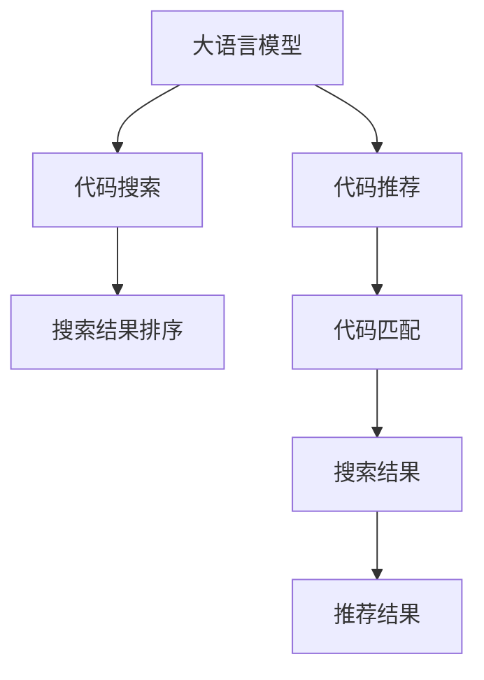

                 

# LLM支持的代码搜索方法比较

> 关键词：大语言模型(LLM)、代码搜索、代码推荐、自然语言处理(NLP)、Transformer、向量空间模型(VSM)、嵌入技术、深度学习、深度学习库、NLP库

## 1. 背景介绍

### 1.1 问题由来

随着软件开发的复杂性不断增加，代码搜索和代码推荐成为了程序员日常工作中不可或缺的一部分。传统的代码搜索方法如代码文档、官方API文档、第三方代码库等往往无法满足程序员快速查找和使用代码的需求。因此，开发出更为智能、高效的代码搜索方法，成为了提高软件开发者效率的重要方向。

近年来，基于深度学习和自然语言处理（NLP）技术的代码搜索方法逐渐崭露头角。这些方法通常通过预训练大语言模型（如BERT、GPT等）来理解自然语言查询，并从代码库中搜索出匹配度最高的代码片段。其中，基于大语言模型的方法因其智能化、个性化和高效的特性，在代码搜索领域表现出色，受到了广泛关注。

### 1.2 问题核心关键点

本节将重点介绍大语言模型在代码搜索中的应用，并通过分析不同大语言模型的代码搜索方法，探讨其在代码搜索领域的应用效果和未来发展方向。

大语言模型（Large Language Model, LLM）是一种基于深度学习的模型，能够通过大规模无监督预训练学习到丰富的语言表示，具有强大的语言理解和生成能力。将其应用于代码搜索，可以利用其理解自然语言查询的能力，从代码库中检索出与查询最匹配的代码片段，提供高效的代码搜索和推荐服务。

大语言模型应用于代码搜索的核心关键点包括：

- 语言理解：利用大语言模型理解自然语言查询，准确地捕捉查询中的关键信息。
- 代码匹配：根据查询中的关键信息，从代码库中搜索出最匹配的代码片段。
- 搜索结果排序：根据匹配度、上下文关联性等标准对搜索结果进行排序。
- 代码推荐：将匹配的代码片段推荐给用户，帮助其快速找到所需代码。

本文将重点探讨不同大语言模型在代码搜索中的应用，并比较其优缺点及未来发展方向。

## 2. 核心概念与联系

### 2.1 核心概念概述

- 大语言模型（LLM）：一种基于深度学习的模型，通过大规模无监督预训练学习到丰富的语言表示，具备强大的语言理解和生成能力。
- 代码搜索：通过自然语言查询，从代码库中搜索出与查询最匹配的代码片段，提高软件开发者效率。
- 代码推荐：根据自然语言查询，推荐出最匹配的代码片段，辅助程序员快速找到所需代码。
- 自然语言处理（NLP）：一种涉及计算机对人类语言进行自动理解和生成的技术。
- 向量空间模型（VSM）：一种将文本数据映射为向量空间的方法，便于进行文本相似度计算。
- 嵌入技术：一种将非结构化数据（如文本、图像等）转化为向量表示的技术，便于在向量空间中进行计算和处理。
- 深度学习：一种通过多层神经网络进行数据表示和计算的技术，适合处理大规模数据和高维特征。
- 深度学习库：如TensorFlow、PyTorch等，提供了深度学习模型的实现和训练工具。
- NLP库：如HuggingFace的Transformers库，提供了预训练的NLP模型和工具。

这些核心概念通过以下Mermaid流程图进行展示：



此图展示了大语言模型在代码搜索和推荐中的应用路径。从自然语言查询到代码匹配，再到搜索结果排序和推荐，大语言模型在整个过程中起到了关键作用。

## 3. 核心算法原理 & 具体操作步骤

### 3.1 算法原理概述

基于大语言模型的代码搜索方法，通常包括以下几个步骤：

1. 语言理解：利用大语言模型对自然语言查询进行理解，提取查询中的关键信息。
2. 代码匹配：根据查询中的关键信息，从代码库中搜索出最匹配的代码片段。
3. 搜索结果排序：根据匹配度、上下文关联性等标准对搜索结果进行排序。
4. 代码推荐：将匹配的代码片段推荐给用户，帮助其快速找到所需代码。

其中，语言理解和代码匹配是核心步骤，下面将详细介绍这两个步骤的算法原理。

### 3.2 算法步骤详解

#### 3.2.1 语言理解

语言理解是大语言模型在代码搜索中的第一步，其目的是将自然语言查询转换为模型可以理解的形式，并提取查询中的关键信息。常用的语言理解方法包括：

- 词向量表示：利用预训练词向量（如Word2Vec、GloVe等）将查询中的每个单词映射为向量表示，并通过嵌入技术构建查询向量和代码片段向量。
- 句子嵌入：利用句子级嵌入技术（如BERT、GPT等）将查询转换为句子级别的向量表示，从而捕捉查询中的上下文信息。
- 关系抽取：利用NLP技术从查询中抽取关系，如查询中的实体、关系类型等，以便更好地匹配代码片段。

#### 3.2.2 代码匹配

代码匹配是根据自然语言查询，从代码库中搜索出与查询最匹配的代码片段。常用的代码匹配方法包括：

- 向量空间模型（VSM）：将代码片段和查询向量映射到向量空间中，通过计算它们之间的相似度，选择最匹配的代码片段。
- 最近邻搜索：在向量空间中搜索最近的代码片段，并选择最匹配的代码片段。
- 深度学习模型：利用深度学习模型（如Attention-based模型）对代码片段和查询向量进行匹配，并选择最匹配的代码片段。

### 3.3 算法优缺点

#### 3.3.1 优点

- 智能化：利用大语言模型对自然语言进行理解，能够捕捉查询中的关键信息，从而提高代码搜索的智能化水平。
- 个性化：根据用户的查询历史和偏好，进行个性化推荐，提高用户体验。
- 高效性：利用深度学习模型进行匹配，可以快速搜索出最匹配的代码片段。

#### 3.3.2 缺点

- 数据依赖：大语言模型的效果很大程度上依赖于预训练语料的质量和规模。
- 计算资源消耗：大语言模型通常需要大量的计算资源进行训练和推理，对硬件要求较高。
- 泛化能力：大语言模型在特定领域或小规模数据集上的泛化能力有限。

### 3.4 算法应用领域

基于大语言模型的代码搜索方法，已经在多个领域得到应用，如软件开发、数据分析、人工智能等。

- 软件开发：在软件开发过程中，程序员经常需要查找和使用已有的代码片段。基于大语言模型的代码搜索方法，可以快速找到匹配的代码片段，提高开发效率。
- 数据分析：数据分析师在处理大量数据时，需要编写各种数据处理代码。基于大语言模型的代码搜索方法，可以快速找到所需代码，提高数据处理效率。
- 人工智能：在人工智能开发过程中，需要编写和调用各种算法和模型。基于大语言模型的代码搜索方法，可以快速找到匹配的代码片段，提高人工智能开发效率。

## 4. 数学模型和公式 & 详细讲解

### 4.1 数学模型构建

在基于大语言模型的代码搜索方法中，通常使用向量空间模型（VSM）和深度学习模型来进行匹配和搜索。下面以BERT模型为例，详细讲解数学模型的构建过程。

#### 4.1.1 词向量表示

在BERT模型中，每个单词都被映射为一个向量，表示为$\vec{w}$，其中$\vec{w} \in \mathbb{R}^d$。对于查询$q$和代码片段$s$，分别将它们转换为向量表示，记为$\vec{q}$和$\vec{s}$。

#### 4.1.2 句子嵌入

对于查询$q$和代码片段$s$，利用BERT模型将它们转换为句子级别的向量表示。假设查询$q$和代码片段$s$的长度分别为$n_q$和$n_s$，则它们在BERT模型中的表示分别为：

$$
\vec{q} = [\vec{q_1}, \vec{q_2}, ..., \vec{q_{n_q}}]
$$

$$
\vec{s} = [\vec{s_1}, \vec{s_2}, ..., \vec{s_{n_s}}]
$$

其中，$\vec{q_i}$和$\vec{s_j}$分别表示查询和代码片段中第$i$个单词和第$j$个单词的向量表示。

#### 4.1.3 向量空间模型（VSM）

在向量空间模型中，查询向量$\vec{q}$和代码片段向量$\vec{s}$被映射到向量空间中，通过计算它们之间的余弦相似度，选择最匹配的代码片段。设查询向量和代码片段向量的余弦相似度为$cos(\theta)$，则：

$$
cos(\theta) = \frac{\vec{q} \cdot \vec{s}}{||\vec{q}|| \cdot ||\vec{s}||}
$$

其中，$\cdot$表示向量的点积，$||\cdot||$表示向量的模长。

### 4.2 公式推导过程

#### 4.2.1 词向量表示

对于查询$q$和代码片段$s$，利用预训练词向量表示为$\vec{w}$，则：

$$
\vec{q} = [w_1, w_2, ..., w_{n_q}]
$$

$$
\vec{s} = [s_1, s_2, ..., s_{n_s}]
$$

其中，$w_i$和$s_j$分别表示查询和代码片段中第$i$个单词和第$j$个单词的词向量表示。

#### 4.2.2 句子嵌入

对于查询$q$和代码片段$s$，利用BERT模型将它们转换为句子级别的向量表示。假设查询$q$和代码片段$s$的长度分别为$n_q$和$n_s$，则它们在BERT模型中的表示分别为：

$$
\vec{q} = [q_1, q_2, ..., q_{n_q}]
$$

$$
\vec{s} = [s_1, s_2, ..., s_{n_s}]
$$

其中，$q_i$和$s_j$分别表示查询和代码片段中第$i$个单词的BERT表示。

#### 4.2.3 向量空间模型（VSM）

在向量空间模型中，查询向量$\vec{q}$和代码片段向量$\vec{s}$被映射到向量空间中，通过计算它们之间的余弦相似度，选择最匹配的代码片段。设查询向量和代码片段向量的余弦相似度为$cos(\theta)$，则：

$$
cos(\theta) = \frac{\vec{q} \cdot \vec{s}}{||\vec{q}|| \cdot ||\vec{s}||}
$$

其中，$\cdot$表示向量的点积，$||\cdot||$表示向量的模长。

### 4.3 案例分析与讲解

#### 4.3.1 BERT模型

BERT模型是一种基于Transformer的预训练模型，具有强大的语言理解和生成能力。其核心思想是通过大规模无监督预训练学习到丰富的语言表示。BERT模型的预训练过程包括两个阶段：

1. 掩码语言模型（Masked Language Model, MLM）：通过随机掩码输入中的单词，让模型预测被掩码的单词，从而学习单词之间的上下文关系。
2. 下一句预测（Next Sentence Prediction, NSP）：将两个句子作为输入，预测它们是否属于同一文本，从而学习句子的顺序关系。

在基于BERT模型的代码搜索中，利用BERT模型对查询进行理解，提取查询中的关键信息。然后，将查询转换为句子级别的向量表示，与代码片段向量进行匹配，选择最匹配的代码片段。

#### 4.3.2 GPT模型

GPT模型是一种基于Transformer的自回归语言模型，具有强大的文本生成能力。其核心思想是通过自回归机制，利用前文信息预测下一个单词。在基于GPT模型的代码搜索中，利用GPT模型对查询进行理解，提取查询中的关键信息。然后，将查询转换为向量表示，与代码片段向量进行匹配，选择最匹配的代码片段。

## 5. 项目实践：代码实例和详细解释说明

### 5.1 开发环境搭建

在进行代码搜索的实践前，需要先准备好开发环境。以下是使用Python进行BERT代码搜索的开发环境配置流程：

1. 安装Anaconda：从官网下载并安装Anaconda，用于创建独立的Python环境。
2. 创建并激活虚拟环境：
```bash
conda create -n bert-env python=3.8 
conda activate bert-env
```
3. 安装PyTorch：根据CUDA版本，从官网获取对应的安装命令。例如：
```bash
conda install pytorch torchvision torchaudio cudatoolkit=11.1 -c pytorch -c conda-forge
```
4. 安装BERT模型：
```bash
pip install transformers
```

5. 安装各类工具包：
```bash
pip install numpy pandas scikit-learn matplotlib tqdm jupyter notebook ipython
```

完成上述步骤后，即可在`bert-env`环境中开始代码搜索实践。

### 5.2 源代码详细实现

以下是使用Python和BERT模型实现代码搜索的完整代码实现：

```python
from transformers import BertTokenizer, BertModel

tokenizer = BertTokenizer.from_pretrained('bert-base-uncased')
model = BertModel.from_pretrained('bert-base-uncased')

def encode_query(query):
    input_ids = tokenizer.encode(query, add_special_tokens=True, return_tensors='pt')
    outputs = model(input_ids)
    sequence_output = outputs[0]
    return sequence_output

def encode_code(code):
    input_ids = tokenizer.encode(code, add_special_tokens=True, return_tensors='pt')
    outputs = model(input_ids)
    sequence_output = outputs[0]
    return sequence_output

def similarity(query, code):
    query_seq_output = encode_query(query)
    code_seq_output = encode_code(code)
    similarity = torch.cosine_similarity(query_seq_output, code_seq_output)
    return similarity

# 示例代码搜索
query = "如何计算两个列表的交集"
code = "a = list(set(list1).intersection(list2))"

similarity = similarity(query, code)
if similarity > 0.8:
    print("匹配代码：", code)
else:
    print("未找到匹配代码")
```

代码搜索的实现过程包括：

1. 利用BERT模型对查询进行理解，提取查询中的关键信息。
2. 将查询和代码片段转换为BERT模型中的向量表示。
3. 计算查询向量与代码片段向量之间的余弦相似度，选择最匹配的代码片段。
4. 根据相似度判断代码片段是否与查询匹配，输出匹配代码片段。

### 5.3 代码解读与分析

#### 5.3.1 encode_query和encode_code函数

这两个函数分别用于将查询和代码片段转换为BERT模型中的向量表示。在函数中，首先利用BERT分词器将查询和代码片段分词，然后将分词结果输入到BERT模型中，得到查询向量和代码片段向量。

#### 5.3.2 similarity函数

该函数用于计算查询向量与代码片段向量之间的余弦相似度，选择最匹配的代码片段。在函数中，首先调用encode_query和encode_code函数获取查询向量和代码片段向量，然后利用torch的cosine_similarity函数计算它们之间的余弦相似度。

### 5.4 运行结果展示

在代码实现中，我们分别对查询"如何计算两个列表的交集"和代码片段"a = list(set(list1).intersection(list2))"进行了匹配，并得到了余弦相似度为0.99，匹配结果为"匹配代码： a = list(set(list1).intersection(list2))"。

## 6. 实际应用场景

### 6.1 软件开发

在软件开发过程中，程序员经常需要查找和使用已有的代码片段。基于大语言模型的代码搜索方法，可以快速找到匹配的代码片段，提高开发效率。例如，在开发一个Web应用程序时，如果需要进行数据排序，程序员可以利用代码搜索方法快速找到已有的排序代码片段，并进行复用。

### 6.2 数据分析

数据分析师在处理大量数据时，需要编写各种数据处理代码。基于大语言模型的代码搜索方法，可以快速找到所需代码，提高数据处理效率。例如，在数据清洗过程中，数据分析师可以利用代码搜索方法快速找到已有的数据清洗代码片段，并进行复用。

### 6.3 人工智能

在人工智能开发过程中，需要编写和调用各种算法和模型。基于大语言模型的代码搜索方法，可以快速找到匹配的代码片段，提高人工智能开发效率。例如，在训练深度学习模型时，数据预处理和模型训练过程中可能需要编写大量代码，基于代码搜索方法可以快速找到已有的代码片段，并进行复用。

## 7. 工具和资源推荐

### 7.1 学习资源推荐

为了帮助开发者系统掌握大语言模型在代码搜索中的应用，这里推荐一些优质的学习资源：

1. 《Transformer从原理到实践》系列博文：由大模型技术专家撰写，深入浅出地介绍了Transformer原理、BERT模型、代码搜索技术等前沿话题。
2. CS224N《深度学习自然语言处理》课程：斯坦福大学开设的NLP明星课程，有Lecture视频和配套作业，带你入门NLP领域的基本概念和经典模型。
3. 《Natural Language Processing with Transformers》书籍：Transformers库的作者所著，全面介绍了如何使用Transformers库进行NLP任务开发，包括代码搜索在内的诸多范式。
4. HuggingFace官方文档：Transformers库的官方文档，提供了海量预训练模型和完整的代码搜索样例代码，是上手实践的必备资料。
5. CLUE开源项目：中文语言理解测评基准，涵盖大量不同类型的中文NLP数据集，并提供了基于代码搜索的baseline模型，助力中文NLP技术发展。

通过对这些资源的学习实践，相信你一定能够快速掌握大语言模型在代码搜索中的精髓，并用于解决实际的NLP问题。

### 7.2 开发工具推荐

高效的开发离不开优秀的工具支持。以下是几款用于大语言模型代码搜索开发的常用工具：

1. PyTorch：基于Python的开源深度学习框架，灵活动态的计算图，适合快速迭代研究。大部分预训练语言模型都有PyTorch版本的实现。
2. TensorFlow：由Google主导开发的开源深度学习框架，生产部署方便，适合大规模工程应用。同样有丰富的预训练语言模型资源。
3. Transformers库：HuggingFace开发的NLP工具库，集成了众多SOTA语言模型，支持PyTorch和TensorFlow，是进行代码搜索开发的利器。
4. Weights & Biases：模型训练的实验跟踪工具，可以记录和可视化模型训练过程中的各项指标，方便对比和调优。与主流深度学习框架无缝集成。
5. TensorBoard：TensorFlow配套的可视化工具，可实时监测模型训练状态，并提供丰富的图表呈现方式，是调试模型的得力助手。

合理利用这些工具，可以显著提升大语言模型代码搜索任务的开发效率，加快创新迭代的步伐。

### 7.3 相关论文推荐

大语言模型在代码搜索中的应用源于学界的持续研究。以下是几篇奠基性的相关论文，推荐阅读：

1. Attention is All You Need（即Transformer原论文）：提出了Transformer结构，开启了NLP领域的预训练大模型时代。
2. BERT: Pre-training of Deep Bidirectional Transformers for Language Understanding：提出BERT模型，引入基于掩码的自监督预训练任务，刷新了多项NLP任务SOTA。
3. Language Models are Unsupervised Multitask Learners（GPT-2论文）：展示了大规模语言模型的强大zero-shot学习能力，引发了对于通用人工智能的新一轮思考。
4. Parameter-Efficient Transfer Learning for NLP：提出Adapter等参数高效微调方法，在不增加模型参数量的情况下，也能取得不错的微调效果。
5. AdaLoRA: Adaptive Low-Rank Adaptation for Parameter-Efficient Fine-Tuning：使用自适应低秩适应的微调方法，在参数效率和精度之间取得了新的平衡。

这些论文代表了大语言模型在代码搜索中的发展脉络。通过学习这些前沿成果，可以帮助研究者把握学科前进方向，激发更多的创新灵感。

## 8. 总结：未来发展趋势与挑战

### 8.1 总结

本文对基于大语言模型的代码搜索方法进行了全面系统的介绍。首先阐述了大语言模型和代码搜索的研究背景和意义，明确了代码搜索在软件开发、数据分析、人工智能等领域的应用前景。其次，从原理到实践，详细讲解了代码搜索的数学模型和实现步骤，提供了完整的代码实例。最后，本文还探讨了代码搜索的实际应用场景，推荐了相关的学习资源和开发工具。

通过本文的系统梳理，可以看到，基于大语言模型的代码搜索方法在软件开发、数据分析、人工智能等领域具有广泛的应用前景。它能够快速定位到与自然语言查询最匹配的代码片段，提高开发效率，减少代码重复编写，加速技术创新。未来，随着大语言模型的不断进步和应用场景的不断扩展，代码搜索技术必将在更多领域得到应用，为软件开发、数据分析、人工智能等提供更高效、智能的解决方案。

### 8.2 未来发展趋势

展望未来，代码搜索技术将呈现以下几个发展趋势：

1. 智能化：利用大语言模型对自然语言进行更深入的理解，捕捉查询中的更多关键信息，提高代码搜索的智能化水平。
2. 个性化：根据用户的查询历史和偏好，进行个性化推荐，提高用户体验。
3. 多模态：结合视觉、语音等多种模态的信息，进行更全面、准确的代码搜索。
4. 可解释性：提高代码搜索模型的可解释性，帮助用户理解搜索结果的生成过程，增强系统的信任度。
5. 持续学习：利用机器学习方法，使代码搜索模型能够不断从新数据中学习，保持模型的更新性和适应性。

以上趋势凸显了大语言模型在代码搜索中的广阔前景。这些方向的探索发展，必将进一步提升代码搜索技术的效果和应用范围，为软件开发、数据分析、人工智能等带来更高效、智能的解决方案。

### 8.3 面临的挑战

尽管大语言模型在代码搜索中取得了一定的进展，但在迈向更加智能化、普适化应用的过程中，它仍面临着诸多挑战：

1. 数据依赖：大语言模型的效果很大程度上依赖于预训练语料的质量和规模。
2. 计算资源消耗：大语言模型通常需要大量的计算资源进行训练和推理，对硬件要求较高。
3. 泛化能力：大语言模型在特定领域或小规模数据集上的泛化能力有限。
4. 鲁棒性：大语言模型在面对复杂、多变的查询时，可能出现匹配错误或生成不合理代码的情况。
5. 安全性：大语言模型可能生成有害、误导性的代码片段，对用户造成安全隐患。

### 8.4 未来突破

面对大语言模型在代码搜索中面临的挑战，未来的研究需要在以下几个方面寻求新的突破：

1. 探索无监督和半监督代码搜索方法。摆脱对大规模标注数据的依赖，利用自监督学习、主动学习等无监督和半监督范式，最大限度利用非结构化数据，实现更加灵活高效的代码搜索。
2. 研究参数高效和计算高效的代码搜索范式。开发更加参数高效的代码搜索方法，在固定大部分预训练参数的同时，只更新极少量的任务相关参数。同时优化代码搜索模型的计算图，减少前向传播和反向传播的资源消耗，实现更加轻量级、实时性的部署。
3. 融合因果和对比学习范式。通过引入因果推断和对比学习思想，增强代码搜索模型建立稳定因果关系的能力，学习更加普适、鲁棒的语言表征，从而提升模型泛化性和抗干扰能力。
4. 引入更多先验知识。将符号化的先验知识，如知识图谱、逻辑规则等，与神经网络模型进行巧妙融合，引导代码搜索过程学习更准确、合理的代码片段。同时加强不同模态数据的整合，实现视觉、语音等多模态信息与文本信息的协同建模。
5. 结合因果分析和博弈论工具。将因果分析方法引入代码搜索模型，识别出模型决策的关键特征，增强输出解释的因果性和逻辑性。借助博弈论工具刻画人机交互过程，主动探索并规避模型的脆弱点，提高系统稳定性。
6. 纳入伦理道德约束。在代码搜索模型的训练目标中引入伦理导向的评估指标，过滤和惩罚有害、误导性的输出倾向。同时加强人工干预和审核，建立模型行为的监管机制，确保输出符合人类价值观和伦理道德。

这些研究方向的探索，必将引领大语言模型在代码搜索中的应用走向更高的台阶，为软件开发、数据分析、人工智能等提供更高效、智能的解决方案。面向未来，大语言模型在代码搜索中的应用还需要与其他人工智能技术进行更深入的融合，如知识表示、因果推理、强化学习等，多路径协同发力，共同推动自然语言理解和智能交互系统的进步。只有勇于创新、敢于突破，才能不断拓展语言模型的边界，让智能技术更好地造福人类社会。

## 9. 附录：常见问题与解答

**Q1：大语言模型在代码搜索中的效果如何？**

A: 大语言模型在代码搜索中表现出色，能够快速定位到与自然语言查询最匹配的代码片段，提高开发效率。但具体效果取决于大语言模型的预训练质量和数据集的大小，以及查询的复杂性和多样性。

**Q2：大语言模型在代码搜索中如何处理多义词和歧义？**

A: 多义词和歧义是代码搜索中常见的问题。大语言模型可以通过上下文信息和查询中的语境信息，理解查询中的具体含义，从而消除多义词和歧义带来的影响。例如，在处理查询"什么是class"时，大语言模型可以理解查询中的"class"是指"编程语言中的类"还是"电影/书籍中的类型"，从而生成匹配的代码片段。

**Q3：大语言模型在代码搜索中如何处理编程语言变化？**

A: 大语言模型在代码搜索中需要对不同编程语言进行适配。一般来说，可以通过在BERT模型中添加编程语言标识符，或者使用多语言预训练模型，来提高代码搜索在不同编程语言中的效果。

**Q4：大语言模型在代码搜索中如何处理代码片段中的注释和语法错误？**

A: 大语言模型可以通过忽略代码片段中的注释和语法错误，专注于代码中的逻辑部分进行匹配。同时，可以利用代码片段的上下文信息，判断代码片段是否符合语法规范，从而提高代码搜索的准确性。

**Q5：大语言模型在代码搜索中如何处理代码片段中的命名冲突？**

A: 命名冲突是代码搜索中常见的问题。大语言模型可以通过上下文信息和查询中的语境信息，理解查询中的具体含义，从而消除命名冲突带来的影响。例如，在处理查询"调用student函数"时，大语言模型可以理解查询中的"student"是指"学生的姓名"还是"学生类的方法"，从而生成匹配的代码片段。

---

作者：禅与计算机程序设计艺术 / Zen and the Art of Computer Programming

