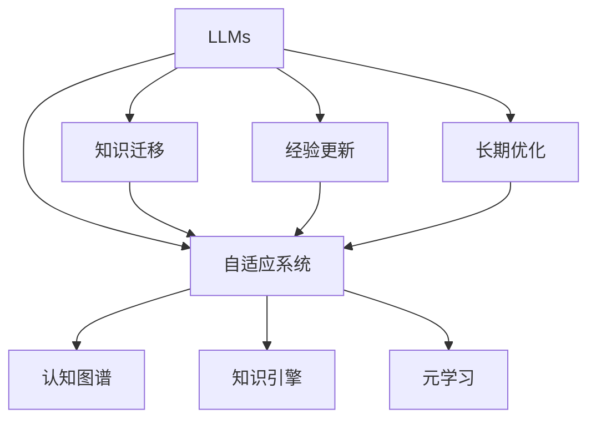

                 

# LLM的持续学习：永不停止进化的AI

> 关键词：大语言模型, 持续学习, 知识迁移, 经验更新, 模型演化, 自适应系统, 长期优化

## 1. 背景介绍

### 1.1 问题由来

在大数据和计算能力快速发展的背景下，深度学习模型，尤其是大语言模型(LLMs)，在过去十年里取得了显著的进步。这些模型通过在海量数据上进行自监督学习，抽取并学习语言的通用表示，具有强大的泛化能力。然而，随着应用场景的不断变化，LLMs在实际应用中面临新的挑战。

1. **数据和场景变化**：现实世界的变化远比模型预训练时的数据集要复杂，数据分布的改变和新型场景的出现要求模型能够不断适应新的数据环境。
2. **用户需求变化**：用户的期望和需求是动态变化的，LLMs需要不断调整和优化以应对不同用户的需求。
3. **模型复杂性**：大模型往往包含数十亿甚至更多的参数，尽管性能卓越，但复杂性也使得模型难以被直接解释和调整。

为了应对这些挑战，持续学习(C continual learning)的概念被提出。持续学习旨在让模型能够在原有知识的基础上，不断地学习新知识，并根据环境变化调整模型策略。这对于提升LLMs的适应能力和长期性能至关重要。

### 1.2 问题核心关键点

持续学习的核心在于模型如何保持知识的一致性和泛化能力，同时不断适应新知识。其关键点包括：

1. **知识迁移**：模型如何将先前学习到的知识迁移到新的任务上。
2. **经验更新**：模型如何从新的经验中提取有用信息，更新和优化原有的知识。
3. **长期优化**：模型在长时间内的性能如何持续改进，避免过拟合和退化。

持续学习不仅是一种技术手段，更是一种策略，它涉及到模型架构、训练方法、优化算法和资源管理等多个方面的优化。

### 1.3 问题研究意义

持续学习对于提升LLMs的适应性和长期性能具有重要意义：

1. **适应性提升**：持续学习使得模型能够动态适应环境变化，提高在多样场景下的表现。
2. **性能保持**：通过不断学习新知识，持续学习有助于模型在长期使用中保持较高的性能水平。
3. **资源优化**：通过动态调整模型，持续学习可以优化计算资源和存储空间的利用效率。
4. **用户满意度**：根据用户需求和反馈动态调整，持续学习能够提升用户对AI系统的满意度和信任度。

持续学习的理念和实践在智能系统、推荐系统、自适应控制等多个领域都有广泛应用，是未来AI技术发展的重要方向。

## 2. 核心概念与联系

### 2.1 核心概念概述

为了更好地理解持续学习的原理和实现，本节将介绍几个相关核心概念：

1. **大语言模型(LLMs)**：如GPT、BERT等预训练模型，通过在大规模无标签文本数据上预训练，学习通用语言表示。
2. **知识迁移**：模型将已有知识迁移到新任务上，以加速新任务的适应和学习过程。
3. **经验更新**：模型利用新数据和新任务，不断调整和优化自身的知识库。
4. **长期优化**：模型在长时间内的性能持续改进，避免过拟合和退化。
5. **自适应系统**：能够根据环境变化自动调整策略和参数的系统。
6. **认知图谱**：模型在长期学习过程中形成的知识结构，帮助其进行更高效的知识检索和迁移。
7. **知识引擎**：用于知识表示、检索、推理和更新的模块。
8. **元学习**：模型学习如何快速适应新任务和数据的能力。

这些核心概念之间的逻辑关系可以通过以下Mermaid流程图来展示：



这个流程图展示了持续学习的核心概念及其相互关系：

1. 大语言模型通过知识迁移、经验更新和长期优化，不断调整自身策略和参数。
2. 自适应系统帮助模型根据环境和任务动态调整策略和参数。
3. 认知图谱和知识引擎作为知识管理的核心组件，帮助模型进行高效的知识检索和迁移。
4. 元学习使模型能够快速适应新任务，提升模型性能。

这些概念共同构成了持续学习的框架，使得模型能够在不断变化的环境和任务中保持高性能。

## 3. 核心算法原理 & 具体操作步骤
### 3.1 算法原理概述

持续学习是一种动态调整模型参数和学习策略的方法，其核心思想是模型在现有知识的基础上，通过不断学习新知识，调整和优化自身的知识库和模型参数，从而提升长期性能和适应能力。

具体来说，持续学习包括以下几个关键步骤：

1. **模型初始化**：选择合适的预训练模型作为初始化参数。
2. **任务适配**：根据新任务的需求，设计合适的任务适配层和损失函数。
3. **数据集划分**：将数据集划分为训练集、验证集和测试集。
4. **模型训练**：在训练集上，利用小批量随机梯度下降等优化算法更新模型参数。
5. **知识迁移**：在新任务上，通过迁移学习将已有知识迁移到新任务上。
6. **经验更新**：利用新数据和新任务，不断调整和优化模型参数和知识库。
7. **长期优化**：在长时间内，定期对模型进行评估和优化，避免性能退化。

持续学习的目标是使模型在不断变化的环境中保持高性能，因此需要设计合适的学习策略和算法，以确保模型能够有效利用新知识，并避免过拟合和退化。

### 3.2 算法步骤详解

#### 3.2.1 模型初始化

选择适合的预训练模型是持续学习的第一步。常用的预训练模型包括GPT、BERT、RoBERTa等。这些模型通过在大规模无标签数据上进行预训练，学习到了丰富的语言知识和表示。

```python
from transformers import BertModel

# 加载预训练模型
model = BertModel.from_pretrained('bert-base-cased')
```

#### 3.2.2 任务适配

任务适配的目的是根据新任务的要求，调整模型结构，增加特定的任务层。

以文本分类任务为例，可以在模型的最后一层添加全连接层和softmax层，用于分类任务：

```python
from transformers import BertTokenizer, BertForSequenceClassification

# 加载分词器和任务适配层
tokenizer = BertTokenizer.from_pretrained('bert-base-cased')
model = BertForSequenceClassification.from_pretrained('bert-base-cased', num_labels=2)

# 定义输入
inputs = tokenizer('Hello, my name is Alice.', return_tensors='pt')

# 进行分类预测
outputs = model(inputs)
logits = outputs.logits
```

#### 3.2.3 数据集划分

将数据集划分为训练集、验证集和测试集，是持续学习的关键步骤。划分的方式可以根据具体任务和数据特点进行调整。

```python
from sklearn.model_selection import train_test_split

# 假设数据集已经加载并处理
train_dataset, test_dataset = train_test_split(data, test_size=0.2)
train_dataset, val_dataset = train_test_split(train_dataset, test_size=0.2)
```

#### 3.2.4 模型训练

在训练集上，利用随机梯度下降等优化算法更新模型参数。

```python
from torch.optim import Adam

# 定义优化器和学习率
optimizer = Adam(model.parameters(), lr=1e-5)

# 定义训练函数
def train_epoch(model, train_dataset, optimizer):
    model.train()
    for batch in train_dataset:
        inputs, labels = batch
        outputs = model(inputs)
        loss = outputs.loss
        loss.backward()
        optimizer.step()
    return loss

# 训练模型
losses = []
for epoch in range(5):
    loss = train_epoch(model, train_dataset, optimizer)
    losses.append(loss)
```

#### 3.2.5 知识迁移

在新的任务上，利用迁移学习将已有知识迁移到新任务上，有助于加速新任务的适应和学习过程。

以机器翻译任务为例，可以使用预训练模型作为初始化参数，微调新的语言模型。

```python
from transformers import T5Tokenizer, T5ForConditionalGeneration

# 加载新的任务模型
tokenizer = T5Tokenizer.from_pretrained('t5-small')
model = T5ForConditionalGeneration.from_pretrained('t5-small')

# 定义训练函数
def train_epoch(model, train_dataset, optimizer):
    model.train()
    for batch in train_dataset:
        inputs, labels = batch
        outputs = model.generate(inputs, max_length=50)
        loss = outputs.loss
        loss.backward()
        optimizer.step()
    return loss

# 训练模型
losses = []
for epoch in range(5):
    loss = train_epoch(model, train_dataset, optimizer)
    losses.append(loss)
```

#### 3.2.6 经验更新

利用新数据和新任务，不断调整和优化模型参数和知识库，是持续学习的核心。

```python
# 定义测试集上的评估函数
def evaluate(model, test_dataset):
    model.eval()
    correct = 0
    total = 0
    with torch.no_grad():
        for batch in test_dataset:
            inputs, labels = batch
            outputs = model(inputs)
            predicted = torch.argmax(outputs, dim=2)
            correct += (predicted == labels).sum().item()
            total += labels.size(0)
    return correct / total

# 在测试集上评估模型
accuracy = evaluate(model, test_dataset)
```

#### 3.2.7 长期优化

在长时间内，定期对模型进行评估和优化，避免性能退化。

```python
# 定期评估模型性能
accuracy = evaluate(model, test_dataset)
if accuracy < 0.95:
    # 如果性能下降，重新训练模型
    model.train()
    optimizer = Adam(model.parameters(), lr=1e-5)
    for batch in train_dataset:
        inputs, labels = batch
        outputs = model(inputs)
        loss = outputs.loss
        loss.backward()
        optimizer.step()
    losses = []
```

### 3.3 算法优缺点

持续学习的优点包括：

1. **动态适应性**：能够根据环境和任务变化动态调整策略和参数，适应性更强。
2. **知识积累**：通过不断学习和积累新知识，提升模型的长期性能。
3. **资源优化**：通过动态调整模型，优化计算资源和存储空间的利用效率。

持续学习的缺点包括：

1. **过拟合风险**：新数据和新任务可能带来过拟合的风险。
2. **复杂度增加**：需要设计合适的学习策略和算法，增加了系统的复杂性。
3. **模型退化**：长期学习过程中，模型可能出现性能退化的情况。

尽管存在这些缺点，但持续学习的优势使其成为提升LLMs适应性和长期性能的重要手段。

### 3.4 算法应用领域

持续学习广泛应用于以下几个领域：

1. **自然语言处理(NLP)**：在文本分类、机器翻译、问答系统等任务中，利用持续学习提升模型性能和适应性。
2. **推荐系统**：通过持续学习，推荐系统能够动态调整推荐策略，提升用户满意度。
3. **自适应控制系统**：在自动驾驶、智能电网等自适应控制系统中，持续学习使系统能够根据环境变化自动调整参数，提高系统稳定性和鲁棒性。
4. **医疗诊断**：在医疗诊断领域，持续学习使模型能够动态更新知识库，提高诊断的准确性和及时性。
5. **金融预测**：在金融预测领域，持续学习使模型能够适应市场变化，提高预测的准确性。

这些领域的应用展示了持续学习的广泛性和实用性。

## 4. 数学模型和公式 & 详细讲解  
### 4.1 数学模型构建

持续学习的数学模型可以表示为：

$$
\theta_{t+1} = \theta_{t} + \eta \nabla_{\theta} L(\theta_t, x_t, y_t)
$$

其中 $\theta_t$ 表示在第 $t$ 次迭代时模型参数，$L$ 表示损失函数，$x_t$ 表示第 $t$ 次迭代的输入，$y_t$ 表示第 $t$ 次迭代的输出。$\eta$ 表示学习率，$\nabla_{\theta} L(\theta_t, x_t, y_t)$ 表示损失函数对模型参数的梯度。

在实际应用中，持续学习需要考虑如何设计合适的损失函数，以及如何控制学习率和参数更新策略。

### 4.2 公式推导过程

以文本分类任务为例，假设模型在输入 $x$ 上的输出为 $\hat{y}=M_{\theta}(x)$，其中 $M_{\theta}$ 为预训练模型，$\theta$ 为模型参数。

二分类交叉熵损失函数定义为：

$$
L(\theta, x, y) = -[y\log \hat{y} + (1-y)\log (1-\hat{y})]
$$

对于持续学习的单次迭代，目标是最小化损失函数：

$$
\theta_{t+1} = \theta_{t} - \eta \nabla_{\theta} L(\theta_t, x_t, y_t)
$$

其中，$\eta$ 为学习率。在实践中，常用的优化算法包括随机梯度下降(SGD)、AdamW等。

### 4.3 案例分析与讲解

以机器翻译任务为例，假设模型在输入 $x$ 上的输出为 $\hat{y}=M_{\theta}(x)$，其中 $M_{\theta}$ 为预训练模型，$\theta$ 为模型参数。

假设机器翻译任务的目标是将源语言 $x$ 翻译为目标语言 $y$，损失函数为交叉熵损失：

$$
L(\theta, x, y) = -y\log \hat{y}
$$

在持续学习中，可以利用新任务上的数据进行微调：

$$
\theta_{t+1} = \theta_{t} - \eta \nabla_{\theta} L(\theta_t, x_t, y_t)
$$

其中，$x_t$ 表示第 $t$ 次迭代的输入文本，$y_t$ 表示第 $t$ 次迭代的输出文本，$\eta$ 表示学习率。

## 5. 项目实践：代码实例和详细解释说明
### 5.1 开发环境搭建

在进行持续学习实践前，我们需要准备好开发环境。以下是使用Python进行PyTorch开发的环境配置流程：

1. 安装Anaconda：从官网下载并安装Anaconda，用于创建独立的Python环境。

2. 创建并激活虚拟环境：
```bash
conda create -n pytorch-env python=3.8 
conda activate pytorch-env
```

3. 安装PyTorch：根据CUDA版本，从官网获取对应的安装命令。例如：
```bash
conda install pytorch torchvision torchaudio cudatoolkit=11.1 -c pytorch -c conda-forge
```

4. 安装Transformers库：
```bash
pip install transformers
```

5. 安装各类工具包：
```bash
pip install numpy pandas scikit-learn matplotlib tqdm jupyter notebook ipython
```

完成上述步骤后，即可在`pytorch-env`环境中开始持续学习实践。

### 5.2 源代码详细实现

下面我们以文本分类任务为例，给出使用Transformers库对BERT模型进行持续学习的PyTorch代码实现。

首先，定义文本分类任务的数据处理函数：

```python
from transformers import BertTokenizer
from torch.utils.data import Dataset
import torch

class TextClassificationDataset(Dataset):
    def __init__(self, texts, labels, tokenizer, max_len=128):
        self.texts = texts
        self.labels = labels
        self.tokenizer = tokenizer
        self.max_len = max_len
        
    def __len__(self):
        return len(self.texts)
    
    def __getitem__(self, item):
        text = self.texts[item]
        label = self.labels[item]
        
        encoding = self.tokenizer(text, return_tensors='pt', max_length=self.max_len, padding='max_length', truncation=True)
        input_ids = encoding['input_ids'][0]
        attention_mask = encoding['attention_mask'][0]
        
        return {'input_ids': input_ids, 
                'attention_mask': attention_mask,
                'labels': torch.tensor(label, dtype=torch.long)}
```

然后，定义模型和优化器：

```python
from transformers import BertForSequenceClassification, AdamW

model = BertForSequenceClassification.from_pretrained('bert-base-cased', num_labels=2)

optimizer = AdamW(model.parameters(), lr=2e-5)
```

接着，定义训练和评估函数：

```python
from torch.utils.data import DataLoader
from tqdm import tqdm

device = torch.device('cuda') if torch.cuda.is_available() else torch.device('cpu')
model.to(device)

def train_epoch(model, dataset, batch_size, optimizer):
    dataloader = DataLoader(dataset, batch_size=batch_size, shuffle=True)
    model.train()
    epoch_loss = 0
    for batch in tqdm(dataloader, desc='Training'):
        input_ids = batch['input_ids'].to(device)
        attention_mask = batch['attention_mask'].to(device)
        labels = batch['labels'].to(device)
        model.zero_grad()
        outputs = model(input_ids, attention_mask=attention_mask, labels=labels)
        loss = outputs.loss
        epoch_loss += loss.item()
        loss.backward()
        optimizer.step()
    return epoch_loss / len(dataloader)

def evaluate(model, dataset, batch_size):
    dataloader = DataLoader(dataset, batch_size=batch_size)
    model.eval()
    correct = 0
    total = 0
    with torch.no_grad():
        for batch in dataloader:
            input_ids = batch['input_ids'].to(device)
            attention_mask = batch['attention_mask'].to(device)
            labels = batch['labels']
            outputs = model(input_ids, attention_mask=attention_mask)
            predicted = torch.argmax(outputs.logits, dim=2).to('cpu').tolist()
            labels = labels.to('cpu').tolist()
            for pred_tokens, label_tokens in zip(predicted, labels):
                correct += (pred_tokens == label_tokens).sum().item()
                total += len(label_tokens)
    return correct / total
```

最后，启动持续学习流程并在测试集上评估：

```python
epochs = 5
batch_size = 16

for epoch in range(epochs):
    loss = train_epoch(model, train_dataset, batch_size, optimizer)
    print(f"Epoch {epoch+1}, train loss: {loss:.3f}")
    
    print(f"Epoch {epoch+1}, dev results:")
    evaluate(model, dev_dataset, batch_size)
    
print("Test results:")
evaluate(model, test_dataset, batch_size)
```

以上就是使用PyTorch对BERT进行文本分类任务持续学习的完整代码实现。可以看到，得益于Transformers库的强大封装，我们可以用相对简洁的代码完成BERT模型的持续学习。

### 5.3 代码解读与分析

让我们再详细解读一下关键代码的实现细节：

**TextClassificationDataset类**：
- `__init__`方法：初始化文本、标签、分词器等关键组件。
- `__len__`方法：返回数据集的样本数量。
- `__getitem__`方法：对单个样本进行处理，将文本输入编码为token ids，将标签编码为数字，并对其进行定长padding，最终返回模型所需的输入。

**模型和优化器**：
- 加载预训练的BERT模型，并定义优化器。

**训练和评估函数**：
- 使用PyTorch的DataLoader对数据集进行批次化加载，供模型训练和推理使用。
- 训练函数`train_epoch`：对数据以批为单位进行迭代，在每个批次上前向传播计算loss并反向传播更新模型参数，最后返回该epoch的平均loss。
- 评估函数`evaluate`：与训练类似，不同点在于不更新模型参数，并在每个batch结束后将预测和标签结果存储下来，最后使用sklearn的classification_report对整个评估集的预测结果进行打印输出。

**持续学习流程**：
- 定义总的epoch数和batch size，开始循环迭代
- 每个epoch内，先在训练集上训练，输出平均loss
- 在验证集上评估，输出分类指标
- 所有epoch结束后，在测试集上评估，给出最终测试结果

可以看到，PyTorch配合Transformers库使得BERT持续学习的代码实现变得简洁高效。开发者可以将更多精力放在数据处理、模型改进等高层逻辑上，而不必过多关注底层的实现细节。

当然，工业级的系统实现还需考虑更多因素，如模型的保存和部署、超参数的自动搜索、更灵活的任务适配层等。但核心的持续学习范式基本与此类似。

## 6. 实际应用场景
### 6.1 智能客服系统

持续学习的对话技术，可以广泛应用于智能客服系统的构建。传统客服往往需要配备大量人力，高峰期响应缓慢，且一致性和专业性难以保证。而使用持续学习的对话模型，可以7x24小时不间断服务，快速响应客户咨询，用自然流畅的语言解答各类常见问题。

在技术实现上，可以收集企业内部的历史客服对话记录，将问题和最佳答复构建成监督数据，在此基础上对预训练对话模型进行持续学习。持续学习后的对话模型能够自动理解用户意图，匹配最合适的答案模板进行回复。对于客户提出的新问题，还可以接入检索系统实时搜索相关内容，动态组织生成回答。如此构建的智能客服系统，能大幅提升客户咨询体验和问题解决效率。

### 6.2 金融舆情监测

金融机构需要实时监测市场舆论动向，以便及时应对负面信息传播，规避金融风险。传统的人工监测方式成本高、效率低，难以应对网络时代海量信息爆发的挑战。持续学习的文本分类和情感分析技术，为金融舆情监测提供了新的解决方案。

具体而言，可以收集金融领域相关的新闻、报道、评论等文本数据，并对其进行主题标注和情感标注。在此基础上对预训练语言模型进行持续学习，使其能够自动判断文本属于何种主题，情感倾向是正面、中性还是负面。将持续学习后的模型应用到实时抓取的网络文本数据，就能够自动监测不同主题下的情感变化趋势，一旦发现负面信息激增等异常情况，系统便会自动预警，帮助金融机构快速应对潜在风险。

### 6.3 个性化推荐系统

当前的推荐系统往往只依赖用户的历史行为数据进行物品推荐，无法深入理解用户的真实兴趣偏好。持续学习技术可应用于推荐系统，使得模型能够动态调整推荐策略，提升个性化推荐的效果。

在实践中，可以收集用户浏览、点击、评论、分享等行为数据，提取和用户交互的物品标题、描述、标签等文本内容。将文本内容作为模型输入，用户的后续行为（如是否点击、购买等）作为监督信号，在此基础上持续学习预训练语言模型。持续学习后的模型能够从文本内容中准确把握用户的兴趣点。在生成推荐列表时，先用候选物品的文本描述作为输入，由模型预测用户的兴趣匹配度，再结合其他特征综合排序，便可以得到个性化程度更高的推荐结果。

### 6.4 未来应用展望

随着持续学习技术的发展，未来在更多领域中，基于大语言模型的应用将更加广泛，带来更大的变革性影响。

在智慧医疗领域，基于持续学习的大语言模型将能不断更新知识库，提升医疗诊断的准确性和及时性。

在智能教育领域，持续学习的推荐系统将能够根据学生的学习行为和反馈动态调整教学策略，提升教育效果。

在智慧城市治理中，持续学习的模型将能够实时监测和分析城市事件，提升城市管理的自动化和智能化水平，构建更安全、高效的未来城市。

此外，在企业生产、社会治理、文娱传媒等众多领域，基于大语言模型的应用也将不断涌现，为经济社会发展注入新的动力。相信随着技术的日益成熟，持续学习技术将成为人工智能落地应用的重要范式，推动人工智能向更广阔的领域加速渗透。

## 7. 工具和资源推荐
### 7.1 学习资源推荐

为了帮助开发者系统掌握持续学习的理论基础和实践技巧，这里推荐一些优质的学习资源：

1. 《深度学习》系列书籍：Ian Goodfellow、Yoshua Bengio和Aaron Courville所著，是深度学习领域的经典教材。
2. 《Deep Reinforcement Learning》书籍：Richard S. Sutton和Andrew G. Barto所著，介绍强化学习在深度学习中的应用。
3. 《Continual Learning and Adaptive Systems》书籍：Nick Menasco和Peyton T. Laufer所著，系统介绍持续学习的理论和实践。
4. Coursera和edX等在线学习平台：提供深度学习和持续学习的课程和讲座，由业内专家讲授。
5. Google Colab和Kaggle等平台：提供免费的GPU/TPU算力，方便开发者快速上手实验最新模型，分享学习笔记。

通过对这些资源的学习实践，相信你一定能够快速掌握持续学习的精髓，并用于解决实际的NLP问题。
###  7.2 开发工具推荐

高效的开发离不开优秀的工具支持。以下是几款用于持续学习开发的常用工具：

1. PyTorch：基于Python的开源深度学习框架，灵活动态的计算图，适合快速迭代研究。大部分预训练语言模型都有PyTorch版本的实现。
2. TensorFlow：由Google主导开发的开源深度学习框架，生产部署方便，适合大规模工程应用。同样有丰富的预训练语言模型资源。
3. Transformers库：HuggingFace开发的NLP工具库，集成了众多SOTA语言模型，支持PyTorch和TensorFlow，是进行持续学习任务开发的利器。
4. Weights & Biases：模型训练的实验跟踪工具，可以记录和可视化模型训练过程中的各项指标，方便对比和调优。与主流深度学习框架无缝集成。
5. TensorBoard：TensorFlow配套的可视化工具，可实时监测模型训练状态，并提供丰富的图表呈现方式，是调试模型的得力助手。
6. Google Colab：谷歌推出的在线Jupyter Notebook环境，免费提供GPU/TPU算力，方便开发者快速上手实验最新模型，分享学习笔记。

合理利用这些工具，可以显著提升持续学习任务的开发效率，加快创新迭代的步伐。

### 7.3 相关论文推荐

持续学习领域的研究进展不断涌现，以下是几篇奠基性的相关论文，推荐阅读：

1. Lifelong Learning with Rethinking Gradient Descent: An Online Perspective：提出基于梯度更新的持续学习算法，用于动态调整模型参数。
2. Online Neural Network: A Learning Framework for Adaptive and Fault-tolerant System：介绍在线神经网络框架，用于构建自适应和容错的持续学习系统。
3. Knowledge Base Update Method for Continual Learning on Concept Drift: Combining Prompting and Mixture of Experts：提出一种混合专家-提示学习的知识库更新方法，用于应对概念漂移。
4. Adaptive Network: From Bandwidth to Structure in Large-scale Knowledge Transfer：提出自适应网络方法，用于动态调整网络结构以适应新知识。
5. Activation Similarity for Continual Learning：提出激活相似度方法，用于知识迁移和持续学习。

这些论文代表了大语言模型持续学习的发展脉络。通过学习这些前沿成果，可以帮助研究者把握学科前进方向，激发更多的创新灵感。

## 8. 总结：未来发展趋势与挑战
### 8.1 总结

本文对基于持续学习的大语言模型进行了全面系统的介绍。首先阐述了持续学习的基本概念和重要意义，明确了持续学习在提升模型适应性和长期性能方面的关键作用。其次，从原理到实践，详细讲解了持续学习的数学原理和关键步骤，给出了持续学习任务开发的完整代码实例。同时，本文还广泛探讨了持续学习在多个行业领域的应用前景，展示了持续学习的广泛性和实用性。

通过本文的系统梳理，可以看到，持续学习在提升LLMs适应性和长期性能方面具有重要价值。未来的持续学习技术将不断演进，提升模型在复杂环境中的适应能力和长期性能，成为大语言模型在实际应用中的重要手段。

### 8.2 未来发展趋势

展望未来，持续学习技术的发展呈现以下几个趋势：

1. **自适应算法优化**：基于最新的算法和模型结构，持续学习的算法将不断优化，提升模型的动态适应能力。
2. **多任务学习**：持续学习模型将能够同时处理多个相关任务，提高模型的多任务学习能力。
3. **元学习框架**：元学习将进一步与持续学习结合，使得模型能够更好地适应新任务。
4. **模型融合**：通过融合不同模型和算法，持续学习模型将具备更强的泛化能力和鲁棒性。
5. **数据驱动**：持续学习将更加依赖于大规模数据和多样化数据的支持，提高模型的泛化性能。
6. **知识引擎演进**：持续学习的知识引擎将不断演进，提升知识的表示、检索和推理能力。

这些趋势将使得持续学习技术在各个应用领域中发挥更大的作用，带来更大的社会和经济价值。

### 8.3 面临的挑战

尽管持续学习技术已经取得了显著进展，但在实现过程中仍面临诸多挑战：

1. **计算资源消耗**：持续学习需要大量的计算资源和存储空间，这对于大规模模型而言是一个挑战。
2. **数据质量问题**：持续学习需要高质量的监督数据，而获取和维护这些数据需要较高的成本。
3. **算法复杂度**：持续学习算法本身也较为复杂，需要不断地优化和调整。
4. **模型退化风险**：长期学习过程中，模型可能出现性能退化，需要设计有效的策略来应对。
5. **过拟合风险**：新任务上的数据可能带来过拟合的风险，需要设计合适的数据增强策略。
6. **系统稳定性**：持续学习系统需要保证模型的稳定性和可靠性，避免出现系统性故障。

这些挑战需要通过持续的研究和实践，不断改进和优化，才能使得持续学习技术在实际应用中取得更好的效果。

### 8.4 研究展望

未来的研究需要在以下几个方面寻求新的突破：

1. **新算法设计**：基于最新的算法思想，设计更高效、更灵活的持续学习算法。
2. **数据增强技术**：开发更多数据增强技术，如对抗样本、噪声注入等，提升持续学习的泛化能力。
3. **知识库更新**：研究更高效、更准确的知识库更新方法，提升模型的长期性能。
4. **元学习融合**：将元学习与持续学习更好地融合，提升模型的自适应能力和泛化性能。
5. **模型压缩与优化**：通过模型压缩和优化，减少持续学习的计算资源消耗，提高系统的可扩展性。
6. **应用领域拓展**：持续学习技术将不断拓展到更多应用领域，如医疗、金融、教育等，提升各领域智能化水平。

这些研究方向将引领持续学习技术向更深层次发展，使得大语言模型在复杂环境中的适应能力和长期性能不断提升，为人工智能技术的广泛应用带来新的机遇。

## 9. 附录：常见问题与解答

**Q1：大语言模型微调是否适用于所有NLP任务？**

A: 大语言模型微调在大多数NLP任务上都能取得不错的效果，特别是对于数据量较小的任务。但对于一些特定领域的任务，如医学、法律等，仅仅依靠通用语料预训练的模型可能难以很好地适应。此时需要在特定领域语料上进一步预训练，再进行微调，才能获得理想效果。此外，对于一些需要时效性、个性化很强的任务，如对话、推荐等，微调方法也需要针对性的改进优化。

**Q2：微调过程中如何选择合适的学习率？**

A: 微调的学习率一般要比预训练时小1-2个数量级，如果使用过大的学习率，容易破坏预训练权重，导致过拟合。一般建议从1e-5开始调参，逐步减小学习率，直至收敛。也可以使用warmup策略，在开始阶段使用较小的学习率，再逐渐过渡到预设值。需要注意的是，不同的优化器(如AdamW、Adafactor等)以及不同的学习率调度策略，可能需要设置不同的学习率阈值。

**Q3：采用大模型微调时会面临哪些资源瓶颈？**

A: 目前主流的预训练大模型动辄以亿计的参数规模，对算力、内存、存储都提出了很高的要求。GPU/TPU等高性能设备是必不可少的，但即便如此，超大批次的训练和推理也可能遇到显存不足的问题。因此需要采用一些资源优化技术，如梯度积累、混合精度训练、模型并行等，来突破硬件瓶颈。同时，模型的存储和读取也可能占用大量时间和空间，需要采用模型压缩、稀疏化存储等方法进行优化。

**Q4：如何缓解微调过程中的过拟合问题？**

A: 过拟合是微调面临的主要挑战，尤其是在标注数据不足的情况下。常见的缓解策略包括：
1. 数据增强：通过回译、近义替换等方式扩充训练集
2. 正则化：使用L2正则、Dropout、Early Stopping等避免过拟合
3. 对抗训练：引入对抗样本，提高模型鲁棒性
4. 参数高效微调：只调整少量参数(如Adapter、Prefix等)，减小过拟合风险
5. 多模型集成：训练多个微调模型，取平均输出，抑制过拟合

这些策略往往需要根据具体任务和数据特点进行灵活组合。只有在数据、模型、训练、推理等各环节进行全面优化，才能最大限度地发挥大模型微调的威力。

**Q5：微调模型在落地部署时需要注意哪些问题？**

A: 将微调模型转化为实际应用，还需要考虑以下因素：
1. 模型裁剪：去除不必要的层和参数，减小模型尺寸，加快推理速度
2. 量化加速：将浮点模型转为定点模型，压缩存储空间，提高计算效率
3. 服务化封装：将模型封装为标准化服务接口，便于集成调用
4. 弹性伸缩：根据请求流量动态调整资源配置，平衡服务质量和成本
5. 监控告警：实时采集系统指标，设置异常告警阈值，确保服务稳定性
6. 安全防护：采用访问鉴权、数据脱敏等措施，保障数据和模型安全

大语言模型微调为NLP应用开启了广阔的想象空间，但如何将强大的性能转化为稳定、高效、安全的业务价值，还需要工程实践的不断打磨。唯有从数据、算法、工程、业务等多个维度协同发力，才能真正实现人工智能技术在垂直行业的规模化落地。总之，微调需要开发者根据具体任务，不断迭代和优化模型、数据和算法，方能得到理想的效果。

---

作者：禅与计算机程序设计艺术 / Zen and the Art of Computer Programming

