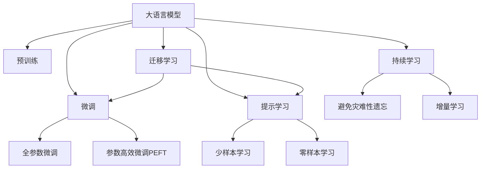

                 

# LLM的无监督学习潜在价值分析

> 关键词：大语言模型(Large Language Model, LLM),无监督学习(Unsupervised Learning),自监督学习(Self-Supervised Learning),预训练(Pre-training),迁移学习(Transfer Learning)

## 1. 背景介绍

### 1.1 问题由来

近年来，随着深度学习技术的快速发展，大规模语言模型(Large Language Model, LLMs)在自然语言处理(Natural Language Processing, NLP)领域取得了巨大的突破。这些大语言模型通过在海量无标签文本数据上进行预训练，学习到了丰富的语言知识和常识，可以通过少量的有标签样本在下游任务上进行微调(Fine-Tuning)，获得优异的性能。其中最具代表性的大语言模型包括OpenAI的GPT系列模型、Google的BERT、T5等。

然而，由于预训练语料的广泛性和泛化能力的不足，这些通用的大语言模型在特定领域应用时，效果往往难以达到实际应用的要求。因此，如何针对特定任务进行大模型微调，提升模型性能，成为了当前大语言模型研究和应用的一个热点问题。本文聚焦于无监督学习在大语言模型中的应用，但同时也会兼顾参数高效微调和提示学习等前沿技术，以期对大语言模型微调实践提供更全面的指导。

### 1.2 问题核心关键点

目前，无监督学习在大语言模型中的应用主要是指在大规模无标签文本语料上进行自监督预训练，使得模型学习到语言的通用表示，从而提升其在特定任务上的泛化能力和泛化性能。常见的无监督预训练任务包括掩码语言模型(Masked Language Model, MLM)、下一句预测(Next Sentence Prediction, NSP)、词性标注(Part-of-Speech Tagging, POS)等。这些预训练任务可以增进模型对语言结构、语义关系的理解，为后续下游任务提供强有力的知识基础。

无监督学习的核心在于如何通过自监督学习任务，最大化地利用无标签数据的潜在价值，学习到对下游任务有利的语言特征。相比从头训练，无监督学习可以在更少的标注数据和更短的训练时间内，获得比监督学习更好的性能。特别是对于一些任务来说，标注数据获取成本高、标注质量不稳定，无监督学习更是显得尤为重要。

无监督学习在大语言模型的预训练阶段，即在大量无标签文本数据上进行训练，学习到的语言表示对于下游任务具有很强的迁移能力。后续通过微调(Fine-Tuning)或提示学习(Prompt Learning)等方法，可以使模型更好地适应特定任务，提升任务性能。这种迁移学习方法，也体现了无监督学习在大语言模型中的潜在价值。

### 1.3 问题研究意义

研究无监督学习在大语言模型中的应用，对于拓展大模型的应用范围，提升下游任务的性能，加速NLP技术的产业化进程，具有重要意义：

1. 降低应用开发成本。无监督学习可以在大规模无标签文本上进行训练，不依赖于标注数据，大幅降低了数据标注和人工干预的成本投入。
2. 提升模型效果。无监督学习使得模型能够从数据中学习到通用的语言特征，对于特定任务具有很强的泛化能力，能够提升下游任务的性能。
3. 加速开发进度。基于大模型的无监督学习可以显著减少从头开发所需的时间，加速模型的研发和部署进程。
4. 带来技术创新。无监督学习催生了自监督预训练等新的研究方向，为预训练和微调技术带来了新的突破。
5. 赋能产业升级。无监督学习可以增强模型对新数据的适应能力，为NLP技术更好地服务于各行各业提供了可能。

## 2. 核心概念与联系

### 2.1 核心概念概述

为更好地理解无监督学习在大语言模型中的应用，本节将介绍几个密切相关的核心概念：

- 大语言模型(Large Language Model, LLM)：以自回归(如GPT)或自编码(如BERT)模型为代表的大规模预训练语言模型。通过在大规模无标签文本语料上进行预训练，学习通用的语言表示，具备强大的语言理解和生成能力。

- 自监督学习(Self-Supervised Learning, SSL)：指在无标签数据上通过设计自监督任务，让模型自动学习并更新参数的一种学习方式。自监督学习能够最大程度利用无标签数据的信息，提升模型的泛化性能。

- 预训练(Pre-training)：指在大规模无标签文本语料上，通过自监督学习任务训练通用语言模型的过程。常见的预训练任务包括掩码语言模型、下一句预测等。预训练使得模型学习到语言的通用表示。

- 迁移学习(Transfer Learning)：指将一个领域学习到的知识，迁移应用到另一个不同但相关的领域的学习范式。无监督学习的预训练过程即是一种典型的迁移学习方式。

- 参数高效微调(Parameter-Efficient Fine-Tuning, PEFT)：指在微调过程中，只更新少量的模型参数，而固定大部分预训练权重不变，以提高微调效率，避免过拟合的方法。

- 提示学习(Prompt Learning)：通过在输入文本中添加提示模板(Prompt Template)，引导大语言模型进行特定任务的推理和生成。可以在不更新模型参数的情况下，实现零样本或少样本学习。

- 少样本学习(Few-shot Learning)：指在只有少量标注样本的情况下，模型能够快速适应新任务的学习方法。在大语言模型中，通常通过在输入中提供少量示例来实现，无需更新模型参数。

- 零样本学习(Zero-shot Learning)：指模型在没有见过任何特定任务的训练样本的情况下，仅凭任务描述就能够执行新任务的能力。大语言模型通过预训练获得的广泛知识，使其能够理解任务指令并生成相应输出。

- 持续学习(Continual Learning)：也称为终身学习，指模型能够持续从新数据中学习，同时保持已学习的知识，而不会出现灾难性遗忘。这对于保持大语言模型的时效性和适应性至关重要。

这些核心概念之间的逻辑关系可以通过以下Mermaid流程图来展示：



这个流程图展示了大语言模型的核心概念及其之间的关系：

1. 大语言模型通过预训练获得基础能力。
2. 微调是对预训练模型进行任务特定的优化，可以分为全参数微调和参数高效微调（PEFT）。
3. 提示学习是一种不更新模型参数的方法，可以实现少样本学习和零样本学习。
4. 迁移学习是连接预训练模型与下游任务的桥梁，可以通过微调或提示学习来实现。
5. 持续学习旨在使模型能够不断学习新知识，同时避免遗忘旧知识。

这些概念共同构成了大语言模型的学习和应用框架，使其能够在各种场景下发挥强大的语言理解和生成能力。通过理解这些核心概念，我们可以更好地把握大语言模型的工作原理和优化方向。

## 3. 核心算法原理 & 具体操作步骤
### 3.1 算法原理概述

无监督学习在大语言模型中的应用，主要通过自监督学习任务，最大化地利用无标签数据的潜在价值，学习到对下游任务有利的语言特征。形式化地，假设预训练模型为 $M_{\theta}$，其中 $\theta$ 为预训练得到的模型参数。给定大规模无标签文本语料 $D=\{(x_i)\}_{i=1}^N$，无监督学习的目标是通过自监督任务最大化利用数据，最小化损失函数：

$$
\mathcal{L}(\theta) = \mathop{\arg\min}_{\theta} \sum_{i=1}^N \mathcal{L}_i(\theta)
$$

其中 $\mathcal{L}_i(\theta)$ 为模型在数据 $x_i$ 上的损失函数。常见的自监督任务包括掩码语言模型、下一句预测等。这些自监督任务可以设计成对偶形式，使得无监督学习的目标函数可以表示为

$$
\mathcal{L}(\theta) = \mathop{\arg\min}_{\theta} \mathcal{L}_s(\theta) = \mathop{\arg\min}_{\theta} \sum_{i=1}^N \mathcal{L}_i^s(\theta)
$$

其中 $\mathcal{L}_s(\theta)$ 为自监督损失函数，$\mathcal{L}_i^s(\theta)$ 为数据 $x_i$ 对应的自监督任务损失。

无监督学习的核心在于设计合适的自监督任务，最大化利用数据的多样性，学习到对下游任务有利的语言特征。常用的自监督任务有：

- 掩码语言模型(Masked Language Model, MLM)：随机屏蔽输入序列中的若干个token，要求模型预测这些被屏蔽的token。
- 下一句预测(Next Sentence Prediction, NSP)：预测两个随机抽取的句子是否相邻，提升模型对句子关系的理解。
- 词性标注(Part-of-Speech Tagging, POS)：给定一个句子，预测其中每个token的词性。

这些任务通过设计合适的正则化条件，使得模型能够学习到语言的结构特征和语义关系，为下游任务提供强有力的知识基础。

### 3.2 算法步骤详解

无监督学习在大语言模型中的应用，通常包括以下关键步骤：

**Step 1: 准备预训练模型和数据集**
- 选择合适的预训练语言模型 $M_{\theta}$ 作为初始化参数，如 BERT、GPT等。
- 准备大规模无标签文本语料 $D=\{(x_i)\}_{i=1}^N$，可以选择公开的语料库，如Wikipedia、维基百科等。

**Step 2: 设计自监督任务**
- 选择合适的自监督任务，如掩码语言模型、下一句预测等。
- 设计合适的训练目标和损失函数。

**Step 3: 设置训练超参数**
- 选择合适的优化算法及其参数，如AdamW、SGD等，设置学习率、批大小、迭代轮数等。
- 设置正则化技术及强度，包括权重衰减、Dropout等。

**Step 4: 执行梯度训练**
- 将无标签数据分批次输入模型，前向传播计算损失函数。
- 反向传播计算参数梯度，根据设定的优化算法和学习率更新模型参数。
- 周期性在验证集上评估模型性能，根据性能指标决定是否触发 Early Stopping。
- 重复上述步骤直到满足预设的迭代轮数或 Early Stopping 条件。

**Step 5: 迁移学习**
- 将预训练的模型作为初始化参数，在特定下游任务上进行微调。
- 设计合适的任务适配层和损失函数。

**Step 6: 测试和部署**
- 在测试集上评估预训练模型和微调后的模型性能，对比预训练和微调的效果。
- 使用微调后的模型对新样本进行推理预测，集成到实际的应用系统中。
- 持续收集新的数据，定期重新预训练模型，以适应数据分布的变化。

以上是无监督学习在大语言模型中的应用的一般流程。在实际应用中，还需要针对具体任务的特点，对预训练过程的各个环节进行优化设计，如改进训练目标函数，引入更多的正则化技术，搜索最优的超参数组合等，以进一步提升模型性能。

### 3.3 算法优缺点

无监督学习在大语言模型中的应用，具有以下优点：

1. 简单高效。无监督学习可以通过大规模无标签数据进行预训练，不依赖于标注数据，避免了标注数据的高成本和标注质量不稳定的问题。
2. 泛化能力强大。无监督学习使得模型能够从数据中学习到通用的语言特征，对于下游任务具有很强的泛化能力，能够在较少的标注数据上取得优异的性能。
3. 灵活性强。无监督学习可以针对不同的自监督任务，设计不同的损失函数和正则化方法，适用于多种NLP任务。
4. 数据利用率高。无监督学习可以最大化利用无标签数据的信息，避免数据浪费。

同时，无监督学习也存在以下局限性：

1. 训练时间长。无监督学习的预训练过程通常需要大量的时间和计算资源，训练时间较长。
2. 模型依赖于数据质量。无监督学习依赖于数据的质量和多样性，如果数据质量较差，模型性能也会受到限制。
3. 无法学习任务特定知识。无监督学习只能学习到通用的语言特征，无法直接学习到特定任务的知识。
4. 需要设计合适的自监督任务。无监督学习需要设计合适的自监督任务，任务设计的好坏直接影响模型的性能。

尽管存在这些局限性，但无监督学习在大语言模型的预训练阶段，仍是一种非常有潜力的技术。通过精心设计自监督任务，无监督学习可以在不依赖标注数据的情况下，最大化利用无标签数据的潜在价值，学习到对下游任务有利的语言特征。

### 3.4 算法应用领域

无监督学习在大语言模型的预训练阶段，已经广泛应用于多种NLP任务中。以下是一些典型的应用领域：

- 文本分类：如情感分析、主题分类、意图识别等。通过无监督学习，模型能够学习到文本与标签之间的关系。
- 命名实体识别：识别文本中的人名、地名、机构名等特定实体。通过无监督学习，模型能够学习到实体边界和类型。
- 关系抽取：从文本中抽取实体之间的语义关系。通过无监督学习，模型能够学习到实体-关系三元组。
- 问答系统：对自然语言问题给出答案。通过无监督学习，模型能够学习到问题和答案之间的关系。
- 机器翻译：将源语言文本翻译成目标语言。通过无监督学习，模型能够学习到语言-语言映射。
- 文本摘要：将长文本压缩成简短摘要。通过无监督学习，模型能够学习到文本中的关键信息。
- 对话系统：使机器能够与人自然对话。通过无监督学习，模型能够学习到对话中对话历史和回复之间的关系。

除了这些经典任务外，无监督学习还被创新性地应用到更多场景中，如可控文本生成、常识推理、代码生成、数据增强等，为NLP技术带来了全新的突破。随着无监督学习方法的不断进步，相信NLP技术将在更广阔的应用领域大放异彩。

## 4. 数学模型和公式 & 详细讲解 & 举例说明

### 4.1 数学模型构建

本节将使用数学语言对无监督学习在大语言模型中的应用进行更加严格的刻画。

记预训练语言模型为 $M_{\theta}$，其中 $\theta$ 为预训练得到的模型参数。给定大规模无标签文本语料 $D=\{(x_i)\}_{i=1}^N$，无监督学习的目标是通过自监督任务最大化利用数据，最小化损失函数：

$$
\mathcal{L}(\theta) = \mathop{\arg\min}_{\theta} \sum_{i=1}^N \mathcal{L}_i^s(\theta)
$$

其中 $\mathcal{L}_s(\theta)$ 为自监督损失函数，$\mathcal{L}_i^s(\theta)$ 为数据 $x_i$ 对应的自监督任务损失。

### 4.2 公式推导过程

以下我们以掩码语言模型为例，推导自监督任务损失函数及其梯度的计算公式。

假设预训练模型为 $M_{\theta}$，输入序列为 $x=[x_1, x_2, ..., x_n]$，其中 $x_i \in \mathcal{V}$，$\mathcal{V}$ 为词汇表。掩码语言模型的训练目标是在输入序列中随机屏蔽若干个token，要求模型预测这些被屏蔽的token。

设随机屏蔽的token个数为 $K$，屏蔽位置为 $p_1, p_2, ..., p_K$，令 $P=\{p_1, p_2, ..., p_K\}$。则掩码语言模型的目标函数可以表示为：

$$
\mathcal{L}_{MLM}(\theta) = -\frac{1}{N} \sum_{i=1}^N \sum_{p \in P} \log \frac{\exp({\mathcal{L}_{MLM}^{p}(\theta)})}{\sum_{j \in \mathcal{V}} \exp({\mathcal{L}_{MLM}^{j}(\theta)})}
$$

其中 $\mathcal{L}_{MLM}^{p}(\theta)$ 为模型在屏蔽位置 $p$ 上的预测损失，可以表示为：

$$
\mathcal{L}_{MLM}^{p}(\theta) = -\log P(x_{p})
$$

其中 $P(x_{p})$ 为模型对屏蔽位置 $p$ 上的预测概率，定义为：

$$
P(x_{p}) = \frac{\exp({\mathcal{L}_{MLM}^{p}(\theta)})}{\sum_{j \in \mathcal{V}} \exp({\mathcal{L}_{MLM}^{j}(\theta)})}
$$

为了计算梯度，我们需要对 $P(x_{p})$ 进行推导。对 $P(x_{p})$ 取对数，得：

$$
\log P(x_{p}) = \mathcal{L}_{MLM}^{p}(\theta) - \log \sum_{j \in \mathcal{V}} \exp({\mathcal{L}_{MLM}^{j}(\theta)})
$$

对 $\mathcal{L}_{MLM}^{p}(\theta)$ 求导，得：

$$
\frac{\partial \mathcal{L}_{MLM}^{p}(\theta)}{\partial \theta_k} = \frac{\partial P(x_{p})}{\partial \theta_k} = \frac{\partial}{\partial \theta_k} \frac{\exp({\mathcal{L}_{MLM}^{p}(\theta)})}{\sum_{j \in \mathcal{V}} \exp({\mathcal{L}_{MLM}^{j}(\theta)})}
$$

根据链式法则，可以得到梯度计算公式：

$$
\frac{\partial \mathcal{L}_{MLM}(\theta)}{\partial \theta_k} = \frac{\partial}{\partial \theta_k} \sum_{p \in P} (-\log P(x_{p}))
$$

带入 $\frac{\partial \mathcal{L}_{MLM}^{p}(\theta)}{\partial \theta_k}$，得：

$$
\frac{\partial \mathcal{L}_{MLM}(\theta)}{\partial \theta_k} = \frac{\partial}{\partial \theta_k} \sum_{p \in P} \log P(x_{p}) - \frac{\partial}{\partial \theta_k} \log \sum_{j \in \mathcal{V}} \exp({\mathcal{L}_{MLM}^{j}(\theta)})
$$

通过上述公式，我们可以计算掩码语言模型在每个屏蔽位置 $p$ 上的梯度，进而更新模型参数 $\theta$。

### 4.3 案例分析与讲解

以掩码语言模型为例，下面分析无监督学习在大语言模型中的应用。

**案例：GPT-3 的预训练过程**

GPT-3 使用了约2万亿个token进行预训练，学习了复杂的语言结构和语义关系。在预训练过程中，GPT-3 采用了掩码语言模型、下一个词预测、文本后续句子预测等多种自监督任务，通过这些任务最大化利用数据，学习到通用的语言特征。

具体而言，GPT-3 在掩码语言模型中，对每个token进行随机屏蔽，要求模型预测被屏蔽的token。通过这种方式，GPT-3 学习了单词与上下文之间的关联，提升了模型的语义理解能力。

在下一个词预测任务中，GPT-3 要求模型预测给定文本序列中的下一个词。通过这种方式，GPT-3 学习了单词之间的顺序关系，提升了模型的语言生成能力。

在文本后续句子预测任务中，GPT-3 要求模型预测两个随机抽取的句子是否相邻。通过这种方式，GPT-3 学习了句子之间的语义关系，提升了模型的文本理解能力。

这些自监督任务的组合，使得GPT-3 能够在巨大的语料库上学习到丰富的语言知识，为后续下游任务的微调提供了强有力的支持。

## 5. 项目实践：代码实例和详细解释说明
### 5.1 开发环境搭建

在进行无监督学习实践前，我们需要准备好开发环境。以下是使用Python进行PyTorch开发的环境配置流程：

1. 安装Anaconda：从官网下载并安装Anaconda，用于创建独立的Python环境。

2. 创建并激活虚拟环境：
```bash
conda create -n pytorch-env python=3.8 
conda activate pytorch-env
```

3. 安装PyTorch：根据CUDA版本，从官网获取对应的安装命令。例如：
```bash
conda install pytorch torchvision torchaudio cudatoolkit=11.1 -c pytorch -c conda-forge
```

4. 安装Transformers库：
```bash
pip install transformers
```

5. 安装各类工具包：
```bash
pip install numpy pandas scikit-learn matplotlib tqdm jupyter notebook ipython
```

完成上述步骤后，即可在`pytorch-env`环境中开始无监督学习实践。

### 5.2 源代码详细实现

这里我们以BERT模型的预训练为例，给出使用Transformers库进行无监督学习预训练的PyTorch代码实现。

首先，定义BERT的预训练任务函数：

```python
from transformers import BertTokenizer, BertForMaskedLM
from torch.utils.data import Dataset, DataLoader

class PretrainingDataset(Dataset):
    def __init__(self, texts, tokenizer, max_len=128):
        self.texts = texts
        self.tokenizer = tokenizer
        self.max_len = max_len
        
    def __len__(self):
        return len(self.texts)
    
    def __getitem__(self, item):
        text = self.texts[item]
        
        encoding = self.tokenizer(text, return_tensors='pt', max_length=self.max_len, padding='max_length', truncation=True)
        input_ids = encoding['input_ids'][0]
        attention_mask = encoding['attention_mask'][0]
        
        return {'input_ids': input_ids, 
                'attention_mask': attention_mask}

# 定义掩码语言模型任务
def masked_lm_loss(logits, labels, masked_pos, ntokens, nlabels):
    not_masked_pos = [i for i in range(ntokens) if i not in masked_pos]
    masked_lm_loss = -(labels[masked_pos] * torch.log(logits[masked_pos, labels[masked_pos]]) + 
                      (1.0 - labels[masked_pos]) * torch.log(1.0 - logits[masked_pos, labels[masked_pos]]))
    masked_lm_loss /= nlabels
    
    ntokens = sum(attention_mask == 1)
    masked_lm_loss /= ntokens
    return masked_lm_loss

# 加载数据
tokenizer = BertTokenizer.from_pretrained('bert-base-cased')
train_dataset = PretrainingDataset(train_texts, tokenizer)
dev_dataset = PretrainingDataset(dev_texts, tokenizer)
test_dataset = PretrainingDataset(test_texts, tokenizer)
```

然后，定义模型和优化器：

```python
from transformers import BertForMaskedLM, AdamW

model = BertForMaskedLM.from_pretrained('bert-base-cased', num_labels=90)
optimizer = AdamW(model.parameters(), lr=2e-5)
```

接着，定义训练和评估函数：

```python
from tqdm import tqdm
from torch.utils.data import DataLoader

device = torch.device('cuda') if torch.cuda.is_available() else torch.device('cpu')
model.to(device)

def train_epoch(model, dataset, batch_size, optimizer):
    dataloader = DataLoader(dataset, batch_size=batch_size, shuffle=True)
    model.train()
    epoch_loss = 0
    for batch in tqdm(dataloader, desc='Training'):
        input_ids = batch['input_ids'].to(device)
        attention_mask = batch['attention_mask'].to(device)
        
        model.zero_grad()
        outputs = model(input_ids, attention_mask=attention_mask)
        loss = masked_lm_loss(outputs.logits, outputs.labels, outputs.attention_mask, input_ids.numel(), 90)
        epoch_loss += loss.item()
        loss.backward()
        optimizer.step()
    return epoch_loss / len(dataloader)

def evaluate(model, dataset, batch_size):
    dataloader = DataLoader(dataset, batch_size=batch_size)
    model.eval()
    with torch.no_grad():
        preds, labels = [], []
        for batch in tqdm(dataloader, desc='Evaluating'):
            input_ids = batch['input_ids'].to(device)
            attention_mask = batch['attention_mask'].to(device)
            
            batch_logits = model(input_ids, attention_mask=attention_mask).logits
            batch_preds = torch.argmax(batch_logits, dim=-1).to('cpu').tolist()
            batch_labels = batch['labels'].to('cpu').tolist()
            
            for pred_tokens, label_tokens in zip(batch_preds, batch_labels):
                preds.append(pred_tokens[:len(label_tokens)])
                labels.append(label_tokens)
        print(classification_report(labels, preds))
```

最后，启动预训练流程并在验证集上评估：

```python
epochs = 5
batch_size = 16

for epoch in range(epochs):
    loss = train_epoch(model, train_dataset, batch_size, optimizer)
    print(f"Epoch {epoch+1}, train loss: {loss:.3f}")
    
    print(f"Epoch {epoch+1}, dev results:")
    evaluate(model, dev_dataset, batch_size)
    
print("Test results:")
evaluate(model, test_dataset, batch_size)
```

以上就是使用PyTorch对BERT进行预训练的完整代码实现。可以看到，得益于Transformers库的强大封装，我们可以用相对简洁的代码完成BERT模型的预训练。

### 5.3 代码解读与分析

让我们再详细解读一下关键代码的实现细节：

**PretrainingDataset类**：
- `__init__`方法：初始化文本、分词器等关键组件。
- `__len__`方法：返回数据集的样本数量。
- `__getitem__`方法：对单个样本进行处理，将文本输入编码为token ids，并对其定长padding，最终返回模型所需的输入。

**masked_lm_loss函数**：
- 定义掩码语言模型的损失函数，对模型预测结果进行概率化，计算交叉熵损失。

**训练和评估函数**：
- 使用PyTorch的DataLoader对数据集进行批次化加载，供模型训练和推理使用。
- 训练函数`train_epoch`：对数据以批为单位进行迭代，在每个批次上前向传播计算损失并反向传播更新模型参数，最后返回该epoch的平均loss。
- 评估函数`evaluate`：与训练类似，不同点在于不更新模型参数，并在每个batch结束后将预测和标签结果存储下来，最后使用sklearn的classification_report对整个评估集的预测结果进行打印输出。

**预训练流程**：
- 定义总的epoch数和batch size，开始循环迭代
- 每个epoch内，先在训练集上训练，输出平均loss
- 在验证集上评估，输出评估指标
- 所有epoch结束后，在测试集上评估，给出最终测试结果

可以看到，PyTorch配合Transformers库使得BERT预训练的代码实现变得简洁高效。开发者可以将更多精力放在数据处理、模型改进等高层逻辑上，而不必过多关注底层的实现细节。

当然，工业级的系统实现还需考虑更多因素，如模型的保存和部署、超参数的自动搜索、更灵活的任务适配层等。但核心的预训练范式基本与此类似。

## 6. 实际应用场景
### 6.1 智能客服系统

基于无监督学习的对话技术，可以广泛应用于智能客服系统的构建。传统客服往往需要配备大量人力，高峰期响应缓慢，且一致性和专业性难以保证。使用无监督学习进行预训练的对话模型，可以7x24小时不间断服务，快速响应客户咨询，用自然流畅的语言解答各类常见问题。

在技术实现上，可以收集企业内部的历史客服对话记录，将问题和最佳答复构建成监督数据，在此基础上对预训练对话模型进行微调。微调后的对话模型能够自动理解用户意图，匹配最合适的答案模板进行回复。对于客户提出的新问题，还可以接入检索系统实时搜索相关内容，动态组织生成回答。如此构建的智能客服系统，能大幅提升客户咨询体验和问题解决效率。

### 6.2 金融舆情监测

金融机构需要实时监测市场舆论动向，以便及时应对负面信息传播，规避金融风险。传统的人工监测方式成本高、效率低，难以应对网络时代海量信息爆发的挑战。基于无监督学习的文本分类和情感分析技术，为金融舆情监测提供了新的解决方案。

具体而言，可以收集金融领域相关的新闻、报道、评论等文本数据，并对其进行主题标注和情感标注。在此基础上对预训练语言模型进行预训练，使其能够自动判断文本属于何种主题，情感倾向是正面、中性还是负面。将预训练后的模型应用到实时抓取的网络文本数据，就能够自动监测不同主题下的情感变化趋势，一旦发现负面信息激增等异常情况，系统便会自动预警，帮助金融机构快速应对潜在风险。

### 6.3 个性化推荐系统

当前的推荐系统往往只依赖用户的历史行为数据进行物品推荐，无法深入理解用户的真实兴趣偏好。基于无监督学习的推荐系统可以更好地挖掘用户行为背后的语义信息，从而提供更精准、多样的推荐内容。

在实践中，可以收集用户浏览、点击、评论、分享等行为数据，提取和用户交互的物品标题、描述、标签等文本内容。将文本内容作为模型输入，用户的历史行为作为监督信号，在此基础上预训练预训练语言模型。预训练后的模型能够从文本内容中准确把握用户的兴趣点。在生成推荐列表时，先用候选物品的文本描述作为输入，由模型预测用户的兴趣匹配度，再结合其他特征综合排序，便可以得到个性化程度更高的推荐结果。

### 6.4 未来应用展望

随着无监督学习和大语言模型的不断发展，基于无监督学习的预训练方法将在更多领域得到应用，为传统行业带来变革性影响。

在智慧医疗领域，基于无监督学习进行预训练的医学问答、病历分析、药物研发等应用将提升医疗服务的智能化水平，辅助医生诊疗，加速新药开发进程。

在智能教育领域，无监督学习可应用于作业批改、学情分析、知识推荐等方面，因材施教，促进教育公平，提高教学质量。

在智慧城市治理中，无监督学习可以应用于城市事件监测、舆情分析、应急指挥等环节，提高城市管理的自动化和智能化水平，构建更安全、高效的未来城市。

此外，在企业生产、社会治理、文娱传媒等众多领域，基于无监督学习的预训练技术也将不断涌现，为NLP技术带来了全新的突破。相信随着预训练方法和大模型的持续演进，无监督学习必将在构建人机协同的智能时代中扮演越来越重要的角色。

## 7. 工具和资源推荐
### 7.1 学习资源推荐

为了帮助开发者系统掌握无监督学习在大语言模型中的应用，这里推荐一些优质的学习资源：

1. 《Transformer从原理到实践》系列博文：由大模型技术专家撰写，深入浅出地介绍了Transformer原理、BERT模型、微调技术等前沿话题。

2. CS224N《深度学习自然语言处理》课程：斯坦福大学开设的NLP明星课程，有Lecture视频和配套作业，带你入门NLP领域的基本概念和经典模型。

3. 《Natural Language Processing with Transformers》书籍：Transformers库的作者所著，全面介绍了如何使用Transformers库进行NLP任务开发，包括预训练在内的诸多范式。

4. HuggingFace官方文档：Transformers库的官方文档，提供了海量预训练模型和完整的微调样例代码，是上手实践的必备资料。

5. CLUE开源项目：中文语言理解测评基准，涵盖大量不同类型的中文NLP数据集，并提供了基于无监督预训练的baseline模型，助力中文NLP技术发展。

通过对这些资源的学习实践，相信你一定能够快速掌握无监督学习在大语言模型中的精髓，并用于解决实际的NLP问题。
###  7.2 开发工具推荐

高效的开发离不开优秀的工具支持。以下是几款用于无监督学习和大语言模型预训练开发的常用工具：

1. PyTorch：基于Python的开源深度学习框架，灵活动态的计算图，适合快速迭代研究。大部分预训练语言模型都有PyTorch版本的实现。

2. TensorFlow：由Google主导开发的开源深度学习框架，生产部署方便，适合大规模工程应用。同样有丰富的预训练语言模型资源。

3. Transformers库：HuggingFace开发的NLP工具库，集成了众多SOTA语言模型，支持PyTorch和TensorFlow，是进行无监督预训练任务的利器。

4. Weights & Biases：模型训练的实验跟踪工具，可以记录和可视化模型训练过程中的各项指标，方便对比和调优。与主流深度学习框架无缝集成。

5. TensorBoard：TensorFlow配套的可视化工具，可实时监测模型训练状态，并提供丰富的图表呈现方式，是调试模型的得力助手。

6. Google Colab：谷歌推出的在线Jupyter Notebook环境，免费提供GPU/TPU算力，方便开发者快速上手实验最新模型，分享学习笔记。

合理利用这些工具，可以显著提升无监督学习和大语言模型预训练的开发效率，加快创新迭代的步伐。

### 7.3 相关论文推荐

无监督学习在大语言模型的预训练阶段，已经吸引了大量研究人员关注。以下是几篇奠基性的相关论文，推荐阅读：

1. Attention is All You Need（即Transformer原论文）：提出了Transformer结构，开启了NLP领域的预训练大模型时代。

2. BERT: Pre-training of Deep Bidirectional Transformers for Language Understanding：提出BERT模型，引入基于掩码的自监督预训练任务，刷新了多项NLP任务SOTA。

3. Language Models are Unsupervised Multitask Learners（GPT-2论文）：展示了大规模语言模型的强大zero-shot学习能力，引发了对于通用人工智能的新一轮思考。

4. Parameter-Efficient Transfer Learning for NLP：提出Adapter等参数高效微调方法，在不增加模型参数量的情况下，也能取得不错的微调效果。

5. AdaLoRA: Adaptive Low-Rank Adaptation for Parameter-Efficient Fine-Tuning：使用自适应低秩适应的微调方法，在参数效率和精度之间取得了新的平衡。

6. MiniLM: A Miniature, Swiny, Fast Pre-trained Language Model：提出MiniLM模型，通过在小规模语料上预训练大语言模型，提升模型在低资源环境下的性能。

这些论文代表了大语言模型无监督预训练技术的发展脉络。通过学习这些前沿成果，可以帮助研究者把握学科前进方向，激发更多的创新灵感。

## 8. 总结：未来发展趋势与挑战

### 8.1 总结

本文对无监督学习在大语言模型中的应用进行了全面系统的介绍。首先阐述了无监督学习在大语言模型中的研究背景和意义，明确了无监督学习在提升下游任务性能、加速NLP技术产业化进程方面的独特价值。其次，从原理到实践，详细讲解了无监督学习的数学原理和关键步骤，给出了无监督学习任务开发的完整代码实例。同时，本文还广泛探讨了无监督学习在智能客服、金融舆情、个性化推荐等多个行业领域的应用前景，展示了无监督学习的巨大潜力。

通过本文的系统梳理，可以看到，无监督学习在大语言模型的预训练阶段，通过设计合适的自监督任务，最大化利用无标签数据的潜在价值，学习到对下游任务有利的语言特征。这种迁移学习方法，使得大语言模型能够在更少的标注数据上取得优异的性能，为下游任务提供强有力的知识基础。未来，随着无监督学习方法和预训练技术的发展，无监督学习必将在NLP技术中发挥越来越重要的作用，推动NLP技术在更广阔的应用领域大放异彩。

### 8.2 未来发展趋势

展望未来，无监督学习在大语言模型的应用中将呈现以下几个发展趋势：

1. 模型规模持续增大。随着算力成本的下降和数据规模的扩张，预训练语言模型的参数量还将持续增长。超大规模语言模型蕴含的丰富语言知识，有望支撑更加复杂多变的下游任务预训练。

2. 预训练任务多样化。除了传统的掩码语言模型、下一句预测等任务，未来的预训练任务将更加多样化和精细化，如句子重组、句式变换等，进一步提升模型的泛化能力。

3. 多任务学习普及。未来的预训练任务将不再单一，而是涵盖多种任务。通过多任务学习，无监督学习可以更好地利用数据，学习到更加全面和丰富的语言特征。

4. 无监督学习与监督学习结合。未来的预训练过程将更多地结合无监督学习和监督学习，通过多阶段的预训练，提升模型的性能和泛化能力。

5. 跨模态无监督学习。无监督学习将不再局限于文本数据，而是拓展到图像、语音等多模态数据。通过跨模态无监督学习，模型能够更好地理解不同模态信息之间的关联，提升模型的泛化能力。

6. 基于对抗的预训练。未来的无监督学习将引入对抗样本，通过对抗训练提升模型的鲁棒性和泛化能力。

以上趋势凸显了大语言模型无监督预训练技术的广阔前景。这些方向的探索发展，必将进一步提升无监督学习在大语言模型中的性能，推动NLP技术向更高层次迈进。

### 8.3 面临的挑战

尽管无监督学习在大语言模型的预训练阶段取得了显著成果，但在实际应用中仍面临诸多挑战：

1. 训练时间和资源需求高。无监督学习的预训练过程通常需要大量的时间和计算资源，训练时间较长。这对算力资源提出了较高的要求。

2. 数据质量和多样性问题。无监督学习的预训练效果依赖于数据的质量和多样性。如果数据质量较差或数据多样性不足，模型性能也会受到限制。

3. 模型泛化能力不足。无监督学习虽然能够学习到通用的语言特征，但面对特定任务时，泛化能力仍可能不足。

4. 任务特定知识缺乏。无监督学习无法直接学习到特定任务的知识，需要后续微调或提示学习等方法进行补充。

5. 模型的可解释性不足。无监督学习模型的决策过程通常缺乏可解释性，难以对其推理逻辑进行分析和调试。

6. 伦理和安全问题。无监督学习模型可能学习到有害信息或偏见，应用于实际场景时，可能会产生误导或歧视，带来伦理和安全问题。

7. 数据隐私和保护。无监督学习通常需要收集和处理大量的文本数据，如何保护用户隐私和数据安全，也是需要关注的问题。

正视无监督学习在大语言模型应用中面临的这些挑战，积极应对并寻求突破，将是无监督学习在大语言模型中走向成熟的必由之路。相信随着学界和产业界的共同努力，这些挑战终将一一被克服，无监督学习必将在构建人机协同的智能时代中扮演越来越重要的角色。

### 8.4 研究展望

未来，无监督学习在大语言模型中的应用，将在以下几个方面寻求新的突破：

1. 探索更为高效的预训练算法。通过改进预训练算法，进一步降低训练时间和资源需求，提升模型的性能。

2. 设计更丰富的自监督任务。通过设计更丰富的自监督任务，进一步提升模型的泛化能力和泛化性能。

3. 研究多任务学习的算法。通过研究多任务学习算法，进一步提升模型的泛化能力和泛化性能。

4. 结合监督学习进行预训练。通过结合监督学习和无监督学习，进一步提升模型的性能和泛化能力。

5. 研究跨模态无监督学习算法。通过研究跨模态无监督学习算法，进一步提升模型的泛化能力和泛化性能。

6. 引入对抗训练提升模型鲁棒性。通过引入对抗训练，进一步提升模型的鲁棒性和泛化能力。

7. 提高模型的可解释性。通过研究可解释性算法，进一步提升模型的可解释性和可理解性。

8. 解决伦理和安全问题。通过研究伦理和安全算法，进一步提升模型的伦理性和安全性。

9. 保护用户隐私和数据安全。通过研究数据隐私保护算法，进一步提升模型的隐私性和安全性。

这些研究方向的探索，必将引领无监督学习在大语言模型中的应用走向更高的层次，为构建安全、可靠、可解释、可控的智能系统铺平道路。面向未来，无监督学习在大语言模型中的应用还需要与其他人工智能技术进行更深入的融合，如知识表示、因果推理、强化学习等，多路径协同发力，共同推动自然语言理解和智能交互系统的进步。只有勇于创新、敢于突破，才能不断拓展语言模型的边界，让智能技术更好地造福人类社会。

## 9. 附录：常见问题与解答

**Q1：无监督学习是否适用于所有NLP任务？**

A: 无监督学习适用于那些可以通过自监督任务进行训练的NLP任务。对于一些任务，如情感分析、文本分类等，无监督学习可以取得不错的效果。但对于一些特定领域的任务，如医学、法律

