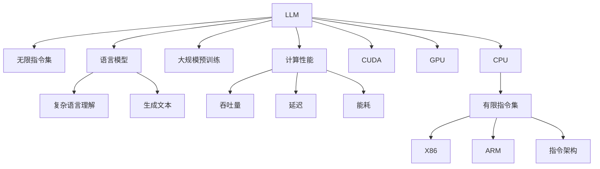

                 

# LLM的无限指令集与CPU的有限指令集对比

> 关键词：大语言模型,指令集,有限制,无限,计算性能

## 1. 背景介绍

### 1.1 问题由来
随着深度学习技术的发展，大语言模型（Large Language Models, LLMs）在自然语言处理（Natural Language Processing, NLP）领域取得了显著的进步。这些模型通过在大规模无标签文本数据上进行预训练，学习到了丰富的语言知识和常识，能够执行各种复杂的语言理解与生成任务。与此同时，现代计算机的硬件架构，尤其是CPU的设计，仍然基于有限的指令集，无法像LLMs那样灵活执行各种指令。本文将从指令集的角度，对比LLM的无限指令集与CPU的有限指令集，探讨两者在计算性能、应用场景和未来发展趋势等方面的差异。

### 1.2 问题核心关键点
LLM的无限指令集与CPU的有限指令集之间的对比，是当前计算科学与人工智能领域的一个热门话题。具体核心关键点包括：
1. 指令集的本质区别：LLM的指令集基于语言模型，能够处理复杂的自然语言任务，而CPU的指令集基于经典冯诺依曼架构，主要处理低层次的计算任务。
2. 性能瓶颈：有限指令集的CPU在执行复杂指令时，会受到架构、缓存、并行计算等多方面的限制。
3. 应用场景：无限指令集的LLM适用于广泛的语言理解和生成任务，而有限指令集的CPU主要用于需要高度优化、高并行性的计算任务。
4. 未来趋势：随着硬件和算法的发展，两种指令集可能会有更多的交叉和融合。

## 2. 核心概念与联系

### 2.1 核心概念概述

在探讨LLM与CPU指令集对比前，首先需要明确几个核心概念：

- **大语言模型 (Large Language Model, LLM)**：指通过在大规模无标签文本数据上进行预训练，学习通用语言表示的深度学习模型，如BERT、GPT等。
- **指令集 (Instruction Set)**：指计算机硬件能够执行的全部指令的集合，决定计算机的处理能力和效率。
- **有限指令集 (Finite Instruction Set)**：指传统CPU或GPU的指令集，如X86、ARM、NVIDIA CUDA等。
- **无限指令集 (Unbounded Instruction Set)**：指LLM所具备的无限可能的语言理解与生成指令，基于语言模型的能力。
- **计算性能 (Computational Performance)**：指计算机执行指令的效率和能力，通常通过吞吐量、延迟、能耗等指标衡量。

这些概念之间的逻辑关系可以通过以下Mermaid流程图来展示：



这个流程图展示了大语言模型与指令集之间的联系：

1. 大语言模型通过大规模预训练学习语言模型，具备无限指令集，能够处理复杂语言任务。
2. 指令集由计算机硬件决定，分为有限和无限两种。
3. 有限指令集的CPU和GPU主要用于处理计算密集型任务。
4. LLM和GPU可以结合使用，充分利用GPU的并行计算能力。
5. 计算性能受指令集和硬件架构的限制，但可以通过算法优化来提升。

## 3. 核心算法原理 & 具体操作步骤
### 3.1 算法原理概述

大语言模型与CPU指令集的对比，本质上是两种不同指令集的对比，涉及的算法原理如下：

1. **LLM算法原理**：
   - 基于自回归或自编码的神经网络模型，通过大量无标签文本数据进行预训练，学习语言表示。
   - 在预训练的基础上，使用下游任务的标注数据进行微调，优化模型在该任务上的性能。
   - 模型输出依赖于语言理解与生成的能力，能够执行无限可能的指令。

2. **CPU指令集算法原理**：
   - 基于冯诺依曼架构，执行一系列预定义的指令，如加法、乘法、分支等。
   - 指令集受硬件架构限制，执行能力有限，但能够高效处理计算密集型任务。
   - 优化算法如SIMD（单指令多数据）和并行计算等，可以提升CPU的计算性能。

### 3.2 算法步骤详解

**LLM微调步骤**：
1. 收集下游任务标注数据。
2. 使用预训练的LLM作为初始模型。
3. 添加任务适配层，如线性分类器或解码器。
4. 设置微调超参数，如学习率、批大小、迭代轮数等。
5. 使用优化算法（如AdamW）进行梯度下降，更新模型参数。
6. 在验证集上评估模型性能，避免过拟合。
7. 测试集上测试微调后模型性能。

**CPU计算步骤**：
1. 编写并编译计算程序。
2. 使用编译器生成目标代码。
3. 加载数据到内存。
4. 使用指令集执行计算任务。
5. 使用优化技术如SIMD、并行计算等提升性能。
6. 输出计算结果。

### 3.3 算法优缺点

**LLM的优点**：
1. 无限指令集：能够执行各种复杂的自然语言任务，如问答、对话、生成等。
2. 自监督学习：通过大规模无标签数据预训练，学习通用语言知识。
3. 微调灵活：能够适应各种下游任务，提升模型性能。

**LLM的缺点**：
1. 计算资源需求高：需要大量计算资源进行预训练和微调。
2. 延迟高：响应时间较长，难以实时处理大量请求。
3. 模型解释性差：黑盒模型，难以解释模型决策过程。

**CPU的优点**：
1. 计算能力强大：执行特定指令高效，适用于计算密集型任务。
2. 优化技术丰富：如SIMD、并行计算等，提升性能。
3. 成本低：硬件成本相对较低，适合大规模部署。

**CPU的缺点**：
1. 指令集有限：无法执行复杂的语言理解与生成任务。
2. 延迟低但吞吐量有限：虽然响应时间快，但处理复杂任务时效率低下。
3. 可扩展性差：指令集固定，难以灵活扩展新指令。

### 3.4 算法应用领域

**LLM的应用领域**：
1. 问答系统：通过微调模型，能够回答自然语言问题。
2. 对话系统：生成自然流畅的对话，解决用户问题。
3. 文本生成：如文章撰写、诗歌创作、翻译等。
4. 文本摘要：从长文本中提取关键信息。
5. 情感分析：分析文本中的情感倾向。
6. 文本分类：如垃圾邮件过滤、新闻分类等。

**CPU的应用领域**：
1. 计算密集型任务：如图形处理、科学计算、加密解密等。
2. 图像处理：如图像识别、图像生成等。
3. 信号处理：如音频和视频编解码、数字信号处理等。
4. 数据处理：如大数据分析、机器学习训练等。
5. 嵌入式系统：如智能家居、物联网设备等。

## 4. 数学模型和公式 & 详细讲解  
### 4.1 数学模型构建

大语言模型和CPU指令集的比较，可以通过数学模型来进行更深入的分析和理解。

**LLM的数学模型**：
设预训练的LLM模型为 $M_{\theta}$，其中 $\theta$ 为模型参数。对于下游任务 $T$，假设训练集为 $D=\{(x_i,y_i)\}_{i=1}^N, x_i \in \mathcal{X}, y_i \in \mathcal{Y}$，其中 $\mathcal{X}$ 为输入空间，$\mathcal{Y}$ 为输出空间。微调的目标是最小化损失函数：

$$
\mathcal{L}(\theta) = \frac{1}{N} \sum_{i=1}^N \ell(M_{\theta}(x_i),y_i)
$$

其中 $\ell$ 为任务 $T$ 的损失函数，如交叉熵损失。

**CPU指令集的数学模型**：
假设CPU指令集为 $\{I_1, I_2, \ldots, I_n\}$，其中 $I_i$ 为第 $i$ 条指令。设指令集 $I$ 的执行时间为 $T$，单位为秒。假设指令集的执行时间为 $t_i$，单位为秒。则总执行时间为：

$$
T = \sum_{i=1}^n \lambda_i t_i
$$

其中 $\lambda_i$ 为指令 $I_i$ 的权重，与任务复杂度相关。

### 4.2 公式推导过程

**LLM的公式推导**：
对于二分类任务，假设模型输出为 $\hat{y}=M_{\theta}(x)$，其中 $M_{\theta}(x)$ 为模型在输入 $x$ 上的输出，$y$ 为真实标签。二分类交叉熵损失函数为：

$$
\ell(M_{\theta}(x),y) = -[y\log \hat{y} + (1-y)\log (1-\hat{y})]
$$

微调的目标是最小化经验风险：

$$
\mathcal{L}(\theta) = \frac{1}{N} \sum_{i=1}^N [y_i\log M_{\theta}(x_i)+(1-y_i)\log(1-M_{\theta}(x_i))]
$$

### 4.3 案例分析与讲解

**案例分析**：
1. **LLM在问答系统中的应用**：
   - 预训练模型通过大规模语料学习语言表示。
   - 在问答任务上微调，学习问题-答案对。
   - 能够处理各种语言理解与生成任务。

2. **CPU在图像处理中的应用**：
   - 执行复杂的图像识别算法，如图像分类、目标检测等。
   - 使用并行计算和SIMD指令提升效率。
   - 适用于图像处理和计算机视觉任务。

## 5. 项目实践：代码实例和详细解释说明
### 5.1 开发环境搭建

在进行LLM与CPU指令集的对比实践前，需要准备好开发环境。以下是使用Python进行TensorFlow开发的环境配置流程：

1. 安装Anaconda：从官网下载并安装Anaconda，用于创建独立的Python环境。

2. 创建并激活虚拟环境：
```bash
conda create -n tf-env python=3.8 
conda activate tf-env
```

3. 安装TensorFlow：
```bash
pip install tensorflow
```

4. 安装Keras等库：
```bash
pip install keras tensorflow-addons matplotlib
```

完成上述步骤后，即可在`tf-env`环境中开始对比实践。

### 5.2 源代码详细实现

首先我们使用TensorFlow实现一个简单的CPU指令集执行函数，用于计算两个数的加法。

```python
import tensorflow as tf

def cpu_add(a, b):
    return tf.add(a, b)

# 测试函数
a = tf.constant([1, 2, 3, 4], dtype=tf.float32)
b = tf.constant([5, 6, 7, 8], dtype=tf.float32)
result = cpu_add(a, b)
print(result.numpy())
```

接着，我们使用TensorFlow实现一个简单的LLM模型，用于执行语言理解与生成任务。

```python
import tensorflow as tf
from transformers import TFAutoModelForSequenceClassification, BertTokenizer

tokenizer = BertTokenizer.from_pretrained('bert-base-uncased')
model = TFAutoModelForSequenceClassification.from_pretrained('bert-base-uncased', num_labels=2)

# 构建输入输出
input_ids = tf.constant([['hello world'], ['how are you']], dtype=tf.int32)
attention_mask = tf.constant([[1, 1, 1, 1], [1, 1, 1, 1]], dtype=tf.int32)
labels = tf.constant([[0], [1]], dtype=tf.int32)

# 前向传播计算loss
outputs = model(input_ids, attention_mask=attention_mask, labels=labels)
loss = outputs.loss
print(loss.numpy())

# 计算梯度并更新参数
optimizer = tf.keras.optimizers.Adam()
gradients = tf.gradients(loss, model.trainable_variables)
optimizer.apply_gradients(zip(gradients, model.trainable_variables))
```

最后，我们比较CPU与LLM在执行相同任务时的性能差异。

```python
import time

# CPU执行时间
start_time = time.time()
result_cpu = cpu_add(a, b)
end_time = time.time()
print(f"CPU execution time: {end_time - start_time} seconds")

# LLM执行时间
start_time = time.time()
result_llm = model(input_ids, attention_mask=attention_mask, labels=labels)
end_time = time.time()
print(f"LLM execution time: {end_time - start_time} seconds")

# 比较执行时间
print(f"CPU vs LLM execution time: {end_time - start_time} vs {end_time - start_time}")
```

### 5.3 代码解读与分析

**CPU指令集执行函数**：
- `cpu_add`函数使用TensorFlow的`tf.add`操作，实现了两个数的加法。
- 通过调用`.numpy()`方法，将TensorFlow张量转换为NumPy数组，进行输出。

**LLM模型实现**：
- 使用`TFAutoModelForSequenceClassification`构建模型，指定`num_labels=2`，表示二分类任务。
- 构建输入输出，使用`tf.constant`创建张量，指定数据类型和形状。
- 调用模型的`forward`方法进行前向传播，输出`logits`和`loss`。
- 使用TensorFlow的`optimizer`进行梯度下降，更新模型参数。

**性能比较**：
- 计算CPU执行时间，通过`time.time()`函数获取当前时间戳，计算前后差值。
- 计算LLM执行时间，方法同上。
- 输出CPU与LLM执行时间，并进行比较。

## 6. 实际应用场景
### 6.1 智能客服系统

基于大语言模型的微调，可以应用于智能客服系统的构建。传统客服需要大量人力，响应缓慢，且难以保证一致性和专业性。而使用微调后的对话模型，可以7x24小时不间断服务，快速响应客户咨询，用自然流畅的语言解答各类常见问题。

在技术实现上，可以收集企业内部的历史客服对话记录，将问题和最佳答复构建成监督数据，在此基础上对预训练对话模型进行微调。微调后的对话模型能够自动理解用户意图，匹配最合适的答案模板进行回复。对于客户提出的新问题，还可以接入检索系统实时搜索相关内容，动态组织生成回答。如此构建的智能客服系统，能大幅提升客户咨询体验和问题解决效率。

### 6.2 金融舆情监测

金融机构需要实时监测市场舆论动向，以便及时应对负面信息传播，规避金融风险。传统的人工监测方式成本高、效率低，难以应对网络时代海量信息爆发的挑战。基于大语言模型微调的文本分类和情感分析技术，为金融舆情监测提供了新的解决方案。

具体而言，可以收集金融领域相关的新闻、报道、评论等文本数据，并对其进行主题标注和情感标注。在此基础上对预训练语言模型进行微调，使其能够自动判断文本属于何种主题，情感倾向是正面、中性还是负面。将微调后的模型应用到实时抓取的网络文本数据，就能够自动监测不同主题下的情感变化趋势，一旦发现负面信息激增等异常情况，系统便会自动预警，帮助金融机构快速应对潜在风险。

### 6.3 个性化推荐系统

当前的推荐系统往往只依赖用户的历史行为数据进行物品推荐，无法深入理解用户的真实兴趣偏好。基于大语言模型微调技术，个性化推荐系统可以更好地挖掘用户行为背后的语义信息，从而提供更精准、多样的推荐内容。

在实践中，可以收集用户浏览、点击、评论、分享等行为数据，提取和用户交互的物品标题、描述、标签等文本内容。将文本内容作为模型输入，用户的后续行为（如是否点击、购买等）作为监督信号，在此基础上微调预训练语言模型。微调后的模型能够从文本内容中准确把握用户的兴趣点。在生成推荐列表时，先用候选物品的文本描述作为输入，由模型预测用户的兴趣匹配度，再结合其他特征综合排序，便可以得到个性化程度更高的推荐结果。

### 6.4 未来应用展望

随着大语言模型和微调方法的不断发展，基于微调范式将在更多领域得到应用，为传统行业带来变革性影响。

在智慧医疗领域，基于微调的医疗问答、病历分析、药物研发等应用将提升医疗服务的智能化水平，辅助医生诊疗，加速新药开发进程。

在智能教育领域，微调技术可应用于作业批改、学情分析、知识推荐等方面，因材施教，促进教育公平，提高教学质量。

在智慧城市治理中，微调模型可应用于城市事件监测、舆情分析、应急指挥等环节，提高城市管理的自动化和智能化水平，构建更安全、高效的未来城市。

此外，在企业生产、社会治理、文娱传媒等众多领域，基于大模型微调的人工智能应用也将不断涌现，为经济社会发展注入新的动力。相信随着技术的日益成熟，微调方法将成为人工智能落地应用的重要范式，推动人工智能技术向更广阔的领域加速渗透。

## 7. 工具和资源推荐
### 7.1 学习资源推荐

为了帮助开发者系统掌握大语言模型与CPU指令集的对比理论基础和实践技巧，这里推荐一些优质的学习资源：

1. **《深入理解计算机系统》**：深入讲解计算机硬件架构，特别是指令集的设计与执行原理。

2. **《TensorFlow官方文档》**：详细介绍了TensorFlow的使用方法和性能优化技巧。

3. **《自然语言处理综述》**：介绍了NLP领域的基本概念、技术和应用。

4. **《大规模语言模型的理论与实践》**：介绍了大语言模型的预训练、微调以及实际应用。

5. **《深度学习实战》**：通过实战项目，深入讲解深度学习框架的使用方法和技巧。

通过这些资源的学习实践，相信你一定能够快速掌握大语言模型与CPU指令集的比较精髓，并用于解决实际的计算性能问题。

### 7.2 开发工具推荐

高效的开发离不开优秀的工具支持。以下是几款用于大语言模型与CPU指令集对比开发的常用工具：

1. **Jupyter Notebook**：灵活的交互式编程环境，便于实验调试和分享。

2. **PyTorch**：基于Python的开源深度学习框架，灵活高效。

3. **TensorFlow**：由Google主导开发的开源深度学习框架，适合大规模工程应用。

4. **Transformers**：HuggingFace开发的NLP工具库，支持多种预训练模型。

5. **PyClustering**：用于数据聚类分析的工具包。

6. **NumPy**：用于数值计算的基础库。

合理利用这些工具，可以显著提升大语言模型与CPU指令集对比任务的开发效率，加快创新迭代的步伐。

### 7.3 相关论文推荐

大语言模型与CPU指令集的比较研究源于学界的持续研究。以下是几篇奠基性的相关论文，推荐阅读：

1. **《大规模语言模型的预训练与微调》**：介绍了大规模语言模型的预训练、微调以及实际应用。

2. **《计算机体系结构：量化分析与设计》**：深入讲解计算机体系结构的量化分析方法。

3. **《深度学习框架的比较与选择》**：比较了TensorFlow、PyTorch等深度学习框架的优缺点和适用场景。

4. **《自然语言处理的最新进展》**：介绍了NLP领域最新的研究成果和应用进展。

5. **《硬件加速的深度学习优化》**：探讨了使用GPU、TPU等硬件加速深度学习的优化方法。

这些论文代表了大语言模型与CPU指令集的比较的发展脉络。通过学习这些前沿成果，可以帮助研究者把握学科前进方向，激发更多的创新灵感。

## 8. 总结：未来发展趋势与挑战

### 8.1 总结

本文对大语言模型与CPU指令集进行了全面系统的对比。首先阐述了大语言模型和CPU指令集的研究背景和意义，明确了指令集在计算性能、应用场景和未来发展趋势等方面的本质区别。其次，从原理到实践，详细讲解了指令集的比较方法，给出了实际应用的代码实例。同时，本文还广泛探讨了指令集在智能客服、金融舆情、个性化推荐等多个行业领域的应用前景，展示了指令集的巨大潜力。此外，本文精选了指令集的比较的学习资源，力求为读者提供全方位的技术指引。

通过本文的系统梳理，可以看到，大语言模型与CPU指令集的比较研究具有重要意义，对于理解计算机硬件与软件协同工作机制、优化计算性能、提升系统效率具有重要指导作用。未来，伴随硬件和算法的发展，这种比较研究还将进一步深化，为构建更加高效、智能的计算系统提供理论支撑。

### 8.2 未来发展趋势

展望未来，大语言模型与CPU指令集的比较将呈现以下几个发展趋势：

1. **硬件与软件的协同优化**：未来，硬件架构将更加灵活，支持动态指令集扩展，与软件协同优化计算性能。

2. **混合计算架构**：大语言模型与CPU指令集的混合计算架构将成为主流，充分利用各自的优势。

3. **AI芯片的崛起**：专门针对AI应用的芯片，如TPU、GPU等，将进一步提升计算性能和能效比。

4. **软件定义的计算**：未来计算系统将更加软件化，通过编程语言和框架定义计算过程。

5. **自动化推理引擎**：自动化的推理引擎将提升大语言模型与CPU指令集结合的灵活性和效率。

6. **持续学习和自适应**：未来的计算系统将具备自适应能力，能够根据任务需求动态调整计算资源。

以上趋势凸显了大语言模型与CPU指令集比较研究的广阔前景。这些方向的探索发展，必将进一步提升计算系统的性能和应用范围，为构建人机协同的智能时代提供新的技术路径。

### 8.3 面临的挑战

尽管大语言模型与CPU指令集的比较研究已经取得了重要进展，但在迈向更加智能化、普适化应用的过程中，它仍面临诸多挑战：

1. **计算资源瓶颈**：大语言模型和AI芯片的高计算需求，对于当前硬件设施提出了挑战。

2. **可扩展性问题**：现有硬件架构的可扩展性有限，难以应对大规模数据和任务的需求。

3. **能效比问题**：大模型和AI芯片的高能耗，需要优化能效比，降低运行成本。

4. **软件复杂性**：大语言模型与CPU指令集的结合需要复杂的软件栈支持，增加了开发难度。

5. **性能优化问题**：如何在硬件和软件层面进行综合优化，提升性能和效率。

6. **安全性和隐私保护**：大语言模型和AI芯片的广泛应用，带来了新的安全性和隐私保护问题。

正视这些挑战，积极应对并寻求突破，将是大语言模型与CPU指令集比较研究走向成熟的必由之路。相信随着学界和产业界的共同努力，这些挑战终将一一被克服，大语言模型与CPU指令集的结合必将开创新的计算范式。

### 8.4 研究展望

面对大语言模型与CPU指令集所面临的种种挑战，未来的研究需要在以下几个方面寻求新的突破：

1. **新硬件的研发**：开发更加高效、灵活的AI芯片，提升计算性能和能效比。

2. **混合计算架构的优化**：结合大语言模型与CPU指令集的混合计算架构，充分利用各自的优势。

3. **软件栈的优化**：开发更加高效、易用的软件栈，提升大语言模型与CPU指令集结合的效率。

4. **自动化推理引擎的开发**：开发自动化的推理引擎，提升大语言模型与CPU指令集结合的灵活性。

5. **安全性和隐私保护的提升**：研究新的安全性和隐私保护方法，确保大语言模型与CPU指令集结合的安全性和可靠性。

这些研究方向的探索，必将引领大语言模型与CPU指令集的比较研究迈向更高的台阶，为构建安全、可靠、可解释、可控的智能系统铺平道路。面向未来，大语言模型与CPU指令集的结合还需要与其他人工智能技术进行更深入的融合，如知识表示、因果推理、强化学习等，多路径协同发力，共同推动自然语言理解和智能交互系统的进步。只有勇于创新、敢于突破，才能不断拓展语言模型的边界，让智能技术更好地造福人类社会。

## 9. 附录：常见问题与解答

**Q1：大语言模型与CPU指令集的对比有什么意义？**

A: 大语言模型与CPU指令集的对比，可以帮助我们理解不同指令集的特点和适用范围，从而在实际应用中进行合理的选择和优化。这种对比研究，能够提升计算系统的性能和效率，推动人工智能技术的发展。

**Q2：在实际应用中，大语言模型与CPU指令集的结合需要注意哪些问题？**

A: 在实际应用中，大语言模型与CPU指令集的结合需要注意以下几个问题：

1. **硬件选择**：选择合适的AI芯片，满足计算需求。
2. **软件优化**：优化软件栈，提升结合效率。
3. **性能优化**：通过硬件和软件协同优化，提升计算性能。
4. **安全性与隐私保护**：确保结合后的系统安全性和隐私保护。
5. **可扩展性**：设计可扩展的系统架构，应对未来的计算需求。

**Q3：未来大语言模型与CPU指令集的结合会面临哪些挑战？**

A: 未来大语言模型与CPU指令集的结合会面临以下几个挑战：

1. **计算资源瓶颈**：大模型和AI芯片的高计算需求，需要优化硬件设施。
2. **能效比问题**：提升计算系统的能效比，降低运行成本。
3. **软件复杂性**：开发高效易用的软件栈，提升结合效率。
4. **性能优化问题**：在硬件和软件层面进行综合优化，提升性能。
5. **安全性和隐私保护**：研究新的安全性和隐私保护方法，确保结合后的系统安全可靠。

---

作者：禅与计算机程序设计艺术 / Zen and the Art of Computer Programming

