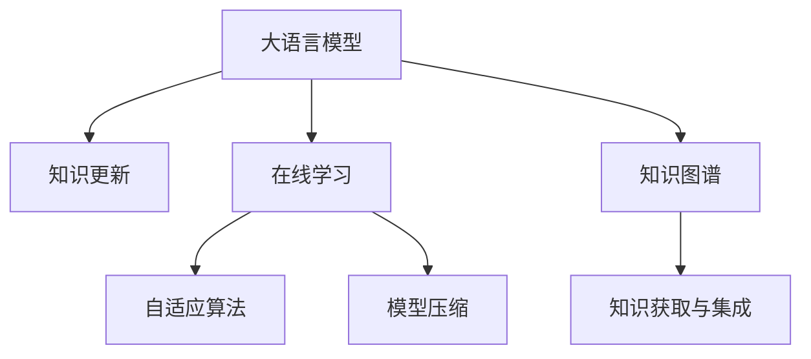

                 

# LLM的知识更新：保持AI信息的时效性

> 关键词：
> - 知识更新
> - 大语言模型
> - 时效性
> - 在线学习
> - 自适应算法
> - 模型压缩
> - 知识图谱
> - 信息获取与集成

## 1. 背景介绍

### 1.1 问题由来
随着人工智能（AI）技术的飞速发展，大语言模型（Large Language Models, LLMs）在自然语言处理（NLP）等领域取得了显著的进展。这些模型通过在大规模无标签文本数据上进行预训练，学习到了丰富的语言知识和常识。然而，这些模型所学习到的知识往往是基于预训练时数据的时效性，对于新出现的事件、知识或语言变化，模型可能无法即时更新，导致其输出的信息不再准确。

### 1.2 问题核心关键点
保持大语言模型知识的时效性，使其能够适应不断变化的语言环境，成为了当前AI领域的一个重要研究方向。这一问题核心关键点包括：
- 如何及时更新模型，使其知识库与最新的语言数据保持同步？
- 如何设计有效的在线学习算法，使得模型能够自适应新的语言知识和规则？
- 如何通过知识图谱等方法，提高模型的知识获取和整合能力，增强模型的泛化性能？

这些问题不仅涉及算法设计，还涉及数据获取、模型架构等多个方面，需要通过系统的方法和工具来解决。

## 2. 核心概念与联系

### 2.1 核心概念概述

为更好地理解大语言模型知识更新的过程，本节将介绍几个密切相关的核心概念：

- 大语言模型（LLMs）：指通过在大规模无标签文本数据上进行预训练，学习通用语言表示的语言模型。常见的预训练模型包括GPT、BERT等。
- 知识更新：指通过在线学习等方法，动态更新模型的知识库，使其适应新出现的事件、知识或语言变化。
- 在线学习（Online Learning）：指模型在数据流上不断接收新的训练样本，实时更新模型参数，以适应新数据和新知识的过程。
- 自适应算法（Adaptive Algorithms）：指能够根据数据分布变化自动调整模型参数的算法，如自适应梯度下降等。
- 模型压缩（Model Compression）：指通过剪枝、量化等技术，减小模型参数量，提高推理速度和资源利用效率。
- 知识图谱（Knowledge Graph）：指通过图结构来表示实体、关系和属性，用于知识获取、整合和推理的工具。

这些概念之间的逻辑关系可以通过以下Mermaid流程图来展示：



这个流程图展示了大语言模型知识更新的核心概念及其之间的关系：

1. 大语言模型通过在线学习获得新知识，不断更新。
2. 自适应算法根据新数据自动调整模型参数，增强模型泛化性能。
3. 模型压缩技术减小参数量，提高推理效率。
4. 知识图谱用于获取和整合知识，增强模型推理能力。

这些概念共同构成了大语言模型知识更新的框架，使其能够适应不断变化的语言环境，保持模型的时效性和适应性。

## 3. 核心算法原理 & 具体操作步骤
### 3.1 算法原理概述

大语言模型知识更新的核心思想是：通过在线学习算法，动态更新模型的知识库，使其适应新出现的事件、知识或语言变化。其核心原理如下：

假设模型为 $M_{\theta}$，其中 $\theta$ 为模型参数。在线学习过程中，模型不断地接收新的训练样本 $(x,y)$，其中 $x$ 为输入，$y$ 为输出。在线学习的目标是最小化每个样本的损失函数 $l(x,y)$，即：

$$
\theta_{t+1} = \theta_{t} - \eta \nabla_{\theta} l(x_t, y_t)
$$

其中，$\eta$ 为学习率，$\nabla_{\theta} l(x_t, y_t)$ 为损失函数对模型参数的梯度。通过不断地迭代更新，模型能够适应新数据和新知识，更新其知识库，从而保持时效性。

### 3.2 算法步骤详解

大语言模型知识更新的一般流程包括以下关键步骤：

**Step 1: 准备预训练模型和数据集**
- 选择合适的预训练语言模型 $M_{\theta}$ 作为初始化参数。
- 准备在线数据集 $D=\{(x_i,y_i)\}_{i=1}^N$，每个样本包含输入 $x_i$ 和输出 $y_i$。

**Step 2: 设计在线学习算法**
- 选择合适的在线学习算法，如自适应梯度下降（Adaptive Gradient Descent）、随机梯度下降（Stochastic Gradient Descent）等。
- 设置学习率 $\eta$，超参数 $\alpha$ 等，以控制在线学习的速度和精度。

**Step 3: 实施在线学习**
- 将数据集 $D$ 分批次输入模型，计算每个样本的损失函数 $l(x,y)$。
- 计算损失函数对模型参数的梯度，使用在线学习算法更新模型参数 $\theta$。
- 定期在验证集上评估模型性能，根据性能指标决定是否调整学习率或算法参数。

**Step 4: 压缩模型**
- 对模型进行剪枝、量化等操作，减小参数量。
- 设计高效的推理引擎，加速模型的推理速度。

**Step 5: 知识图谱构建与集成**
- 收集领域相关知识和规则，构建知识图谱。
- 设计推理算法，将知识图谱与模型输出进行集成，增强模型的推理能力。

以上是知识更新的主要步骤，具体实现时需要根据具体任务进行优化。

### 3.3 算法优缺点

大语言模型知识更新方法具有以下优点：
1. 实时性：通过在线学习，模型能够实时适应新数据，保持知识的时效性。
2. 泛化能力：自适应算法能够根据新数据自动调整模型参数，增强模型的泛化性能。
3. 可扩展性：在线学习模型可以不断接收新数据，不需要重新训练，适用于数据流驱动的应用场景。

同时，该方法也存在一定的局限性：
1. 计算成本高：在线学习需要不断计算梯度并更新模型参数，计算成本较高。
2. 知识获取难度大：需要收集和整合大量的领域知识，构建知识图谱，成本较高。
3. 知识融合复杂：将知识图谱与模型输出进行集成，需要复杂的推理算法。

尽管存在这些局限性，但大语言模型知识更新方法在保持模型时效性方面具有重要价值，尤其是在需要动态更新知识的应用场景中，具有广泛的应用前景。

### 3.4 算法应用领域

大语言模型知识更新方法在多个领域得到了应用，例如：

- 新闻推荐系统：通过实时抓取和更新新闻数据，利用在线学习算法，更新模型的推荐结果。
- 金融风险预警：通过实时监控金融市场数据，利用在线学习算法，更新模型的风险预测模型。
- 自然灾害预警：通过实时采集气象数据，利用在线学习算法，更新模型的预警模型。
- 自动驾驶系统：通过实时接收传感器数据，利用在线学习算法，更新模型的环境感知和决策模型。

除了上述这些经典任务外，大语言模型知识更新还被创新性地应用到更多场景中，如智能客服、智慧医疗、智能安防等，为这些领域带来了新的突破。随着在线学习技术的发展，大语言模型知识更新的应用范围将不断扩展。

## 4. 数学模型和公式 & 详细讲解 & 举例说明

### 4.1 数学模型构建

本节将使用数学语言对大语言模型知识更新的过程进行更加严格的刻画。

假设模型为 $M_{\theta}$，输入数据为 $x$，输出数据为 $y$。在线学习的目标是最小化每个样本的损失函数 $l(x,y)$，即：

$$
\theta_{t+1} = \theta_{t} - \eta \nabla_{\theta} l(x_t, y_t)
$$

其中 $\eta$ 为学习率，$\nabla_{\theta} l(x_t, y_t)$ 为损失函数对模型参数的梯度。

在线学习算法有多种形式，其中自适应梯度下降算法（Adaptive Gradient Descent, AGD）是最常见的一种，其更新公式为：

$$
\theta_{t+1} = \theta_{t} - \eta \frac{\nabla_{\theta} l(x_t, y_t)}{||\nabla_{\theta} l(x_t, y_t)||}
$$

其中 $||\nabla_{\theta} l(x_t, y_t)||$ 为梯度的范数，控制了模型的更新速度和方向。

### 4.2 公式推导过程

以下我们以二分类任务为例，推导自适应梯度下降算法的更新公式。

假设模型 $M_{\theta}$ 在输入 $x$ 上的输出为 $\hat{y}=M_{\theta}(x) \in [0,1]$，表示样本属于正类的概率。真实标签 $y \in \{0,1\}$。则二分类交叉熵损失函数定义为：

$$
l(x,y) = -[y\log \hat{y} + (1-y)\log (1-\hat{y})]
$$

在线学习的目标是最小化每个样本的损失函数，即：

$$
\theta_{t+1} = \theta_{t} - \eta \frac{\partial l(x_t, y_t)}{\partial \theta}
$$

将损失函数对模型参数的梯度代入上式，得：

$$
\theta_{t+1} = \theta_{t} - \eta \left[ \frac{y}{\hat{y}} - \frac{1-y}{1-\hat{y}} \right] \frac{\partial \hat{y}}{\partial \theta}
$$

其中 $\frac{\partial \hat{y}}{\partial \theta}$ 为输出层对模型参数的梯度，可通过链式法则递归计算。

在得到损失函数的梯度后，即可带入参数更新公式，完成模型的迭代优化。重复上述过程直至收敛，最终得到适应新数据的最优模型参数 $\theta^*$。

### 4.3 案例分析与讲解

下面以新闻推荐系统为例，详细讲解在线学习在实际应用中的实现。

假设新闻推荐系统使用在线学习算法，实时接收用户点击新闻的点击流数据，更新推荐模型。具体步骤如下：

**Step 1: 准备预训练模型和数据集**
- 使用预训练的BERT模型作为初始化参数。
- 收集用户点击流数据，划分为训练集和验证集。

**Step 2: 设计在线学习算法**
- 选择自适应梯度下降算法作为在线学习算法。
- 设置学习率为 $10^{-3}$，超参数 $\alpha=0.9$。

**Step 3: 实施在线学习**
- 将点击流数据分批次输入模型，计算每个样本的损失函数 $l(x,y)$。
- 计算损失函数对模型参数的梯度，使用自适应梯度下降算法更新模型参数 $\theta$。
- 定期在验证集上评估模型性能，根据性能指标决定是否调整学习率或算法参数。

**Step 4: 压缩模型**
- 对模型进行剪枝，去除冗余参数，减小模型大小。
- 设计高效的推理引擎，加速模型的推理速度。

**Step 5: 知识图谱构建与集成**
- 收集领域相关的新闻知识，构建知识图谱。
- 设计推理算法，将知识图谱与模型输出进行集成，增强模型的推荐效果。

通过上述步骤，新闻推荐系统可以实时更新推荐模型，确保推荐结果的时效性和准确性，提升用户体验。

## 5. 项目实践：代码实例和详细解释说明
### 5.1 开发环境搭建

在进行知识更新实践前，我们需要准备好开发环境。以下是使用Python进行PyTorch开发的环境配置流程：

1. 安装Anaconda：从官网下载并安装Anaconda，用于创建独立的Python环境。

2. 创建并激活虚拟环境：
```bash
conda create -n pytorch-env python=3.8 
conda activate pytorch-env
```

3. 安装PyTorch：根据CUDA版本，从官网获取对应的安装命令。例如：
```bash
conda install pytorch torchvision torchaudio cudatoolkit=11.1 -c pytorch -c conda-forge
```

4. 安装Transformers库：
```bash
pip install transformers
```

5. 安装各类工具包：
```bash
pip install numpy pandas scikit-learn matplotlib tqdm jupyter notebook ipython
```

完成上述步骤后，即可在`pytorch-env`环境中开始知识更新实践。

### 5.2 源代码详细实现

下面我们以新闻推荐系统为例，给出使用Transformers库对BERT模型进行在线学习的PyTorch代码实现。

首先，定义在线学习函数：

```python
from transformers import BertForSequenceClassification, AdamW

def online_learning(model, data_loader, device, num_epochs=10, learning_rate=0.001):
    model.train()
    for epoch in range(num_epochs):
        optimizer.zero_grad()
        for batch in data_loader:
            inputs = batch['input_ids'].to(device)
            labels = batch['labels'].to(device)
            outputs = model(inputs)
            loss = outputs.loss
            loss.backward()
            optimizer.step()
        print(f"Epoch {epoch+1}, loss: {loss.item():.4f}")
```

然后，加载数据和模型：

```python
from transformers import BertTokenizer
from torch.utils.data import DataLoader
import torch

tokenizer = BertTokenizer.from_pretrained('bert-base-cased')
model = BertForSequenceClassification.from_pretrained('bert-base-cased', num_labels=2)

train_data = ...
dev_data = ...
test_data = ...

train_loader = DataLoader(train_data, batch_size=32, shuffle=True)
dev_loader = DataLoader(dev_data, batch_size=32)
test_loader = DataLoader(test_data, batch_size=32)
```

接着，进行在线学习：

```python
device = torch.device('cuda') if torch.cuda.is_available() else torch.device('cpu')
online_learning(model, train_loader, device, num_epochs=5, learning_rate=0.001)
```

最后，评估模型性能：

```python
model.eval()
with torch.no_grad():
    dev_preds, dev_labels = [], []
    for batch in dev_loader:
        inputs = batch['input_ids'].to(device)
        labels = batch['labels'].to(device)
        outputs = model(inputs)
        preds = outputs.logits.argmax(dim=1).to('cpu').tolist()
        labels = labels.to('cpu').tolist()
        for pred, label in zip(preds, labels):
            dev_preds.append(pred)
            dev_labels.append(label)
    print(classification_report(dev_labels, dev_preds))
```

以上就是使用PyTorch对BERT进行在线学习的完整代码实现。可以看到，借助Transformers库的强大封装，我们可以用相对简洁的代码完成在线学习的实践。

### 5.3 代码解读与分析

让我们再详细解读一下关键代码的实现细节：

**online_learning函数**：
- 设置模型为训练模式。
- 循环迭代训练轮数。
- 对每个批次进行前向传播，计算损失函数，反向传播更新模型参数，完成一个训练轮次。
- 输出每个epoch的平均损失值。

**数据加载器**：
- 使用PyTorch的数据集API加载数据。
- 将输入数据和标签转换为模型所需的tensor格式。

**评估模型性能**：
- 将模型设置为评估模式。
- 对每个批次进行前向传播，获取预测结果和标签。
- 使用scikit-learn的classification_report输出分类指标。

可以看到，在线学习的代码实现相对简单，关键在于选择合适的在线学习算法和参数，并合理设置训练轮数和数据加载方式。

## 6. 实际应用场景
### 6.1 智能推荐系统
智能推荐系统是知识更新的一个重要应用场景。通过实时抓取和更新用户行为数据，利用在线学习算法，推荐系统可以动态调整推荐模型，确保推荐结果的时效性和准确性。

在技术实现上，推荐系统可以收集用户浏览、点击、购买等行为数据，提取和用户交互的文本数据。利用在线学习算法，将用户文本数据作为模型输入，用户的后续行为（如点击、购买等）作为监督信号，训练模型学习用户兴趣和行为规律。在推荐时，使用当前最新的用户文本数据，更新推荐结果，提升用户体验。

### 6.2 智能客服系统
智能客服系统同样需要实时获取和更新客户交互数据，通过在线学习算法，更新模型知识库，提升客服服务质量。

在智能客服系统中，可以收集客户的历史对话记录，将问题和最佳答复构建成监督数据，在此基础上对预训练模型进行在线学习。在线学习后的模型能够自动理解用户意图，匹配最合适的答案模板进行回复。对于客户提出的新问题，还可以接入检索系统实时搜索相关内容，动态组织生成回答，提升服务效率和质量。

### 6.3 智慧医疗
智慧医疗系统中，医生和患者的互动数据实时更新，通过在线学习算法，医生能够实时获取最新知识，提升诊疗效果。

在智慧医疗中，可以收集医生的诊断记录、患者的医疗记录等文本数据，利用在线学习算法，更新医生的诊断模型和患者的健康管理模型。医生可以根据最新病例，实时调整诊疗策略，提升诊断准确性。患者也可以根据最新的健康知识，动态调整健康管理方案，提升生活质量。

### 6.4 未来应用展望
随着在线学习技术的发展，大语言模型知识更新方法将在更多领域得到应用，为各行各业带来变革性影响。

在智慧教育领域，智能推荐系统可以根据学生的学习行为数据，动态调整推荐内容，提升学习效果。在智慧城市治理中，实时数据流驱动的在线学习算法，能够帮助城市管理者实时应对突发事件，提高城市管理的自动化和智能化水平。在工业制造领域，在线学习算法能够实时监控设备运行数据，动态调整生产策略，提升生产效率和质量。

## 7. 工具和资源推荐
### 7.1 学习资源推荐

为了帮助开发者系统掌握大语言模型知识更新的理论基础和实践技巧，这里推荐一些优质的学习资源：

1. 《在线学习与自适应算法》系列博文：由大模型技术专家撰写，深入浅出地介绍了在线学习与自适应算法的基本原理和常用方法。

2. CS246《在线学习》课程：斯坦福大学开设的在线学习课程，涵盖在线学习的基本概念和经典算法，适合系统学习。

3. 《深度学习在线学习与自适应》书籍：详细介绍了在线学习和自适应算法的理论基础和实践技巧，适合深入学习。

4. Coursera《在线学习与自适应算法》课程：由加州大学伯克利分校开设的在线课程，涵盖在线学习与自适应算法的基本概念和实际应用。

5. arXiv论文库：收录了大量关于在线学习与自适应算法的经典论文，适合查阅和学习最新研究进展。

通过对这些资源的学习实践，相信你一定能够快速掌握大语言模型知识更新的精髓，并用于解决实际的NLP问题。

### 7.2 开发工具推荐

高效的开发离不开优秀的工具支持。以下是几款用于大语言模型知识更新的常用工具：

1. PyTorch：基于Python的开源深度学习框架，灵活动态的计算图，适合快速迭代研究。

2. TensorFlow：由Google主导开发的开源深度学习框架，生产部署方便，适合大规模工程应用。

3. Transformers库：HuggingFace开发的NLP工具库，集成了众多SOTA语言模型，支持在线学习。

4. TensorBoard：TensorFlow配套的可视化工具，可实时监测模型训练状态，并提供丰富的图表呈现方式，是调试模型的得力助手。

5. Weights & Biases：模型训练的实验跟踪工具，可以记录和可视化模型训练过程中的各项指标，方便对比和调优。

6. Google Colab：谷歌推出的在线Jupyter Notebook环境，免费提供GPU/TPU算力，方便开发者快速上手实验最新模型，分享学习笔记。

合理利用这些工具，可以显著提升大语言模型知识更新的开发效率，加快创新迭代的步伐。

### 7.3 相关论文推荐

大语言模型知识更新的发展源于学界的持续研究。以下是几篇奠基性的相关论文，推荐阅读：

1. Adaptive Gradient Descent Techniques (AdaGrad)：提出了一种自适应梯度下降算法，能够根据每个参数的历史梯度信息自动调整学习率。

2. Gradient Descent Algorithms with Variable Learning Rates (RMSprop)：提出了一种基于梯度平方均值的自适应梯度下降算法，能够有效地处理梯度消失问题。

3. Accelerated Gradient Methods for Non-Strongly Convex, Non-L smooth Concave Functions (Adam)：提出了一种结合动量和高阶矩估计的自适应梯度下降算法，能够高效处理复杂非凸问题。

4. A Survey of Online Learning and Adaptive Algorithms: The Adaptive Gradient Method (Adaptive Gradient Descent)：综述了在线学习与自适应算法的基本原理和常用方法，适合系统学习。

5. Online Learning with Stochastic Variance Reduction (SVRG)：提出了一种基于随机梯度下降的在线学习算法，能够有效地处理大规模数据集。

这些论文代表了大语言模型知识更新的发展脉络。通过学习这些前沿成果，可以帮助研究者把握学科前进方向，激发更多的创新灵感。

## 8. 总结：未来发展趋势与挑战

### 8.1 总结

本文对大语言模型知识更新的方法进行了全面系统的介绍。首先阐述了知识更新在大语言模型中的应用背景和意义，明确了在线学习在保持模型时效性方面的重要价值。其次，从原理到实践，详细讲解了在线学习的数学原理和关键步骤，给出了在线学习任务开发的完整代码实例。同时，本文还广泛探讨了知识更新方法在智能推荐、智能客服、智慧医疗等多个行业领域的应用前景，展示了在线学习范式的巨大潜力。此外，本文精选了在线学习的各类学习资源，力求为读者提供全方位的技术指引。

通过本文的系统梳理，可以看到，在线学习在大语言模型知识更新中的应用前景广阔，极大地拓展了模型适应的语言环境，提高了模型输出的时效性和泛化性能。未来，伴随在线学习技术的发展，大语言模型知识更新将进一步推动NLP系统的性能和应用范围，为人类认知智能的进化带来深远影响。

### 8.2 未来发展趋势

展望未来，大语言模型知识更新技术将呈现以下几个发展趋势：

1. 实时性进一步提升。在线学习算法将更加高效，能够在数据流上实时更新模型，适应更快的数据变化速率。

2. 自适应能力增强。自适应算法将更灵活，能够根据数据分布变化自动调整模型参数，增强模型的泛化性能。

3. 多模态知识整合。知识图谱将与更多模态的数据进行整合，增强模型的推理能力和泛化性能。

4. 异构数据集成。在线学习算法将支持异构数据的整合，能够处理不同类型的文本、图像、语音等数据。

5. 分布式学习扩展。在线学习算法将支持分布式计算，能够处理大规模数据集和复杂模型。

6. 可解释性增强。在线学习算法将更注重可解释性，能够提供模型决策的详细解释，增强模型的透明度和可信度。

这些趋势凸显了大语言模型知识更新技术的广阔前景，这些方向的探索发展，必将进一步提升模型的性能和应用范围，为构建安全、可靠、可解释、可控的智能系统铺平道路。

### 8.3 面临的挑战

尽管大语言模型知识更新技术已经取得了显著进展，但在迈向更加智能化、普适化应用的过程中，它仍面临着诸多挑战：

1. 计算成本高昂。在线学习算法需要不断计算梯度并更新模型参数，计算成本较高。

2. 数据质量难以保证。在线学习算法对数据质量要求较高，但数据采集和预处理成本较高。

3. 知识图谱构建复杂。构建领域知识图谱需要大量领域专家的参与，成本较高。

4. 模型泛化能力不足。在线学习算法对数据分布变化敏感，模型的泛化能力有待提高。

5. 知识更新速度慢。在线学习算法需要不断调整模型参数，更新速度较慢。

6. 知识融合难度大。将知识图谱与模型输出进行集成，需要复杂的推理算法。

正视在线学习面临的这些挑战，积极应对并寻求突破，将是大语言模型知识更新走向成熟的必由之路。相信随着学界和产业界的共同努力，这些挑战终将一一被克服，在线学习技术将成为大语言模型知识更新的重要手段。

### 8.4 未来突破

面对在线学习面临的种种挑战，未来的研究需要在以下几个方面寻求新的突破：

1. 探索更高效的在线学习算法。开发更加高效、低成本的在线学习算法，降低计算成本和数据预处理成本。

2. 提升知识图谱构建效率。利用自动化工具和技术，降低知识图谱构建的成本和复杂度。

3. 增强模型泛化能力。通过引入更多先验知识和领域专家，提升模型的泛化能力，增强模型的泛化性能。

4. 提高知识更新速度。开发更加快速的在线学习算法，提高知识更新的速度和效率。

5. 设计更高效的推理算法。将知识图谱与模型输出进行集成，设计高效的推理算法，增强模型的推理能力。

这些研究方向的探索，必将引领在线学习技术迈向更高的台阶，为构建安全、可靠、可解释、可控的智能系统铺平道路。面向未来，在线学习技术还需要与其他人工智能技术进行更深入的融合，如知识表示、因果推理、强化学习等，多路径协同发力，共同推动自然语言理解和智能交互系统的进步。只有勇于创新、敢于突破，才能不断拓展语言模型的边界，让智能技术更好地造福人类社会。

## 9. 附录：常见问题与解答

**Q1：在线学习算法是否适用于所有NLP任务？**

A: 在线学习算法在大多数NLP任务上都能取得不错的效果，特别是对于数据量较小的任务。但对于一些特定领域的任务，如医学、法律等，仅仅依靠通用语料预训练的模型可能难以很好地适应。此时需要在特定领域语料上进一步预训练，再进行在线学习，才能获得理想效果。

**Q2：如何选择合适的在线学习算法？**

A: 选择合适的在线学习算法需要考虑任务的特点和数据的分布。对于线性可分的数据，可以选择简单的在线学习算法，如随机梯度下降。对于非凸数据，可以选择复杂的在线学习算法，如Adam。对于大规模数据集，可以选择分布式在线学习算法，如Mini-batch SGD。

**Q3：在线学习过程中如何避免过拟合？**

A: 在线学习过程中过拟合问题比较突出，通常需要采取以下措施：
1. 数据增强：通过回译、近义替换等方式扩充训练集。
2. 正则化：使用L2正则、Dropout等避免过拟合。
3. 对抗训练：加入对抗样本，提高模型鲁棒性。

**Q4：在线学习模型在落地部署时需要注意哪些问题？**

A: 将在线学习模型转化为实际应用，还需要考虑以下因素：
1. 模型裁剪：去除不必要的层和参数，减小模型大小。
2. 量化加速：将浮点模型转为定点模型，压缩存储空间，提高计算效率。
3. 服务化封装：将模型封装为标准化服务接口，便于集成调用。
4. 监控告警：实时采集系统指标，设置异常告警阈值，确保服务稳定性。
5. 安全防护：采用访问鉴权、数据脱敏等措施，保障数据和模型安全。

通过本文的系统梳理，可以看到，在线学习在大语言模型知识更新中的应用前景广阔，极大地拓展了模型适应的语言环境，提高了模型输出的时效性和泛化性能。未来，伴随在线学习技术的发展，大语言模型知识更新将进一步推动NLP系统的性能和应用范围，为人类认知智能的进化带来深远影响。

---

作者：禅与计算机程序设计艺术 / Zen and the Art of Computer Programming

