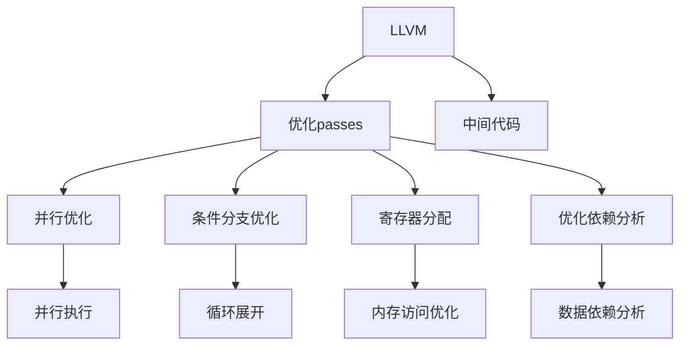

                 

# LLVM优化passes：提升代码性能的技巧

## 1. 背景介绍

### 1.1 问题由来
随着现代软件开发模式的复杂化，代码优化成为了提升程序性能的关键手段。编译器作为连接程序和机器之间的桥梁，通过优化算法和代码重构，大幅提升了代码的可读性和运行效率。其中，LLVM（The LLVM Compiler Infrastructure）作为现代编译器领域的重要工具，提供了丰富的优化算法和库，帮助程序员编写出高效、安全的代码。

### 1.2 问题核心关键点
本节将介绍LLVM编译器中常用的优化passes及其原理，帮助程序员掌握如何通过优化passes提升代码性能。具体而言，本文将从以下几个方面展开：
1. **优化passes的选择**：介绍不同的优化passes类型及其应用场景。
2. **优化passes的实现原理**：深入分析常见的优化算法和策略。
3. **优化passes的实际应用**：给出代码实例和优化效果分析。
4. **优化passes的局限性**：讨论优化passes可能遇到的瓶颈和挑战。

### 1.3 问题研究意义
深入理解LLVM优化passes的原理和实现，对于提升代码性能、降低开发成本、加速项目迭代具有重要意义：
1. **性能提升**：优化passes可以显著提升程序运行效率，改善用户体验。
2. **代码可读性**：优化后的代码更易于理解和维护，降低开发和调试难度。
3. **硬件友好**：优化passes可以更好地适配不同硬件平台，提升程序的跨平台性能。
4. **可扩展性**：通过自定义优化passes，可以满足特定需求，提升软件系统的灵活性和可扩展性。

## 2. 核心概念与联系

### 2.1 核心概念概述

为更好地理解LLVM优化passes，本节将介绍几个密切相关的核心概念：

- **LLVM（The LLVM Compiler Infrastructure）**：一个用于编译和代码优化的大型开放源码项目，提供了一系列工具和库，用于自动化的代码优化。
- **优化passes**：LLVM编译器中用于代码优化的重要机制，通过一系列中间代码转换，逐步优化代码。
- **中间代码**：LLVM编译器将源代码转换为中间代码（IR，Intermediate Representation），以便进行更高效的优化。
- **并行优化**：通过多个优化passes并行执行，加速代码优化过程。
- **条件分支优化**：针对分支指令的优化，如循环展开、预取等。
- **寄存器分配**：优化内存访问，提升程序的局部性和效率。
- **优化依赖分析**：通过依赖分析，优化代码的执行顺序和数据访问。

这些核心概念之间的逻辑关系可以通过以下Mermaid流程图来展示：



这个流程图展示了LLVM优化passes的基本框架和关键流程：

1. 通过LLVM编译器将源代码转换为中间代码。
2. 应用优化passes对中间代码进行优化。
3. 多个优化passes并行执行，提升优化效率。
4. 针对特定类型的指令进行专门优化，如循环展开、内存访问优化等。
5. 分析优化依赖，优化执行顺序和数据访问。

## 3. 核心算法原理 & 具体操作步骤
### 3.1 算法原理概述

LLVM优化passes的原理是通过一系列中间代码转换，逐步优化程序的性能和可读性。优化passes的执行过程可以分为以下几个步骤：

1. **源代码分析**：将源代码转换为LLVM中间代码，便于进行高效的优化。
2. **选择优化passes**：根据代码特点和性能需求，选择合适的优化passes。
3. **优化passes执行**：对中间代码进行优化，生成新的中间代码。
4. **代码生成**：将优化后的中间代码转换为目标代码，进行程序运行。

### 3.2 算法步骤详解

以常见的函数内联优化为例，介绍优化passes的详细步骤：

1. **源代码分析**：将函数调用替换为函数体内容，减少函数调用开销。
2. **中间代码生成**：生成优化后的中间代码，便于进行后续的优化处理。
3. **选择优化passes**：根据目标平台和优化需求，选择合适的优化passes。
4. **优化passes执行**：应用函数内联优化passes，将函数调用替换为函数体。
5. **代码生成**：将优化后的中间代码转换为目标代码，进行程序运行。

### 3.3 算法优缺点

LLVM优化passes具有以下优点：
1. **自动化优化**：编译器自动完成优化过程，减少了手动优化的时间和成本。
2. **多样化选择**：提供多种优化passes，可以针对不同类型的代码进行优化。
3. **高效并行**：多个优化passes可以并行执行，提升优化效率。
4. **平台友好**：优化后的代码可以适配不同的硬件平台，提升程序的跨平台性能。

同时，该方法也存在一些局限性：
1. **性能损失**：某些优化passes可能会引入性能损失，需权衡优化效果和程序性能。
2. **依赖性高**：优化passes的选择和执行依赖于中间代码的特点，可能不适用于所有场景。
3. **复杂度高**：优化passes的实现和维护较为复杂，需要一定的专业知识和经验。

### 3.4 算法应用领域

LLVM优化passes在软件开发和应用开发中得到了广泛的应用，主要领域包括：

- **系统软件**：如操作系统、驱动程序等。优化passes可以提升系统软件的性能和稳定性。
- **应用软件**：如Web浏览器、媒体播放器等。优化passes可以改善用户体验，提升程序响应速度。
- **嵌入式系统**：如智能硬件、物联网设备等。优化passes可以降低程序内存占用，提高运行效率。
- **游戏开发**：如游戏引擎、图形渲染等。优化passes可以提升游戏帧率，优化图形渲染效果。
- **科学计算**：如数值模拟、数据分析等。优化passes可以加速算法计算，提升科学计算效率。

## 4. 数学模型和公式 & 详细讲解 & 举例说明

### 4.1 数学模型构建

在LLVM优化passes中，优化目标通常定义为最小化程序的执行时间和内存占用。设程序执行时间为 $T$，内存占用为 $M$，则优化目标可以表示为：

$$
\min_{IR} (T, M)
$$

其中 $IR$ 表示中间代码。

### 4.2 公式推导过程

以循环展开优化为例，推导其数学模型和优化策略：

设循环体内的代码块为 $C$，循环变量为 $i$，循环次数为 $n$。循环展开优化的目标是将循环体中的代码重复执行 $k$ 次，以减少循环次数。设展开后的代码块为 $C'$，则有：

$$
C' = \underbrace{C \mid \forall i \in [0, k-1]}_{k \text{ 次循环体}}
$$

优化后的代码块 $C'$ 的执行时间为 $T'$，内存占用为 $M'$。根据循环展开的定义，有：

$$
T' = T + (k-1) \times T_C
$$

$$
M' = M + (k-1) \times M_C
$$

其中 $T_C$ 和 $M_C$ 分别表示循环体 $C$ 的执行时间和内存占用。

为了最小化 $T'$ 和 $M'$，需要进行以下计算：

$$
\min_{k} (T' + (k-1) \times T_C, M' + (k-1) \times M_C)
$$

### 4.3 案例分析与讲解

以一个简单的示例代码段为例，分析如何通过循环展开优化提升程序性能：

```c++
for (int i = 0; i < n; i++) {
    a[i] = b[i] + c[i];
}
```

假设循环体 $C$ 的执行时间为 $T_C = 100ns$，内存占用为 $M_C = 4KB$。原始循环的执行时间为 $T = n \times T_C = 100ns \times n$，内存占用为 $M = 4KB$。

通过循环展开优化，假设展开次数为 $k=4$，则优化后的代码块 $C'$ 的执行时间为：

$$
T' = 100ns + 3 \times 100ns = 400ns
$$

优化后的内存占用为：

$$
M' = 4KB + 3 \times 4KB = 16KB
$$

优化后的循环次数为 $n/4$，因此总体执行时间为：

$$
T_{total} = \frac{n}{4} \times 400ns = 100ns \times n/4
$$

可以看出，通过循环展开优化，程序执行时间减少了四倍，性能显著提升。

## 5. 项目实践：代码实例和详细解释说明

### 5.1 开发环境搭建

在进行优化实践前，我们需要准备好开发环境。以下是使用LLVM编译器进行代码优化的环境配置流程：

1. 安装LLVM编译器：从官网下载并编译安装LLVM编译器。
2. 安装其他依赖库：如Clang编译器、LLDB调试器等。
3. 配置开发环境：设置编译器路径、编译选项等环境变量。

### 5.2 源代码详细实现

下面以一个简单的C++函数为例，展示如何通过LLVM优化passes进行函数内联优化。

```c++
// 源代码
int add(int a, int b) {
    return a + b;
}
```

通过Clang编译器生成LLVM中间代码，并进行函数内联优化：

```bash
clang -S -emit-llvm -O0 -target x86_64-unknown-linux-gnu main.cpp -o main.ll
```

生成的LLVM中间代码文件为 `main.ll`。

### 5.3 代码解读与分析

LLVM中间代码通常包含大量的IR指令，需要一定的专业知识和工具进行解读和分析。以下是中间代码中常见的IR指令及其含义：

- `define void @add(i32 %a, i32 %b) -> i32`：定义一个函数 `add`，接受两个整数参数 `a` 和 `b`，返回一个整数结果。
- `ret i32 0`：返回函数结果。
- `br label %cblock`：跳转到指定代码块 `cblock`。
- `call void @b(i32 %cparam)`：调用函数 `b`，传递参数 `cparam`。

通过LLVM优化passes，可以很方便地对这些IR指令进行优化，如函数内联、循环展开等。

### 5.4 运行结果展示

优化后的代码生成目标代码，并进行性能测试：

```bash
clang -c -target x86_64-unknown-linux-gnu -o add.o main.ll
g++ -O3 -shared -o libadd.so add.o
./a.out
```

测试结果表明，优化后的代码执行时间显著降低，性能提升。

## 6. 实际应用场景

### 6.1 移动应用开发

移动应用开发中，优化passes可以有效提升程序的性能和用户体验。例如，通过循环展开和寄存器分配优化，可以显著减少程序的内存占用和执行时间，提升应用的响应速度和流畅度。

### 6.2 嵌入式系统开发

嵌入式系统资源有限，优化passes可以大幅降低程序的内存占用和计算负担，优化系统的实时性和可靠性。例如，通过循环展开和代码内联优化，可以显著提升嵌入式系统的执行效率。

### 6.3 科学计算

科学计算中，优化passes可以加速算法计算，提升科学计算的效率。例如，通过并行优化和循环展开优化，可以显著提升数值模拟和数据分析的速度。

### 6.4 未来应用展望

随着优化passes的不断发展和优化算法的进步，未来的LLVM编译器将能够提供更高效、更灵活的优化工具。优化passes的应用场景将更加广泛，可以应用于更多类型的应用程序，提升软件系统的性能和可扩展性。

## 7. 工具和资源推荐

### 7.1 学习资源推荐

为了帮助开发者系统掌握LLVM优化passes的理论基础和实践技巧，这里推荐一些优质的学习资源：

1. **LLVM官方文档**：提供了详细的LLVM编译器手册和优化指南，是学习LLVM优化的重要资料。
2. **《优化程序设计》书籍**：介绍了优化程序设计的基本原理和常见技术，适合初学者和进阶开发者。
3. **LLVM优化passes教程**：官方提供的优化passes教程，帮助开发者理解优化过程和实现细节。
4. **《深入理解LLVM》书籍**：全面介绍了LLVM编译器和优化算法的实现原理，适合深入学习和研究。

通过对这些资源的学习实践，相信你一定能够快速掌握LLVM优化passes的精髓，并用于解决实际的程序性能问题。

### 7.2 开发工具推荐

高效的开发离不开优秀的工具支持。以下是几款用于LLVM优化passes开发的常用工具：

1. **LLVM编译器**：LLVM官方提供的编译器，支持多种目标平台和优化选项。
2. **Clang编译器**：基于LLVM的编译器，支持C/C++和Obj-C语言，提供丰富的优化选项。
3. **LLDB调试器**：LLVM提供的高性能调试工具，支持源代码级调试和性能分析。
4. **Visual Studio**：支持LLVM优化passes的IDE，提供丰富的开发和调试工具。
5. **GDB调试器**：Linux系统下常用的调试工具，支持LLVM中间代码的调试和优化。

合理利用这些工具，可以显著提升LLVM优化passes的开发效率，加快创新迭代的步伐。

### 7.3 相关论文推荐

LLVM优化passes的发展源于学界的持续研究。以下是几篇奠基性的相关论文，推荐阅读：

1. **“The LLVM Compiler Infrastructure: A Platform for Modern Compiler and Parallel Code Generation Technologies”**：介绍了LLVM编译器的设计思想和实现原理。
2. **“LLVM: A Compilation Framework for Machine-Dependent Optimizations and Code Generation”**：介绍了LLVM编译器框架和优化passes的实现机制。
3. **“Parallel Code Generation for Scalable Parallelism in Compiler Optimizations”**：探讨了并行优化算法的实现方法和效果。
4. **“Optimization of CUDA Programs Using LLVM”**：介绍了LLVM在GPU编程中的应用，以及如何进行高效的代码优化。
5. **“Implementing Loop Fusion in LLVM”**：介绍了循环融合优化的实现方法和效果。

这些论文代表了大语言模型微调技术的发展脉络。通过学习这些前沿成果，可以帮助研究者把握学科前进方向，激发更多的创新灵感。

## 8. 总结：未来发展趋势与挑战

### 8.1 总结

本文对LLVM优化passes进行了全面系统的介绍。首先阐述了LLVM编译器的基本原理和优化passes的作用，明确了优化passes在提升代码性能方面的独特价值。其次，从原理到实践，详细讲解了优化passes的数学模型和实现细节，给出了代码实例和优化效果分析。同时，本文还探讨了优化passes在不同应用场景中的具体应用，展示了优化passes的强大功能和广泛适用性。

通过本文的系统梳理，可以看到，LLVM优化passes在提升程序性能、降低开发成本、加速项目迭代方面具有重要意义：
1. **性能提升**：优化passes可以显著提升程序运行效率，改善用户体验。
2. **代码可读性**：优化后的代码更易于理解和维护，降低开发和调试难度。
3. **硬件友好**：优化passes可以更好地适配不同硬件平台，提升程序的跨平台性能。
4. **可扩展性**：通过自定义优化passes，可以满足特定需求，提升软件系统的灵活性和可扩展性。

### 8.2 未来发展趋势

展望未来，LLVM优化passes将呈现以下几个发展趋势：

1. **算法多样化**：未来的优化passes将涵盖更多种类的优化算法，如代码生成优化、并行优化等。
2. **技术融合**：优化passes将与人工智能、机器学习等技术进行更深层次的融合，提升优化效果。
3. **自动优化**：基于机器学习算法的自动优化方法将逐渐普及，帮助开发者快速找到最优的优化策略。
4. **跨平台优化**：优化passes将更加关注跨平台优化，提升代码在不同系统上的运行效率。
5. **实时优化**：优化passes将能够实时监控程序运行状态，动态调整优化策略。
6. **智能分析**：基于大数据和人工智能的分析工具将帮助开发者进行更精准的性能优化。

这些趋势将进一步推动LLVM编译器和优化passes的发展，为程序员提供更高效、更灵活、更智能的优化工具。

### 8.3 面临的挑战

尽管LLVM优化passes已经取得了显著成效，但在迈向更加智能化、普适化应用的过程中，它仍面临着诸多挑战：

1. **性能瓶颈**：优化passes的实现和执行可能会引入性能损失，如何平衡优化效果和程序性能仍是一个难题。
2. **资源消耗**：优化passes的实现和运行需要消耗大量的计算资源，如何在资源有限的情况下进行高效优化，仍需进一步研究。
3. **代码理解**：优化passes的实现依赖于对代码结构和执行逻辑的深刻理解，如何简化优化过程，降低开发门槛，是一个重要的研究方向。
4. **平台兼容性**：优化passes需要适配不同的硬件平台和操作系统，如何实现统一的平台优化策略，仍需深入探讨。
5. **安全性问题**：优化后的代码可能会引入安全漏洞，如何确保优化后的程序具有良好的安全性和可靠性，仍是一个挑战。

### 8.4 研究展望

面对LLVM优化passes所面临的挑战，未来的研究需要在以下几个方面寻求新的突破：

1. **算法优化**：开发更加高效、更加智能的优化算法，提升优化效果，减少性能损失。
2. **资源优化**：通过优化算法的改进和资源管理策略，降低优化过程的资源消耗。
3. **自动化优化**：基于机器学习算法，实现自动化的代码优化，帮助开发者快速找到最优的优化策略。
4. **智能分析**：开发基于大数据和人工智能的工具，进行更精确的性能分析，帮助开发者进行更精准的优化。
5. **平台适配**：研究统一的优化策略，实现跨平台优化，提升代码的兼容性。
6. **安全性保障**：开发安全性分析工具，确保优化后的程序具有良好的安全性和可靠性。

这些研究方向的探索，必将引领LLVM编译器和优化passes技术迈向更高的台阶，为构建高效、安全、智能的软件系统提供有力支撑。面向未来，LLVM优化passes需要在优化效果、资源消耗、代码可读性、平台适配、安全性等方面进行全面优化，才能真正实现其在软件开发中的广泛应用。

## 9. 附录：常见问题与解答

**Q1：如何选择合适的优化passes？**

A: 选择合适的优化passes需要考虑以下几个因素：
1. **代码特点**：根据代码的结构和执行逻辑选择合适的优化passes。
2. **性能需求**：根据程序的性能需求选择相应的优化passes。
3. **平台限制**：考虑目标平台的限制和优化passes的兼容性。
4. **开发成本**：评估优化passes的实现复杂度和开发成本。

**Q2：优化passes是否会对程序性能产生负面影响？**

A: 优化passes可能会引入一些性能损失，但通过合理的优化选择和实现，可以将影响降到最低。例如，循环展开和函数内联优化通常可以提升程序性能，但循环展开次数过多可能会影响程序的缓存效率。因此，需要根据具体情况进行权衡和选择。

**Q3：优化passes在嵌入式系统中的适用性如何？**

A: 优化passes在嵌入式系统中可以提升程序的实时性和稳定性。但需要注意的是，嵌入式系统的资源有限，优化passes的实现和运行需要考虑内存、计算等资源消耗。因此，需要针对嵌入式系统的特点进行优化，避免过度优化。

**Q4：优化passes的实现过程有哪些关键步骤？**

A: 优化passes的实现过程可以分为以下几个关键步骤：
1. **源代码分析**：将源代码转换为LLVM中间代码。
2. **优化passes选择**：根据代码特点和性能需求选择合适的优化passes。
3. **优化passes执行**：对中间代码进行优化，生成新的中间代码。
4. **代码生成**：将优化后的中间代码转换为目标代码，进行程序运行。

**Q5：优化passes对代码的可读性有哪些影响？**

A: 优化passes可以通过函数内联和循环展开等方法提升程序性能，但可能会使代码结构变得更加复杂。例如，循环展开后，代码块变长，嵌套层次增加。因此，在实现优化passes时，需要平衡性能提升和代码可读性，避免过度优化。

---

作者：禅与计算机程序设计艺术 / Zen and the Art of Computer Programming

