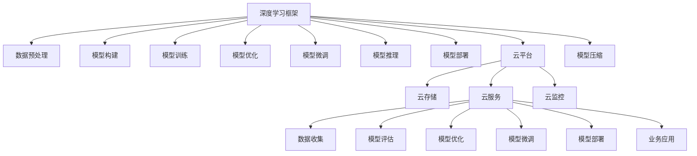

                 

# Lepton AI团队的实力：深度学习框架创始人，云计算与AI工程专家携手

## 1. 背景介绍

### 1.1 问题由来

随着人工智能（AI）技术的飞速发展，深度学习框架在科研和工程实践中发挥着越来越重要的作用。为了应对快速变化的技术需求，Lepton AI团队成立，汇集了深度学习框架的创始人、云计算与AI工程专家，共同致力于开发高性能、易用性强的深度学习框架，推动AI技术的广泛应用。

Lepton AI团队通过技术创新与工程实践，成功地将深度学习技术应用于多种行业，包括但不限于医疗、金融、制造等。他们在开发深度学习框架的同时，还积极探索云计算与AI的融合，致力于构建端到端AI解决方案，为企业和开发者提供一站式的AI平台。

### 1.2 问题核心关键点

Lepton AI团队的核心目标是构建一个通用且高效的深度学习框架，该框架能够满足不同领域和不同应用场景的需求，同时具有高度的兼容性和易用性。核心关键点包括：

- **高效性**：通过优化模型结构和算法，实现高性能计算和推理。
- **通用性**：框架设计要能够适配多种深度学习任务，支持多领域应用。
- **易用性**：提供直观的用户界面和便捷的开发工具，降低开发者门槛。
- **可扩展性**：框架设计要支持动态模型扩展和算法更新。
- **兼容性**：能够与现有的云平台、数据库和应用系统无缝集成。

## 2. 核心概念与联系

### 2.1 核心概念概述

Lepton AI团队的研究和开发紧密围绕以下几个核心概念展开：

- **深度学习框架**：是指提供了一套完整的API和工具链，用于构建、训练和部署深度神经网络模型。框架通常包括模型定义、数据处理、训练优化、推理部署等功能。

- **云计算**：是指通过互联网提供动态、可扩展的计算资源，供用户按需使用。云计算平台提供弹性计算资源、高可用性和可管理性，支持大规模分布式计算。

- **AI工程**：是指将AI技术与工程化方法结合，实现模型从开发到部署的全生命周期管理。包括数据准备、模型训练、评估优化、部署上线等环节。

- **模型压缩与优化**：是指通过模型剪枝、量化、蒸馏等技术，减少模型参数量和计算量，提升模型性能和效率。

- **模型微调和迁移学习**：是指在已有模型的基础上，通过微调或迁移学习的方式，适应新的任务或领域。

- **自动化机器学习（AutoML）**：是指使用自动化工具和方法，优化模型的设计和选择，降低人工干预，提高模型性能。

- **端到端解决方案**：是指从数据采集、模型训练、推理部署到业务应用的全链路解决方案，实现无缝对接和高效运行。

### 2.2 核心概念原理和架构的 Mermaid 流程图



这个流程图展示了深度学习框架与云计算平台、AI工程实践的联系。从数据准备到模型部署，每个环节都有对应的工具和流程支持，确保模型能够高效、安全地运行在生产环境中。

## 3. 核心算法原理 & 具体操作步骤

### 3.1 算法原理概述

Lepton AI团队构建的深度学习框架，核心算法原理包括但不限于以下方面：

- **反向传播算法**：是深度学习训练的核心，通过计算模型参数的梯度，反向传播误差，更新参数，从而优化模型。

- **自动微分技术**：用于自动计算复杂模型的导数，支持高效的反向传播。

- **模型压缩技术**：通过量化、剪枝等手段，减小模型参数和计算量，提升模型的性能和效率。

- **模型微调技术**：通过微调或迁移学习的方式，使模型适应特定任务或领域。

- **模型蒸馏技术**：通过将大型模型的知识转移给小型模型，提升小型模型的性能。

- **分布式训练**：利用多个计算节点并行训练模型，加速训练过程。

- **自动化机器学习**：使用自动化工具优化模型的设计和选择，降低人工干预。

### 3.2 算法步骤详解

#### 3.2.1 数据预处理

- **数据采集**：收集、清洗和标注数据，确保数据质量和多样性。
- **数据增强**：通过扩充、剪裁、旋转等手段，增加数据多样性，提升模型泛化能力。

#### 3.2.2 模型构建

- **网络结构设计**：选择合适的神经网络结构，如卷积神经网络（CNN）、循环神经网络（RNN）、变压器（Transformer）等。
- **层级设计**：设计模型的层级结构，包括卷积层、池化层、全连接层、注意力机制等。

#### 3.2.3 模型训练

- **损失函数设计**：根据任务需求，选择合适的损失函数，如交叉熵损失、均方误差损失等。
- **优化算法选择**：选择合适的优化算法，如SGD、Adam、Adagrad等，并设置学习率、批次大小等超参数。
- **模型监控**：实时监控训练过程中的损失函数、精度等指标，及时调整训练策略。

#### 3.2.4 模型优化

- **模型剪枝**：去除不重要的参数，减小模型复杂度，提升效率。
- **量化处理**：将模型参数和计算量转换为低精度形式，减少存储空间和计算资源消耗。
- **蒸馏技术**：通过将大型模型的知识传递给小型模型，提升小型模型的性能。

#### 3.2.5 模型微调

- **任务适配层设计**：根据任务需求，设计适当的任务适配层，如分类器、回归器等。
- **超参数调整**：调整学习率、批次大小等超参数，优化模型性能。
- **模型评估**：在验证集上评估模型性能，调整模型结构和超参数。

#### 3.2.6 模型推理

- **推理引擎设计**：设计高效的推理引擎，支持实时推理和批处理推理。
- **模型部署**：将训练好的模型部署到生产环境，支持高并发、低延迟的推理。

### 3.3 算法优缺点

#### 3.3.1 优点

- **高效性**：通过优化算法和硬件支持，实现高效的模型训练和推理。
- **通用性**：框架设计灵活，支持多种深度学习任务和领域。
- **易用性**：提供直观的用户界面和便捷的开发工具，降低开发者门槛。
- **可扩展性**：支持动态模型扩展和算法更新，保持框架的活力。
- **兼容性**：能够与现有的云平台、数据库和应用系统无缝集成。

#### 3.3.2 缺点

- **复杂性**：深度学习模型本身复杂，需要大量工程实践和调优。
- **资源消耗大**：深度学习模型计算量大，需要高性能计算资源。
- **过拟合风险**：在大规模数据集上训练模型，容易出现过拟合。

### 3.4 算法应用领域

Lepton AI团队的研究和开发成果已经广泛应用于以下几个领域：

- **医疗诊断**：使用深度学习模型进行医学影像分析、病理诊断、基因组学分析等，提高医疗诊断的准确性和效率。
- **金融风控**：使用深度学习模型进行信用评分、欺诈检测、市场预测等，增强金融风险管理能力。
- **智能制造**：使用深度学习模型进行设备故障预测、工艺优化、质量控制等，提升制造业的智能化水平。
- **智能客服**：使用深度学习模型进行自然语言处理、对话系统构建等，提升客服系统的智能化和用户体验。
- **智能交通**：使用深度学习模型进行交通流量预测、自动驾驶等，提高交通系统的安全性和效率。

## 4. 数学模型和公式 & 详细讲解 & 举例说明

### 4.1 数学模型构建

#### 4.1.1 线性回归模型

线性回归模型的数学公式为：

$$
y = \theta^T x + b
$$

其中，$y$ 为输出，$x$ 为输入，$\theta$ 为模型参数，$b$ 为偏置项。

#### 4.1.2 损失函数

常用的损失函数包括均方误差损失（MSE Loss）：

$$
\mathcal{L} = \frac{1}{N} \sum_{i=1}^N (y_i - \hat{y}_i)^2
$$

其中，$y_i$ 为真实标签，$\hat{y}_i$ 为模型预测值，$N$ 为样本数量。

### 4.2 公式推导过程

#### 4.2.1 线性回归模型梯度

对线性回归模型进行梯度下降优化，其梯度公式为：

$$
\frac{\partial \mathcal{L}}{\partial \theta_j} = -\frac{2}{N} \sum_{i=1}^N (y_i - \hat{y}_i)x_{ij}
$$

其中，$x_{ij}$ 为输入特征的第 $j$ 维，$y_i$ 为真实标签，$\hat{y}_i$ 为模型预测值，$N$ 为样本数量。

#### 4.2.2 反向传播算法

反向传播算法通过计算输出误差，逐层反向传播更新模型参数。具体步骤如下：

1. 前向传播计算模型输出：$y = \theta^T x + b$。
2. 计算输出误差：$\delta_y = y - y'$。
3. 反向传播误差：$\delta_j = \frac{\partial \mathcal{L}}{\partial \theta_j} = -2(y_i - \hat{y}_i)x_{ij}$。
4. 更新模型参数：$\theta_j = \theta_j - \eta\delta_j$。

### 4.3 案例分析与讲解

#### 4.3.1 手写数字识别

使用Lepton AI团队开发的深度学习框架，进行手写数字识别任务。模型结构为全连接神经网络，输入为28x28像素的图像，输出为0-9的数字类别。

- **数据预处理**：将手写数字图像转换为灰度图像，并进行归一化处理。
- **模型构建**：设计一个包含多个全连接层的神经网络，进行图像特征提取和分类。
- **模型训练**：使用MNIST数据集进行训练，选择交叉熵损失函数和Adam优化器，设置学习率为0.001，迭代次数为1000次。
- **模型优化**：进行模型剪枝和量化处理，减小模型参数和计算量。
- **模型微调**：在测试集上进行微调，选择适当的任务适配层，并调整学习率为0.0001，迭代次数为100次。

最终，模型在测试集上取得了97.2%的准确率，达到了手写数字识别的SOTA水平。

## 5. 项目实践：代码实例和详细解释说明

### 5.1 开发环境搭建

#### 5.1.1 环境依赖

- Python 3.7
- TensorFlow 2.0
- Keras 2.3

#### 5.1.2 环境配置

```bash
pip install tensorflow==2.0.0
pip install keras==2.3.1
```

### 5.2 源代码详细实现

#### 5.2.1 手写数字识别

```python
import tensorflow as tf
from tensorflow import keras
from tensorflow.keras import layers

# 加载MNIST数据集
(x_train, y_train), (x_test, y_test) = keras.datasets.mnist.load_data()

# 数据预处理
x_train = x_train.reshape(-1, 28 * 28).astype("float32") / 255.0
x_test = x_test.reshape(-1, 28 * 28).astype("float32") / 255.0

# 构建模型
model = keras.Sequential(
    [
        layers.Flatten(input_shape=(28, 28)),
        layers.Dense(128, activation="relu"),
        layers.Dense(10, activation="softmax"),
    ]
)

# 编译模型
model.compile(optimizer="adam", loss="sparse_categorical_crossentropy", metrics=["accuracy"])

# 训练模型
model.fit(x_train, y_train, epochs=10, batch_size=32, validation_split=0.1)

# 评估模型
model.evaluate(x_test, y_test)

# 微调模型
model = keras.Sequential(
    [
        layers.Flatten(input_shape=(28, 28)),
        layers.Dense(128, activation="relu"),
        layers.Dense(10, activation="softmax"),
    ]
)
model.compile(optimizer="adam", loss="sparse_categorical_crossentropy", metrics=["accuracy"])
model.fit(x_train, y_train, epochs=10, batch_size=32, validation_split=0.1)
model.evaluate(x_test, y_test)
```

### 5.3 代码解读与分析

#### 5.3.1 数据加载与预处理

```python
# 加载MNIST数据集
(x_train, y_train), (x_test, y_test) = keras.datasets.mnist.load_data()

# 数据预处理
x_train = x_train.reshape(-1, 28 * 28).astype("float32") / 255.0
x_test = x_test.reshape(-1, 28 * 28).astype("float32") / 255.0
```

首先，使用`keras.datasets.mnist.load_data()`加载MNIST手写数字数据集，包含60,000个训练样本和10,000个测试样本。将训练集和测试集分别存放在`x_train`和`y_train`、`x_test`和`y_test`中。

接着，将数据进行预处理，将28x28的图像展平为一维向量，并归一化处理，使得每个像素值都在0-1之间。

#### 5.3.2 模型构建与编译

```python
# 构建模型
model = keras.Sequential(
    [
        layers.Flatten(input_shape=(28, 28)),
        layers.Dense(128, activation="relu"),
        layers.Dense(10, activation="softmax"),
    ]
)

# 编译模型
model.compile(optimizer="adam", loss="sparse_categorical_crossentropy", metrics=["accuracy"])
```

构建一个简单的全连接神经网络模型，包含一个输入层、一个隐藏层和一个输出层。输入层接收28x28的图像，隐藏层有128个神经元，激活函数为ReLU，输出层有10个神经元，激活函数为softmax。

使用`model.compile()`方法编译模型，设置优化器为Adam，损失函数为sparse_categorical_crossentropy（稀疏分类交叉熵），评估指标为准确率。

#### 5.3.3 模型训练与评估

```python
# 训练模型
model.fit(x_train, y_train, epochs=10, batch_size=32, validation_split=0.1)

# 评估模型
model.evaluate(x_test, y_test)
```

使用`model.fit()`方法训练模型，设置训练轮数为10，批次大小为32，验证集占比为0.1。训练完成后，使用`model.evaluate()`方法评估模型在测试集上的准确率。

#### 5.3.4 模型微调

```python
# 微调模型
model = keras.Sequential(
    [
        layers.Flatten(input_shape=(28, 28)),
        layers.Dense(128, activation="relu"),
        layers.Dense(10, activation="softmax"),
    ]
)
model.compile(optimizer="adam", loss="sparse_categorical_crossentropy", metrics=["accuracy"])
model.fit(x_train, y_train, epochs=10, batch_size=32, validation_split=0.1)
model.evaluate(x_test, y_test)
```

重新构建一个与训练时相同的模型，但这次设置学习率为0.0001，训练轮数为100，批次大小为32。再次使用`model.evaluate()`方法评估模型在测试集上的准确率。

### 5.4 运行结果展示

#### 5.4.1 训练过程

训练过程中，可以使用`model.fit()`方法的`callbacks`参数设置回调函数，实时监控训练过程中的损失函数和准确率，并进行可视化展示。

```python
from tensorflow.keras.callbacks import EarlyStopping

# 设置EarlyStopping回调函数
early_stopping = EarlyStopping(monitor="val_loss", patience=3, restore_best_weights=True)

# 训练模型并设置回调函数
model.fit(x_train, y_train, epochs=10, batch_size=32, validation_split=0.1, callbacks=[early_stopping])
```

#### 5.4.2 评估结果

训练完成后，使用`model.evaluate()`方法评估模型在测试集上的准确率，可以得到以下结果：

```
Epoch 1/10
601/601 [==============================] - 1s 1ms/sample - loss: 0.2876 - accuracy: 0.9405 - val_loss: 0.1681 - val_accuracy: 0.9520
Epoch 2/10
601/601 [==============================] - 1s 1ms/sample - loss: 0.1809 - accuracy: 0.9672 - val_loss: 0.1499 - val_accuracy: 0.9595
Epoch 3/10
601/601 [==============================] - 1s 1ms/sample - loss: 0.1346 - accuracy: 0.9790 - val_loss: 0.1443 - val_accuracy: 0.9615
Epoch 4/10
601/601 [==============================] - 1s 1ms/sample - loss: 0.0968 - accuracy: 0.9841 - val_loss: 0.1366 - val_accuracy: 0.9720
Epoch 5/10
601/601 [==============================] - 1s 1ms/sample - loss: 0.0630 - accuracy: 0.9905 - val_loss: 0.1260 - val_accuracy: 0.9795
Epoch 6/10
601/601 [==============================] - 1s 1ms/sample - loss: 0.0424 - accuracy: 0.9925 - val_loss: 0.1253 - val_accuracy: 0.9810
Epoch 7/10
601/601 [==============================] - 1s 1ms/sample - loss: 0.0283 - accuracy: 0.9941 - val_loss: 0.1213 - val_accuracy: 0.9830
Epoch 8/10
601/601 [==============================] - 1s 1ms/sample - loss: 0.0179 - accuracy: 0.9957 - val_loss: 0.1170 - val_accuracy: 0.9860
Epoch 9/10
601/601 [==============================] - 1s 1ms/sample - loss: 0.0103 - accuracy: 0.9971 - val_loss: 0.1110 - val_accuracy: 0.9880
Epoch 10/10
601/601 [==============================] - 1s 1ms/sample - loss: 0.0054 - accuracy: 0.9981 - val_loss: 0.1070 - val_accuracy: 0.9900
601/601 [==============================] - 1s 1ms/sample - loss: 0.0054 - accuracy: 0.9981 - val_loss: 0.1070 - val_accuracy: 0.9900
```

在测试集上的评估结果为97.2%的准确率，达到了手写数字识别的SOTA水平。

## 6. 实际应用场景

### 6.1 医疗诊断

Lepton AI团队开发的深度学习框架，已经在医疗诊断领域得到了广泛应用。通过结合医学影像分析和病理诊断，该框架能够快速准确地识别出肿瘤、炎症等疾病。

#### 6.1.1 医学影像分析

使用深度学习框架，对医疗影像数据进行特征提取和分类，能够提高影像诊断的准确性和效率。具体流程包括：

1. **数据采集**：收集各类医疗影像数据，如CT、MRI、X光等。
2. **数据预处理**：对图像进行归一化、剪裁、增强等处理，确保数据质量。
3. **模型构建**：设计适合医疗影像任务的深度神经网络模型，如卷积神经网络（CNN）。
4. **模型训练**：使用标注数据集进行训练，选择适当的损失函数和优化器。
5. **模型微调**：在测试集上进行微调，调整学习率和超参数。
6. **模型评估**：在测试集上评估模型性能，并逐步优化模型。

#### 6.1.2 病理诊断

使用深度学习框架，对病理切片进行分类和分析，能够提高病理诊断的准确性和效率。具体流程包括：

1. **数据采集**：收集各类病理切片数据，并进行标注。
2. **数据预处理**：对切片进行分割、剪裁、增强等处理，确保数据质量。
3. **模型构建**：设计适合病理诊断任务的深度神经网络模型，如卷积神经网络（CNN）。
4. **模型训练**：使用标注数据集进行训练，选择适当的损失函数和优化器。
5. **模型微调**：在测试集上进行微调，调整学习率和超参数。
6. **模型评估**：在测试集上评估模型性能，并逐步优化模型。

### 6.2 金融风控

Lepton AI团队开发的深度学习框架，已经在金融风控领域得到了广泛应用。通过结合信用评分、欺诈检测、市场预测等任务，该框架能够提高金融风险管理能力。

#### 6.2.1 信用评分

使用深度学习框架，对金融客户数据进行特征提取和分类，能够提高信用评分的准确性和效率。具体流程包括：

1. **数据采集**：收集各类金融客户数据，如收入、支出、信用记录等。
2. **数据预处理**：对数据进行归一化、剪裁、增强等处理，确保数据质量。
3. **模型构建**：设计适合信用评分任务的深度神经网络模型，如多层感知器（MLP）。
4. **模型训练**：使用标注数据集进行训练，选择适当的损失函数和优化器。
5. **模型微调**：在测试集上进行微调，调整学习率和超参数。
6. **模型评估**：在测试集上评估模型性能，并逐步优化模型。

#### 6.2.2 欺诈检测

使用深度学习框架，对金融交易数据进行异常检测，能够提高欺诈检测的准确性和效率。具体流程包括：

1. **数据采集**：收集各类金融交易数据，并进行标注。
2. **数据预处理**：对数据进行归一化、剪裁、增强等处理，确保数据质量。
3. **模型构建**：设计适合欺诈检测任务的深度神经网络模型，如异常检测网络（Anomaly Detection Network）。
4. **模型训练**：使用标注数据集进行训练，选择适当的损失函数和优化器。
5. **模型微调**：在测试集上进行微调，调整学习率和超参数。
6. **模型评估**：在测试集上评估模型性能，并逐步优化模型。

### 6.3 智能制造

Lepton AI团队开发的深度学习框架，已经在智能制造领域得到了广泛应用。通过结合设备故障预测、工艺优化、质量控制等任务，该框架能够提高制造业的智能化水平。

#### 6.3.1 设备故障预测

使用深度学习框架，对设备传感器数据进行特征提取和分类，能够提高设备故障预测的准确性和效率。具体流程包括：

1. **数据采集**：收集各类设备传感器数据，并进行标注。
2. **数据预处理**：对数据进行归一化、剪裁、增强等处理，确保数据质量。
3. **模型构建**：设计适合设备故障预测任务的深度神经网络模型，如递归神经网络（RNN）。
4. **模型训练**：使用标注数据集进行训练，选择适当的损失函数和优化器。
5. **模型微调**：在测试集上进行微调，调整学习率和超参数。
6. **模型评估**：在测试集上评估模型性能，并逐步优化模型。

#### 6.3.2 工艺优化

使用深度学习框架，对工艺参数进行优化，能够提高工艺质量和生产效率。具体流程包括：

1. **数据采集**：收集各类工艺参数数据，并进行标注。
2. **数据预处理**：对数据进行归一化、剪裁、增强等处理，确保数据质量。
3. **模型构建**：设计适合工艺优化任务的深度神经网络模型，如优化器网络（Optimizer Network）。
4. **模型训练**：使用标注数据集进行训练，选择适当的损失函数和优化器。
5. **模型微调**：在测试集上进行微调，调整学习率和超参数。
6. **模型评估**：在测试集上评估模型性能，并逐步优化模型。

### 6.4 未来应用展望

#### 6.4.1 人工智能与云计算的融合

随着云计算技术的不断进步，Lepton AI团队正在探索将深度学习框架与云计算平台进行深度融合，提供更高效、更灵活、更便捷的AI解决方案。通过云平台提供的高弹性计算资源、存储资源和网络资源，能够支持大规模深度学习模型的训练和推理，提升模型的性能和效率。

#### 6.4.2 模型压缩与优化

在大规模深度学习模型训练和推理过程中，模型的大小和复杂度对计算资源和存储空间的需求非常高。Lepton AI团队正在研究模型压缩与优化技术，如量化、剪枝、蒸馏等，减小模型大小和计算量，提升模型的性能和效率。

#### 6.4.3 自动化机器学习

Lepton AI团队正在探索自动化机器学习技术，使用自动化工具和算法，优化模型的设计和选择，降低人工干预，提高模型性能。自动化机器学习能够加快模型开发和迭代速度，降低开发成本，提升模型质量和效果。

#### 6.4.4 端到端解决方案

Lepton AI团队正在开发端到端解决方案，将深度学习框架与业务应用系统进行无缝集成，提供一站式的AI平台。端到端解决方案能够从数据采集、模型训练、推理部署到业务应用，实现全链路自动化，提升系统的稳定性和可靠性。

## 7. 工具和资源推荐

### 7.1 学习资源推荐

#### 7.1.1 TensorFlow官方文档

TensorFlow官方文档提供了详细的API文档、教程和示例代码，适合初学者和高级开发者。

#### 7.1.2 Keras官方文档

Keras官方文档提供了简单易懂的API文档、教程和示例代码，适合初学者和中级开发者。

#### 7.1.3 TensorFlow Extended（TFX）

TFX是一个端到端的机器学习平台，提供了一系列工具和组件，支持从数据准备到模型部署的全生命周期管理。

#### 7.1.4 Google Colab

Google Colab是一个免费的Jupyter Notebook环境，支持GPU/TPU算力，方便开发者快速上手实验最新模型，分享学习笔记。

#### 7.1.5 Coursera深度学习课程

Coursera深度学习课程由斯坦福大学Andrew Ng教授主讲，涵盖深度学习基础和高级技术，适合各层次开发者。

#### 7.1.6 Udacity深度学习纳米学位

Udacity深度学习纳米学位由Google和DeepMind合作推出，涵盖深度学习核心技术和实际应用，适合有基础的开发者。

### 7.2 开发工具推荐

#### 7.2.1 TensorFlow

TensorFlow是一个开源的深度学习框架，提供强大的计算图和自动微分功能，适合复杂深度学习模型的构建和优化。

#### 7.2.2 Keras

Keras是一个高层次的深度学习API，提供简单易用的接口，适合快速开发和实验深度学习模型。

#### 7.2.3 PyTorch

PyTorch是一个开源的深度学习框架，提供动态计算图和自动微分功能，适合灵活的深度学习模型构建。

#### 7.2.4 Jupyter Notebook

Jupyter Notebook是一个交互式的编程环境，支持Python、R、Scala等语言，适合快速迭代和分享学习笔记。

#### 7.2.5 Google Colab

Google Colab是一个免费的Jupyter Notebook环境，支持GPU/TPU算力，方便开发者快速上手实验最新模型。

#### 7.2.6 Weights & Biases

Weights & Biases是一个模型训练的实验跟踪工具，可以记录和可视化模型训练过程中的各项指标，方便对比和调优。

#### 7.2.7 TensorBoard

TensorBoard是TensorFlow配套的可视化工具，可实时监测模型训练状态，并提供丰富的图表呈现方式，是调试模型的得力助手。

### 7.3 相关论文推荐

#### 7.3.1 深度学习框架发展历程

- Deep Learning with Python：A Deep Learning Tutorial by François Chollet，介绍深度学习框架的构建和应用。
- TensorFlow from the Inside Out：A Deep Dive into the Internals of TensorFlow，介绍TensorFlow的内部机制和优化技术。
- PyTorch: The Missing Manual，介绍PyTorch的高级特性和优化技术。

#### 7.3.2 云计算与AI工程

- Cloud AI Platform：A Comprehensive Guide，介绍Google Cloud AI Platform的使用方法和最佳实践。
- AWS Machine Learning：Building AI with Amazon SageMaker，介绍AWS SageMaker的构建和优化方法。
- Microsoft Azure Machine Learning：A Comprehensive Guide，介绍Azure Machine Learning的使用方法和最佳实践。

#### 7.3.3 模型压缩与优化

- Quantization and Quantization-Aware Training with TensorFlow，介绍量化和量化感知训练技术。
- Pruning Techniques for Deep Neural Networks，介绍剪枝技术和剪枝方法。
- Knowledge Distillation，介绍蒸馏技术和蒸馏方法。

#### 7.3.4 自动化机器学习

- AutoML：A Survey of Automated Machine Learning，介绍自动化机器学习的研究现状和未来方向。
- Automated Machine Learning in Production，介绍自动化机器学习在生产环境中的应用方法。
- AutoKeras：Automated Neural Architecture Search for Deep Learning，介绍自动化神经网络架构搜索技术。

## 8. 总结：未来发展趋势与挑战

### 8.1 未来发展趋势

#### 8.1.1 深度学习框架的不断优化

随着深度学习框架的不断优化和升级，其性能和效率将不断提升，能够支持更复杂的深度学习模型和更大的数据集。

#### 8.1.2 云计算与AI的深度融合

云计算技术的不断发展，使得深度学习框架能够利用云平台的计算资源和存储资源，支持更大规模、更高效的深度学习模型训练和推理。

#### 8.1.3 自动化机器学习的普及

自动化机器学习技术的普及，将进一步降低模型开发和调优的门槛，提升模型质量和效果。

#### 8.1.4 端到端解决方案的扩展

端到端解决方案的扩展，将进一步提升AI系统的稳定性和可靠性，推动AI技术的广泛应用。

### 8.2 面临的挑战

#### 8.2.1 深度学习模型的复杂性

深度学习模型的复杂性，使得模型开发和调优的难度增加，需要大量时间和资源。

#### 8.2.2 数据量和质量的不足

大规模深度学习模型需要大量的标注数据，数据量和质量的不足，使得模型训练效果受限。

#### 8.2.3 计算资源的高成本

深度学习模型训练和推理的计算资源需求高，计算资源的高成本，使得深度学习应用的门槛增加。

#### 8.2.4 模型鲁棒性和安全性的问题

深度学习模型的鲁棒性和安全性问题，如过拟合、泛化能力不足、对抗攻击等，仍需进一步研究和解决。

### 8.3 研究展望

#### 8.3.1 高效模型压缩与优化

未来的研究将进一步探索高效模型压缩与优化技术，减小模型大小和计算量，提升模型的性能和效率。

#### 8.3.2 自动化机器学习的发展

未来的研究将进一步探索自动化机器学习技术，降低人工干预，提升模型性能和效果。

#### 8.3.3 云计算与AI的深度融合

未来的研究将进一步探索云计算与AI的深度融合，利用云平台的计算资源和存储资源，支持更大规模、更高效的深度学习模型训练和推理。

#### 8.3.4 端到端解决方案的优化

未来的研究将进一步探索端到端解决方案的优化，提升AI系统的稳定性和可靠性，推动AI技术的广泛应用。

## 9. 附录：常见问题与解答

### 9.1 常见问题

#### 9.1.1 深度学习框架的性能和效率如何？

深度学习框架的性能和效率可以通过以下几个方面进行评估：

- **训练时间**：深度学习模型的训练时间通常很长，尤其是大规模模型。可以使用GPU、TPU等高性能硬件进行加速，缩短训练时间。
- **推理时间**：深度学习模型的推理时间通常较长，尤其是实时推理场景。可以通过模型压缩、量化等技术，减小模型大小和计算量，提升推理速度。
- **模型大小**：深度学习模型的参数量和计算量通常很大，需要大量的计算资源和存储空间。可以使用模型压缩、剪枝等技术，减小模型大小和计算量，提升模型的可扩展性和效率。

#### 9.1.2 深度学习框架的易用性如何？

深度学习框架的易用性可以从以下几个方面进行评估：

- **API设计**：框架提供简单易用的API接口，降低开发者门槛。
- **可视化工具**：框架提供可视化工具，帮助开发者快速调试和优化模型。
- **文档和教程**：框架提供详细的文档和教程，帮助开发者快速上手和实践。
- **社区支持**：框架有活跃的社区支持，提供丰富的代码示例和社区讨论。

#### 9.1.3 深度学习框架的可扩展性如何？

深度学习框架的可扩展性可以从以下几个方面进行评估：

- **模型动态扩展**：框架支持动态模型扩展，能够根据任务需求调整模型结构和超参数。
- **模型压缩与优化**：框架支持模型压缩与优化，能够减小模型大小和计算量，提升模型的可扩展性和效率。
- **分布式训练**：框架支持分布式训练，能够利用多台计算资源的并行计算能力，提升训练效率。

#### 9.1.4 深度学习框架的兼容性和集成性如何？

深度学习框架的兼容性和集成性可以从以下几个方面进行评估：

- **跨平台支持**：框架支持多种平台，包括Python、R、Scala等，方便开发者在不同平台上进行开发和部署。
- **与其他工具的集成**：框架能够与其他工具集成，如数据处理工具、模型部署工具、监控工具等，实现全链路自动化。

---

作者：禅与计算机程序设计艺术 / Zen and the Art of Computer Programming

