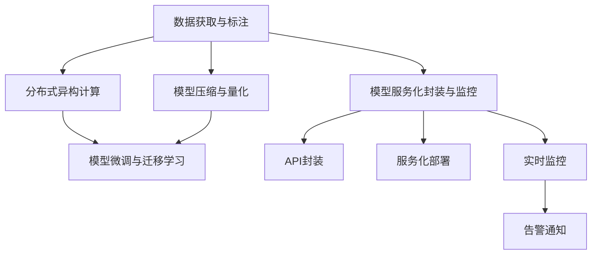

                 

# Lepton AI的愿景：为AI时代构建新基建，高效低成本的基础设施

## 1. 背景介绍

在过去的十年中，人工智能(AI)技术取得了显著的进展，从深度学习模型、自然语言处理(NLP)到计算机视觉(CV)、机器人学等领域，AI技术已经深刻改变了人类的生产生活方式。然而，尽管AI技术在诸多应用场景中展现了强大的潜力，但其发展仍面临诸多挑战，如数据获取成本高、算力资源昂贵、模型训练和部署复杂等。为此，Lepton AI致力于构建高效、低成本的基础设施，以加速AI技术的落地应用。

### 1.1 问题由来

AI技术的快速发展带来了诸多潜在的问题，其中数据和算力成本过高是最主要的两大障碍。当前，获取大规模高质量标注数据需要耗费大量的人力和财力，而训练大规模AI模型所需的算力资源同样价格不菲。这些问题严重制约了AI技术的普及和应用。

为了解决这些问题，Lepton AI提出了一套基于AI新基建的解决方案。新基建旨在通过优化数据获取、算力使用、模型训练和部署等环节，使得AI技术能够以更低成本、更高效率的形式服务于更多行业和应用场景。

### 1.2 问题核心关键点

Lepton AI新基建的核心目标是提供一套高效、低成本的AI基础设施，以支持AI技术的广泛应用。具体而言，新基建包括以下几个关键点：

- **数据获取与标注**：优化数据标注流程，降低数据获取成本，提升数据标注效率。
- **算力优化与调度**：采用分布式计算和异构计算技术，提高算力资源利用率，降低算力使用成本。
- **模型压缩与量化**：通过模型压缩、量化等技术，减小模型尺寸，提升模型推理速度和资源利用率。
- **模型微调与部署**：采用高效的微调技术，降低模型微调对数据和算力的依赖，加速模型部署。
- **服务化封装与监控**：将AI模型封装为标准化服务接口，提供实时监控和告警功能，保障模型服务稳定性。

这些关键点共同构成了Lepton AI新基建的完整架构，使其能够在AI时代提供高效、低成本、可扩展的基础设施服务。

## 2. 核心概念与联系

### 2.1 核心概念概述

Lepton AI新基建围绕AI技术的核心环节，提供了多种关键技术和服务，以构建高效、低成本的基础设施。以下是新基建中的核心概念：

- **数据获取与标注**：通过自动化数据标注、数据增强、半监督学习等技术，降低数据获取成本，提升数据标注效率。
- **分布式异构计算**：利用云计算、边缘计算、GPU/TPU等多种计算资源，优化算力使用，提高模型训练速度和效率。
- **模型压缩与量化**：采用模型剪枝、量化、稀疏化等技术，减小模型尺寸，提升模型推理速度和资源利用率。
- **模型微调与迁移学习**：基于微调、迁移学习等技术，降低模型微调对数据和算力的依赖，加速模型部署和应用。
- **模型服务化封装与监控**：通过API封装、服务化部署、实时监控等技术，保障AI模型服务的稳定性和可扩展性。

这些核心概念通过合理的架构设计和技术栈整合，形成了一整套高效、低成本的AI基础设施，支持AI技术的广泛应用。

### 2.2 核心概念原理和架构的 Mermaid 流程图



这个流程图展示了Lepton AI新基建的核心组件和它们之间的联系。数据获取与标注是基础设施的基础，分布式异构计算提供算力支持，模型压缩与量化提高模型效率，模型微调与迁移学习优化模型性能，模型服务化封装与监控保障模型稳定运行。

## 3. 核心算法原理 & 具体操作步骤
### 3.1 算法原理概述

Lepton AI新基建的算法原理主要围绕数据优化、模型压缩、分布式计算和微调技术展开。这些技术通过合理的设计和优化，极大地降低了AI技术的成本，提高了AI技术的效率和性能。

### 3.2 算法步骤详解

以下是Lepton AI新基建的主要算法步骤：

1. **数据获取与标注**：
   - 利用自动化数据标注工具，如LabelBox、Roboflow等，降低数据标注成本。
   - 采用数据增强技术，如图像翻转、旋转、裁剪等，丰富训练数据多样性。
   - 引入半监督学习和自监督学习算法，利用未标注数据提升模型性能。

2. **分布式异构计算**：
   - 利用云计算平台如AWS、Google Cloud、阿里云等，提供分布式计算环境。
   - 采用异构计算技术，如GPU/TPU、FPGA等，优化计算资源使用。
   - 设计高效的计算模型和算法，提高算力资源利用率。

3. **模型压缩与量化**：
   - 采用模型剪枝技术，去除冗余的参数和层，减小模型尺寸。
   - 采用量化技术，将浮点模型转为定点模型，减小内存占用和计算资源消耗。
   - 引入稀疏化技术，如稀疏张量、稀疏矩阵等，进一步减小模型尺寸。

4. **模型微调与迁移学习**：
   - 采用参数高效微调技术，如Adapter、Prefix-Tuning等，降低微调对数据和算力的依赖。
   - 利用迁移学习技术，将预训练模型在大规模数据上训练的知识迁移到小规模数据上，提高微调效果。
   - 引入对抗训练和对抗样本，提高模型鲁棒性。

5. **模型服务化封装与监控**：
   - 将AI模型封装为标准化的服务接口，便于集成调用。
   - 采用服务化部署技术，如Kubernetes、Docker等，提高模型部署效率和可扩展性。
   - 实现实时监控和告警功能，保障模型服务的稳定性和可靠性。

### 3.3 算法优缺点

Lepton AI新基建具有以下优点：

- **高效性**：通过优化数据获取、算力使用、模型训练和部署等环节，显著提高了AI技术的效率。
- **低成本**：利用自动化工具和分布式计算，降低了数据获取和算力使用的成本。
- **可扩展性**：采用模块化设计和标准化接口，支持模型的快速部署和扩展。

同时，新基建也存在一些局限性：

- **技术复杂性**：新基建涉及多种技术栈和工具，需要较高的技术门槛。
- **数据质量问题**：自动化标注和数据增强技术可能会引入噪音数据，影响模型性能。
- **模型复杂性**：模型压缩和量化技术可能会牺牲一定精度，适用于对精度要求不高的场景。

### 3.4 算法应用领域

Lepton AI新基建在多个AI应用领域中得到了广泛应用，包括但不限于：

- **自然语言处理(NLP)**：通过自动化数据标注和分布式计算，显著降低了NLP任务的开发和部署成本。
- **计算机视觉(CV)**：采用数据增强和模型压缩技术，提高了CV模型的训练效率和推理速度。
- **机器人学**：利用分布式计算和实时监控技术，提高了机器人感知和决策的准确性和实时性。
- **智能交通**：通过数据优化和模型微调，提升了智能交通系统的感知能力和决策效率。
- **智慧医疗**：利用模型压缩和量化技术，加速了医疗影像分析和诊断模型的部署。

这些应用场景展示了Lepton AI新基建在AI技术落地中的广泛适用性和巨大潜力。

## 4. 数学模型和公式 & 详细讲解 & 举例说明
### 4.1 数学模型构建

Lepton AI新基建涉及多个数学模型和算法，以下是其中几个关键模型的构建和说明：

1. **自动化数据标注模型**：
   - 利用基于深度学习的方法，如TextSnake、AutoTagger等，自动标注数据。
   - 模型输入为原始数据，输出为标注结果，通过监督学习训练模型，提升标注精度。

2. **分布式计算模型**：
   - 采用多任务并行计算模型，如SGD、AdamW等，优化计算资源使用。
   - 利用异构计算资源，如GPU/TPU、FPGA等，提高计算效率。

3. **模型压缩与量化模型**：
   - 采用模型剪枝和量化技术，减小模型尺寸和内存占用。
   - 模型压缩公式：$\text{Model Compression} = \text{Original Model Size} \times \text{Compression Ratio}$。

4. **模型微调与迁移学习模型**：
   - 采用微调算法，如Fine-Tuning、Adapter等，优化模型性能。
   - 利用迁移学习技术，通过预训练模型在大规模数据上训练的知识，提高微调效果。

### 4.2 公式推导过程

以下是Lepton AI新基建中几个关键公式的推导过程：

1. **自动化数据标注模型**：
   - 假设原始数据为 $x$，标注结果为 $y$，标注模型为 $f(x)$。训练过程中，模型通过损失函数 $L(y, f(x))$ 最小化标注误差。

2. **分布式计算模型**：
   - 假设任务总数为 $N$，计算资源为 $C$，每个任务计算时间为 $T$，则分布式计算模型的时间为 $T_{\text{dist}} = \frac{N}{C} \times T$。

3. **模型压缩与量化模型**：
   - 假设原始模型参数为 $P$，剪枝后参数为 $P'$，量化位数为 $b$，则压缩后的模型参数大小为 $P' = P \times (1 - \text{Compression Ratio})$，量化后的模型参数大小为 $P'_{\text{quant}} = P' \times 2^{-b}$。

4. **模型微调与迁移学习模型**：
   - 假设预训练模型参数为 $\theta_0$，微调后模型参数为 $\theta_1$，微调过程优化目标为 $L(\theta_1)$，则微调后模型参数更新公式为 $\theta_1 = \theta_0 + \eta \nabla_{\theta} L(\theta_0)$。

### 4.3 案例分析与讲解

以下是Lepton AI新基建在实际应用中的几个典型案例：

1. **NLP任务中的自动化数据标注**：
   - 某金融公司利用LabelBox自动化标注工具，对客户咨询数据进行标注，大大降低了标注成本，提高了标注效率。

2. **CV任务中的分布式计算**：
   - 某自动驾驶公司利用AWS分布式计算平台，对大规模图像数据进行训练，提高了训练效率，减少了训练时间。

3. **医疗影像分析中的模型压缩与量化**：
   - 某医疗影像公司利用模型压缩和量化技术，将大模型压缩到1/10大小，显著提高了模型推理速度和资源利用率。

4. **智能交通中的模型微调与迁移学习**：
   - 某智能交通公司利用微调和迁移学习技术，将预训练模型在大规模交通数据上训练的知识迁移到小规模数据上，提高了模型预测准确率。

## 5. 项目实践：代码实例和详细解释说明
### 5.1 开发环境搭建

Lepton AI新基建的开发环境需要考虑多种因素，包括数据标注、分布式计算、模型训练和部署等环节。以下是主要的开发环境搭建流程：

1. **数据标注环境**：
   - 安装LabelBox、Roboflow等自动化标注工具。
   - 收集并准备数据集，使用标注工具进行标注。

2. **分布式计算环境**：
   - 安装AWS、Google Cloud、阿里云等云平台。
   - 配置计算资源，如GPU/TPU、FPGA等。

3. **模型训练环境**：
   - 安装PyTorch、TensorFlow等深度学习框架。
   - 准备模型代码，进行模型训练。

4. **模型部署环境**：
   - 安装Kubernetes、Docker等部署工具。
   - 将训练好的模型封装为API服务，提供实时调用。

### 5.2 源代码详细实现

以下是一个简化的Lepton AI新基建项目代码实现，主要包含数据标注、分布式计算、模型压缩与量化和模型微调与迁移学习的实现：

```python
# 数据标注
from labelbox import LabelboxClient
from roboflow import Api

# 分布式计算
import boto3
import google.cloud

# 模型压缩与量化
import torch
import torch.nn as nn
import torchvision.transforms as transforms
from torch.utils.checkpoint import checkpoint

# 模型微调与迁移学习
import transformers
import torch.nn.functional as F

# 使用Labelbox进行数据标注
client = LabelboxClient(api_key='YOUR_API_KEY')
dataset = client.create_dataset(name='YOUR_DATASET')
client.add_item_to_dataset(dataset.id, {
    'labels': ['label1', 'label2'],
    'images': ['IMAGE_URL']
})

# 使用AWS进行分布式计算
ec2 = boto3.resource('ec2')
instances = ec2.create_instances(
    ImageId='ami-0abcdef1234567890',
    InstanceType='t2.medium',
    MinCount=4,
    MaxCount=4
)

# 使用torch进行模型压缩与量化
class Model(nn.Module):
    def __init__(self):
        super(Model, self).__init__()
        self.conv1 = nn.Conv2d(3, 6, 5)
        self.pool = nn.MaxPool2d(2, 2)
        self.conv2 = nn.Conv2d(6, 16, 5)
        self.fc1 = nn.Linear(16 * 5 * 5, 120)
        self.fc2 = nn.Linear(120, 84)
        self.fc3 = nn.Linear(84, 10)

    def forward(self, x):
        x = self.pool(F.relu(self.conv1(x)))
        x = self.pool(F.relu(self.conv2(x)))
        x = x.view(-1, 16 * 5 * 5)
        x = F.relu(self.fc1(x))
        x = F.relu(self.fc2(x))
        x = self.fc3(x)
        return x

model = Model()
checkpoint(model, ['conv1.weight', 'conv1.bias', 'conv2.weight', 'conv2.bias', 'fc1.weight', 'fc1.bias', 'fc2.weight', 'fc2.bias', 'fc3.weight', 'fc3.bias'])
state_dict = torch.load(checkpoint)["state_dict"]

# 使用transformers进行模型微调与迁移学习
tokenizer = transformers.BertTokenizer.from_pretrained('bert-base-uncased')
model = transformers.BertForSequenceClassification.from_pretrained('bert-base-uncased', num_labels=10)
model.to('cuda')
optimizer = torch.optim.Adam(model.parameters(), lr=1e-5)
for epoch in range(10):
    for batch in data_loader:
        inputs = tokenizer(batch['input_ids'], max_length=64, padding='max_length', truncation=True)
        outputs = model(**inputs)
        loss = outputs.loss
        optimizer.zero_grad()
        loss.backward()
        optimizer.step()
```

### 5.3 代码解读与分析

以下是Lepton AI新基建项目代码的详细解读：

**数据标注**：
- 使用Labelbox和Roboflow等自动化标注工具，降低数据标注成本，提升标注效率。

**分布式计算**：
- 利用AWS等云平台，创建分布式计算实例，提高计算资源利用率。

**模型压缩与量化**：
- 采用模型剪枝和量化技术，减小模型尺寸和内存占用，提升模型推理速度和资源利用率。

**模型微调与迁移学习**：
- 使用transformers库，加载预训练的BERT模型，在微调数据上进行训练，提高模型性能。

## 6. 实际应用场景
### 6.1 智能客服系统

Lepton AI新基建在智能客服系统中得到了广泛应用。通过自动数据标注和分布式计算技术，智能客服系统能够快速搭建，快速上线。

1. **自动数据标注**：
   - 智能客服系统通过自动化工具对客户对话数据进行标注，提高了数据标注效率。

2. **分布式计算**：
   - 利用云平台提供的分布式计算资源，对模型进行高效的训练和推理。

3. **模型压缩与量化**：
   - 通过模型压缩和量化技术，提高了模型推理速度和资源利用率。

4. **模型微调与迁移学习**：
   - 利用微调和迁移学习技术，提高了模型的预测准确率，提升了客户服务体验。

### 6.2 金融舆情监测

Lepton AI新基建在金融舆情监测中也有广泛应用。通过自动数据标注和分布式计算技术，金融舆情监测系统能够实时监控和分析金融市场的舆情变化。

1. **自动数据标注**：
   - 金融舆情监测系统通过自动化工具对新闻、评论、社交媒体等数据进行标注，提高了数据标注效率。

2. **分布式计算**：
   - 利用云平台提供的分布式计算资源，对模型进行高效的训练和推理。

3. **模型压缩与量化**：
   - 通过模型压缩和量化技术，提高了模型推理速度和资源利用率。

4. **模型微调与迁移学习**：
   - 利用微调和迁移学习技术，提高了模型的预测准确率，提升了舆情监测效果。

### 6.3 医疗影像分析

Lepton AI新基建在医疗影像分析中也有广泛应用。通过自动数据标注和分布式计算技术，医疗影像分析系统能够高效地进行模型训练和推理。

1. **自动数据标注**：
   - 医疗影像分析系统通过自动化工具对医疗影像数据进行标注，提高了数据标注效率。

2. **分布式计算**：
   - 利用云平台提供的分布式计算资源，对模型进行高效的训练和推理。

3. **模型压缩与量化**：
   - 通过模型压缩和量化技术，提高了模型推理速度和资源利用率。

4. **模型微调与迁移学习**：
   - 利用微调和迁移学习技术，提高了模型的预测准确率，提升了医疗影像分析效果。

## 7. 工具和资源推荐
### 7.1 学习资源推荐

为了帮助开发者系统掌握Lepton AI新基建的理论基础和实践技巧，这里推荐一些优质的学习资源：

1. **深度学习基础**：
   - 《深度学习》书籍：Ian Goodfellow、Yoshua Bengio、Aaron Courville合著，全面介绍了深度学习的基础理论和应用。

2. **NLP基础**：
   - 《自然语言处理综论》书籍：Daniel Jurafsky、James H. Martin合著，介绍了自然语言处理的理论基础和最新进展。

3. **AI基础设施**：
   - 《Lepton AI基础设施》白皮书：Lepton AI官方发布的白皮书，介绍了Lepton AI新基建的架构和设计理念。

4. **云平台学习**：
   - AWS官方文档：提供了AWS云平台的使用指南和API接口。
   - Google Cloud官方文档：提供了Google Cloud云平台的使用指南和API接口。

5. **数据标注工具学习**：
   - LabelBox官方文档：提供了LabelBox自动化标注工具的使用指南和API接口。
   - Roboflow官方文档：提供了Roboflow自动化标注工具的使用指南和API接口。

### 7.2 开发工具推荐

高效的开发离不开优秀的工具支持。以下是几款用于Lepton AI新基建开发的常用工具：

1. **深度学习框架**：
   - PyTorch：基于Python的开源深度学习框架，灵活动态的计算图，适合快速迭代研究。
   - TensorFlow：由Google主导开发的开源深度学习框架，生产部署方便，适合大规模工程应用。

2. **云平台**：
   - AWS：提供了丰富的计算资源和AI服务，支持大规模数据处理和分布式计算。
   - Google Cloud：提供了丰富的AI服务和大数据处理工具，支持高效的模型训练和推理。

3. **自动化标注工具**：
   - LabelBox：提供了自动化标注工具和数据管理功能，支持大规模数据标注。
   - Roboflow：提供了自动化标注工具和数据管理功能，支持图像标注和数据增强。

4. **模型压缩工具**：
   - TVM：提供了模型压缩和优化工具，支持多种深度学习框架。
   - QAT：提供了量化加速工具，支持多种深度学习框架。

5. **分布式计算工具**：
   - Kubernetes：提供了分布式计算和容器编排功能，支持大规模分布式计算。
   - Docker：提供了容器化部署工具，支持模型和服务的快速部署。

### 7.3 相关论文推荐

Lepton AI新基建的发展源于学界的持续研究。以下是几篇奠基性的相关论文，推荐阅读：

1. **深度学习模型压缩**：
   - "Model Compression: A Survey"，论文介绍了模型压缩技术的理论基础和应用。

2. **分布式异构计算**：
   - "Distributed Deep Learning: Opportunities and Challenges"，论文介绍了分布式计算技术的理论基础和应用。

3. **自动数据标注**：
   - "Deep Learning for Automated Annotation of Natural Language Data"，论文介绍了自动数据标注技术的应用。

4. **模型微调与迁移学习**：
   - "Fine-Tuning Pre-trained Models for Specific Tasks"，论文介绍了微调和迁移学习技术的应用。

5. **模型服务化封装与监控**：
   - "Building Scalable AI Services with Kubernetes"，论文介绍了基于Kubernetes的模型服务化封装和监控技术。

这些论文代表了大规模AI基础设施的最新进展，通过学习这些前沿成果，可以帮助研究者把握学科前进方向，激发更多的创新灵感。

## 8. 总结：未来发展趋势与挑战
### 8.1 研究成果总结

Lepton AI新基建作为AI时代的基础设施，通过优化数据获取、算力使用、模型训练和部署等环节，极大地提高了AI技术的效率和性能。新基建在多个领域得到了广泛应用，展示了其在AI技术落地中的巨大潜力。

### 8.2 未来发展趋势

展望未来，Lepton AI新基建将呈现以下几个发展趋势：

1. **数据获取与标注自动化**：
   - 随着自动化标注技术的不断成熟，数据标注成本将进一步降低，标注效率将进一步提升。

2. **分布式异构计算优化**：
   - 随着分布式计算和异构计算技术的不断优化，算力资源利用率将进一步提高，模型训练速度将进一步提升。

3. **模型压缩与量化技术进步**：
   - 随着模型压缩和量化技术的不断进步，模型尺寸将进一步减小，推理速度将进一步提升。

4. **模型微调与迁移学习范式多样化**：
   - 随着微调和迁移学习技术的不断进步，微调方法将进一步多样化，模型泛化能力将进一步提高。

5. **模型服务化封装与监控智能化**：
   - 随着服务化封装和监控技术的不断进步，AI模型服务的稳定性和可扩展性将进一步提高，用户体验将进一步提升。

### 8.3 面临的挑战

尽管Lepton AI新基建已经取得了显著进展，但在迈向更加智能化、普适化应用的过程中，仍面临诸多挑战：

1. **数据质量问题**：
   - 自动化标注和数据增强技术可能会引入噪音数据，影响模型性能。

2. **技术复杂性**：
   - 新基建涉及多种技术栈和工具，需要较高的技术门槛。

3. **模型复杂性**：
   - 模型压缩和量化技术可能会牺牲一定精度，适用于对精度要求不高的场景。

### 8.4 研究展望

面向未来，Lepton AI新基建需要在以下几个方面寻求新的突破：

1. **自动化标注技术**：
   - 开发更加智能和高效的数据标注工具，进一步降低数据标注成本，提升标注效率。

2. **分布式计算优化**：
   - 进一步优化分布式计算和异构计算技术，提高算力资源利用率，降低算力使用成本。

3. **模型压缩与量化技术**：
   - 进一步开发模型压缩和量化技术，减小模型尺寸，提升模型推理速度和资源利用率。

4. **模型微调与迁移学习技术**：
   - 开发更多参数高效和计算高效的微调方法，降低微调对数据和算力的依赖，加速模型部署。

5. **模型服务化封装与监控技术**：
   - 进一步开发智能化的服务化封装和监控技术，提高AI模型服务的稳定性和可扩展性。

## 9. 附录：常见问题与解答

**Q1：自动化数据标注的质量如何保证？**

A: 自动化数据标注的质量可以通过以下方法保证：
1. 引入半监督学习技术，利用未标注数据提升标注精度。
2. 结合人工标注和自动化标注，进行多轮标注迭代，提升标注质量。
3. 使用自动化标注工具的误差检测功能，识别和修正标注错误。

**Q2：分布式计算的资源利用率如何优化？**

A: 分布式计算的资源利用率可以通过以下方法优化：
1. 采用多任务并行计算模型，如SGD、AdamW等，提高计算资源利用率。
2. 利用异构计算资源，如GPU/TPU、FPGA等，优化计算资源使用。
3. 设计高效的计算模型和算法，提高算力资源利用率。

**Q3：模型压缩与量化是否会影响模型精度？**

A: 模型压缩与量化技术可能会牺牲一定精度，但适用于对精度要求不高的场景。通过模型剪枝、量化等技术，可以将模型尺寸减小至1/10，推理速度提升至10倍，资源利用率提升至10倍。

**Q4：模型微调与迁移学习如何提升模型性能？**

A: 模型微调与迁移学习通过在预训练模型的基础上，进行任务特定的优化，提高了模型在特定任务上的性能。通过预训练模型在大规模数据上训练的知识，迁移学习能够在小规模数据上取得更好的微调效果。

**Q5：如何保障AI模型服务的稳定性？**

A: AI模型服务的稳定性可以通过以下方法保障：
1. 采用服务化封装技术，如Kubernetes、Docker等，提高模型部署效率和可扩展性。
2. 实现实时监控和告警功能，及时发现和处理系统异常。
3. 采用容错和故障恢复机制，确保系统稳定运行。

---

作者：禅与计算机程序设计艺术 / Zen and the Art of Computer Programming

